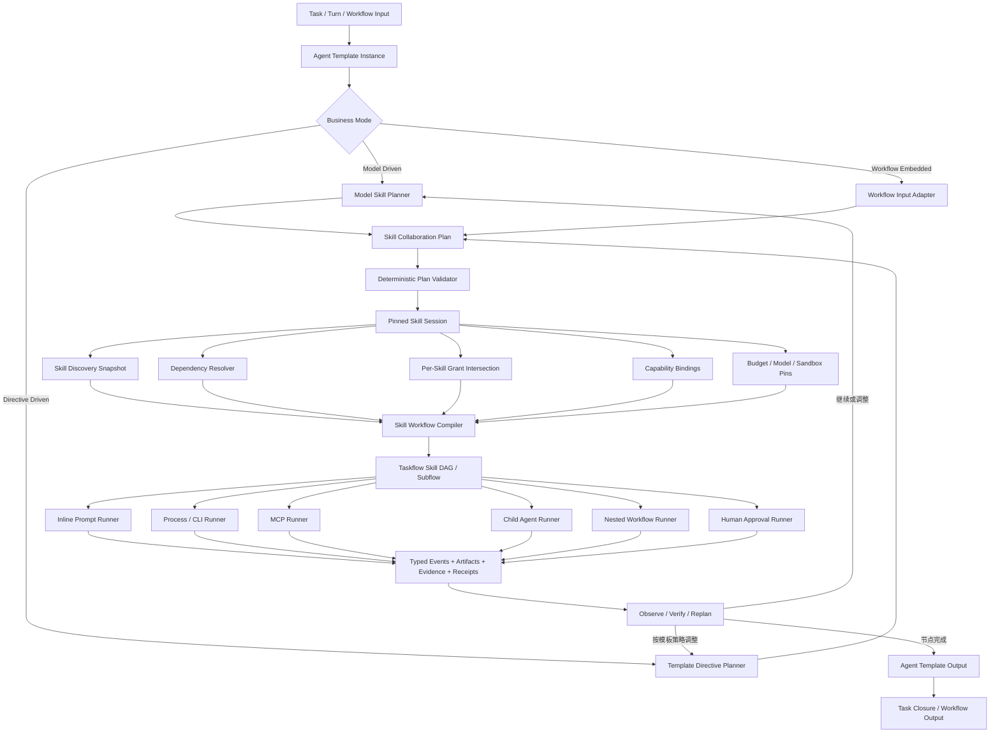

这个目标是合理的。最终 AF 的 Agent Template 不应只是一种 ReAct Loop，而应当是同一个 Skill Collaboration Kernel 上的三种业务模式：

1. 模型驱动 Agent：模型动态选择、组合和调整 Skills。
2. 指令驱动 Agent：Agent Template/业务规则预先规定 Skill 角色和协作策略。
3. Workflow 嵌入模式：Agent Template 作为普通 Workflow Node/Subflow 使用。

三种模式必须共享同一套 Skill 发现、权限、Runner、事件和验收语义，不能发展成三条独立实现。

## 1. 建议的最终架构



核心设计可以概括为：

> 多种规划方式，一个确定性 Skill 执行内核；多种宿主方式，一个 Agent Template 契约。

## 2. 三种业务模式

### 2.1 模型驱动模式

适合开放式研究、代码分析、复杂排障和用户目标不完全结构化的任务。

执行过程：

```text
理解任务
→ 检索 Top-K Skills
→ 模型提出 SkillCollaborationPlan
→ 确定性验证
→ 编译 Taskflow DAG
→ 执行
→ 观察中间结果
→ 模型决定继续、替换、追加或重排 Skill
→ Assurance
→ 输出候选结果
```

模型可以决定：

- 使用哪些 Skills；
- 每个 Skill 的角色；
- 哪些节点并行；
- 哪些节点依赖前序结果；
- 是否启动 Child Agent；
- 是否需要 verifier Skill；
- 失败后采用哪个替代 Skill；
- 是否需要向用户澄清。

但模型不能决定：

- 擅自扩大权限；
- 绕过依赖版本约束；
- 把 Unknown/Write effect 当作只读；
- 跳过必要审批；
- 直接宣告任务已经 verified；
- 修改已经 pin 的执行输入；
- 把 Skill 自报完成当成任务完成。

建议模式名：

```cpp
AgentBusinessMode::ModelDriven
```

### 2.2 Agent 指令驱动模式

适合固定科研流程、生产数据处理、验收、报告生成和组织级 SOP。

Template 预先声明：

- Skill 角色；
- 必选和可选 Skills；
- 阶段顺序；
- 并行规则；
- 允许模型自由选择的槽位；
- 失败回退；
- verifier；
- 用户审批点；
- 完成条件。

例如：

```yaml
apiVersion: agent.taskflow/template/v1
kind: AgentTemplate

metadata:
  name: scientific-literature-review

spec:
  mode: directive-driven

  roles:
    - id: retrieval
      type: worker
      skillSelector:
        requiredCapabilities:
          - literature-search
      cardinality:
        min: 1
        max: 2

    - id: synthesis
      type: synthesizer
      skill: scientific-writing

    - id: verification
      type: verifier
      skill: citation-verifier

  flow:
    - parallel:
        - role: retrieval
        - role: retrieval
    - role: synthesis
      needs: [retrieval]
    - role: verification
      needs: [synthesis]

  policies:
    modelMayAddSkills: true
    modelMayReplaceOptionalSkills: true
    modelMayReplaceRequiredSkills: false
    requireApprovalForWrites: true
    requireVerifier: true
```

这不是完全静态 Workflow。它允许 Template 给模型留下受控决策槽：

```yaml
skillSelector:
  requiredCapabilities:
    - geospatial-analysis
  chooseBy: model
  candidates:
    - geopandas
    - postgis-analysis
    - remote-sensing-analysis
```

因此指令驱动模式应是：

> 模板规定业务骨架，模型只在被授权的选择空间内决策。

建议模式名：

```cpp
AgentBusinessMode::DirectiveDriven
```

### 2.3 Workflow 嵌入模式

Agent Template 应当可以作为普通 Workflow Node 使用：

```cpp
auto agent = builder.create_agent(
    "ResearchAgent",
    AgentTemplateRef{"scientific-literature-review", "v3"},
    {
        {"task", "user_request"},
        {"dataset", "input_dataset"},
        {"constraints", "policy_constraints"}
    },
    {
        {"answer", "final_answer"},
        {"artifacts", "artifact_refs"},
        {"evidence", "evidence_refs"},
        {"receipt", "execution_receipt"}
    });
```

也应允许作为 Subflow：

```text
Production Workflow
  → deterministic preprocessing
  → Agent Template Subflow
  → deterministic validation
  → human approval
  → artifact publishing
```

嵌入后必须满足：

- Workflow 传入的权限是上限；
- Agent Template 不能自行扩权；
- Workflow 的 deadline/cancel 向下传播；
- Agent 内部 Skill DAG 可并行；
- Agent 输出必须是 typed output；
- Agent `model-final` 不自动结束宿主 Workflow；
- Workflow checkpoint 必须引用 Agent Template checkpoint；
- Workflow restart 可以 attach/resume Agent 执行；
- Agent 内部事件映射到宿主 Workflow event stream；
- Agent Template revision、Skill lock、model profile 和 deployment generation 都进入 invocation manifest。

建议模式名不是第三种 planner，而是宿主形式：

```cpp
AgentHostingMode::Standalone
AgentHostingMode::Conversation
AgentHostingMode::WorkflowNode
AgentHostingMode::WorkflowSubflow
AgentHostingMode::RemoteA2A
```

业务模式和宿主模式应正交。

## 3. Agent Template 的核心契约

建议定义：

```cpp
struct AgentTemplate {
    AgentTemplateIdentity identity;
    AgentBusinessMode business_mode;

    InputSchema input_schema;
    OutputSchema output_schema;

    SkillSelectionPolicy skill_policy;
    SkillCollaborationPolicy collaboration_policy;
    ModelPlanningPolicy planning_policy;

    PermissionPolicy permissions;
    BudgetPolicy budgets;
    RecoveryPolicy recovery;
    ApprovalPolicy approvals;
    AssurancePolicy assurance;

    std::vector<AgentRoleDefinition> roles;
    std::optional<SkillWorkflowTemplate> workflow_skeleton;

    CompletionContract completion;
};
```

Template 实例化后生成不可变快照：

```cpp
struct AgentTemplateInvocation {
    InvocationIdentity identity;

    PinnedAgentTemplate template_ref;
    PinnedSkillSession skill_session;
    PinnedModelProfiles models;
    CapabilitySnapshot capabilities;
    EffectivePermissionEnvelope permissions;
    ResourceBudget budget;
    ContextProjectionRef context;
    DeploymentManifestRef deployment;

    AgentHostingMode hosting_mode;
};
```

## 4. Skill 协作计划必须成为正式类型

不能把协作计划只放在 Prompt 文本里。

```cpp
struct SkillCollaborationPlan {
    PlanIdentity identity;
    std::vector<SkillPlanNode> nodes;
    std::vector<SkillPlanEdge> edges;

    std::vector<ApprovalPoint> approvals;
    std::vector<VerificationNode> verifiers;

    BudgetAllocation budget;
    OutputAssemblyPlan output_assembly;

    PlanRevision revision;
    Digest digest;
};
```

节点至少包含：

```cpp
struct SkillPlanNode {
    std::string node_id;
    SkillRole role;

    SkillSelector selector;
    std::optional<PinnedSkillRef> resolved_skill;

    SkillRunnerKind runner;
    json input_mapping;
    OutputContract output;

    PermissionEnvelope requested_permissions;
    EffectClass effect;

    RetryPolicy retry;
    FailurePolicy failure;
    std::optional<std::string> idempotency_key;

    bool model_replannable;
};
```

## 5. 模型驱动与指令驱动如何统一

两者的区别只能存在于“计划从哪里来”。

```text
ModelDriven:
  ModelSkillPlanner → candidate plan

DirectiveDriven:
  TemplateDirectivePlanner → candidate plan

两者之后完全相同：
  PlanValidator
  → SkillSession pin
  → WorkflowCompiler
  → Taskflow execution
  → Runner
  → Receipt
  → Assurance
```

统一接口：

```cpp
class SkillPlanProvider {
public:
    virtual SkillCollaborationPlan propose(
        const AgentPlanningContext& context,
        const SkillCandidateSet& candidates
    ) = 0;

    virtual SkillCollaborationPlan revise(
        const SkillCollaborationPlan& current,
        const SkillObservationSet& observations
    ) = 0;
};
```

实现：

```cpp
class ModelSkillPlanProvider;
class DirectiveSkillPlanProvider;
class HybridSkillPlanProvider;
class FixedWorkflowPlanProvider;
```

推荐默认采用 `HybridSkillPlanProvider`：

- Template 规定不变量和强制节点；
- 模型补充开放槽位；
- Validator 负责最后裁决。

## 6. 多 Skill 的协作模式

Agent Template 至少应支持以下协作模式：

| 模式 | 示例 |
|---|---|
| Sequential | 搜索 → 分析 → 写作 → 校验 |
| Parallel Map | 多数据源或多个专业视角并行调查 |
| Map-Reduce | 多 Skill 独立产出，Synthesizer 合并 |
| Supervisor-Worker | Coordinator 分配任务给多个 Skill/Agent |
| Debate | 多个分析 Skill 给出竞争结论，Judge 决策 |
| Pipeline with Verifier | 每个关键阶段后进行验收 |
| Conditional Branch | 根据数据类型、置信度或失败原因选择 Skill |
| Iterative Refinement | 生成 → 验证 → 修复 → 再验证 |
| Human-in-the-loop | 在数据写入、外发或高成本执行前审批 |
| Nested Agent | 某个 Skill 节点启动独立 Child Agent |
| Remote Collaboration | 某个节点通过 A2A 交给远端 Agent |

## 7. Runner 应统一

最终不应让 Agent Template 直接知道 script、MCP、child task 的实现细节。

```cpp
enum class SkillRunnerKind {
    InlinePrompt,
    LocalCapability,
    SandboxedProcess,
    Cli,
    Mcp,
    ChildAgent,
    NestedWorkflow,
    HumanApproval
};
```

所有 Runner 实现同一生命周期：

```text
admit
→ prepare
→ start/attach
→ observe
→ checkpoint
→ cancel
→ reconcile
→ finalize receipt
```

这样：

- Agent 模式可调用；
- Workflow 节点可调用；
- crash 后可恢复；
- UI 可统一展示；
- approval 和 cancellation 可以统一；
- runner 可以替换而不改变 Agent Template。

## 8. Context 和 Memory 设计

多个 Skills 不能共享一个无限增长的 Prompt。

每个节点应获得独立投影：

```cpp
struct SkillNodeContextProjection {
    TaskContextRef task;
    RelevantConversationSlice conversation;
    std::vector<ArtifactRef> inputs;
    std::vector<EvidenceRef> evidence;
    PinnedMemoryView memory;
    PinnedSkillInstructions instructions;
    CapabilitySnapshot capabilities;
    BudgetRemaining budget;
};
```

需要遵守：

- Coordinator 只拿摘要和引用；
- Worker 只拿自己的任务切片；
- Verifier 不应默认看到生成者的隐藏推理；
- Skill 间通过 typed artifact/evidence 交换；
- 大结果放 ObjectStore，只传 digest/ref；
- Child Agent 使用独立 transcript；
- Memory write 先进入 candidate，不能由任意 Skill 直接污染长期记忆。

## 9. 动态重规划边界

模型驱动模式需要动态重规划，但不能每个 heartbeat 都调用模型。

触发条件应类型化：

- SkillUnavailable
- DependencyMissing
- PermissionDenied
- ApprovalRejected
- ToolFailedRetriable
- ToolFailedPermanent
- EvidenceInsufficient
- VerificationFailed
- BudgetThresholdReached
- UserChangedRequirement
- NewArtifactAvailable
- StagnationDetected

重规划必须受以下限制：

- 已提交的 effect 不得假装不存在；
- 已验证 artifact 不能无理由降级；
- 不允许扩大权限；
- 不允许提高预算上限；
- required Template node 不能删除；
- plan revision 必须 CAS；
- 新 plan 必须重新经过 validator；
- 旧的依赖和 capability snapshot 需要重新 pin。

## 10. 最终对外 API

建议最终用户只面对两个核心构造：

```cpp
AgentTemplateRegistry registry;
AgentRuntime runtime;
```

Standalone：

```cpp
auto result = runtime.run(
    AgentTemplateRef{"scientific-research-agent", "v2"},
    input,
    AgentRunOptions{
        .business_mode = AgentBusinessMode::ModelDriven,
        .hosting_mode = AgentHostingMode::Conversation
    }
);
```

指令驱动：

```cpp
auto result = runtime.run(
    AgentTemplateRef{"gnss-ro-validation-pipeline", "v4"},
    input,
    AgentRunOptions{
        .business_mode = AgentBusinessMode::DirectiveDriven
    }
);
```

Workflow：

```cpp
builder.create_agent_node(
    "GNSSValidationAgent",
    AgentTemplateRef{"gnss-ro-validation-pipeline", "v4"},
    input_bindings,
    output_bindings
);
```

三种调用最后都进入同一个：

```text
AgentRuntime
→ TemplateResolver
→ SkillPlanProvider
→ PlanValidator
→ SkillSession
→ SkillWorkflowCompiler
→ Taskflow Executor
→ Runner Registry
→ Closure
```

## 11. 对当前 AF 的具体改造映射

当前模块无需推倒重来：

| 现有模块 | 目标角色 |
|---|---|
| `SkillRegistry` | Skill Discovery + immutable snapshot |
| `SkillLoader` | Skill instruction/resource loader |
| `SkillRuntime` | Skill invocation admission/finish |
| `SkillCapabilityRuntime` | Capability binding |
| `SkillWorkflowRuntime` | Workflow compiler/executor基础 |
| `SkillPolicyEngine` | per-Skill grant intersection |
| `ChildTask` | ChildAgentRunner |
| `ToolBus` | Capability execution backend |
| `tool_runtime` | durable Runner lifecycle |
| `LongTaskWorkflow` | wait-observe-replan |
| `ConversationEngine` | conversation hosting |
| `GraphExecutor` | Workflow hosting |
| `TaskClosureController` | verified completion |
| `Approval/Assurance` | HITL 与验收 |

需要新增或重构的核心只有：

1. `AgentTemplate` contract/registry；
2. `Skill` 统一模型工具；
3. `ActiveSkillSession`；
4. `SkillCandidateRetriever`；
5. `SkillPlanProvider`；
6. `SkillCollaborationPlanValidator`；
7. `SkillWorkflowCompiler`；
8. `SkillRunner` SPI/registry；
9. `AgentRuntime` 统一入口；
10. `AgentTemplateNode` Workflow adapter。

## 12. 推荐实现阶段

### AT0：冻结契约

冻结：

- AgentTemplate
- SkillCollaborationPlan
- ActiveSkillSession
- SkillRunner
- typed artifact/evidence
- hosting/business mode

### AT1：统一单 Skill 路径

先把当前：

```text
Registry match
→ active_skill_id
→ prompt injection
```

改为：

```text
CandidateRetriever
→ 单节点 CollaborationPlan
→ SkillSession
→ InlinePromptRunner
```

行为不变，但进入新内核。

### AT2：统一所有 Runner

接入：

- process
- CLI
- MCP
- capability
- nested workflow
- child Agent

### AT3：指令驱动 Template

支持固定 DAG、角色、Skill selector 和模型选择槽。

### AT4：模型驱动 Planner

支持 Top-K、动态计划、validator 和有限重规划。

### AT5：Workflow Node/Subflow

把同一个 Agent Template Runtime 嵌入 GraphBuilder。

### AT6：多 Skill 产品体验

增加：

- 协作计划展示
- 节点状态
- 权限审批
- 失败替换
- artifact/evidence
- resume/cancel

### AT7：生产认证

覆盖 crash、dependency drift、MCP disconnect、权限泄漏、并行冲突和真实 provider。

最终目标可以正式表述为：

> AF Agent Template 是一个可版本化、可恢复、可嵌入的多 Skill Agent 业务模板。它既支持 Claude Code 风格的模型驱动 Skill/Agent 协作，也支持组织级指令驱动协作，并可将相同执行语义嵌入 Taskflow Workflow Node 或 Subflow；所有模式统一经过确定性的依赖、权限、Runner、Effect、Artifact、Assurance 与 Closure 内核。

这应当作为后续 AF Agent Template 的总设计约束。