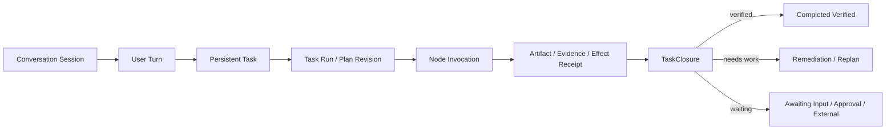

结论先说：`.agent-framework` 中的记录表明，AF 当前最大的长时间工作问题不是“单次执行不够久”，而是：

> Turn、Harness、真实用户任务三个状态机没有统一；任务可以在 Harness 中显示 completed，但对话已经 failed，或者任务没有任何最终输出；异常后还会留下永久 running 的孤儿任务。

因此现在的完成率数字明显高估。AF 已经拥有比 CC 更严格的 TaskClosure、Evidence、Remediation 和 durable workflow 基础，但这些能力尚未接入当前 Web/TUI 的真实交互任务主链。

## 一、数据库总体情况

`.agent-framework` 下共有 5 个数据库：

| 数据库 | 内容 | 记录情况 |
|---|---|---:|
| `imgui_agent_demo-conversation.sqlite3` | ImGui 对话 | 12 个 Turn |
| `tui_agent_demo-conversation.sqlite3` | TUI 对话 | 5 个 Turn |
| `tui_agent_demo-harness.sqlite3` | TUI Harness | 5 个任务 |
| `web_ui_demo-conversation.sqlite3` | Web 对话 | 82 个 Turn |
| `web_ui_demo-harness.sqlite3` | Web Harness | 61 个任务 |

总计：

- 99 个用户 Turn；
- 66 个进入 Harness；
- 57 个 Harness 标记为 completed；
- 9 个 Harness 仍标记为 running。

但 Conversation 的真实状态是：

| 入口 | completed | failed | running |
|---|---:|---:|---:|
| ImGui | 12 | 0 | 0 |
| TUI | 0 | 5 | 0 |
| Web | 26 | 54 | 2 |
| 合计 | 38 | 59 | 2 |

也就是说：

- Harness 表面完成率：`57 / 66 = 86.4%`
- Conversation Turn 完成率：`38 / 99 = 38.4%`
- 如果要求“产生了可见 assistant 输出”，实际完成率还要更低。

## 二、各批任务的状态

### 1. ImGui：12 个任务全部完成

包括：

- 问候、能力介绍；
- 北京介绍；
- 制作网页；
- 数学计算；
- 北京—西安距离、步行、高铁；
- 当前时间。

耗时范围：

- 最短：1.56 秒；
- 最长：124.88 秒；
- 主要长任务：
  - 北京介绍：67.43 秒；
  - 北京到西安距离：68.22 秒；
  - 高铁信息：66.25 秒；
  - 时间查询：124.88 秒；
  - 制作网页：116.34 秒。

问题：

- “制作成一个精美网页”虽然 Turn completed，但最终消息只停留在“让我先了解文件系统环境”，数据库中没有最终网页交付证明。
- 因此这里的 completed 仍然主要表示模型 EndTurn，不表示交付物完成。

### 2. Web 早期非 Harness：21 个任务

状态：

- completed：17
- failed：4

失败任务：

| 任务 | 耗时 | 错误 |
|---|---:|---|
| 开始写吧 | 29.67 秒 | `json.exception.type_error.306` |
| 开始吧 | 94.21 秒 | 同上 |
| 结合 GNSS 掩星分析 | 103.50 秒 | 同上 |
| 你有哪些 skills | 89.07 秒 | 同上 |

共同错误：

```text
cannot use value() with null
```

这类失败说明某些工具或模型返回 JSON `null` 后，代码直接调用了 `json.value()`。执行耗时已经达到 1–2 分钟，但没有可靠的异常边界和 partial result 保存。

### 3. Web 第一批 Harness：大量“Harness 完成、Conversation 失败”

这一批典型任务包括：

- 天气、台风搜索；
- 台风路径和强度绘图；
- 论文撰写；
- GNSS 掩星技术报告；
- 坐标转换；
- Skills 调研；
- 小红书热点；
- 出行报告；
- 代码分析。

数据库出现了最严重的状态分叉：

| Conversation | Harness | 数量 |
|---|---|---:|
| failed | completed | 43 |
| failed | running | 7 |
| running | running | 2 |
| completed | completed | 9 |

也就是说，43 个任务的 Harness 声称完成，但 Conversation 明确失败。

失败内容基本统一为：

```text
model_turn_cannot_verify_task
```

这来自 [types.cpp](/home/Mapoet/projects/taskflow/agent_framework/src/conversation/types.cpp:94)：

```cpp
if (v.task_completion_verified)
    e.push_back("model_turn_cannot_verify_task");
```

历史执行路径中，适配器曾让 ModelTurnOutcome 携带 verified 标志，ConversationEngine 将其识别为契约违规并转为 ProviderError，见 [conversation_engine.cpp](/home/Mapoet/projects/taskflow/agent_framework/src/conversation/conversation_engine.cpp:116)。

近期源码已经强制将该字段置为 false，见 [harness_supported_runtime.cpp](/home/Mapoet/projects/taskflow/agent_framework/src/conversation/harness_supported_runtime.cpp:64)，所以最近的 Web Turn 已不再大面积出现这个错误。

### 4. 当前 9 个永久 running 的 Web Harness

这 9 个任务全部停在：

```text
state       = running
next_stage  = execution
outbox      = execution/pending
revision    = 8
```

具体如下：

| 任务 | Conversation 状态 | 停滞时间 |
|---|---|---:|
| 补充更多台风数据 | failed | 约 42.14 小时 |
| 请继续 | failed | 约 42.08 小时 |
| 直接基于历史记忆…… | failed | 约 41.96 小时 |
| 继续编写 | failed | 约 41.91 小时 |
| 天津去上海行程规划 | running | 约 39.09 小时 |
| 床单内容分析 | failed | 约 35.11 小时 |
| 深度分析最近几个…… | running | 约 35.04 小时 |
| 去上海，14号 | failed | 约 34.89 小时 |
| 需要 | failed | 约 1.23 小时 |

这些任务不是还在后台工作，而是孤儿 checkpoint。

共同模式：

```text
Harness 写入 execution outbox pending
→ 调用模型/工具
→ 模型、工具或 JSON 处理抛异常
→ Conversation 结束或失败
→ Harness 没有提交 stage_result
→ 没有 worker/lease/sweeper 将 pending 转为 failed/reconciling
→ 永久显示 running
```

从事件数量也能看到：

- `outbox_prepared`：452
- `stage_result`：443

正好差 9 条，对应 9 个永久 running 任务。

这是非常强的数据库级证据。

## 三、近期“长任务”批次的完成情况

最近一组任务是：

1. 写排序测试代码并分析性能；
2. “需要”；
3. “继续”；
4. “继续，执行到任务完成”；
5. “请生成可视化的图”；
6. “继续”；
7. “现在结果怎么样了？”

Harness 全部记录为 completed，耗时分别大致为：

| Turn | Harness 耗时 | Assistant 最终消息 |
|---|---:|---|
| 写排序测试代码 | 26.16 秒 | 有 |
| 需要 | 59.74 秒 | 无 |
| 继续 | 98.15 秒 | 无 |
| 执行到任务完成 | 55.84 秒 | 无 |
| 生成可视化图 | 37.40 秒 | 无 |
| 继续 | 54.13 秒 | 无 |
| 结果怎么样 | 8.30 秒 | 有 |

这暴露出第二个重要问题：

> Harness completed 不要求存在非空用户交付结果。

当前 Execution Stage 只判断：

```cpp
model.reason == EndTurn
```

并不要求：

- `candidate_answer` 非空；
- 文件或图像真实存在；
- ArtifactRef 可读取；
- 接受标准已满足；
- 前一个 Turn 的任务仍在持续；
- 用户要求的最终输出已经交付。

见 [harness_turn_adapter.cpp](/home/Mapoet/projects/taskflow/agent_framework/src/conversation/harness_turn_adapter.cpp:79)。

所以这五个“继续”Turn 可能确实运行了几十秒，但没有产生 assistant message，仍被记录为 completed。

## 四、为什么 Harness 完成度失真

当前交互 Harness 的多数阶段是占位实现。

### Cognition 只是固定两步计划

```text
respond → handoff
```

接受标准只有：

```text
a candidate response is produced
```

见 [harness_turn_adapter.cpp](/home/Mapoet/projects/taskflow/agent_framework/src/conversation/harness_turn_adapter.cpp:52)。

但代码没有真正检查 candidate 是否非空。

### Assurance 和 Judge 固定成功

Assurance 直接：

```cpp
out.acceptance_decision = "accepted";
out.outcome = Succeeded;
```

同时又声明：

```text
scope = response_pipeline_only
task_verification = false
authority = non_authoritative
```

见 [harness_turn_adapter.cpp](/home/Mapoet/projects/taskflow/agent_framework/src/conversation/harness_turn_adapter.cpp:98)。

Judge 同样是非权威固定成功。

因此这个 Harness 的 completed 实际含义是：

> 交互响应管线结构上跑到了最后一个阶段。

不是：

> 用户请求已经完成。

源码自己也承认这一点：

```cpp
snapshot.task_closure_state =
    "execution_completed_unverified";
snapshot.overall_status = Running;
snapshot.summary =
    "Interactive execution completed; task closure not evaluated";
```

见 [harness_turn_adapter.cpp](/home/Mapoet/projects/taskflow/agent_framework/src/conversation/harness_turn_adapter.cpp:149)。

问题是数据库 checkpoint 的顶层 `state` 仍叫 `completed`，UI/统计很容易将其误读为任务完成。

## 五、持续时间指标的问题

Web 任务响应时长统计：

| 指标 | 时长 |
|---|---:|
| 最短 | 1.31 秒 |
| 中位数 | 12.26 秒 |
| 平均 | 37.31 秒 |
| P90 | 94.21 秒 |
| 最大 | 359.34 秒 |

Harness 时长：

| 指标 | 时长 |
|---|---:|
| 中位数 | 8.54 秒 |
| 平均 | 27.43 秒 |
| P90 | 55.84 秒 |
| 最大 | 359.33 秒 |

这些时长不能直接解释为“工作持续时间”，因为混合了：

- LLM 等待；
- MCP/网络超时；
- 工具执行；
- 用户不可见的空 Turn；
- 异常前阻塞；
- 真正的分析和生成时间。

目前缺少分解指标：

```text
queue_wait
model_time
tool_time
approval_wait
external_wait
active_compute
checkpoint_time
verification_time
idle/stalled
```

因此一个 359 秒任务可能是：

- 真正深度工作；
- 网络超时；
- 工具死等；
- 连续失败重试；
- 仅等待模型。

数据库无法区分。

## 六、AF 已有长任务能力为什么没有发挥作用

AF 实际已经有比较完整的 LongTaskWorkflow：

- durable checkpoint；
- DAG scheduling；
- InvocationStore；
- timer/lease worker；
- budget deviation；
- stall detection；
- meaningful evidence；
- approval/input trigger；
- replan；
- reconcile；
- effect receipt；
- fencing token。

例如 [long_task_workflow.cpp](/home/Mapoet/projects/taskflow/agent_framework/src/tool_runtime/long_task_workflow.cpp:239) 已经能按事件识别：

- integrity failure；
- failure；
- approval/input；
- meaningful evidence；
- stall；
- budget deviation。

[long_task_workflow.cpp](/home/Mapoet/projects/taskflow/agent_framework/src/tool_runtime/long_task_workflow.cpp:504) 也具备 Invocation reconcile。

TaskClosure 更严格：

- Mandatory criteria；
- Evidence + Artifact；
- verifier identity；
- revision freshness；
- no-progress；
- remediation；
- completed verified。

见 [task_closure.cpp](/home/Mapoet/projects/taskflow/agent_framework/src/harness/task_closure.cpp:214)。

真正的问题是：

```text
Web/TUI Conversation
    → Lightweight HarnessTurnAdapter
    → 单次 Graph/AgentLoop
    → 非权威占位 Assurance/Judge
```

没有进入：

```text
Persistent Task
    → LongTaskWorkflow
    → durable Invocation
    → observe/reconcile/replan
    → ProductionTaskRuntime
    → TaskClosureController
```

所以 AF 的“长任务能力”目前更多存在于库和测试中，而不是当前用户实际使用的 Web/TUI 任务路径中。

## 七、与 Claude Code 对比

### CC 做得更好的部分

#### 1. 稳定 Session identity

CC 用稳定 session ID 和 JSONL parent chain 表达持续会话：

- `--continue`
- `--resume`
- `--fork-session`
- `--resume-session-at`

一个“继续”不会自然变成完全独立的任务。

AF 当前每次用户输入都会生成新的：

```text
turn_id
harness_id
run_id
```

缺少稳定的 active task identity。

#### 2. 后台任务是一等对象

CC 有：

- `LocalAgentTask`
- `TaskOutputTool`
- `TaskStopTool`
- foreground/background 切换
- task ID
- 进度读取
- 任务停止
- 子 Agent 独立上下文

AF 虽有 ChildTask、LongTaskWorkflow 和 Process Tool，但没有统一暴露到当前 Conversation UX。

#### 3. 长输出不会全部塞回上下文

CC 会：

- 截断大工具结果；
- 把完整结果外置到文件；
- 用引用和摘要回送模型；
- 自动 compact；
- compact 后继续同一 Session。

AF 有 ContextBudget、Memory、Artifact/ObjectStore，但当前交互任务没有形成同等稳定的自动 compact → resume 链。

#### 4. 用户输入可以 steering，而不是创建平行孤儿任务

CC 长时间执行中，用户可：

- 补充要求；
- 中断；
- 停止任务；
- 查看 TaskOutput；
- 继续当前上下文。

AF 已有 `/cancel`、`/replace`、`/next` 等输入分类，但当前数据库说明普通“继续”仍作为新 Turn/Harness 处理，没有绑定原始 Task。

### AF 理论上更强的部分

AF 的确定性能力优于 CC：

- AcceptanceContract；
- strong evidence；
- Artifact lineage；
- verifier；
- remediation；
- reverification；
- TaskClosure authority；
- durable DAG；
- effect receipt；
- fencing/reconcile。

CC 更擅长“持续做事和恢复上下文”，但它的模型 EndTurn 仍不等价于严格 verified completion。

最佳方向不是复制 CC，而是：

> 保留 AF 的确定性完成权威，同时补齐 CC 的 Session、Task、background、context compact、progress 和 steering 工程。

## 八、推荐的目标运行模型

建议把三个状态彻底分开：



### Session

负责：

- 消息历史；
- compact；
- resume/fork；
- 用户输入；
- active task 指针。

### Turn

只表示一次人机交互，不拥有任务完成权威。

### Task

跨多个 Turn 持续存在：

```text
task_id = stable
active_run_id = mutable
plan_revision = monotonic
```

“继续”“需要”“生成图”默认附加到 active task，而不是创建新任务。

### Invocation

每个工具、Agent、Skill、Workflow 节点有稳定 invocation ID，可 attach/reconcile。

### Closure

只有 TaskClosureController 可以产生：

- `completed_verified`
- `completed_with_limitations`
- `needs_user_input`
- `blocked_external`
- `stagnated`
- `failed_execution`
- `failed_verification`
- `cancelled`

## 九、优化优先级

### P0：立即修复状态真实性

1. 将交互 Harness 的 `completed` 重命名为 `execution_completed_unverified`。
2. UI 不得把 Harness completed 显示为任务完成。
3. Execution Stage 成功必须至少满足：
   - 非空 candidate，或
   - 有 ArtifactRef，或
   - 有明确的 waiting/continuation state。
4. Assistant message 为空时不能进入 completed。
5. Conversation failed 时，必须同步终止或挂起对应 Harness。

### P0：清理 orphan running 的机制

增加启动和周期性 sweeper：

```text
扫描 execution/pending
→ 检查 lease/heartbeat
→ 查询 InvocationStore
→ attach/reconcile
→ 成功则提交 stage_result
→ 失败则 failed
→ 副作用未知则 manual_review
```

必须为 outbox pending 增加：

- owner；
- lease expiry；
- last heartbeat；
- invocation ID；
- provider operation ID；
- retry count；
- idempotency key。

不能让任务永久 running。

### P0：统一 Task identity

新增：

```text
conversation_active_tasks
task_id
root_turn_id
current_turn_id
current_run_id
parent_task_id
status
closure_state
```

普通“继续”应执行：

```text
resolve active task
→ append requirement
→ revise plan
→ resume task
```

### 2026-08-15 AF-SLT 实施复核

上述目标已完成主要生产接线：active Task 与 TaskRunLink durable 化；status 为只读控制路径；
复杂任务由 LLM classifier + deterministic gate 路由到独立 LongTaskWorkflow；production builder
不接受 scripted execution callback，并在启动时执行 orphan fencing 与到期 timer；Operations
按 invocation 独立 cursor 实时投影，四端使用 conversation/task/run/turn 同源身份。

本地证据为 Phase 4 offline **90/90 PASS**、2000-cycle recovery soak PASS，以及真实 Web binary
截图 `/tmp/af-slt6-web-final.png`。当前环境未配置真实 LLM provider 凭据，因此 5–10 分钟
ProviderLive Golden Task、MCP late-result/reattach 仍为 mandatory `NotCertified` cell；不得把
fixture、Offline soak 或 UI demo 记为该项通过。

而不是新建独立 Harness。

### P1：把 LongTaskWorkflow 接到 Conversation

对以下任务自动切换长任务模式：

- 预计超过 30–60 秒；
- 多工具；
- 文件/图表/报告交付；
- 多 Skill；
- ChildAgent；
- 外部等待；
- 用户明确说“持续执行”“直到完成”。

执行链应为：

```text
Conversation
→ TaskClassifier
→ AgentTemplate
→ LongTaskWorkflow
→ durable runner
→ TaskClosure
→ Conversation projection
```

### P1：建立真实进度模型

不要使用“已经运行 120 秒”代表完成度。

进度必须基于可验证里程碑：

```text
criteria_closed / criteria_total
artifacts_produced
evidence_collected
nodes_terminal / nodes_total
remaining_blockers
information_gain
last_progress_at
```

建议 UI 同时展示：

- 活跃工作时间；
- 等待时间；
- 阻塞时间；
- 当前阶段；
- 最近进展；
- 下一步；
- 完成标准；
- 是否 verified。

### P1：补齐 CC 式 context endurance

1. 基于 token 水位自动 compact。
2. 保留：
   - Task contract；
   - plan revision；
   - unresolved criteria；
   - artifact/evidence refs；
   - active invocation IDs；
   - permission decisions；
   - latest progress。
3. 大型工具输出外置到 ObjectStore/ArtifactStore。
4. 模型上下文只保存摘要和 typed refs。
5. compact 前后用 digest 验证关键任务状态没有丢失。

### P1：后台任务与用户 steering

提供统一工具/API：

- `task_start`
- `task_status`
- `task_output`
- `task_continue`
- `task_cancel`
- `task_attach`
- `task_replan`

用户输入分类应基于 active task：

- “继续” → resume
- “再加一个图” → revise requirement
- “先停一下” → suspend
- “换方案” → replan
- “现在怎么样” → status，不创建执行 Turn
- “取消” → cancel + reconcile

### P2：模型驱动的自适应长任务循环

AF 不能只靠固定 `max_iterations`。

建议循环：

```text
Observe
→ 计算 information gain
→ 更新 criteria closure
→ 判断 blocker/stall/budget
→ continue / replan / ask / stop
```

停止条件应是：

```text
verified completion
OR needs user input
OR external blocker
OR budget exhausted
OR bounded stagnation
OR cancelled
```

模型 EndTurn 只能表示“本轮没有更多输出”，不能结束 Task。

## 十、应该增加的验收测试

至少增加以下 Golden Tasks：

1. 5 分钟、多工具、生成文件和图表的长任务；
2. 执行中用户连续发送“继续”和补充要求；
3. 模型调用中进程被 kill，重启后恢复；
4. MCP 调用成功但本地未收到结果，reconcile 不重复副作用；
5. Approval 等待 10 分钟后恢复；
6. context compact 两次后仍保持任务标准；
7. 某节点无信息增益，自动 replan；
8. 最终文件缺失时禁止 completed；
9. Assistant 输出为空时禁止 completed；
10. Conversation failed 时禁止 Harness 留在 running。

关键指标建议：

| 指标 | 目标 |
|---|---:|
| Orphan running rate | 0 |
| Resume success rate | >99% |
| Duplicate side-effect rate | 0 |
| Empty-output completed rate | 0 |
| Harness/Conversation state inconsistency | 0 |
| Verified completion rate | 独立统计，不与 EndTurn 混合 |
| P95 time-to-first-progress | <10 秒 |
| Progress heartbeat interval | 5–15 秒 |
| Stale-task detection | <2 个 heartbeat 周期 |

最终判断：

> AF 当前已经具备构建强长任务系统的大部分底层部件，但实际 Web/TUI 路径仍是“单 Turn AgentLoop + 轻量占位 Harness”。数据库中的 9 个孤儿 running、43 个 Harness completed/Conversation failed，以及 5 个无 assistant 输出却 completed 的近期 Turn，证明长时间工作的状态、进度和完成度还没有真正闭环。优化重点应从“允许模型多跑几轮”转向“稳定 Task identity + durable invocation + progress/evidence ledger + reconcile + TaskClosure”。

本轮只读分析，没有修改数据库、任务状态或源码。
