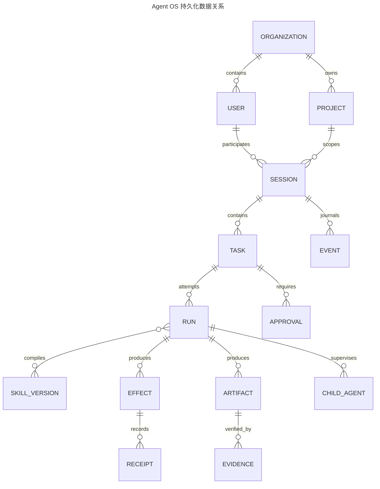
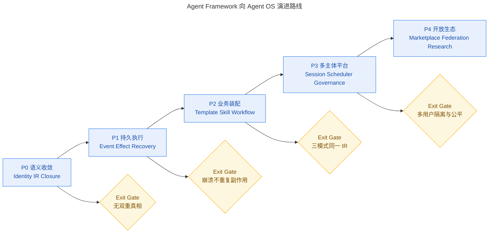

# 从 Agent Runtime 到 Agent Operating System：以 Agent Framework 为内核的可验证、持久化与多主体智能计算体系

_技术论文 · 版本 1.0 · 2026-08-17_

---

## 📋 摘要

大语言模型驱动的 Agent 正从“在一次对话中调用若干工具”的应用模式，演化为能够跨越小时、天乃至更长时间，持续接收事件、调度资源、执行外部副作用、管理子 Agent、恢复中断现场并接受人类监督的计算系统。传统 Agent Runtime 通常把模型推理循环、工具调用和对话历史视为核心，而把持久化、并发控制、恢复、授权、证据和终态判定留给外围工程。随着任务持续时间、参与者数量和外部系统复杂度增加，这种边界开始失效：模型停止生成不等于业务任务完成，工具返回成功不等于外部效果已经可恢复地提交，进程存活不等于任务仍在推进，会话可重放也不等于副作用可重放。本文提出一种以 Agent Framework（AF）为核心、吸收 DeepSeek Harness（DSH）持久 Session/Inbox/Event Log 机制，并参考 Claude Code 的 Query/Turn/Tool 生命周期和 Codex Desktop 多任务工作台的 Agent Operating System（Agent OS）构想。

本文采用源码驱动的架构综合方法，分析 AF、DSH、Claude Code 与 Codex 的能力边界，将 Agent OS 形式化为带部分可观测状态、持久事件、能力约束、资源预算和可验证终态的混合控制系统。论文给出九层目标架构和三种主要业务模式：Model-Driven Multi-Skill、Directive-Driven Agent Template 与 Workflow-Node Embedded。所有模式统一编译到版本化 Execution IR，并由具有 prepare、start、attach、observe、reconcile、cancel、compensate 与 finalize 语义的 Runner 执行。外部副作用由 OperationId、EffectReceipt、幂等键、Lease 与 Fencing 约束；最终完成仅由 TaskClosureController 基于 Acceptance Contract、Artifact、Evidence、Oracle 与审批事实授权。

在理论层面，本文将 Agent OS 的调度、恢复与闭环问题分别连接到排队论、DAG 并行计算、反馈控制、POMDP、信息论、分布式因果序、可靠性工程与形式化方法。核心判断是：未来 Agent OS 的竞争力不只来自更强的模型，而来自把概率性认知与确定性执行隔离，把 Session 的长期连续性与 Run 的执行边界分离，把“候选完成”与“验证完成”分离，并把每次改变外部世界的动作变成可追踪、可对账和可补偿的系统事实。

**关键词：** Agent Operating System；Agent Runtime；Execution IR；Task Closure；Multi-Skill；Session；Event Sourcing；POMDP；反馈控制；可靠性工程

### 图形摘要

~~~mermaid
flowchart LR
    accTitle: Agent OS graphical abstract
    accDescr: The proposed Agent OS combines persistent sessions, probabilistic cognition, deterministic execution, durable effects, and verified closure into one recoverable operating system.

    human([👤 Human intent]) --> session[💾 Persistent session]
    session --> cognition[🧠 Model and agent cognition]
    cognition --> ir[📋 Versioned Execution IR]
    ir --> runner[⚙️ Deterministic runners]
    runner --> effects[🔧 Tools and external effects]
    effects --> evidence[📦 Receipts and artifacts]
    evidence --> closure{🔍 Closure verified?}
    closure -->|No| repair[🔄 Minimal remediation]
    repair --> runner
    closure -->|Yes| terminal([✅ Completed verified])

    classDef intent fill:#ede9fe,stroke:#7c3aed,stroke-width:2px,color:#3b0764
    classDef process fill:#dbeafe,stroke:#2563eb,stroke-width:2px,color:#1e3a5f
    classDef decision fill:#fef9c3,stroke:#ca8a04,stroke-width:2px,color:#713f12
    classDef success fill:#dcfce7,stroke:#16a34a,stroke-width:2px,color:#14532d

    class human intent
    class session,cognition,ir,runner,effects,evidence,repair process
    class closure decision
    class terminal success
~~~

_图 1：Agent OS 图形摘要。概率性推理产生候选计划，确定性运行内核负责副作用，验证闭环拥有最终完成权。_

## 📚 引言

### 问题定义

早期软件 Agent 可以被描述为一个有限循环：模型读取上下文，生成文本或工具调用，运行时执行工具，将结果追加回上下文，直到模型不再请求工具。这个结构对于短时、单用户、低副作用任务是有效的。然而，当 Agent 开始修改代码库、调用云服务、提交审批、操纵数据库、运行数小时的仿真或派生多个子 Agent 时，系统面对的已经不是一个简单的语言模型循环，而是一组经典操作系统和分布式系统问题：谁拥有资源，哪些动作可以并行，崩溃后从哪里恢复，重复消息是否导致重复副作用，谁有权宣布任务完成，以及不同用户如何共享同一长期工作对象。

Codex App 的官方定位已经把产品描述为管理多个 Agent、并行任务、隔离工作树和长时间工作的“command center”，这说明用户界面层正在从单会话聊天转向并行任务监督。[^1] Claude Code 的源码则展示了成熟的 Query/Turn 循环、动态工具池、权限 Hook、流式工具调度、Transcript、Compaction 与子 Agent 隔离。DSH 进一步把 Session、Inbox、事件日志、模型表面投影和中断恢复提升为运行时对象。AF 的独特价值不在于再复制一个对话循环，而在于其 Acceptance Contract、Artifact、Evidence、Oracle、Remediation 与 TaskClosureController 已经形成可验证完成的雏形。

本文所称 Agent OS 不是把聊天产品比喻成操作系统，也不是声称 Agent 应替代 Linux、Windows 或容器编排器。它是运行在传统操作系统之上的领域操作系统：它把模型、Agent、Skill、Workflow、工具、数据、记忆、人类审批和外部效果视为受控资源，为长期智能任务提供统一的身份、调度、隔离、恢复、权限和终态语义。传统 OS 管理 CPU、内存、设备和进程；Agent OS 管理模型调用、上下文窗口、工具能力、外部效果、证据、预算和长期任务。

### 研究问题

本文围绕四个问题展开。第一，什么条件使一个 Agent Runtime 足以演化为 Agent OS，而不只是增加更多工具和页面？第二，AF、DSH、Claude Code 与 Codex 分别解决了哪一部分问题，又留下了哪些不可直接照搬的边界？第三，如何把模型驱动、Agent 指令驱动与 Workflow 节点三种业务模式统一到同一个可恢复执行内核？第四，排队论、控制论、信息论、分布式系统与可靠性工程如何为 Agent OS 提供可计算的设计原则，而不是停留在概念类比？

### 主要贡献

本文的第一项贡献是提出 Agent OS 的可检验定义：若一个系统能够为每个长期 Session 提供稳定身份，为每个 Run 提供版本化计划和资源预算，为每个外部效果提供持久操作身份和结果凭据，并且由独立闭环控制器而非模型自报结果授权最终状态，则该系统具备 Agent OS 内核的基本条件。第二项贡献是提出 AF 主导、DSH 增强、Claude Code 与 Codex 参照的技术合成路径。第三项贡献是给出统一 Execution IR、Runner 生命周期与三种业务模式。第四项贡献是建立模块与数学理论之间的映射，从而使调度、恢复、压缩、验证和安全可以被度量、推导和测试。

## 🔍 研究方法与证据边界

### 源码驱动的比较方法

研究采用静态源码审计、运行界面观察、数据模型分析和理论映射相结合的方法。AF 样本为 Taskflow 仓库 phase-4 分支提交 <code>120160dba3a67ca934e2faee627fa06d986d675f</code>；审核时存在两处用户未提交的 Clarification 相关修改，因此这些修改只作为工作树观察，不作为已发布能力。DSH 样本为提交 <code>47f943859bef60e4160492346772ded9b24f765a</code>，Claude Code 源码样本为提交 <code>3da94d5e5f2b99c9d82b0d8f09448b04775cd41f</code>。Codex 的内部实现不在本地证据范围内，本文只引用官方产品说明和实际界面观察，不反推其未公开内核。

为避免把设计声明等同于生产能力，本文采用五级证据口径。D 表示声明或文档存在，B 表示代码被实际编入目标，I 表示实现链可从入口追踪到存储或执行出口，T 表示离线或集成测试通过，P 表示真实 Provider、外部副作用、故障恢复与生产部署均有证据。任何低等级证据都不能自动升级为高等级结论。

| 系统 | 本文核心证据 | 可吸收能力 | 主要边界 |
| --- | --- | --- | --- |
| AF | C++ 源码、SQLite、CMake、测试与既有审计 | Execution IR、Runner、Assurance、TaskClosure | 统一事务链与产品 Session 仍需收口 |
| DSH | TypeScript 源码、插件结构与运行时文档 | Session/Inbox、事件日志、有序提交、恢复 | 不把 Web 可达性当作多用户认证 |
| Claude Code | 解包源码与工具执行链 | Query/Turn、Hook、权限、Compaction、子 Agent | 不是确定性 Acceptance/Oracle 引擎 |
| Codex | 官方资料与真实界面 | 多任务并行、工作树隔离、后台监督 | 不推断未公开的内部数据与调度实现 |

### 理论来源

本文把 Agent OS 看作计算系统而不是纯粹的人机交互产品，因此选择跨学科理论作为分析工具。Actor 模型提供异步主体和消息驱动计算的历史基础。[^2] Saltzer 与 Schroeder 的最小权限、完全仲裁和安全默认原则为 Capability 与审批内核提供安全约束。[^3] Lamport 的 happens-before 关系和逻辑时钟为事件因果序提供形式基础。[^4] Chandy–Lamport 快照说明如何在异步消息系统中捕获一致全局状态并检测稳定性质，这与长期任务的 checkpoint 和终态检测直接相关。[^5]

在性能方面，Little 定律连接系统内平均任务数、到达率和平均驻留时间。[^6] Borg 说明大型异构工作负载需要 admission control、资源隔离、任务打包和故障恢复策略。[^7] Work stealing 的理论界给出动态 DAG 并行调度的 work/span 关系。[^8] 在不确定决策方面，POMDP 提供了从不完全观测更新 belief 并选择动作的框架。[^9] 在上下文管理方面，Shannon 熵和率失真理论给出压缩率与可容忍信息损失之间的形式关系。[^10][^11] 在闭环方面，反馈系统理论提供状态、扰动、稳定性与 Lyapunov 函数的语言。[^12]

### 方法限制

本文是一篇架构综合与理论论文，不是对四套系统的同质化基准实验。AF、DSH 与 Claude Code 使用不同语言、产品边界和发布方式，Codex 还包含未公开实现。因此，本文能够严谨回答“哪些机制在当前源码中可见”和“目标架构应满足什么不变量”，但不能仅凭静态代码宣称吞吐量、故障恢复率或生产可靠性已经达到某一数值。后文提出的数学模型是设计和评测工具；除非已有运行数据，否则公式中的参数不代表测得的产品指标。

## 📚 技术谱系与系统定位

### Agent Framework：确定性闭环的内核候选

AF 当前最有价值的链条不是普通聊天入口，而是从任务分类、持久任务、需求与 Run，经 TaskPlanningService、Context Projection、ProductionLiveRuntime 和 Harness，进入 Assurance、Remediation 与 TaskClosureController 的路径。这个设计承认一个关键事实：模型输出、工具成功、工作流返回和 HTTP 200 都只能产生 CompletionCandidate，不能独立产生 CompletedVerified。

AF 的 Acceptance Contract 描述必须满足的条件，Artifact 是结果对象，Evidence 是支持结论的观察，Oracle 是判定方法，Remediation 是失败后最小修复，TaskClosureController 是唯一终态授权者。这一组合比一般 Agent Loop 更接近事务处理和安全关键工作流。然而，当前 AF 仍存在多个身份、计划和持久化体系并存的问题：TaskPlanningService 的 ExecutionPlan、Agent Template 的 SkillCollaborationPlan、Skill Workflow 与 Taskflow 图并未全部编译到唯一 Execution IR；Conversation 完成事实、Task 完成事实和 Effect 提交事实也可能由不同存储分别持有。

因此，AF 应被视为 Agent OS 的内核候选，而不是已经完成的 Agent OS。它拥有最难替代的“终态控制面”，但仍需让所有 CLI、Web、TUI、A2A、GraphExecutor、Skill 与 Agent 入口统一穿过同一个 RuntimeCompositionKernel、Tool Lifecycle Kernel 和 Closure 路径。

### DeepSeek Harness：持久认知与恢复层

DSH 的贡献主要位于 Session 连续性和模型表面。Session 不只是一个字符串，而是持有 Inbox、事件流、当前 Stage、消息与恢复状态的长期对象。ReactLoopAgent 的 Turn 算法持续消费输入、投影模型上下文、处理工具调用并根据中断原因决定继续、等待或结束。事件日志保存真实发生的事实，Model Surface 则为当前模型调用构造有限投影。两者分离后，压缩上下文不再意味着删除历史事实。

DSH Tool Pipeline 的另一关键思想是区分并行执行与有序提交。多个只读或无冲突工具可以并发运行，但其结果必须按可解释的顺序进入模型表面和持久事件。若运行时在部分工具完成、另一工具等待时直接返回，却没有先持久化已完成结果，恢复后就可能重复执行已经产生副作用的动作。这个问题说明 Agent 并行的难点不是创建 Future，而是 settlement、commit 与 recovery 的一致性。

DSH 还把子 Agent 当作可以延续的主体，而不是一次函数调用。这与 Actor 模型的消息驱动主体相似：主体拥有局部状态，通过消息协作，并可在调度器上独立等待。AF 应吸收这些机制，但保留自己的 Closure 平面。DSH 的 Session 结束不能自动等价为业务任务已通过 Acceptance Contract。

### Claude Code：高质量 Turn 与 Tool 交互层

Claude Code 的 QueryEngine 和显式 Turn Loop 处理流式响应、工具调用、继续原因、预算、错误、Compaction 与终止。统一 Tool Contract 先完成 schema 解析和输入验证，再执行 PreToolUse Hook、权限决策、工具调用、结果映射、PostToolUse 或 Failure Hook 以及遥测。StreamingToolExecutor 根据工具是否并发安全建立调度屏障，未声明安全的工具默认保守处理。

这种设计对 AF 的启示是：Agent OS 不能让每个入口自行实现工具调用。工具生命周期必须统一，权限检查不能只发生在 UI，流式交互也不能越过副作用账本。Claude Code 的 Transcript parent chain、工具结果外置、Compaction 边界与子 Agent 隔离解决了长期 Turn 的工程问题，但它并不提供 AF 式的独立 Acceptance/Oracle 终态。因此，Claude Code 更适合作为 Conversation 与 Tool Plane 的参考，而不是替代 AF 的 Deterministic Control Plane。

### Codex：面向人的并行监督界面

Codex 官方把每个 Agent 工作组织为项目下相互隔离的线程，并使用工作树避免多个 Agent 同时修改同一仓库时互相覆盖。[^1] 这一产品形态说明 Agent OS 的“进程管理器”必须面向人呈现：用户需要看到哪些任务在运行、等待、请求批准、失败或完成，需要在不中断其他任务的情况下切换焦点，也需要审阅差异和接管局部工作。

Codex 的参考价值主要在 Experience Plane：左侧任务列表、项目分组、单任务聚焦、后台并行、Review Queue 和 Skills/Automations。AF 不应复制其视觉外观，而应将自己更丰富的 Run、Effect、Evidence 与 Closure 语义压缩成可理解的状态，使用户能监督而不必阅读完整运维日志。

### 合成原则

四套系统不是同一条成熟度轴上的竞争者，而是 Agent OS 的四个投影。AF 给出“如何证明完成”，DSH 给出“如何持续存在并恢复”，Claude Code 给出“如何形成可靠 Turn 与工具交互”，Codex 给出“人如何监督多个长期工作”。目标系统的技术中心必须保持 AF，因为终态和副作用安全决定系统能否进入真实业务；DSH 位于第二优先级，因为没有持久 Session 和事件恢复，AF 的 Closure 只能覆盖一次进程内执行；Claude Code 与 Codex 则分别约束交互内核和体验内核。

~~~mermaid
flowchart TB
    accTitle: Four-system contribution map
    accDescr: The target Agent OS uses Agent Framework as its verified execution core, DeepSeek Harness as persistent session inspiration, and Claude Code plus Codex as interaction references.

    af[🛡️ AF verified closure] --> agent_os[⚙️ Agent OS kernel]
    dsh[💾 DSH session and events] --> agent_os
    claude[🔧 Claude turn and tools] --> agent_os
    codex[👥 Codex task supervision] --> agent_os

    agent_os --> safety[✅ Verifiable effects]
    agent_os --> continuity[🔄 Recoverable work]
    agent_os --> interaction[💬 Sustainable interaction]
    agent_os --> parallelism[⚡ Supervised parallelism]

    classDef core fill:#ede9fe,stroke:#7c3aed,stroke-width:2px,color:#3b0764
    classDef source fill:#dbeafe,stroke:#2563eb,stroke-width:2px,color:#1e3a5f
    classDef outcome fill:#dcfce7,stroke:#16a34a,stroke-width:2px,color:#14532d

    class agent_os core
    class af,dsh,claude,codex source
    class safety,continuity,interaction,parallelism outcome
~~~

_图 2：四套系统对目标 Agent OS 的贡献关系。箭头表示设计吸收方向，不表示源码继承或产品等价。_

## 📐 Agent OS 的形式定义

### 从语言循环到混合状态系统

将一次模型调用写成函数 \(y=f_\theta(c)\) 过于简单，因为真实 Agent 的下一状态还取决于工具结果、持久事件、权限、预算和外部世界。本文把 Agent OS 表示为一个带部分观测与外部效果的离散时间混合系统：

$$
\mathcal{A}
=
\left(
\mathcal{S},
\mathcal{O},
\mathcal{U},
\mathcal{E},
\mathcal{P},
\mathcal{C},
\mathcal{G}
\right),
$$

其中 \(\mathcal{S}\) 是持久运行状态，\(\mathcal{O}\) 是可观测事件，\(\mathcal{U}\) 是模型、用户与控制器可提交的动作，\(\mathcal{E}\) 是外部效果集合，\(\mathcal{P}\) 是身份与权限策略，\(\mathcal{C}\) 是资源和预算约束，\(\mathcal{G}\) 是 Acceptance 与 Closure 条件。系统状态转移为

$$
s_{k+1}
=
F\left(
s_k,
u_k,
o_{k+1},
w_k
\right),
$$

其中 \(w_k\) 表示模型随机性、网络故障、进程崩溃、用户插入和外部系统漂移等扰动。模型只产生候选动作 \(u_k^{(m)}\)，Policy 与 Execution IR 编译器将其变换为可执行动作：

$$
u_k
=
\Pi_{\mathcal{P},\mathcal{C}}
\left(
\operatorname{Compile}
\left(
u_k^{(m)},s_k
\right)
\right),
$$

\(\Pi\) 表示在权限与约束可行域上的投影。任何不满足 Capability、预算或结构契约的动作都不能进入 Runner。

### Session、Task、Run 与 Turn

Agent OS 的第一个基本不变量是身份分离。Session 是长期工作容器，Task 是希望闭合的目标，Run 是一次执行尝试，Turn 是一次模型—工具交互，Operation 是一个可能改变外部世界的动作。它们满足：

$$
\text{Session}
\supseteq
\{\text{Task}_i\},
\qquad
\text{Task}_i
\supseteq
\{\text{Run}_{ij}\},
\qquad
\text{Run}_{ij}
\supseteq
\{\text{Turn}_{ijk},\text{Operation}_{ijl}\}.
$$

把这些对象合并成一个 conversation_id 会破坏重试、Fork、审计和恢复语义。Run 失败后可以创建新 Run，但 Session 与 Task 仍保持稳定；Turn 停止只表示当前交互阶段结束，Operation Committed 只表示一个效果成立，Task CompletedVerified 则要求全部 Closure 条件成立。

### CompletionCandidate 与 CompletedVerified

定义任务 \(q\) 的验收谓词为

$$
\Gamma_q
\left(
A_q,E_q,O_q,H_q
\right)
\in
\{0,1,\bot\},
$$

其中 \(A_q\) 是 Artifact 集，\(E_q\) 是 Evidence 集，\(O_q\) 是 Oracle 结果，\(H_q\) 是人类审批与策略事实。值 1 表示验证通过，0 表示验证失败，\(\bot\) 表示信息不足或结果未知。最终状态只能满足

$$
\operatorname{CompletedVerified}(q)
\iff
\Gamma_q=1
\land
\operatorname{EffectsSettled}(q)
\land
\operatorname{DurableCommit}(q)
\land
\neg\operatorname{OpenApproval}(q).
$$

模型返回 final_answer、工具退出码为零、HTTP 状态为 200 或工作流抵达末节点，都只能产生 CompletionCandidate。这个区分构成 AF 作为 Agent OS 核心的根本理由。

### Agent OS 的最低判据

一个运行时只有同时满足五个条件，才应被称为 Agent OS。第一，它必须有独立于进程和 UI 连接的持久 Session。第二，它必须有可重放的命令和事件，同时把外部副作用与普通消息区分。第三，它必须有统一调度和资源隔离，而不是以一个全局 busy 标志代表系统状态。第四，它必须以能力和身份控制每一次工具、数据、记忆与事件访问。第五，它必须拥有独立于模型的终态判定与恢复协议。

这些条件并不要求所有部署都采用分布式数据库或多节点集群。本地桌面 Agent OS 可以使用 SQLite 和单机 Runner，但仍应保留稳定身份、事件序列、幂等键、Receipt 和 Closure 不变量，从而使同一领域模型可以扩展到服务部署。

## ⚙️ 目标架构

### 九层结构

目标 Agent OS 由九个逻辑层组成。Experience Layer 提供 Session 工作台、CLI、API、移动端与审批入口；Identity and Session Layer 管理组织、用户、项目、工作区和长期 Session；Conversation Layer 维护 Inbox、Turn、Transcript 和 Context Projection；Cognitive Layer 承载模型、Agent Template、Planner、Verifier 与 Memory Retrieval；Capability Layer 管理 Skill、Tool、MCP、Data Connector 和 Capability Policy；Execution Layer 编译并运行 Execution IR；Deterministic Control Layer 管理 Operation、Receipt、Lease、Reconcile 与 TaskClosure；Durable Data Layer 保存事件、Checkpoint、Artifact、Memory 与 Audit；Governance and Operations Layer 提供配额、安全、成本、可观测性和生产恢复。

这些层不是九个必须独立部署的微服务，而是九个不可混淆的语义边界。单机版可以链接到一个进程，服务版可以分解部署，但 Conversation 不能直接把模型输出写成最终任务状态，Tool Adapter 不能绕过 Capability Policy，UI 也不能根据按钮是否隐藏替代后端授权。

~~~mermaid
flowchart TB
    accTitle: Nine-layer Agent OS architecture
    accDescr: Nine semantic layers separate human experience, persistent sessions, probabilistic cognition, deterministic execution, durable data, and governance.

    experience[👤 Experience and supervision]
    identity[🔐 Identity and session]
    conversation[💬 Conversation and inbox]
    cognition[🧠 Cognition and planning]
    capability[🔧 Skills tools and data]
    execution[⚙️ Execution IR and runners]
    control[🛡️ Effects assurance and closure]
    durable[💾 Events artifacts and memory]
    governance[📊 Governance and operations]

    experience --> identity
    identity --> conversation
    conversation --> cognition
    cognition --> capability
    capability --> execution
    execution --> control
    control --> durable
    durable --> conversation
    governance -. "policy and telemetry" .-> identity
    governance -. "policy and telemetry" .-> capability
    governance -. "policy and telemetry" .-> control

    classDef interface fill:#ede9fe,stroke:#7c3aed,stroke-width:2px,color:#3b0764
    classDef adaptive fill:#dbeafe,stroke:#2563eb,stroke-width:2px,color:#1e3a5f
    classDef deterministic fill:#dcfce7,stroke:#16a34a,stroke-width:2px,color:#14532d
    classDef governance_style fill:#fef9c3,stroke:#ca8a04,stroke-width:2px,color:#713f12

    class experience,identity interface
    class conversation,cognition,capability adaptive
    class execution,control,durable deterministic
    class governance governance_style
~~~

_图 3：Agent OS 九层结构。实线表示主要数据与控制方向，虚线表示横切策略和遥测。_

### RuntimeCompositionKernel

RuntimeCompositionKernel 是所有入口的组合根。它负责构造 RuntimeSubject、加载 EffectiveConfigSnapshot、解析 Agent Template、选择 Planner、编译 Execution IR、绑定 Runner、Effect Store、Event Store、Memory、Assurance 和 TaskClosureController。其首要目标不是依赖注入便利，而是阻止不同入口形成不同语义。

若 CLI 使用 AgentLoopNode，Web 使用另一套 demo handler，A2A 使用 GraphExecutor，而 Skill Workflow 又直接调用工具，那么同一个动作会得到不同权限、事件、重试和完成语义。组合内核必须保证以下同构关系：

$$
\forall e\in\mathcal{Entrypoints},
\quad
\operatorname{Semantics}(e)
=
\operatorname{Semantics}
\left(
\mathcal{K},
\operatorname{Config}(e)
\right),
$$

其中 \(\mathcal{K}\) 是统一内核，入口差异只能通过显式配置表达，不能通过绕过组件实现。

### 统一身份与能力模型

RuntimeSubject 至少包含 tenant、organization、principal、project、workspace、session、conversation、task、run、turn 和 agent。Capability 不是工具名称列表，而是主体在特定 Scope、特定时间和特定条件下可执行的动作集合：

$$
\mathcal{C}_{\mathrm{eff}}
=
\mathcal{C}_{\mathrm{tenant}}
\cap
\mathcal{C}_{\mathrm{org}}
\cap
\mathcal{C}_{\mathrm{project}}
\cap
\mathcal{C}_{\mathrm{session}}
\cap
\mathcal{C}_{\mathrm{agent}}
\cap
\mathcal{C}_{\mathrm{tool}}.
$$

对子 Agent 而言，能力只能保持或缩小：

$$
\mathcal{C}_{\mathrm{child}}
\subseteq
\mathcal{C}_{\mathrm{parent}}.
$$

这对应最小权限和完全仲裁原则：每次访问都重新基于当前身份与资源判断，而不是因为某 Agent 曾在上游获得授权，就永久继承全部凭据。[^3]

### Durable Data 与投影

Agent OS 需要同时保留事实源和面向消费者的投影。RuntimeEventLog 保存发生过的命令、决策、工具状态、审批、Artifact 和 Closure；Conversation Surface 只投影当前模型需要的信息；Session List Projection 为 UI 提供标题、状态、最新 Run 和待审批；Operations Projection 为运维提供跨 Session 视图。

事件采用稳定 event_id、单调 sequence、schema_version 与 RuntimeSubject。若事件 \(e_i\) 因果先于 \(e_j\)，则必须保持

$$
e_i \rightarrow e_j
\implies
C(e_i)<C(e_j),
$$

其中 \(C\) 是逻辑时钟或等价的单调序列。Lamport 关系并不要求所有并发事件有物理时间先后，但要求因果相关事件在恢复和投影中保持一致顺序。[^4]

对于多存储架构，不能用“先写 Task，再写 Conversation，最后写 Artifact”假设进程不会在中间崩溃。推荐使用事务 Outbox 或等价的可恢复协调器：业务事实与待发布事件在同一事务提交，投影器至少一次消费，消费者按 event_id 幂等去重。对无法纳入数据库事务的外部效果，则由 Operation/Receipt/Reconcile 协议处理。

### Agent OS 与传统 OS 的映射

Agent OS 从传统操作系统借用的是职责分离，而不是具体内核 ABI。Session 类似长期作业空间，Run 类似进程，Turn 类似协作式时间片，Agent 类似具有局部状态的 Actor，Skill 类似可版本化用户态程序，Tool Call 类似受控系统调用，Execution IR 类似中间指令与作业图，Context Projection 类似工作集，Artifact Store 类似内容寻址文件系统，Event Bus 类似 IPC，Capability Token 类似访问能力，TaskClosureController 则类似终态回收与一致性检查的组合。

| 传统 OS 概念 | Agent OS 对象 | 关键差异 |
| --- | --- | --- |
| Process | Run | Run 包含概率性模型决策和外部效果 |
| Thread | Turn / child Agent | 可跨进程、跨时间恢复 |
| System call | Tool operation | 需要业务权限、审批和 Effect Receipt |
| Scheduler | Run/IR Scheduler | 同时考虑模型、工具、预算、数据与人类等待 |
| Virtual memory | Context Projection | 受 Token 上限约束且允许有损压缩 |
| File system | Artifact/Data Store | 强调 provenance、ACL、digest 与复现 |
| IPC | Inbox/Event Bus | 既有临时 presence，也有持久消息 |
| Package manager | Skill/Template Registry | 需要版本 pin、权限与 Runner 兼容 |
| Exit status | CompletionCandidate | 不能直接等价于业务完成 |
| Reaper/validator | TaskClosureController | 验证跨 Run、Artifact、Evidence 与审批 |

## 🔄 三种业务模式

### 统一编译原则

三种业务模式的区别应位于“谁产生计划”和“谁拥有顶层控制权”，而不应形成三套工具执行和持久化系统。无论计划来自模型、Agent 指令还是静态 Workflow，最终都必须编译为同一 Execution IR：

$$
\operatorname{IR}
=
\operatorname{Compile}
\left(
P,
T,
S,
W,
\mathcal{C}_{\mathrm{eff}},
B,
V
\right),
$$

其中 \(P\) 是 Planner 输出，\(T\) 是 Agent Template，\(S\) 是 Skill Snapshot，\(W\) 是 Workflow 约束，\(B\) 是预算，\(V\) 是验收与验证契约。IR 节点应声明输入输出 Schema、RunnerKind、EffectDomain、权限、幂等策略、重试、超时、补偿、验证器和 Artifact 契约。

~~~mermaid
flowchart TB
    accTitle: Three Agent business modes
    accDescr: Model-driven, directive-driven, and workflow-embedded modes differ in plan authority but converge on one Execution IR and verified runtime.

    goal([🎯 Business goal])

    subgraph model_mode ["🧠 Model-driven"]
        model_plan[🧠 Model selects skills]
        policy_check[🛡️ Policy constrains plan]
        model_plan --> policy_check
    end

    subgraph directive_mode ["📋 Directive-driven"]
        template_plan[📋 Template fixes roles]
        directive_check[🔍 Validate directives]
        template_plan --> directive_check
    end

    subgraph workflow_mode ["⚙️ Workflow-node"]
        workflow_plan[⚙️ Workflow owns control]
        node_contract[📦 Bind node contracts]
        workflow_plan --> node_contract
    end

    goal --> model_plan
    goal --> template_plan
    goal --> workflow_plan
    policy_check --> ir[📋 Unified Execution IR]
    directive_check --> ir
    node_contract --> ir
    ir --> runtime[⚙️ Runner and effects]
    runtime --> closure{🔍 Closure verified?}
    closure -->|No| repair[🔄 Remediate]
    repair --> runtime
    closure -->|Yes| done([✅ Verified outcome])

    classDef source fill:#ede9fe,stroke:#7c3aed,stroke-width:2px,color:#3b0764
    classDef process fill:#dbeafe,stroke:#2563eb,stroke-width:2px,color:#1e3a5f
    classDef decision fill:#fef9c3,stroke:#ca8a04,stroke-width:2px,color:#713f12
    classDef success fill:#dcfce7,stroke:#16a34a,stroke-width:2px,color:#14532d

    class goal source
    class model_plan,policy_check,template_plan,directive_check,workflow_plan,node_contract,ir,runtime,repair process
    class closure decision
    class done success
~~~

_图 4：三种业务模式的统一编译。计划权不同，运行、效果与验证语义相同。_

### Model-Driven Multi-Skill

Model-Driven 模式适合开放问题、探索式研究和无法预先穷举步骤的任务。模型根据目标、Context Surface、Skill 描述和成本估计生成候选 Skill 图。Planner 不直接执行工具，而是产生结构化 SkillCollaborationPlan。Validator 检查类型、依赖、权限、预算和循环边界，Compiler 再生成 Execution IR。

设候选 Skill 集为 \(\mathcal{S}\)，计划图为 \(G=(V,E)\)。模型选择的目标可以写为受约束优化：

$$
\max_{G\subseteq\mathcal{S}}
\left[
\mathbb{E}U(G)
-\lambda_c C(G)
-\lambda_r R(G)
-\lambda_t T(G)
\right],
$$

约束为

$$
\operatorname{Capabilities}(G)
\subseteq
\mathcal{C}_{\mathrm{eff}},
\qquad
\operatorname{Cost}(G)\le B,
\qquad
G\ \text{通过结构验证}.
$$

\(U\) 是预期任务效用，\(C\) 是资源成本，\(R\) 是风险，\(T\) 是时延。模型可以估计这些量，但最终可行性由确定性 Validator 判定。若模型认为某 Skill 有用但当前主体无权使用，它只能请求授权或重规划，不能自行扩大 Capability。

Model-Driven 的优势是适应性，风险是不可预测的路径、循环和成本。因而必须设置最大规划深度、预算 Ledger、Stagnation 检测和可解释的 Skill 激活理由。模型重新规划时应产生新 plan_revision，而不是修改正在执行的历史计划。

### Directive-Driven Agent Template

Directive-Driven 模式适合组织流程、科研标准作业、合规审查和固定角色协作。Agent Template 明确角色、顺序、Skill pin、输入输出、审批门槛、退出条件和验证器。模型在节点内部仍可推理，但不能无声改变拓扑或跳过强制步骤。

例如，科研数据处理 Template 可以规定 Data Curator 完成格式与质量检查后，Scientific Analyst 才能运行算法；Independent Verifier 必须使用不同提示或不同实现验证关键结果；Publisher 只有在 Evidence 满足阈值后才可导出 Artifact。此时 Template 相当于带概率节点的类型化程序。

Directive-Driven 不等于完全静态。模板可定义受控分支和局部重规划：

$$
\operatorname{Next}(v)
=
\begin{cases}
v_{\mathrm{repair}}, & \Gamma_v=0,\\
v_{\mathrm{wait}}, & \Gamma_v=\bot,\\
v_{\mathrm{next}}, & \Gamma_v=1.
\end{cases}
$$

关键在于分支空间由 Template 声明，模型只在允许范围内选择。模板版本、Skill digest 与有效配置在 Run 创建时固定，以保证历史结果可复现。

### Workflow-Node Embedded

Workflow-Node 模式适合企业数据流水线、科学计算、定时任务和已有 Taskflow 图。顶层控制权属于 Workflow Scheduler，Agent 或 Skill 作为一个节点接受结构化输入并产生结构化输出。节点内可以运行多个 Turn，但其外部契约必须稳定。

Workflow 节点不能把长 Agent 调用包装成一个不可观察的同步函数。节点至少暴露 start、observe、attach、cancel 与 reconcile，并把等待人类审批、等待外部 Job、部分 Artifact 完成和未知副作用表达为显式状态。Workflow 重启时首先 attach 或 reconcile 既有 Operation，只有证明 NotStarted 时才能重新 start。

~~~mermaid
sequenceDiagram
    accTitle: Workflow embedded Agent execution
    accDescr: A workflow scheduler starts an Agent node, the runtime persists effects, waits for approval, resumes, and returns a verified node result.

    participant workflow as ⚙️ Workflow scheduler
    participant kernel as 🛡️ Agent OS kernel
    participant agent as 🧠 Agent node
    participant tool as 🔧 External tool
    participant closure as 🔍 Closure controller

    workflow->>kernel: Start node with contract
    kernel->>agent: Bind template and budget
    agent->>kernel: Propose tool operation
    kernel->>tool: Start with OperationId
    tool-->>kernel: Receipt or unknown

    alt ⚠️ Outcome unknown
        kernel->>tool: Reconcile existing operation
        tool-->>kernel: Durable effect state
    end

    kernel->>closure: Verify artifacts and evidence

    alt ✅ Contract satisfied
        closure-->>kernel: CompletedVerified
        kernel-->>workflow: Typed node output
    else 👤 Approval required
        closure-->>kernel: WaitingApproval
        workflow-->>kernel: Attach after approval
        kernel->>closure: Reverify
        closure-->>workflow: Verified node output
    end
~~~

_图 5：Agent 作为 Workflow 节点的协议。Workflow 重试不等于重新执行外部效果。_

### Hybrid 与多人 Session

实际业务通常是混合模式。Session 可以由 Directive-Driven Template 建立总体角色和验收门槛，其中某个 Research Agent 使用 Model-Driven 方式选择多个 Skill，整个 Session 又作为上级 Workflow 的一个长期节点。统一 IR 允许这些嵌套共享同一事件、权限、预算和 Closure 语义。

多人协作时，一个 Session 可有多个成员，但默认只有一个顶层 active Run。其他用户输入必须显式成为 steer current、queue next、comment only 或 fork new Session。这样既允许协作，又避免两个模型同时对同一外部状态作出不相容决策。Presence 可以是易失状态，命令、审批、配置和 Tool Effect 必须是持久事件。

## 🔧 核心运行技术

### Execution IR：认知与执行之间的稳定边界

Execution IR 是 Agent OS 的“指令集”，但它比 CPU 指令更接近类型化 DAG。它必须同时承载控制依赖、数据依赖、EffectDomain、权限、预算、重试、补偿和验证。设 IR 图为 \(G=(V,E_d,E_c)\)，其中 \(E_d\) 是数据依赖，\(E_c\) 是控制依赖。节点 \(v\) 可以开始的条件为

$$
\operatorname{Ready}(v)
\iff
\left(
\forall u\in\operatorname{Pred}_d(v),\
\operatorname{OutputCommitted}(u)
\right)
\land
\operatorname{Guard}_v
\land
\operatorname{Authorized}_v
\land
\operatorname{BudgetAvailable}_v.
$$

并行不能只看 DAG 上是否无边，还必须看效果域是否冲突。定义节点 \(v_i,v_j\) 的冲突谓词：

$$
\chi(v_i,v_j)
=
\mathbf{1}
\left[
D_i\cap D_j\ne\varnothing
\land
\neg\operatorname{Commutative}(v_i,v_j)
\right],
$$

其中 \(D_i\) 是节点可能写入的 EffectDomain。只有 \(\chi=0\) 且结构依赖允许时，两个节点才能并行提交。只读文件搜索可以并行，修改同一配置文件、同一数据库行或同一远程工单的操作默认不能并行。

IR 必须版本化。历史 Run 引用 ir_digest、template_digest、skill_digest、policy_revision 和 config_snapshot_id。Compiler 升级不能改变旧 Run 的解释；若无法兼容，系统应保留旧解释器或通过显式迁移生成新 Run。

### Runner v2：禁止语义降级

Runner 的标准生命周期是：

$$
\mathcal{R}
=
\{
\mathrm{prepare},
\mathrm{start},
\mathrm{attach},
\mathrm{observe},
\mathrm{reconcile},
\mathrm{cancel},
\mathrm{compensate},
\mathrm{finalize}
\}.
$$

prepare 解析环境、凭据与输入，但不产生不可逆副作用；start 只在可证明尚未启动时创建新 Operation；attach 连接已存在的本地进程、远程 Job 或子 Agent；observe 读取状态；reconcile 通过外部事实解决 Unknown；cancel 请求停止但不伪造终止成功；compensate 执行业务补偿；finalize 固化 Artifact、Receipt 与终态材料。

attach 和 reconcile 绝不能默认回落到 start。若系统在不知道旧 Operation 是否已经提交时重新 start，就会把网络超时转化为重复付款、重复发布、重复建表或重复发送消息。RunnerKind 必须公开声明它支持哪些操作。若外部系统无法查询状态，结果应保留 Unknown 并请求人类处理，而不是假装幂等。

~~~mermaid
stateDiagram-v2
    accTitle: Durable effect lifecycle
    accDescr: An external effect moves from not started through running and uncertain states to committed, compensated, or failed without silently restarting.

    [*] --> NotStarted: 📋 Operation created
    NotStarted --> Prepared: ⚙️ Prepare resources
    Prepared --> Started: ▶️ Start once
    Started --> Observing: 🔍 Observe progress
    Observing --> Committed: ✅ Receipt confirmed
    Observing --> Unknown: ⚠️ Connection lost
    Unknown --> Observing: 🔄 Attach existing
    Unknown --> Reconciling: 🔍 Query external truth
    Reconciling --> Committed: ✅ Effect found
    Reconciling --> NotStarted: 📋 Absence proven
    Reconciling --> Unknown: ⚠️ Still uncertain
    Started --> Cancelling: 🚫 Cancel requested
    Cancelling --> Compensated: 🔄 Undo effect
    Cancelling --> Failed: ❌ Cannot cancel
    Committed --> [*]: 🏁 Finalize receipt
    Compensated --> [*]: 🏁 Finalize compensation
    Failed --> [*]: 🏁 Record failure
~~~

_图 6：外部效果状态机。Unknown 是一等状态，不能被压缩为 Failed 或 NotStarted。_

### OperationId、幂等与 Fencing

OperationId 标识业务意图，attempt_id 标识一次执行尝试，receipt_id 标识外部结果。理想关系为

$$
\operatorname{OperationId}
\longrightarrow
\{\operatorname{Attempt}_1,\ldots,\operatorname{Attempt}_n\}
\longrightarrow
\operatorname{EffectReceipt}_{0\text{ or }1}.
$$

多个 attempt 可以因为进程崩溃或网络重试而存在，但一个 Operation 最终只能有一个被接受的提交事实。对支持幂等键的外部 API，OperationId 可作为稳定键；对不支持的系统，需要本地 Outbox、查询式 reconcile 或补偿事务。

长任务需要 Lease 防止多个执行器同时接管。设 lease epoch 为 \(f\)，每次所有权变化严格递增。提交必须满足

$$
f_{\mathrm{commit}}
=
f_{\mathrm{current}},
$$

旧执行器携带 \(f<f_{\mathrm{current}}\) 的提交将被拒绝，这就是 Fencing。单纯设置超时锁不够，因为旧执行器可能在网络恢复后继续写入。

### Tool Pipeline：滚动并行与有序结算

模型可能在一个 Turn 中请求多个工具。执行器首先根据依赖、并发安全与 EffectDomain 将调用分成并发组；组内滚动执行，任何调用完成时立即把原始结果和 Receipt 写入持久存储；只有在进入模型表面时，才按稳定 tool_call_index 或因果序组织结果。

设工具 \(i\) 的执行完成时间为 \(t_i\)，模型可见提交序为 \(\pi\)。并行执行允许

$$
t_i<t_j
\quad\text{而}\quad
\pi(i)>\pi(j),
$$

但持久化要求每个已经完成的结果在任何 Waiting 返回前成立：

$$
\forall i,\
\operatorname{Finished}(i)
\implies
\operatorname{Durable}(i)
\quad
\text{before Turn suspension}.
$$

这条不变量修复“一个工具等待导致其他已完成工具在恢复后重复执行”的经典错误。DSH 的有序提交思想与 Claude Code 的并发安全屏障可在 AF Tool Lifecycle Kernel 中合成。

### Session、Inbox 与 Wake

Session 是被动保存历史的容器，也应是可唤醒主体。Inbox 接收用户消息、工具事件、定时器、子 Agent 结果、审批和外部 Webhook。Scheduler 不需要让每个 Session 常驻线程，而是根据可运行事件将 Session 激活为 Run 或 Turn。

可运行条件可写为

$$
\operatorname{Runnable}(s)
\iff
\operatorname{InboxReady}(s)
\land
\neg\operatorname{BlockedByApproval}(s)
\land
\operatorname{LeaseAvailable}(s)
\land
\operatorname{BudgetAvailable}(s).
$$

Wake 必须幂等。同一事件被重复投递只增加观察次数，不得重复创建业务动作。事件消费游标和 command_id 构成去重边界；前端断线不改变 Session 是否可运行。

### Context Projection 与 Compaction

完整事件历史通常远大于模型上下文。Agent OS 不应把 Context 当成数据库，而应把它看作从持久事实到模型输入的有损投影：

$$
c_k
=
\Phi
\left(
H_{\le k},
M,
A,
P,
B
\right),
\qquad
|c_k|\le B_{\mathrm{token}},
$$

其中 \(H\) 是历史事件，\(M\) 是记忆，\(A\) 是 Artifact 摘要，\(P\) 是当前计划，\(B\) 是预算。投影器必须记录 ContextProjectionManifest，说明选中了哪些事实、排除了什么、使用了哪个摘要 revision。

信息论中的熵

$$
H(X)
=
-\sum_x p(x)\log_2 p(x)
$$

描述随机变量的不确定性，互信息

$$
I(X;Y)
=
\sum_{x,y}
p(x,y)
\log
\frac{p(x,y)}{p(x)p(y)}
$$

描述摘要 \(Y\) 保留了多少关于原始历史 \(X\) 的信息。[^10] Agent Context 并不追求逐字重建，而是要求对后续决策和 Closure 足够。因此可借用率失真思想：

$$
R(D)
=
\min_{p(\hat{x}|x):\,\mathbb{E}[d(X,\hat{X})]\le D}
I(X;\hat{X}),
$$

其中失真函数 \(d\) 不能只计算文本差异，而应对丢失未完成义务、权限限制、OperationId、关键失败、用户偏好和 Acceptance 条件赋予高代价。[^11] 换言之，好的 Compaction 可以删掉措辞，不能删掉责任。

### Memory 不是无限上下文

Memory Record 应具有 Scope、Authority、Freshness、Provenance、ACL 和 Revision。检索评分可以写为

$$
\operatorname{score}(m,q)
=
\alpha\,\operatorname{rel}(m,q)
+\beta\,\operatorname{authority}(m)
+\gamma\,\operatorname{freshness}(m)
+\delta\,\operatorname{scope}(m)
-\eta\,\operatorname{conflict}(m),
$$

但评分前必须先做权限过滤：

$$
\mathcal{M}_{\mathrm{candidate}}
=
\{m\in\mathcal{M}\mid
\operatorname{ACL}(m,\mathrm{subject})=1\}.
$$

检索后再过滤会形成侧信道，也可能把无权信息注入模型。Run 应固定实际使用的 memory_snapshot_ref，使未来记忆更新不改变历史结果的解释。

### Durable Child Agent

子 Agent 是拥有独立 Inbox、预算、事件游标和 Capability 子集的主体。父 Agent 派生子 Agent 时，应创建稳定 child_task_id 和 child_session_id；父进程退出不必终止子 Agent，父 Agent 恢复后可 attach 到既有子任务。

Actor 模型把主体视为并发计算的基本单元，主体通过异步消息改变自身行为、发送消息或创建新主体。[^2] Agent OS 可以借鉴这一抽象，但需要额外的持久化和权限约束。LLM Agent 不是纯 Actor：它的内部决策具有随机性，外部工具可能不满足消息幂等，且完成条件通常跨多个主体。因此，Durable Child Agent 必须服从全局 Task Closure，而不能仅以自己的最终回答结束。

## 📐 数学与物理基础

### 排队论：并发不是无限吞吐

设进入 Agent OS 的有效任务到达率为 \(\lambda\)，系统内平均活跃与排队任务数为 \(L\)，平均端到端驻留时间为 \(W\)。在稳态与有限均值条件下，Little 定律给出

$$
L=\lambda W.
$$

[^6] 这意味着界面上增加“并行 Session”不会自动提高吞吐。如果模型 Provider、GPU、浏览器、数据库或审批人成为瓶颈，增加在制任务只会提高 \(L\) 和 \(W\)。Agent OS 必须区分交互型短任务与后台长任务，使用 admission control、并发配额和 aging，避免长任务饥饿，也避免批处理淹没交互请求。

对于近似 M/M/1 服务点，利用率 \(\rho=\lambda/\mu\)，平均系统时间为

$$
W
=
\frac{1}{\mu-\lambda},
\qquad
\rho<1.
$$

当 \(\rho\to1\) 时，时延非线性发散。因此，Provider 配额不应长期运行在理论满载附近。尾时延还会被多步骤任务放大；一个 Run 依赖多个服务时，总体完成时间常由最慢分支支配，这与大规模在线系统的 tail-at-scale 问题相似。[^13]

### DAG 并行：Work、Span 与效果冲突

设 Execution IR 的总工作量为 \(T_1\)，无限处理器下的关键路径长度为 \(T_\infty\)，处理器数量为 \(P\)。任何调度器都满足

$$
T_P
\ge
\max
\left(
\frac{T_1}{P},
T_\infty
\right).
$$

对满足严格结构的动态并行计算，work stealing 可达到

$$
\mathbb{E}[T_P]
=
O\left(
\frac{T_1}{P}+T_\infty
\right).
$$

[^8] 然而，Agent IR 比纯计算 DAG 多出 EffectDomain、审批和外部限流。于是有效关键路径还要加入等待项：

$$
T_{\mathrm{run}}
\ge
\max
\left(
\frac{T_1}{P},
T_\infty,
T_{\mathrm{approval}},
T_{\mathrm{provider}},
T_{\mathrm{effect}}
\right).
$$

这解释了为什么增加子 Agent 数量常常不能缩短任务：若关键路径位于审批或串行副作用，更多并行只增加成本和冲突。

### 反馈控制：从“循环”到“收敛”

Agent 长任务可表示为离散反馈系统：

$$
x_{k+1}
=
f(x_k,u_k,w_k),
\qquad
y_k
=
h(x_k)+v_k,
$$

其中 \(x_k\) 是真实任务状态，\(u_k\) 是模型或控制器动作，\(y_k\) 是工具、测试与 Oracle 提供的观测，\(w_k,v_k\) 是过程与观测扰动。模型相当于自适应控制器，但 TaskClosureController 扮演独立监督器。

定义任务缺口 Lyapunov 候选函数

$$
V(x_k)
=
\sum_{i=1}^{n}
w_i
d_i(x_k,g_i)
+\lambda_u U_k
+\lambda_r R_k,
$$

其中 \(d_i\) 是当前状态到验收目标 \(g_i\) 的缺口，\(U_k\) 是未决 Unknown 效果数，\(R_k\) 是风险。若正常修复步骤能保证

$$
\Delta V_k
=
V(x_{k+1})-V(x_k)
<-\epsilon
$$

则系统具有单调进展。实际 Agent 无法保证全局 Lyapunov 稳定，因此 AF 的 bounded stagnation 应检测连续 \(m\) 步 \(\Delta V_k\ge-\epsilon\)，随后触发重规划、请求输入或安全终止，而不是无限循环。反馈理论强调模型、测量、扰动和稳定性边界，这比简单设置 max_iterations 更能解释为什么任务没有收敛。[^12]

### POMDP：Agent 永远看不见完整世界

外部世界状态通常不可完全观测。设隐藏状态为 \(s_t\)，动作 \(a_t\)，新观察 \(o_{t+1}\)。Belief 更新为

$$
b_{t+1}(s')
=
\eta\,
O(o_{t+1}\mid s',a_t)
\sum_s
T(s'\mid s,a_t)b_t(s),
$$

其中 \(\eta\) 是归一化常数。[^9] 在 Agent OS 中，Unknown Effect 不是异常分支，而是 belief 仍分散的状态。reconcile 的目的就是选择信息动作，降低关于效果是否发生的不确定性。

动作选择可写为

$$
a_t^*
=
\arg\max_a
\left[
\mathbb{E}_{b_t}R(s,a)
-\lambda_c C(a)
-\lambda_r \operatorname{Risk}(a)
+\lambda_i \operatorname{InfoGain}(a)
\right].
$$

查询远程 Job 状态可能不直接推进业务目标，却具有高信息增益；盲目重启可能短期看似推进，但风险极高。POMDP 视角使 observe、attach 和 reconcile 成为一等动作。

### 分布式因果与一致快照

多 Agent、多 Runner 与多用户协作不存在可靠的单一物理时钟。Lamport 的 happens-before 关系把同一进程内顺序和消息发送—接收关系闭包为偏序。[^4] Agent OS 的事件记录应保留因果 parent、sequence 和 correlation identity，而不是只按 wall-clock 排序。

当系统需要判断“所有节点是否完成且没有在途消息”时，仅查询各节点当前状态可能得到不存在于任何真实时刻的拼接快照。Chandy–Lamport 算法表明，在可靠 FIFO 通道等假设下，可以记录一致全局状态，并用其检测终止、死锁等稳定性质。[^5] Agent OS 不必机械实现该算法，但 Closure Snapshot 必须遵守同一思想：Task、Run、Effect、Artifact、Approval 与 Event Cursor 的快照要么来自一致事务边界，要么明确记录各自 revision 和在途事件。

### 可靠性工程

设平均无故障时间为 MTBF，平均修复时间为 MTTR，则近似稳态可用度为

$$
A
=
\frac{\mathrm{MTBF}}
{\mathrm{MTBF}+\mathrm{MTTR}}.
$$

Agent OS 的目标不只是提高 MTBF，也要通过持久 Session、Checkpoint、attach 和 reconcile 显著降低 MTTR。一个经常遇到 Provider 超时但能在秒级恢复的系统，可能比很少崩溃却每次丢失全部上下文的系统更可用。

若一个 Run 串行依赖 \(n\) 个独立组件且每个可靠度为 \(R_i\)，朴素串联系统可靠度为

$$
R_{\mathrm{series}}
=
\prod_{i=1}^{n}R_i.
$$

长链会快速降低整体成功率，因此必须通过 checkpoint、局部重试、备用 Provider 和最小 Remediation 把“整链重跑”转化为局部恢复。这里的独立性通常不成立，真实系统还需评估共享数据库、网络和凭据造成的共同原因故障。

### 风险与审批

人类审批应由预期损失和政策驱动，而不是按工具名称硬编码。设动作 \(a\) 的失败概率为 \(p_f\)，损失为 \(L_f\)，可逆性成本为 \(C_r\)，人工等待成本为 \(C_h\)，则简化风险值为

$$
\mathcal{R}(a)
=
p_f L_f
+(1-\operatorname{rev}(a))C_r.
$$

当

$$
\mathcal{R}(a)
>
\tau_{\mathrm{policy}}+C_h
$$

时进入审批。阈值由组织、项目、数据敏感度和主体角色决定。高风险低频动作可采用 separation of duty 或 quorum；低风险可逆动作可自动执行并保留审计。概率估计不可靠时应使用保守上界，而不是虚构精确数字。

### 物理类比的边界

Agent OS 可以借用反馈、能量预算、耗散和稳定性等物理语言，但不能把它们当作自然定律。Token、时间、货币和 API 配额可组成资源向量

$$
\mathbf{b}
=
\left[
b_{\mathrm{token}},
b_{\mathrm{time}},
b_{\mathrm{money}},
b_{\mathrm{cpu}},
b_{\mathrm{risk}}
\right]^\top,
$$

每个动作消耗 \(\Delta\mathbf{b}_k\)，满足

$$
\mathbf{b}_{k+1}
=
\mathbf{b}_k-\Delta\mathbf{b}_k+\mathbf{r}_k,
$$

其中 \(\mathbf{r}_k\) 是配额补充或人工授权。这个“守恒账本”是工程约束，不是热力学能量守恒。物理类比的价值在于要求显式状态、流量、扰动和边界条件；一旦类比无法产生可测指标或可证不变量，就应停止使用。

## 🧩 主要模块与专业背景

### Session Kernel：从聊天记录到可恢复工作空间

Session Kernel 管理主体、组织、项目、会话、任务与运行实例的身份和生命周期。它不应把 Session 简化为消息数组，而应保存工作目录、代码版本、环境指纹、权限快照、上下文投影版本、活动 Run、待处理审批和事件游标。用户关闭界面后，Session 仍然存在；新的前端或 Agent 通过 lease 重新附着，而不是创建语义上重复的任务。

并发控制建议采用“版本化聚合根 + 短租约”：结构性更新使用 optimistic concurrency，执行所有权使用带 fencing token 的 lease。若数据库中聚合版本为 \(v\)，更新命令携带 expected_version，则仅当版本仍为 \(v\) 时提交为 \(v+1\)。旧 Worker 即使恢复，也会因 fencing token 落后而失去写入资格。

### Cognitive Kernel：有限认知预算下的闭环决策

Cognitive Kernel 封装 Provider、模型路由、Turn、工具调用、反思和停止判断。它输出的是带依据的 Action Proposal，而不是直接产生不可撤销副作用。该模块吸收 Claude Code 的成熟 Turn/Tool 经验，但将模型调用置于 AF 的 Task、Run 和 Closure 语义中。模型可负责提出计划、选择 Skill 和解释结果，系统内核负责预算、权限、幂等性和事实验证。

模型路由可以写为约束优化：对模型 \(m\) 和任务阶段 \(z\)，最小化质量损失、时延与费用的加权和

$$
m^*
=
\arg\min_m
\left[
\alpha\,\widehat{L}_{\mathrm{quality}}(m,z)
+\beta\,\widehat{T}(m,z)
+\gamma\,\widehat{C}(m,z)
\right],
$$

并满足数据驻留、工具能力、上下文长度和组织策略等硬约束。估计值来自历史同类任务，而不是营销标签。

### Skill 与 Template Kernel：能力的可编译组合

Skill 是声明式能力包，至少包含 manifest、instructions、input/output schema、所需 Tool 与 Capability、预算边界、验收条件、版本和来源。Agent Template 是更高层的业务装配：它声明角色、系统指令、可用 Skill 集、默认策略、记忆视图、Runner profile 和 closure policy。两者都需要编译，而不是在运行时临时拼接字符串。

SkillCompiler 应依次完成发现、解析、schema 校验、依赖解析、权限求交、版本锁定、冲突检测、Execution IR 生成和可复现签名。多 Skill 协作的依赖图 \(G_s=(V_s,E_s)\) 必须是可执行 DAG，循环依赖要在编译期拒绝或显式转换为受控迭代。冲突不能只比较名称，还要比较输出路径、资源锁、事务域和副作用类别。

### Scheduler Kernel：公平、截止期与长尾控制

调度器面对的不是同质 CPU 进程，而是成本、风险和持续时间高度不确定的认知任务。建议采用多级队列：交互 Turn 优先保证响应；后台 Run 按组织和用户实施加权公平；高风险 Effect 等待审批时不占执行槽；长任务被拆成可恢复阶段。

任务 \(i\) 的动态优先级可定义为

$$
P_i(t)
=
w_d D_i(t)
+w_a A_i(t)
+w_u U_i
-w_c C_i
-w_r R_i,
$$

其中 \(D_i\) 是截止期紧迫度，\(A_i\) 是等待老化，\(U_i\) 是用户或业务优先级，\(C_i\) 是预计资源成本，\(R_i\) 是风险。所有权、租约、配额与 backpressure 必须是调度状态的一部分。

### Effect Kernel：副作用的事务化外壳

Effect Kernel 统一文件写入、Shell、HTTP、数据库、云资源、消息发送和外部 Job。核心记录包括 OperationId、Intent、PolicyDecision、Attempt、RemoteHandle、Receipt、Verification 和 Compensation。Runner 崩溃后先查询 receipt 或 remote handle；只有能够证明未发生副作用时才允许重新执行。对于不可事务化的外部系统，可使用 outbox/inbox、幂等键、状态探针和补偿动作构造 saga，而不能声称获得了不存在的全局 ACID。

### Assurance 与 Closure Kernel：把完成变成可证明状态

Assurance Kernel 管理断言、测试、证据、来源和置信度；Closure Kernel 汇总目标、步骤、Effect、Artifact、审批、预算和未决事件，决定任务是否可关闭。一个 Task 的 closure predicate 可写为

$$
\operatorname{Close}(T)
=
\bigwedge_{g\in G_T}\operatorname{Satisfied}(g)
\land
\bigwedge_{e\in E_T}\operatorname{Terminal}(e)
\land
\bigwedge_{a\in A_T}\operatorname{Verified}(a)
\land
\neg\operatorname{PendingApproval}(T)
\land
\neg\operatorname{Unreconciled}(T).
$$

这里的 Verified 必须绑定验证器版本、输入版本和证据摘要。代码编译成功、网页返回 HTTP 200、模型声称完成和生产效果正确属于不同证据等级，不得相互替代。

### Security 与 Governance Kernel：能力安全而非角色幻觉

Actor 模型强调封装与消息传递；安全工程则要求最小权限、完全仲裁和可审计性。[^2][^3] Agent OS 应以不可伪造 Capability 作为授权基础，并把“模型建议”与“内核授权”分离。一次动作是否获准可形式化为

$$
\operatorname{Allow}(s,a,o,c)
=
\operatorname{Cap}(s,a,o)
\land
\operatorname{Policy}(s,a,o,c)
\land
\operatorname{Fresh}(c)
\land
\neg\operatorname{Revoked}(s),
$$

其中 \(s\) 为主体，\(a\) 为动作，\(o\) 为对象，\(c\) 为上下文。组织、公司、项目、用户和 Session 的策略采用明确继承与 deny precedence；凭据由 Secret Broker 按运行时短期注入，不进入 prompt、事件正文或 Artifact。

### Operations 与 Experience Kernel：可观测并行工作台

界面应围绕 Session 管理、并行任务监督和异常处置，而不是堆叠未经连接的状态卡片。主视图展示正在工作的 Session、阶段、预算、阻塞原因和最新证据；详情按需展开 Timeline、Tool Call、Diff、Artifact、Approval 和 Recovery。Query API 基于事件投影提供搜索，新建、打开和删除遵循权限与保留策略；删除默认是可恢复归档，真正清除需要独立授权。

**图 7.** 持久模型以 Session 为协作边界，以 Run 为执行尝试，以 Event 为事实日志；查询页面由投影生成，不反向替代事实记录。

## 📊 评测体系与实现路线

### 从“任务成功率”转向可恢复完成度

单次 benchmark 成功率不足以评价长时间 Agent。建议至少报告：验证闭合率 CVR、首次闭合率 FCR、恢复时间、重复副作用率、未决 Effect 数、人工介入次数、成本超支率、证据覆盖率、上下文压缩损失和长尾延迟。定义

$$
\mathrm{CVR}
=
\frac{N_{\mathrm{completed\_verified}}}
{N_{\mathrm{terminal}}},
\qquad
\mathrm{FCR}
=
\frac{N_{\mathrm{first\ attempt\ verified}}}
{N_{\mathrm{tasks}}}.
$$

恢复质量应同时衡量重复工作与语义偏移。设故障前已确认步骤集合为 \(S^-\)，恢复后无必要重做集合为 \(S^+\)，则恢复损失可定义为

$$
L_{\mathrm{recovery}}
=
1-\frac{|S^-\cap S^+|}{|S^-|}
+\lambda N_{\mathrm{duplicate\ effects}}
+\mu N_{\mathrm{lost\ artifacts}}.
$$

Golden Task 应覆盖秒级交互、小时级编码、跨日外部 Job、多用户接力、审批等待、Provider 降级、Runner 崩溃和数据库切换。每个样本包含目标、允许动作、禁止动作、故障脚本、验收器和期望事件轨迹。

### 故障注入与必须保持的不变量

测试不能只在理想路径运行。应在模型响应中断、Tool 执行前后、receipt 落库前后、lease 续期、checkpoint、压缩和 closure 判定处注入崩溃。系统至少维持以下不变量：同一 OperationId 不产生两个已确认副作用；旧 fencing token 不得提交；CompletedVerified 必有完整 Evidence；未对账 Effect 阻止关闭；派生投影可从 EventLog 重建；取消父任务时子 Agent 最终进入可解释终态。

### 分阶段升级计划

**图 8.** 路线以可验证退出门槛代替功能清单；后续阶段不得绕开前一阶段的 durable semantics。

**P0：统一语义。** 固化 SessionId、TaskId、RunId、TurnId、OperationId 和 EventId；建立 Execution IR schema 与版本迁移；让 AgentLoopNode、SkillRunner 和 Workflow Node 共同调用 RuntimeCompositionKernel；把 TaskClosureController 设为唯一关闭入口。退出条件是不存在第二套 completion 或 effect 状态机。

**P1：持久执行。** 建立 append-only EventLog、Inbox、WakeScheduler、Checkpoint、Lease/Fencing、Effect Receipt 和 Reconciler；为长任务实现 attach-first 恢复；执行崩溃矩阵测试。退出条件是在各关键窗口 kill Runner 后，既不丢失已确认进度，也不重复不可逆副作用。

**P2：业务装配。** 交付版本化 Agent Template、SkillCompiler、Skill dependency graph、Capability 求交、Workflow adapter 和统一事件协议；三种业务模式编译到同一 IR。退出条件是同一 Skill 在模型驱动、指令驱动和工作流节点中具有一致输入输出、权限、审计与恢复语义。

**P3：多主体平台。** 增加 Organization/User/Project/Session 数据模型、并行 Session 调度、公平队列、配额、审批准入、共享 Artifact 和协作 UI；完成租户隔离与压力测试。退出条件是用户间不可越权、单用户多 Session 无头阻塞、投影可重建且长尾受控。Google Borg 的经验说明，大规模调度器必须同时处理可用性、资源共享与故障恢复，而不能只有队列。[^6]

**P4：开放生态。** 建设签名 Skill/Template Registry、来源证明、兼容性契约、回放数据集和跨 Runtime federation。开放市场之前必须先有沙箱、撤销、审计和供应链治理，否则扩展性会放大系统风险。

### 面向当前 AF 的落点

升级不应另起一套旁路框架。AF 已有的 ProductionLiveRuntime、Execution IR、LongTask、SkillCompiler、AgentLoopNode 和 TaskClosureController 应成为演进锚点：前两者承载统一运行时装配与执行语义；LongTask 接入 Session/Inbox/Wake；SkillCompiler 扩展为版本化能力编译器；AgentLoopNode 降为 Cognitive Kernel 适配器；TaskClosureController 升为跨 Run、Effect、Artifact 的唯一闭合控制器。DeepSeek Harness 的工程思想用于补齐事件日志、命令邮箱与恢复，Claude Code 的工具管线用于补齐 turn-time policy，Codex 的任务工作台用于塑造多 Session 监督体验。

### 待验证的研究问题

第一，如何在不暴露敏感原始上下文的前提下量化压缩后的决策充分性；第二，如何学习 Effect 风险而不让历史低频事故被平均掉；第三，如何证明模型动态生成的计划仍满足 capability 与 closure 不变量；第四，如何在多 Agent 协作中确定最优拆分粒度；第五，如何构建可跨 Provider、跨版本复现的 Agent benchmark。这些问题意味着 Agent OS 既是软件系统工程，也是控制、决策、信息和安全科学的交叉研究对象。

## 🎯 讨论与结论

### 为什么它是 Operating System，而不只是 Runtime

Runtime 回答“怎样运行一次 Agent”；Operating System 必须回答“谁在何种权限和预算下拥有哪个持久任务，多个任务如何共享资源，崩溃后怎样恢复，外部副作用如何对账，什么证据足以宣布完成”。当 Session 可跨进程、Run 可迁移、Effect 有统一生命周期、多个主体受隔离调度、状态可查询回放时，系统才跨过 Runtime 到 OS 的边界。

这一命名不是为了类比桌面图标或 POSIX API，而是强调资源虚拟化、保护边界、调度、持久化和系统调用式副作用管理。Agent OS 仍运行在传统 OS、容器和云编排器之上；它管理的是认知工作和业务 Effect，不取代底层计算机操作系统。

### 四类系统的最终关系

以 AF 为核心，不意味着照搬 AF 的当前实现，而是以其确定性执行与验证闭合为不可退让的语义内核。DeepSeek Harness 提供最值得吸收的持久工作连续性：Session、EventLog、Inbox、Wake 与恢复。Claude Code 展示高质量交互式 Agent 必需的 Query/Turn/Tool/Context 工程。Codex 则把并行任务、隔离工作区和监督式 UI 提升为一等产品概念。四者并非功能排名，而是目标系统中的不同责任层。

未来系统应同时运行两个闭环：认知闭环提出更好的下一步，执行闭环证明现实世界发生了什么。其抽象关系为

$$
\underbrace{o_k\rightarrow b_k\rightarrow a_k}_{\text{cognitive loop}}
\quad\parallel\quad
\underbrace{i_k\rightarrow e_k\rightarrow r_k\rightarrow v_k}_{\text{execution loop}},
$$

其中观察 \(o_k\) 更新信念 \(b_k\) 并产生动作提议 \(a_k\)；意图 \(i_k\) 产生 Effect \(e_k\)、Receipt \(r_k\) 与 Verification \(v_k\)。只有两个闭环在稳定身份和事件因果下汇合，模型的语言能力才会转化为长期可信的业务完成能力。

### 结论

Agent Runtime 的下一阶段不是更长的 prompt、更大的模型或更多工具，而是把智能行动置于可恢复、可授权、可观察、可验证的操作系统语义中。推荐架构以 Agent Framework 的 Execution IR、Runner 与 Closure 为内核，以 DeepSeek Harness 的持久事件和恢复机制为运行骨架，以 Claude Code 的交互工具工程为认知入口，以 Codex 的多任务监督为人机界面；Agent Template、Skill 和 Workflow 则通过同一个 RuntimeCompositionKernel 编译为同一执行事实。

真正的竞争指标将从“模型是否给出了好答案”转向“系统是否在预算和政策内，经过故障与协作，留下足以复核的证据并完成目标”。这也是 Agent 从助手、工具调用器和自动化脚本演进为基础业务计算平台的分界线。

## 🔗 参考文献

[^1]: OpenAI, “Introducing the Codex app,” 2026. [https://openai.com/index/introducing-the-codex-app/](https://openai.com/index/introducing-the-codex-app/)
[^2]: C. Hewitt, P. Bishop, and R. Steiger, “A Universal Modular Actor Formalism for Artificial Intelligence,” IJCAI, 1973. [PDF](https://worrydream.com/refs/Hewitt_1973_-_A_Universal_Modular_Actor_Formalism_for_Artificial_Intelligence.pdf)
[^3]: J. H. Saltzer and M. D. Schroeder, “The Protection of Information in Computer Systems,” Proceedings of the IEEE, 1975. [MIT publication page](https://web.mit.edu/saltzer/www/publications/pubs.html)
[^4]: L. Lamport, “Time, Clocks, and the Ordering of Events in a Distributed System,” Communications of the ACM, 1978. [Microsoft Research](https://www.microsoft.com/en-us/research/publication/time-clocks-ordering-events-distributed-system/)
[^5]: K. M. Chandy and L. Lamport, “Distributed Snapshots: Determining Global States of Distributed Systems,” ACM Transactions on Computer Systems, 1985. [Microsoft Research](https://www.microsoft.com/en-us/research/publication/distributed-snapshots-determining-global-states-distributed-system/)
[^6]: A. Verma et al., “Large-scale cluster management at Google with Borg,” EuroSys, 2015. [Google Research](https://research.google/pubs/large-scale-cluster-management-at-google-with-borg/)
[^7]: J. D. C. Little, “A Proof for the Queuing Formula: L = λW,” Operations Research, 1961. [INFORMS](https://doi.org/10.1287/opre.9.3.383)
[^8]: R. D. Blumofe and C. E. Leiserson, “Scheduling Multithreaded Computations by Work Stealing,” Journal of the ACM, 1999. [DOI](https://doi.org/10.1145/324133.324234)
[^9]: L. P. Kaelbling, M. L. Littman, and A. R. Cassandra, “Planning and Acting in Partially Observable Stochastic Domains,” Artificial Intelligence, 1998. [DOI](https://doi.org/10.1016/S0004-3702(98)00023-X)
[^10]: C. E. Shannon, “A Mathematical Theory of Communication,” Bell System Technical Journal, 1948. [Yale mirror](https://people.math.harvard.edu/~ctm/home/text/others/shannon/entropy/entropy.pdf)
[^11]: C. E. Shannon, “Coding Theorems for a Discrete Source with a Fidelity Criterion,” IRE National Convention Record, 1959. [IEEE](https://ieeexplore.ieee.org/document/4066863)
[^12]: K. J. Åström and R. M. Murray, Feedback Systems: An Introduction for Scientists and Engineers, Princeton University Press. [Caltech edition](https://fbsbook.org/)
[^13]: J. Dean and L. A. Barroso, “The Tail at Scale,” Communications of the ACM, 2013. [Google Research](https://research.google/pubs/the-tail-at-scale/)

本文关于 AF、DeepSeek Harness 与 Claude Code 的判断来自指定本地源码快照和既有审计文档；Codex 的公开产品行为以官方材料为界。静态源码中存在的接口不等于已编入、已测试或生产运行，目标架构与升级阶段均属于基于证据的工程建议，而非对当前完成度的宣称。
