# 三库 Agent 实现深度对比（总览）

## 范围与边界

- **agent_framework（AF）**：`taskflow/agent_framework/`，C++17，基于 Taskflow **workflow** 的声明式图与 `ToolBus` / `LLMClient` 等模块。
- **humanus-cpp（HU）**：与 `taskflow` 同级的 C++ 单体 Agent（`BaseAgent` → `ToolCallAgent` → `Humanus`），内置工具与向量记忆较完整。
- **Claude Code 源码树（CC）**：`claude-code-source-code/`，TypeScript/Bun，**产品级** CLI/SDK 客户端；本文只讨论其 **query 循环、工具编排、权限、上下文压缩与工具结果治理**，不涉及闭源云端或授权模型。

下文断言尽量锚定到具体路径与符号；标注为 **（推断）** 的条目未在引用代码中直接出现。

## Executive summary

| 库 | 核心范式 | 最强项 | 主要短板（相对另外两方） |
|----|----------|--------|---------------------------|
| **AF** | 声明式工作流 + Loop 节点 | 图组合、多模型适配骨架、与调度器结合的扩展空间 | 执行器 API 未闭环；同轮工具顺序执行；缺产品级权限/压缩 |
| **HU** | OOP `while` + `think`/`act` | 开箱工具集、PlanningFlow、`Memory`+向量检索+超长结果分块 | 无声明式 DAG；主循环与工具执行单线程顺序 |
| **CC** | 异步 `query` 大循环 + 生成器 | 权限体系、工具结果预算/外置、自动压缩、并发工具分批 | 非可嵌入 C++ 库；与终端/状态强耦合 |

## 多维度对比矩阵

| 维度 | AF | HU | CC |
|------|----|----|-----|
| **执行内核** | `create_loop_decl`（`AgentLoopNode`） | `BaseAgent::run` + `step` | `query.ts` 中 `while (true)` |
| **工具并行** | 同轮顺序 `call_tool().get()` | `act()` 内顺序 `for` | `runTools` 只读批并发、写批串行 |
| **工具协议** | OpenAI 风格 `CallSpec` / JSON | `LLM::ask_tool` 返回 `tool_calls` | Anthropic `tool_use` / `tool_result` |
| **扩展工具** | `ToolBus::register_*` + `ToolInterface` | `ToolCollection` 注入构造函数 | `Tool` 类型 + `tools/*` 注册 |
| **权限** | `AGENT_TOOL_ALLOWLIST`（按工具名） | 依赖 MCP/工具侧描述（如 allowed dirs） | `hasPermissionsToUseTool`、Bash 沙箱、规则持久化 |
| **记忆/上下文** | `AgentThreadState::history` + iteration；可选 KB 节点 | FIFO+token 挤出、向量检索、FactExtract | transcript、`applyToolResultBudget`、autoCompact |
| **可观测性** | 环境变量日志、guard | spdlog、逐步日志 | 遥测、Profiler、权限决策日志 |
| **成熟度** | 框架中（`GraphExecutor::execute` 等占位） | 示例型单体 | 生产级客户端 |

## 架构鸟瞰（Mermaid）

```mermaid
flowchart TB
  subgraph af [agent_framework]
    GB[GraphBuilder]
    LP[LoopDecl_AgentLoop]
    LLM[LLMNode_PromptRenderer]
    TB[ToolBus]
    GB --> LP
    LP --> LLM
    LLM --> TB
  end

  subgraph hu [humanus-cpp]
    RUN[BaseAgent.run_while]
    STEP[step_think_act]
    TC[ToolCollection]
    RUN --> STEP
    STEP --> TC
  end

  subgraph cc [Claude_Code_client]
    Q[query_while_true]
    RT[runTools_partition]
    PERM[permissions_hasPermissionsToUseTool]
    Q --> RT
    RT --> PERM
  end
```

## 分维度摘要（指向分册）

- **技术流与并行**：[deep_dive_execution.md](./deep_dive_execution.md)
- **接口与可扩展性**：[deep_dive_interfaces.md](./deep_dive_interfaces.md)
- **文件安全与命令权限**：[deep_dive_security.md](./deep_dive_security.md)
- **记忆、上下文与观测**：[deep_dive_memory_context.md](./deep_dive_memory_context.md)

## 对 agent_framework 的启示（优先级）

1. **工具编排**：借鉴 CC 的 `partitionToolCalls` 思想，在 `ToolBus` 或 Loop 体内支持「只读并行 / 有副作用串行」，并设并发上限环境变量。
2. **权限**：在 allowlist 之上增加可选「每调用回调」或「参数级策略」（类似 `CanUseToolFn`），便于企业部署；不与 UI 绑定时可做成纯 C++ 接口。
3. **上下文**：大工具结果外置 + 预算（CC 的 `toolResultStorage` / `applyToolResultBudget`）；HU 的 `content_provider` 分块可作为产品语义参考。
4. **闭环运行时**：实现 `GraphExecutor::execute` 与 `build_custom_workflow`，否则「图模板」难以成为可交付运行时。
5. **规划层**：HU 的 `PlanningFlow` 可作为外环参考，与现有 `AgentLoopNode` 组成「计划 → 多步内环」。

## 诚实陈述：AF 当前缺口（源码可证）

- `GraphExecutor::build_custom_workflow` 与 `GraphExecutor::execute` 仍为 `throw` 占位（见 `agent_framework/src/graph_executor/graph_executor.cpp`）。
- `AgentLoop` 同轮工具为顺序调用（见 `agent_framework/src/node/agent_loop_node.cpp` 中对 `calls` 的循环与 `call_tool(...).get()`）。

以上应在对外 Roadmap 或架构文档中与「设计目标」区分表述。
