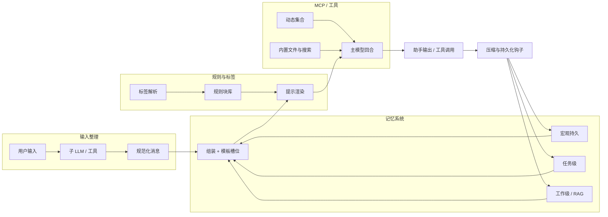

# 记忆、MCP 与上下文压缩：设计梳理

本文档整理自对 Agent 框架在 **MCP 管理**、**可插拔规则**、**分层记忆**、**压缩触发** 与 **轻量子模型管线** 方向的讨论要点，作为实现与评审时的概念基线。与代码现状的对照见同目录下的 [`deep_dive_memory_context.md`](deep_dive_memory_context.md)。

---

## 1. 目标与原则

| 主题 | 取向 |
|------|------|
| MCP / 工具 | 由「手工开关集合」转向 **受控的自动发现、加载与收敛**；高风险能力必须通过权限与审计约束。 |
| 规则与提示 | **系统/用户层**可相对固定；**领域、任务、文体、职业画像**等以可组合单元（标签/RAG 片段/规则块）管理，按上下文装配进模板。 |
| 记忆 | **多层存储 + 明确组装策略**：哪些进本轮上下文、以何种比例与模板呈现，是产品差异的核心。 |
| 压缩与整理 | **主动、偏早触发**（见下文阈值建议），并与 **钩子/策略接口** 绑定，而非仅依赖模型窗口见底。 |
| 智能化预处理 | 用 **小型专用模型或调用** 做语义整合、问答对齐、历史取舍；这些步骤宜 **封装为工具/MCP**，保持主循环清晰。 |

**安全主轴**：各类「技能」与 MCP 的最终价值在于 **在权限边界内可靠执行**；自动加载 MCP 时，权限模型与审计轨迹必须与手动注册时同等严格。

---

## 2. MCP：从静态目录到受控自治

### 2.1 动机

主 Agent 不应长期持有一组固定的 MCP；理想行为是：**按任务与风险级别动态增删 MCP**，并在会话或子目标结束时回收连接与凭据。

### 2.2 实现脉络

1. **元 MCP / 技能层**：提供「枚举可用 MCP」「请求加载/卸载」「查询当前生效集合」等 **受控工具**；可由主模型调用，也可委托给 **小型子 Agent**（专门做工具编排与策略），避免主循环被配置细节淹没。
2. **与 Skills 统一心智模型**：动态 MCP 管理与「技能发现、激活、退出」可共用同一套 **生命周期与权限检查**（加载前校验、加载后观测、卸载时清理）。
3. **内置基座能力**：文件与仓库类操作（**按范围读文件、搜索、创建、修改**）应作为 **一等内置能力** 存在，并与权限（路径白名单、写操作确认等）绑定，而不是每个项目从零拼脚本。

### 2.3 与记忆文档的关系

MCP 集合决定 **外部事实与操作边界**；记忆系统决定 **轮次间与跨会话保留什么**。二者在「上下文装配」阶段汇合：工具清单摘要、近期工具结果、持久记忆摘要需 **同一套模板槽位** 管理，避免重复与冲突。

---

## 3. 规则系统：可插拔、标签化、模板渲染

### 3.1 分层

- **相对稳定层**：系统指令、用户长期偏好（可按需版本化）。
- **可变组合层**：子任务说明、领域术语表、输出格式、语言风格、「职业角色」约束等 —— 建议以 **标签** 或 **规则 ID** 引用，而非每次手写整段 prompt。

### 3.2 工作流（概念）

1. **上下文判定**：通过轻量逻辑或检索（Skills / MCP / 小模型）决定当前激活的 **规则标签集合**。
2. **模板实例化**：将规则块填入 **预定义模板槽位**（system / developer / task wrapper 等），生成本轮 **结构化提示包**。
3. **注入对话环**：渲染结果进入下一轮主模型输入；必要时连同「本轮禁止使用的规则」一并记录，便于调试与复现。

### 3.3 与 RAG 的边界

标签化规则既可来自静态库，也可来自 **向量检索**；关键是 **检索结果要经模板规范化**，避免零散片段堆叠导致指令冲突。

---

## 4. 记忆架构：分层、持久化与检索

### 4.1 压缩与管理的总体策略

- **是否按任务模板压缩**：讨论倾向为 **是** —— 不同任务类型（编码、写作、分析）应对摘要字段、粒度、保留策略有不同默认 **模板**，同一原始历史经不同模板压缩后服务不同槽位。
- **习惯与交互模式**：可记录 **用户交互习惯**（偏好详尽/简略、常用工具、常用语言等），归入 **宏观层** 持久摘要，用于个性化默认规则标签与压缩侧重。

### 4.2 持久记忆（磁盘边界）

| 层级 | 内容示例 |
|------|----------|
| **全局 / 人设** | 助手角色、长期边界、跨项目通用画像与工作方式。 |
| **用户 / 项目** | 与具体用户或仓库绑定的任务结论、偏好、反复出现的约束。 |

### 4.3 检索与使用粒度

- **宏观（Macro）**：对话者身份感、稳定风格、工作方式 —— 适合 **短摘要 + 低频次更新**，优先占固定小块 token。
- **微观（Micro）**：当前会话中 **被点名的实体、刚承诺的事实、待办** —— 适合 **高召回、按需注入**，避免全程塞满上下文。

### 4.4 任务记忆与工作记忆（概念区分）

- **任务级（Task-level）**：本任务目标、约束、已完成步骤摘要；可包含宏观 persona 的 **投影**。
- **工作级（Work-level）**：当前轮次活跃处理对象 —— **在解的问题**、本轮 RAG 命中、临时强化的规则；轮次结束可整体下沉为任务级或丢弃。

### 4.5 核心：记忆组装（Assembly）

最关键的实现焦点是 **多源记忆的合成**：

- **模板槽位**：例如「持久摘要」「本轮事实」「工具痕迹」「用户原文」各占固定结构。
- **比例与权重**：根据模型窗口、任务类型与观测到的冲突，动态调整各类记忆的 **预算**（字节/token/条数）；需可配置、可记录，便于事后分析 **为何本轮上下文长这样**。

上述分层与 `deep_dive_memory_context.md` 中 AF / HU / CC 的「存储层 / 策略层」划分可对照阅读：本文档偏 **产品级信息架构**，该文偏 **与现仓库代码的映射**。

---

## 5. 压缩与触发钩子

### 5.1 为何要「偏早」压缩

仅在接近上下文上限（例如 **80%**）才压缩，容易在 **工具长输出、多轮引用** 场景下被动失准。讨论中建议将 **压缩触发前移到约 50% 有效占用**（可按 token 估算或字符代理指标），保留余量给新一轮生成与工具回流。

### 5.2 钩子形态（概念要求）

- **阈值类**：占用比例、绝对 token、消息条数、单条工具结果超界。
- **事件类**：子任务完成、会话显式「小结」、用户切换项目。
- **策略类**：钩子不直接写死算法，而是调用注册的 **压缩策略**（摘要、外置引用、向量挤出等），与 [`deep_dive_memory_context.md`](deep_dive_memory_context.md) 中的实现建议（token 队列、工具结果外置）方向一致。

### 5.3 与规则/MCP 的联动

压缩过程本身可依赖 **带权限的工具**：例如「生成结构化摘要并写入 tier-2 存储」由专用 MCP 完成，主循环只消费其返回的句柄或短文本。

---

## 6. 子 LLM 与输入整理管线

### 6.1 角色

主模型负责 **规划与高价值推理**；大量 **机械但易错的语义工作** 交给 **小型模型或专用调用**：

- 理解 **上一轮助手输出** 与 **当前用户输入** 的语义关系。
- 判断用户是否在 **回答助手刚提出的澄清问题**；若是，则做 **语义补全**（指代消解、省略补全），再进入主记忆与主模型；若否，可 **透传** 原文以减少失真。
- 参与决定 **是否携带、裁剪或刷新** 部分历史记忆进入下一轮。

### 6.2 规范化

子 LLM 的输出应通过 **提示模板** 约束为 **稳定字段**（例如：关系标签、补全后文本、建议保留的记忆 ID 列表），便于下游确定性逻辑处理，而非自由散文。

### 6.3 数量与封装

预期需要 **多个** 此类轻量环节（不完全列举：输入规范化、轮末小结、事实冲突检测、压缩摘要质量把关）。每一类宜 **封装为独立 MCP 或工具**，便于：

- 单独限流、计费与版本；
- 在不需要时整段关闭以降低延迟；
- 与主 Agent 的权限模型对齐。

---

## 7. 端到端数据流（简图）

---

## 8. 开实现时的检查清单

1. **动态 MCP**：加载/卸载路径是否具备 **审计日志与权限重算**？
2. **规则标签**：冲突检测（两条规则互斥时）是否有 **确定性仲裁**？
3. **记忆组装**：是否可导出「本轮各槽位来源与预算」用于调试？
4. **压缩**：是否在 **50% 档** 做首次警惕、在更高占用前完成至少一次结构化摘要？
5. **子 LLM**：失败时是否 **无损回退** 到透传或规则兜底，避免单点卡死主循环？

---

## 9. 参考文献与延伸阅读

- 同目录：[`deep_dive_memory_context.md`](deep_dive_memory_context.md) — 记忆与上下文的代码级对照与改进建议。
- 同目录：[`deep_dive_security.md`](deep_dive_security.md) — 工具与权限安全（与 MCP/Skils 强相关）。

---

*文档整理自架构讨论纪要；具体阈值（如 50%）与模块边界应在实现阶段以评测与运维数据校准。*
