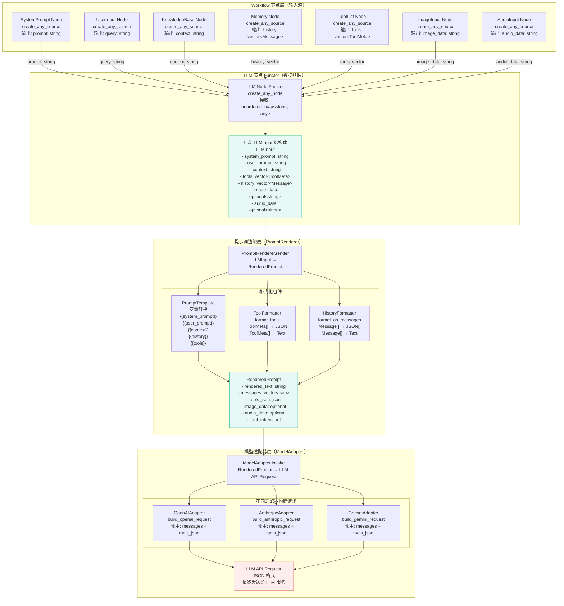
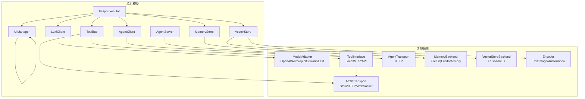

# Agent Framework 架构概述

## 系统架构

Agent Framework 采用分层架构设计：

1. **应用接口层**：CLI、ImGui、Web 客户端
2. **业务模块层**：LLM Client、ToolBus、A2A Client/Server、Memory、VectorStore、Encoder
3. **核心引擎层**：GraphExecutor、Workflow 库、Taskflow 核心
4. **基础设施层**：向量数据库、事件日志、HTTP 服务器、MCP 服务、A2A 协议

## 核心设计原则

1. **声明式数据流**：基于键值驱动 I/O，自动依赖推断
2. **Agent 与工作流统一抽象**：支持嵌套和组合
3. **模块化与可组合性**：每个模块独立开发、测试和复用
4. **多线程并行执行**：工作窃取调度器，自动负载均衡
5. **多端适配**：统一的 Sink 节点接口

## 关键特性

- Agent 循环子图封装
- 知识库作为 Source 节点
- 并行工具调用
- 多模态支持
- 实时流式输出
- MCP 工具集成
- A2A（Agent2Agent）协议支持

详细架构设计请参考：`../../readme/guide_agent.md`

---

## 提示词渲染数据流设计

### 提示词渲染数据流概览

**核心问题**：LLM 节点接收多个输入源（系统提示词、用户提示词、知识库上下文、工具列表、对话历史、多模态输入），需要将这些输入**渲染并组装**成最终的提示词，传递给 LLM 模型。

#### 数据流架构图



#### 数据转换流程详解

**阶段 1：Workflow 节点 → LLMInput**

在 LLM 节点的 functor 中，从 `input_specs` 接收的数据被组装成 `LLMInput` 结构：

```cpp
// LLM 节点 functor
[&prompt_renderer](const std::unordered_map<std::string, std::any>& inputs) {
    LLMInput llm_input;
    llm_input.system_prompt = std::any_cast<std::string>(inputs.at("prompt"));
    llm_input.user_prompt = std::any_cast<std::string>(inputs.at("query"));
    llm_input.context = std::any_cast<std::string>(inputs.at("context"));
    llm_input.tools = std::any_cast<std::vector<ToolMeta>>(inputs.at("tools"));
    llm_input.history = std::any_cast<std::vector<Message>>(inputs.at("history"));
    // ... 多模态输入 ...
}
```

**阶段 2：LLMInput → RenderedPrompt**

`PromptRenderer::render()` 将 `LLMInput` 转换为 `RenderedPrompt`：

1. **工具列表格式化**：
   - `ToolFormatter::format_tools()` → `tools_json`（JSON 格式，供 API 使用）
   - `ToolFormatter::format_tools_as_text()` → `tools_text`（文本格式，供模板使用）

2. **对话历史格式化**：
   - `HistoryFormatter::format_as_messages()` → `messages`（JSON 数组，供 API 使用）
   - `HistoryFormatter::format_as_text()` → `history_text`（文本格式，供模板使用）

3. **模板渲染**：
   - `PromptTemplate::render()` 将变量占位符替换为实际内容
   - 输入变量：`system_prompt`, `user_prompt`, `context`, `history_text`, `tools_text`
   - 输出：`rendered_text`（完整的文本提示词）

4. **多模态整合**：
   - 将 `image_data` 和 `audio_data` 嵌入到 `messages` 中

5. **上下文窗口管理**：
   - 估算 `total_tokens`
   - 如果超过限制，调用 `truncate_prompt()` 截断

**阶段 3：RenderedPrompt → LLM API Request**

`ModelAdapter::invoke()` 接收 `RenderedPrompt`，构建模型特定的 API 请求：

- **OpenAI**：使用 `RenderedPrompt.messages` + `RenderedPrompt.tools_json`
- **Anthropic**：使用 `RenderedPrompt.messages` + `RenderedPrompt.tools_json`（不同格式）
- **Gemini**：使用 `RenderedPrompt.messages` + `RenderedPrompt.tools_json`（不同格式）

**关键说明**：
- **`rendered_text`**：主要用于调试和日志，部分模型可能直接使用
- **`messages`**：**主要使用**，用于构建 API 请求的消息列表
- **`tools_json`**：**主要使用**，用于构建 API 请求的工具列表
- **`image_data` / `audio_data`**：已嵌入 `messages` 中，适配器直接使用 `messages`

#### 传入 LLM 的最终数据

**最终传入 LLM API 的数据**取决于模型适配器：

1. **OpenAI Chat Completions API**：
   ```json
   {
     "model": "gpt-4o",
     "messages": [  // 来自 RenderedPrompt.messages
       {"role": "system", "content": "..."},
       {"role": "user", "content": "..."}
     ],
     "tools": [...]  // 来自 RenderedPrompt.tools_json
   }
   ```

2. **Anthropic Messages API**：
   ```json
   {
     "model": "claude-3-opus",
     "messages": [...],  // 来自 RenderedPrompt.messages
     "tools": [...]      // 来自 RenderedPrompt.tools_json（格式不同）
   }
   ```

**总结**：
- **`RenderedPrompt.messages`** 是传入 LLM 的**主要数据**（包含系统提示词、用户提示词、历史对话、多模态内容）
- **`RenderedPrompt.tools_json`** 是传入 LLM 的**工具定义**（用于 Function Calling）
- **`RenderedPrompt.rendered_text`** 主要用于日志和调试，部分模型可能作为文本输入直接使用

---

## 类继承关系设计

本框架采用**适配器模式**和**策略模式**，通过虚基类定义统一接口，派生类实现具体功能。所有模块都遵循这一设计模式，确保高度的可扩展性和可测试性。

### 1. LLM 客户端模块继承体系

```cpp
/**
 * @brief 模型适配器虚基类
 * 定义统一的 LLM 调用接口，支持多种模型提供商
 */
class ModelAdapter {
public:
    virtual ~ModelAdapter() = default;
    
    // 虚函数接口：异步调用 LLM，支持流式输出
    // 注意：内部会将 LLMInput 转换为 RenderedPrompt，再构建 API 请求
    virtual std::future<LLMOutput> invoke(
        const LLMInput& input,
        std::function<void(std::string_view)> stream_callback = nullptr
    ) = 0;
    
    // 虚函数接口：使用已渲染的提示词调用 LLM（高级接口）
    // 直接接收 RenderedPrompt，跳过渲染步骤
    virtual std::future<LLMOutput> invoke_with_rendered(
        const RenderedPrompt& rendered,
        std::function<void(std::string_view)> stream_callback = nullptr
    ) = 0;
    
    // 虚函数接口：获取模型支持的工具列表
    virtual std::vector<ToolMeta> get_available_tools() const = 0;
    
    // 虚函数接口：配置模型参数
    virtual void configure(const ModelConfig& config) = 0;
    
    // 虚函数接口：获取模型名称
    virtual std::string get_model_name() const = 0;
    
    // 虚函数接口：检查模型是否支持多模态输入
    virtual bool supports_multimodal() const = 0;
    
protected:
    // 受保护成员：公共的错误处理和重试逻辑（可由派生类调用）
    virtual json send_request(const std::string& endpoint, const json& payload);
    virtual json parse_response(const std::string& response);
};

/**
 * @brief OpenAI 适配器
 */
class OpenAIAdapter : public ModelAdapter {
public:
    explicit OpenAIAdapter(const std::string& api_key, const std::string& base_url = "https://api.openai.com/v1");
    
    std::future<LLMOutput> invoke(
        const LLMInput& input,
        std::function<void(std::string_view)> stream_callback = nullptr
    ) override;
    
    std::future<LLMOutput> invoke_with_rendered(
        const RenderedPrompt& rendered,
        std::function<void(std::string_view)> stream_callback = nullptr
    ) override;
    
    std::vector<ToolMeta> get_available_tools() const override;
    void configure(const ModelConfig& config) override;
    std::string get_model_name() const override;
    bool supports_multimodal() const override;
    
private:
    std::string api_key_;
    std::string base_url_;
    ModelConfig config_;
    
    // 私有方法：构建 OpenAI 格式的请求（使用 RenderedPrompt）
    json build_openai_request(const RenderedPrompt& rendered);
};

/**
 * @brief Anthropic 适配器
 */
class AnthropicAdapter : public ModelAdapter {
public:
    explicit AnthropicAdapter(const std::string& api_key);
    
    std::future<LLMOutput> invoke(
        const LLMInput& input,
        std::function<void(std::string_view)> stream_callback = nullptr
    ) override;
    
    std::future<LLMOutput> invoke_with_rendered(
        const RenderedPrompt& rendered,
        std::function<void(std::string_view)> stream_callback = nullptr
    ) override;
    
    std::vector<ToolMeta> get_available_tools() const override;
    void configure(const ModelConfig& config) override;
    std::string get_model_name() const override;
    bool supports_multimodal() const override;
    
private:
    std::string api_key_;
    ModelConfig config_;
    json build_anthropic_request(const RenderedPrompt& rendered);
};

/**
 * @brief Gemini 适配器
 */
class GeminiAdapter : public ModelAdapter {
public:
    explicit GeminiAdapter(const std::string& api_key);
    
    std::future<LLMOutput> invoke(
        const LLMInput& input,
        std::function<void(std::string_view)> stream_callback = nullptr
    ) override;
    
    std::future<LLMOutput> invoke_with_rendered(
        const RenderedPrompt& rendered,
        std::function<void(std::string_view)> stream_callback = nullptr
    ) override;
    
    std::vector<ToolMeta> get_available_tools() const override;
    void configure(const ModelConfig& config) override;
    std::string get_model_name() const override;
    bool supports_multimodal() const override;
    
private:
    std::string api_key_;
    ModelConfig config_;
    json build_gemini_request(const RenderedPrompt& rendered);
};

/**
 * @brief vLLM 本地适配器（本地部署的 vLLM 服务器）
 */
class vLLMAdapter : public ModelAdapter {
public:
    explicit vLLMAdapter(const std::string& endpoint = "http://localhost:8000/v1");
    
    std::future<LLMOutput> invoke(
        const LLMInput& input,
        std::function<void(std::string_view)> stream_callback = nullptr
    ) override;
    
    std::future<LLMOutput> invoke_with_rendered(
        const RenderedPrompt& rendered,
        std::function<void(std::string_view)> stream_callback = nullptr
    ) override;
    
    std::vector<ToolMeta> get_available_tools() const override;
    void configure(const ModelConfig& config) override;
    std::string get_model_name() const override;
    bool supports_multimodal() const override;
    
private:
    std::string endpoint_;
    ModelConfig config_;
    json build_vllm_request(const RenderedPrompt& rendered);
};

/**
 * @brief LLM 客户端管理器（使用适配器模式）
 */
class LLMClient {
public:
    // 设置提示词渲染器（用于将 LLMInput 转换为 RenderedPrompt）
    void set_prompt_renderer(std::shared_ptr<PromptRenderer> renderer);
    
    // 注册模型适配器
    void register_adapter(const std::string& provider, 
                         std::shared_ptr<ModelAdapter> adapter);
    
    // 设置默认适配器
    void set_default_adapter(const std::string& provider);
    
    // 调用 LLM（使用默认适配器或指定适配器）
    // 内部会自动使用 PromptRenderer 渲染提示词
    std::future<LLMOutput> invoke(
        const LLMInput& input,
        const std::string& provider = "",
        std::function<void(std::string_view)> stream_callback = nullptr
    );
    
    // 使用渲染后的提示词调用 LLM（高级接口，跳过渲染步骤）
    // 适用于已经渲染好的提示词，或在 LLM 节点中已经渲染的情况
    std::future<LLMOutput> invoke_with_rendered_prompt(
        const RenderedPrompt& rendered,
        const std::string& provider = "",
        std::function<void(std::string_view)> stream_callback = nullptr
    );
    
    // 配置模型参数
    void configure(const std::string& provider, const ModelConfig& config);
    
    // 获取所有已注册的适配器名称
    std::vector<std::string> list_providers() const;
    
    // 获取模型名称（用于提示词渲染器选择格式化策略）
    std::string get_model_name(const std::string& provider = "") const;
    
private:
    std::shared_ptr<PromptRenderer> prompt_renderer_;  // 提示词渲染器
    std::map<std::string, std::shared_ptr<ModelAdapter>> adapters_;
    std::string default_provider_;
    std::mutex adapters_mutex_;
    std::mutex renderer_mutex_;
    
    // 私有方法：内部渲染提示词（如果未提供 RenderedPrompt）
    RenderedPrompt render_prompt(const LLMInput& input, const std::string& provider);
};
```

### 2. 提示词渲染模块继承体系

提示词渲染模块负责将 `LLMInput` 结构转换为 `RenderedPrompt`，支持模板化、变量替换、工具格式化、历史格式化等功能。

```cpp
/**
 * @brief 渲染后的提示词结构
 * 包含渲染后的文本内容和多模态数据
 */
struct RenderedPrompt {
    std::string rendered_text;              // 渲染后的文本提示词
    std::vector<json> messages;             // 格式化后的消息列表（OpenAI messages 格式）
    json tools_json;                        // 格式化后的工具列表（JSON）
    std::optional<std::string> image_data;  // 图像 base64（已嵌入 messages）
    std::optional<std::string> audio_data;  // 音频 base64（已嵌入 messages）
    int total_tokens;                       // 估算的总 token 数
};

/**
 * @brief 提示词模板虚基类
 * 定义统一的模板渲染接口
 */
class PromptTemplate {
public:
    virtual ~PromptTemplate() = default;
    
    // 虚函数接口：渲染模板，替换所有变量
    virtual std::string render(const std::map<std::string, std::string>& variables) = 0;
    
    // 虚函数接口：加载模板（从文件或字符串）
    virtual void load(const std::string& source) = 0;
    
    // 虚函数接口：获取模板中使用的变量列表
    virtual std::vector<std::string> get_variables() const = 0;
    
    // 虚函数接口：验证变量是否完整
    virtual bool validate_variables(const std::map<std::string, std::string>& variables) const = 0;
};

/**
 * @brief 字符串模板实现（支持 {{variable}} 占位符）
 */
class StringPromptTemplate : public PromptTemplate {
public:
    explicit StringPromptTemplate(const std::string& template_str);
    
    std::string render(const std::map<std::string, std::string>& variables) override;
    void load(const std::string& source) override;
    std::vector<std::string> get_variables() const override;
    bool validate_variables(const std::map<std::string, std::string>& variables) const override;
    
private:
    std::string template_str_;
    std::regex var_pattern_;  // 匹配 {{variable}}
    
    // 私有方法：提取模板中的所有变量名
    std::vector<std::string> extract_variables() const;
};

/**
 * @brief 文件模板实现（从文件加载模板）
 */
class FilePromptTemplate : public PromptTemplate {
public:
    explicit FilePromptTemplate(const std::string& file_path);
    
    std::string render(const std::map<std::string, std::string>& variables) override;
    void load(const std::string& source) override;
    std::vector<std::string> get_variables() const override;
    bool validate_variables(const std::map<std::string, std::string>& variables) const override;
    
private:
    std::string file_path_;
    std::shared_ptr<StringPromptTemplate> inner_template_;
};

/**
 * @brief 工具格式化器虚基类
 * 定义统一的工具列表格式化接口，支持不同 LLM 提供商的格式
 */
class ToolFormatter {
public:
    virtual ~ToolFormatter() = default;
    
    // 虚函数接口：格式化为 JSON（供 API 使用）
    virtual json format_tools(const std::vector<ToolMeta>& tools) = 0;
    
    // 虚函数接口：格式化为文本（供模板使用）
    virtual std::string format_tools_as_text(const std::vector<ToolMeta>& tools) = 0;
    
    // 虚函数接口：获取格式化器支持的模型列表
    virtual std::vector<std::string> supported_models() const = 0;
};

/**
 * @brief OpenAI 工具格式化器
 */
class OpenAIToolFormatter : public ToolFormatter {
public:
    json format_tools(const std::vector<ToolMeta>& tools) override;
    std::string format_tools_as_text(const std::vector<ToolMeta>& tools) override;
    std::vector<std::string> supported_models() const override;
    
private:
    // 私有方法：将 ToolMeta 转换为 OpenAI Function Calling 格式
    json convert_to_openai_format(const ToolMeta& tool);
};

/**
 * @brief Anthropic 工具格式化器
 */
class AnthropicToolFormatter : public ToolFormatter {
public:
    json format_tools(const std::vector<ToolMeta>& tools) override;
    std::string format_tools_as_text(const std::vector<ToolMeta>& tools) override;
    std::vector<std::string> supported_models() const override;
    
private:
    // 私有方法：将 ToolMeta 转换为 Anthropic Tool Use 格式
    json convert_to_anthropic_format(const ToolMeta& tool);
};

/**
 * @brief Gemini 工具格式化器
 */
class GeminiToolFormatter : public ToolFormatter {
public:
    json format_tools(const std::vector<ToolMeta>& tools) override;
    std::string format_tools_as_text(const std::vector<ToolMeta>& tools) override;
    std::vector<std::string> supported_models() const override;
    
private:
    // 私有方法：将 ToolMeta 转换为 Gemini Function Calling 格式
    json convert_to_gemini_format(const ToolMeta& tool);
};

/**
 * @brief 对话历史格式化器虚基类
 * 定义统一的对话历史格式化接口
 */
class HistoryFormatter {
public:
    virtual ~HistoryFormatter() = default;
    
    // 虚函数接口：格式化为文本（供模板使用）
    virtual std::string format_as_text(const std::vector<Message>& history) = 0;
    
    // 虚函数接口：格式化为消息列表（供 API 使用）
    virtual std::vector<json> format_as_messages(const std::vector<Message>& history) = 0;
    
    // 虚函数接口：截断历史（保留最近的 N 轮）
    virtual std::vector<Message> truncate(const std::vector<Message>& history, int max_messages) = 0;
};

/**
 * @brief OpenAI 历史格式化器（messages 格式）
 */
class OpenAIHistoryFormatter : public HistoryFormatter {
public:
    std::string format_as_text(const std::vector<Message>& history) override;
    std::vector<json> format_as_messages(const std::vector<Message>& history) override;
    std::vector<Message> truncate(const std::vector<Message>& history, int max_messages) override;
};

/**
 * @brief 提示词渲染器（核心类）
 * 负责将 LLMInput 渲染成最终的提示词
 */
class PromptRenderer {
public:
    explicit PromptRenderer(std::shared_ptr<PromptTemplate> template_ptr);
    
    // 渲染提示词（主要接口）
    RenderedPrompt render(const LLMInput& input, const std::string& model_name);
    
    // 注册工具格式化器
    void register_tool_formatter(const std::string& model_pattern, 
                                std::shared_ptr<ToolFormatter> formatter);
    
    // 设置历史格式化器
    void set_history_formatter(std::shared_ptr<HistoryFormatter> formatter);
    
    // 设置提示词模板
    void set_template(std::shared_ptr<PromptTemplate> template_ptr);
    
    // 配置上下文窗口限制
    void set_max_tokens(const std::string& model_name, int max_tokens);
    
private:
    std::shared_ptr<PromptTemplate> template_;
    std::map<std::string, std::shared_ptr<ToolFormatter>> tool_formatters_;
    std::shared_ptr<HistoryFormatter> history_formatter_;
    std::map<std::string, int> max_tokens_map_;
    std::mutex formatters_mutex_;
    
    // 私有方法：获取工具格式化器（根据模型名称匹配）
    std::shared_ptr<ToolFormatter> get_tool_formatter(const std::string& model_name);
    
    // 私有方法：估算 token 数
    int estimate_tokens(const RenderedPrompt& rendered);
    
    // 私有方法：截断提示词（保留优先级高的内容）
    RenderedPrompt truncate_prompt(const RenderedPrompt& rendered, const std::string& model_name);
    
    // 私有方法：整合多模态输入到消息列表
    void integrate_multimodal_input(RenderedPrompt& rendered, const LLMInput& input);
};
```

### 3. ToolBus 模块继承体系

```cpp
/**
 * @brief 工具接口虚基类
 * 定义统一的工具调用接口，屏蔽不同工具实现的差异
 */
class ToolInterface {
public:
    virtual ~ToolInterface() = default;
    
    // 虚函数接口：调用工具
    virtual std::future<json> call(const std::string& name, const json& arguments) = 0;
    
    // 虚函数接口：获取工具元数据
    virtual ToolMeta get_tool_meta(const std::string& name) const = 0;
    
    // 虚函数接口：列出所有可用工具
    virtual std::vector<std::string> list_tools() const = 0;
    
    // 虚函数接口：验证参数
    virtual bool validate_arguments(const std::string& name, const json& arguments) const = 0;
    
    // 虚函数接口：获取工具信息
    virtual std::optional<ToolInfo> get_tool_info(const std::string& name) const = 0;
};

/**
 * @brief 本地工具实现
 */
class LocalTool : public ToolInterface {
public:
    LocalTool(const std::string& name, 
              std::function<json(const json&)> func,
              const ToolMeta& meta);
    
    std::future<json> call(const std::string& name, const json& arguments) override;
    ToolMeta get_tool_meta(const std::string& name) const override;
    std::vector<std::string> list_tools() const override;
    bool validate_arguments(const std::string& name, const json& arguments) const override;
    std::optional<ToolInfo> get_tool_info(const std::string& name) const override;
    
private:
    std::string name_;
    std::function<json(const json&)> func_;
    ToolMeta meta_;
    ToolInfo info_;
};

/**
 * @brief MCP 工具实现（通过 MCPClient 调用）
 */
class MCPTool : public ToolInterface {
public:
    explicit MCPTool(std::shared_ptr<MCPClient> client);
    
    std::future<json> call(const std::string& name, const json& arguments) override;
    ToolMeta get_tool_meta(const std::string& name) const override;
    std::vector<std::string> list_tools() const override;
    bool validate_arguments(const std::string& name, const json& arguments) const override;
    std::optional<ToolInfo> get_tool_info(const std::string& name) const override;
    
private:
    std::shared_ptr<MCPClient> client_;
    std::vector<ToolMeta> cached_tools_;
    std::mutex cache_mutex_;
    
    // 私有方法：刷新工具列表缓存
    void refresh_tools_cache();
};

/**
 * @brief API 工具实现（外部 REST API）
 */
class APITool : public ToolInterface {
public:
    APITool(const std::string& name,
            const std::string& endpoint,
            const std::string& method,
            const ToolMeta& meta);
    
    std::future<json> call(const std::string& name, const json& arguments) override;
    ToolMeta get_tool_meta(const std::string& name) const override;
    std::vector<std::string> list_tools() const override;
    bool validate_arguments(const std::string& name, const json& arguments) const override;
    std::optional<ToolInfo> get_tool_info(const std::string& name) const override;
    
private:
    std::string name_;
    std::string endpoint_;
    std::string method_;
    ToolMeta meta_;
    ToolInfo info_;
    
    // 私有方法：发送 HTTP 请求
    json send_http_request(const json& payload);
};

/**
 * @brief ToolBus 管理器（统一管理所有工具）
 */
class ToolBus {
public:
    // 注册本地工具
    void register_local_tool(const std::string& name,
                            std::function<json(const json&)> func,
                            const ToolMeta& meta);
    
    // 注册 MCP 服务
    void register_mcp_service(const std::string& service_name,
                              std::shared_ptr<MCPClient> client);
    
    // 注册 API 工具
    void register_api_tool(const std::string& name,
                          const std::string& endpoint,
                          const std::string& method,
                          const ToolMeta& meta);
    
    // 统一调用接口
    std::future<json> call_tool(const std::string& name, const json& arguments);
    
    // 导出工具列表（供 LLM 使用）
    std::vector<ToolMeta> export_as_llm_tools() const;
    
    // 查询工具信息
    std::optional<ToolInfo> get_tool_info(const std::string& name) const;
    
    // 列出所有工具
    std::vector<std::string> list_all_tools() const;
    
private:
    std::map<std::string, std::shared_ptr<ToolInterface>> tools_;
    std::mutex tools_mutex_;
    
    // 私有方法：根据工具名称查找工具接口
    std::shared_ptr<ToolInterface> find_tool(const std::string& name) const;
};
```

### 4. MCP 客户端模块继承体系

```cpp
/**
 * @brief MCP 传输层虚基类
 * 定义统一的传输接口，支持不同的传输方式
 */
class MCPTransport {
public:
    virtual ~MCPTransport() = default;
    
    // 虚函数接口：连接服务
    virtual bool connect(const std::string& endpoint) = 0;
    
    // 虚函数接口：断开连接
    virtual void disconnect() = 0;
    
    // 虚函数接口：发送 JSON-RPC 请求
    virtual json send_request(const std::string& method, const json& params) = 0;
    
    // 虚函数接口：检查连接状态
    virtual bool is_connected() const = 0;
    
    // 虚函数接口：获取传输类型
    virtual MCPTransport get_transport_type() const = 0;
};

/**
 * @brief stdio 传输实现（标准输入输出）
 */
class StdioMCPTransport : public MCPTransport {
public:
    explicit StdioMCPTransport(const std::string& command, 
                               const std::vector<std::string>& args = {});
    
    bool connect(const std::string& endpoint) override;
    void disconnect() override;
    json send_request(const std::string& method, const json& params) override;
    bool is_connected() const override;
    MCPTransport get_transport_type() const override;
    
private:
    std::string command_;
    std::vector<std::string> args_;
    std::unique_ptr<std::process> process_;
    bool connected_ = false;
    std::mutex io_mutex_;
    
    // 私有方法：启动子进程
    void start_process();
};

/**
 * @brief HTTP 传输实现
 */
class HttpMCPTransport : public MCPTransport {
public:
    explicit HttpMCPTransport(const std::string& base_url);
    
    bool connect(const std::string& endpoint) override;
    void disconnect() override;
    json send_request(const std::string& method, const json& params) override;
    bool is_connected() const override;
    MCPTransport get_transport_type() const override;
    
private:
    std::string base_url_;
    std::string endpoint_;
    bool connected_ = false;
    
    // 私有方法：发送 HTTP POST 请求
    json send_http_post(const json& payload);
};

/**
 * @brief WebSocket 传输实现
 */
class WebSocketMCPTransport : public MCPTransport {
public:
    explicit WebSocketMCPTransport(const std::string& ws_url);
    
    bool connect(const std::string& endpoint) override;
    void disconnect() override;
    json send_request(const std::string& method, const json& params) override;
    bool is_connected() const override;
    MCPTransport get_transport_type() const override;
    
private:
    std::string ws_url_;
    websocketpp::connection_hdl connection_;
    bool connected_ = false;
    std::mutex ws_mutex_;
    
    // 私有方法：处理 WebSocket 消息
    void handle_message(websocketpp::connection_hdl hdl, 
                       websocketpp::config::asio::message_ptr msg);
};

/**
 * @brief MCP 客户端管理器（使用传输层）
 */
class MCPClient {
public:
    explicit MCPClient(std::unique_ptr<MCPTransport> transport);
    
    // 连接 MCP 服务
    bool connect(const std::string& endpoint, MCPTransport transport_type);
    
    // 列举可用工具
    std::future<std::vector<ToolMeta>> list_tools();
    
    // 调用工具
    std::future<json> call_tool(const std::string& name, const json& arguments);
    
    // 心跳检查
    bool ping();
    
    // 断开连接
    void disconnect();
    
    // 检查连接状态
    bool is_connected() const;
    
private:
    std::unique_ptr<MCPTransport> transport_;
    std::vector<ToolMeta> cached_tools_;
    std::mutex cache_mutex_;
    
    // 私有方法：发送 JSON-RPC 2.0 请求
    json send_jsonrpc_request(const std::string& method, const json& params);
    
    // 私有方法：解析 JSON-RPC 2.0 响应
    json parse_jsonrpc_response(const json& response);
};
```

### 5. Memory 模块继承体系

```cpp
/**
 * @brief 记忆存储后端虚基类
 * 定义统一的存储接口，支持不同的存储后端
 */
class MemoryBackend {
public:
    virtual ~MemoryBackend() = default;
    
    // 虚函数接口：存储事件
    virtual void store_event(const Event& event) = 0;
    
    // 虚函数接口：查询事件
    virtual std::vector<Event> query_events(
        const std::string& session_id,
        const std::string& node_name = "",
        std::time_t start_time = 0,
        std::time_t end_time = 0
    ) = 0;
    
    // 虚函数接口：存储消息
    virtual void store_message(const Message& message) = 0;
    
    // 虚函数接口：查询对话历史
    virtual std::vector<Message> get_conversation_history(
        const std::string& session_id,
        int max_messages = 10
    ) = 0;
    
    // 虚函数接口：存储记忆摘要
    virtual void store_memory_summary(const MemorySummary& summary) = 0;
    
    // 虚函数接口：查询记忆摘要
    virtual std::vector<MemorySummary> query_memory_summaries(
        const std::string& query,
        int top_k = 5
    ) = 0;
    
    // 虚函数接口：清理过期数据
    virtual void cleanup_expired_data(std::time_t expiry_time) = 0;
};

/**
 * @brief 文件系统后端实现
 */
class FileMemoryBackend : public MemoryBackend {
public:
    explicit FileMemoryBackend(const std::string& data_dir);
    
    void store_event(const Event& event) override;
    std::vector<Event> query_events(
        const std::string& session_id,
        const std::string& node_name = "",
        std::time_t start_time = 0,
        std::time_t end_time = 0
    ) override;
    void store_message(const Message& message) override;
    std::vector<Message> get_conversation_history(
        const std::string& session_id,
        int max_messages = 10
    ) override;
    void store_memory_summary(const MemorySummary& summary) override;
    std::vector<MemorySummary> query_memory_summaries(
        const std::string& query,
        int top_k = 5
    ) override;
    void cleanup_expired_data(std::time_t expiry_time) override;
    
private:
    std::string data_dir_;
    std::mutex file_mutex_;
    
    // 私有方法：获取事件日志文件路径
    std::string get_event_log_path(const std::string& session_id) const;
    
    // 私有方法：追加事件到文件
    void append_event_to_file(const Event& event, const std::string& path);
};

/**
 * @brief SQLite 后端实现
 */
class SQLiteMemoryBackend : public MemoryBackend {
public:
    explicit SQLiteMemoryBackend(const std::string& db_path);
    ~SQLiteMemoryBackend();
    
    void store_event(const Event& event) override;
    std::vector<Event> query_events(
        const std::string& session_id,
        const std::string& node_name = "",
        std::time_t start_time = 0,
        std::time_t end_time = 0
    ) override;
    void store_message(const Message& message) override;
    std::vector<Message> get_conversation_history(
        const std::string& session_id,
        int max_messages = 10
    ) override;
    void store_memory_summary(const MemorySummary& summary) override;
    std::vector<MemorySummary> query_memory_summaries(
        const std::string& query,
        int top_k = 5
    ) override;
    void cleanup_expired_data(std::time_t expiry_time) override;
    
private:
    std::string db_path_;
    sqlite3* db_ = nullptr;
    std::mutex db_mutex_;
    
    // 私有方法：初始化数据库表
    void init_database();
    
    // 私有方法：执行 SQL 语句
    void execute_sql(const std::string& sql, const std::vector<std::string>& params = {});
};

/**
 * @brief 内存后端实现（临时存储，不持久化）
 */
class InMemoryBackend : public MemoryBackend {
public:
    InMemoryBackend();
    
    void store_event(const Event& event) override;
    std::vector<Event> query_events(
        const std::string& session_id,
        const std::string& node_name = "",
        std::time_t start_time = 0,
        std::time_t end_time = 0
    ) override;
    void store_message(const Message& message) override;
    std::vector<Message> get_conversation_history(
        const std::string& session_id,
        int max_messages = 10
    ) override;
    void store_memory_summary(const MemorySummary& summary) override;
    std::vector<MemorySummary> query_memory_summaries(
        const std::string& query,
        int top_k = 5
    ) override;
    void cleanup_expired_data(std::time_t expiry_time) override;
    
private:
    std::map<std::string, std::vector<Event>> events_;
    std::map<std::string, std::vector<Message>> messages_;
    std::vector<MemorySummary> summaries_;
    std::mutex data_mutex_;
};

/**
 * @brief Memory 管理器（使用后端）
 */
class MemoryStore {
public:
    explicit MemoryStore(std::unique_ptr<MemoryBackend> backend);
    
    // 存储事件（事件溯源）
    void store_event(const Event& event);
    
    // 查询对话历史
    std::vector<Message> get_conversation_history(
        const std::string& session_id,
        int max_messages = 10
    );
    
    // 查询短期记忆（当前会话）
    std::vector<Event> get_short_term_memory(const std::string& session_id);
    
    // 存储长期记忆摘要
    void store_long_term_memory(const std::string& session_id,
                               const MemorySummary& summary);
    
    // 查询长期记忆
    std::vector<MemorySummary> query_long_term_memory(
        const std::string& query, int top_k = 5
    );
    
    // 切换后端（运行时切换）
    void switch_backend(std::unique_ptr<MemoryBackend> new_backend);
    
private:
    std::unique_ptr<MemoryBackend> backend_;
    std::mutex backend_mutex_;
};
```

### 6. VectorStore 模块继承体系

```cpp
/**
 * @brief 向量存储后端虚基类
 * 定义统一的向量数据库接口
 */
class VectorStoreBackend {
public:
    virtual ~VectorStoreBackend() = default;
    
    // 虚函数接口：插入文档向量
    virtual void insert(const Document& doc, const Embedding& embedding) = 0;
    
    // 虚函数接口：批量插入
    virtual void insert_batch(const std::vector<Document>& docs, 
                             const std::vector<Embedding>& embeddings) = 0;
    
    // 虚函数接口：向量检索
    virtual std::vector<RetrievalResult> search(
        const Embedding& query_vector,
        int top_k = 5,
        const std::string& modality = ""
    ) = 0;
    
    // 虚函数接口：删除文档
    virtual bool delete_document(const std::string& doc_id) = 0;
    
    // 虚函数接口：更新文档
    virtual bool update_document(const Document& doc, const Embedding& embedding) = 0;
    
    // 虚函数接口：获取索引统计信息
    virtual json get_statistics() const = 0;
    
    // 虚函数接口：保存索引
    virtual bool save_index(const std::string& path) = 0;
    
    // 虚函数接口：加载索引
    virtual bool load_index(const std::string& path) = 0;
};

/**
 * @brief Faiss 后端实现
 */
class FaissBackend : public VectorStoreBackend {
public:
    explicit FaissBackend(int dimension, const std::string& index_type = "IVF_PQ");
    
    void insert(const Document& doc, const Embedding& embedding) override;
    void insert_batch(const std::vector<Document>& docs, 
                     const std::vector<Embedding>& embeddings) override;
    std::vector<RetrievalResult> search(
        const Embedding& query_vector,
        int top_k = 5,
        const std::string& modality = ""
    ) override;
    bool delete_document(const std::string& doc_id) override;
    bool update_document(const Document& doc, const Embedding& embedding) override;
    json get_statistics() const override;
    bool save_index(const std::string& path) override;
    bool load_index(const std::string& path) override;
    
private:
    int dimension_;
    std::string index_type_;
    std::unique_ptr<faiss::Index> index_;
    std::map<std::string, Document> documents_;  // doc_id -> Document
    std::mutex index_mutex_;
    
    // 私有方法：创建 Faiss 索引
    void create_index();
};

/**
 * @brief Milvus 后端实现
 */
class MilvusBackend : public VectorStoreBackend {
public:
    explicit MilvusBackend(const std::string& host = "localhost", 
                          int port = 19530,
                          const std::string& collection_name = "default");
    
    void insert(const Document& doc, const Embedding& embedding) override;
    void insert_batch(const std::vector<Document>& docs, 
                     const std::vector<Embedding>& embeddings) override;
    std::vector<RetrievalResult> search(
        const Embedding& query_vector,
        int top_k = 5,
        const std::string& modality = ""
    ) override;
    bool delete_document(const std::string& doc_id) override;
    bool update_document(const Document& doc, const Embedding& embedding) override;
    json get_statistics() const override;
    bool save_index(const std::string& path) override;
    bool load_index(const std::string& path) override;
    
private:
    std::string host_;
    int port_;
    std::string collection_name_;
    void* milvus_client_;  // Milvus 客户端指针（实际类型取决于 Milvus SDK）
    std::mutex client_mutex_;
    
    // 私有方法：连接 Milvus 服务器
    void connect_milvus();
    
    // 私有方法：创建集合
    void create_collection();
};

/**
 * @brief VectorStore 管理器（使用后端）
 */
class VectorStore {
public:
    explicit VectorStore(std::unique_ptr<VectorStoreBackend> backend);
    
    // 插入文档（多模态）
    void insert(const Document& doc, const Embedding& embedding);
    
    // 向量检索
    std::vector<RetrievalResult> search(
        const Embedding& query_vector,
        int top_k = 5,
        const std::string& modality = ""
    );
    
    // 混合检索（语义 + 关键词）
    std::vector<RetrievalResult> hybrid_search(
        const std::string& query_text,
        const Embedding& query_vector,
        int top_k = 5
    );
    
    // 注册编码器
    void register_encoder(const std::string& modality,
                         std::shared_ptr<Encoder> encoder);
    
    // 获取编码器
    std::shared_ptr<Encoder> get_encoder(const std::string& modality) const;
    
    // 切换后端
    void switch_backend(std::unique_ptr<VectorStoreBackend> new_backend);
    
private:
    std::unique_ptr<VectorStoreBackend> backend_;
    std::map<std::string, std::shared_ptr<Encoder>> encoders_;
    std::mutex backend_mutex_;
    std::mutex encoders_mutex_;
};
```

### 7. Encoder 模块继承体系

```cpp
/**
 * @brief 编码器虚基类
 * 定义统一的多模态编码接口
 */
class Encoder {
public:
    virtual ~Encoder() = default;
    
    // 虚函数接口：编码数据为向量
    virtual Embedding encode(const std::string& input) = 0;
    
    // 虚函数接口：获取编码器维度
    virtual int get_dimension() const = 0;
    
    // 虚函数接口：获取支持的模态类型
    virtual ModalityType get_modality_type() const = 0;
    
    // 虚函数接口：批量编码
    virtual std::vector<Embedding> encode_batch(const std::vector<std::string>& inputs) = 0;
    
    // 虚函数接口：检查输入是否有效
    virtual bool validate_input(const std::string& input) const = 0;
    
protected:
    // 受保护方法：归一化向量（可由派生类调用）
    void normalize_vector(Embedding& embedding);
};

/**
 * @brief 文本编码器（使用 BERT/Sentence Transformers）
 */
class TextEncoder : public Encoder {
public:
    explicit TextEncoder(const std::string& model_path = "");
    
    Embedding encode(const std::string& input) override;
    int get_dimension() const override;
    ModalityType get_modality_type() const override;
    std::vector<Embedding> encode_batch(const std::vector<std::string>& inputs) override;
    bool validate_input(const std::string& input) const override;
    
private:
    std::string model_path_;
    int dimension_ = 384;  // 默认维度（Sentence Transformers）
    void* model_;  // 模型指针（实际类型取决于模型库）
    
    // 私有方法：加载模型
    void load_model();
    
    // 私有方法：执行推理
    Embedding inference(const std::string& text);
};

/**
 * @brief 图像编码器（使用 CLIP/BLIP-2）
 */
class ImageEncoder : public Encoder {
public:
    explicit ImageEncoder(const std::string& model_path = "");
    
    Embedding encode(const std::string& input) override;  // input 为图像路径或 base64
    int get_dimension() const override;
    ModalityType get_modality_type() const override;
    std::vector<Embedding> encode_batch(const std::vector<std::string>& inputs) override;
    bool validate_input(const std::string& input) const override;
    
    // 额外方法：生成图像描述（用于文本检索）
    std::string generate_caption(const std::string& image_path);
    
private:
    std::string model_path_;
    int dimension_ = 512;  // CLIP 默认维度
    void* model_;
    
    // 私有方法：解码 base64 图像
    cv::Mat decode_base64_image(const std::string& base64_data);
    
    // 私有方法：执行图像编码
    Embedding inference_image(const cv::Mat& image);
};

/**
 * @brief 音频编码器（使用 Whisper）
 */
class AudioEncoder : public Encoder {
public:
    explicit AudioEncoder(const std::string& model_path = "");
    
    Embedding encode(const std::string& input) override;  // input 为音频路径或 base64
    int get_dimension() const override;
    ModalityType get_modality_type() const override;
    std::vector<Embedding> encode_batch(const std::vector<std::string>& inputs) override;
    bool validate_input(const std::string& input) const override;
    
    // 额外方法：音频转文字（用于文本检索）
    std::string transcribe(const std::string& audio_path);
    
private:
    std::string model_path_;
    int dimension_ = 512;
    void* model_;
    
    // 私有方法：解码 base64 音频
    std::vector<float> decode_base64_audio(const std::string& base64_data);
    
    // 私有方法：执行音频编码
    Embedding inference_audio(const std::vector<float>& audio_samples);
};

/**
 * @brief 视频编码器（使用 ViViT 或其他视频模型）
 */
class VideoEncoder : public Encoder {
public:
    explicit VideoEncoder(const std::string& model_path = "");
    
    Embedding encode(const std::string& input) override;  // input 为视频路径
    int get_dimension() const override;
    ModalityType get_modality_type() const override;
    std::vector<Embedding> encode_batch(const std::vector<std::string>& inputs) override;
    bool validate_input(const std::string& input) const override;
    
private:
    std::string model_path_;
    int dimension_ = 768;
    void* model_;
    
    // 私有方法：提取视频帧
    std::vector<cv::Mat> extract_frames(const std::string& video_path);
    
    // 私有方法：执行视频编码
    Embedding inference_video(const std::vector<cv::Mat>& frames);
};

/**
 * @brief 编码器管理器
 */
class EncoderManager {
public:
    // 注册编码器
    void register_encoder(const std::string& modality, std::shared_ptr<Encoder> encoder);
    
    // 获取编码器
    std::shared_ptr<Encoder> get_encoder(const std::string& modality) const;
    
    // 根据输入类型自动选择编码器
    std::shared_ptr<Encoder> select_encoder(const std::string& input) const;
    
    // 列出所有已注册的编码器
    std::vector<std::string> list_encoders() const;
    
    // 编码数据（自动选择编码器）
    Embedding encode_auto(const std::string& input, const std::string& modality_hint = "");
    
private:
    std::map<std::string, std::shared_ptr<Encoder>> encoders_;
    std::mutex encoders_mutex_;
    
    // 私有方法：检测输入类型
    ModalityType detect_input_type(const std::string& input) const;
};
```

### 8. GraphExecutor 模块继承体系

```cpp
/**
 * @brief 工作流模板构建器虚基类
 * 定义统一的工作流构建接口
 */
class WorkflowTemplate {
public:
    virtual ~WorkflowTemplate() = default;
    
    // 虚函数接口：构建工作流
    virtual void build(wf::GraphBuilder& builder, const json& config) = 0;
    
    // 虚函数接口：获取模板名称
    virtual std::string get_template_name() const = 0;
    
    // 虚函数接口：获取模板描述
    virtual std::string get_template_description() const = 0;
    
    // 虚函数接口：验证配置
    virtual bool validate_config(const json& config) const = 0;
};

/**
 * @brief ReAct 循环模板
 */
class ReActTemplate : public WorkflowTemplate {
public:
    void build(wf::GraphBuilder& builder, const json& config) override;
    std::string get_template_name() const override;
    std::string get_template_description() const override;
    bool validate_config(const json& config) const override;
    
private:
    // 私有方法：构建 ReAct 循环体
    void build_react_loop(wf::GraphBuilder& builder, const AgentConfig& config);
};

/**
 * @brief 批量工具调用模板
 */
class BatchToolCallTemplate : public WorkflowTemplate {
public:
    void build(wf::GraphBuilder& builder, const json& config) override;
    std::string get_template_name() const override;
    std::string get_template_description() const override;
    bool validate_config(const json& config) const override;
    
private:
    // 私有方法：构建并行工具调用节点
    void build_parallel_tool_calls(wf::GraphBuilder& builder, const json& config);
};

/**
 * @brief 多模态 RAG 模板
 */
class MultimodalRAGTemplate : public WorkflowTemplate {
public:
    void build(wf::GraphBuilder& builder, const json& config) override;
    std::string get_template_name() const override;
    std::string get_template_description() const override;
    bool validate_config(const json& config) const override;
    
private:
    // 私有方法：构建多模态检索流程
    void build_multimodal_retrieval(wf::GraphBuilder& builder, const json& config);
};

/**
 * @brief GraphExecutor 管理器
 */
class GraphExecutor {
public:
    // 构建标准 Agent 工作流
    void build_agent_workflow(const AgentConfig& config, wf::GraphBuilder& builder);
    
    // 构建自定义工作流
    void build_custom_workflow(const WorkflowConfig& config, wf::GraphBuilder& builder);
    
    // 注册工作流模板
    void register_template(const std::string& name, 
                          std::shared_ptr<WorkflowTemplate> template_ptr);
    
    // 执行工作流
    std::future<WorkflowResult> execute(const std::string& workflow_name);
    
    // 获取模板
    std::shared_ptr<WorkflowTemplate> get_template(const std::string& name) const;
    
    // 列出所有模板
    std::vector<std::string> list_templates() const;
    
private:
    std::map<std::string, std::shared_ptr<WorkflowTemplate>> templates_;
    std::map<std::string, wf::GraphBuilder> workflows_;
    std::mutex templates_mutex_;
    std::mutex workflows_mutex_;
    
    // 私有方法：构建默认 Agent 工作流（使用 ReAct 模板）
    void build_default_agent_workflow(const AgentConfig& config, wf::GraphBuilder& builder);
};
```

### 9. UI Manager 模块继承体系

```cpp
/**
 * @brief UI 处理器虚基类
 * 定义统一的 UI 输出接口
 */
class UIHandler {
public:
    virtual ~UIHandler() = default;
    
    // 虚函数接口：处理流式 token
    virtual void handle_stream_token(std::string_view token) = 0;
    
    // 虚函数接口：处理最终结果
    virtual void handle_final_result(const json& result) = 0;
    
    // 虚函数接口：处理错误
    virtual void handle_error(const std::string& error_message) = 0;
    
    // 虚函数接口：获取处理器类型
    virtual std::string get_handler_type() const = 0;
    
    // 虚函数接口：检查处理器是否活跃
    virtual bool is_active() const = 0;
};

/**
 * @brief CLI 处理器实现
 */
class CLIHandler : public UIHandler {
public:
    CLIHandler(std::ostream& output_stream = std::cout);
    
    void handle_stream_token(std::string_view token) override;
    void handle_final_result(const json& result) override;
    void handle_error(const std::string& error_message) override;
    std::string get_handler_type() const override;
    bool is_active() const override;
    
private:
    std::ostream& output_stream_;
    bool active_ = true;
    std::mutex output_mutex_;
    
    // 私有方法：格式化输出
    void format_output(const std::string& content, const std::string& prefix = "");
};

/**
 * @brief ImGui 处理器实现
 */
class ImGuiHandler : public UIHandler {
public:
    explicit ImGuiHandler(std::shared_ptr<ThreadSafeQueue> queue);
    
    void handle_stream_token(std::string_view token) override;
    void handle_final_result(const json& result) override;
    void handle_error(const std::string& error_message) override;
    std::string get_handler_type() const override;
    bool is_active() const override;
    
private:
    std::shared_ptr<ThreadSafeQueue> queue_;
    bool active_ = true;
    
    // 私有方法：推送消息到队列
    void push_message(const std::string& type, const std::string& content);
};

/**
 * @brief Web 处理器实现（SSE/WebSocket）
 */
class WebHandler : public UIHandler {
public:
    WebHandler(const std::string& session_id, 
              std::shared_ptr<WebConnectionInfo> connection);
    
    void handle_stream_token(std::string_view token) override;
    void handle_final_result(const json& result) override;
    void handle_error(const std::string& error_message) override;
    std::string get_handler_type() const override;
    bool is_active() const override;
    
    // 额外方法：发送 SSE 事件
    void send_sse_event(const std::string& event_type, const std::string& data);
    
    // 额外方法：发送 WebSocket 消息
    void send_ws_message(const json& message);
    
private:
    std::string session_id_;
    std::shared_ptr<WebConnectionInfo> connection_;
    bool active_ = true;
    std::mutex connection_mutex_;
    
    // 私有方法：检查连接状态
    bool check_connection() const;
};

/**
 * @brief UIManager 管理器
 */
class UIManager {
public:
    // 注册 CLI 输出处理器
    void register_cli_handler(std::unique_ptr<CLIHandler> handler);
    
    // 注册 ImGui 消息队列
    void register_gui_handler(std::unique_ptr<ImGuiHandler> handler);
    
    // 注册 Web 连接（SSE/WebSocket）
    void register_web_connection(const std::string& session_id,
                                 std::unique_ptr<WebHandler> handler);
    
    // 分发消息到所有注册的处理器
    void dispatch_message(const std::string& type, const json& data);
    
    // 流式输出（分发到所有处理器）
    void stream_token(const std::string& session_id, std::string_view token);
    
    // 移除处理器
    void unregister_handler(const std::string& handler_id);
    
    // 列出所有活跃的处理器
    std::vector<std::string> list_active_handlers() const;
    
private:
    std::vector<std::unique_ptr<UIHandler>> handlers_;
    std::map<std::string, std::unique_ptr<UIHandler>> session_handlers_;
    std::mutex handlers_mutex_;
    
    // 私有方法：分发到所有处理器
    void dispatch_to_all(const std::function<void(UIHandler&)>& action);
};
```

---

## 类继承关系图

```mermaid
classDiagram
    %% LLM Client 模块
    class ModelAdapter {
        <<abstract>>
        +invoke()* future~LLMOutput~
        +invoke_with_rendered()* future~LLMOutput~
        +get_available_tools()* vector~ToolMeta~
        +configure()* void
        +get_model_name()* string
        +supports_multimodal()* bool
        #send_request() json
        #parse_response() json
    }
    
    class OpenAIAdapter {
        -api_key_ string
        -base_url_ string
        -config_ ModelConfig
        +invoke() override
        +get_available_tools() override
        +configure() override
        -build_openai_request() json
    }
    
    class AnthropicAdapter {
        +invoke() override
    }
    
    class GeminiAdapter {
        +invoke() override
    }
    
    class vLLMAdapter {
        +invoke() override
    }
    
    class LLMClient {
        -prompt_renderer_ shared_ptr~PromptRenderer~
        -adapters_ map~string,shared_ptr~ModelAdapter~~
        -default_provider_ string
        +set_prompt_renderer() void
        +register_adapter() void
        +invoke() future~LLMOutput~
        +invoke_with_rendered_prompt() future~LLMOutput~
        +configure() void
    }
    
    ModelAdapter <|-- OpenAIAdapter
    ModelAdapter <|-- AnthropicAdapter
    ModelAdapter <|-- GeminiAdapter
    ModelAdapter <|-- vLLMAdapter
    LLMClient o-- ModelAdapter : uses
    
    %% 提示词渲染模块
    class PromptTemplate {
        <<abstract>>
        +render()* string
        +load()* void
        +get_variables()* vector~string~
        +validate_variables()* bool
    }
    
    class StringPromptTemplate {
        -template_str_ string
        -var_pattern_ regex
        +render() override
    }
    
    class FilePromptTemplate {
        -file_path_ string
        +render() override
    }
    
    class ToolFormatter {
        <<abstract>>
        +format_tools()* json
        +format_tools_as_text()* string
        +supported_models()* vector~string~
    }
    
    class OpenAIToolFormatter {
        +format_tools() override
        -convert_to_openai_format() json
    }
    
    class AnthropicToolFormatter {
        +format_tools() override
        -convert_to_anthropic_format() json
    }
    
    class GeminiToolFormatter {
        +format_tools() override
        -convert_to_gemini_format() json
    }
    
    class HistoryFormatter {
        <<abstract>>
        +format_as_text()* string
        +format_as_messages()* vector~json~
        +truncate()* vector~Message~
    }
    
    class OpenAIHistoryFormatter {
        +format_as_text() override
        +format_as_messages() override
    }
    
    class PromptRenderer {
        -template_ shared_ptr~PromptTemplate~
        -tool_formatters_ map~string,shared_ptr~ToolFormatter~~
        -history_formatter_ shared_ptr~HistoryFormatter~
        +render() RenderedPrompt
        +register_tool_formatter() void
        +set_history_formatter() void
    }
    
    PromptTemplate <|-- StringPromptTemplate
    PromptTemplate <|-- FilePromptTemplate
    ToolFormatter <|-- OpenAIToolFormatter
    ToolFormatter <|-- AnthropicToolFormatter
    ToolFormatter <|-- GeminiToolFormatter
    HistoryFormatter <|-- OpenAIHistoryFormatter
    PromptRenderer o-- PromptTemplate : uses
    PromptRenderer o-- ToolFormatter : uses
    PromptRenderer o-- HistoryFormatter : uses
    LLMClient o-- PromptRenderer : uses
    
    %% ToolBus 模块
    class ToolInterface {
        <<abstract>>
        +call()* future~json~
        +get_tool_meta()* ToolMeta
        +list_tools()* vector~string~
        +validate_arguments()* bool
        +get_tool_info()* optional~ToolInfo~
    }
    
    class LocalTool {
        -name_ string
        -func_ function
        -meta_ ToolMeta
        +call() override
    }
    
    class MCPTool {
        -client_ shared_ptr~MCPClient~
        -cached_tools_ vector~ToolMeta~
        +call() override
        -refresh_tools_cache() void
    }
    
    class APITool {
        -name_ string
        -endpoint_ string
        -method_ string
        +call() override
        -send_http_request() json
    }
    
    class ToolBus {
        -tools_ map~string,shared_ptr~ToolInterface~~
        +register_local_tool() void
        +register_mcp_service() void
        +call_tool() future~json~
        +export_as_llm_tools() vector~ToolMeta~
        -find_tool() shared_ptr~ToolInterface~
    }
    
    ToolInterface <|-- LocalTool
    ToolInterface <|-- MCPTool
    ToolInterface <|-- APITool
    ToolBus o-- ToolInterface : manages
    
    %% MCP Client 模块
    class MCPTransport {
        <<abstract>>
        +connect()* bool
        +disconnect()* void
        +send_request()* json
        +is_connected()* bool
        +get_transport_type()* MCPTransport
    }
    
    class StdioMCPTransport {
        -command_ string
        -process_ unique_ptr
        +connect() override
        -start_process() void
    }
    
    class HttpMCPTransport {
        -base_url_ string
        +connect() override
        -send_http_post() json
    }
    
    class WebSocketMCPTransport {
        -ws_url_ string
        -connection_ connection_hdl
        +connect() override
    }
    
    class MCPClient {
        -transport_ unique_ptr~MCPTransport~
        -cached_tools_ vector~ToolMeta~
        +connect() bool
        +list_tools() future~vector~ToolMeta~~
        +call_tool() future~json~
        -send_jsonrpc_request() json
    }
    
    MCPTransport <|-- StdioMCPTransport
    MCPTransport <|-- HttpMCPTransport
    MCPTransport <|-- WebSocketMCPTransport
    MCPClient o-- MCPTransport : uses
    
    %% Memory 模块
    class MemoryBackend {
        <<abstract>>
        +store_event()* void
        +query_events()* vector~Event~
        +store_message()* void
        +get_conversation_history()* vector~Message~
        +store_memory_summary()* void
        +query_memory_summaries()* vector~MemorySummary~
        +cleanup_expired_data()* void
    }
    
    class FileMemoryBackend {
        -data_dir_ string
        +store_event() override
        -append_event_to_file() void
    }
    
    class SQLiteMemoryBackend {
        -db_path_ string
        -db_ sqlite3*
        +store_event() override
        -init_database() void
    }
    
    class InMemoryBackend {
        -events_ map~string,vector~Event~~
        -messages_ map~string,vector~Message~~
        +store_event() override
    }
    
    class MemoryStore {
        -backend_ unique_ptr~MemoryBackend~
        +store_event() void
        +get_conversation_history() vector~Message~
        +switch_backend() void
    }
    
    MemoryBackend <|-- FileMemoryBackend
    MemoryBackend <|-- SQLiteMemoryBackend
    MemoryBackend <|-- InMemoryBackend
    MemoryStore o-- MemoryBackend : uses
    
    %% VectorStore 模块
    class VectorStoreBackend {
        <<abstract>>
        +insert()* void
        +insert_batch()* void
        +search()* vector~RetrievalResult~
        +delete_document()* bool
        +update_document()* bool
        +get_statistics()* json
        +save_index()* bool
        +load_index()* bool
    }
    
    class FaissBackend {
        -dimension_ int
        -index_ unique_ptr~faiss::Index~
        -documents_ map~string,Document~
        +insert() override
        -create_index() void
    }
    
    class MilvusBackend {
        -host_ string
        -port_ int
        -milvus_client_ void*
        +insert() override
        -connect_milvus() void
    }
    
    class VectorStore {
        -backend_ unique_ptr~VectorStoreBackend~
        -encoders_ map~string,shared_ptr~Encoder~~
        +insert() void
        +search() vector~RetrievalResult~
        +register_encoder() void
    }
    
    VectorStoreBackend <|-- FaissBackend
    VectorStoreBackend <|-- MilvusBackend
    VectorStore o-- VectorStoreBackend : uses
    VectorStore o-- Encoder : uses
    
    %% Encoder 模块
    class Encoder {
        <<abstract>>
        +encode()* Embedding
        +get_dimension()* int
        +get_modality_type()* ModalityType
        +encode_batch()* vector~Embedding~
        +validate_input()* bool
        #normalize_vector() void
    }
    
    class TextEncoder {
        -model_path_ string
        -dimension_ int
        -model_ void*
        +encode() override
        -load_model() void
    }
    
    class ImageEncoder {
        -dimension_ int
        +encode() override
        +generate_caption() string
        -decode_base64_image() Mat
    }
    
    class AudioEncoder {
        -dimension_ int
        +encode() override
        +transcribe() string
        -decode_base64_audio() vector~float~
    }
    
    class VideoEncoder {
        -dimension_ int
        +encode() override
        -extract_frames() vector~Mat~
    }
    
    class EncoderManager {
        -encoders_ map~string,shared_ptr~Encoder~~
        +register_encoder() void
        +get_encoder() shared_ptr~Encoder~
        +encode_auto() Embedding
    }
    
    Encoder <|-- TextEncoder
    Encoder <|-- ImageEncoder
    Encoder <|-- AudioEncoder
    Encoder <|-- VideoEncoder
    EncoderManager o-- Encoder : manages
    
    %% GraphExecutor 模块
    class WorkflowTemplate {
        <<abstract>>
        +build()* void
        +get_template_name()* string
        +get_template_description()* string
        +validate_config()* bool
    }
    
    class ReActTemplate {
        +build() override
        -build_react_loop() void
    }
    
    class BatchToolCallTemplate {
        +build() override
        -build_parallel_tool_calls() void
    }
    
    class MultimodalRAGTemplate {
        +build() override
        -build_multimodal_retrieval() void
    }
    
    class GraphExecutor {
        -templates_ map~string,shared_ptr~WorkflowTemplate~~
        -workflows_ map~string,GraphBuilder~
        +build_agent_workflow() void
        +register_template() void
        +execute() future~WorkflowResult~
    }
    
    WorkflowTemplate <|-- ReActTemplate
    WorkflowTemplate <|-- BatchToolCallTemplate
    WorkflowTemplate <|-- MultimodalRAGTemplate
    GraphExecutor o-- WorkflowTemplate : uses
    
    %% UI Manager 模块
    class UIHandler {
        <<abstract>>
        +handle_stream_token()* void
        +handle_final_result()* void
        +handle_error()* void
        +get_handler_type()* string
        +is_active()* bool
    }
    
    class CLIHandler {
        -output_stream_ ostream&
        +handle_stream_token() override
        -format_output() void
    }
    
    class ImGuiHandler {
        -queue_ shared_ptr~ThreadSafeQueue~
        +handle_stream_token() override
        -push_message() void
    }
    
    class WebHandler {
        -session_id_ string
        -connection_ shared_ptr~WebConnectionInfo~
        +handle_stream_token() override
        +send_sse_event() void
        +send_ws_message() void
    }
    
    class UIManager {
        -handlers_ vector~unique_ptr~UIHandler~~
        -session_handlers_ map~string,unique_ptr~UIHandler~~
        +register_cli_handler() void
        +register_gui_handler() void
        +register_web_connection() void
        +dispatch_message() void
        +stream_token() void
    }
    
    UIHandler <|-- CLIHandler
    UIHandler <|-- ImGuiHandler
    UIHandler <|-- WebHandler
    UIManager o-- UIHandler : manages
    
    %% A2A 模块
    class AgentTransport {
        <<abstract>>
        +connect()* bool
        +disconnect()* void
        +send_request()* json
        +is_connected()* bool
        +get_transport_type()* string
    }
    
    class HTTPAgentTransport {
        -base_url_ string
        +connect() override
        -send_http_post() json
    }
    
    class SSEConnection {
        -event_stream_ unique_ptr
        +subscribe() void
        +reconnect() void
        -handle_event() void
    }
    
    class AgentClient {
        -http_client_ unique_ptr~HTTPClient~
        -sse_connections_ map~string,unique_ptr~SSEConnection~~
        +discover_agent() future~AgentCard~
        +send_task() future~AgentTask~
        +get_task() future~AgentTask~
        +subscribe_task_updates() void
        -send_jsonrpc_request() json
    }
    
    class AgentServer {
        -http_server_ unique_ptr~httplib::Server~
        -active_tasks_ map~string,AgentTask~
        -sse_subscribers_ map~string,vector~SSEConnection~~
        +register_agent_card() void
        +set_task_handler() void
        +push_task_status_update() void
        -handle_tasks_send() void
    }
    
    AgentTransport <|-- HTTPAgentTransport
    AgentClient o-- HTTPAgentTransport : uses
    AgentClient o-- SSEConnection : manages
    AgentServer o-- SSEConnection : manages
```



### 10. A2A (Agent2Agent) 模块继承体系

```cpp
namespace agent_framework {

/**
 * @brief Agent 传输层虚基类（A2A 协议）
 * 定义统一的传输接口，支持 HTTP、WebSocket 等不同传输方式
 */
class AgentTransport {
public:
    virtual ~AgentTransport() = default;
    
    // 虚函数接口：连接服务
    virtual bool connect(const std::string& endpoint) = 0;
    
    // 虚函数接口：断开连接
    virtual void disconnect() = 0;
    
    // 虚函数接口：发送 JSON-RPC 2.0 请求
    virtual json send_request(const std::string& method, const json& params) = 0;
    
    // 虚函数接口：检查连接状态
    virtual bool is_connected() const = 0;
    
    // 虚函数接口：获取传输类型
    virtual std::string get_transport_type() const = 0;  // 返回 "http", "websocket" 等
};

/**
 * @brief HTTP Agent 传输实现（A2A 协议，用于 JSON-RPC 2.0）
 */
class HTTPAgentTransport : public AgentTransport {
public:
    explicit HTTPAgentTransport(const std::string& base_url);
    
    bool connect(const std::string& endpoint) override;
    void disconnect() override;
    json send_request(const std::string& method, const json& params) override;
    bool is_connected() const override;
    std::string get_transport_type() const override;
    
private:
    std::string base_url_;
    bool connected_ = false;
    
    // 私有方法：发送 HTTP POST 请求
    json send_http_post(const json& payload);
};

/**
 * @brief SSE 连接管理器
 * 用于管理 Server-Sent Events 连接，实现异步任务更新推送
 */
class SSEConnection {
public:
    explicit SSEConnection(const std::string& endpoint, const std::string& task_id);
    
    // 订阅 SSE 事件流
    void subscribe(
        std::function<void(const AgentTask&)> on_status_update,
        std::function<void(const AgentArtifact&)> on_artifact_update
    );
    
    // 重新连接（连接中断后）
    void reconnect(const std::string& last_event_id);
    
    // 关闭连接
    void close();
    
    // 检查连接状态
    bool is_active() const;
    
private:
    std::string endpoint_;
    std::string task_id_;
    std::unique_ptr<httplib::Response> event_stream_;
    bool active_ = false;
    std::thread event_thread_;
    std::mutex connection_mutex_;
    
    // 私有方法：处理 SSE 事件
    void handle_event(const std::string& event_data);
};

/**
 * @brief Agent 客户端（A2A 协议）
 * 用于作为客户端与其他 Agent 系统通信
 */
class AgentClient {
public:
    explicit AgentClient(const std::string& server_url);
    
    // Agent 发现：获取远程 Agent 的 Agent Card
    std::future<AgentCard> discover_agent(const std::string& agent_endpoint);
    
    // 任务生命周期管理
    std::future<AgentTask> send_task(
        const std::string& agent_endpoint,
        const AgentMessage& initial_message,
        const std::optional<std::string>& session_id = std::nullopt,
        const json& metadata = {}
    );
    
    std::future<AgentTask> get_task(const std::string& agent_endpoint, const std::string& task_id);
    
    std::future<bool> cancel_task(const std::string& agent_endpoint, const std::string& task_id);
    
    // 更新任务（发送额外输入）
    std::future<AgentTask> update_task(
        const std::string& agent_endpoint,
        const std::string& task_id,
        const AgentMessage& additional_message
    );
    
    // 异步通信：订阅 SSE 更新
    void subscribe_task_updates(
        const std::string& agent_endpoint,
        const std::string& task_id,
        std::function<void(const AgentTask&)> on_status_update,
        std::function<void(const AgentArtifact&)> on_artifact_update
    );
    
    // 重新订阅（SSE 连接中断后）
    void resubscribe_task_updates(
        const std::string& agent_endpoint,
        const std::string& task_id,
        const std::string& last_event_id
    );
    
    // Webhook 推送配置
    void set_push_notification(
        const std::string& agent_endpoint,
        const std::string& task_id,
        const std::string& webhook_url
    );
    
    std::future<json> get_push_notification_config(
        const std::string& agent_endpoint,
        const std::string& task_id
    );
    
    // 认证管理
    void set_authentication(const json& auth_config);
    void refresh_authentication();
    
private:
    std::string server_url_;
    json auth_config_;
    std::mutex auth_mutex_;
    
    // HTTP 客户端（用于 JSON-RPC 2.0 请求）
    std::unique_ptr<HTTPClient> http_client_;
    
    // SSE 连接管理
    std::map<std::string, std::unique_ptr<SSEConnection>> sse_connections_;
    std::mutex sse_mutex_;
    
    // 私有方法：发送 JSON-RPC 2.0 请求
    json send_jsonrpc_request(const std::string& endpoint, const json& method, const json& params);
    
    // 私有方法：构建认证 Header
    std::map<std::string, std::string> build_auth_headers() const;
};

/**
 * @brief Agent 服务器（A2A 协议）
 * 用于对外提供 A2A 协议接口，使本框架的 Agent 能够被其他系统发现和调用
 */
class AgentServer {
public:
    explicit AgentServer(int port = 8080);
    
    // 启动服务器
    void start();
    void stop();
    
    // 注册本 Agent 的 Agent Card
    void register_agent_card(const AgentCard& card);
    
    // 设置任务处理器（将 A2A Task 转换为 workflow 执行）
    void set_task_handler(
        std::function<std::future<AgentTask>(
            const AgentTask& task,
            std::shared_ptr<wf::GraphBuilder> builder
        )> handler
    );
    
    // 设置认证验证器
    void set_authentication_validator(
        std::function<bool(const std::map<std::string, std::string>& headers)> validator
    );
    
    // SSE 事件推送
    void push_task_status_update(const std::string& task_id, const AgentTask& task);
    void push_artifact_update(const std::string& task_id, const AgentArtifact& artifact);
    
    // Webhook 通知推送
    void notify_task_update_via_webhook(const std::string& task_id, const AgentTask& task);
    
private:
    int port_;
    std::unique_ptr<httplib::Server> http_server_;
    AgentCard agent_card_;
    std::map<std::string, AgentTask> active_tasks_;
    std::map<std::string, std::vector<SSEConnection>> sse_subscribers_;
    std::map<std::string, std::string> webhook_urls_;
    std::mutex tasks_mutex_;
    std::mutex sse_mutex_;
    
    // 任务处理器（将 A2A Task 转换为 workflow）
    std::function<std::future<AgentTask>(const AgentTask&, std::shared_ptr<wf::GraphBuilder>)> task_handler_;
    
    // 认证验证器
    std::function<bool(const std::map<std::string, std::string>&)> auth_validator_;
    
    // HTTP 端点处理
    void setup_routes();
    void handle_well_known_agent_card(httplib::Response& res);
    void handle_tasks_send(const httplib::Request& req, httplib::Response& res);
    void handle_tasks_get(const httplib::Request& req, httplib::Response& res);
    void handle_tasks_cancel(const httplib::Request& req, httplib::Response& res);
    void handle_tasks_send_subscribe(const httplib::Request& req, httplib::Response& res);
    void handle_tasks_resubscribe(const httplib::Request& req, httplib::Response& res);
    void handle_push_notification_set(const httplib::Request& req, httplib::Response& res);
    void handle_push_notification_get(const httplib::Request& req, httplib::Response& res);
};

} // namespace agent_framework
```

---

## 接口设计说明

### 虚函数接口（Pure Virtual Functions）

所有虚基类定义的纯虚函数（`= 0`）必须在派生类中实现，确保：

1. **类型安全**：派生类必须实现所有虚函数接口
2. **多态性**：通过基类指针调用派生类实现
3. **扩展性**：新增派生类时自动继承接口约束

### 受保护成员（Protected Members）

- **受保护的辅助方法**：提供通用功能（如 `normalize_vector`、`send_request`），可由派生类调用，但不对外暴露

### 私有成员（Private Members）

- **实现细节**：存储配置、状态、底层资源等
- **内部方法**：封装具体实现逻辑，不对外暴露

### 管理类设计模式

所有模块都采用**管理器模式**：

- **管理器类**（如 `LLMClient`、`ToolBus`、`MemoryStore`）负责：
  - 注册和管理多个实现实例
  - 提供统一的对外接口
  - 路由和分发请求
  - 生命周期管理

- **实现类**（如 `OpenAIAdapter`、`LocalTool`）负责：
  - 具体功能实现
  - 与外部系统交互
  - 资源管理

### 线程安全设计

所有共享状态的管理类都使用 `std::mutex` 保护：
- `LLMClient::adapters_mutex_`、`renderer_mutex_`
- `ToolBus::tools_mutex_`
- `MemoryStore::backend_mutex_`
- `VectorStore::backend_mutex_`、`encoders_mutex_`
- `UIManager::handlers_mutex_`
- `AgentClient::auth_mutex_`、`sse_mutex_`
- `AgentServer::tasks_mutex_`、`sse_mutex_`

---

## 模块间依赖关系



---

## 扩展性设计

1. **新增模型提供商**：继承 `ModelAdapter`，实现虚函数接口
2. **新增工具类型**：继承 `ToolInterface`，实现工具调用逻辑
3. **新增存储后端**：继承 `MemoryBackend` 或 `VectorStoreBackend`，实现存储逻辑
4. **新增编码器**：继承 `Encoder`，实现多模态编码
5. **新增 UI 适配器**：继承 `UIHandler`，实现新的输出方式
6. **新增工作流模板**：继承 `WorkflowTemplate`，定义新的工作流模式
7. **新增 A2A 传输方式**：继承 `AgentTransport`，支持 WebSocket 等新的传输协议

所有扩展都遵循**开闭原则**（Open-Closed Principle）：
- **对扩展开放**：通过继承虚基类扩展功能
- **对修改封闭**：不需要修改现有代码

