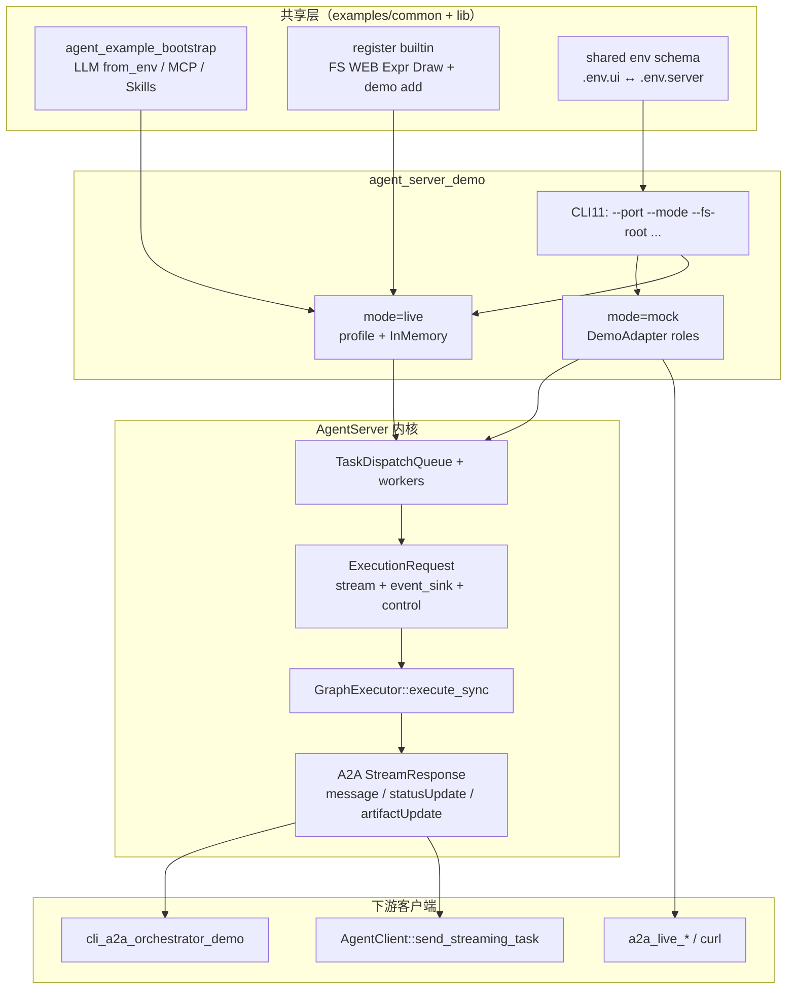
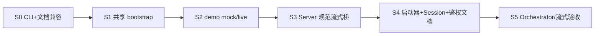
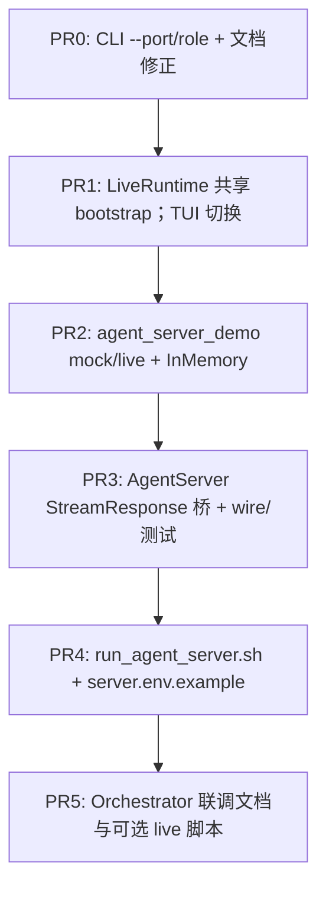

# `agent_server_demo` 深度升级计划（Live AgentServer）

本文档将 `agent_server_demo` 从 **A2A Tier C/D 契约桩** 升级为与 **`tui_agent_demo` 同级的实时业务能力**，同时 **保留** CI / live multi-agent 所需的确定性 mock 角色。流式语义对齐 **A2A `StreamResponse` 标准字段**（非自定义 `token` 事件）。

**文档版本**：1.0  
**日期**：2026-08-09  
**状态**：计划（未实施）  
**关联**：[agent-server.md](./agent-server.md)、[a2a-orchestrator.md](./a2a-orchestrator.md)、[a2a-integration-tests.md](./a2a-integration-tests.md)、[a2a-spec-tracker.md](./a2a-spec-tracker.md)、[rich-ui.md](./rich-ui.md)、[verifier.md](./verifier.md)、[phase-2-update-plan.md](./phase-2-update-plan.md)、[`agent_example_bootstrap.hpp`](../../examples/common/agent_example_bootstrap.hpp)、[`tui_agent_demo.cpp`](../../examples/tui_agent_demo.cpp)

---

## 1. 已锁定决策（Q1–Q9）

| # | 决策 | 落地约束 |
|---|------|----------|
| **Q1** | 定位为 **生产向可对外服务的 Live Agent** | Live 为默认产品路径；mock 仅为测试/兼容模式 |
| **Q2** | **demo + AgentServer 流式/事件桥** + **抽取与 TUI/Web 共用 bootstrap** | 禁止三端复制 MCP/Skills/LLM 初始化逻辑 |
| **Q3** | Live **必须**含：真实 LLM、Cursor MCP、Skills、FS+WEB+draw、Verifier、输入 **Tier B** | 均可通过 env/CLI 关闭，但 Live 默认开启（见 §5） |
| **Q4** | 流式走 **A2A `StreamResponse` 标准字段** | 禁止长期依赖自定义 `kind:token` SSE；见 §4 |
| **Q5** | **必须保留** `echo` / `integration-worker` / `integration-reviewer` | **默认**仍服务 CI / `a2a_live_multi_agent`；Live 显式进入 |
| **Q6** | `AGENT_FS_ROOT`、MCP 导入、`AGENT_TOOL_ALLOWLIST`、鉴权 **默认支持** | 启动器与 demo 提供开关与文档默认值；不强制裸奔 |
| **Q7** | Live **默认 InMemory** SessionStore；生产 SQLite 文档化 opt-in | 与 Server 库默认 SQLite 的差异须在 `start()` 前显式注入 |
| **Q8** | 支持 `./agent_server_demo --port 9001` + **`run_agent_server.sh`** | CLI 与 env 双通道；启动器镜像 `run_ui.sh` |
| **Q9** | 验收：Orchestrator 多轮工具任务 + `SendStreamingMessage` 边收边显 + **与 TUI 共用 bootstrap/配置** | DoD 见 §9 |

---

## 2. 目标与非目标

### 2.1 目标

1. **统一执行链**：`CLI / TUI / Web / AgentServer(Live)` 均经 `GraphExecutor::execute_*`（或兼容包装 `run_react_cli_*`），共享输入质控、AgentLoop、工具、Verifier、session 提交语义。
2. **实时可观测**：`SendStreamingMessage` / `SubscribeToTask` 客户端在任务 `WORKING` 期间持续收到规范 `StreamResponse`（增量文本、工具/Verifier/工件相关更新），而不仅是终态 `COMPLETED`。
3. **双模式共存**：
   - **mock（默认）**：现有 `DemoAdapter` + 空/最小 ToolBus，保证 Tier C/D 与 curl smoke **零破坏**。
   - **live**：`LLMClient::from_env` + 完整 bootstrap，供 Orchestrator / 人工联调。
4. **运维可启动**：CLI `--port` 等与文档一致；`tools/run_agent_server.sh` 一键配置构建与 Live/Mock 启动。

### 2.2 非目标（本计划不交付）

- 多租户隔离完备方案（WP2.5 之外的 IAM / OAuth）。
- 用 AgentServer 替换 `web_ui_demo` 进程内 UI（可后续对接，但本计划不合并两条 HTTP 面）。
- ImGui/Web 富 Markdown（见 [rich-ui.md](./rich-ui.md)）；本计划只保证 **A2A 文本/工件流**。
- 删除或改写 Tier A 契约 fixture 的 wire 形状（除非为增量 `message` 帧补充 tracker 附录）。

---

## 3. 现状差距（基线）

| 层 | 现状 | 升级后 |
|----|------|--------|
| `agent_server_demo.cpp` | 假 LLM、空 ToolBus、无 Skills/MCP、忽略 `argv` | mock/live 双模式；CLI11；共享 bootstrap |
| `AgentExecutionProfile` | demo 仅填 name/prompt/max_iter/deps | Live：完整 deps + `InputPolicyConfig` Tier B + Verifier env |
| `AgentServer::run_agent_task_on_executor` | `execute_sync`；`event_sink` 几乎一律 `push_verifier_sse`；**无** `stream_callback` | 注入流式回调；按 `ExecutionEventType` 映射规范 SSE |
| Session | 未注入时 Server 默认 SQLite | Live demo **显式 InMemory**；`--session-sqlite PATH` / env opt-in |
| 启动 | 仅 env | CLI + `run_agent_server.sh` + `.env.server`（与 `.env.ui` 字段对齐） |
| 测试 | Tier C/D 依赖 mock 角色 | mock 默认不变；新增 Live 可选集成与流式客户端断言 |

---

## 4. 架构与上下游交付链



### 4.1 职责边界

| 组件 | 负责 | 不负责 |
|------|------|--------|
| `examples/common/*` | LLM/MCP/Skills/工具注册、env 默认、技能 UI 状态 JSON | HTTP / A2A wire |
| `agent_server_demo` | 模式选择、Card、鉴权、SessionStore 选择、把 profile 注入 Server | 自行跑 AgentLoop |
| `AgentServer` | 任务队列、取消/超时、构造 `ExecutionRequest`、SSE 帧写出 | 解析 Cursor `mcp.json` |
| `GraphExecutor` | 输入策略、构图执行、Verifier、session commit、`ExecutionEvent` | A2A 认证 |
| Orchestrator / Client | 消费规范 `StreamResponse`、多轮 `contextId` | 假定自定义 token 事件 |

### 4.2 A2A 流式映射（Q4.A — 规范字段）

规范 `StreamResponse` oneof（见 [a2a-spec-tracker.md](./a2a-spec-tracker.md) §5）：`task` | `message` | `statusUpdate` | `artifactUpdate`。

**本计划固定映射**（实施时写入 tracker 附录，避免双源）：

| 内部信号 | SSE 载荷 | 规则 |
|----------|----------|------|
| 任务入队 / `PENDING→WORKING` | `statusUpdate`（或首帧 `task`） | 与现网一致 |
| LLM **answer** 增量 | **`message`**（`role=agent`，`parts[].text` 为**本段增量**） | 帧元数据：`metadata.streamChannel="answer"`，`metadata.append=true`；`messageId` 稳定（同轮同一 id） |
| LLM **thinking** 增量（可展示摘要） | **`message`** | `metadata.streamChannel="thinking"`，`append=true`；**禁止**泄露 provider 原始 CoT 密钥字段；与 TUI `thinking_stream_callback` 同源文本 |
| 工具开始/结束 | `statusUpdate` | `status.state=working`；`metadata.executionEvent` ∈ {`tool_started`,`tool_completed`} + tool 字段 |
| Verifier 起止 | `statusUpdate` | `metadata.component="verifier"` + 现有 `verifier_*` 字段；可并行保留 `push_verifier_sse` 一迁移周期 |
| `draw_*` / 文件工件 | `artifactUpdate` | `append`/`lastChunk` 按 WP2.1；小图可单帧 |
| 终态 | `statusUpdate`（completed/failed/cancelled） | 终态 `task.messages` 含完整 agent 文本；**已流式增量不得再全文重复 dump**（对齐 phase-1-wp6 §4.3） |

**客户端约定**：支持 `SendStreamingMessage` 的 Client 须按 `streamChannel`+`append` 拼接；旧 Client 忽略未知 `metadata` 时仍应能靠终态 `statusUpdate`/`task` 拿到完整答案。

**实现落点**：

1. `AgentServer::run_agent_task_on_executor` 设置  
   `request.options.react.graph_options.stream_callback` / `thinking_stream_callback` → 组装 `message` 帧并写入 SSE 通道。  
2. `request.event_sink` 按 `ExecutionEventType` 分支，**禁止**非 Verifier 事件一律 `push_verifier_sse`。  
3. 新增/扩展 wire 辅助（建议）：`stream_response_message_delta(...)`（若尚无）放在 `a2a/wire_mapping`。

---

## 5. Live 默认能力矩阵

与 TUI/`run_ui.sh` 对齐；差异仅在 **进程角色（Server）** 与 **Session 默认（InMemory）**。

| 能力 | Live 默认 | 关闭方式 | 说明 |
|------|-----------|----------|------|
| 真实 LLM | `LLMClient::from_env()` | —（Live 必需） | 同 TUI DeepSeek/OpenAI/Anthropic env |
| Cursor MCP | 导入 | `--no-cursor-mcp` / `AGENT_CLI_SKIP_CURSOR_MCP` | 共用 `bootstrap_agent_services` |
| Skills | Cursor 双根或 `AGENT_SKILLS_DIR` | `--no-skills` | `deps.skills` + `attach_toolbus` |
| FS | `AGENT_FS_ROOT`（启动器默认仓库根） | 不注册 fs 工具则无 | 与 allowlist 协同 |
| WEB | `AGENT_WEB_ENABLE=1` | `=0` | 仍受 host/HTTP 策略约束 |
| ExprTk | `AGENT_EXPR_ENABLE=1` | `=0` | |
| Draw | `AGENT_DRAW_ENABLE=1` | `=0` | 成功导出 → `artifactUpdate` |
| Verifier | Live 默认 `AGENT_VERIFIER=on`（启动器设置；库默认仍为 off） | `AGENT_VERIFIER=off` | 第二套 LLM；见 [verifier.md](./verifier.md) |
| 输入 Tier B | Live 默认 `input_policy.tier_b_enabled=true` + 专用/共享 LLM | `--no-tier-b` / env | 失败模式默认 `FallbackTierA`；可配 `Reject` |
| 鉴权 | 若设置 `AGENT_SERVER_AUTH_TOKEN` 则启用 Bearer 校验 | 不设置则仅内置 AuthGate 配置 | 与 [a2a-authentication.md](./a2a-authentication.md) 一致 |
| Allowlist | 支持 `AGENT_TOOL_ALLOWLIST` | 空=不限制（与现网一致） | Live 文档推荐显式列表 |
| Session | **InMemory** | `--session-sqlite PATH` 或 `AGENT_SERVER_SESSION=sqlite` | 生产文档强制写清 |

**mock 默认（保持现状语义）**：`DemoAdapter` 角色、不强制 MCP/Skills/Verifier/Tier B、不要求 API Key；Session 可用 InMemory 以免测试写盘。

---

## 6. 模式与 CLI 合同

### 6.1 模式

| 模式 | 进入方式 | 行为 |
|------|----------|------|
| **mock** | **默认**；或 `--mode mock`；或 `AGENT_SERVER_DEMO_MODE=mock` | `AGENT_SERVER_DEMO_ROLE`=`echo`\|`integration-worker`\|`integration-reviewer`；假 LLM；供 CI/Tier D |
| **live** | `--mode live` 或 `AGENT_SERVER_DEMO_MODE=live` | 真实 LLM + 全量 bootstrap；Card `name` 默认 `agent-server-live`（可覆写） |

**兼容**：未指定 `--mode` 且未设 `AGENT_SERVER_DEMO_MODE` 时保持 **mock**，确保现有脚本与 `a2a_live_multi_agent` **不改 env 即可绿**。

### 6.2 CLI（与文档对齐）

```text
agent_server_demo [options]

  --port N                         覆盖 AGENT_SERVER_PORT（例：9001）
  --bind ADDR                      覆盖 AGENT_SERVER_BIND（默认 127.0.0.1 于 demo）
  --mode mock|live                 见上
  --role echo|integration-worker|integration-reviewer
  --card-public-base URL           AGENT_SERVER_CARD_PUBLIC_BASE
  --json-rpc-path PATH             默认 /rpc
  --fs-root PATH                   AGENT_FS_ROOT
  --skills-root / --skill-authoring-root / --no-skills
  --cursor-mcp-json PATH / --no-cursor-mcp
  --skip-mcp-service NAME          可重复
  --max-iterations N
  --provider / --model
  --no-tier-b
  --verifier on|off|sample         映射 AGENT_VERIFIER
  --session memory|sqlite
  --session-db PATH                AGENT_SESSION_DB（sqlite 时）
  --auth-token TOKEN               或依赖 AGENT_SERVER_AUTH_TOKEN
  -v, --verbose
  -h, --help
```

`argv` 优先级：**CLI > 进程已有 env > 启动器写入的默认**。  
`./agent_server_demo --port 9001` 在 mock 下必须可运行（无需 API Key）。

### 6.3 `run_agent_server.sh`

路径：`agent_framework/tools/run_agent_server.sh`（行为对标 `run_ui.sh`）。

| 能力 | 行为 |
|------|------|
| 构建 | 默认 `build-server`；`-DAGENT_BUILD_EXAMPLES=ON`；目标 `agent_server_demo` |
| env 文件 | `.env.server`（优先）或复用 `.env.ui` 字段；`--env-file` |
| `--mode live\|mock` | 传给二进制 |
| `--port` / `--fs-root` / MCP / Skills | 同 UI 启动器 |
| Live 默认 | `AGENT_VERIFIER=on`、Tier B on、InMemory、WEB/DRAW/EXPR=1 |
| Mock 默认 | 不要求密钥；不强制 Verifier |
| `--dry-run` | 脱敏打印计划 |
| 鉴权 | 若 `.env` 含 `AGENT_SERVER_AUTH_TOKEN` 则导出 |

示例：

```bash
# CI / Tier D 风格（默认 mock）
./agent_framework/tools/run_agent_server.sh --port 9001 --mode mock --role integration-worker

# Live（与 TUI 同配置面）
cp agent_framework/examples/configs/ui.env.example .env.server
./agent_framework/tools/run_agent_server.sh --mode live --port 9001 --fs-root "$PWD"
```

---

## 7. 共享 bootstrap 抽取（Q2.C / Q9）

### 7.1 目标 API（建议落在 `examples/common/`）

在现有 `agent_example_bootstrap.hpp` 上扩展（或新增 `agent_live_runtime.hpp`），供 **tui / web / imgui / agent_server_demo** 调用：

```text
LiveRuntimeOptions
  - mode hints, skills/mcp flags, fs_root, verbose, skip_mcp_services
  - enable_tier_b, verifier_mode, max_iterations, system_prompt_profile

LiveRuntime
  - shared_ptr<LLMClient> llm
  - shared_ptr<ToolBus> toolbus
  - shared_ptr<SkillServices> skills
  - AgentConfig config
  - InputPolicyConfig input_policy
  - BootstrapResult mcp_boot
  - diagnostics[]

build_live_runtime(ToolBus& already_or_internal, LiveRuntimeOptions)
  → 注册 demo add + register_builtin_*_if_configured
  → bootstrap_agent_services
  → apply_live_llm_env_defaults（从 tui 上收）
  → 组装 AgentConfig.system_prompt（与 tui 文案策略一致，可抽常量）

to_execution_profile(LiveRuntime, AgentCard.name)
  → AgentExecutionProfile
```

### 7.2 配置文件

| 文件 | 用途 |
|------|------|
| `examples/configs/ui.env.example` | 已有；Live Server **复用同一键名** |
| `examples/configs/server.env.example` | Server 增量：`AGENT_SERVER_*`、`AGENT_SERVER_DEMO_MODE`、`AGENT_VERIFIER`、`AGENT_SERVER_SESSION` |
| 仓库根 `.env.server` / `.env.ui` | 本地密钥；gitignore |

**禁止** Server Live 另造一套 `OPENAI_*` 变量名。

### 7.3 迁移顺序

1. 抽出 `apply_live_llm_env_defaults` + `build_live_runtime`（从 tui/web 复制合并）。  
2. `tui_agent_demo` / `web_ui_demo` 改为调用共享 API（行为不变，可同一 PR 或紧随 PR）。  
3. `agent_server_demo` Live 路径只调共享 API。

---

## 8. 分阶段实施（S0–S5）



### S0 — CLI 与文档基线（不改执行语义）

| ID | 任务 | 产出 | 验收 |
|----|------|------|------|
| S0.1 | CLI11：`--port`/`--bind`/`--role`/… | `agent_server_demo.cpp` | `./agent_server_demo --port 9001` 监听 9001 |
| S0.2 | 修正 [a2a-orchestrator.md](./a2a-orchestrator.md) 等与 CLI/env 一致 | 文档 | 无「仅 env」误导 |
| S0.3 | mock 路径行为金丝雀 | 现有 `a2a_live_smoke`（若本地可跑）或编译烟测 | mock 默认不变 |

### S1 — 共享 bootstrap

| ID | 任务 | 产出 | 验收 |
|----|------|------|------|
| S1.1 | `LiveRuntime` / `build_live_runtime` | `examples/common/` | 单测或 demo 链接 |
| S1.2 | 内建工具注册与 TUI 对齐 | 同上 | allowlist 下 FS/WEB/draw 可调 |
| S1.3 | TUI（及可选 Web）切到共享 API | 示例改动 | TUI 手动一轮对话无回归 |

### S2 — demo mock/live 双模式

| ID | 任务 | 产出 | 验收 |
|----|------|------|------|
| S2.1 | `--mode` + 保留三角色 `DemoAdapter` | demo | Q5：默认 mock；Tier D 脚本无需改 |
| S2.2 | live：`set_execution_profile(to_execution_profile(...))` | demo | 无 key 时 live 启动失败信息清晰 |
| S2.3 | Live：`set_session_store(InMemory)`；sqlite opt-in | demo | Q7 |
| S2.4 | Live：`InputPolicyConfig` Tier B + Verifier env | demo | `AGENT_VERIFIER` / tier_b 可见于日志 |
| S2.5 | Card：live 与 mock 的 skills/capabilities 声明 | demo | Well-Known 可区分 |
| S2.6 | `set_authentication_validator` 保持；文档 AuthGate | demo + docs | token 负例 401 |

### S3 — AgentServer 规范流式 / 事件桥（Q2.B / Q4.A）

| ID | 任务 | 产出 | 验收 |
|----|------|------|------|
| S3.1 | `ExecutionRequest` 注入 answer/thinking `stream_callback` → `message` 帧 | `agent_server.cpp` + wire | `SendStreamingMessage` 中途可见增量 |
| S3.2 | `event_sink` 分流 Tool/Verifier/Memory/Artifact | `agent_server.cpp` | 非 verifier 不再误用 verifier SSE 名 |
| S3.3 | `artifactUpdate` 接线（draw/export 或 ExecutionEvent） | server + 可选 tool 钩子 | 至少一条工件帧 |
| S3.4 | 终稿去重 | server | 已 stream 全文不再重复 |
| S3.5 | Client 解析 `metadata.streamChannel`/`append` | `AgentClient` 或文档+测试辅助 | 拼接结果 == 终态文本 |
| S3.6 | tracker / agent-server 文档附录 | 文档 | 字段表与实现一致 |
| S3.7 | 契约：新增/扩展 SSE fixture（增量 `message`） | `tests/fixtures/a2a` + ctest | Tier A 不破；新用例可 SKIP 友好 |

### S4 — 启动器与运维面

| ID | 任务 | 产出 | 验收 |
|----|------|------|------|
| S4.1 | `tools/run_agent_server.sh` | 脚本 | `--dry-run` / live / mock |
| S4.2 | `server.env.example` | 配置样例 | 与 ui.env 键兼容说明 |
| S4.3 | [agent-server.md](./agent-server.md) + [examples/README.md](../../examples/README.md) 更新 | 文档 | Q7/Q8 写清 |
| S4.4 | 安全默认表：FS_ROOT、allowlist、MCP skip、auth | 文档 | Q6 |

### S5 — 端到端验收（Q9）

| ID | 任务 | 产出 | 验收 |
|----|------|------|------|
| S5.1 | Orchestrator → Live Server：多轮 + 工具 | 手册步骤或脚本 | 终态成功且 history 延续 `contextId` |
| S5.2 | `SendStreamingMessage` 边收边显 | 小测试或 `AgentClient` 示例断言 | 收到 ≥2 帧 answer `message` 后才 completed |
| S5.3 | mock 回归：`a2a_live_multi_agent` / curl smoke | CI/本地 | **默认 mock 零破坏** |
| S5.4 | 取消：WORKING 中 `CancelTask` | 测试 | 协作取消 + SSE 终态 |

---

## 9. 验收清单（DoD）

### 9.1 兼容（必须）

- [ ] 默认（无 `--mode live`）行为仍服务 Tier C/D：`integration-worker` / `integration-reviewer` / `echo` 可用。  
- [ ] `./agent_server_demo --port 9001` 有效。  
- [ ] 现有 `a2a_contract_*` / loopback /（可选）live smoke **不因本次改动变红**。

### 9.2 Live 功能（必须）

- [ ] Live 使用真实 LLM + Cursor MCP + Skills + FS/WEB/draw（可由 env 关，但启动器默认开）。  
- [ ] Live 默认开启 Verifier（`AGENT_VERIFIER=on`）与输入 Tier B。  
- [ ] Live 默认 InMemory session；文档说明生产 SQLite opt-in。  
- [ ] 鉴权、`AGENT_FS_ROOT`、`AGENT_TOOL_ALLOWLIST`、MCP 导入在启动器/文档中一等公民支持。

### 9.3 实时与编排（必须）

- [ ] `SendStreamingMessage`：客户端在完成前收到规范 **`message` 增量帧**（answer；thinking 若模型提供则另通道）。  
- [ ] 工具与 Verifier 进度以 **`statusUpdate`**（规范根对象）可见。  
- [ ] `cli_a2a_orchestrator_demo` 指向 Live Server 可完成 **带工具的多轮** 任务。  
- [ ] TUI 与 Server Live **共用** bootstrap API 与同一套 env 键（`.env.ui` / `.env.server`）。

### 9.4 工程（必须）

- [ ] `run_agent_server.sh` 可 mock/live 启动。  
- [ ] 本文件与 `agent-server.md` / orchestrator / examples README 交叉链接更新。

---

## 10. 测试矩阵

| ID | 阶段 | 类型 | 内容 |
|----|------|------|------|
| AS-0 | S0 | 手动/脚本 | `--port` 绑定 |
| AS-1 | S2 | 单元/集成 | mock 角色输出签名 / review_pass（保持） |
| AS-2 | S3 | 集成 | streaming：多帧 `message` + 终态；去重 |
| AS-3 | S3 | 契约 | fixture 增量帧解析 |
| AS-4 | S3 | 集成 | tool `statusUpdate`；verifier 事件 |
| AS-5 | S5 | 可选 live | Orchestrator + Live（`AGENT_A2A_LIVE=1` 类门闩） |
| AS-6 | S5 | 集成 | Cancel 协作 |
| AS-R | 全程 | 回归 | `ctest -R 'a2a_'` 默认 job 不强制 live |

**CI 策略**：默认 PR **不**要求 API Key / Live；S3 流式可用 InMemory Server + Fake adapter 发伪增量（扩展 `ServerTestAdapter` 支持 `stream_callback`）做确定性测试。

---

## 11. PR 提交顺序



**合并闸门**：P2 合入后 mock 默认必须绿；P3 合入前完成 Fake 流式单测，避免仅依赖人工 Live。

---

## 12. 风险与缓解

| 风险 | 影响 | 缓解 |
|------|------|------|
| 增量 `message` 与规范解读偏差 | 外部 Client 不识别 | tracker 附录 + `metadata.append`；终态仍带全文 |
| Live 默认 Verifier/Tier B 延迟与成本 | 体验/费用 | 启动器可关；文档给「开发轻量」profile |
| MCP 导入拖慢/拖垮 Server 启动 | 运维 | `--no-cursor-mcp`、`AGENT_MCP_SKIP_SERVICES`、超时 env |
| FS 根过宽（如 `/home`） | 安全 | 启动器默认仓库根；文档强调 allowlist |
| SQLite/InMemory 行为分叉 | 多轮联调困惑 | Live 默认 memory；生产 checklist 强制 sqlite |
| TUI 重构回归 | UI 不可用 | P1 行为对等测试；可先提取再切 TUI |
| 双模式误用 | CI 偶发打到 Live | **默认 mock**；CI 禁止无门闩 Live |

---

## 13. 文档与代码触点清单

| 路径 | 变更类型 |
|------|----------|
| `examples/agent_server_demo.cpp` | 重写级增强 |
| `examples/common/agent_example_bootstrap.hpp`（及 .cpp 若拆出） | 扩展 LiveRuntime |
| `examples/tui_agent_demo.cpp`（web/imgui 可选） | 改用共享 API |
| `include/agent/agent_server/agent_server.hpp` / `src/agent_server/agent_server.cpp` | 流式桥、事件分流 |
| `include/agent/a2a/wire_mapping.hpp` (+实现) | message delta 辅助 |
| `include/agent/agent_client/agent_client.hpp`（若需） | 增量拼接辅助 |
| `tests/support/test_execution_profile.hpp` | Fake 流式 |
| `tests/test_phase2_a2a_execution.cpp` 等 | 流式断言 |
| `tools/run_agent_server.sh` | 新增 |
| `examples/configs/server.env.example` | 新增 |
| `docs/guides/agent-server.md`、`a2a-orchestrator.md`、`a2a-spec-tracker.md`、`examples/README.md` | 同步 |
| **本文** `docs/guides/agent_server_demo-update.md` | 计划源 |

---

## 14. 建议实施工期（粗估）

| 阶段 | 粗估 | 依赖 |
|------|------|------|
| S0 | 0.5–1 d | 无 |
| S1 | 1–2 d | 与 TUI 协调 |
| S2 | 1–2 d | S1 |
| S3 | 3–5 d | wire/客户端/测试最重 |
| S4 | 0.5–1 d | S2 |
| S5 | 1–2 d | S3 + 密钥环境 |
| **合计** | **约 1.5–2 周** 日历（单人专注） | Live 联调另计 |

---

## 15. 修订记录

| 日期 | 版本 | 说明 |
|------|------|------|
| 2026-08-09 | 1.0 | 初稿：按 Q1–Q9 锁定 Live 定位、规范 StreamResponse、共享 bootstrap、双模式、InMemory、启动器与分阶段 DoD |
