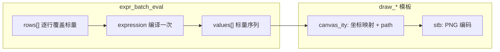

# 内建 draw_* 栅格绘图与图像输出（设计 / 集成指南）

本文档说明如何在 **Agent Framework** 中基于 **[canvas_ity](https://github.com/a-e-k/canvas_ity)**（HTML5 Canvas 风格 2D 光栅化，单头、ISC）与 **[stb](https://github.com/nothings/stb)**（**`stb_image_write.h`** 写 PNG 等、**`stb_image.h`** 读图，单头、公有领域）**设计并实现**面向 LLM 的 **`draw_*` 本地工具**，并与 **`ToolBus::register_local_tool`**、**`build_cli_agent_graph`**、以及既有内建工具协同。

文档定位与 [builtin-fs-tools.md](./builtin-fs-tools.md)、[builtin-web-tools.md](./builtin-web-tools.md)、[builtin-exprtk-tools.md](./builtin-exprtk-tools.md) 并列：

| 边界 | 内建工具族 | 本文档关注点 |
|------|------------|----------------|
| 本地路径 | **`fs_*`** | 绘图结果**落盘**须落在 **`AGENT_FS_ROOT`** 监禁内（自管路径或委托 `fs_write`） |
| 出站 HTTP | **`web_*`** | **参考图 / 纹理 / 远程配色表**等可先 `web_fetch` 再解码；**不得**让模型任意指定未校验的 URL 写入画布输入 |
| 可执行数学语言 | **`expr_*`** | **几何参数、颜色、动画关键帧**等用表达式求值，再把标量/向量喂给绘图 API |
| **栅格绘制与编码** | **`draw_*`（v1 已实现）** | **画布尺寸、指令复杂度、像素缓冲、PNG 输出**的上限与错误语义 |

**安全说明**：`draw_*` **不是**图形/GPU 沙箱；若允许模型提交**高阶绘图指令序列**，须限制 **画布分辨率、指令条数、单调用 CPU 时间或步数**，并对 **从网络加载的图像/字体** 与 **写入路径** 沿用 **`web_*` / `fs_*` 的边界策略**。canvas_ity 上游明确：**TrueType 解析非安全**，仅应对 **已知良好或已消毒** 的字体文件使用内置 TTF 路径（见上游头文件 **LIMITATIONS**）。

---

## 现状说明（本仓库）

| 项 | 状态 |
|----|------|
| **第三方依赖** | 子模块 **`3rd-party/canvas_ity`**（头文件在 **`src/canvas_ity.hpp`**）、**`3rd-party/stb`**（**`stb_image.h`** / **`stb_image_write.h`** 等） |
| **CMake** | **`agent_framework/CMakeLists.txt`**：存在头文件时加入 include，并定义 **`AGENT_HAVE_CANVAS_ITY`**、**`AGENT_HAVE_STB_IMAGE`**；**`test_canvas_ity_smoke`** 在定义 **`AGENT_HAVE_STB_IMAGE_WRITE`** 时链接 PNG 输出逻辑 |
| **冒烟测试** | **`agent_framework/tests/test_canvas_ity_smoke.cpp`**：`canvas_ity::canvas` 绘制复杂场景，**默认输出 PNG**（有 stb 时）或 **TGA**；路径可由参数、环境变量 **`AGENT_TEST_CANVAS_OUT`** 指定；运行 **`ctest -R canvas_ity_smoke`** |
| **`draw_*` ToolBus 注册** | **v1 已实现**：**`register_builtin_draw_tools_if_configured(ToolBus&)`**（声明 **`include/agent/draw_tools.hpp`**，实现 **`src/toolbus/draw_tools.cpp`**）；**`build_cli_agent_graph`** 在 **`register_builtin_expr_tools_if_configured`** 之后调用。无 **canvas_ity** 或编译单元内不可见 **`stb_image_write.h`** 时为 **空 stub**，不注册工具。 |
| **回归测试** | **`agent_framework/tests/test_draw_tools.cpp`**；**`ctest -R draw_tools`**（含 **`AGENT_DRAW_ENABLE=0`**、allowlist 部分列表、**`dimension_limit`** / **`command_limit`**、**`draw_export`** 写 **`AGENT_FS_ROOT`** 下文件） |

初始化子模块示例：

```bash
git submodule update --init 3rd-party/canvas_ity 3rd-party/stb
```

---

## 与既有内建工具的综合用法（推荐给 Agent / 运维文档）

以下场景**不依赖** `draw_*` 已存在即可在架构上对齐；实现阶段可按列「工具组合」拆分为多轮调用。

### 1. 计算—绘制—落盘

1. **`expr_eval` / `expr_batch_eval`**：生成折线点列、柱状高度、颜色分量（0–1 或 0–255 需在工具契约中固定）。
2. **`draw_*`（规划）**：接收 **规范化绘图指令**（见下文「建议工具形态」）或 **`template_id` + 模板参数**（见上文 **「与 expr_batch_eval 输出对齐的 canvas_ity 绘图模板」**），在内存中 **`canvas_ity::canvas`** 光栅化，`get_image_data` 得到 RGBA。
3. **`fs_write`**：将 **PNG 字节**（推荐）或 **Base64** 解码后的二进制写入 **`AGENT_FS_ROOT`** 下相对路径；**须** `confirm_overwrite` 等现有确认语义。

**注意**：若 `draw_*` 自身接受 **`relative_path`** 并内部写盘，实现上应 **复用与 `fs_*` 相同的 `weakly_canonical` 根监禁逻辑**，避免第二套路径解析规则。

### 2. 网络资源参与绘制

1. **`web_fetch`**（或 **`web_configured_source`**）：在允许的主机与体积上限内拉取图像（或 JSON 规格）。
2. **`stb_image`**（在实现 TU 中 `#define STB_IMAGE_IMPLEMENTATION` **仅一处**）：解码为 RGBA，经 **`canvas::put_image_data`**（或等价 API）贴入画布。
3. 输出仍建议 **PNG**，再 **`fs_write`** 或 `draw_export` 返回 **`bytes_base64`**（小图）由上层决定落盘。

**禁止**：将 **任意 URL** 直接作为 `draw_*` 参数而不经 **`web_*` 同一套 SSRF/大小/主机策略**。

### 3. 数据文件驱动图表

1. **`fs_read`**：读取 CSV/JSON（UTF-8）。
2. **`expr_*`** 或轻量解析：聚合为绘图用数组。
3. **`draw_*`**：折线/柱状/简单图例；标签文字若用 canvas_ity 内置字体，需接受 **无高级排版** 的上游限制。

### 4. 仅表达式校验与绘图草稿

1. **`expr_validate`**：确认变量与函数依赖，避免在绘图调用中才发现非法表达式。
2. **`draw_*`**：可先返回 **低分辨率预览**（环境变量控制），确认后再全尺寸导出。

---

## 与 `expr_batch_eval` 输出对齐的 canvas_ity 绘图模板（规划）

内建 **`expr_batch_eval`** 的约定（实现见 **`src/toolbus/expr_tools.cpp`**）：**同一 `expression` 只编译一次**，对 **`rows`** 中每一行合并标量后求 **`expression.value()`**，成功时返回 **`values`** 数组，**与 `rows` 等长**，**每个元素为一条标量**（**不支持 `return()`**；任一行非有限或越循环上限则整 call 失败）。详见 [builtin-exprtk-tools.md](./builtin-exprtk-tools.md) §5、§6。

**要点**：一次批量调用 **只产生一维数值序列** `values[]`。若绘图需要 **(x,y) 双通道** 或 **多系列**，应 **多次 `expr_batch_eval`（相同 `rows`、不同 `expression`）**，或在 **`expr_eval` 中配合 `vectors`** 一次求多量（失去「每行一变」的批量优势）。下面模板按 **与 `values[]` / `rows` 的自然衔接** 设计，供 `draw_*` 的 **`template_id` + `template_params`** 或等价 JSON 使用。

### 数据流（概念）



### 模板一览（建议 `template_id`）

| `template_id` | 用途 | 主要输入（除画布宽高、边距外） | 与 `expr_batch_eval` 的衔接 |
|---------------|------|--------------------------------|-----------------------------|
| **`line_series_uniform_x`** | 折线 / 趋势 | **`y_values`**（长度 n） | 直接使用返回的 **`values`**；横轴为 **索引 0…n−1** 线性映射到绘图区宽度 |
| **`line_series_dual_batch`** | 参数曲线 / 时序 (x(t),y(t)) | **`x_values`**, **`y_values`**（等长） | **两次** `expr_batch_eval`，**相同 `rows`**（如每行 `variables.t` 或 `i`），**不同 `expression`**（分别产出 x、y） |
| **`scatter_rows`** | 散点 | **`rows` 几何副本**或 **`points`**: `{x,y}` 列表 | 若 x、y **已由数据给出**，可不经表达式，直接把 **`rows[].variables.x` / `.y`** 映射到像素；**颜色/大小** 可用 **第三次** batch：`expression` 返回标量 → **`values`** 映射色带或半径 |
| **`bar_chart`** | 柱状 | **`heights`**（长度 n） | **`values`** 作为柱高；类别轴为 **索引** 或另行传入 **`labels`**（文字能力受 canvas_ity 文本限制） |
| **`area_under_line`** | 面积图 | **`y_values`** | 在 **`line_series_uniform_x`** 路径基础上 **闭合到基线**（y = y_base，常数或来自 `variables`）后 **`fill`** |
| **`sparkline`** | 内嵌小趋势图 | **`y_values`** + **`style`**（线宽、颜色） | 同 **`line_series_uniform_x`**，**预设小画布**（如 120×32），便于日志/卡片配图 |

### 行表与表达式模式（写给 Agent 的提示片段）

- **索引行**（最常用）：`rows` 为 `[{ "variables": { "i": 0 } }, { "variables": { "i": 1 } }, … ]`（i 亦可换为 `t`、`k`；**每行必须包含 batch 推导出的全部标量键**）。
- **单通道 y = f(i)**：`expression` 示例：`sin(i * 0.1)`、`exp(-i/20) * sin(i)`；结果 **`values[k]`** → 模板 **`line_series_uniform_x`** 的第 k 个点纵坐标（经线性缩放 + clamp 到绘图区）。
- **双通道**：第一次 `expression`: `cos(t)` → `x_values`；第二次 `expression`: `sin(t)` → `y_values`；模板 **`line_series_dual_batch`** 按对 **`line_to`** 连接（**点数上限**受 **`AGENT_DRAW_MAX_COMMANDS`** 与 canvas_ity 路径限制）。
- **依赖向量**：顶层 **`vectors`** 在 batch 内对所有行共享；例如 `expression`: `data[i]`（需 ExprTk 语法与 **`i` 整数语义**一致）；仍得到 **每行一个标量** 的 **`values`**，再交给 **`line_series_uniform_x`**。
- **归一化**：若希望 y 落在 [0,1] 再映射到像素，可先 **一批** `expression` 为原始量，在 **客户端**用 min/max 归一；或 **第二批** batch 在 ExprTk 内写 **`(y - y_min) / (y_max - y_min)`**（需 **`y_min`/`y_max`** 为 **`constants`** 或预先 `expr_eval` 求得）。

### canvas_ity 侧共性步骤（实现检查表）

1. **`fill_rectangle` 背景** → 可选 **坐标轴**（`move_to`/`line_to` 或 `stroke_rect` 边框）。
2. **数据域 → 像素域**：`px = pad_l + (x - x_min) / (x_max - x_min) * plot_w`（y 轴注意 **翻转**：画布向下为正）。
3. **`move_to` 第一点**，随后对每个后续点 **`line_to`**；**`stroke`**；面积图再 **`line_to` 右下角/左下角** **`close_path`** **`fill`**。
4. **`get_image_data`** → **`stbi_write_png`**（或 TGA）。

### 配额与失败语义（与 batch 联动）

| 风险 | 缓解 |
|------|------|
| **`rows` 过长** | **`expr_batch_eval`** 受 **`AGENT_EXPR_*`** 与单次请求体限制；绘图侧 **`AGENT_DRAW_MAX_COMMANDS`** 应对 **`line_to` 条数 ≈ n−1** |
| **非有限 `values[k]`** | batch 已整批拒绝；绘图实现仍应对 **NaN 跳过**或 **报错**，避免脏路径 |
| **x/y 尺度极端** | 模板内 **clamp** 到绘图矩形内，或返回 **`clamped: true`** 元数据 |

### `draw_*` 参数形状（建议，与模板联动）

```json
{
  "template_id": "line_series_uniform_x",
  "width": 800,
  "height": 400,
  "padding": { "top": 20, "right": 20, "bottom": 40, "left": 50 },
  "template_params": {
    "series": [
      {
        "y_values": [0.12, 0.48, 0.33],
        "stroke": [0.1, 0.4, 0.9, 1.0],
        "line_width": 2.0
      }
    ]
  }
}
```

其中 **`y_values`** 可直接来自工具链上前一步 **`expr_batch_eval` 的 `values`**（类型均为 number）。**`line_series_dual_batch`** 则使用 **`x_values` / `y_values`** 两个数组替代单一 **`y_values`**（均在 **`template_params`** 内，见 **`draw_render` / `draw_export` 工具契约**）。

---

## 依赖与构建要点

| 项 | 说明 |
|----|------|
| **canvas_ity** | **`#define CANVAS_ITY_IMPLEMENTATION`** 在**恰好一个** `.cpp` 中于 `#include "canvas_ity.hpp"` 之前；其余 TU 只包含头文件声明 |
| **stb 写图** | **`#define STB_IMAGE_WRITE_IMPLEMENTATION`** 在**恰好一个** `.cpp` 中于 `#include "stb_image_write.h"` 之前 |
| **stb 读图** | **`#define STB_IMAGE_IMPLEMENTATION`** 在**恰好一个** `.cpp` 中于 `#include "stb_image.h"` 之前 |
| **输出格式** | **PNG**（无损、通用）优先；**TGA** 无压缩、实现极简，可作兜底或调试 |
| **编译宏** | 业务代码可用 **`#if defined(AGENT_HAVE_CANVAS_ITY)`** / **`AGENT_HAVE_STB_IMAGE`** 做条件编译，与 ExprTk 模式一致 |

---

## 建议安全门闩（实现时环境变量）

下列名称仅为**建议**；落地时与 **`expr_*` / `web_*` 文档**同样写入 `getting_started` 与运维说明。

| 变量（建议） | 含义 | 示例默认 |
|--------------|------|-----------|
| **`AGENT_DRAW_ENABLE`** | `0` / `false` / `off` / `no` 时**不注册** `draw_*` | 未设置视为开启（与 `AGENT_EXPR_ENABLE` 风格可对齐） |
| **`AGENT_DRAW_MAX_WIDTH`** / **`AGENT_DRAW_MAX_HEIGHT`** | 单画布像素上限 | `4096` / `4096`（按产品调小） |
| **`AGENT_DRAW_MAX_PIXELS`** | `width*height` 硬顶，防 OOM | `16777216`（16M 像素） |
| **`AGENT_DRAW_MAX_COMMANDS`** | 单调用绘图原语条数上限（**v1 折算见下表**） | `10000` |
| **`AGENT_DRAW_MAX_OUTPUT_BYTES`** | 编码后 PNG 等最大字节 | `20971520`（20 MiB） |
| **`AGENT_DRAW_MAX_DECODE_BYTES`** | 自 `web_*` / 上传 Base64 解码后的 RGBA 上限 | 与 `web_*` 响应上限协调 |

### `AGENT_DRAW_MAX_COMMANDS` 折算（v1 实现，与 `draw_tools.cpp` 一致）

预检在分配大缓冲前执行；超限返回 **`command_limit`**。

| 开销项 | 计数 |
|--------|------|
| 背景清屏 + 两根坐标轴线 | 固定 **`1 + 2`**（实现内计入 **`estimate_command_budget` 的 `base`**） |
| 折线（**n** 个数据点，**n ≥ 2**） | **`n + 1`**（`move_to` + **`n−1`** 次 `line_to` + `stroke`） |
| 面积图（**n** 点，在单系列 **`area_under_line`** 上） | **`base + (n + 1) + 4 + (n + 1)`**（闭合到基线、`fill`，再加描边折线；与 **`area_command_cost`** 一致） |
| 柱图（**n** 根柱） | **`base + n`**（每柱一次 `fill_rectangle`） |
| 散点（**n** 点） | **`base + n`**（每点一小矩形） |
| 多系列折线（**`line_series_uniform_x`**） | 各系列 **`y_values` 长度 nᵢ 的 **`nᵢ + 1`** **求和**，再加 **`base`** |

**默认画布边距**：未传 **`padding`** 时每边 **20px**；若 **`width`/`height` 过小**会导致「无绘图区」类 **`invalid_arguments`**，小图请显式减小 **`padding`**。

---

## 建议工具形态（`draw_*` 拆分）

可一种或多种并存；与 [builtin-exprtk-tools.md](./builtin-exprtk-tools.md) §5 类似，推荐**职责分离**以便限流与审计。

| 工具名（示例） | 职责 | 说明 |
|----------------|------|------|
| **`draw_render`** | 按 **JSON 指令表** 或 **DSL 子集** 在服务端构建 `canvas_ity::canvas` 并光栅化 | 返回 **`width`/`height`** + **`rgba_base64`** 或仅 **`png_base64`**；**不**写盘 |
| **`draw_export`** | 与 `draw_render` 相同但 **允许 `relative_path`** | 内部走 **`AGENT_FS_ROOT`** 监禁，等价于受控 **`fs_write`** 二进制 |
| **`draw_measure_text`**（可选） | 仅返回文本包围盒，不整图渲染 | 降低滥用整画布的成本；若上游文本能力弱，可标注为近似 |
| **`draw_from_template`**（可选） | 仅接受 **白名单 `template_id`** 与 **固定 schema 的 `template_params`** | 将 **`expr_batch_eval` 的 `values`** 与 **`rows` 几何**映射为 canvas_ity 调用序列，**不**接受任意自由指令表，利于审计与限流 |

**不推荐**让模型在单次调用中上传 **原始 PNG 再要求服务器「仅叠加」**：应明确 **矢量/指令入口** 与 **像素入口** 两套策略，像素入口须 **更小配额** 与 **尺寸校验**。

### JSON 指令表（示意）

实现可定义 **版本化** `schema_version` 与 **有限** 操作集合，例如：

- `clear` / `fill_rect` / `stroke_rect`
- `path`: `move_to` / `line_to` / `quadratic_curve_to` / `close_path` + `fill` / `stroke`
- `set_stroke_style` / `set_fill_style`（sRGBA 0–1）
- `set_line_width` / `set_line_dash` / `global_composite_operation`（枚举映射到 canvas_ity）

**Schema** 须 **`additionalProperties: false`**（或等价）以减少注入面；未知键返回 **`unknown_field`**。

---

## `AGENT_TOOL_ALLOWLIST`

若设置 **`AGENT_TOOL_ALLOWLIST`**（逗号分隔），须将计划暴露的 **`draw_*` 名称一并列入**（与 `fs_*`、`web_*`、`expr_*` 相同约定）；仅列部分会导致注册阶段抛错。

---

## 测试建议

| 目标 | 建议 |
|------|------|
| **库可用** | 保留并 CI 运行 **`test_canvas_ity_smoke`** |
| **`draw_*` 行为** | **`test_draw_tools`**：**`draw_render`** 解码 **`png_base64`** 校验 PNG 魔数与 IHDR 宽高；**`draw_export`** 写盘读回魔数；**`ctest -R draw_tools`** |
| **与 `fs_*` 集成** | 在 **`AGENT_FS_ROOT`** 临时目录下 **`draw_export`**（或 **`fs_read`** 二进制预览）校验魔数 |

---

## 附录：两步调用示例（`expr_batch_eval` → `draw_render`）

下列 JSON 仅示意字段关系；**`rows` 较长时请遵守 `AGENT_EXPR_*` 与 `AGENT_DRAW_MAX_COMMANDS`**。

**步骤 1** — 生成 **`y_values` 同源的一维序列（与 `rows` 等长）：

```json
{
  "expression": "sin(i * 0.1)",
  "rows": [
    { "variables": { "i": 0 } },
    { "variables": { "i": 1 } },
    { "variables": { "i": 2 } }
  ]
}
```

假设返回 **`values`: `[0.0, 0.0998, 0.1986]`**（示例数值）。

**步骤 2** — **`draw_render`**（**`template_id`: `line_series_uniform_x`**）：

```json
{
  "template_id": "line_series_uniform_x",
  "width": 400,
  "height": 200,
  "padding": { "top": 12, "right": 12, "bottom": 12, "left": 12 },
  "template_params": {
    "series": [
      {
        "y_values": [0.0, 0.0998, 0.1986]
      }
    ]
  }
}
```

响应含 **`png_base64`**（无 `data:` 前缀）、**`width`**、**`height`**。落盘请用 **`draw_export`**（需 **`AGENT_FS_ROOT`**、**`relative_path`**、**`confirm_overwrite`**）或 **`fs_write`** 写入解码后的 PNG 字节。

---

## 参考链接

- canvas_ity：<https://github.com/a-e-k/canvas_ity>  
- stb：<https://github.com/nothings/stb>  
- 内建文件工具：[builtin-fs-tools.md](./builtin-fs-tools.md)  
- 内建网络工具：[builtin-web-tools.md](./builtin-web-tools.md)  
- 内建表达式工具：[builtin-exprtk-tools.md](./builtin-exprtk-tools.md)  
