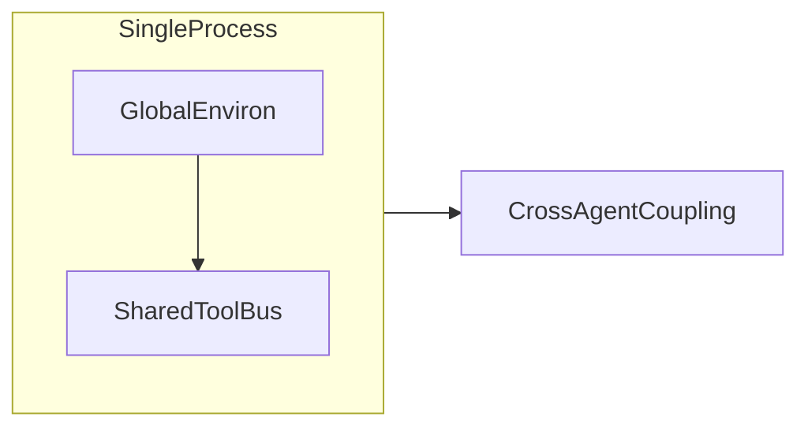
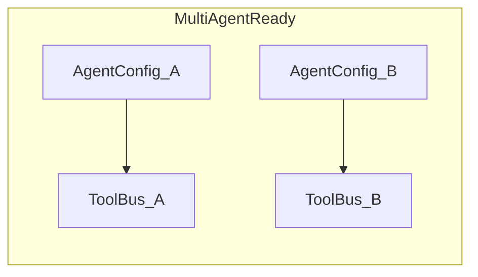

# 环境变量梳理：功能分类、作用域、竞态与 Phase 3 建议

**路径**：[`agent_framework/docs/guides/envs_status.md`](./envs_status.md)  
**版本**：1.0  
**日期**：2026-04-05  
**维护**：新增或变更任意 `AGENT_*` 行为时，须同步更新本文件与对应专题 guide。

---

## 1. 摘要

- **操作系统事实**：环境变量驻留在 **进程级单例** `environ` 中。同一进程内 **不存在**「每个 Agent 各有一份独立 environ」的 OS 级隔离。
- **并发事实**：在 POSIX 常见实现上，**并发 `setenv`/`unsetenv`/`putenv` 与 `getenv` 组合未定义安全**；业务代码应避免在工作线程仍可能读取配置时修改环境。
- **框架事实**：部分变量在实现中被 **首次读取后永久缓存**（例如 `AGENT_TOOL_ALLOWLIST` 经 `std::call_once`），后续改 env **不生效**；部分变量在 **每次工具调用或每次配置解析**时重新 `getenv`。**二者对多 Agent 语义完全不同**（见 §4、主表「读取时机」列）。
- **与 Phase 3 目标**：若要在 **同一进程** 内 **动态加载不同 MCP / Skills 且互不干扰**，不能依赖轮换全局 env；需要 **实例级配置**（每 Agent 独立 `ToolBus` / 注册表句柄 / 构图参数），env 仅作 **进程启动默认值**。

更细的客户端实例化说明见 [agent-client.md](./agent-client.md)；预算与 `extra_config` 见 [context-budget.md](./context-budget.md)。

---

## 2. 分类维度（定义）

### 2.1 功能类（`功能`）

| 类代码 | 含义 |
|--------|------|
| `A2A` | Agent 间 HTTP：JSON-RPC 路径、Legacy、SSE 负载形态、集成测试闸门 |
| `Server` | `AgentServer` 监听、队列、线程、任务超时钳制 |
| `Client` | `AgentClient` 侧线协议（与 A2A 重叠时两表互引） |
| `LLM` | 提供商、密钥、超时、重试、模型 |
| `ToolBus` | Allowlist、Hook 异常策略 |
| `Orch` | 只读并行 / 并发上限（WP2.1b） |
| `Budget` | 上下文预算帽、spill、strict（WP2.1c） |
| `FS` | 内建 `fs_*` 沙箱与配额 |
| `Web` | 内建 `web_*` 出站策略、DDG、归档 |
| `Expr` | 内建 `expr_*`（ExprTk） |
| `Draw` | 内建 `draw_*` |
| `MCP` | MCP 传输超时、配置文件路径、跳过开关 |
| `Skills` | 技能目录、路由、脚本白名单与超时 |
| `Loop` | Agent 循环守卫与诊断 |
| `Log` | 日志级别 |
| `Verifier` | **仅设计文档**（WP2.8），**当前库代码未实现** `getenv("AGENT_VERIFIER*")` |
| `Test` | 单测 / CI / 示例专用 |
| `Ext` | 非 `AGENT_` 前缀、但 guides 明确依赖的外部变量（API Key、代理） |

### 2.2 作用域标签（`作用域`）

| 标签 | 含义 |
|------|------|
| **GlobalProcess** | 全进程共享；影响所有读取方（除非实现已拷贝到实例且不再读 env）。 |
| **MCPClient** | MCP 客户端传输或 MCP 配置发现相关。 |
| **AgentLoad** | 构图 / `build_cli_agent_graph` / 工具 **注册** 阶段读取。 |
| **A2AWire** | A2A HTTP 客户端或服务端线协议。 |
| **RuntimePerCall** | 运行路径上可能 **每次调用** `getenv`（工具执行、编排解析、SSE 等）。 |

一条目可标 **1～2 个**主标签。

### 2.3 读取时机（`读取时机`）

| 代码 | 含义 |
|------|------|
| `construct_once` | 对象构造时读 env，之后仅用成员（如 `AgentClient` 的 wire 模式与 path）。 |
| `first_process_wide` | 进程内 **首次** 进入某路径时解析并 **缓存**，之后 env 变更无效（`AGENT_TOOL_ALLOWLIST`）。 |
| `each_resolve` | 每次调用解析函数时读取（如 `resolve_tool_orchestration_options`、`ContextBudgetLimits::load`）。 |
| `each_tool_invoke` | 工具函数体内每次调用读 env（如 `web_fetch_archive_invoke` 读归档上限）。 |
| `each_getenv` | 每次进入该代码路径即 `getenv`（如 `AGENT_TOOL_HOOK_THROW_ABORT`、`SSE` legacy 开关）。 |
| `server_init` | `AgentServer` 初始化或 `start`/监听路径读 env。 |
| `planned` | 仅文档或 CMake 约定，**无**对应 `std::getenv` 实现（或尚未落地）。 |

---

## 3. 主表：环境变量全量登记

**列说明**：`默认值` 取自文档或实现中的回退值；`主文档` 为 guides 中主要描述处；`实现` 为 `agent_framework` 内 C++ 路径（无则填「—」）。

### 3.1 A2A / Client / Server（线协议与运行时）

| 名称 | 功能 | 默认值（摘要） | 主文档 | 实现 | 作用域 | 读取时机 | 竞态与多 Agent 备注 | Phase 3 建议 |
|------|------|----------------|--------|------|--------|----------|---------------------|--------------|
| `AGENT_CLIENT_USE_LEGACY_REST` | 客户端 Legacy REST vs JSON-RPC | `0` | [agent-client.md](./agent-client.md) | `src/agent_client/agent_client.cpp` | A2AWire, Client | `construct_once`（`AgentClientOptions` 可覆盖） | 实例已固化则互不干扰；勿在异步未完成时 `setenv` | 已支持 Options；保持 |
| `AGENT_CLIENT_JSON_RPC_PATH` | 客户端 JSON-RPC POST 相对 path | 空→`/` | [agent-client.md](./agent-client.md) | `agent_client.cpp` | A2AWire, Client | `construct_once` | 同上 | 已支持 Options；保持 |
| `AGENT_CLIENT_SSE_LEGACY_PAYLOAD` | SSE `data` 是否解析旧形态 | `0` | [agent-client.md](./agent-client.md), [phase-2-wp4.md](./phase-2-wp4.md) | `src/agent_transport/sse_connection.cpp` | A2AWire, Client | `each_getenv`（订阅/消费 SSE 时） | **全局**；多 `AgentClient` 实例若并发 SSE，改 env 可能撕裂语义 | **P1**：迁入 `AgentClientOptions` 或连接级配置 |
| `AGENT_SERVER_BIND` | 服务监听地址 | `0.0.0.0` | [agent-server.md](./agent-server.md) | `src/agent_server/agent_server.cpp` | Server, GlobalProcess | `server_init` | 单 Server 进程级 | 每 Server 进程独立；多 Agent = 多进程或端口 |
| `AGENT_SERVER_PORT` | 覆盖监听端口 | 构造参数 | [agent-server.md](./agent-server.md) | `agent_server.cpp` | Server | `server_init` | 同上 | 同上 |
| `AGENT_SERVER_JSON_RPC_PATH` | 覆盖 JSON-RPC 路径 | 从 Card 推导 | [agent-server.md](./agent-server.md), [a2a-spec-tracker.md](./a2a-spec-tracker.md) | `agent_server.cpp` | A2AWire, Server | `server_init`（路由注册时） | 单 Server 实例 | 多 Server 进程各设各值 |
| `AGENT_A2A_STRICT` | 严格 A2A：与 Legacy 组合策略 | `1` | [agent-server.md](./agent-server.md), [phase-2-wp2.md](./phase-2-wp2.md) | `agent_server.cpp` | A2AWire, Server | `server_init` | 进程级 | 设计为进程策略 |
| `AGENT_SERVER_LEGACY_REST` | 是否注册 Legacy `/tasks/*` | `0` | [agent-server.md](./agent-server.md) | `agent_server.cpp` | A2AWire, Server | `server_init` | 同上 | 同上 |
| `AGENT_SERVER_MAX_QUEUED_TASKS` | 有界队列长度 | `64` | [agent-server.md](./agent-server.md) | `agent_server.cpp` | Server | `server_init` | 同上 | 同上 |
| `AGENT_SERVER_WORKER_THREADS` | Worker 线程数 | `max(2,hw/2)`（文档） | [agent-server.md](./agent-server.md) | `agent_server.cpp` | Server | `server_init` | 同上 | 同上 |
| `AGENT_SERVER_EXECUTOR_THREADS` | `tf::Executor` 线程 | `hardware_concurrency` | [agent-server.md](./agent-server.md) | `agent_server.cpp` | Server | `server_init` | 同上 | 同上 |
| `AGENT_SERVER_SSE_PING_SEC` | SSE 注释 ping 间隔；`0` 禁用 | `30` | [agent-server.md](./agent-server.md) | `agent_server.cpp` | Server | `server_init` | 同上 | 同上 |
| `AGENT_TASK_DEFAULT_TIMEOUT_SEC` | 默认任务 wall-clock 超时 | `0`（无） | [agent-server.md](./agent-server.md), [phase-2-wp3.md](./phase-2-wp3.md) | `agent_server.cpp` | Server | `each_resolve`（计算超时函数内） | 并发 `setenv` 与进行中的超时计算 **不安全** | **P2**：迁入 `AgentServer` 构造选项 |
| `AGENT_TASK_MAX_TIMEOUT_SEC` | 超时上限钳制 | `86400` | 同上 | `agent_server.cpp` | Server | 同上 | 同上 | 同上 |

### 3.2 LLM 与日志

| 名称 | 功能 | 默认值 | 主文档 | 实现 | 作用域 | 读取时机 | 竞态与多 Agent 备注 | Phase 3 建议 |
|------|------|--------|--------|------|--------|----------|---------------------|--------------|
| `AGENT_LLM_PROVIDER` | `openai` / `anthropic` 等 | — | [getting_started.md](./getting_started.md), [phase-1-plan.md](./phase-1-plan.md) | `src/llm_client/llm_client.cpp` | LLM, GlobalProcess | `from_env()` 调用时 | 共享 `LLMClient` 则共享配置 | **P0**：每 Agent 独立 `LLMClient` 或构造参数 |
| `AGENT_HTTP_TIMEOUT_SEC` | HTTP 超时秒 | 实现默认 | 同上 | `llm_client.cpp` | LLM | `from_env()` | 同上 | 同上 |
| `AGENT_LLM_MAX_RETRIES` | 重试次数 | 实现默认 | 同上 | `llm_client.cpp` | LLM | `from_env()` | 同上 | 同上 |
| `AGENT_LLM_MODEL` | 模型名 | — | 同上 | `llm_client.cpp`, 示例 | LLM | `from_env()` / 示例内 | 同上 | 同上 |
| `OPENAI_API_KEY` | OpenAI 密钥 | — | [getting_started.md](./getting_started.md) | `llm_client.cpp` | Ext | `from_env()` | 进程级秘密 | 秘密管理外置 |
| `AGENT_OPENAI_BASE_URL` | OpenAI 兼容 Base URL | 官方默认 | 同上 | `llm_client.cpp` | LLM | `from_env()` | 同上 | 同上 |
| `ANTHROPIC_API_KEY` | Anthropic 密钥 | — | 同上 | `llm_client.cpp` | Ext | `from_env()` | 同上 | 同上 |
| `AGENT_ANTHROPIC_BASE_URL` | Anthropic Base URL | 官方默认 | 同上 | `llm_client.cpp` | LLM | `from_env()` | 同上 | 同上 |
| `DEEPSEEK_API_KEY` | 示例/测试回退密钥 | — | [getting_started.md](./getting_started.md) | `examples/cli_agent_*.cpp`, tests | Ext, Test | 示例启动时 | 仅 demo/test | — |
| `AGENT_LOG_LEVEL` | `error|warn|info|debug` | `info` | [getting_started.md](./getting_started.md) | `agent_loop_node.cpp`, `web_tools.cpp`, `news_sources_tool.cpp`, `graph_executor.cpp` | Log, GlobalProcess | `each_getenv`（各模块路径） | 并发改 env 可能导致 **日志级别撕裂** | **P2**：统一 Logging 配置对象 |

### 3.3 ToolBus、Hook、编排

| 名称 | 功能 | 默认值 | 主文档 | 实现 | 作用域 | 读取时机 | 竞态与多 Agent 备注 | Phase 3 建议 |
|------|------|--------|--------|------|--------|----------|---------------------|--------------|
| `AGENT_TOOL_ALLOWLIST` | 逗号分隔工具白名单；空=不限制 | 空 | [phase-2-wp1b.md](./phase-2-wp1b.md), [tool-call-hooks.md](./tool-call-hooks.md), [cursor_mcp_json.md](./cursor_mcp_json.md) | `src/toolbus/toolbus.cpp`（`std::call_once`） | ToolBus, GlobalProcess | **`first_process_wide`** | **全进程共享快照**；**无法** per-agent 不同列表（除非多进程或多 `ToolBus` 且不共享静态） | **P0**：每 Agent `ToolBus` 实例 + 构造注入 allowlist；移除 call_once 或按实例缓存 |
| `AGENT_TOOL_HOOK_THROW_ABORT` | Hook 异常时 rethrow | 关闭 | [phase-2-wp1d.md](./phase-2-wp1d.md), [tool-call-hooks.md](./tool-call-hooks.md) | `toolbus.cpp` | ToolBus, RuntimePerCall | `each_getenv`（每次 hook 链） | 并发改 env 可能同一次调用链内 **前后行为不一致** | **P1**：`ToolBus` 成员或 `AgentConfig` |
| `AGENT_TOOL_HOOK_WARN_MS` | Hook 耗时告警阈值 | 未实现 | [phase-2-wp1d.md](./phase-2-wp1d.md) | — | — | `planned` | — | 实现时应用实例配置 |
| `AGENT_TOOL_PARALLEL_READS` | 强制开/关并行只读工具 | 未设不覆盖 | [tool-orchestration.md](./tool-orchestration.md), [phase-2-wp1b.md](./phase-2-wp1b.md) | `src/toolbus/tool_orchestration.cpp` | Orch, GlobalProcess | `each_resolve` | 与 `AgentConfig` 合并；并发改 env **竞态** | **P1**：仅 `AgentConfig` |
| `AGENT_TOOL_MAX_PARALLEL` | 并行度上限 | `AgentConfig` | 同上 | `tool_orchestration.cpp` | Orch | `each_resolve` | 同上 | **P1**：仅 `AgentConfig` |

### 3.4 上下文预算（WP2.1c）

| 名称 | 功能 | 默认值 | 主文档 | 实现 | 作用域 | 读取时机 | 竞态与多 Agent 备注 | Phase 3 建议 |
|------|------|--------|--------|------|--------|----------|---------------------|--------------|
| `AGENT_BUDGET_MAX_TOOL_RESULT_JSON_BYTES` | 单工具结果上限 | `1048576` | [context-budget.md](./context-budget.md) | `context_budget.cpp` `ContextBudgetLimits::load` | Budget | `each_resolve` | `AgentConfig.extra_config` **优先**于 env；多实例若共享 `AgentConfig` 则共享预算 | 已支持 extra_config |
| `AGENT_BUDGET_MAX_INJECTION_BYTES` | 注入物化上限 | `2097152` | 同上 | 同上 | Budget | `each_resolve` | 同上 | 同上 |
| `AGENT_BUDGET_MAX_COMBINED_PROMPT_ATTACH_BYTES` | 合计附件上限 | `8388608` | 同上 | 同上 | Budget | `each_resolve` | 同上 | 同上 |
| `AGENT_BUDGET_MAX_RENDERED_MESSAGES_BYTES` | `rendered.messages` 总上限 | `0`（关闭） | [context-budget.md](./context-budget.md) | `context_budget.cpp` | Budget | `each_resolve` | 同上 | 同上 |
| `AGENT_BUDGET_MAX_WIRE_MESSAGE_BYTES` | A2A 单消息帽（可选） | `4194304` | [context-budget.md](./context-budget.md) | `context_budget.cpp` | Budget, A2AWire | `each_resolve` | 同上 | 同上 |
| `AGENT_CONTEXT_BUDGET_SPILL_DIR` | Spill 目录 | 空 | 同上 | `context_budget.cpp` | Budget | `each_resolve` | 同上 | 同上 |
| `AGENT_CONTEXT_BUDGET_STRICT` | 超限拒绝 LLM | `0` | 同上 | `context_budget.cpp` | Budget | `each_resolve` | 同上 | `extra_config` 键 `CONTEXT_BUDGET_STRICT` |

### 3.5 内建 `fs_*`

| 名称 | 功能 | 默认值 | 主文档 | 实现 | 作用域 | 读取时机 | 竞态与多 Agent 备注 | Phase 3 建议 |
|------|------|--------|--------|------|--------|----------|---------------------|--------------|
| `AGENT_FS_ROOT` | 沙箱根；未设不注册 `fs_*` | — | [builtin-fs-tools.md](./builtin-fs-tools.md) | `src/toolbus/fs_sandbox.cpp` | FS, AgentLoad | `load_fs_sandbox_config_from_env()` **每次调用** | 注册阶段若多线程并行构图且 env 抖动，可能 **不一致** | **P0**：`FsSandboxConfig` 注入构图 |
| `AGENT_FS_MAX_READ_BYTES` | 单次读上限 | `1048576` | 同上 | `fs_sandbox.cpp` | FS | 同上 | 同上 | 同上 |
| `AGENT_FS_MAX_WRITE_BYTES` | 写上限 | 与读相同 | 同上 | 同上 | FS | 同上 | 同上 | 同上 |
| `AGENT_FS_MAX_LIST_DEPTH` | 列目录深度 | `8` | 同上 | 同上 | FS | 同上 | 同上 | 同上 |
| `AGENT_FS_MAX_LIST_ENTRIES` | 列目录条数 | `5000` | 同上 | 同上 | FS | 同上 | 同上 | 同上 |
| `AGENT_FS_MAX_GREP_FILES` | grep 打开文件数 | `200` | 同上 | 同上 | FS | 同上 | 同上 | 同上 |
| `AGENT_FS_MAX_GREP_MATCHES` | grep 匹配条数 | `500` | 同上 | 同上 | FS | 同上 | 同上 | 同上 |
| `AGENT_FS_MAX_LINE_LENGTH` | grep 单行上限 | `8192` | 同上 | 同上 | FS | 同上 | 同上 | 同上 |
| `AGENT_FS_SEARCH_MAX_RESULTS` | search 结果上限 | `500` | 同上 | 同上 | FS | 同上 | 同上 | 同上 |

### 3.6 内建 `web_*`

| 名称 | 功能 | 默认值 | 主文档 | 实现 | 作用域 | 读取时机 | 竞态与多 Agent 备注 | Phase 3 建议 |
|------|------|--------|--------|------|--------|----------|---------------------|--------------|
| `AGENT_WEB_ENABLE` | 是否注册 `web_*` | 未设→不注册 | [builtin-web-tools.md](./builtin-web-tools.md) | `web_tools.cpp` | Web, AgentLoad | 注册时 | 进程级工具表 | 多 `ToolBus` 可分别注册 |
| `AGENT_WEB_TIMEOUT_MS` | 连接+读超时 | `30000` | 同上 | `web_http.cpp` `load_web_http_config_from_env` | Web | `each_tool_invoke`（经 `web_http_get`） | 并发改 env → 行为撕裂 | **P1**：`WebHttpConfig` 注入 |
| `AGENT_WEB_MAX_REDIRECTS` | 重定向上限 | `10` | 同上 | `web_http.cpp` | Web | 同上 | 同上 | 同上 |
| `AGENT_WEB_MAX_RESPONSE_BYTES` | 响应体上限 | `2097152` | 同上 | `web_http.cpp` | Web | 同上 | 同上 | 同上 |
| `AGENT_WEB_USER_AGENT` | UA 字符串 | 内置默认串 | 同上 | `web_http.cpp` | Web | 同上 | 同上 | 同上 |
| `AGENT_WEB_ALLOW_HTTP` | 允许 `http://` | 关闭 | 同上 | `web_http.cpp` | Web | 同上 | 同上 | 同上 |
| `AGENT_WEB_HTTP_COOKIE` | 默认 Cookie 头 | 空 | 同上 | `web_http.cpp` | Web | 同上 | 同上 | 同上 |
| `AGENT_WEB_ALLOW_HOSTS` | 主机白名单 | 空 | 同上 | `web_http.cpp` | Web | 同上 | 同上 | 同上 |
| `AGENT_WEB_TEST_ALLOW_LOOPBACK` | 测试允许环回 | 关闭 | — | `web_http.cpp` | Test | `each_tool_invoke` | 仅测试 | — |
| `AGENT_WEB_SEARCH_MIN_INTERVAL_MS` | DDG 请求间隔 | `1000` | [builtin-web-tools.md](./builtin-web-tools.md) | `web_search_ddg.cpp` | Web, GlobalProcess | `each_tool_invoke` | **全局互斥间隔**（静态时间戳）；多 Agent 共享进程则 **共享限流** | **P1**：限流状态迁入 `ToolBus` 或按实例 |
| `AGENT_WEB_SEARCH_TIMEOUT_MS` | 搜索阶段超时 | 继承 `AGENT_WEB_TIMEOUT_MS` | 同上 | `web_search_ddg.cpp` | Web | `each_tool_invoke` | 同上 | 同上 |
| `AGENT_WEB_DDG_MAX_BODY_BYTES` | DDG 体上限 | `1048576` | 同上 | `web_search_ddg.cpp` | Web | `each_tool_invoke` | 同上 | 同上 |
| `AGENT_WEB_DDG_COOKIE` | 仅 DDG 的 Cookie | 空 | 同上 | `web_search_ddg.cpp` | Web | `each_tool_invoke` | 同上 | 同上 |
| `AGENT_WEB_DDG_PAUSE_ON_CHALLENGE` | 人机验证暂停 | 关闭 | 同上 | `web_search_ddg.cpp` | Web | `each_tool_invoke` | 同上 | 同上 |
| `AGENT_NEWS_SOURCES_JSON` | 信源目录 JSON | — | [builtin-web-tools.md](./builtin-web-tools.md) | `news_sources_tool.cpp` | Web, AgentLoad | 注册时读路径 | 进程级 | 多实例需多配置路径 |
| `AGENT_WEB_EXTRACT_SUBDIR` | 归档解压子目录默认 | 工具内默认 | [builtin-web-tools.md](./builtin-web-tools.md) | `web_archive.cpp` | Web | `each_tool_invoke` | 同上 | 同上 |
| `AGENT_WEB_MAX_ARCHIVE_FILES` | 归档内文件数 | `1000` | 同上 | `web_archive.cpp` | Web | `each_tool_invoke` | 同上 | 同上 |
| `AGENT_WEB_MAX_ARCHIVE_UNCOMPRESSED_BYTES` | 解压总字节 | `52428800` | 同上 | `web_archive.cpp` | Web | `each_tool_invoke` | 同上 | 同上 |
| `AGENT_WEB_MAX_ARCHIVE_SINGLE_FILE_BYTES` | 单成员上限 | `10485760` | 同上 | `web_archive.cpp` | Web | `each_tool_invoke` | 同上 | 同上 |
| `AGENT_WEB_MAX_ARCHIVE_DOWNLOAD_BYTES` | 归档下载体上限 | 继承 web_http | 同上 | `web_archive.cpp` | Web | `each_tool_invoke` | 同上 | 同上 |
| `AGENT_WEB_DENY_NETWORKS` | CIDR 黑名单 | 文档建议 | [builtin-web-tools.md](./builtin-web-tools.md) | — | — | **仅文档** | — | 若实现勿仅用全局 env |
| `HTTPS_PROXY` / `HTTP_PROXY` | 出站代理 | — | [builtin-web-tools.md](./builtin-web-tools.md) | httplib 使用（`web_http.cpp`） | Ext | 请求时 | 进程级 | 通常可接受全局 |

### 3.7 内建 `expr_*` / `draw_*`

| 名称 | 功能 | 默认值 | 主文档 | 实现 | 作用域 | 读取时机 | Phase 3 建议 |
|------|------|--------|--------|------|--------|----------|--------------|
| `AGENT_EXPR_ENABLE` | 关闭则注册 expr 工具 | 默认开 | [builtin-exprtk-tools.md](./builtin-exprtk-tools.md) | `expr_tools.cpp` | Expr, AgentLoad | 注册时 | 构造参数注入 |
| `AGENT_EXPR_MAX_EXPR_BYTES` 等 | ExprTk 门闩 | 见 builtin 文档 | 同上 | `expr_tools.cpp` | Expr | 注册/调用路径读 | 配置对象 |
| `AGENT_EXPR_DISABLE_CONTROL_FLOW` | 禁用控制流 | `0` | 同上 | `expr_tools.cpp` | Expr | 注册时 | 同上 |
| `AGENT_DRAW_ENABLE` | 关闭则不注册 draw | 默认开 | [builtin-draw-tools.md](./builtin-draw-tools.md) | `draw_tools.cpp` | Draw, AgentLoad | 注册时 | 同上 |
| `AGENT_DRAW_MAX_WIDTH` 等 | 画布/输出上限 | 见 builtin 文档 | 同上 | `draw_tools.cpp` | Draw | `load_draw_config_from_env` | 同上 |

### 3.8 MCP

| 名称 | 功能 | 默认值 | 主文档 | 实现 | 作用域 | 读取时机 | 竞态与多 Agent 备注 | Phase 3 建议 |
|------|------|--------|--------|------|--------|----------|---------------------|--------------|
| `AGENT_MCP_REQUEST_TIMEOUT_MS` | stdio/HTTP 读超时 | `60000`（文档）；实现见代码 | [mcp-spec-tracker.md](./mcp-spec-tracker.md) | `stdio_transport.cpp`, `http_transport.cpp` | MCPClient, GlobalProcess | 传输层每次构造/请求 | **全进程同一超时** | **P0**：`McpClient` 构造选项 |
| `AGENT_MCP_CONFIG_PATH` | Cursor 式 `mcp.json` 路径 | `~/.cursor/mcp.json` | [cursor_mcp_json.md](./cursor_mcp_json.md) | `toolbus.cpp` `default_cursor_mcp_path` | MCP, AgentLoad | 调用 `register_mcp_from_cursor_config` 时 | 多 Agent **不能**靠 env 指不同文件除非 **顺序化** | **P0**：API 显式传 `path`；env 仅默认 |
| `AGENT_TEST_CURSOR_MCP_JSON` | 测试覆盖 MCP 路径 | — | [cursor_mcp_json.md](./cursor_mcp_json.md), [getting_started.md](./getting_started.md) | `examples/cli_agent_*.cpp` | Test | 示例启动 | — | — |
| `AGENT_TEST_SKIP_CURSOR_MCP` | 跳过 MCP 加载 | — | [getting_started.md](./getting_started.md) | 示例/测试逻辑 | Test | 启动 | — | — |
| `AGENT_CLI_SKIP_CURSOR_MCP` | CLI 跳过 MCP | — | [getting_started.md](./getting_started.md) | 示例 | Test | 启动 | — | — |
| `AGENT_MCP_SERVER_CMD` 等 | 旧版 MCP 启动示例 | — | [phase-1-wp3.md](./phase-1-wp3.md) | — | — | **文档示例** | 当前主路径为 **Cursor JSON** | 归档或标明 legacy |

### 3.9 Skills

| 名称 | 功能 | 默认值 | 主文档 | 实现 | 作用域 | 读取时机 | Phase 3 建议 |
|------|------|--------|--------|------|--------|----------|--------------|
| `AGENT_SKILLS_DIR` | 单根技能目录 | — | [getting_started.md](./getting_started.md) | `skill_services.cpp` | Skills, AgentLoad | 扫描/加载时 | **P0**：`SkillRegistry` 构造参数 |
| `AGENT_SKILL_CONTEXT_MAX_CHARS` | L2 注入上限 | `8000` | 同上 | `skill_services.cpp` | Skills | 服务构建时 | 实例配置 |
| `AGENT_SKILL_ROUTER` | 关闭路由 | 开 | 同上 | `skill_registry.cpp` | Skills | 注册表逻辑 | 实例配置 |
| `AGENT_SKILL_SCRIPT_ALLOWLIST` | 解释器白名单 | 空→拒绝执行 | 同上 | `skill_script_tool.cpp` | Skills, RuntimePerCall | 每次脚本工具调用 | **P0**：每 Agent 策略 |
| `AGENT_SKILL_SCRIPT_TIMEOUT_SEC` | 脚本超时 | `30` | 同上 | `skill_script_tool.cpp` | Skills | 每次调用 | 实例配置 |
| `AGENT_SKILL_INJECT_CATALOG` | 注入技能短表 | 关 | 同上 | 示例/服务（见 `cli_agent`） | Skills | 构图/运行 | 实例配置 |
| `AGENT_SKILL_CATALOG_MAX_CHARS` | 目录摘要上限 | `2048` | 同上 | `cli_agent_*.cpp` | Skills | 示例 | 实例配置 |
| `HOME` / `USERPROFILE` | 默认技能搜索根（Windows） | — | [skill_services.cpp](../../src/skills/skill_services.cpp) | `skill_services.cpp` | Ext | 扫描时 | 进程用户态 |

### 3.10 Agent 循环守卫与调试

| 名称 | 功能 | 默认值 | 主文档 | 实现 | 作用域 | 读取时机 |
|------|------|--------|--------|------|--------|----------|
| `AGENT_LOOP_GUARD_REPEAT_TOOL_IN_ITERATION` | 迭代内重复工具守卫 | 默认开（`nullptr`→开） | [phase-1-wp6.md](./phase-1-wp6.md) | `agent_loop_node.cpp` | Loop | `each_getenv` |
| `AGENT_LOOP_GUARD_NO_PROGRESS` | 无进展守卫 | 默认关 | 同上 | 同上 | Loop | `each_getenv` |
| `AGENT_LOOP_GUARD_NO_PROGRESS_K` | 无进展阈值 | `3` | 同上 | 同上 | Loop | `each_getenv` |
| `AGENT_LOOP_GUARD_TEXT_TRUNC` | 诊断截断长度 | `200` | 同上 | 同上 | Loop | `each_getenv` |
| `AGENT_TEST_AGENT_LOOP_DEBUG` | 循环调试日志 | 关 | [getting_started.md](./getting_started.md) | `agent_loop_node.cpp`, `openai_adapter.cpp` | Test | `each_getenv` |

### 3.11 Verifier（WP2.8，规划）

以下变量在 **[phase-2-wp8.md](./phase-2-wp8.md)** 中定义；**截至本文撰写时，`agent_framework` 生产源码中无对应 `std::getenv`。** 列入本表便于与实现落地后 diff。

`AGENT_VERIFIER`, `AGENT_VERIFIER_SAMPLE_RATE`, `AGENT_VERIFIER_TIMEOUT_MS`, `AGENT_VERIFIER_MODEL`, `AGENT_VERIFIER_TEMPERATURE`, `AGENT_VERIFIER_PROMPT_MAX_BYTES`, `AGENT_VERIFIER_HISTORY_TURNS`, `AGENT_VERIFIER_REDACT_IDS`, `AGENT_VERIFIER_INCLUDE_TOOL_TRACE`, `AGENT_VERIFIER_MAX_RETRIES`。

**Phase 3 建议**：Verifier 启用策略应挂在 **图模板 / `AgentConfig`**，而非全局 env。

### 3.12 A2A 集成测试闸门（规划 / CI）

| 名称 | 功能 | 主文档 |
|------|------|--------|
| `AGENT_A2A_INTEGRATION_LOOPBACK` | Tier B 启用 | [a2a-integration-tests.md](./a2a-integration-tests.md) |
| `AGENT_A2A_LIVE_TEST`, `AGENT_A2A_LIVE_BASE_URL` | Tier C live | 同上 |
| `AGENT_A2A_LIVE_TOKEN` | Live 鉴权 | 同上 |
| `AGENT_A2A_MULTI_LIVE`, `AGENT_A2A_LIVE_AGENT_A_URL`, `AGENT_A2A_LIVE_AGENT_B_URL` | Tier D 多 Agent | 同上 |
| `AGENT_A2A_UPDATE_GOLDENS` | 重写黄金 fixture | [phase-2-wp6.md](./phase-2-wp6.md) |

**实现说明**：上述变量由 **测试驱动或未来可执行文件** 读取；未在核心库统一封装时，表中不强制 `src/` 路径（以实际测试代码为准）。

### 3.13 测试 / 示例专用（CMake 或二进制）

| 名称 | 用途 | 典型设置处 |
|------|------|------------|
| `AGENT_TEST_FIXTURES` | LLM 夹具目录 | `CMakeLists.txt` → `test_llm_client_wp1` |
| `AGENT_TEST_A2A_FIXTURE_DIR`, `AGENT_TEST_A2A_TRACKER_PATH` | A2A 契约测 | `CMakeLists.txt` |
| `AGENT_TEST_SKILLS_CURSOR_ROOT` | Skills bundle 测 | `CMakeLists.txt` |
| `AGENT_TEST_WEB_DATA_DIR`, `AGENT_TEST_WEB_QUIET`, `AGENT_TEST_WEB_LIVE`, `AGENT_TEST_WEB_LIVE_STRICT` | Web 工具测 | `test_web_tools.cpp` / CMake |
| `AGENT_TEST_NEWS_JSON` | 新闻源测 | CMake |
| `AGENT_TEST_CANVAS_OUT` | 绘图冒烟输出路径 | `test_canvas_ity_smoke.cpp` |
| `AGENT_TEST_PROMPT_RENDERER_DEBUG` | 模板调试 | `test_prompt_renderer_wp4.cpp` |

---

## 4. 竞态、互影响与 Phase 3（动态 MCP / Skills）

### 4.1 三类风险（可操作判断）

1. **POSIX/C++ 环境竞争**：线程 A `setenv`，线程 B `getenv` → **勿在生产依赖「运行时切换」**。  
2. **快照型变量**：`AGENT_TOOL_ALLOWLIST` 在 [`toolbus.cpp`](../../src/toolbus/toolbus.cpp) 中通过 `std::call_once` 解析一次后缓存；后续修改 env **不会**改变已缓存集合 → 多 Agent **无法**仅靠「先后 set 不同值」实现隔离。  
3. **每调用读取型变量**：如 `AGENT_TOOL_HOOK_THROW_ABORT`、`AGENT_WEB_*`（经 `load_web_http_config_from_env`）、`AGENT_CLIENT_SSE_LEGACY_PAYLOAD` → 并发改 env 会导致 **同一任务内前后行为不一致**。

### 4.2 与「多任务多 Agent」的映射

| 场景 | 仅靠 env 是否足够 | 推荐架构 |
|------|-------------------|----------|
| 同进程多 Agent，不同 allowlist | **否** | 每 Agent 独立 `ToolBus` + 构造注入 allowlist；或单 Bus 但 allowlist 改为 **按调用上下文**（需改代码） |
| 同进程多 Agent，不同 MCP 集合 | **否** | 每 Agent 独立注册路径；`register_mcp_from_cursor_config(bus, path)` 显式 `path`；避免轮换 `AGENT_MCP_CONFIG_PATH` |
| 同进程多 Agent，不同 Skills 根 | **否** | `SkillRegistry` / 扫描 API 接收 **vector 根目录**；env 仅 CLI 默认 |
| 同进程多 Agent，不同 A2A 线模式 | **部分可** | `AgentClient` 已支持 `AgentClientOptions`；**勿**依赖 `AGENT_CLIENT_*` 动态切换 |
| 多进程（每进程一 Agent） | **通常可** | 每进程独立 environ；仍注意 **测试** 不要并行污染父 shell env |

### 4.3 架构对照（mermaid）





---

## 5. 与 `AgentClientOptions`、`AgentConfig.extra_config` 的关系

| 机制 | 覆盖范围 | 权威文档 |
|------|----------|----------|
| `AgentClientOptions` | `use_legacy_rest`、`json_rpc_path`；构造时固化 | [agent-client.md](./agent-client.md) |
| `AgentConfig.extra_config` | 预算键：去掉前缀 `AGENT_` 后与 env **同名键**；**extra 优先** | [context-budget.md](./context-budget.md) |
| `AgentConfig`（编排字段） | `enable_parallel_read_tools`、`max_parallel_read_tools`；可被 `AGENT_TOOL_PARALLEL_READS` / `AGENT_TOOL_MAX_PARALLEL` **覆盖** | [tool-orchestration.md](./tool-orchestration.md) |

**仍主要依赖 env、尚无实例覆盖的生产变量（节选）**：`AGENT_TOOL_ALLOWLIST`（进程快照）、`AGENT_MCP_REQUEST_TIMEOUT_MS`、`AGENT_FS_ROOT` 系、`AGENT_WEB_*` 系（除未来重构）、`AGENT_SKILLS_DIR` 系、`AGENT_LOG_LEVEL`（分散读取）、`AGENT_SERVER_*`（Server 进程级）。

---

## 6. 文档—实现差异表（审计结论）

| 类型 | 条目 | 说明 |
|------|------|------|
| 仅文档 / 未实现 | `AGENT_TOOL_HOOK_WARN_MS` | [phase-2-wp1d.md](./phase-2-wp1d.md) 规划，无 `getenv` |
| 仅文档 / 未实现 | `AGENT_WEB_DENY_NETWORKS` | [builtin-web-tools.md](./builtin-web-tools.md) 描述，源码无对应键 |
| 仅文档（规划） | `AGENT_VERIFIER*` 全家 | 见 [phase-2-wp8.md](./phase-2-wp8.md)，库内无读取 |
| 仅文档（规划） | `AGENT_A2A_*` 集成测试闸门部分 | 以未来/现有测试二进制为准；核心库不统一导出 |
| 仅文档（规划） | `AGENT_A2A_UPDATE_GOLDENS` | WP2.6 流程；依赖专用 regen 可执行文件，非运行时库 |
| 文档计划 vs 当前 CMake | `AGENT_TEST_DATA_DIR` | [phase-1-wp7.md](./phase-1-wp7.md) 提及；当前 [CMakeLists.txt](../../CMakeLists.txt) 未检索到同名定义（可能已改用 `AGENT_TEST_FIXTURES` 等） |
| 文档示例 / 非主路径 | `AGENT_MCP_SERVER_CMD`, `AGENT_MCP_SERVER_ARGS`, `AGENT_MCP_HTTP_URL`, `AGENT_MCP_AUTH_HEADER` | [phase-1-wp3.md](./phase-1-wp3.md)；当前主路径为 Cursor `mcp.json` + `AGENT_MCP_CONFIG_PATH` |
| 实现存在 / guides 分散 | `AGENT_WEB_MAX_ARCHIVE_DOWNLOAD_BYTES` | 在 `web_archive.cpp`；主表已列；builtin-web 可补充一行防遗漏 |

**校验命令**（仓库根或 `agent_framework` 下执行，用于复现审计）：

```bash
rg -o 'AGENT_[A-Z0-9_]+' docs/guides --glob '*.md' | sort -u
rg 'std::getenv\(|getenv\(' src examples tests --glob '*.cpp'
```

---

## 7. 维护约定

1. 新增 `AGENT_*`：**同时**更新专题 guide、**本文件**、以及（若适用）`AgentConfig` / Options。  
2. **禁止**在业务线程执行路径上通过 `setenv` 切换 **协议 / allowlist / MCP 路径** 等；单测若需多模式，优先 **进程拆分** 或 **API 显式参数**。  
3. Phase 3 动态 MCP/Skills 落地时：优先新增 **C++ 配置结构体**，env 只填充 **默认值一次**（`main` 或工厂函数）。

---

## 8. 相关链接

- [getting_started.md](./getting_started.md)（CLI 与 env 速览）  
- [agent-client.md](./agent-client.md)  
- [agent-server.md](./agent-server.md)  
- [context-budget.md](./context-budget.md)  
- [cursor_mcp_json.md](./cursor_mcp_json.md)  
- [a2a-integration-tests.md](./a2a-integration-tests.md)  
- [phase-2-wp8.md](./phase-2-wp8.md)（Verifier 规划）
