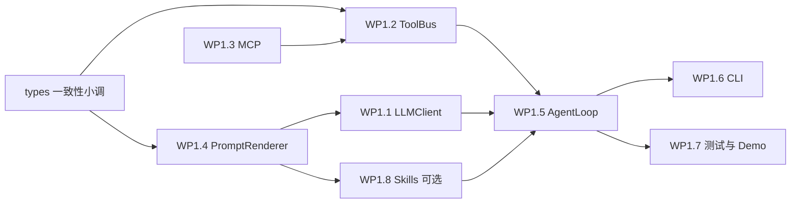

# 阶段 1：可演示 CLI Agent — 详细实现规划

本文档在 [plan-detailed.md](./plan-detailed.md) **§4** 的工作包与交付定义之上，给出**可排期、可验收**的实现拆解、依赖顺序、配置与测试矩阵。阶段 2（A2A）与阶段 3（RAG）仅在与阶段 1 的衔接处被引用，不纳入本文件范围。

**文档版本**：0.1  
**日期**：2026-03-31  
**上游依据**：`plan-detailed.md` v0.2（含 WP1.1–WP1.8）

---

## 1. 目标与交付边界

### 1.1 阶段 1 必须达成（与 plan-detailed 一致）

| 编号 | 交付项 | 验收要点 |
|------|--------|----------|
| D1 | **可执行 Demo** | 构建目标 `cli_agent_demo`（或等价名称），单命令启动；从 **stdin 或命令行参数**读取用户输入 |
| D2 | **流式输出** | LLM 首 token 起向 **stdout** 增量输出（或明确约定为行缓冲打印）；与供应商流式协议对齐 |
| D3 | **工具闭环** | 模型返回 **tool_calls** 时，经 **ToolBus** 执行，结果以 **tool 角色消息**回注，直至模型给出最终答复或达到 **max_turns** |
| D4 | **双供应商** | 同一套 `LLMInput` / `LLMOutput` 路径下，可通过配置切换 **OpenAI 兼容** 与 **Anthropic Messages**（适配器内消化格式差异） |
| D5 | **Prompt 最小子集** | `PromptRenderer`：系统提示、用户消息、工具列表 JSON、**固定窗口**历史截断；无需向量检索 |
| D6 | **可测** | 单测覆盖适配器构造/解析、ToolBus、（可选）MCP mock；集成测试可用 **mock HTTP LLM** 跑通图 |
| D7 | **无阶段 3 依赖** | 不依赖 Faiss / 自定义向量服务即可通过 DoD |

### 1.2 明确不包含（阶段 1 不做）

- Google A2A JSON-RPC 对外门面、Agent Card Well-Known 生产级路由（属阶段 2）。
- 向量索引、KnowledgeBase 生产路径（属阶段 3；图中可有占位节点但 Demo 可不接）。
- ImGui / Web 正式 UI（CLI-only；`ui_manager` 仅薄封装允许）。
- Skills **完整** Harness：WP1.8 为 **可选**；未做 WP1.8 不影响 D1–D7。

### 1.3 当前代码基线（Gap 简表）

以下路径已存在且与规划对齐；多数 `.cpp` 仍为 **TODO/占位**，本阶段以「填满实现 + 打通图」为主。

| 区域 | 主要路径 | 说明 |
|------|----------|------|
| 类型与协议 | `include/agent/types.hpp` | `LLMInput` / `LLMOutput` / `ToolMeta` / `Message` 等已定义，需与适配器一致 |
| LLM | `src/llm_client/*.cpp` | `llm_client.cpp`、各 OpenAI/Anthropic/vLLM 适配器需实现 `invoke` / 流式 / tool 解析 |
| 提示词 | `src/prompt_renderer/*.cpp` | 与 `RenderedPrompt`、各供应商消息格式对齐 |
| 工具 | `src/toolbus/*.cpp`、`include/agent/toolbus.hpp` | 注册、校验、`call_tool`、`export_as_llm_tools` |
| MCP | `src/toolbus/mcp_client.cpp`、`src/mcp_client/mcp_client.cpp` | 需统一入口与 ToolBus 注册；**建议先 stdio 后 HTTP**（与 plan-detailed §4.4 一致） |
| 节点与模板 | `src/node/llm_node.cpp`、agent_loop、tool_call | 将真实 client 接入 `workflow`，避免长期占位 lambda |
| CLI | `src/ui/cli_handler.cpp`、`ui_manager.cpp` | REPL、信号、日志级别 |
| 示例 | `examples/simple_agent.cpp` | 演进为真实 LLM 或拆分 `cli_agent_demo` |

---

## 2. 工作包依赖顺序（建议）

**实施建议**：并行度上，`ToolBus（本地）` 与 `PromptRenderer` 可并行起步；**LLMClient 依赖 RenderedPrompt 的稳定契约**；**MCP 在本地 ToolBus 可测后再接**；Agent 循环最后把三者收口。

---

## 3. 工作包详细说明

### WP1.1 LLMClient 核心

**目标**：实现异步 `invoke` / `invoke_with_rendered`，支持 **流式回调**、**超时**、**可配置重试**、**取消（尽可能合作式）**，并在适配器内解析 **流式与非流式**下的 `tool_calls` 与最终文本。

**建议任务拆分**

| ID | 任务 | 说明 |
|----|------|------|
| 1.1.1 | **HTTP 传输** | 复用 `HttplibClient`（或模块内薄封装）：POST、读 SSE/body、错误映射 |
| 1.1.2 | **OpenAI 兼容** | Chat Completions 或 Responses API 选型**择一写死**首版并文档化；流式增量 delta、`finish_reason`、tool_calls 累积 |
| 1.1.3 | **Anthropic Messages** | `messages` 构建、流式事件类型解析、tool_use / tool_result 映射到统一 `LLMOutput` |
| 1.1.4 | **LLMOutput 统一** | `assistant` 文本、`std::vector<ToolCallRequest>`（名称沿用 `types.hpp` 已有设计）、`is_final` 或等价字段；节点层零供应商分支 |
| 1.1.5 | **重试与超时** | 网络错误、429、5xx：指数退避 + jitter；超时_kill_连接 |
| 1.1.6 | **配置** | `ModelConfig`：`base_url`、`api_key`（来自 env）、`model`、`max_tokens`、`temperature`、超时秒数 |

**环境变量（建议命名，可在 `getting_started.md` 同步）**

| 变量 | 用途 |
|------|------|
| `AGENT_LLM_PROVIDER` | `openai` \| `anthropic`（或基于 URL 推断） |
| `OPENAI_API_KEY` / `ANTHROPIC_API_KEY` | 密钥 |
| `AGENT_OPENAI_BASE_URL` | 默认 `https://api.openai.com/v1`；Azure/代理时覆盖 |
| `AGENT_ANTHROPIC_BASE_URL` | 默认官方 Messages 端点前缀 |
| `AGENT_HTTP_TIMEOUT_SEC` | 全局 HTTP 超时 |

**验收**

- 单测：对 **录制的 JSON fixture**（脱敏）测 `build_request` / `parse_response` / 流式片段合并。
- 手测：CLI 打印流式 token；一轮 tool call 后第二轮请求含 tool 结果。

**产出文件（与仓库现状对齐）**

- `src/llm_client/llm_client.cpp`、`openai_adapter.cpp`、`anthropic_adapter.cpp`、`model_adapter.cpp`

---

### WP1.2 ToolBus

**目标**：本地工具注册、**JSON Schema 子集校验**（类型、required、附加属性策略写明）、统一 `call_tool(name, args)` → `json`，错误信息适合回灌模型。

**建议任务拆分**

| ID | 任务 | 说明 |
|----|------|------|
| 1.2.1 | **注册 API** | `register_local(name, schema, handler)`；线程安全（`std::mutex`） |
| 1.2.2 | **校验** | nlohmann + 手写 visitor 或轻量 schema 检查；失败返回 `{"error": "...", "code": "..."}` |
| 1.2.3 | **导出工具列表** | `export_as_llm_tools()` → `std::vector<ToolMeta>`，与 OpenAI tools / Anthropic tools 映射在适配器 |
| 1.2.4 | **Allowlist** | 可选 env `AGENT_TOOL_ALLOWLIST`；未登记工具名拒绝并记录 |

**验收**

- 单测：注册 demo 工具 `add`（两数相加）、非法参数、未知工具名。
- 集成：LLM mock 返回对该工具的 call，Bus 执行后结果出现在下一轮 `LLMInput.history`。

**产出**：`src/toolbus/toolbus.cpp`、`local_tool.cpp`

---

### WP1.3 MCP

**目标**：将 MCP 工具并入 **同一 ToolBus**；首版 **stdio 传输优先**，HTTP 复用 `httplib` 客户端；超时、进程生命周期、连接失败可观测。

**建议任务拆分**

| ID | 任务 | 说明 |
|----|------|------|
| 1.3.1 | **规范锁定** | 在仓库新增或引用 `docs/guides/mcp-spec-tracker.md`（或 README 片段）记录 **MCP 修订号**与握手示例 |
| 1.3.2 | **stdio** | 子进程 + stdin/stdout JSONL（或规范帧）；`list_tools` 缓存；`call_tool` 透传 |
| 1.3.3 | **HTTP** | Base URL、鉴权头、与 ToolBus 注册名称前缀策略（如 `mcp_`） |
| 1.3.4 | **与 WP1.2 合并** | `register_mcp_transport(...)` 单一工厂；析构时断开 |

**验收**

- 单测：mock 子进程或录制会话；失败重试策略可简化为一试失败即报工具错误。
- 手测（可选）：对接官方 MCP demo server 列表 ×1。

**产出**：`src/toolbus/mcp_client.cpp`；必要时整理 `src/mcp_client/mcp_client.cpp` 避免重复实现。

---

### WP1.4 PromptRenderer

**目标**：`LLMInput` → `RenderedPrompt`：系统/用户/历史/工具描述格式稳定；**历史截断**：按条数或按字符预算（首版推荐 **最大消息条数 + 保留 system**）。

**建议任务拆分**

| ID | 任务 | 说明 |
|----|------|------|
| 1.4.1 | **History 策略** | `max_history_turns` 配置；tool 消息与 assistant tool_calls 成对裁剪规则文档化 |
| 1.4.2 | **工具块** | `tools_json` 与 `rendered_text` 分工：OpenAI 用 `messages`+`tools`，Anthropic 用适配字段 |
| 1.4.3 | **单元测试** | 给定 `LLMInput` 快照，比较序列化 JSON（不含时间随机性） |

**产出**：`src/prompt_renderer/prompt_renderer.cpp`、`history_formatter.cpp`、`tool_formatter.cpp`、`prompt_template.cpp`

---

### WP1.5 Agent 循环（workflow）

**目标**：用 `create_loop_decl`（或项目已定等价方式）实现：**LLM → 是否 tool → 执行 tool(s) → 聚合 → 再 LLM**，直到无 tool 或达 `max_turns`。

**建议任务拆分**

| ID | 任务 | 说明 |
|----|------|------|
| 1.5.1 | **循环条件** | 基于 `LLMOutput`：存在 `tool_calls` 且未超轮次 → 继续 |
| 1.5.2 | **工具执行策略** | **首版选一种并写死**：建议 **顺序执行**（便于日志与调试）；并行留接口 |
| 1.5.3 | **状态传递** | `Message` 列表在 loop 体中追加；下一跳 `LLMInput` 由前一跳输出 + history 构建 |
| 1.5.4 | **agent_templates** | `build_cli_agent_graph(...)` 工厂：注入 `LLMClient*`、`ToolBus*`、配置 |

**验收**

- 图 dump 可读；mock LLM 固定返回 2 轮 tool + 1 轮 final，路径可断言。

**产出**：`src/node/agent_loop_node.cpp`、`src/node/llm_node.cpp`、`src/node/tool_call_node.cpp`、`src/graph_executor/agent_templates.cpp`、`workflow_builder.cpp`

---

### WP1.6 CLI

**目标**：终端 IO、**Ctrl+C** 行为（尽可能通知 executor / 停止下游请求）、日志级别（env 或 `--verbose`）；可选单行 REPL。

**建议任务拆分**

| ID | 任务 | 说明 |
|----|------|------|
| 1.6.1 | **入口** | `main`：解析 argv、`getline` 循环 |
| 1.6.2 | **Sink** | 流式 token 直接 `std::cout <<` + `flush`；工具开始/结束可 `std::clog` |
| 1.6.3 | **与图连接** | 调 `agent_templates` 构建 + `executor.run` |

**产出**：`src/ui/cli_handler.cpp`、`ui_manager.cpp`；`examples/cli_agent_demo.cpp`（新建或从 `simple_agent` 演进）

---

### WP1.7 示例与测试

**目标**：CTest 可重复；CI 可不联网（mock）。

| ID | 任务 | 说明 |
|----|------|------|
| 1.7.1 | **Mock LLM HTTP 服务** | 本地 `httplib::Server` 或静态 fixture 注入 adapter |
| 1.7.2 | **单测清单** | PromptRenderer、ToolBus、OpenAI 解析器、Anthropic 解析器、循环状态机（不启真网） |
| 1.7.3 | **集成测** | `cli_agent_demo --mock` 或专用测试二进制 |
| 1.7.4 | **文档** | `getting_started.md`：`cli_agent_demo` 命令、**必填 env** |

**产出**：`tests/test_*.cpp`（按模块）；更新 `CMakeLists.txt` `add_test`

---

### WP1.8 Skills 最小闭环（可选）

**目标**：对齐 [skills.md](./skills.md) 的 **渐进式披露** 子集；技能文件建议 **`.skill.md`（Frontmatter + Markdown）**（与 `plan-detailed` 中 `*SKILL.md` 表述并存时，以 **`.skill.md` 为仓库规范**）。

| ID | 任务 | 说明 |
|----|------|------|
| 1.8.1 | **L1** | 扫描 `AGENT_SKILLS_DIR` 下 `*.skill.md`，仅解析 YAML Frontmatter → 内存索引 |
| 1.8.2 | **路由** | 首版：**关键词/标签匹配**用户输入；命中则加载 L2 |
| 1.8.3 | **L2** | 全文 Markdown 注入 **system 或单独 system 段**；可选 `AGENT_SKILL_CONTEXT_MAX_CHARS` |
| 1.8.4 | **L3** | 仅允许通过 **ToolBus 注册**的 `run_skill_script`（参数：skill_id、相对路径），路径 **jail** 在技能目录下 |
| 1.8.5 | **单测** | Frontmatter 解析、路径穿越拒绝、注入后 prompt 长度 |

**依赖**：WP1.4、WP1.5、WP1.2。

**不做的**：向量语义路由（阶段 3）、自动从正文提取脚本清单（可手写 frontmatter 字段）。

---

## 4. 里程碑排期建议（供排期引用，非承诺）

| 里程碑 | 内容 | 依赖 WP |
|--------|------|---------|
| M1 | PromptRenderer + ToolBus 本地 + 单测 | 1.4, 1.2 |
| M2 | OpenAI 流式 + tool 全链路（无 MCP） | 1.1, 1.5, 1.6 |
| M3 | Anthropic 对等路径 | 1.1 |
| M4 | MCP stdio + 文档 | 1.3 |
| M5 | MCP HTTP（若 M4 稳定） | 1.3 |
| M6 | CI mock 全套 + `cli_agent_demo` DoD | 1.7 |
| M7（可选） | WP1.8 Skills MVP | 1.8 |

---

## 5. 风险与缓解（阶段 1）

| 风险 | 缓解 |
|------|------|
| OpenAI/Anthropic 流式 tool 块差异大 | **严格限制在 adapter**；增加 fixture 覆盖边界（空 tool、并行 tool） |
| MCP 协议修订 | spec-tracker 锁定版本；stdio 与 HTTP 分 PR |
| 子进程/脚本安全 | WP1.8 L3 仅白名单解释器 + 路径 jail；默认关闭危险工具 |
| 上下文膨胀 | PromptRenderer 硬限制 + 单测断言 token/字符上界 |

---

## 6. 阶段 2 衔接备忘（仅约束阶段 1 设计）

- **Agent 循环**与 `build_cli_agent_graph` 应可复用为「任务处理器」：输入为结构化 `UserMessage`，输出为流式观测接口（阶段 1 用 stdout，阶段 2 映射到 SSE）。
- **LLMOutput / ToolCall** 类型避免绑定 CLI 专用结构，便于 A2A Parts 映射。

---

## 7. 修订记录

| 日期 | 版本 | 说明 |
|------|------|------|
| 2026-03-31 | 0.1 | 初稿：由 plan-detailed §4 展开 WP1.1–1.8、依赖、配置、测试与风险；对齐现有目录布局。 |

---

## 8. 相关链接

- [plan-detailed.md](./plan-detailed.md) — 三阶段总规划  
- [skills.md](./skills.md) — Skills / Harness 概念（WP1.8）  
- [../architecture/overview.md](../architecture/overview.md) — 模块与 A2A 现状  
- `readme/guide_agent.v3.md` — 设计长文（工作流语义）
