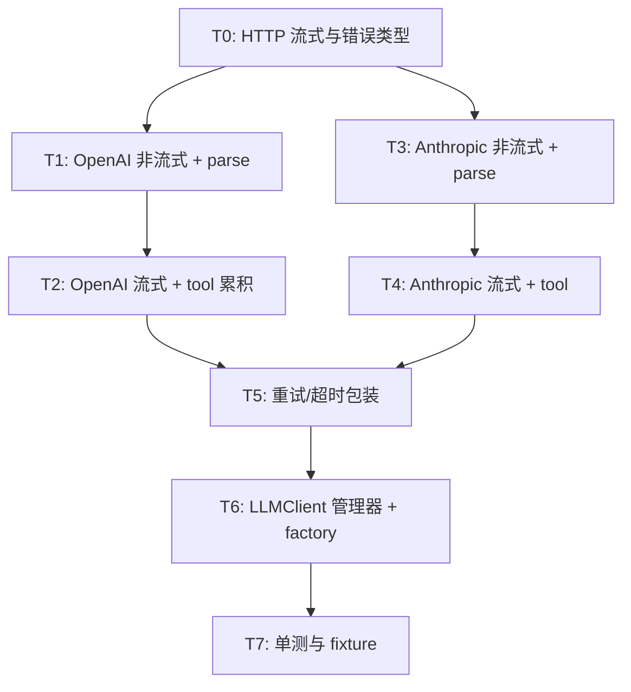

# WP1.1：LLMClient 核心 — 实现计划

本文档将 [phase-1-plan.md](./phase-1-plan.md) **§3 WP1.1** 细化为可执行任务、接口契约、错误模型、测试与提交顺序。范围仅限 **LLM 客户端与 OpenAI / Anthropic 适配器**；不包含 ToolBus（WP1.2）与图节点（WP1.5），但约定与 `LLMOutput` / `RenderedPrompt` 的衔接。

**文档版本**：0.1  
**日期**：2026-03-31  
**上游依据**：`phase-1-plan.md` v0.1（任务 1.1.1–1.1.6）

---

## 1. 目标与非目标

### 1.1 目标（验收对齐 phase-1-plan）

| 编号 | 能力 |
|------|------|
| G1 | `LLMClient::invoke` / `invoke_with_rendered_prompt`：基于已注册适配器异步返回 `std::future<LLMOutput>` |
| G2 | **流式**：`stream_callback(std::string_view)` 在**增量文本**可用时调用；结束时 `LLMOutput` 与流内容一致 |
| G3 | **工具调用**：非流式与流式响应均能填充 `LLMOutput::tool_calls`（`CallSpec`：`name` + `arguments` 对象） |
| G4 | **双后端**：`OpenAIAdapter`、`AnthropicAdapter` 行为一致于 **G2/G3**（差异关在适配器内） |
| G5 | **超时**：单次 HTTP 会话可配置超时；超时时 future 以异常或带错误字段的约定方式结束（见 §5） |
| G6 | **重试**：对可重试状态码（429、502–504、连接复位）做有限次指数退避 + jitter |
| G7 | **配置**：`ModelConfig` + 环境变量（见 §6）；`configure(provider, config)` 生效 |

### 1.2 非目标（阶段 1 可不实现）

- `GeminiAdapter` / `vLLMAdapter` 的生产级实现（可保留 **stub**：返回明确 “not implemented” 或复用 OpenAI 兼容路径若 vLLM 与 OpenAI 一致）。
- 语音/图像 **Realtime** 双向流（`audio_out` / `image_out` 可留空）。
- 真正的 **跨请求**取消（`CancelToken`）；仅要求 **合作式**：超时关闭连接后 future 结束。

---

## 2. 与现有代码的契约

### 2.1 类型（`include/agent/types.hpp`）

- **统一输出**：`LLMOutput` 使用 `std::vector<CallSpec> tool_calls`；节点与 ToolBus 已按 `CallSpec` 命名，**不再**引入并行类型名 `ToolCallRequest`。
- **语义约定**：
  - `is_final == true`：本轮不期望再发起 tool（最终答复在 `final_answer`）；若同时存在 `tool_calls`，以 **「先执行 tool」** 为循环策略时由 **Agent 循环**定义优先级，本 WP 只保证字段解析正确。
  - `reasoning`：可选；OpenAI 的 `reasoning`/`思考` 类内容若 API 暴露则填入，否则留空。
- **`RenderedPrompt`**：适配器 **只消费** `messages`、`tools_json`（及可选多模态字段）；`rendered_text` 可用于日志，**不要求**各供应商都发送该字段。

### 2.2 头文件 API（`include/agent/llm_client.hpp`）

- 保持现有 `ModelAdapter` / `OpenAIAdapter` / `AnthropicAdapter` / `LLMClient` 公开接口；若需新增成员，优先 **私有辅助** 或 **`internal` 命名空间** 自由函数，避免破坏二进制兼容以外的源码依赖。
- `ModelAdapter::send_request` / `parse_response`：若与流式 POST 冲突，可改为 **默认实现抛异常**，实际路径走子类 `post_json` / `post_sse`。

### 2.3 HTTP 现状（`include/agent/httplib_http_client.hpp`）

- 当前 `HttplibClient` 仅 **`post` → `json`**，适合 **非流式** completion。
- **WP1.1 必须增加**：对流式响应的 **`POST + 分块读 body` 或 SSE 解析**（见任务 T-HTTP-2）。可选两种落地方式：
  - **A（推荐）**：在 `httplib_http_client.hpp/.cpp` 增加 `post_stream(...)`、`post_sse_lines(...)` 之类方法，复用连接与 SSL 配置；
  - **B**：在 `openai_adapter.cpp` / `anthropic_adapter.cpp` 内局部使用 `httplib::Client`，与 `HttplibClient` 并行（短期重复，标记后续合并）。

计划在文档中采用 **方案 A** 为默认，以降低 TLS/代理配置分叉。

---

## 3. 任务分解与提交顺序

建议 **每个任务独立 PR 或可回滚提交**，顺序如下。

### T0 — HTTP 与共享基础设施

| 子 ID | 工作项 | 说明 |
|-------|--------|------|
| T0.1 | **流式 POST** | 接受 URL、headers、JSON body、`stream: true`；按行或按 chunk 回调原始字节；支持 UTF-8 跨 chunk 的增量解码（或约定只把完整 SSE `data:` 行交给上层）。 |
| T0.2 | **错误类型** | 定义 `LLMHttpError`（或 `std::runtime_error` 子类）：含 HTTP 状态、`body` 摘录、`provider` 字段；便于重试层解析 429 `retry-after`。 |
| T0.3 | **超时** | `httplib::Client::set_connection_timeout` / `set_read_timeout` 与 `AGENT_HTTP_TIMEOUT_SEC` 对齐。 |

**产出**：`httplib_http_client.cpp`（及必要时头文件）；或 `src/llm_client/http_transport.*` 若希望减小 AgentClient 耦合。

---

### T1 — OpenAI：非流式

| 子 ID | 工作项 | 说明 |
|-------|--------|------|
| T1.1 | **端点** | 首版固定 **`POST {base_url}/chat/completions`**（OpenAI 兼容）；在本文档与 `getting_started.md` 写明；Azure 路径差异通过 `base_url` 覆盖。 |
| T1.2 | **build_openai_request** | 从 `RenderedPrompt.messages` 与 `tools_json` 组装：`model`、`messages`、`tools`（若非空）、`tool_choice`（默认 `auto`）、`temperature`、`max_tokens`；`stream: false`。 |
| T1.3 | **parse 非流式** | 解析 `choices[0].message`：`content` → `final_answer`；`tool_calls` → `CallSpec`（`function.name`、`function.arguments` 字符串转 `json`）；`finish_reason` 映射到 `is_final`（`stop` / `tool_calls` 等）。 |

**验收**：单测使用脱敏 JSON fixture，无网络。

---

### T2 — OpenAI：流式 + tool_calls 累积

| 子 ID | 工作项 | 说明 |
|-------|--------|------|
| T2.1 | **SSE 解析** | 解析 `data: {json}`；忽略 `data: [DONE]`；处理心跳空行。 |
| T2.2 | **文本增量** | `delta.content` 片段拼接到 `final_answer` 并同步调用 `stream_callback`。 |
| T2.3 | **tool 增量** | `delta.tool_calls[]`：按 `index` 合并 `id`、`function.name`、`function.arguments` 字符串分段；流结束后得到完整 `CallSpec` 列表。 |
| T2.4 | **结束行** | 最后一帧带 `finish_reason`；与累积内容一致。 |

**注意**：部分模型在流式下 tool 仅出现在最后一块；单测覆盖「纯文本流」「仅 tool」「文本+tool」三种 fixture。

---

### T3 — Anthropic：非流式

| 子 ID | 工作项 | 说明 |
|-------|--------|------|
| T3.1 | **端点** | `POST {base_url}/v1/messages`（以当前官方文档为准；base_url 默认 `https://api.anthropic.com`）。 |
| T3.2 | **请求头** | `x-api-key`、`anthropic-version`（版本号锁在 spec tracker 或常量头文件）。 |
| T3.3 | **build_anthropic_request** | `system`（来自 messages 中 role=system 或多段）、`messages`（user/assistant/tool_result 映射）、`tools`、`max_tokens`（Anthropic 必填最小值遵守文档）。 |
| T3.4 | **parse** | `content` 数组：`text` → `final_answer`；`tool_use` → `CallSpec`（`name`、`input` 对象）。 |

---

### T4 — Anthropic：流式

| 子 ID | 工作项 | 说明 |
|-------|--------|------|
| T4.1 | **事件类型** | 处理 `message_start`、`content_block_start`、`content_block_delta`、`content_block_stop`、`message_delta`、`message_stop`（以官方流式文档为准，事件名变更时在适配器内集中更新）。 |
| T4.2 | **文本增量** | `text_delta` → `stream_callback` + 累积 `final_answer`。 |
| T4.3 | **tool_use 累积** | `input_json_delta` 拼接为 JSON 后解析为 `arguments` 对象。 |

---

### T5 — 重试、超时与并发

| 子 ID | 工作项 | 说明 |
|-------|--------|------|
| T5.1 | **重试策略** | `max_retries`（如 3）、初始退避（如 500ms）、倍数 2、最大帽（如 8s）、全局限流 jitter。 |
| T5.2 | **可重试条件** | 网络错误、408、429（尊重 `retry-after` 若存在）、502–504。 |
| T5.3 | **不可重试** | 401、403、400（参数错误）立即失败；body 节选写入异常。 |
| T5.4 | **async 包装** | `std::async` 或线程池任务中运行同步 HTTP，避免阻塞调用线程；`LLMClient` 返回 `std::future` 与现有声明一致。 |

实现位置优先：`model_adapter.cpp` 中 protected 模板方法 `with_retry(lambda)`，供 `OpenAIAdapter` / `AnthropicAdapter` 调用。

---

### T6 — `LLMClient` 管理器

| 子 ID | 工作项 | 说明 |
|-------|--------|------|
| T6.1 | **render 路径** | `invoke(input)` → `render_prompt`（需 `PromptRenderer` 已 `set_prompt_renderer`）→ `invoke_with_rendered_prompt`。 |
| T6.2 | **缺 renderer** | 明确错误：`throw` 或 `LLMOutput` 错误语义二选一；推荐 **抛 `std::invalid_argument`**，避免静默空请求。 |
| T6.3 | **工厂** | 可选 `LLMClient::from_env()`：读 `AGENT_LLM_PROVIDER`、密钥、base_url，注册默认 adapter。 |
| T6.4 | **适配器 `invoke(LLMInput)`** | 若节点绕过 `LLMClient` 直接调 adapter：实现为 **内部构造临时 `PromptRenderer`** 并 render，或 **文档声明禁止** 仅保留 `invoke_with_rendered` 为完整路径。推荐：**实现最小默认 RenderedPrompt**（仅 system+user+tools）以免测试分叉。 |

**产出**：`src/llm_client/llm_client.cpp`

---

### T7 — 测试与 fixture

| 子 ID | 工作项 | 说明 |
|-------|--------|------|
| T7.1 | **目录** | `agent_framework/tests/fixtures/llm/openai_*.json`、`anthropic_*.json`（脱敏、小体量）。 |
| T7.2 | **单测** | `test_openai_adapter_parse.cpp`：build_request 快照（可选）、parse_response、流式字符串拼接。 |
| T7.3 | **Anthropic** | 同上。 |
| T7.4 | **重试** | mock 传输层：前两次 429 第三次 200。 |

---

## 4. `invoke(LLMInput)` vs `invoke_with_rendered` 推荐路径

| 调用方 | 推荐 API | 说明 |
|--------|----------|------|
| Agent 图 / `LLMNode` | `LLMClient::invoke_with_rendered_prompt` | 图前序节点已渲染时使用，少一次重复渲染 |
| CLI / 高层 | `LLMClient::invoke` | 自动 `PromptRenderer` |

**适配器层**：以实现 **`invoke_with_rendered` 为唯一 HTTP 入口**；`invoke(LLMInput)`  thin wrapper 生成 `RenderedPrompt`（共享辅助函数，避免重复 HTTP 逻辑）。

---

## 5. 错误与 `LLMOutput` 约定

- **HTTP/解析失败**：`std::future` 以 **`std::exception_ptr`** 传播异常，调用方 `catch`；不在此 WP 引入 `std::expected`（除非项目已统一 C++23）。
- **业务级模型错误**（如 content filter）：若 API 返回 200 且 body 内 `error` 对象，映射为异常或 **可选** 后续 WP 在 `LLMOutput` 增加 `error` 字段；首版推荐 **抛异常** 并附带原始 `error` JSON 串。
- **空 tool_calls + 空 final_answer**：允许（模型的无效回合）；由 WP1.5 循环决定重试或终止。

---

## 6. 配置与环境变量

与 `phase-1-plan.md` 对齐，实施时以代码常量 + 文档为准。

| 变量 | 用途 |
|------|------|
| `AGENT_LLM_PROVIDER` | `openai` / `anthropic` |
| `OPENAI_API_KEY` | OpenAI 密钥 |
| `ANTHROPIC_API_KEY` | Anthropic 密钥 |
| `AGENT_OPENAI_BASE_URL` | 默认 `https://api.openai.com/v1` |
| `AGENT_ANTHROPIC_BASE_URL` | 默认 `https://api.anthropic.com` |
| `AGENT_HTTP_TIMEOUT_SEC` | 连接/读超时（整数秒） |
| `AGENT_LLM_MAX_RETRIES` | 可选，默认 3 |

`ModelConfig` 扩展（若需）：在 `types.hpp` 增加 `int http_timeout_sec = 120`、`int max_retries = 3`，或放入 `extra_params` 并文档化键名。

---

## 7. 依赖项

| 依赖 | 说明 |
|------|------|
| **WP1.4 PromptRenderer** | `LLMClient::invoke(LLMInput)` 依赖；适配器单测可绕过，直接构造 `RenderedPrompt`。 |
| **nlohmann/json** | 已存在。 |
| **cpp-httplib** | 流式与 SSL 与主 `CMakeLists.txt` 一致。 |

**并行**：T0–T2 可与 PromptRenderer 并行，只要单测用 `RenderedPrompt` 手写构造。

---

## 8. 风险与缓解

| 风险 | 缓解 |
|------|------|
| OpenAI 流式 tool `index` 乱序 | 用 `map<int, Accumulator>` 合并；单测覆盖乱序片段 |
| Anthropic `max_tokens` 与 `tool_use` 强制字段 | 对齐官方最小值；集成前用手册请求验一次 |
| SSE 与 UTF-8 分包 | 仅在完整 SSE `data:` 行上 `json::parse`；不在半截 UTF-8 上解析 |
| `HttplibClient` 与 AgentClient 耦合 | 流式方法抽到共享 `internal_http` 或扩 `HttplibClient` 并保持接口稳定 |

---

## 9. 完成定义（WP1.1 DoD）

- [ ] OpenAI：`stream=false` / `stream=true` + tool，单测通过。
- [ ] Anthropic：非流式 / 流式 + tool，单测通过。
- [ ] `LLMClient`：`set_default_adapter` + `invoke_with_rendered_prompt` 集成测通过（mock 或本地 fixture）。
- [ ] 重试 + 超时行为有单测或文档化手测步骤。
- [ ] `getting_started.md` 增补最小 env 示例（可与 WP1.7 合并提交）。

---

## 10. 相关链接

- [phase-1-plan.md](./phase-1-plan.md) — 阶段 1 总表  
- [plan-detailed.md](./plan-detailed.md) — §4.3 流式与工具要点  
- `include/agent/llm_client.hpp`、`include/agent/types.hpp`  
- `include/agent/httplib_http_client.hpp`

---

## 11. 修订记录

| 日期 | 版本 | 说明 |
|------|------|------|
| 2026-03-31 | 0.1 | 初稿：从 phase-1-plan WP1.1 展开为 T0–T7、契约与 DoD。 |
