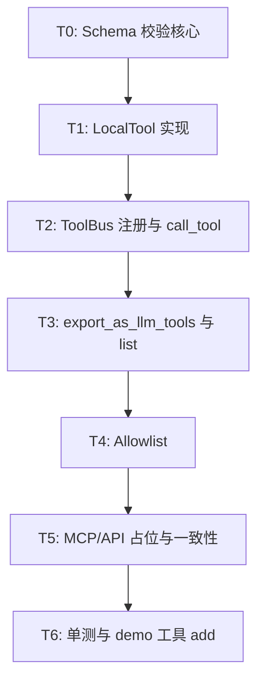

# WP1.2：ToolBus（本地工具）— 实现计划

本文档将 [phase-1-plan.md](./phase-1-plan.md) **§3 WP1.2** 细化为可执行任务、JSON Schema 子集规则、错误载荷、测试与完成定义。范围以 **`register_local_tool` + `call_tool` + `export_as_llm_tools`** 为主；`register_mcp_service` / `register_api_tool` / `MCPTool` / `APITool` 的**完整行为**分别由 **WP1.3** 与后续工作包负责，此处仅要求 **ToolBus 路由不破坏**（可注册、可占位抛出明确错误）。

**文档版本**：0.1
**日期**：2026-03-31
**上游依据**：`phase-1-plan.md` v0.1（任务 1.2.1–1.2.4）

---

## 1. 目标与非目标

### 1.1 目标

| 编号 | 能力 |
|------|------|
| G1 | **`ToolBus::register_local_tool`**：注册 `name`、`std::function<json(const json&)>`、`ToolMeta`（含 **JSON Schema**）；同名覆盖策略**文档化并实现**（拒绝或覆盖二选一） |
| G2 | **`ToolBus::call_tool(name, arguments)`**：返回 `std::future<json>`；调用前 **校验参数**；线程安全 |
| G3 | **`export_as_llm_tools()`**：聚合所有已注册工具为 `std::vector<ToolMeta>`，供 `LLMInput.tools` / 适配器使用 |
| G4 | **错误 JSON**：校验失败或未知工具返回 **结构化 JSON**（见 §5），便于作为 tool 角色消息回灌模型 |
| G5 | **Allowlist**：可选环境变量 **`AGENT_TOOL_ALLOWLIST`**（逗号分隔）；若设置，`call_tool` 对不在列表中的 `name` **拒绝**（注册阶段可选同样拒绝，见 §4.3） |

### 1.2 非目标（本 WP 可不完成）

- MCP stdio/HTTP 工具 discovery 与转发（**WP1.3**）。
- `APITool` 真实 HTTP 调用（可保留 **stub**：`call` 返回 `{"error":"not_implemented"}` 或暂缓注册）。
- 并行批量调度、优先级队列（`ScheduledTask`）；由 **WP1.5** 决定串行/并行。
- 完整 JSON Schema Draft 2020-12：仅实现 **§3 所述子集**。

---

## 2. 与现有代码的契约

### 2.1 头文件（`include/agent/toolbus/toolbus.hpp`）

- **`ToolInterface`**：`LocalTool` 实现全部虚函数；`MCPTool`/`APITool` 可与 WP1.3 同步填满。
- **`LocalTool`**：对 `call(name, arguments)`：若 `name != name_`，返回失败 future 或 assert（单工具实例只服务自身 `name_`）；实现任选其一并在测试中固定约定。
- **`ToolBus`**：
  - `tools_`：`name` → `shared_ptr<ToolInterface>`（本地一村一名）。
  - `find_tool`：读锁路径；**写路径** `register_*` 与 `call_tool` 内部查找共用 `tools_mutex_`。
- **`call_tool`**：解析 `find_tool`；不存在则 **立即** `std::async` 返回 `{"error":...,"code":"unknown_tool"}` 或抛异常；**phase-1-plan 要求适合回灌模型** → 推荐 **返回 JSON，不抛**（与 WP1.5 聚合简单一致）。

### 2.2 类型（`include/agent/core/types.hpp`）

- **`ToolMeta`**：`name`、`description`、`schema`（**OpenAI function parameters 形态**：`{"type":"object","properties":{...},"required":[...]}`）。
- **`ToolInfo`**：用于 `get_tool_info`；本地工具可在注册时用默认值或从 `meta.extra` 扩展（若需可增加 `ToolMeta::optional<json> hints`，本 WP **不强制** 改 `types.hpp`）。

---

## 3. JSON Schema 校验子集（1.2.2）

以下为 **最小必支持**；超出部分可 **`validation_unsupported` 警告** 并放行或拒绝（**择一写死**，建议：**拒绝**更安全）。

| 特性 | 支持策略 |
|------|----------|
| 根 `type` | **`object` 必填**；其他根类型首版可拒绝 |
| `properties` | 支持；键为字符串，值为 **子 schema** |
| `required` | 字符串数组；所列键必须在 `arguments` 中存在 |
| 属性类型 | `string`、`number`/`integer`、`boolean`、`object`、`array`（数组元素可做 **同质化 primitive** 或未校验） |
| `enum` | 可选实现；建议支持以覆盖 demo |
| `additionalProperties` | 若为 `false`，拒绝未知键；若缺省，建议按 **`false` 默认**（与 OpenAI 常见 tool schema 一致） |
| `$ref`、`allOf`、`oneOf` | **不支持**；遇到则校验失败并说明 `code` |
| `$schema`、`$id`、`$comment` | **元数据**：在任意嵌套层级忽略，不参与校验；根对象上的值可通过 `extract_json_schema_root_meta` / `validate_tool_arguments(..., JsonSchemaRootMeta*)` 读出 |
| 其它以 `$` 开头的键（如 `$ref`、`$vocabulary`） | **不支持**，`schema_unsupported` |
| 嵌套 object | 支持一层或多层递归，与同一套 visitor |

**实现方式**（二选一或组合）：

- **推荐**：`src/toolbus/schema_validate.cpp`（或 `local_tool.cpp` 内）手写 `validate_json(const json& instance, const json& schema, std::string& err)`。
- 可选：小函数表 + 单元测试锁死行为。

**`validate_arguments`**：`LocalTool` 与 `ToolBus::call_tool` **双重**入口一致：`call_tool` 先 `find_tool` → `tool->validate_arguments` → 再 `call`。

---

## 4. 任务分解与提交顺序



### T0 — Schema 校验核心

| 子 ID | 工作项 | 说明 |
|-------|--------|------|
| T0.1 | **API** | `bool validate_tool_arguments(const json& schema, const json& arguments, json& error_obj)`；失败时 `error_obj` 含 `message`、`path`（可选 JSON Pointer 简版）、`code`。 |
| T0.2 | **单测** | 覆盖：缺 required、类型错误、additionalProperties、`enum`（若实现）。 |

**产出**：`src/toolbus/schema_validate.cpp` + `include/agent/toolbus/schema_validate.hpp`（可选内联匿名命名空间于 `local_tool.cpp`，若忌文件膨胀可合并）.

---

### T1 — `LocalTool`

| 子 ID | 工作项 | 说明 |
|-------|--------|------|
| T1.1 | **构造** | 保存 `name_`、`func_`、`meta_`；填充 `ToolInfo info_`（至少 `name`）。 |
| T1.2 | **call** | `std::async(std::launch::async, ...)` 包装同步 `func_`；捕获异常 → `{{"error","...","code","tool_exception"}}`。 |
| T1.3 | **validate_arguments** | 委托 T0。 |
| T1.4 | **get_tool_meta** | `name` 不匹配时返回空 meta 或仅 `meta_`（测试约定与 ToolBus 一致）。 |

**产出**：`src/toolbus/local_tool.cpp`

---

### T2 — `ToolBus` 核心

| 子 ID | 工作项 | 说明 |
|-------|--------|------|
| T2.1 | **register_local_tool** | 构造 `LocalTool`，`tools_[name]=...`；**重名**：建议 **抛 `std::invalid_argument`** 或 `std::runtime_error`，并在文档写明。 |
| T2.2 | **call_tool** | 加锁查找 → allowlist（T4）→ `validate_arguments` → `tool->call`；未知工具返回 **resolved future**，值为错误 JSON。 |
| T2.3 | **线程安全** | 同进程多线程 `call_tool`：**互斥**保护 `tools_` 查找；各 `LocalTool` 实例无共享可变状态则无需 per-tool 锁。 |

**产出**：`src/toolbus/toolbus.cpp`

---

### T3 — 导出与发现

| 子 ID | 工作项 | 说明 |
|-------|--------|------|
| T3.1 | **export_as_llm_tools** | 遍历 `tools_`，对每个 `get_tool_meta(name)` 或存储的 meta 汇总；顺序稳定（按 `name` 字典序）。 |
| T3.2 | **list_all_tools / get_tool_info** | 与 `ToolInterface` 一致；`get_tool_info` 无则 `nullopt`。 |

---

### T4 — Allowlist

| 子 ID | 工作项 | 说明 |
|-------|--------|------|
| T4.1 | **解析** | 启动或首次 `call_tool` 时读取 `AGENT_TOOL_ALLOWLIST`；解析为 `std::unordered_set<std::string>`（trim 空格）。 |
| T4.2 | **语义** | 未设置：不限制。已设置：`call_tool` 时 `name` 不在集合 → 返回 `{"error":"...","code":"tool_not_allowed"}`。 |
| T4.3 | **注册阶段（可选）** | `register_local_tool` 若 allowlist 存在且 name 不在列表 → **拒绝注册**；避免 LLM 看到已注册却不可用的工具。与 **仅 call 限制** 二选一，推荐 **注册即过滤**，与 `export_as_llm_tools` 一致。 |

---

### T5 — MCP / API 占位（与 WP1.3 衔接）

| 子 ID | 工作项 | 说明 |
|-------|--------|------|
| T5.1 | **register_mcp_service** | 可将 `service_name` 作为前缀注册多个 MCP 工具，或暂存 `shared_ptr<MCPClient>`；WP1.2 **最小**：占位 + 文档「未实现」。 |
| T5.2 | **MCPTool::call** | 若 WP1.2 结束前 WP1.3 未完成，返回明确 `code`：`mcp_not_implemented`。 |
| T5.3 | **APITool** | 同上或暂不 `register_api_tool`。 |

避免：**静默返回空 JSON**。

---

### T6 — 单测与演示工具

| 子 ID | 工作项 | 说明 |
|-------|--------|------|
| T6.1 | **add** | `add(a,b)` 两数之和；schema `integer` 或 `number`。 |
| T6.2 | **负例** | 缺参、类型错误、未知工具、allowlist 拒绝。 |
| T6.3 | **集成（可选）** | 与 mock `LLMOutput.tool_calls` 串联（WP1.7）；本 WP 以单测为主。 |

**fixture**：`tests/fixtures/toolbus/*.json`（arguments 样例）。

---

## 5. 错误 JSON 约定（回灌模型）

建议统一形状（字段可增不可减）：

```json
{
  "error": "human readable message",
  "code": "unknown_tool | validation_failed | tool_not_allowed | tool_exception | mcp_not_implemented",
  "details": {}
}
```

- **`validation_failed`**：`details` 内含 `schema_path` 或 `field` 列表。
- **`tool_exception`**：`details` 可含 `what` 截断（防日志爆炸）。

**与 `Message` / 历史**：WP1.5 将 tool 结果写入 `Message::tool_result`；本 WP 保证 **`call_tool` 的 future 内容与上述约定一致**。

---

## 6. 与 WP1.1 / WP1.5 的接口

| 方向 | 约定 |
|------|------|
| WP1.1 | `export_as_llm_tools()` → `LLMInput.tools`；`ToolMeta.schema` 必须符合 OpenAI `parameters` 子集。 |
| WP1.5 | `CallSpec::arguments` 传入 `call_tool`；返回值 JSON 序列化进下一轮 history。 |
| WP1.3 | MCP 工具名与本地工具名 **全局唯一**；冲突时注册失败或 `mcp_` 前缀（在 WP1.3 文档中固定）。 |

---

## 7. 配置与环境变量

| 变量 | 用途 |
|------|------|
| `AGENT_TOOL_ALLOWLIST` | 逗号分隔工具名；未设置表示不启用 |

可选：`AGENT_TOOL_STRICT_SCHEMA=1` 对未知 schema 关键字拒绝（调试）。

---

## 8. 风险与缓解

| 风险 | 缓解 |
|------|------|
| Schema 与模型生成的 arguments 轻微不匹配（类型 string vs number） | 错误信息写明路径；Prompt 中示例 JSON |
| `std::async` 无界线程 | 阶段 1 工具数少；WP1.5 可改线程池 |
| MCP 与 Local 同名 | 注册时全局检查；文档前缀策略 |

---

## 9. 完成定义（WP1.2 DoD）

- [ ] `register_local_tool` + `call_tool` + `export_as_llm_tools` + `list_all_tools` 实现且线程安全。
- [ ] JSON Schema 子集校验与单测覆盖 T0 表。
- [ ] Demo 工具 `add` + 非法参数 + 未知工具用例通过。
- [ ] `AGENT_TOOL_ALLOWLIST` 行为有单测。
- [ ] MCP/API 路径：**明确未实现或最小 stub**，不崩溃。
- [ ] `phase-1-plan.md` / `getting_started.md` 中工具相关说明可在你方下一轮文档 PR 中补一行（本 WP 不强制改长文）。

---

## 10. 相关链接

- [phase-1-plan.md](./phase-1-plan.md) — WP1.2 摘要
- [phase-1-wp1.md](./phase-1-wp1.md) — LLM 与 tools 列表格式
- `include/agent/toolbus/toolbus.hpp`、`include/agent/core/types.hpp`

---

## 11. 修订记录

| 日期 | 版本 | 说明 |
|------|------|------|
| 2026-03-31 | 0.1 | 初稿：WP1.2 任务 T0–T6、Schema 子集、错误 JSON、Allowlist。 |
