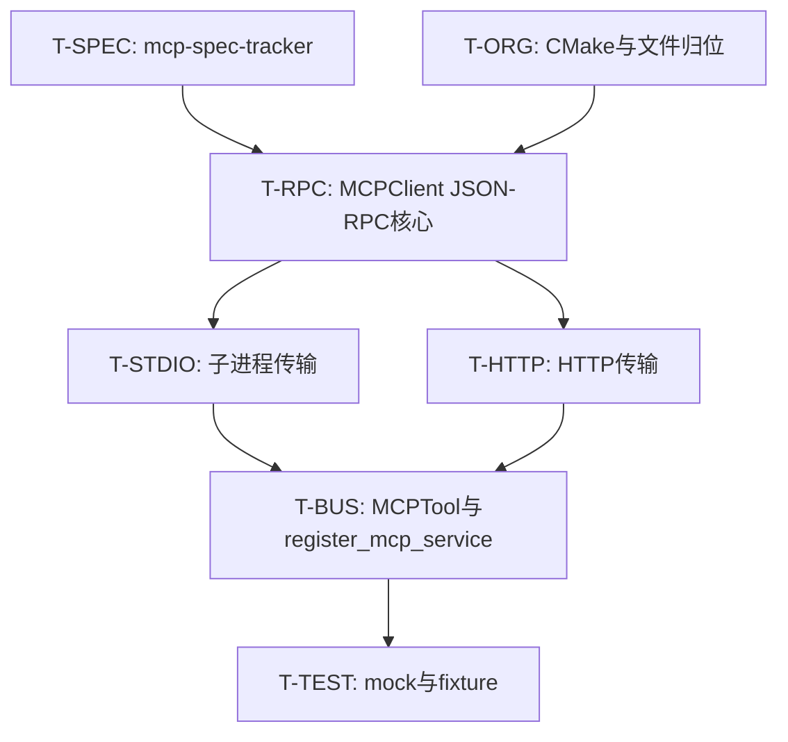

# WP1.3：MCP（Model Context Protocol）— 实现计划

本文档将 [phase-1-plan.md](./phase-1-plan.md) **§3 WP1.3** 细化为可执行任务、传输层契约、JSON-RPC 要点、ToolBus 集成与测试策略。实施顺序与 **plan-detailed §4.4** 一致：**stdio 传输优先**，**HTTP 其次**；WebSocket 仅保留头文件占位，本 WP 不要求可跑通。

**文档版本**：0.1  
**日期**：2026-03-31  
**上游依据**：`phase-1-plan.md` v0.1（任务 1.3.1–1.3.4）

---

## 1. 目标与非目标

### 1.1 目标

| 编号 | 能力 |
|------|------|
| G1 | **`MCPClient`**：基于可注入的 `MCPTransportInterface`，完成连接、`list_tools`、`call_tool`、**JSON-RPC 2.0** 请求/响应关联 |
| G2 | **Stdio 传输**：子进程 + stdin/stdout **按 MCP 规范 framing** 读写（在 §3.1 tracker 中锁定文本）；超时、EOF、非零退出可观测 |
| G3 | **HTTP 传输**：`POST` JSON-RPC 到 `base_url`（+ 规范路径）；复用 **`HttplibClient`** 或局部 `httplib::Client`；鉴权头可配置 |
| G4 | **ToolBus**：`register_mcp_service(service_name, shared_ptr<MCPClient>)` 将远端 **`tools/list`** 结果映射为 **多个** `ToolInterface` 条目或 **单个 `MCPTool` 多路由**（见 §6.1，需择一实现） |
| G5 | **生命周期**：`disconnect()` / 析构：**优雅杀进程**（stdio）或关闭连接（HTTP）；无 dangling 读线程 |
| G6 | **可观测性**：连接失败、JSON-RPC `error`、工具执行失败均映射为 **JSON 结果**（与 [phase-1-wp2.md](./phase-1-wp2.md) §5 形状兼容，可增加 `mcp_*` code） |

### 1.2 非目标

- **WebSocket MCP**：`WebSocketMCPTransport` 可不实现（返回 `false`/明确错误）。
- **MCP 授权 OAuth 完整流程**：仅需预留 `extra_headers` / `connect` 参数。
- **重试风暴**：失败 **不重试** 或由上层 WP1.5 决定；传输层单次超时即可。
- **与远端 schema 强校验**：可选调用 WP1.2 校验器；首版可将 **server 报错**原样包进 JSON。

---

## 2. 代码与构建现状

| 现状 | 处理建议 |
|------|----------|
| `include/agent/mcp_client.hpp` 已定义 `MCPTransportInterface`、`StdioMCPTransport`、`HttpMCPTransport`、`MCPClient` | 对齐实现；修正 `StdioMCPTransport` 中 **`std::unique_ptr<void> process_`** 为平台相关类型（`FILE*`+pid / `posix_spawn` 封装类） |
| `src/mcp_client/mcp_client.cpp` 存在但 **未列入** `CMakeLists.txt` | **T-ORG**：将 MCP 实现源文件统一加入 `AGENT_SOURCES`（推荐 `src/mcp_client/*.cpp`） |
| `src/toolbus/mcp_client.cpp` 仅 TODO 且错误包含 `toolbus.hpp` | **改为** `MCPTool` 实现 **或** 删除并改为 `src/toolbus/mcptool.cpp`，避免与 `src/mcp_client` 重复定义 |

**推荐布局（T-ORG 完成后）**

- `src/mcp_client/mcp_client.cpp` — `MCPClient::send_jsonrpc_request`、`parse_jsonrpc_response`、`list_tools`、`call_tool`
- `src/mcp_client/stdio_transport.cpp` — 子进程与 framed I/O
- `src/mcp_client/http_transport.cpp` — HTTP POST JSON-RPC
- `src/toolbus/mcptool.cpp` — `MCPTool`（`toolbus.hpp`），`register_mcp_service` 留在 `toolbus.cpp`

---

## 3. 规范与版本锁定

### 3.1 `docs/guides/mcp-spec-tracker.md`（任务 T-SPEC）

新建并维护最小字段：

| 字段 | 说明 |
|------|------|
| 锁定日期 | |
| 参阅文档 URL | MCP 官方规范 / 修订 |
| 传输 | stdio framing 描述（**Content-Length / NDJSON** 等，以抄录的官方片段为准） |
| 方法名 | `initialize`、`notifications/initialized`、`tools/list`、`tools/call`（若官方更名，以 tracker 为准） |
| 与本实现的差异 | 如省略部分 capability |

### 3.2 JSON-RPC 2.0 客户端要点（实现层）

- 每请求生成 **`id`**（单调整数或 UUID 字符串）；**同步** stdio/http 下一行/下一响应必须 **匹配 id**。
- 解析 `result` / `error`：`error.message`、`error.data` 记入返回 JSON 或异常（首版推荐：**工具调用**路径返回 JSON，**握手**失败可抛 `std::runtime_error`）。
- **`initialize`**：在首次 `tools/list` 前发送；参数子集（`protocolVersion`、`capabilities`、`clientInfo`）从 tracker 抄录固定模板。

---

## 4. 任务分解与提交顺序



### T-SPEC — 规范锁定

撰写 `docs/guides/mcp-spec-tracker.md`；评审通过后 **禁止**在未更新 tracker 的情况下改 method 名字符串。

---

### T-ORG — 构建与文件

| 子 ID | 工作项 |
|-------|--------|
| T-ORG.1 | `CMakeLists.txt`：`list(APPEND AGENT_SOURCES src/mcp_client/mcp_client.cpp ...)` |
| T-ORG.2 | 决定 `src/toolbus/mcp_client.cpp` 命运：迁移为 `mcptool.cpp` 或删除重复 |
| T-ORG.3 | 若 stdio 仅在 Linux 实现，文档写明；WSL/CI 用 mock |

---

### T-RPC — `MCPClient` 核心（与传输无关）

| 子 ID | 工作项 | 说明 |
|-------|--------|------|
| T-RPC.1 | `send_jsonrpc_request(method, params)` | 组帧 `{"jsonrpc":"2.0","id",...}`，委托 `transport_->send_request` — *若头文件定义为 `send_request(method,params)` 则 transport 已实现整包发送* |
| T-RPC.2 | `parse_jsonrpc_response` | 抽取 `result`；`error` 转 `json{{"error",...,"code","mcp_jsonrpc_error"}}` |
| T-RPC.3 | `list_tools` | `std::async` 调 RPC → 将 `tools` 数组项映射为 **`ToolMeta`**（`name`、`description`、`inputSchema` → `schema`） |
| T-RPC.4 | `call_tool` | 映射到官方 `tools/call`（或 tracker 中的名称），`arguments` 为对象 |
| T-RPC.5 | `connect` | 澄清：`MCPClient` 构造已持有 transport 时，`connect(endpoint, type)` 可能与当前设计重复 — **实施时**二选一：**(A)** 工厂 `MCPClient::create_stdio(cmd,args)` **(B)** 保留现有 API 但文档化 `transport` 预先 connect |

**注意**：头文件中 `MCPClient::connect(const std::string& endpoint, MCPTransport transport_type)` 与「构造注入 transport」并存易混淆；本 WP 建议在 **实现 PR 内**收敛为一种 **Factory + 私有构造**，避免双连接路径。

---

### T-STDIO — `StdioMCPTransport`

| 子 ID | 工作项 | 说明 |
|-------|--------|------|
| T-STDIO.1 | **子进程** | `posix_spawn` / `fork+exec`（stdout/stdin pipe）；Windows 若未支持则 `#error` 且文档声明 |
| T-STDIO.2 | **读写循环** | 按 tracker framing 写一条请求、读一条响应；**读超时**用 `poll`/`select` 或异步 reader 线程 + 队列 |
| T-STDIO.3 | **线程安全** | `send_request` 串行化（`io_mutex_`）；禁止多线程并发写 stdin |
| T-STDIO.4 | **清理** | `disconnect()`：关管道、**SIGTERM** 子进程、短等待后 **SIGKILL** |

---

### T-HTTP — `HttpMCPTransport`

| 子 ID | 工作项 | 说明 |
|-------|--------|------|
| T-HTTP.1 | **URL** | `base_url` + tracker 规定的 path（如 `/mcp` 或单端点 POST）；`connect` 可 noop 或健康检查 `GET` |
| T-HTTP.2 | **POST body** | 整段 JSON-RPC；`Content-Type: application/json` |
| T-HTTP.3 | **头部** | `Authorization: Bearer ...`、`Mcp-Session-Id` 等从 `MCPClient`/`HttpMCPTransport` 配置注入（`std::map<std::string,std::string>`） |

复用：`HttplibClient::post`；若 MCP 需 **Session**，在类内保存 cookie/header。

---

### T-BUS — ToolBus 集成

| 子 ID | 工作项 | 说明 |
|-------|--------|------|
| T-BUS.1 | **`MCPTool` 实现** | `refresh_tools_cache()`：调 `client_->list_tools().get()`；`get_tool_meta(name)` 从 cache 查 |
| T-BUS.2 | **名称** | 全局唯一：`{service_name}__{tool_name}` **或** `mcp::{service_name}/{tool_name}`；**选一种**写入 tracker + `overview.md` |
| T-BUS.3 | **`ToolBus::register_mcp_service`** | 创建 `MCPTool`，对每个远端工具 **注册一个** `std::shared_ptr<ToolInterface>` 适配器 **或** 注册单个 `MCPTool` 在 `call` 内分发（后者改动 `ToolInterface::call` 语义，**推荐前者**：每个工具一个 `MCPProxyTool` 小对象 holding `weak_ptr<MCPClient>` + tool name） |
| T-BUS.4 | **`validate_arguments`** | 若有 `inputSchema` 则委托 WP1.2 `validate_tool_arguments`；跳过则始终 true |
| T-BUS.5 | **析构顺序** | `ToolBus` 先于 `MCPClient` 销毁时不得 `call`；`shared_ptr` 延长寿命或 `shutdown` 标志 |

**推荐结构：`MCPProxyTool`**（实现细节名）

- 每个远端工具一条 `ToolBus` 记录，`call` 时 `client_->call_tool(original_name, arguments)`。

---

## 5. 错误与返回 JSON

与 WP1.2 一致时可复用：

```json
{
  "error": "message",
  "code": "mcp_connect_failed | mcp_jsonrpc_error | mcp_tool_error | mcp_timeout",
  "details": { }
}
```

- 远端 `tools/call` 返回的 `content` / `isError` 按 MCP 规范折叠进 `details` 或顶层 `result`。

---

## 6. 配置与环境变量

| 变量 / 配置 | 用途 |
|-------------|------|
| `AGENT_MCP_SERVER_CMD` | （示例）stdio 可执行文件路径 |
| `AGENT_MCP_SERVER_ARGS` | 空格分隔参数，或改用 JSON 配置文件（二选一文档化） |
| `AGENT_MCP_HTTP_URL` | HTTP base |
| `AGENT_MCP_AUTH_HEADER` | 可选 `Bearer` token |
| `AGENT_MCP_REQUEST_TIMEOUT_MS` | 单次 RPC 超时 |

** CLI / `cli_agent_demo`**：可通过 `--mcp-stdio`、`--mcp-http` 显式启用；未给则 **不连 MCP**。

---

## 7. 测试策略

| 类型 | 内容 |
|------|------|
| **单元** | `parse_jsonrpc_response` fixture；`request id` 匹配 |
| **Mock stdio** | 假进程或 **双向 pipe 测试夹具**：预录 request→response 字节流 |
| **集成（可选）** | 官方文档推荐的 **reference server** 之一；CI 可 `skip` |
| **ToolBus** | 注册 mock `MCPClient`，`export_as_llm_tools` 含 MCP 工具名 |

**验收**（与 phase-1-plan 一致）：mock 子进程或录制会话通过；**不强制**真网。

---

## 8. 风险与缓解

| 风险 | 缓解 |
|------|------|
| MCP 规范修订频繁 | **tracker** 锁定；方法名常量集中 `#define` 或 `constexpr string_view` |
| stdio 死锁（全缓冲） | 服务端要求 line-buffer / 无缓冲；文档说明常见坑 |
| 多工具注册爆炸 | `list_tools` 缓存 + 惰性刷新；日志打印工具数量 |
| `MCPClient::connect` API 与 transport 注入冲突 | T-RPC.5 收敛工厂模式 |

---

## 9. 完成定义（WP1.3 DoD）

- [ ] `mcp-spec-tracker.md` 已填且与代码常量一致。
- [ ] `StdioMCPTransport`：`initialize` + `tools/list` + `tools/call` **happy path** 手测或集成测通过。
- [ ] `HttpMCPTransport`：同上 **或** 文档声明「仅 stdio 第一阶段」，HTTP 第二 PR（与 plan 一致时两者都要）。
- [ ] `ToolBus::register_mcp_service` + 导出工具列表 + `call_tool` 端到端。
- [ ] CMake 仅一份 MCP 实现源树，无重复符号。
- [ ] WebSocket：**不阻塞 DoD**。

---

## 10. 相关链接

- [phase-1-plan.md](./phase-1-plan.md) — WP1.3 摘要  
- [phase-1-wp2.md](./phase-1-wp2.md) — ToolBus、schema、错误形状  
- `include/agent/mcp_client.hpp`、`include/agent/toolbus.hpp`  
- MCP 官方规范（URL 写入 `mcp-spec-tracker.md`）

---

## 11. 修订记录

| 日期 | 版本 | 说明 |
|------|------|------|
| 2026-03-31 | 0.1 | 初稿：T-SPEC/T-ORG/T-RPC/T-STDIO/T-HTTP/T-BUS、ToolBus 多工具映射、CMake 归位。 |
