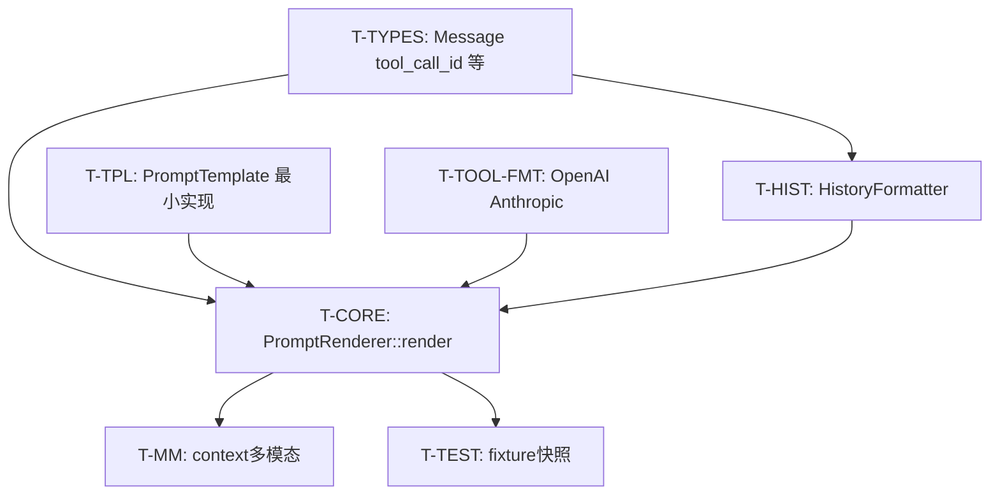

# WP1.4：PromptRenderer — 实现计划

本文档将 [phase-1-plan.md](./phase-1-plan.md) **§3 WP1.4** 细化为可执行任务、`LLMInput` → `RenderedPrompt` 契约、历史截断规则、供应商差异吸收方式与测试策略。与 [phase-1-wp1.md](./phase-1-wp1.md)（适配器只消费 `RenderedPrompt`）对齐：**本 WP 产出稳定 messages/tools_json，供应商差异主要在适配器第二遍映射（若需）**。

**文档版本**：0.1
**日期**：2026-03-31
**上游依据**：`phase-1-plan.md` v0.1（任务 1.4.1–1.4.3）

---

## 1. 目标与非目标

### 1.1 目标

| 编号 | 能力 |
|------|------|
| G1 | **`PromptRenderer::render(LLMInput, model_name)` → `RenderedPrompt`**：`messages`、`tools_json`、`rendered_text`、`total_tokens`（估算）填写完整且确定性强 |
| G2 | **历史截断**：可配置 **`max_history_messages`**（或 `max_history_turns`×2 换算规则文档化）；**始终保留** `LLMInput.system_prompt` 语义（见 §4.2） |
| G3 | **工具列表**：按 `model_name` 选择 **`ToolFormatter`**，生成 OpenAI / Anthropic 兼容的 **`tools_json`**（数组或包在对象中，与 WP1.1 请求 builder 约定一致） |
| G4 | **RAG 占位**：`LLMInput.context` 非空时，**稳定插入**（系统附录或用户前缀，二选一写死） |
| G5 | **多模态占位**：`image_data` / `audio_data` 在 `messages` 中按 **OpenAI chat 多模态 content parts** 形态嵌入（首版可只支持图像一种） |
| G6 | **单测**：给定 `LLMInput` fixture，`messages` / `tools_json` 的 JSON **快照比对**（排除 `timestamp` 或测试前清零） |

### 1.2 非目标

- 精确 tokenizer（tiktoken 级）；`total_tokens` 可用 **字符/词粗估** 或 0 + TODO。
- 动态压缩 / 摘要历史（阶段 3+ 可选）。
- 文件模板热加载监控；`FilePromptTemplate` 可实现为 **启动时读一次**。
- **Gemini** 专用 `GeminiToolFormatter` 填满（可 stub，与 `llm_client.hpp` 一致策略）。

---

## 2. 类型与头文件契约

### 2.1 现有定义（`include/agent/core/types.hpp`）

- **`LLMInput`**：`system_prompt`、`user_prompt`、`context`、`tools`、`history`、`image_data`、`audio_data`。
- **`RenderedPrompt`**：`rendered_text`、`messages`（注释为 OpenAI messages 形态）、`tools_json`、`image_data`、`audio_data`、`total_tokens`。
- **`Message`**：`role`、`content`、`tool_name`、`tool_result`、`timestamp`。

### 2.2 已知缺口（建议 T-TYPES，可与本 WP 同 PR）

| 缺口 | 影响 | 建议 |
|------|------|------|
| OpenAI **tool** 消息需 **`tool_call_id`** | 多轮 tool 无法精确回灌 | 为 `Message` 增加 `std::optional<std::string> tool_call_id` |
| **assistant** 消息含 **`tool_calls`** | 同上 | 增加 `std::optional<json> tool_calls` 或与 `content` 互斥的块列表 |
| Anthropic **system** 与 **messages** 分离 | 单一 `messages` 数组需适配器再拆 | 本 WP：`messages` **不含** system；系统内容仅来自首条逻辑；`RenderedPrompt` 可增加 `optional<json> system_blocks`（**可选**）或在 **`rendered_text` 区分** — **推荐**：增加 **`std::optional<std::string> system_override`** 到 `RenderedPrompt`（小改 types）供 AnthropicAdapter 读取；若拒绝改类型，则在 **WP1.1** 用 `messages[0] role=system` 再由适配器剥离（文档二种选一种）。 |

本文件 **默认**：优先 **扩展 `RenderedPrompt` + `Message`**，避免适配器从纯文本猜结构。

### 2.3 `include/agent/prompt_renderer/prompt_renderer.hpp`（与实现对齐）

- **`PromptRenderer` 构造**：当前为 `explicit PromptRenderer(shared_ptr<PromptTemplate>)`；需支持 **无模板** 路径（纯结构化 messages），建议增加 **默认构造** 或 **`PromptRenderer::create_default()`**，内部使用 **空模板** / 跳过 `rendered_text`。
- **`register_tool_formatter(model_pattern, formatter)`**：实现 **通配符匹配**（`gpt-*`、`claude-*`）或前缀表；未命中时 **回退 `OpenAIToolFormatter`** 并 `std::clog` 警告。
- **`set_max_tokens` / `truncate_prompt`**：阶段 1 可 **简化为仅历史条数截断**；按 token 截断标为 TODO。

---

## 3. 输出形态约定

### 3.1 `RenderedPrompt.messages`（阶段 1 基准：OpenAI 兼容数组）

推荐**统一**为 OpenAI Chat `messages` 形状，便于 **OpenAI / vLLM** 直接用；**AnthropicAdapter** 在 `build_anthropic_request` 中转换：

- `system`：一条 `{ "role":"system", "content": "..." }`，内容由 `LLMInput.system_prompt` + 可选 context 拼接规则生成。
- `user` / `assistant` / `tool`：与 OpenAI 一致；`tool` 含 `tool_call_id`、`content`（工具结果 JSON 字符串）。

**`rendered_text`**：供日志与调试；可为「system + user + history 纯文本串联」，**不作为** API 唯一来源。

### 3.2 `RenderedPrompt.tools_json`

| 供应商 | 形态 |
|--------|------|
| OpenAI | **`json` 数组**，元素为 `{ "type":"function", "function": { "name", "description", "parameters" } }` |
| Anthropic | **`tools` 数组**（Anthropic 文档字段）；由 **`AnthropicToolFormatter::format_tools`** 产出；整个数组存在 `tools_json` 中，**或** `tools_json` = `{"tools": [...]}` — **与 OpenAIAdapter / AnthropicAdapter 在 WP1.1 约定一致** |

**原则**：`format_tools` 返回的结构 **直接** 被适配器解构，避免二次猜测。

### 3.3 `LLMInput.context`（无 RAG 时的注入）

**固定策略（择一写死）**：

- **A**：追加到 system：`system_prompt + "\n\n## Retrieved context\n" + context`
- **B**：插入 user 前：`user_prompt` → `"Context:\n" + context + "\n\nQuestion:\n" + user_prompt`

推荐 **A**（system 更易缓存）；在 tracker 单行注释中写明。

---

## 4. 历史截断（1.4.1）

### 4.1 参数

| 配置项 | 建议 | 存放位置 |
|--------|------|----------|
| `max_history_messages` | 默认 20（可调） | `PromptRenderer` 成员或 `ModelConfig` / `extra_params` |
| `max_history_turns` | 若对外暴露：turn = user+assistant 一对；实现时换算为消息条数上限 | 文档公式 |

### 4.2 截断顺序（从旧到新删除）

1. **保留** `system` 逻辑（由 renderer 生成，不在 `history` 向量里的那条不计入 history 条数）。
2. **`history` 截断**：删除 **最旧**的消息，直到 `history.size() <= max_history_messages`。
3. **成对约束**：若截断落在 **assistant(tool_calls) 与后续 tool 结果** 之间，必须 **整组删除** 到上一处完整边界，避免孤儿 tool 消息。

**文档化示例**（写入实现旁注释）：

```
... user, assistant(tool_calls), tool(foo), tool(bar), assistant, user
若需截断且顶部不完整，则从 first complete "user" 开始保留。
```

### 4.3 `HistoryFormatter::truncate`

- 默认实现 **`OpenAIHistoryFormatter::truncate`**：应用 §4.2 规则。
- **`format_as_messages`**：
  - `role == "tool"` → `{"role","content","tool_call_id"}`（依赖 T-TYPES）
  - `assistant` 若有 `tool_calls` json → 原样放入

---

## 5. 任务分解与提交顺序



### T-TYPES — `types.hpp`（可选但强烈推荐）

见 §2.2；与 WP1.5 协调合并消息格式。

---

### T-TPL — `prompt_template.cpp`

| 子 ID | 工作项 |
|-------|--------|
| T-TPL.1 | `StringPromptTemplate`：`{{var}}` 替换、`extract_variables` |
| T-TPL.2 | `FilePromptTemplate`：读文件委托 `StringPromptTemplate` |

---

### T-TOOL-FMT — `tool_formatter.cpp`

| 子 ID | 工作项 |
|-------|--------|
| T-TOOL.1 | `OpenAIToolFormatter::convert_to_openai_format`：`parameters` ← `ToolMeta.schema` |
| T-TOOL.2 | `AnthropicToolFormatter::convert_to_anthropic_format`：`input_schema` 字段对齐官方 |
| T-TOOL.3 | `format_tools_as_text`：便于 `rendered_text` 调试 |

---

### T-HIST — `history_formatter.cpp`

| 子 ID | 工作项 |
|-------|--------|
| T-HIST.1 | `format_as_messages`：`Message` → `json` |
| T-HIST.2 | `truncate`：§4.2 |
| T-HIST.3 | `format_as_text`：可读摘要 |

---

### T-CORE — `prompt_renderer.cpp`

| 子 ID | 工作项 |
|-------|--------|
| T-CORE.1 | 组装顺序：`history' = truncate(...)` → `messages = [system, ...history_msgs, user]`（**当前轮 user** 是否重复若 history 末条已是 user — **规定**：`LLMInput.user_prompt` **总是**作为最后一条 user，或与 history 合并策略二选一写死） |
| T-CORE.2 | **`get_tool_formatter(model_name)`**：匹配注册表 |
| T-CORE.3 | `integrate_multimodal_input`：image → content parts |
| T-CORE.4 | `estimate_tokens`：粗估或 0 |
| T-CORE.5 | 无模板时：`rendered_text = format_as_text(history)+user_prompt` 拼接 |

**当前轮 user 规则（建议固定）**：

- **推荐**：`messages` = `system` + `format_as_messages(history)` + **最后一条** `{ "role":"user", "content": user_prompt }`；`history` **不包含**当前用户句，由循环显式维护。

---

### T-MM — context 与多模态

| 子 ID | 工作项 |
|-------|--------|
| T-MM.1 | `context` 注入 §3.3 |
| T-MM.2 | `image_data`：单图 base64 → `content: [{"type":"image_url",...}]` 或与文本 part 数组组合 |

---

### T-TEST — 单元测试

| 子 ID | 工作项 |
|-------|--------|
| T-TEST.1 | `tests/fixtures/prompt/input_*.json`：`LLMInput` 序列化快照（或 C++ 构造 + 期待 `messages`） |
| T-TEST.2 | 截断：构造 30 条 dummy history，断言保留条数与边界 |
| T-TEST.3 | `timestamp`：测试前 `Message::timestamp = 0` 或比较时剥离 |

---

## 6. 与相邻工作包

| 工作包 | 衔接 |
|--------|------|
| WP1.1 | `RenderedPrompt` 字段名与适配器一致；若增 `system_blocks` 需同步 `anthropic_adapter` |
| WP1.2 | `ToolMeta` 来自 `export_as_llm_tools`，schema 已是 OpenAI parameters 子集 |
| WP1.5 | 每轮更新 `LLMInput.history` 后再 `render()`；**不得**在 renderer 内调 LLM |

---

## 7. 风险与缓解

| 风险 | 缓解 |
|------|------|
| assistant/tool 消息不成对 | §4.2 整组删除；WP1.5 写入前校验 |
| Anthropic 与 OpenAI system 差异 | `RenderedPrompt` 扩展字段或适配器剥离；在 WP1.1 单一位置处理 |
| 模板变量缺漏 | `validate_variables` 失败时 **抛异常** 或回退纯结构化 |

---

## 8. 完成定义（WP1.4 DoD）

- [ ] `render()` 对空 history / 多轮 tool / 有 context / 有 tools 均有单测。
- [ ] OpenAI 与 Anthropic 的 `tools_json` 形态分别被 WP1.1 fixture 消费无二次转换错误（或文档写明唯一包装层级）。
- [ ] 历史截断行为有**文字说明 + 测试**。
- [ ] `Message` 工具回灌字段（`tool_call_id` 等）已落地或与 WP1.5 同步排期（禁止长期悬空）。

---

## 9. 相关链接

- [phase-1-plan.md](./phase-1-plan.md) — WP1.4 摘要
- [phase-1-wp1.md](./phase-1-wp1.md) — `RenderedPrompt` 消费方
- [phase-1-plan.md](./phase-1-plan.md) §3 WP1.5 — Agent 循环与 `history` 写入需与本 WP 当前轮 user 规则一致
- `include/agent/prompt_renderer/prompt_renderer.hpp`、`include/agent/core/types.hpp`

---

## 10. 修订记录

| 日期 | 版本 | 说明 |
|------|------|------|
| 2026-03-31 | 0.1 | 初稿：T-TYPES/T-TPL/T-TOOL/T-HIST/T-CORE/T-MM/T-TEST、截断与 messages 约定。 |
