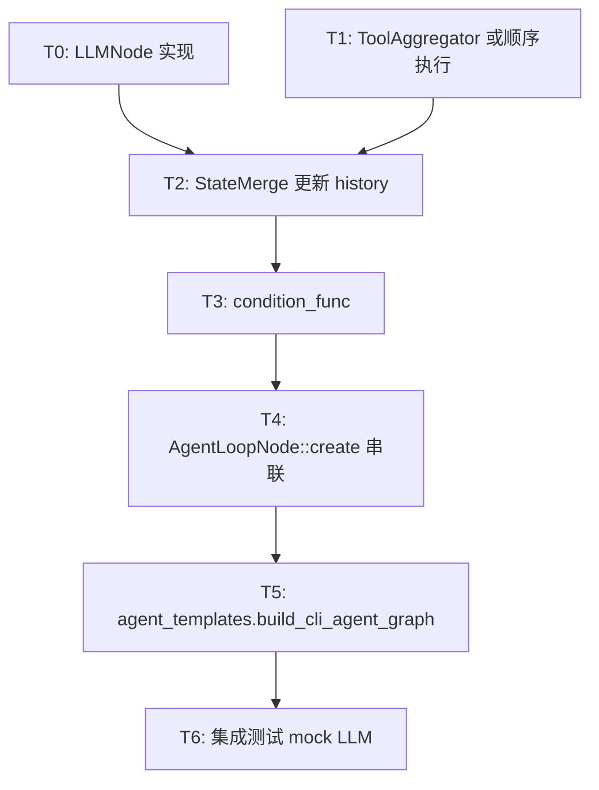

# WP1.5：Agent 循环（workflow）— 实现计划

本文档将 [phase-1-plan.md](./phase-1-plan.md) **§3 WP1.5** 细化为可执行任务、**`create_loop`** 用法、对话状态在 **key-based I/O** 下的传递方式、工具执行顺序与退出条件。与 [phase-1-wp4.md](./phase-1-wp4.md)（`LLMInput` / `history`）、[phase-1-wp1.md](./phase-1-wp1.md)（`LLMOutput`）、[phase-1-wp2.md](./phase-1-wp2.md)（`call_tool`）衔接。

**文档版本**：0.1  
**日期**：2026-03-31  
**上游依据**：`phase-1-plan.md` v0.1（任务 1.5.1–1.5.4）

---

## 1. 目标与非目标

### 1.1 目标

| 编号 | 能力 |
|------|------|
| G1 | **单图闭环**：`LLM` → **解析/分发** → **工具执行** → **历史合并** → 条件判断 → 若继续则下一轮 `LLM`，否则退出 |
| G2 | **循环驱动**：使用 `workflow::GraphBuilder::create_loop`（见 §3），由 Workflow 内部建立 Taskflow 4.x conditional-task 回边 |
| G3 | **终止条件**：`LLMOutput::tool_calls` **为空** 或 **`iteration >= max_iterations`**（`AgentConfig::max_iterations`）或 **`is_final` 与无 tool** 组合（见 §4.3） |
| G4 | **工具策略**：首版 **顺序执行** 全部 `CallSpec`；`ToolCallNode::create_parallel` 保留但 CLI 默认不走 |
| G5 | **状态传递**：每轮后 **`std::vector<Message> history`** 与 **`iteration` 计数** 对下一轮 `LLMInput` 可见（通过节点输出键 + aggregator，见 §5） |
| G6 | **工厂**：`build_cli_agent_graph`（或 `AgentLoopNode::create`）注入 `LLMClient`、`ToolBus`、`PromptRenderer`、可选 `stream_callback` |
| G7 | **可测**：mock `LLMClient` 固定 **2 次 tool + 1 次 final**；`builder.dump` 可读；断言最终 `final_answer` / 工具调用次数 |

### 1.2 非目标

- 知识库 / 向量检索真实节点（`enable_knowledge_base` 阶段 1 **可 false**；节点占位即可）。
- `MemoryStore` 持久化跨进程（阶段 1 可用 **内存 `vector<Message>`** 即可，`MemoryStore` 可薄包装）。
- 并行工具与复杂 DAG 调度（接口预留，默认关闭）。
- **取消传播** 贯穿 Taskflow（与 WP1.6 协同，后续可增强）。

---

## 2. 现有头文件与配置

| 符号 | 位置 | WP1.5 职责 |
|------|------|------------|
| `AgentConfig` | `types.hpp` | `max_iterations`、`max_tool_calls_per_iteration`、`system_prompt`、`model_config` |
| `LLMNode::create` | `llm_node.hpp` | 从 `input_specs` 组 `LLMInput`，调 `LLMClient::invoke`，输出 `LLMOutput` 或拆键 |
| `ToolCallNode::create_single` / `create_parallel` | `tool_call_node.hpp` | 单工具 / 并行；本阶段主路径 **自写顺序聚合节点** 或多次 `create_single` 链式（见 §6） |
| `AgentLoopNode` | `agent_loop_node.hpp` | 封装 `create_loop`，显式返回本轮状态并配置 feedback |
| `ReActTemplate` | `graph_executor.hpp` | 可与 `agent_templates` 合并或委托 `AgentLoopNode` |

---

## 3. `create_loop` 用法（当前约定）

参考 `workflow/include/workflow/nodeflow.hpp`：

- **选用接口**：`create_loop(name, input_specs, body, condition, exit, output_keys, options)`。
- **`input_specs`**：循环入口依赖的源节点（例如 `SystemPrompt`、`UserInput`、**`AgentState` 源**），用于把初始 `query` 与 **可变的 `history` / `iteration`** 注入循环体。
- **`body(inputs, IterationContext) -> ValueMap`**：返回本轮 `next_agent_state`、`is_final`、`final_answer` 和 `llm_output`，不得通过共享可变闭包旁路传递。
- **`condition(outputs, IterationContext) -> LoopDecision`**：直接读取刚提交的 body outputs。
- **`LoopOptions::feedback`**：配置 `next_agent_state -> agent_state`，作为下一轮显式输入。
- **`exit`**（可选）：将最后一次循环体输出映射为对外结果；所有输出只在终态发布一次。

旧 `create_loop_decl` 只用于源码兼容。其 GraphBuilder callback 版本没有显式 body 输出端口，运行时会拒绝；不得用于新 Agent 图。

---

## 4. 循环条件与 `LLMOutput` 优先级（1.5.1）

### 4.1 输入

- 从循环体输出 `any`  map 读取上一轮 **`LLMOutput`**（或等价展开键：`has_tool_calls`、`tool_calls_json`）。

### 4.2 继续条件（返回 0）

以下 **同时**满足：

1. `iteration < AgentConfig::max_iterations`（注意：`iteration` 在体执行后递增，语义需与 condition 读取点一致，见 §5.2）。
2. `tool_calls.size() > 0`。
3. （可选）`tool_calls.size() <= max_tool_calls_per_iteration`，超出则 **截断** 或 **拒执行并退出** — 首版推荐 **截断并打日志**。

### 4.3 退出条件（返回非 0）

- `tool_calls` 为空 **且**（`is_final == true` **或** `final_answer` 非空，择一或与 WP1.1 对齐）。
- 或达到 `max_iterations`（**安全退出**）：最后一条助手消息可为「达到最大轮次」的说明，由 LLM 或框架拼接。

### 4.4 `tool_calls` 与 `final_answer` 同时存在

若解析层出现二者皆有：**优先按 tool 路径继续**（与常见 Chat Completions 行为一致）；并在实现注释中写明。

---

## 5. 状态桶：`history` 与 `iteration`

### 5.1 推荐模式：**`shared_ptr<AgentThreadState>`**

定义 **内部结构**（可放在 `agent_loop_node.hpp` 或 `types.hpp` 旁 `internal`）：

```cpp
struct AgentThreadState {
    std::vector<Message> history;
    int iteration = 0;  // 已完成的外层循环次数，或“LLM 调用次数”，二选一写死
    std::string last_error;
};
```

- **当前推荐方式**：body 从 `agent_state` 输入克隆本轮 snapshot，归约后输出 `next_agent_state`；Workflow feedback 将其映射回下一轮 `agent_state`。
- **禁止方式**：在 body/condition/exit 之间捕获共享可变 `AgentThreadState`。该模式无法隔离并发 session，也无法支持 checkpoint resume。

**与 [phase-1-wp4.md](./phase-1-wp4.md) 对齐**：`LLMInput.history = state.history`；`LLMInput.user_prompt` 仅为**当前用户问题**（首轮来自 `UserInput`，后续轮可为空串若完全依赖 history — **建议**每轮仍把「原始任务」保留在 history 外的 `state.initial_user_message`，避免截断丢意图）。

### 5.2 `iteration` 语义（择一写死）

| 方案 | 含义 |
|------|------|
| **A** | `iteration` = 已完成 **LLM 调用次数**；condition 在体后读取，体尾 `++iteration` |
| **B** | `iteration` = **工具轮次数**；仅在有 tool 时递增 |

推荐 **A**，与 `max_iterations` 直观一致（防无限 LLM）。

### 5.3 重试、重启与恢复

| 操作 | attempt | history 提交 | 适用场景 |
| --- | ---: | --- | --- |
| `Retry` | 递增 | 当前未提交 delta 不进入 session | 同一子任务瞬时失败 |
| `Restart` | 新 attempt | 从模块入口重新建立隔离状态 | 放弃失败实例 |
| `Resume` | 保持 checkpoint 身份 | `ResumeFromCheckpoint` 幂等合并未提交后缀 | 中断恢复 |

`merge_react_session_state(..., ResumeFromCheckpoint)` 接受已提交 checkpoint 的重复提交且
不产生重复消息。工具调用必须保留 `tool_call_id`；具有外部副作用的工具不得因恢复而
无条件重放。

### 5.4 并发 session 与子流程

同一个 `GraphBuilder` 不允许重叠运行。并发 agent session 使用不同 builder，共享同一
Taskflow executor；每轮 state snapshot、iteration 与 final output 互相隔离。

静态注册的子 agent/subflow 使用 `SubflowNode`。`SubflowRequest` 携带父/子 run identity、
attempt、取消、deadline、最大深度、迭代和工具预算；`SubflowResult` 返回结构化
`ok/outputs/error/usage`。动态生成任意图不属于该接口。一个 child 失败时，其他 child
已经提交的结果保持可用。

---

## 6. 工具执行：顺序策略（1.5.2）

### 6.1 首选实现：**`ToolAggregator` 节点**

单节点 `input_specs`：`{"PrevLLM","llm_output"}`，functor 内：

1. 读取 `LLMOutput`，提取 `tool_calls`。
2. `for (CallSpec& c : tool_calls)`：`toolbus->call_tool(c.name, c.arguments).get()`（或异步收集再 wait）。
3. 组装 **`std::vector<Message>`**：每条 tool 一条 `Message{role:"tool", tool_name, tool_result, tool_call_id?}`（字段与 [phase-1-wp4.md](./phase-1-wp4.md) T-TYPES 一致）；assistant 一条带 `tool_calls` json（若协议需要）。
4. 输出键：`merged_messages`（`vector<Message>` 或单轮增量）、`tool_error`（optional）。

**避免**：在阶段 1 为每个 tool 动态 `create_subtask` 建不同子图（复杂度超 WP）；留 **WP1.5+**。

### 6.2 次选：**链式 `ToolCallNode::create_single`**

对每个 `CallSpec` 建节点需 **静态预知 arity**，不适合变长 tool 列表；故 **不推荐** 作为默认。

### 6.3 并行接口

保留 `ToolCallNode::create_parallel` 供配置 `parallel_tools=true` 时在 **后续迭代** 切换；本 WP DoD **不要求**跑并行路径。

---

## 7. 节点级任务分解



### T0 — `LLMNode`（`llm_node.cpp`）

| 子 ID | 工作项 |
|-------|--------|
| T0.1 | `extract_llm_input`：`system_prompt`、`query`/`user_prompt`、`history`、`tools`（来自 `ToolList` 源）、`context` |
| T0.2 | 调 `llm_client->invoke` 或 `invoke_with_rendered_prompt`（若前序有 `PromptRenderer` 节点则二选一架构固定） |
| T0.3 | 输出：`llm_output`（`LLMOutput` 或 `std::any`）、可选 `stream` 侧路仅回调 |

### T1 — 工具执行（`tool_call_node.cpp` 或新 `agent_tool_runner.cpp`）

| 子 ID | 工作项 |
|-------|--------|
| T1.1 | 实现 §6.1 顺序 `call_tool` |
| T1.2 | 单测：mock `ToolBus`，两个 `CallSpec` 顺序执行顺序可查 |

### T2 — `StateMerge`（可在 `agent_loop_node.cpp` 内）

| 子 ID | 工作项 |
|-------|--------|
| T2.1 | 将 assistant 文本 / `tool_calls` / tool `Message` 追加到 `state.history` |
| T2.2 | 更新 `iteration`（§5.2） |
| T2.3 | 输出：下一跳 LLM 所需的 **`history` + `llm_input` 摘要键** |

### T3 — `check_loop_condition`（`AgentLoopNode::check_loop_condition`）

| 子 ID | 工作项 |
|-------|--------|
| T3.1 | 实现 §4 |
| T3.2 | 单元测试：构造 fake `outputs` map |

### T4 — `AgentLoopNode::create`

| 子 ID | 工作项 |
|-------|--------|
| T4.1 | `build_loop_body` 内：`body_builder_fn` 注册 T0→T1→T2 节点及 `input_specs` 依赖 |
| T4.2 | `MemoryStore` / `VectorStore`：**若 nullptr**，跳过相关源节点；`AgentConfig::enable_*` false 时一致 |
| T4.3 | `build_exit_handler`：对外输出 `final_answer`（最后一轮 `LLMOutput.final_answer` 或 history 尾部） |

### T5 — `agent_templates.cpp` / `cli_agent_graph.cpp` / `GraphExecutor`

| 子 ID | 工作项 |
|-------|--------|
| T5.1 | **`build_cli_agent_graph`**（[graph_executor.hpp](../include/agent/graph_executor.hpp)）：`AgentWorkflowDeps`（`llm` + `toolbus`）+ `AgentConfig` + `shared_ptr<AgentThreadState>` 或 `user_query` 重载；内置源节点名 **`SystemPrompt` / `UserInput` / `AgentState`**，输出键同 [loop_io_keys.hpp](../include/agent/internal/loop_io_keys.hpp)；默认 Loop 名 **`AgentLoop`**。`PromptRenderer` 由调用方在 `LLMClient` 上配置。 |
| T5.2 | **`GraphExecutor::build_agent_workflow`** 委托 `build_cli_agent_graph`；**`ReActTemplate::build_react_loop`** 同委托；**`ReActTemplate::build(json)`** 抛错并提示使用上述入口（JSON 无法表达 `shared_ptr` 运行时依赖）。 |
| T5.3 | 挂 **`Sink`**（WP1.6）：仍可由调用方在图外加 `create_any_sink`，依赖 `AgentLoop` 的 `final_answer` / `next_agent_state` 等键。 |
| T5.4 | **终端 Sink 可选 API**：`CliAgentTerminalSinkOptions` + **`build_cli_agent_graph_with_terminal_sink`**（及 `GraphExecutor::build_agent_workflow(..., sink)`）一次构图即订阅上述键并向 `std::function<void(const json&)>` 交付终稿摘要；详见 [phase-1-wp6.md](./phase-1-wp6.md) §5.1。 |

### T6 — 测试

| 子 ID | 工作项 |
|-------|--------|
| T6.1 | Mock `ModelAdapter`：`invoke_with_rendered` 第 1/2 次返回 `tool_calls`，第 3 次返回纯文本 |
| T6.2 | 小图：dump + 运行后断言 `state.iteration` 与 tool 调用次数 |

---

## 8. 与 WP1.1 / WP1.4 的衔接

| 项目 | 约定 |
|------|------|
| **渲染** | 每轮 LLM 前：`PromptRenderer::render(LLMInput{..., history})`；可在 `LLMNode` 内或独立 `RenderNode` |
| **`tool_call_id`** | WP1.1 返回的 `CallSpec` 是否含 id：若无，WP1.5 生成 **UUID 或顺序 id** 填入 `Message`，与 WP1.4 一致 |
| **Tool 列表** | 每轮从 `toolbus->export_as_llm_tools()` 注入 `LLMInput.tools`（源节点或 LLMNode 内拉取） |

---

## 9. 风险与缓解

| 风险 | 缓解 |
|------|------|
| 循环体 **输出键** 与 condition **读键** 不一致 | 单一常量头 `loop_io.hpp` 定义 key 名字符串 |
| `std::any_cast` 失败 | 节点内 catch → `state.last_error` + 退出循环 |
| `max_tool_calls_per_iteration` 与模型行为不符 | 截断 + 日志；评测用例固定小工具集 |
| Memory / Vector 强依赖阻塞编译 | `nullptr` 默认 + `enable_*` false |

---

## 10. 完成定义（WP1.5 DoD）

- [ ] `create_loop_decl` 子图：**LLM → 工具 → 合并 → condition** 可运行。
- [ ] 顺序工具执行；mock 路径 **2 轮 tool + 1 轮 final** 通过。
- [ ] `AgentConfig::max_iterations` 生效；超限退出可观测。
- [ ] `history` 可被 WP1.4 渲染消费（含 tool 消息，字段与 WP1.4 T-TYPES 一致）。
- [x] `build_cli_agent_graph` / `GraphExecutor::build_agent_workflow` 已实现（WP1.6 可直接调用构图）。
- [ ] 图 `dump` 可读，依赖全部由 `input_specs` 推断。

---

## 11. 相关链接

- [phase-1-plan.md](./phase-1-plan.md) — WP1.5 摘要  
- [phase-1-wp4.md](./phase-1-wp4.md) — history / 当前轮 user  
- [phase-1-wp2.md](./phase-1-wp2.md) — `call_tool` 返回 JSON  
- [phase-1-wp1.md](./phase-1-wp1.md) — `LLMOutput`  
- `workflow/include/workflow/nodeflow.hpp` — `create_loop_decl`  
- `include/node/agent_loop_node.hpp`、`llm_node.hpp`、`tool_call_node.hpp`

---

## 12. 修订记录

| 日期 | 版本 | 说明 |
|------|------|------|
| 2026-03-31 | 0.1 | 初稿：create_loop_decl、状态桶、顺序 ToolAggregator、条件与 DoD。 |
