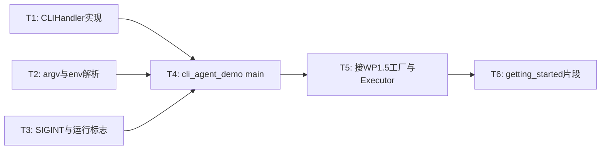

# WP1.6：CLI — 实现计划

本文档将 [phase-1-plan.md](./phase-1-plan.md) **§3 WP1.6** 细化为可执行任务、进程生命周期、与 **WP1.5 图** 的衔接方式及日志/信号策略。与 [phase-1-wp5.md](./phase-1-wp5.md)（`build_cli_agent_graph`、`stream_callback` 注入）一致。

**文档版本**：0.2
**日期**：2026-04-01
**上游依据**：`phase-1-plan.md` v0.1（任务 1.6.1–1.6.3）；UI 阶段划分见 `plan-detailed.md`

---

## 1. 目标与非目标

### 1.1 目标

| 编号 | 能力 |
|------|------|
| G1 | **可执行入口**：`cli_agent_demo`（或约定名）`main`：解析 **argv**、环境变量、可选 **单行 REPL**（`getline`） |
| G2 | **单次模式**：支持 **`--prompt "..."` / `-p`**：执行一轮用户任务后退出（便于脚本与 CI） |
| G3 | **流式输出**：将 **`CLIHandler::handle_stream_token`**（或等价 lambda）接到 **WP1.1 `LLMClient` 的 `stream_callback`**；`std::cout` **无缓冲或及时 flush** |
| G4 | **工具/诊断**：工具调用 **开始/结束**、`ToolBus` 错误摘要输出到 **`std::clog`**（或受日志级别控制） |
| G5 | **Ctrl+C**：注册 **`SIGINT`**（及 **SIGTERM** 如适用）：设置 **`std::atomic<bool> shutdown_requested`**；主循环与即将阻塞的 HTTP 调用侧**合作式**检查（完整中断依赖 WP1.1 超时，见 §6） |
| G6 | **日志级别**：**`--verbose` / `-v`** 或环境变量 **`AGENT_LOG_LEVEL`**（`error|warn|info|debug`）；默认 `info` |
| G7 | **跑图**：构造 `GraphBuilder` → [phase-1-wp5.md](./phase-1-wp5.md) 工厂 → **`tf::Executor::run`**；正确退出码（0 成功，非 0 可配置） |

### 1.2 非目标

- **TUI**（readline、历史、语法高亮、**ncurses 等全屏终端 UI**）：阶段 1 不做；见 **§1.3**。
- **ImGui / Web**：`ImGuiHandler` / `WebHandler` 阶段 1 **不实现业务**，仅 **stub 或保留接口**，与 [phase-1-plan.md](./phase-1-plan.md)、[plan-detailed.md](./plan-detailed.md) 中「阶段 2 富界面」一致。
- **子进程隔离** CLI（无需 `nsenter`）。
- 与 **WP1.3 MCP** 强耦合的专用子命令（若需 `--mcp-stdio` 见 [phase-1-wp3.md](./phase-1-wp3.md)，本 WP 仅 **透传 argv 给配置层** 可选）。

### 1.3 后续阶段（UI）：ImGui 与 TUI

阶段 1 验收以 **stdio 流式 CLI**（`CLIHandler` + `cli_agent_demo`）为准。**不**在 WP1.6 引入 ImGui、osgEarth、ncurses 等大依赖。

| 方向 | 阶段 | 说明 |
|------|------|------|
| **ImGui**（及可选 ImPlot / 第三方宿主） | **阶段 2** | 实现 `ImGuiHandler`（或等价适配层），与 `UIHandler` 事件模型对齐；流式 token / 终稿 / 错误与 §4 去重约定一致。 |
| **TUI**（如 **ncurses**、分栏终端 UI） | **阶段 2** | 与「简单 REPL」区分；可作为独立可执行目标，复用 `LLMClient` / 图工厂，**不**替代阶段 1 的 `cli_agent_demo` DoD。 |
| **Web** | **阶段 2**（与 [plan-detailed.md](./plan-detailed.md) §5、§7 一致） | `WebHandler`、HTTP/SSE 消费侧等。 |

阶段 1 的 **预留**：`include/agent/ui/ui_manager.hpp` 中 **`UIHandler` 虚接口**、`ImGuiHandler` / `WebHandler` 声明或 stub，保证阶段 2 接入时无需改动核心图与 `CLIHandler` 契约。

---

## 2. 与现有头文件契约

### 2.1 `include/agent/ui/ui_manager.hpp`

| 类型 | WP1.6 要求 |
|------|------------|
| **`UIHandler`** | 接口保持；阶段 1 **仅必须**完整实现 **`CLIHandler`** |
| **`CLIHandler`** | 实现 `handle_stream_token`（加锁写 `ostream`）、`handle_final_result`、`handle_error`；`format_output` 统一前缀/换行策略 |
| **`UIManager`** | **最小实现**：单会话 CLI 可 **不用** `UIManager`（仅 `CLIHandler` + lambda）；若实现 `UIManager`：`register_cli_handler` + `stream_token(session, token)` 在阶段 1 可用 **固定 `session_id`**（如 `"default"`） |
| **`ImGuiHandler` / `WebHandler`** | **阶段 1**：stub 或仅保留接口；**阶段 2** 再实现（见 §1.3） |

### 2.2 产出文件（与 plan 一致）

- `src/ui/cli_handler.cpp` — **`CLIHandler` 完整实现**
- `src/ui/ui_manager.cpp` — **`UIManager` 薄实现** 或标记「CLI-only 路径可跳过」并在 `CMakeLists` 不报错
- `examples/cli_agent_demo.cpp` — **`main`、参数解析、REPL、跑图**

---

## 3. 命令行界面（1.6.1）

### 3.1 建议参数表

| 选项 | 长格式 | 说明 |
|------|--------|------|
| 用户文本 | `-p`, `--prompt` | 单轮查询；与 REPL 互斥时 **优先单次** |
| 服务商 | `--provider` | 覆盖 `AGENT_LLM_PROVIDER` |
| 详细日志 | `-v`, `--verbose` | 等同 `AGENT_LOG_LEVEL=debug` |
| 帮助 | `-h`, `--help` | 打印用法与必填 env |
| Mock | `--mock` | 与 [phase-1-plan.md](./phase-1-plan.md) WP1.7 对齐：注册 mock LLM/图（实现可后置，本 WP **预留解析**） |
| 最大轮次 | `--max-iterations` | 覆盖 `AgentConfig::max_iterations`（若工厂支持） |

** stdin**：无 `-p` 且 **isatty(stdin)** → REPL；**管道输入** → 读单行或全文作首轮 user（择一写死，推荐 **读首行**）。

### 3.2 REPL 行为

- 提示符：`"> "` 或可配置。
- **空行**：跳过或退出（推荐 **`:quit` / EOF 退出**，空行不重发）。
- **多轮**：每轮构建 **`LLMInput.user_prompt`**，**`history` 由图内状态维护**（WP1.5），CLI 只负责读入新 utterance 并触发一次图运行（或单图多源 — 由 WP1.5 工厂决定 **一单图多轮** vs **每轮重建图**）。

**推荐（阶段 1）**：**每用户行触发一次完整 `executor.run`**，图内 **Agent 循环** 处理 tool；**下一轮**将上轮 history 通过 **shared state**（WP1.5）保留。即：**一次 run = 一次用户轮次**（含内部 tool 循环）。

---

## 4. Sink 与流式（1.6.2）

### 4.1 `stream_callback` 形态

```cpp
auto stream_cb = [&cli](std::string_view tok) {
    cli.handle_stream_token(tok);
};
```

- 传递给 **`LLMNode::create`** 或 **`LLMClient::invoke`**（与 WP1.5 最终接线一致）。
- **`handle_stream_token`**：`output_mutex_` 保护下 `output_stream_ << token << std::flush`（避免多线程交错断裂）。

### 4.2 工具日志

| 事件 | 输出 | 流 |
|------|------|-----|
| `call_tool` 开始 | `[tool] name=...` | `clog` |
| `call_tool` 结束 | `[tool] name=... done` 或错误摘要 | `clog` |
| 校验失败 | 同 WP1.2 `code` | `clog` / `handle_error` |

### 4.3 最终结果

- **`handle_final_result(json)`**：pretty-print 可选；至少打印 `final_answer` 字段或整段 JSON。
- 若图 **Sink 节点** 已打印最终文本，避免 **重复输出** — 约定：**仅一处**负责用户可见终稿（推荐 **Sink → CLIHandler**，LLM stream 仅增量）。
- **`build_cli_agent_graph_with_terminal_sink`**（[graph_executor.hpp](../include/agent/graph_executor/graph_executor.hpp)）产出的 JSON 含 `final_answer`、`iteration`、`history_size`，可直接传入 `handle_final_result` 或由 lambda 转发，与上述去重约定一致。

### 4.4 反“陷入形式”工程兜底（Anti-loop Guard）

在真实工具链（尤其 MCP 工具）下，LLM 可能出现「同一轮内反复选择同一工具与同一参数」或「输出无进展直到耗尽 `max_iterations`」的退化行为。阶段 1 增加**工程级兜底**，保证 CLI 不会在无意义循环中消耗大量轮次。

- **Repeat-tool guard（默认开启）**：同一 iteration 内，相同 `(tool_name + arguments)` **只允许调用 1 次**；重复将触发 guard 并**优雅结束**本轮 AgentLoop。
- **No-progress guard（默认关闭）**：保留开关与阈值，待线上案例充分验证后再默认开启（避免误伤轮询类工具）。

#### 环境变量

| 变量 | 默认 | 说明 |
|------|------|------|
| `AGENT_LOOP_GUARD_REPEAT_TOOL_IN_ITERATION` | `1` | `0/1`，关闭/开启 iteration 内重复工具兜底 |
| `AGENT_LOOP_GUARD_TEXT_TRUNC` | `200` | guard 诊断信息中的参数/键截断长度 |
| `AGENT_LOOP_GUARD_NO_PROGRESS` | `0` | `0/1`，关闭/开启无进展兜底（阶段 1 默认关闭） |
| `AGENT_LOOP_GUARD_NO_PROGRESS_K` | `3` | 无进展连续次数阈值（阶段 1 预留） |

#### 终稿 JSON 兼容扩展字段

`build_cli_agent_graph_with_terminal_sink` 的 sink 回调 JSON 在原有字段基础上追加（不破坏既有消费者）：
`guard_triggered`（bool）、`guard_reason`（string）、`guard_details`（string）。

---

## 5. 与图连接（1.6.3）

### 5.1 启动序列

1. 解析 argv / env。
2. 构造 **`LLMClient`、`ToolBus`、`PromptRenderer`**（或 `from_env()` 工厂）。
3. **`toolbus` 注册 demo 工具**（示例/测试用）。
4. **`build_cli_agent_graph`** 或（推荐在有单一终稿出口时）**`build_cli_agent_graph_with_terminal_sink`**：`GraphBuilder builder(...)`，注入 **`SystemPrompt` / `UserInput` 源** 与 **stream_callback**；后者在 Loop 后追加 Sink，将结构化 JSON 交给回调（可与 §4.3 的 `handle_final_result` / CLIHandler 对齐，并注意与 stream 去重）。
5. **`tf::Executor executor`**；`executor.run(g)` 或项目所用 **workflow API**（以现有 `simple_agent.cpp` 为准演进）。

### 5.2 `UserInput` 源

- 每 REPL 轮：`create_any_source("UserInput", {{ "query", user_line }})` **重建源** 或 **动态更新**（若 workflow 支持；不支持则 **每轮新建 builder + run** — 性能可接受于阶段 1）。

**文档化**最终选定方式，避免双轨。

---

## 6. 信号与关闭（Ctrl+C）

| 步骤 | 说明 |
|------|------|
| S1 | `signal(SIGINT, handler)`：handler 仅置位 `shutdown_requested = true`（异步信号安全：用 `sig_atomic_t` 或原子写） |
| S2 | REPL `getline` 循环顶部检查；若 true → 打印 `\n[interrupt]` 并 `break` |
| S3 | **图运行中**：Executor **无通用取消**时，依赖 WP1.1 **HTTP 超时**结束阻塞；本 WP **文档**该限制 |
| S4 | 退出前 **`flush` cout/clog** |

**SIGTERM**：非必须；服务器场景阶段 2 再强化。

---

## 7. 日志级别

| 级别 | 行为 |
|------|------|
| `error` | 仅 `handle_error` 与致命 |
| `warn` | 工具失败、重试 |
| `info` | 每轮 user、最终答案一行摘要 |
| `debug` | 请求体摘要（**禁止默认打印 API key**）、图 dump 可选 |

实现：小型 **`AgentLogger`** 函数或宏，或 `std::clog` + 级别过滤。

---

## 8. 任务分解与顺序



| ID | 任务 | 产出 |
|----|------|------|
| T1 | `CLIHandler` 全方法 + 线程安全写流 | `cli_handler.cpp` |
| T2 | `parse_cli_args` 或手工 `argc/argv`；`--help` 文本 | `cli_agent_demo.cpp` 或 `cli_args.hpp` |
| T3 | `SIGINT` 合作式退出 | `cli_agent_demo.cpp` |
| T4 | REPL + `-p` 单次 | `cli_agent_demo.cpp` |
| T5 | 调用 `build_cli_agent_graph`、`executor.run` | 同上与 WP1.5 |
| T6 | `AGENT_*` 必填表交给 `getting_started.md`（可与 WP1.7 同 PR） | 文档 |

---

## 9. 与相邻工作包

| 工作包 | 衔接 |
|--------|------|
| WP1.5 | 工厂签名、单轮/多轮状态、`stream_callback` 传入点 |
| WP1.1 | 无取消时 SIGINT 仅停止「下一圈」 |
| WP1.7 | `--mock`、退出码、CTest 启动 `cli_agent_demo`（[WP1.7 现为 BACKLOG](./phase-1-wp7.md)，计划在 WP1.8 后完整收口） |

---

## 10. 风险与缓解

| 风险 | 缓解 |
|------|------|
| `cout` 与 `clog` 锁定顺序死锁 | 单锁顺序：**始终先** `token_mutex` 再其他；或 token 仅用 cout |
| 每轮重建图成本高 | 阶段 1 可接受；后续缓存 `Graph` |
| 管道无 TTY 无限阻塞读 | `getline` 前检测 EOF |

---

## 11. 完成定义（WP1.6 DoD）

- [ ] `-h`、`-p`、REPL 至少一种路径可演示。
- [ ] 流式 token 在终端实时可见（真模型或 mock）。
- [ ] SIGINT 后进程在合理时间内退出（允许等待当前 HTTP 超时）。
- [ ] `cli_agent_demo` 已加入 `CMakeLists.txt` 为可执行目标。
- [ ] 工具调用在 `clog` 可见（默认 `info` 及以上）。

---

## 12. 相关链接

- [phase-1-plan.md](./phase-1-plan.md) — WP1.6 摘要
- [phase-1-wp5.md](./phase-1-wp5.md) — Agent 循环与工厂
- [phase-1-wp1.md](./phase-1-wp1.md) — 流式回调
- [phase-1-wp3.md](./phase-1-wp3.md) — 可选 `--mcp-*`
- `include/agent/ui/ui_manager.hpp`、`examples/simple_agent.cpp`

---

## 13. 修订记录

| 日期 | 版本 | 说明 |
|------|------|------|
| 2026-03-31 | 0.1 | 初稿：CLIHandler、argv、REPL、信号、与图接线、DoD。 |
| 2026-04-01 | 0.2 | §1.3：ImGui / TUI / Web 明确为阶段 2；阶段 1 仅预留 `UIHandler` 与 stub。 |
