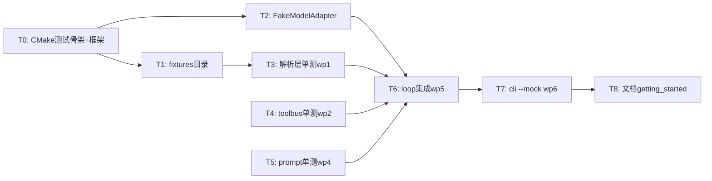

# WP1.7：示例与测试 — 实现计划

> **状态：BACKLOG（排期延后）**  
> **当前策略**：先完成 [WP1.8](./phase-1-wp8.md)（Skills 最小闭环并接入图与 ToolBus），再实施本 WP 的 **完整** 测试矩阵——包括 **无网/CI 默认路径**、`ctest` 标签、Mock LLM/HTTP 假服务，以及 **Skills 相关**单测与集成测（L1 索引、路由、L2 注入、`run_skill_script` jail、**多根目录合并扫描**等，与 wp8 §G6 互为补充）。  
> **说明**：`cli_agent_demo` 与 **`cli_agent_skills_demo`**（默认合并 `~/.cursor/skills` + `~/.cursor/skills-cursor`，见示例源码）可作 **手测全链路 / 真实 Cursor 技能布局**验收；WP1.7 backlog **仍须**交付可重复 CI，**不能**仅以手测代替自动化验收。

本文档将 [phase-1-plan.md](./phase-1-plan.md) **§3 WP1.7** 细化为 **CTest 布局、依赖选型、Mock LLM 策略、分模块单测与集成测、CI 约束及文档义务**。仓库在 `BUILD_TESTING` 下已有多份 `tests/test_*.cpp` 与夹具；本 WP 的 backlog 条目 focus 在：**默认无网不 SKIP**、`no_network` 标签化 CI、`--mock` 与 **Skills 落地后**的回归覆盖面。

**文档版本**：0.3  
**日期**：2026-04-03  
**上游依据**：`phase-1-plan.md` v0.3（任务 1.7.1–1.7.4）；排期与 WP1.8 联动见同文件 §4 里程碑 M6/M7

---

## 1. 目标与非目标

### 1.1 目标

| 编号 | 能力 |
|------|------|
| G1 | **`ctest --output-on-failure`** 在本地与 CI 中 **零网络**（或可选联网 job）可重复通过 |
| G2 | **单测**：覆盖 [phase-1-wp4.md](./phase-1-wp4.md) PromptRenderer、[phase-1-wp2.md](./phase-1-wp2.md) ToolBus/schema、[phase-1-wp1.md](./phase-1-wp1.md) OpenAI/Anthropic 解析与拼接、（可选）[phase-1-wp3.md](./phase-1-wp3.md) MCP JSON-RPC |
| G3 | **Mock LLM**：**进程内 fake `ModelAdapter`** 和/或 **本地 `httplib::Server` 假 API** 二选一或组合 |
| G4 | **集成测**：[phase-1-wp5.md](./phase-1-wp5.md) 循环状态机（2×tool + 1×final）与/或 [phase-1-wp6.md](./phase-1-wp6.md) `cli_agent_demo --mock`；Skills 场景需覆盖 **`cli_agent_skills_demo` 或等价图路径**（含 Cursor 双目录合并、L2 注入、`run_skill_script` + allowlist） |
| G5 | **文档**：[getting_started.md](./getting_started.md) 中 **`cli_agent_demo`、构建测试、`AGENT_*` 必填 env** |
| G6 | **`tools/run_tests.sh`** 继续可用：触发 `ctest`（可设 `BUILD_TESTING=ON`） |

### 1.2 非目标

- 负载与模糊测试。
- 对 **真实** OpenAI/Anthropic 账号的契约测试（留 **手动 nightly** 或阶段 2）。
- **覆盖率** 门禁（可选后续 `gcov`/`llvm-cov`）。

---

## 2. CMake 与框架选型

### 2.1 建议

| 方案 | 优点 | 缺点 |
|------|------|------|
| **Catch2 v3**（`FetchContent`） | 单测可执行文件 + 宏简洁 | 增加首次 configure 时间 |
| **GoogleTest** | 生态大 | 依赖更重 |
| **仅 `assert` + `add_test`** | 零第三方 | 报告弱，不利于扩展 |

**推荐**：**Catch2 v3** 或 **GoogleTest** 二选一；在 `mcp-spec-tracker` 式短文档 **`tests/README.md`**（可选）中写明版本锁定。

### 2.2 `CMakeLists.txt` 变更要点

| 项 | 说明 |
|----|------|
| `option(AGENT_BUILD_TESTS ...)` | 默认 `ON` 当 `BUILD_TESTING`；或与 `BUILD_TESTING` 等同 |
| `FetchContent_Declare/Populate` | Catch2 / GTest |
| `add_executable(test_toolbus ...)` 等 | 每个可执行 **少量** 用例文件，链接 `agent_framework` |
| `add_test(NAME toolbus COMMAND test_toolbus)` | **LABELS** `unit`、`no_network` |
| `target_compile_definitions` | 测试专用 `AGENT_TEST_DATA_DIR` 指向 `CMAKE_SOURCE_DIR/tests/fixtures` |

**注意**：`tools/run_tests.sh` 使用 `agent_framework/build`；需在 **Debug/Release** 构建时均 `-DAGENT_BUILD_TESTS=ON`（或文档说明）。

---

## 3. 目录结构

```
agent_framework/
├── tests/
│   ├── fixtures/           # JSON、文本样例（脱敏）
│   │   ├── llm/openai_*.json
│   │   ├── llm/anthropic_*.json
│   │   └── toolbus/
│   ├── mock/
│   │   ├── mock_llm_server.cpp    # 可选：httplib::Server 实现，链接到 test 可执行文件
│   │   └── fake_model_adapter.hpp # 进程内 stub
│   ├── test_toolbus.cpp
│   ├── test_prompt_renderer.cpp
│   ├── test_openai_adapter.cpp
│   ├── test_anthropic_adapter.cpp
│   ├── test_agent_loop_smoke.cpp
│   └── test_cli_mock.cpp          # 可选：main 里 spawn cli_agent_demo
└── ...
```

**大文件**：fixture 保持 **KB 级**；流式用 **多行 SSE 文本** 文件而非巨 JSON。

---

## 4. Mock LLM 策略（1.7.1）

### 4.1 进程内 **`FakeModelAdapter`**

- 继承 **`ModelAdapter`**，固定队列返回 `LLMOutput`（支持多轮：`pop()`）。
- 用于 **WP1.5 循环**、**WP1.4**（若需 LLM 则绕过，仅用 `RenderedPrompt` 测 adapter 时可不用）。
- **优点**：无端口、无竞态；**缺点**：不走 HTTP 路径。

### 4.2 本地 **`httplib::Server`**

- 绑定 **`127.0.0.1:0`** 或固定高端口，POST `/v1/chat/completions`（OpenAI 形态）返回录制 body。
- 用于 **验证 `OpenAIAdapter` HTTP + 头**。
- **并行测试**：每测例独立端口或 **全局 mutex** 串行该类测试（`add_test(... PROPERTIES RESOURCE_LOCK http_mock)`）。

### 4.3 静态 JSON 注入

- 不启服务器：`OpenAIAdapter::parse_response(string)` 设为 **`public` 测试友元** 或 **同编译单元测试**（`#define AGENT_TESTING` 暴露 internal 命名空间函数）。

**首版最低配置**：**4.1 + 4.3** 必做；**4.2** 至少 **1 条** 集成用例。

---

## 5. 单测清单（1.7.2）

与各 **phase-1-wp\*.md** 中的 T-TEST / DoD 对齐。

| 测试目标 | 文件（建议） | 要点 |
|----------|----------------|------|
| ToolBus 注册 / `call_tool` / schema | `test_toolbus.cpp` | 与 wp2 §T6 一致：`add`、非法参数、allowlist |
| PromptRenderer | `test_prompt_renderer.cpp` | 截断、messages 快照、`tools_json` |
| OpenAI 适配器 | `test_openai_adapter.cpp` | `build_request`/`parse`、`SSE` 拼接 |
| Anthropic 适配器 | `test_anthropic_adapter.cpp` | 同上 |
| MCP JSON-RPC | `test_mcp_jsonrpc.cpp`（可选） | `parse_jsonrpc_response`、id 匹配 |
| Agent 循环 | `test_agent_loop_smoke.cpp` | FakeModelAdapter 队列：2×tool+1×final；断言 `ToolBus` 调用次数 |

**命名**：`TEST_CASE` / `TEST` 前缀与模块一致，便于 `ctest -R openai` 过滤。

---

## 6. 集成测（1.7.3）

| 用例 | 方式 |
|------|------|
| **Loop smoke** | 单进程：`build_cli_agent_graph` + `FakeModelAdapter` + mock tool，无 CLI |
| **CLI mock** | `cli_agent_demo --mock -p "hi"`：`--mock` 注册 fake LLM + 固定 tool；**退出码 0**，stdout 含关键字（可用 `cmake -E compare_files` 或 golden file） |
| **Skills 手测 / E2E（WP1.8 之后纳入自动化）** | 构建 **`cli_agent_skills_demo`**；在 `~/.cursor/skills` 与/或 `~/.cursor/skills-cursor` 放置合法 `*.skill.md`（及 `<skill_id>/` 下脚本若测 `run_skill_script`）；配置 `AGENT_SKILL_SCRIPT_ALLOWLIST`（如 `/bin/sh`）；断言路由命中、系统提示含 Active skill、工具调用与 jail 行为。覆写目录时用 **`AGENT_SKILLS_DIR`**（单根，与合并扫描互斥）。 |

**稳定性**：禁止依赖当前时间；`Message::timestamp` 在比较前置 0。

---

## 7. CTest 标签与 CI

| 标签 | 含义 |
|------|------|
| `unit` | 纯内存、无端口 |
| `integration` | 可能启本地 loopback server |
| `no_network` | **禁止**外网；CI 默认只跑带此标签或排除 `network` |

示例：

```cmake
add_test(NAME openai_parse COMMAND test_openai_adapter)
set_tests_properties(openai_parse PROPERTIES LABELS "unit;no_network")
```

**GitHub Actions / 其他 CI**：`ctest -L no_network` 或 `ctest -LE network`。

---

## 8. 文档义务（1.7.4）

在 [getting_started.md](./getting_started.md) 增补（可与实现同 PR）：

| 小节 | 内容 |
|------|------|
| 构建示例 | 已有 `./tools/build.sh` |
| **运行测试** | `cmake -B build -DAGENT_BUILD_TESTS=ON`（或项目最终选项名）、`cmake --build build`、`cd build && ctest --output-on-failure` |
| **环境** | `OPENAI_API_KEY` 等 **仅手测需要**；CI **无需**密钥 |
| **`cli_agent_demo`** | 最小示例命令一行；指向 `phase-1-plan` / wp6 |

---

## 9. 任务分解与顺序



| ID | 任务 | 产出 |
|----|------|------|
| T0 | `AGENT_BUILD_TESTS`、FetchContent、首个空 `test_smoke.cpp` | `CMakeLists.txt`、`tests/test_smoke.cpp` |
| T1 | fixture 文件与 `AGENT_TEST_DATA_DIR` | `tests/fixtures/**` |
| T2 | `tests/mock/fake_model_adapter.hpp` | 头文件 + 必要时 `.cpp` |
| T3–T5 | 各模块测试可执行文件 | `tests/test_*.cpp` |
| T6 | `test_agent_loop_smoke.cpp` | |
| T7 | `cli_agent_demo --mock` 实现 + `add_test` | `examples/cli_agent_demo.cpp` |
| T8 | `getting_started.md` | |

---

## 10. 与 `tools/run_tests.sh` 的衔接

| 现状 | 调整 |
|------|------|
| 假定 `build/` 存在 | 构建时传入 **`-DAGENT_BUILD_TESTS=ON`**（写入 `build.sh` 或文档） |
| `ctest --output-on-failure` | 保持；可选追加 `ctest -L no_network` |

---

## 11. 风险与缓解

| 风险 | 缓解 |
|------|------|
| 测试链接 `agent_framework` 时间过长 | 拆分小可执行文件；按需 `OBJECT` 库 |
| 端口冲突 | `listen(0)` 动态端口 |
| Fake 与真 API 漂移 | fixture 从官方 doc **脱敏摘录**，版本记在 wp1 tracker |

---

## 12. 完成定义（WP1.7 DoD）

以下项在 **WP1.8 完成并接上图** 后再统一验收（含 Skills 场景）； backlog 期间可作为检查清单，不要求全部勾满即可交付 WP1.8。

- [ ] `BUILD_TESTING`/`AGENT_BUILD_TESTS` 打开后 **`ctest` 有 ≥1 用例且通过**。
- [ ] **无网**默认路径可跑（或 CI job 明确只跑 `no_network`）；**不得**依赖「无密钥则 SKIP 仍返回 0」冒充通过。
- [ ] **wp1–wp2–wp4** 至少各 **1 个**有意义的单测文件（或与现状对齐后文档化）。
- [ ] **Agent 循环 smoke**（Fake / Queued `ModelAdapter` + mock tool）通过，含 **2×tool + 1×final** 或等价断言。
- [ ] **Skills（WP1.8）**：Frontmatter、路由、L2 注入边界、`run_skill_script` 越狱拒绝、**`SkillRegistry` 多根合并**等至少有 **可归入 `no_network`** 的用例；与 **`cli_agent_skills_demo`**（Cursor `~/.cursor/skills` + `~/.cursor/skills-cursor`）手测/录屏需求对齐，便于后续改成 golden 或 subprocess 测。
- [ ] **`getting_started.md`** 含测试与 env 说明（CI / live 分离）。
- [ ] （可选）**`cli_agent_demo --mock`** 被 `add_test` 引用。

---

## 13. 相关链接

- [phase-1-plan.md](./phase-1-plan.md) — WP1.7 摘要  
- [phase-1-wp1.md](./phase-1-wp1.md) — LLM fixture  
- [phase-1-wp2.md](./phase-1-wp2.md) — ToolBus 单测  
- [phase-1-wp4.md](./phase-1-wp4.md) — Prompt 快照  
- [phase-1-wp5.md](./phase-1-wp5.md) — 循环集成  
- [phase-1-wp6.md](./phase-1-wp6.md) — `--mock`  
- `tools/run_tests.sh`、`agent_framework/CMakeLists.txt`

---

## 14. 修订记录

| 日期 | 版本 | 说明 |
|------|------|------|
| 2026-03-31 | 0.1 | 初稿：CMake、Catch2/GTest、fixture、FakeAdapter、httplib mock、ctest 标签、DoD。 |
| 2026-04-03 | 0.2 | **BACKLOG**：排期在 WP1.8 之后；DoD 增补 Skills 相关验收；修正「尚无 tests」基线表述。 |
| 2026-04-03 | 0.3 | 增补 **`cli_agent_skills_demo`**、Cursor 双路径 Skills 的 **手测/E2E** 与 WP1.7 自动化收口目标（多根扫描 + `run_skill_script`）。 |
