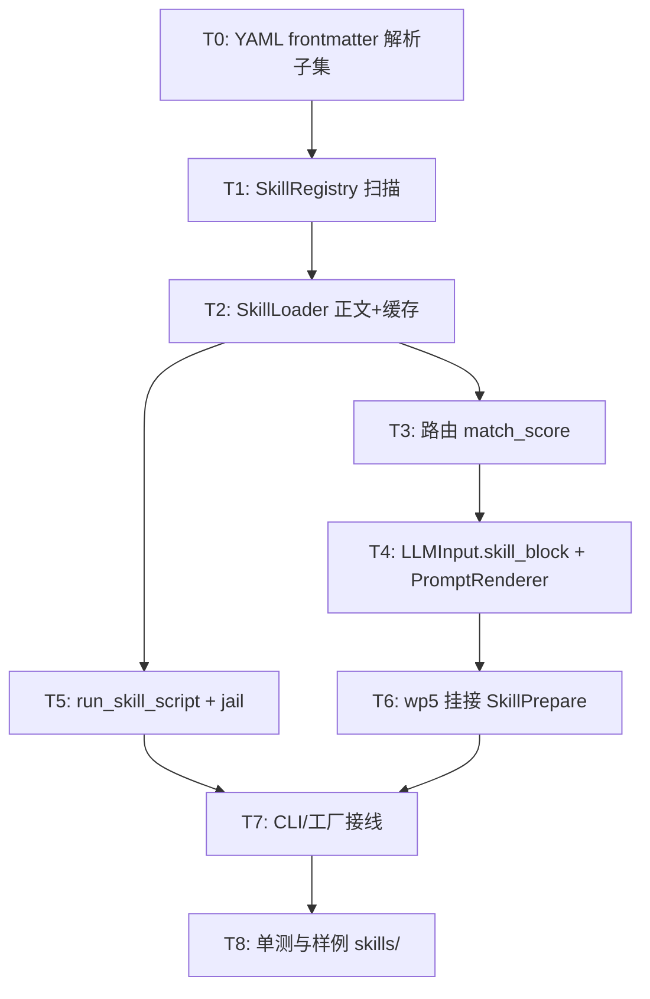

# WP1.8：Skills 最小闭环 — 详细实现计划

本文档将 [phase-1-plan.md](./phase-1-plan.md) **§3 WP1.8** 展开为可交付任务、数据类型、图内挂接点及测试；并显式依赖 [phase-1-wp2.md](./phase-1-wp2.md)（ToolBus、`run_skill_script`）、[phase-1-wp4.md](./phase-1-wp4.md)（`LLMInput` / `PromptRenderer` 拼装顺序）、[phase-1-wp5.md](./phase-1-wp5.md)（Agent 循环状态桶、每轮 `LLMInput` 构造）。概念背景见 [skills.md](./skills.md)（渐进式披露 L1–L3）。

**文档版本**：0.2  
**日期**：2026-04-03  
**上游依据**：`phase-1-plan.md` v0.3（任务 1.8.1–1.8.5；里程碑 M6/M7）

**与 WP1.7 的关系**：[WP1.7](./phase-1-wp7.md)（示例与测试）当前列为 **BACKLOG**：在 **本 WP 闭环并接入 Agent 图** 之后，再统一实施 WP1.7 的 **完整**无网/CI 测试套件，并把 **Skills**（L1/L2/L3、`run_skill_script` 等）纳入回归范围；避免在 Skills 未定型前重复改写大面积测试夹具。

---

## 1. 目标与非目标

### 1.1 目标（最小闭环）

| 编号 | 能力 |
|------|------|
| G1 | **L1 索引**：在每个技能根目录下扫描 **一层子目录** `<skill-folder>/SKILL.md`（文件名大小写敏感 `SKILL.md`），解析 **YAML Frontmatter**（含 Cursor：`name`、块标量 `description: >-` / `description: >` / `description: |`、`disable-model-invocation`；legacy `id`）；合并 **canonical key**（`name` > `id` > 目录名）写入索引 **`id`** 字段 → 内存列表（description、trigger_keywords、tags、`disable_model_invocation`、可选 `resources`） |
| G2 | **路由**：对**当前用户句**做匹配；**省略** `disable_model_invocation` 的条目；在 **trigger_keywords ∪ tags** 之外，计 **canonical** 整段与 **`-` 分段** 子串分；**0 或 1** 个命中（多命中取最高分 + 字典序最小 canonical，**文档化**） |
| G3 | **L2 注入**：加载命中文件的 **Markdown 正文**（去掉 frontmatter），按 **字符预算** `AGENT_SKILL_CONTEXT_MAX_CHARS` 截断，进入提示词链路 |
| G4 | **L3**：`ToolBus` 注册 **`run_skill_script`**；参数 **`skill_id`** 须为 **canonical**（见 G1）；**真实路径**限制在 **`SkillIndexEntry::script_jail`** 下 **`canonical(relative_path)`**，禁止 **`..`** 越狱；执行 **白名单解释器/子进程**（见 §7） |
| G5 | **与 wp5 集成**：在 **每轮外层用户输入** 或 **循环体内 LLM 调用前**，更新供 `LLMNode` 使用的 **`LLMInput` 片段**（技能附录）；不破坏现有 tool 循环 |
| G6 | **单测**：Frontmatter 解析、`..` 拒绝、截断长度、`run_skill_script` schema 校验（wp2） |

### 1.2 非目标（与 plan 一致）

- 向量 / 语义路由（阶段 3，对齐 [plan-detailed.md](./plan-detailed.md) §6.3）。
- 从 Markdown 正文 **自动**提取脚本列表（Frontmatter **手写** `resources.scripts` 可选，首版可不强制）。
- Skill 自进化 / CI 园丁 / 多文件 `references/` 懒加载（可做 `resources` 字段预留）。

---

## 2. 依赖关系映射

| 依赖文档 | 本 WP 用法 |
|----------|------------|
| **wp2** | `register_local_tool("run_skill_script", handler, ToolMeta{...})`；`parameters`：`skill_id` string、`relative_path` string；handler 内 **canonicalize + jail** 后 `posix_spawn`/`fork` 或固定 `::system` **禁止**；返回 `{"stdout","stderr","exit_code"}` JSON；**`AGENT_TOOL_ALLOWLIST`** 若启用须包含 `run_skill_script` |
| **wp4** | **系统/附录拼接顺序**固定为：`base_system_prompt` → **`## Active skill (id: …)` + L2 正文**（若命中）→ **RAG `context`**（若非空），再交 `PromptRenderer`；若拒绝改 `LLMInput`，可复用 **仅 `context`** 暂存技能正文（**不推荐**，与 RAG 混名） |
| **wp5** | 在 **`AgentThreadState`** 或等价状态中增加 **`active_skill_id`**、**`active_skill_body`**（可选缓存）；**SkillPrepare** 节点位于 **LLM 节点之前**、或在 **构造 `LLMInput` 的 functor** 内调用 **`SkillRegistry::match + SkillLoader::load_body`**；每 **用户新的一轮**（非 tool 内轮）重新路由 |

---

## 3. 技能文件格式（锁定）

与 [skills.md](./skills.md) 一致：每个技能为目录 **`<root>/<skill-folder>/`** 内单个 **`SKILL.md`**（Frontmatter + Markdown 正文）。

```markdown
---
id: demo_skill
name: Demo
description: One-line for L1 index
trigger_keywords:
  - demo
  - example
tags:
  - misc
---

# Instructions
...
```

- **L1 解析**：仅 `---` … `---` 之间 YAML（键集最小子集：**id, name, description, trigger_keywords, tags, resources**）。
- **L2**：第二个起始 `---` 之后的全文为 **instructions**（允许内嵌代码块，但不自动执行）。
- **编码**：UTF-8；换行 `\n`。

---

## 4. 类型与模块布局

### 4.1 建议新类型（`include/agent/skill_catalog.hpp` 或并入 `types.hpp`）

```cpp
struct SkillIndexEntry {
    std::string id;
    std::string name;
    std::string description;
    std::vector<std::string> trigger_keywords;
    std::vector<std::string> tags;
    std::filesystem::path file_path;  // absolute, canonical base + relative
    nlohmann::json resources;         // optional, opaque for L3 paths base
};
```

### 4.2 类职责

| 类 | 职责 |
|----|------|
| **`SkillRegistry`** | `scan_directory(fs::path root)`、`reload()`、`list_l1() const`、`match_score(std::string_view user_text) -> optional<string skill_id>` |
| **`SkillLoader`** | `load_body(skill_id)` → `string`（带缓存：`(skill_id, mtime)`）；`get_skill_root(skill_id)` 用于 jail |
| **`SkillPromptAugmenter`**（可选自由函数） | `void apply(LLMInput& in, const SkillIndexEntry*, std::string_view body, size_t max_chars)`：截断并写入 **技能附录字段**（§5） |

### 4.3 源文件位置

| 路径 | 说明 |
|------|------|
| `include/agent/skill_registry.hpp` | `SkillRegistry` |
| `include/agent/skill_loader.hpp` | `SkillLoader` |
| `src/skills/skill_registry.cpp` | 扫描、YAML 解析 |
| `src/skills/skill_loader.cpp` | 读文件、去 frontmatter |
| `src/skills/skill_script_tool.cpp` | `run_skill_script` 注册辅助（由 `toolbus` 或 `cli` 初始化调用） |

**CMake**：`list(APPEND AGENT_SOURCES src/skills/...)`

---

## 5. `LLMInput` 与 Prompt 拼装（衔接 wp4）

### 5.1 字段策略（择一实现，推荐 A）

| 方案 | 做法 |
|------|------|
| **A（推荐）** | 扩展 `LLMInput`：`std::optional<std::string> skill_block`；**`PromptRenderer`**（wp4 T-CORE）在拼 system 时：`system_prompt` +（若 `skill_block`）`"\n\n" + *skill_block` +（若 context）context 规则 |
| **B** | 无类型变更：拼接到 `context` 首部 `"(skill)\n" + body`，**仅当** RAG 未启用；与 wp4 **G4** 叠加时定义优先级 |

本 WP **默认 A**，避免 RAG 与技能抢同一字段语义。

### 5.2 L1 目录文本（可选）

若需让模型 **知悉有哪些技能**：将 `SkillRegistry::list_l1()` 格式化为短表（id + description 一行）附加到 **system** 尾部或单独 **首条 system**，**控制行数**（例如最多 2k 字符）；与 **海量技能库** 冲突时依赖阶段 3 向量召回 — 本 WP **小目录**即可。

---

## 6. 路由算法（1.8.2）

### 6.1 输入文本

- **首选**：当前轮 **`UserInput` / `user_prompt`** 原始字符串。
- **可选**：叠加 `AgentThreadState.initial_user_message`（wp5），避免多轮 tool 后丢失关键词（**仅当**用户本轮子句为空时）。

### 6.2 打分（简单可测）

对每个 skill：`score = Σ 1[keyword appears as substring in lowercased text]` + `Σ 1[tag matches]`（tag 可要求 `#tag` 或裸露词，**写死一种**）。

- **阈值**：`score > 0` 命中；多命中取 **最大 score**，平手取 **id 字典序最小**。

### 6.3 关闭路由

- **`AGENT_SKILLS_DIR` 未设置或空**：不扫描，`skill_block` 不填。
- **`AGENT_SKILL_ROUTER=off`**：有目录也不匹配（便于 A/B）。

---

## 7. L3：`run_skill_script`（衔接 wp2）

### 7.1 `ToolMeta` 草案

- **name**：`run_skill_script`
- **description**：在已加载技能目录下执行限定相对路径脚本，返回 stdout/stderr/exit_code。
- **schema**（properties）：
  - `skill_id`：`string`，**required**，须存在于 Registry
  - `relative_path`：`string`，**required**，**不得**以 `/` 开头、**不得**含 `..`

### 7.2 执行策略

| 步骤 | 说明 |
|------|------|
| 1 | `canonical(root/skill_id/relative)` 落在 `canonical(AGENT_SKILLS_DIR/skill_id/)` 前缀下 |
| 2 | 文件须存在且为**常规文件** |
| 3 | 解释器：`AGENT_SKILL_SCRIPT_ALLOWLIST` 逗号列表（如 `/bin/sh,/usr/bin/python3`），根据 shebang 或扩展名 **映射**；未命中 **拒绝** |
| 4 | 子进程：工作目录 `skill_id` 根目录；超时 **`AGENT_SKILL_SCRIPT_TIMEOUT_SEC`** |
| 5 | 返回 JSON：`stdout`/`stderr` 字符串（长度 cap，超出截断并 `truncated: true`） |

**与 wp2**：全程走 `ToolBus::call_tool`，错误形状见 [phase-1-wp2.md](./phase-1-wp2.md) §5。

---

## 8. 图与工厂挂接（衔接 wp5）

### 8.1 节点顺序（推荐）

在用户源 → **SkillPrepare**（AnyNode）→ **AgentLoop / LLM**：

- **SkillPrepare**：读取共享 `SkillRegistry` + `SkillLoader`，写 `state.skill_block` 或 **`LLMInput` 临时对象** 进 `any` map 键 `SkillAugment`。
- **LLMNode**（wp5）：`extract_llm_input` 合并 `SkillAugment` 到 `LLMInput.skill_block`。

若 **不增节点**：在 **wp5 `StateMerge` 之后、下一 LLM 之前** 的内联 functor 调用 `SkillPromptAugmenter`（同一效果）。

### 8.2 `build_cli_agent_graph`

- 新参数：`std::shared_ptr<SkillRegistry> skills` 或 `enable_skills: bool` + 内部 `make_registry()`。
- **注册 L3 工具**：图构建前 **`register_skill_script_tool(toolbus, registry, loader)`** 一次。

### 8.3 多轮 tool 内是否重算路由

- **默认**：仅 **新用户 utterance**（外层 REPL 一行）时重算；**同轮 tool 补洞**不重选 skill。实现：在 `AgentThreadState` 设 **`user_turn_id`**，仅当递增时调用 `match()`。

---

## 9. 环境变量

| 变量 | 说明 |
|------|------|
| `AGENT_SKILLS_DIR` | **单根**技能目录；`cli_agent_demo` 未设置则关闭 Skills。**`cli_agent_skills_demo`** 未设置时改用 **`~/.cursor/skills` + `~/.cursor/skills-cursor`** 合并扫描（仅已存在目录）；一旦设置本变量则与 demo 一致、仅用单根。 |
| `AGENT_SKILL_CONTEXT_MAX_CHARS` | L2 注入上限，默认如 `8000` |
| `AGENT_SKILL_ROUTER` | `on` / `off`，默认 `on`（有目录时） |
| `AGENT_SKILL_SCRIPT_ALLOWLIST` | 可执行解释器路径列表 |
| `AGENT_SKILL_SCRIPT_TIMEOUT_SEC` | 子进程超时 |
| **wp2** | `AGENT_TOOL_ALLOWLIST` 包含 `run_skill_script` 时方可从 LLM 调用 |

---

## 10. 任务分解与顺序



| ID | 任务 | 产出 |
|----|------|------|
| T0 | 手写或 **yaml-cpp**（若已引入）解析 `---` 块；非法 YAML → **跳过文件 + 日志** | `skill_registry.cpp` |
| T1 | `scan_directory`、去重 id、冲突策略 **拒绝后加载** | |
| T2 | `load_body`、mtime 缓存 | `skill_loader.cpp` |
| T3 | `match_score`、大小写、阈值 | |
| T4 | `types.hpp` optional 字段 + **wp4** `PromptRenderer` 合并点 | 与 wp4 同 PR 或紧随其后 |
| T5 | `register_skill_script_tool` | `skill_script_tool.cpp` + wp2 |
| T6 | **SkillPrepare** 或 StateMerge 钩子；**wp5** `AgentThreadState` 字段 | `agent_loop_node` / `agent_templates` |
| T7 | `build_cli_agent_graph`、`cli_agent_demo` env | wp6 |
| T8 | `tests/test_skill_*.cpp`、`skills/demo/SKILL.md` 样例 | wp7 |

---

## 11. 测试用例（1.8.5）

| 用例 | 断言 |
|------|------|
| Frontmatter 缺 `id` | 文件忽略或整文件 error，与实现约定一致 |
| 正文含 `---` | 仅首块为 frontmatter，其余保留在 body |
| `relative_path` 为 `../x` | `run_skill_script` 返回 `validation_failed` / wp2 code |
| symlink 跳出 jail | 拒绝（`std::filesystem::weakly_canonical` 检测） |
| L2 超长 | `skill_block.size() <= max` |
| 路由 | `user_prompt` 含 keyword → 对应 body 子串出现在 **RenderedPrompt** system 拼接结果 |

---

## 12. 风险与缓解

| 风险 | 缓解 |
|------|------|
| YAML 依赖过重 | 先支持 **标量 + 字符串数组**；复杂嵌套拒绝 |
| 脚本 RCE | allowlist + 无 `system()` + 超时 + 只读技能树（可选 mount） |
| 与 wp4 system 顺序歧义 | **单一文档节**（§5）+ 单测快照 |
| 循环内重复注入 | `user_turn_id` 门禁（§8.3） |

---

## 13. 完成定义（WP1.8 DoD）

- [ ] 给定 `AGENT_SKILLS_DIR` 与示例 `SKILL.md`，**无 API key** 下单测可验证 L1/L2/L3。
- [ ] `run_skill_script` 仅能在技能目录 jail 内执行。
- [ ] **wp5** 跑通：**用户话**触发技能 → `LLMInput` 含附录 → 模型（或 mock）可看到技能正文。
- [ ] **wp4** 单测或扩展测覆盖 **skill_block** 拼接顺序。
- [ ] `getting_started.md` 单行说明 `AGENT_SKILLS_DIR`（可与 wp7 同更）。

---

## 14. 相关链接

- [phase-1-plan.md](./phase-1-plan.md) — WP1.8 摘要  
- [phase-1-wp2.md](./phase-1-wp2.md) — ToolBus / schema / 错误 JSON  
- [phase-1-wp4.md](./phase-1-wp4.md) — `LLMInput`、`PromptRenderer`  
- [phase-1-wp5.md](./phase-1-wp5.md) — `AgentThreadState`、循环、LLM 前节点  
- [phase-1-wp6.md](./phase-1-wp6.md) — CLI 工厂  
- [phase-1-wp7.md](./phase-1-wp7.md) — WP1.7 示例与测试（**BACKLOG**，Skills 后完整收口）  
- [skills.md](./skills.md) — 概念 L1–L3  

---

## 15. 修订记录

| 日期 | 版本 | 说明 |
|------|------|------|
| 2026-03-31 | 0.1 | 初稿：依赖 wp2/wp4/wp5、L1–L3、skill_block、run_script jail、图挂接、DoD。 |
| 2026-04-03 | 0.2 | 文首增补与 **WP1.7 backlog** 的排期关系（先 1.8 再完整 1.7 测试）。 |
