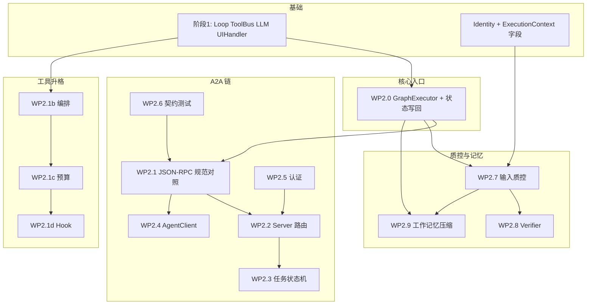

# 阶段 2：A2A 服务化 + 质控 + 工具升格 + 记忆最小集 — 详细实现规划

本文档在 [plan-detailed.md](./plan-detailed.md) **§5**（A2A、WP2.1–2.6、§5.4 富界面、§7 UI 表）与 [plan-detailed.v2.md](./plan-detailed.v2.md) **§5–6**（Identity / ExecutionContext、§5.1 多轮与输入 DSL、WP2.0 / 2.1b–2.1d / 2.7–2.9、Verifier、工作记忆压缩）之上，给出**可排期、可验收**的实现拆解、依赖顺序与阶段边界。阶段 3（RAG、Faiss、磁盘记忆深化、动态 MCP / WP3.7 等）仅在衔接处引用，**不纳入本文件 DoD**。

**文档版本**：0.1  
**日期**：2026-04-04  
**上游依据**：`plan-detailed.md` v0.3（§5–§8）；`plan-detailed.v2.md` v0.6-v2；[phase-1-plan.md](./phase-1-plan.md)（阶段 1 交付与衔接）

---

## 1. 目标与交付边界

### 1.1 阶段 2 必须达成（合并两上游）

| 编号 | 交付项 | 验收要点 |
|------|--------|----------|
| D1 | **统一执行入口** | `GraphExecutor::execute`（或等价名）+ 模板注册；**CLI 与 `AgentServer` 共用**同一套图构建与运行路径，禁止长期 `throw` 占位（**WP2.0**） |
| D2 | **A2A 对外门面** | JSON-RPC 方法集、错误对象、SSE 任务更新与内部 `AgentTask`/状态机映射；**Agent Card** 与 Well-Known 路径按当前对齐的规范版本实现（**WP2.1–2.3**） |
| D3 | **AgentServer 可服务** | **真实 listen**；httplib 路由与 **Taskflow executor** 交互不阻塞 listen 线程（**WP2.2**） |
| D4 | **AgentClient 规范侧** | 与 Facade 一致；旧 REST 路径仅 **legacy** 可选保留并文档 deprecated（**WP2.4**） |
| D5 | **认证** | Bearer、API Key、（可选）OAuth 设备码等按规范优先级实现（**WP2.5**） |
| D6 | **契约测试** | 官方示例或社区 mock / 录制 JSON fixture 入仓（**WP2.6**） |
| D7 | **工具升格** | 只读可并行、写串行、并发上限（**WP2.1b**）；工具结果预算 + 外置引用（**WP2.1c**）；调用前 hook allow/deny/改参（**WP2.1d**）；与 `AGENT_TOOL_ALLOWLIST` 组合策略**文档化 + 单测** |
| D8 | **输入质控** | Tier A（规则/schema）+ Tier B（子 LLM 或工具、固定字段输出）；覆盖用户入口与 **§5.1** `@file` / `@url` / `/cmd` 边界（**WP2.7**，详 [plan-detailed.v2.md](./plan-detailed.v2.md) §5.1） |
| D9 | **Verifier** | 框架内**第二套 LLM 子图**；输出结构化 `ok` / `issues` / `suggested_action`；默认无写工具；事件进 SSE + 日志（**WP2.8**） |
| D10 | **工作记忆最小集** | 偏早压缩钩子（阈值可配）；槽位预算可导出；压缩失败**回退**；与 `/memory compact` 等 **§5.1** 命令共用策略入口（**WP2.9**） |
| D11 | **多轮状态** | 单次运行结束后 **`NextAgentState`（含 `history`）写回**会话对象；REPL 与 A2A 请求均可延续上下文（**WP2.0** + [plan-detailed.v2.md](./plan-detailed.v2.md) §5.1） |

### 1.2 明确不包含（阶段 2 不做 / 非必达）

- **动态 MCP** 热加载/卸载（**WP3.7**，阶段 3）；阶段 2 仍为 **静态** `mcp.json` + ToolBus；**§5.1** 中 `/mcp`、`/skills` 热切换类 `/cmd` 仅 **stub 或拒绝**（见 [plan-detailed.v2.md](./plan-detailed.v2.md) §8）。
- **RAG / KnowledgeBase / Faiss 生产路径**（阶段 3，[plan-detailed.md](./plan-detailed.md) §6）。
- **记忆落盘（WP3.6）**、**记忆 Assembly（WP3.2）**、压缩模板注册表深化（**WP3.3**）、子 LLM 压缩质检管线（**WP3.5**）— 阶段 2 仅 **WP2.9 内存侧最小钩子**；落盘与多模板以阶段 3 验收。
- **向量数控（WP3.8）**。

### 1.3 可选交付（与 A2A 同阶段规划，不阻塞 D1–D11）

与 [plan-detailed.md](./plan-detailed.md) **§5.4 / §7** 一致，以下可**并行或分批**排期，不纳入阶段 2 核心 DoD：

| 方向 | 内容 |
|------|------|
| **ImGui** | `ImGuiHandler`；渲染线程与流式回调队列/加锁；与 CLI 流式/终稿去重约定一致 |
| **TUI** | 可选 ncurses 等；独立可执行目标为佳，避免拖垮无头 CI |
| **Web** | `WebHandler`、浏览器侧 SSE/WS 与 WP2 HTTP 通道衔接 |

依赖：阶段 1 已稳定的 **`UIHandler` 契约**与图工厂（`build_cli_agent_graph` 等）。

### 1.4 阶段 1 基线衔接（Gap → 阶段 2）

| 区域 | 说明 |
|------|------|
| 图执行 | 阶段 1 以 `build_cli_agent_graph` + 直接 `executor` 为主；阶段 2 收口为 **GraphExecutor::execute** 与可注册模板 |
| 会话 | 当前 CLI demo 存在 **未写回 `NextAgentState`** 导致跨 `>` 无 `history` 的缺口；**D11** 关闭该缺口 |
| A2A | [architecture/overview.md](../architecture/overview.md) 中 REST/JSON-RPC 现状与 Google A2A 画像差异，在 **WP2.1–2.4** 以 **双栈/适配层** 收敛（见 plan-detailed §3） |
| 日志 | 向统一门面（如 spdlog）与 **§9 审计字段** 靠拢（[plan-detailed.v2.md](./plan-detailed.v2.md) §9） |

---

## 2. 工作包总表（v0.3 + v2 合并清单）

| 工作包 | 来源 | 摘要 |
|--------|------|------|
| **WP2.0** | v2 | `GraphExecutor::execute`、模板注册；CLI/Server 同入口；**会话状态跨轮写回** |
| **WP2.1** | v0.3 §5.2 | A2A **规范对照**：JSON-RPC 方法集、错误对象、SSE 事件模型 |
| **WP2.1b** | v2 | 工具编排：只读并行、写串行、并发上限 |
| **WP2.1c** | v2 | 工具结果预算；**含 `@file`/`@url` 注入块**（§5.1） |
| **WP2.1d** | v2 | 调用前 hook：allow / deny / 改参 |
| **WP2.2** | v0.3 | AgentServer 路由、线程模型、与 executor 交互 |
| **WP2.3** | v0.3 | 任务状态机、取消、超时，映射到 A2A 状态 |
| **WP2.4** | v0.3 | AgentClient 与 Facade 一致；legacy REST 策略 |
| **WP2.5** | v0.3 | 认证：Bearer、API Key、可选 OAuth |
| **WP2.6** | v0.3 | 一致性/契约测试与 fixture |
| **WP2.7** | v2 | 输入质控 Tier A+B；**ExecutionContext**；§5.1 DSL |
| **WP2.8** | v2 | Verifier 子图（第二套 LLM） |
| **WP2.9** | v2 | 工作记忆 + 偏早压缩；失败回退 |
| **（可选）WP2.U** | v0.3 §5.4 | ImGui / TUI / Web 富界面 |

---

## 3. 工作包依赖顺序（建议）

**说明**：**WP2.1b–d** 主要依附阶段 1 循环与 ToolBus，可与 **WP2.1** 并行起步，但 **D7** 全量验收建议在 **WP2.0** 之后与统一执行路径联调。**WP2.8** 依赖主图稳定；**WP2.9** 依赖可延续的 `AgentThreadState`（**WP2.0**）。

---

## 4. 工作包详细说明（摘要级）

### WP2.0 GraphExecutor 与会话延续

**目标**：单一入口执行图模板；REPL 与 A2A **同一构建函数**；运行结束后将会话状态写回。

| ID | 任务 | 说明 |
|----|------|------|
| 2.0.1 | **API** | `GraphExecutor::execute(name, params)` 或等价；模板注册表；错误模型非空 |
| 2.0.2 | **状态写回** | 终端 Sink 或执行完成回调将 **`kNextAgentState`** 合并回会话级 `AgentThreadState`（见 AgentLoop 现状） |
| 2.0.3 | **单测/集成** | 两轮连续调用同一会话，`history` 可见增长 |

**产出**：`graph_executor.*`、CLI/A2A 调用侧改造；文档更新 `getting_started.md`（若新增 env）。

---

### WP2.1 A2A 规范对照（JSON-RPC + SSE 模型）

**目标**：按 spec-tracker 锁定版本，实现对外 JSON-RPC 与 SSE 载荷；内部领域模型映射。

| ID | 任务 | 说明 |
|----|------|------|
| 2.1.1 | **规范锁定** | `a2a-spec-tracker.md`（或等价）记录修订号与差异 |
| 2.1.2 | **JSON-RPC** | 方法集、id、错误对象 |
| 2.1.3 | **SSE** | 事件名与 payload schema 对齐官方示例 |

**产出**：`a2a_*` 或 `agent_server` 下 Facade 模块（与 [plan-detailed.md](./plan-detailed.md) §3 双栈策略一致）。

---

### WP2.1b / WP2.1c / WP2.1d 工具链升格

**目标**：编排、预算、hook 与 allowlist 文档一致。

| ID | 任务 | 说明 |
|----|------|------|
| 2.1b.1 | **只读并行** | 可配置并发上限；默认可关闭保持顺序执行 |
| 2.1b.2 | **写串行** | 写类工具与读类工具分类策略文档化 |
| 2.1c.1 | **截断/外置** | 工具结果与 **用户注入上下文** 超限时不使 RPC/SSE 失败 |
| 2.1d.1 | **Hook** | allow / deny / 改参；与 `AGENT_TOOL_ALLOWLIST` 组合 |

**验收**：各子能力单测 + 与 Agent 循环集成测至少 1 条。

---

### WP2.2 AgentServer 路由

**目标**：httplib 注册、线程模型、listen 线程不阻塞于重任务。

| ID | 任务 | 说明 |
|----|------|------|
| 2.2.1 | **路由表** | JSON-RPC 与 SSE 路径与规范一致 |
| 2.2.2 | **executor 投递** | 长任务异步跑在 worker，结果经 SSE 推送 |

**产出**：`agent_server.cpp`、transport 层调整（参见 overview）。

---

### WP2.3 任务与状态机

**目标**：内部状态 ↔ A2A 任务状态；取消与超时。

| ID | 任务 | 说明 |
|----|------|------|
| 2.3.1 | **映射表** | submitted/working/… 以官方为准 |
| 2.3.2 | **取消** | 合作式取消与资源清理 |

---

### WP2.4 AgentClient

**目标**：对外仅发规范请求；与 WP2.1 Facade 一致。

| ID | 任务 | 说明 |
|----|------|------|
| 2.4.1 | **Client API** | 任务创建、订阅 SSE、错误处理 |
| 2.4.2 | **Legacy** | 若保留 REST，标记 deprecated 与移除计划 |

---

### WP2.5 认证

**目标**：Bearer、API Key、（可选）OAuth 设备码按规范优先级。

| ID | 任务 | 说明 |
|----|------|------|
| 2.5.1 | **服务端校验** | Header / query 与 Agent Card 声明一致 |
| 2.5.2 | **客户端构造** | `AgentClient` 注入凭证 |

---

### WP2.6 一致性测试

**目标**：fixture 入仓；可与 mock server 或录制会话对齐。

| ID | 任务 | 说明 |
|----|------|------|
| 2.6.1 | **JSON 契约** | 请求/响应快照测试 |
| 2.6.2 | **SSE** | 事件序列解析测 |

---

### WP2.7 输入质控与 ExecutionContext

**目标**：Tier A+B；拼装 `LLMInput` 前写入 **ExecutionContext**（cwd、允许 MCP 集合、策略版本）；**§5.1** `@` / `/cmd` Tier A 覆盖。

| ID | 任务 | 说明 |
|----|------|------|
| 2.7.1 | **UserInputPreprocessor** | 输出结构化字段：`llm_user_text`、`injected_context[]`、`control_actions[]`（见 v2 §5.1） |
| 2.7.2 | **@file** | 走 fs 监禁；行范围；长度上限 |
| 2.7.3 | **@url** | 走 web_fetch 同类策略；计入 WP2.1c 预算 |
| 2.7.4 | **/cmd** | 白名单；审计 `user_command`；MCP/Skills 热切换 **拒绝或 stub** |
| 2.7.5 | **Tier B** | 可选子 LLM；固定 JSON 输出 schema |

---

### WP2.8 Verifier

**目标**：主图输出后进入 Verifier 子图；结构化结论；默认无写工具。

| ID | 任务 | 说明 |
|----|------|------|
| 2.8.1 | **子图** | 第二 `LLMClient` 配置或适配器 profile |
| 2.8.2 | **Retry/Escalate** | fail 路径与主循环衔接（见 v2 mermaid） |
| 2.8.3 | **可观测** | SSE + 日志字段 |

---

### WP2.9 工作记忆与压缩钩子

**目标**：阈值可配、偏早压缩、`memory.md` 建议阈值；失败回退；与 `/memory compact` 共用入口。

| ID | 任务 | 说明 |
|----|------|------|
| 2.9.1 | **计量** | 消息/注入块/工具结果槽位预算可导出 |
| 2.9.2 | **策略** | 首版可单一策略（摘要或截断）；与阶段 3 WP3.3 注册表兼容扩展 |
| 2.9.3 | **回退** | 压缩失败则降级为安全截断并记录 |

---

### （可选）WP2.U 富界面

**目标**：ImGui / TUI / Web 与 `UIHandler` 对齐；与 A2A 并行规划。

**依赖**：阶段 1 `CLIHandler` 与 Sink 事件模型稳定。

**细分文档建议**：`phase-2-wp-ui.md`（或按技术栈拆分）。

---

## 5. 里程碑排期建议（供排期引用，非承诺）

| 里程碑 | 内容 | 依赖 WP |
|--------|------|---------|
| M1 | WP2.0 最小可用 + 会话写回 + 单测 | 2.0 |
| M2 | WP2.1 + WP2.2 + WP2.3 打通 happy path + SSE | 2.1–2.3 |
| M3 | WP2.4 + WP2.5 + WP2.6 契约门禁 | 2.4–2.6 |
| M4 | WP2.1b–2.1d 工具链升格 | 2.1b–d |
| M5 | WP2.7 输入质控 + §5.1 DSL 最小集 | 2.7 |
| M6 | WP2.8 Verifier 接入主图 | 2.8 |
| M7 | WP2.9 工作记忆压缩 + `/memory` 命令联调 | 2.9 |
| M8（可选） | WP2.U 任选一条富界面垂直切片 | 2.U |

---

## 6. 风险与缓解（阶段 2）

| 风险 | 缓解 |
|------|------|
| A2A 规范修订 | spec-tracker + fixture 版本化；适配层隔离 |
| listen 线程阻塞 | 任务全进 executor；背压与队列上限 |
| Verifier 延迟与成本 | 独立开关；轻量模型 profile；超时策略 |
| `@url` / 工具结果提示注入 | WP2.1c 截断 + WP2.7 Tier A 长度；Verifier 抽检（可选） |
| 压缩失败丢失对话 | WP2.9 强制 **回退**路径；单测覆盖 |

---

## 7. 阶段 3 衔接备忘（约束阶段 2 设计）

- **动态 MCP（WP3.7）**、**记忆落盘（WP3.6）**、**Assembly（WP3.2）** 不在阶段 2 抢跑；阶段 2 预留 **会话 id、审计字段、ExecutionContext** 即可。
- **Faiss / RAG** 见 [plan-detailed.md](./plan-detailed.md) §6 与 [plan-detailed.v2.md](./plan-detailed.v2.md) §7。
- **§5.1 `/cmd`** 中 MCP/Skills 热切换仅阶段 3 与威胁模型闭合。

---

## 8. 后续细分文档命名建议（对齐 phase-1-wp*.md）

| 建议文件名 | 对应工作包 |
|------------|------------|
| [phase-2-plan.md](./phase-2-plan.md) | 本总览（保持为索引） |
| `phase-2-wp0.md` | WP2.0 |
| `phase-2-wp1.md` | WP2.1 |
| `phase-2-wp1b.md`（或合并为 `phase-2-wp1bcd.md`） | WP2.1b–2.1d |
| `phase-2-wp2.md` … `phase-2-wp6.md` | WP2.2–2.6 |
| `phase-2-wp7.md` | WP2.7 |
| `phase-2-wp8.md` | WP2.8 |
| `phase-2-wp9.md` | WP2.9 |
| `phase-2-wp-ui.md` | WP2.U（可选） |

实施时可按团队粒度合并（例如 WP2.2–2.3 一文），但**编号与 DoD** 仍以本表为准。

---

## 9. 修订记录

| 日期 | 版本 | 说明 |
|------|------|------|
| 2026-04-04 | 0.1 | 初稿：合并 plan-detailed §5–7 与 plan-detailed.v2 §5–6；WP2.0–2.9 + 可选 WP2.U；依赖图、里程碑、阶段 3 边界、后续 wp 文件命名 |

---

## 10. 相关链接

- [plan-detailed.md](./plan-detailed.md) — 三阶段总规划、A2A 双栈、UI 表  
- [plan-detailed.v2.md](./plan-detailed.v2.md) — Verifier、工具升格、输入 DSL、阶段 3 记忆/Faiss/MCP  
- [phase-1-plan.md](./phase-1-plan.md) — 阶段 1 DoD 与 WP1.x  
- [agents/memory.md](../agents/memory.md) — 压缩与记忆概念  
- [architecture/overview.md](../architecture/overview.md) — A2A 现状与模块边界
