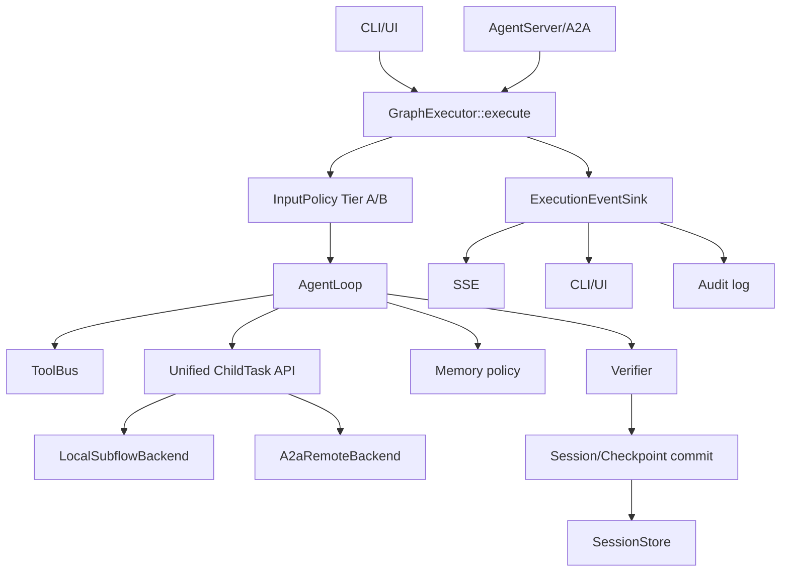

# Phase 2 集成能力审计与升级计划

**状态**：实施中  
**日期**：2026-07-12  
**依据**：[phase-2-plan.md](./phase-2-plan.md) D1-D11、各 `phase-2-wp*.md`、当前源码与 CTest 注册情况

> 2026-07-12 实施注记：前半部分保留升级前审计证据；当前状态以第 5 节四态清单为准。
> `AgentServer::set_task_handler`、旧字符串 `GraphExecutor::execute` 和
> `build_custom_workflow` 占位接口已从代码删除。

## 1. 结论

Phase 2 的组件实现率约为 **80%-85%**，但按 D1-D11 的端到端集成定义衡量，完成度约为
**60%-70%**。当前主要问题不是缺少类型、类或单元测试，而是生产运行路径尚未收敛：

```text
CLI / TUI / ImGui / Web
          |
GraphExecutor::run_react_cli_sync
          |
AgentLoop -> Verifier -> session merge

AgentServer / A2A
          |
task_handler_ -> future<AgentTask>
```

两条路径没有共享完整的构图、输入质控、会话提交、Verifier、记忆、取消和事件传播语义。
因此，多个工作包属于“组件完成、集成未完成”，不能仅根据测试目标存在或文档中的“已实现”
描述判定 Phase 2 已完成。

## 2. 完成度矩阵

### 2.1 D1-D11

| 交付项 | 当前判断 | 主要缺口 |
| --- | --- | --- |
| D1 统一执行入口 | 部分完成 | CLI/UI 使用 `run_react_cli_sync`；AgentServer 仍调用外部 `task_handler_`；模板注册未成为生产分发入口 |
| D2 A2A 对外门面 | 部分完成 | Card、JSON-RPC、wire 和 SSE framing 已有；`SendStreamingMessage`、`SubscribeToTask` 未实现 |
| D3 AgentServer 可服务 | 基本完成 | 真实 listen、worker 队列和 SSE 已有；实际 Agent 图执行仍未接 GraphExecutor |
| D4 AgentClient 规范侧 | 部分完成 | JSON-RPC、legacy 开关、SSE client 已有；与 Server streaming RPC 不对称 |
| D5 认证 | 基本完成 | Bearer/API Key 与 Server/Client 测试存在；OAuth 属可选未实现 |
| D6 契约测试 | 基本完成 | versioned fixture、JSON/SSE/loopback 已有；外部参考实现互操作覆盖仍不足 |
| D7 工具升格 | 基本完成 | 1b/1c/1d 均有实现和测试；ExecutionContext、取消、统一事件和重试边界尚未完全贯通 |
| D8 输入质控 | 部分完成 | Tier A 和 DSL 已接 CLI/Server；Tier B 未进入 Server 生产依赖配置 |
| D9 Verifier | 部分完成 | 已进入 GraphExecutor；AgentServer SSE 仍依赖业务 handler 手工转发 |
| D10 工作记忆最小集 | 基本完成 | metrics、自动/手动压缩、fallback 已有；A2A session 与事件闭环不足 |
| D11 多轮状态 | 部分完成 | CLI session merge、checkpoint resume 已有；A2A `contextId` 尚未绑定持久的 `AgentThreadState` 提交模型 |

### 2.2 工作包

| 工作包 | 估计完成度 | 判定 |
| --- | ---: | --- |
| WP2.0 | 65% | GraphExecutor 与 CLI session merge 完成，Server 未统一 |
| WP2.1a | 90% | 实现基本完成，DoD checkbox 未同步 |
| WP2.1 | 80% | 协议核心完成，streaming RPC 缺失 |
| WP2.1b | 90% | 工具并行/串行与 A2A submit 特例完成 |
| WP2.1c | 90% | 预算、UTF-8 截断、spill、wire cap 完成 |
| WP2.1d | 100% | hook、allowlist 顺序、测试与文档完整 |
| WP2.2 | 75% | Server transport 完成，执行主干未收敛 |
| WP2.3 | 80% | 状态机、cancel、timeout 已有，仍依赖 handler 协作终止 |
| WP2.4 | 75% | Client 核心完成，与完整 streaming Server 不对称 |
| WP2.5 | 90% | 核心认证完成 |
| WP2.6 | 90% | fixture 与本地契约门禁完成 |
| WP2.agent2agent | 85% | registry、session book、工具和 demo 完成，未统一到 Subflow |
| WP2.agents | 80% | supervisor 与细粒度工具完成，缺统一 child-task 协议 |
| WP2.7 | 75% | Tier A 完成，Tier B 生产接线不足 |
| WP2.8 | 75% | GraphExecutor 集成完成，Server 自动接线不足 |
| WP2.9 | 85% | 内存侧能力完成，Server session/事件闭环不足 |
| WP2.U | 可选 | 已具备多种 demo 和无头测试，不阻塞核心 DoD |

## 3. 已确认问题

### P0-1：AgentServer 未使用统一 GraphExecutor 入口

**证据**：

- `AgentServer::run_agent_task_on_executor` 仍调用 `task_handler_`。
- 源码保留 `replace with GraphExecutor::execute` 注释。
- `GraphExecutor::execute(const std::string&)` 当前直接抛异常。
- `GraphExecutor::build_custom_workflow` 未实现。

**影响**：

- CLI 和 A2A 不保证使用同一 AgentLoop、Verifier、memory 和 session commit 语义。
- Server 测试可通过简化 handler 绕过真实 Agent 图。
- Workflow loop/module、Subflow 和恢复幂等升级无法自动进入 Server。

**修复方式**：

1. 新增统一 `ExecutionRequest` 和 `ExecutionResult`。
2. 实现 `GraphExecutor::execute_sync` / `execute_async`，按 `template_id` 调用注册模板。
3. `run_react_cli_sync` 改为统一入口的兼容包装。
4. AgentServer 构造 `ExecutionRequest`，不再把生产执行委托给任意 `task_handler_`。
5. `task_handler_` 仅保留为测试适配器或 deprecated 扩展点。

建议请求模型：

```cpp
struct ExecutionRequest {
    std::string template_id;
    AgentConfig config;
    AgentWorkflowDeps deps;
    std::shared_ptr<internal::AgentThreadState> session;
    ExecutionContext context;
    std::shared_ptr<TaskControl> control;
    ExecutionEventSink event_sink;
};
```

### P0-2：A2A streaming 方法集不完整

**证据**：`SendStreamingMessage` 和 `SubscribeToTask` 在 dispatch table 中返回
`method_not_found`，订阅仍要求使用 legacy GET 路径。

**影响**：

- Card capability、tracker、Client 和 Server 可能漂移。
- Verifier、工具和子任务事件无法通过规范侧统一订阅。
- legacy REST/SSE 路径无法按计划退场。

**修复方式**：

1. 实现 `SendStreamingMessage` 和 `SubscribeToTask` JSON-RPC handler。
2. 将 JSON-RPC subscription 与现有 SSE channel 绑定。
3. 建立 Card capability、dispatch table、Client method 常量三方一致性检查。
4. 明确 legacy `/tasks/sendSubscribe` 的废弃版本和关闭开关。

### P0-3：A2A session 没有闭合 D11

**证据**：CLI 路径已有 history 前缀校验和 session merge；Server 主要维护 `AgentTask`、
`session_id/contextId`，未形成 `contextId -> AgentThreadState -> committed revision` 的统一存储。

**影响**：

- A2A 第二轮请求未必能让模型观察第一轮 history。
- retry/resume exactly-once 语义只在 CLI 路径成立。
- peer session book、本地 Agent session 和 checkpoint 是分离状态体系。

**修复方式**：

新增最小 `SessionStore`：

```text
contextId/session_id
  -> AgentThreadState
  -> committed_revision
  -> active_attempt
  -> checkpoint_id
  -> completed_tool_call_ids
  -> outbound_supervisor
```

每次成功执行以 compare-and-commit 方式提交；失败、cancel 和 deadline 不提交部分 history。

### P1-1：Verifier 与 AgentServer 仅有手工 callback 约定

**证据**：GraphExecutor 支持 `on_verifier_event`，AgentServer 支持 `push_verifier_sse`，但
生产路径没有自动接线。

**影响**：

- Server 是否启用 Verifier 取决于业务 handler。
- `retry_main` 的附加主图执行不能自动映射为 A2A task/event。
- D9 的“CLI 与 Server 共用”未完成。

**修复方式**：统一入口中注入 `ExecutionEventSink`，GraphExecutor 发出结构化 Verifier
事件，AgentServer adapter 自动转为 SSE；禁止业务 handler 再手工拼事件。

### P1-2：Tier B 没有进入 Server 生产配置

**证据**：`UserInputPreprocessor` 已实现 Tier B，但 Server 的 `PreprocessOptions` 只注入
`toolbus`，没有 `tier_b_llm`。

**影响**：CLI 与 Server 对模糊输入可能产生不同结果；Tier B 没有统一 timeout、预算、
审计和错误映射。

**修复方式**：

1. 将 `InputPolicyDependencies` 纳入统一执行依赖。
2. 显式配置 Tier B LLM、timeout 和最大调用次数。
3. 统一 allow/rewrite/reject 结构化结果。
4. 修订总计划：明确 Tier B 是 Phase 2 必达还是可选，消除 D8 与 WP2.7 的口径冲突。

### P1-3：cancel/timeout 仍依赖 handler 自觉协作

**证据**：Server 在等待 `future<AgentTask>` 时检查 `TaskControl`，但只有 future ready 后
才继续完成路径；不合作 handler 不能被强制终止。

**影响**：状态可能已经 cancelled，但 LLM、工具或副作用仍继续执行；Server worker 和
资源可能长期占用。

**修复方式**：

- `TaskControl/stop_token` 贯穿 GraphExecutor、LLM、ToolBus、Subflow 和 A2A client。
- 网络调用、工具和子图使用统一 deadline。
- cancel 后禁止 attempt commit。
- 对无法中断的第三方调用采用隔离 worker 和结果丢弃策略。

### P1-4：Local Subflow 与 Remote A2A Subtask 是两套模型

**现状**：

- 本地：`SubflowModule` / `SubflowNode`，具有 depth、attempt、retry/restart/resume。
- 远程：`A2aPeerRegistry` / `OutboundTaskSupervisor`，具有 submit/wait/cancel/extend。

**影响**：结果、usage、预算、取消、恢复和 trace 不能统一传播；Agent 需要理解两套子任务
协议。

**修复方式**：定义统一 child-task 接口：

```text
ChildTaskRequest
ChildTaskHandle
ChildTaskStatus
ChildTaskResult
ChildTaskUsage
ChildTaskPolicy
```

提供 `LocalSubflowBackend` 与 `A2aRemoteBackend`。AgentLoop 只面向统一 submit/wait/cancel/
resume API。

### P1-5：质量、记忆和多 Agent 事件没有统一事件总线

当前 Verifier、SSE、memory 日志、supervisor event 和 UI callback 各自维护格式与传递方式。

**修复方式**：新增 `ExecutionEvent` 与 `ExecutionEventSink`：

```text
task_status
artifact_update
tool_started / tool_completed
subtask_update
verifier_started / verifier_completed
memory_compacted
checkpoint_committed
```

提供 SSE、CLI/UI、audit log 和 test collector adapter。

### P2-1：工作包文档状态失真

WP2.0、1a、1b、2、3、4、5、6、7、8、9、U 中存在大量未勾选 DoD，但其中不少实现与测试
已经存在；总计划还存在重复 M4 行。

**修复方式**：DoD 使用四态，而不是只用 checkbox：

```text
[ ] 未开始
[~] 组件完成，集成未完成
[x] 实现、集成与验收完成
[!] 已知缺陷或阻塞
```

每项必须链接代码、测试名和最近一次验证结果。

## 4. 目标架构



## 5. 实施计划

### Stage 1：统一执行主干，P0

**范围**：WP2.0、WP2.2、D1、D3、D11。

- [x] 定义 `ExecutionRequest/Result/EventSink`。
- [~] 实现 `GraphExecutor::execute_sync/async`；`react_cli` 已接入，通用模板执行接口仍待收敛。
- [ ] 将 `run_react_cli_sync` 改为兼容包装。
- [x] AgentServer 只使用 GraphExecutor；`set_task_handler` 及双轨成员已删除。
- [x] 引入 InMemory/SQLite `SessionStore`、checkpoint 与 revision CAS commit。
- [~] 已有 CLI 两轮与真实 A2A 两轮测试；final/memory/Verifier 全字段等价断言仍待补齐。

**退出标准**：同一 mock 请求经 CLI 和 A2A 得到相同 final、history、iteration、Verifier
结果和 memory 状态。

### Stage 2：补齐 A2A streaming，P0

**范围**：WP2.1、2.2、2.4、2.6。

- [x] 实现 `SendStreamingMessage` 服务端与 Client callback API。
- [x] 实现 `SubscribeToTask`，订阅时重放当前快照并在终态关闭。
- [x] Card v1 `supportedInterfaces`、dispatch 与 Client 常量一致性测试。
- [~] 已有 JSON-RPC POST SSE 回环测试；多事件静态 contract fixture 待补齐。
- [~] legacy 默认关闭并保留兼容 GET；删除版本仍需写入迁移文档。

**退出标准**：规范 Client 仅使用 JSON-RPC/标准订阅即可完成 send/get/cancel/stream。

### Stage 3：质量链和取消传播，P1

**范围**：WP2.3、2.7、2.8、2.9。

- [x] Tier B 独立依赖、timeout、调用预算和失败策略进入统一执行请求，默认关闭。
- [x] Verifier 事件自动接 Server SSE。
- [x] memory compact 结果进入统一事件流。
- [x] `TaskControl` 已贯穿 AgentLoop/GraphExecutor/Server、ToolBus、LocalTool、MCP HTTP/stdio 和 ChildTask policy；旧 Tool/Transport 实现通过默认适配保持兼容。
- [x] cancel/deadline 后使用事务工作副本且禁止 session commit。

**退出标准**：A2A 请求可观察 InputPolicy、Verifier、memory 和 cancel 的完整结构化事件序列。

### Stage 4：统一子任务协议，P1

**范围**：WP2.agent2agent、WP2.agents、Workflow Subflow。

- [x] 定义 `ChildTask*` 类型、handle 和 backend 接口。
- [~] 实现 Local backend；与 `SubflowNode` ValueMap 的直接适配仍待完成。
- [x] 实现 A2A remote backend，remote resume 明确返回 `unsupported_resume`。
- [~] 已统一 depth、attempt、iteration、trace、idempotency、usage、deadline 和 cancel 字段；父子递归传播测试待补。
- [x] 公共 backend 提供 submit/retry/restart/resume 语义。

**退出标准**：同一个父 Agent 可以在不改变上层控制代码的情况下调用本地或远程子任务。

### Stage 5：持久化恢复边界，P1/P2

- [x] session revision、checkpoint id 和版本化 AgentThreadState 可序列化。
- [x] 保存 committed history 和完成的 tool call ids/digest。
- [x] SQLite 保存 active/terminal child task 摘要。
- [~] Server 重启可延续 session；显式 checkpoint 分支恢复测试仍待扩充。
- [~] ToolAggregator 会复用持久化 `tool_call_id` 结果；崩溃中 in-flight 副作用 reconciliation 仍待实现。

完整长期记忆仍属于 Phase 3；本阶段只实现 Phase 2 exactly-once 所需的最小恢复记录。

### Stage 6：文档和门禁，P2

- [ ] 更新所有 `phase-2-wp*.md` 四态 DoD。
- [ ] 删除 `phase-2-plan.md` 重复 M4。
- [ ] 增加 Phase 2 聚合 CTest labels。
- [ ] CI 强制运行垂直集成测试。
- [ ] 记录规范 revision、fixture revision 和测试总量。

### Stage 7：Skills 深度控制，P1

- [x] 元数据扩展到 version/license/scripts/references/cli/allowed-tools，并提供结构化 warning/error 诊断。
- [x] 资源读取执行声明列表、类型、canonical jail、普通文件和字节预算约束。
- [x] 脚本执行支持参数边界、最小环境、解释器 allowlist、timeout、输出截断和 TaskControl 取消。
- [x] 增加 `skillctl list|validate|show|read` 与 `phase2-cli-e2e` fixture 门禁。
- [ ] Phase 3：包签名、依赖锁定、动态安装/卸载、版本解析、热切换和资源缓存失效。

边界：Phase 2 保证已注册技能的静态发现、受控读取和确定性执行，不承诺运行中变更技能包后的原子热更新。

## 6. 必须新增的垂直测试

| 标签 | 测试目标 |
| --- | --- |
| `phase2-cli-e2e` | CLI -> GraphExecutor -> AgentLoop -> Verifier -> session commit |
| `phase2-a2a-e2e` | Client -> Server -> GraphExecutor -> SSE -> second-turn session continuation |
| `phase2-quality-e2e` | Tier A/B -> budget -> tool -> memory compact -> Verifier retry |
| `phase2-multi-agent-e2e` | 本地 Subflow + 远程 A2A child 并发、部分失败和 usage 聚合 |
| `phase2-recovery-e2e` | checkpoint resume、tool-call 去重、cancel 后不提交 |

最高价值的组合测试应覆盖：

```text
A2A SendMessage
-> @file 输入质控
-> AgentLoop 三轮工具调用
-> Local Subflow + Remote A2A child
-> memory auto compact
-> Verifier retry_main
-> SSE 事件序列
-> session commit
-> 第二轮恢复
-> cancel 一个子任务
-> final/history/usage 无重复
```

## 7. Phase 2 最终完成定义

只有同时满足以下条件，才能将 Phase 2 标记为完成：

- [ ] CLI、UI 和 AgentServer 使用同一个 GraphExecutor 执行入口。
- [ ] Server 生产路径不依赖任意外部 `task_handler_` 构造核心 Agent 语义。
- [ ] `SendStreamingMessage`、`SubscribeToTask` 和规范 SSE 闭环通过。
- [ ] A2A 两轮请求真实延续同一个 `AgentThreadState`。
- [ ] InputPolicy、ToolBus、Subflow、Memory、Verifier 共用 context、cancel 和 event sink。
- [ ] Local Subflow 与 Remote A2A child 使用统一结果和生命周期协议。
- [ ] cancel/deadline/失败 attempt 不提交 session 或重复副作用。
- [ ] 五组 Phase 2 垂直测试全部通过。
- [ ] 各 WP 文档 DoD 与代码、测试证据同步。

在上述门禁通过前，应将 Phase 2 标记为 **component-complete / integration-incomplete**，
而不是 fully complete。
