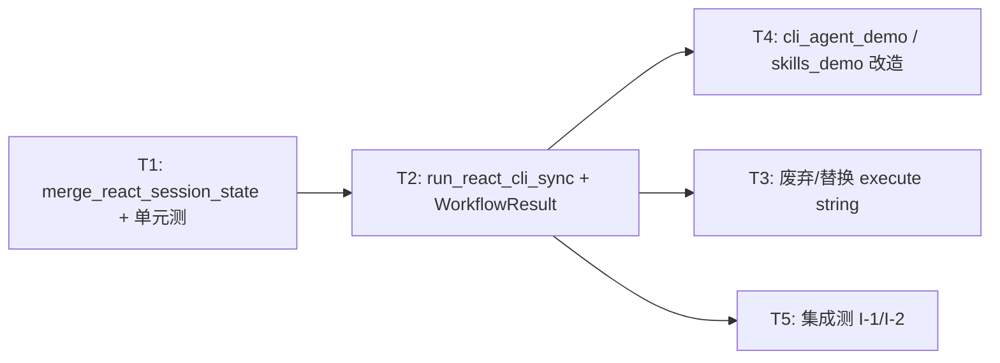

# WP2.0：GraphExecutor 统一执行与会话状态写回 — 实现计划

本文档将 [phase-2-plan.md](./phase-2-plan.md) **§4 WP2.0** 与交付项 **D1**（统一执行入口）、**D11**（多轮 `NextAgentState` / `history` 写回）落实为**无歧义、可按 PR 顺序落地**的任务、接口、算法与测试。范围**仅限**本 WP；不实现 WP2.1–2.6（A2A Server）、WP2.7（完整输入 DSL）、WP2.9（压缩策略深化）— 仅预留与本 WP 的衔接点。

**文档版本**：0.1  
**日期**：2026-04-04  
**上游依据**：[phase-2-plan.md](./phase-2-plan.md) v0.1；[plan-detailed.v2.md](./plan-detailed.v2.md) §5.1、§6.1 WP2.0；[phase-1-plan.md](./phase-1-plan.md)（阶段 1 已交付基线）

---

## 1. 目标与非目标

### 1.1 目标（验收对齐 phase-2-plan）

| 编号 | 能力 | 可验证标准 |
|------|------|------------|
| G1 | **单次 API 跑通 ReAct CLI 图** | 调用方提供 `tf::Executor&`、`AgentConfig`、`AgentWorkflowDeps`、非空 `shared_ptr<AgentThreadState>`、Sink/流式选项；**一次调用**完成构图、`run_async`、等待结束、返回结构化结果；**不再**在业务代码里手写 `GraphBuilder` + `build_cli_agent_graph_with_terminal_sink` 七段式样板（demo 可薄包装） |
| G2 | **废除「仅占位」的 execute** | `GraphExecutor::execute(const std::string&)` 的 **deferred + 立刻 throw** 行为被 **替换或弃用**（见 §6）；仓库内无「文档写可用、运行必炸」的默认路径 |
| G3 | **会话状态写回（D11）** | 同一会话 `shared_ptr<AgentThreadState>` 在**连续两次**成功执行后，`history.size()` **严格大于**第一次执行后；且第二轮 `PromptRenderer` 可见第一轮用户句（见 §4.3 历史拼接算法） |
| G4 | **WorkflowResult 填全** | 成功路径 `WorkflowResult::success == true`，`outputs` 至少含与当前 Sink JSON 对齐的键：`final_answer`、`iteration`、`history_size`；失败路径 `success == false` 且 `error_message` 非空 |
| G5 | **模板注册最小集（D1）** | 存在稳定字符串 id（建议 **`react_cli`**，见 §5.1）可注册/查询；**注册与执行**语义在本文档写死，避免「注册了但 execute 不用」的断裂 |

### 1.2 非目标（本 WP 不实现）

- **HTTP / JSON-RPC / AgentServer**（WP2.2+）；本 WP 仅保证 **同一 C++ API** 将来可被 Server 线程调用。
- **`build_custom_workflow` 真实编排**；可保留 `throw` 但须在头文件注明 **非 WP2.0**。
- **`@file` / `@url` / `/cmd` 全量解析**（WP2.7）；本 WP 不新增预处理节点。
- **记忆压缩/摘要**（WP2.9）；本 WP 不裁剪 `history`，仅正确累积；截断仍由现有 `PromptRenderer::max_history_messages_` 等约束。
- **动态 MCP**（WP3.7）。

---

## 2. 现状与根因（实现前只读确认）

### 2.1 代码事实（截至阶段 1 基线）

- **`GraphExecutor::execute(const std::string&)`**（`agent_framework/src/graph_executor/graph_executor.cpp`）使用 `std::async(std::launch::deferred, ...)` 并在调用 `get()` 时 **`throw std::logic_error("... not implemented")`** — **不可用**。
- **`GraphExecutor::workflows_`**（`graph_executor.hpp` 私有成员）**从未写入**；即使未来 `execute` 实现，当前设计也与「每请求新建 `GraphBuilder`」的 demo 模式不一致，**不得**在未文档化重构下单独启用该 map。
- **`cli_agent_demo` / `cli_agent_skills_demo`**：`run_graph_once` 自建 `GraphBuilder`，调用 `build_cli_agent_graph_with_terminal_sink`，**未设置** `CliAgentTerminalSinkOptions::on_final_state`；故 **Sink 仅回调 JSON**，调用方持有的 `state` **从未**被 Loop 出口处的 `next_agent_state` 更新。
- **`AgentLoopNode::create` 闭包**（`agent_framework/src/node/agent_loop_node.cpp`）：首进 body 时 `shared->state = std::make_shared<AgentThreadState>(*st)` — **拷贝**输入状态；环内只修改 `shared->state`；`exit_func` 输出 **`shared->state`**。因此 **外层 `st` 与环内终态不是同一 `shared_ptr`**，必须通过 **显式合并** 写回调用方会话对象（与 `graph_executor.hpp` 中 `CliAgentTerminalSinkOptions` 注释一致）。

### 2.2 `PromptRenderer` 与多轮（写回后必须满足的语义）

`PromptRenderer::render`（`prompt_renderer.cpp`）顺序为：

1. `messages`：system（+ 缺省变量 notice）→ **`format_as_messages(truncate(history))`** → **最后追加一条** `{"role":"user","content": user_user_prompt}`。

因此 **同一条用户句不能同时**以「整段放进 `history`」和「放进 `user_prompt`」两种方式出现，否则会出现 **连续两条 user**。正确约定是：

- **`initial_user_prompt` / UserInput 源**：始终表示 **本轮**用户输入（REPL 当前行）。
- **`history`**：在每一轮图跑完后，应包含 **此前各轮**的 **user + assistant + tool** 的完整链；**本轮**用户句 **只**通过 `user_prompt` 注入，**不**在进入图前 `push_back` 到 `history`。

由此推出 §4.3 的 **后置拼接**算法（在拿到 `next` 后把 **本轮** `user` 插入到 **本轮**产生 assistant/tool 之前）。

---

## 3. 类型与模块边界

### 3.1 涉及类型（不修改语义，仅扩展 API）

| 类型 | 路径 | 本 WP 动作 |
|------|------|------------|
| `internal::AgentThreadState` | `include/agent/internal/agent_thread_state.hpp` | **可选**：增加 `void clear_ephemeral_for_new_turn()`（清 `last_error` 等）；**非必须** |
| `WorkflowResult` | `include/agent/types.hpp` | **必须**：执行路径填充字段；不删现有成员 |
| `CliAgentTerminalSinkOptions` | `include/agent/graph_executor.hpp` | **已有** `on_final_state`；本 WP **必须**在统一执行路径中**默认接上**写回逻辑（调用方仍可覆盖） |
| `GraphExecutor` | `include/agent/graph_executor.hpp` | **新增**方法 + **废弃/替换**旧 `execute(string)`（§6） |

### 3.2 建议新增：运行请求聚合体（避免 12 个参数）

在 `graph_executor.hpp`（或新建 `agent/run_request.hpp` 由前者 include）定义：

```cpp
struct ReactCliRunOptions {
    std::string loop_node_name = "AgentLoop";
    CliAgentGraphOptions graph_options{};
    CliAgentTerminalSinkOptions sink{};
    /** 若 false，则仅写回 state，不强制要求 on_final_json（Server 场景可只关心 state）；默认 true 与现 CLI 一致 */
    bool require_final_json_callback = true;
};

struct ReactCliRunRequest {
    AgentConfig config;
    AgentWorkflowDeps deps;
    std::shared_ptr<internal::AgentThreadState> session;
    ReactCliRunOptions options;
};
```

**约束**：

- `session` **非空**；否则 `std::invalid_argument`。
- `session->initial_user_prompt` **非空**（空串视为无用户输入，直接 `invalid_argument` 或文档化允许 no-op；**建议** CLI 在 REPL 层过滤空行，本 API **要求非空**以减少分支）。
- `deps.llm`、`deps.toolbus` 非空（与现 `build_cli_agent_graph` 一致）。

---

## 4. 会话合并算法（规范性，D11 核心）

### 4.1 符号

- `S`：调用方持有的 `session`（`shared_ptr<AgentThreadState>`），执行前已设好 `initial_user_prompt = u`（本轮用户文本）。
- `old_hist`：执行开始前 `S->history` 的**副本**（vector 拷贝）。
- `next`：`exit_func` / Sink 收到的 `shared_ptr<AgentThreadState>`（环内终态），**与 S 不是同一 shared_ptr**。

### 4.2 前缀不变式

环入口拷贝 `*S` 到内部状态，环内仅在 `old_hist` **之后**追加 assistant/tool（及多轮 LLM 的 assistant）。故必须满足：

- `next->history.size() >= old_hist.size()`；
- `next->history[0..old_hist.size()-1]` 与 `old_hist` **逐条相等**（见 §4.4 相等定义）。

若不相等：**不得**静默覆盖；`WorkflowResult::success = false`，`error_message` 写明 `state merge: history prefix mismatch`，且不修改 `S->history`（或仅更新 `last_error` 字段，二选一文档固定，**建议**不修改 `history`）。

### 4.3 合并步骤（成功路径）

在确认前缀合法后：

1. `delta` = `next->history` 去掉长度 `old_hist.size()` 的前缀后的子范围（`[old_hist.size(), end)`）。
2. 构造 `Message user_msg`：`role = "user"`，`content = u`，`timestamp = std::time(nullptr)`（与其它消息一致）。
3. `S->history = old_hist`；
4. `S->history.push_back(user_msg)`；
5. `S->history.insert(S->history.end(), delta.begin(), delta.end())`；
6. 复制标量/可选字段：`S->iteration = next->iteration`；`S->skill_prompt_cache = next->skill_prompt_cache`；`S->active_skill_id = next->active_skill_id`；`S->last_error = next->last_error`（或成功时清空 `last_error`，**建议**成功清空）。
7. **`S->initial_user_prompt` 处理**：**建议**执行成功后 **清空**为 `""`，避免与下一轮混淆；下一轮 REPL 在调用前再赋值。**必须**在文档与 demo 中一致。
8. **不要**将 `next` 的 `shared_ptr` 赋给调用方（保持 `S` 的 **identity** 稳定）。

### 4.4 `Message` 相等（用于前缀校验）

定义 `message_equal_for_merge(a, b)`：

- `a.role == b.role`；
- `a.content == b.content`；
- `tool_call_id`、`tool_name` 均 **同为 nullopt** 或 **同值**；
- `tool_result`：均为 nullopt，或 **JSON 深度相等**（`==`）。

**不比较** `timestamp`（避免浮点/时钟差异）。

### 4.5 与 `PromptRenderer` 的联合语义

执行**当中**，环内 `LLMInput::history = shared->state->history`（仍为 `old_hist`，**不含**本轮 user 在 history 里）, `user_prompt = u` — 与 §2.2 **一致**，无重复 user。

执行**之后**，`S->history` 变为 `old_hist + user + delta`，下一轮 `u'` 为新行，`history` 已含上一轮完整链 — **第二轮**渲染为：`... history ...` + 最后一条 user(`u'`)。**正确**。

---

## 5. GraphExecutor API 与模板 id

### 5.1 模板 id 常量

在 `graph_executor.hpp` 的 `agent_framework` 命名空间内：

```cpp
/** @brief WP2.0 注册用：与 build_cli_agent_graph 等价的 ReAct CLI 模板 */
inline constexpr const char* kWorkflowTemplateReactCli = "react_cli";
```

### 5.2 主执行方法（建议签名）

```cpp
class GraphExecutor {
public:
    /**
     * @brief 构建并运行一轮 ReAct CLI 图；结束后将会话合并回 session（D11）
     * @return WorkflowResult.outputs 含 final_answer / iteration / history_size / guard_*（与 Sink JSON 对齐）
     */
    WorkflowResult run_react_cli_sync(tf::Executor& executor, const ReactCliRunRequest& request);

    /** 异步包装；实现可用 std::async 或 pack_task，须在文档注明线程与 executor 关系 */
    std::future<WorkflowResult> run_react_cli_async(tf::Executor& executor,
                                                      ReactCliRunRequest request);
```

**同步语义**：

1. 校验 `request`；失败 → `WorkflowResult{false, {}, {}, {}, "..."}`。
2. `GraphBuilder builder("react_cli_run")`（或带唯一实例名防冲突）。
3. 若 `request.options.require_final_json_callback` 为 true 且 `sink.on_final_json` 为空 → `invalid_argument`。
4. 调用 `build_cli_agent_graph_with_terminal_sink(builder, config, deps, session, sink_with_merge, ...)`，其中 **`sink_with_merge`** 为对 `request.options.sink` 的包装：
   - 先调用用户 `on_final_json(j)`（若存在）；
   - 再调用 **内置** `merge_next_into_session(session, u_snapshot, next_ptr)`（`u_snapshot` 为执行前保存的 `u`）；
   - 最后调用用户 `on_final_state(next_ptr)`（若存在）。
5. `builder.run_async(executor).wait()`；捕获异常 → `success=false`。
6. 从最后一次 Sink 回调缓存的 JSON 填入 `WorkflowResult.outputs`；若 Sink 未触发（不应发生），`success=false`。

**注意**：合并逻辑 **也可以**完全放在 `on_final_state` 的**默认实现**中，但必须在 **一处**实现，避免 demo 与 GraphExecutor 分叉。**推荐**在 `graph_executor.cpp` 内实现 **非成员** `merge_react_session_state(...)` 供 Executor 与（可选）测试直接调用。

### 5.3 `register_template` 与 `execute` 的整理

| 动作 | 说明 |
|------|------|
| **保留** | `register_template(name, WorkflowTemplate)` — 供 **非 ReAct** 或后续 JSON 驱动模板使用 |
| **新增** | `register_react_cli_runner()` **可选**：内部登记 `kWorkflowTemplateReactCli` → 指向「仅元数据」的模板，**真正执行**走 `run_react_cli_sync`；**或**在 WP2.0 仅文档说明「react_cli 为逻辑名，执行请用 run_react_cli_*」 |
| **废弃** | `execute(const std::string&)`：改为 `[[deprecated]]` 并实现为 `throw std::logic_error("removed: use GraphExecutor::run_react_cli_sync")`，或 **直接删除**（若仓库无外部 ABI 承诺 — **建议** deprecated 一版再删） |

**本 WP DoD**：`grep` / CI 禁止出现对新代码路径依赖 **未实现** 的 `execute(string)`。

---

## 6. 与 CLI Demo 的改造任务

| ID | 任务 | 说明 |
|----|------|------|
| T-DEMO-1 | **`cli_agent_demo`** | `run_graph_once` 改为调用 `GraphExecutor::run_react_cli_sync`（或提取的 `merge_` + 单函数）；**删除**重复构图样板 |
| T-DEMO-2 | **`cli_agent_skills_demo`** | 同上；`exec_line` 内在调用 run 之前设 `state->initial_user_prompt = line`，之后 **`state->iteration = 0` 是否保留**：与环内 `iteration` 语义对齐 — **合并后** `session->iteration` 已为 `next->iteration`；若每轮 REPL 强制 `iteration=0` **会覆盖**合并结果，**禁止**在合并之后执行 `state->iteration = 0`。**允许**在每轮开始时仅重置 `skill_prompt_cache` 等（与现 demo 一致）但 **不得**在 run **后**清零 `iteration`/`history` |
| T-DEMO-3 | **单轮 `-p`** | 仍创建新 `session` 或复用单次；行为与多轮一致 |

**关键修正**：现有 `exec_line` 中 `state->iteration = 0` 在 **每次** REPL 行执行 — 必须在 WP2.0 中改为 **仅**在「新会话」时清零，或在合并后 **不再**覆盖 `iteration`。**建议**：删除 `exec_line` 内对 `iteration` 的赋值，完全以合并结果为准；技能缓存仍可按行重置（与 phase-1 行为对齐）。

---

## 7. 测试计划

### 7.1 单元测试：`merge_react_session_state`

| 用例 | 步骤 | 期望 |
|------|------|------|
| M-1 | `old_hist` 空，`next->history` = [A]，u="hi" | `S->history` == [user(hi), A] |
| M-2 | `old_hist` = [user, A]，next = old + [T, A2]，u="q2" | 前缀校验通过；结果 old + user(q2) + [T, A2] |
| M-3 | `next->history` 前缀与 old 不一致 | `success` false，S->history 不变（按 §4.2） |
| M-4 | u 为空串 | 调用方拒绝或 merge 抛 `invalid_argument`（与 §5.2 一致） |

**文件**：新建 `tests/test_wp20_session_merge.cpp` 或并入 `test_build_cli_agent_graph.cpp`。

### 7.2 集成测试：双轮 mock LLM（无真网）

| 用例 | 步骤 | 期望 |
|------|------|------|
| I-1 | 与 `test_agent_loop_wp5` 同类 FakeModelAdapter；同一 `session` 连续 `run_react_cli_sync` 两次，不同 `initial_user_prompt` | 第二次请求中 **RenderedPrompt** 或 adapter 收到的 **messages** 含第一轮用户内容（可通过 mock 记录 `LLMInput`） |
| I-2 | 仅一轮 tool + final | `WorkflowResult.success`；`outputs["history_size"]` > 0 |

**CTest**：`add_test(NAME wp20_session_react ...)`；`ENVIRONMENT` 建议 `AGENT_TOOL_ALLOWLIST=`。

### 7.3 回归

- 现有 `build_cli_agent_graph`、`test_build_cli_agent_graph` **全部通过**。
- `test_agent_loop_wp5`、`test_agent_loop_guard_wp16` 通过（若构图接口签名未变，仅内部调用路径变）。

---

## 8. 文档与可观测性

| ID | 任务 |
|----|------|
| DOC-1 | [getting_started.md](./getting_started.md) 增加 **「多轮 REPL」** 一句：同进程多 `>` 会保留 `history`（WP2.0 后） |
| DOC-2 | [phase-2-plan.md](./phase-2-plan.md) §4 WP2.0 下增加「详案见 phase-2-wp0.md」— 若尚未添加则补一行 |
| DOC-3 | `graph_executor.hpp` Doxygen：`run_react_cli_sync`、合并算法、`kWorkflowTemplateReactCli` |

**日志（可选 WP2.0）**：合并失败 `std::clog << "[GraphExecutor] state merge failed: ...\n"`（`AGENT_LOG_LEVEL=debug` 时更详细）。

---

## 9. 提交顺序建议（PR 切片）



**禁止**：在未合并 T1 前仅改 demo 手写 `on_final_state` 而 GraphExecutor 仍无统一入口 — 会导致 **双份**合并逻辑。

---

## 10. 验收清单（DoD）

- [ ] `GraphExecutor::run_react_cli_sync`（或等价命名）已实现，`WorkflowResult` 字段填全。
- [ ] `execute(const std::string&)` 已 deprecated 或删除，且无测试依赖其旧行为。
- [ ] `merge_react_session_state`（或等价）单测覆盖 §7.1。
- [ ] 双轮 mock 集成测通过 §7.2 I-1。
- [ ] `cli_agent_demo` / `cli_agent_skills_demo` 多轮 `>` 下模型可「接续」上文（手测或集成测）。
- [ ] `getting_started.md` 或本仓库用户可见文档中 **一处** 说明多轮行为。

---

## 11. 修订记录

| 日期 | 版本 | 说明 |
|------|------|------|
| 2026-04-04 | 0.1 | 初稿：D1/D11、合并算法、PromptRenderer 约束、GraphExecutor API、demo 迭代字段修正、测试与 PR 顺序 |

---

## 12. 相关链接

- [phase-2-plan.md](./phase-2-plan.md)  
- [plan-detailed.v2.md](./plan-detailed.v2.md) §5.1  
- [graph_executor.hpp](../include/agent/graph_executor.hpp)  
- [agent_thread_state.hpp](../include/agent/internal/agent_thread_state.hpp)  
- [phase-1-wp5.md](./phase-1-wp5.md)（Agent 循环与构图）  
- [deep_dive_execution.md](../agents/deep_dive_execution.md)（GraphExecutor 缺口背景）
