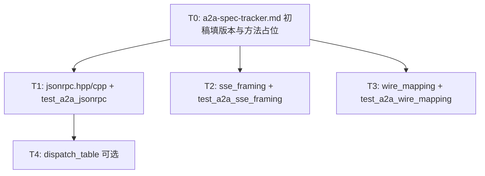

# WP2.1：A2A 规范对照层（JSON-RPC 2.0 + SSE 载荷模型）— 实现计划

本文档将 [phase-2-plan.md](./phase-2-plan.md) **§4 WP2.1** 与交付项 **D2** 中属于「**协议与载荷**」的部分落实为可执行任务。**须先完成 [WP2.1a](./phase-2-wp1a.md)**（`a2a-spec-tracker.md` 初稿含 Card、**通用** `jsonrpc` 层、`wire_card`）；本 WP 接续 **任务 method 表、Task/Message/SSE**。**WP2.1 交付的是与 HTTP 监听无关的编解码与映射**；**httplib 路由、listen、executor 投递** 属 **WP2.2**；**任务状态机与取消语义** 属 **WP2.3**；**AgentClient 改为走 Facade** 属 **WP2.4**。本 WP 与 WP2.1a 共同提供 **唯一权威的线协议契约**（以 `a2a-spec-tracker.md` 为根）。

**文档版本**：0.1  
**日期**：2026-04-04  
**上游依据**：[phase-2-plan.md](./phase-2-plan.md) v0.2；[plan-detailed.md](./plan-detailed.md) §3、§5.2；[plan-detailed.v2.md](./plan-detailed.v2.md) §5（Identity 字段进入 SSE 的约定）

---

## 1. 目标与非目标

### 1.1 目标（验收对齐 phase-2-plan / D2 的协议子集）

| 编号 | 能力 | 可验证标准 |
|------|------|------------|
| G1 | **规范可追溯** | 仓库存在 **[`a2a-spec-tracker.md`](./a2a-spec-tracker.md)**（路径固定），含：**对齐的 A2A 规范版本/日期**、**官方文档与示例链接**、**与本实现已知差异**；每次改方法名或路径须先改 tracker 再改代码 |
| G2 | **JSON-RPC 2.0 单请求编解码** | 提供可单测的 **parse / serialize**；支持 **`id` 为 number 或 string**（与 JSON-RPC 2.0 一致）；**不支持 batch**（`[req1,req2]`）在 WP2.1 v1 **显式超出范围**，解析遇 array 根返回 **`-32600` Invalid Request** 或文档规定的单一错误响应 |
| G3 | **JSON-RPC 错误对象** | 实现 **标准码** `-32700` Parse error、`-32600` Invalid Request、`-32601` Method not found、`-32602` Invalid params、`-32603` Internal error；**业务/A2A 扩展码** 仅在 tracker 中登记后实现 |
| G4 | **A2A 方法表（线级）** | tracker 中 **逐行**列出：`method` 字符串、`params` JSON Schema（或等价 nlohmann 检查规则）、`result` 形状、`errors`；**至少覆盖** 与当前 `AgentClient` 能力对等的 **任务创建、查询、取消、（若规范有）更新** 的 JSON-RPC 映射（具体方法名 **以官方为准**，本文件不臆造最终字符串） |
| G5 | **领域模型 ↔ 线 JSON 映射** | 在 **独立翻译单元** 内实现 `AgentTask`、`AgentMessage`、`AgentPart`、`AgentArtifact`、`AgentCard` 与 **规范 wire JSON** 的双向转换；**不**在 WP2.1 修改 `types.hpp` 中结构体语义（仅可增 `to_a2a_wire` / `from_a2a_wire` 友元或命名空间函数） |
| G6 | **SSE 事件帧与载荷** | 提供 **符合 W3C SSE** 的帧拼装（`event:`、`data:`、`id:`、`retry:` 按需）；**每种事件类型** 的 `data` JSON 形状写在 tracker；提供 **增量解析器**（供 WP2.4 客户端与 WP2.2 服务端复用）：输入 UTF-8 字节块，输出结构化事件列表或回调 |
| G7 | **与现有代码关系明确** | 文档 + 代码注释说明：`HTTPAgentTransport::send_request` 已发 **JSON-RPC 信封**（见 `agent_transport.cpp`），但其 **method/params 与 A2A 官方** 的差异在 WP2.4 收敛；`AgentClient` 当前为 **REST 路径**（见 `agent_client.cpp` `.../tasks/send`），**WP2.1 不强制改 Client**，仅提供 **A2A Facade 将使用的** 编解码 API |

### 1.2 非目标（本 WP 不做）

- 启动/停止 `httplib::Server`、注册 Get/Post 路由（**WP2.2**）。
- 任务内存表、持久化、超时、取消协作式与状态机（**WP2.3**）。
- `AgentClient` / `AgentServer` **行为切换**到生产路径（**WP2.4** / **WP2.2**）；WP2.1 可提供 **侧车式** 单元测调用 Facade，不替换现有 REST。
- **Bearer / API Key / OAuth** 校验（**WP2.5**）。
- **端到端** 与第三方 Agent 互通（**WP2.6**）；WP2.1 仅 **fixture 级** 契约测。

---

## 2. 现状与差距（实现前只读）

| 资产 | 路径 | 现状 | WP2.1 动作 |
|------|------|------|------------|
| A2A 领域类型 | `include/agent/types.hpp` | `AgentCard`、`AgentTask`、`AgentMessage`、`AgentPart` 等 + `to_json`/`from_json` | 核对与 **官方 Card/Task/Message** 字段差异，在 **tracker** 列映射表；必要时新增 **wire-only** 转换函数，避免破坏现有 JSON 测试 |
| HTTP 传输 | `agent_transport.hpp/.cpp` | 已构造 `jsonrpc`/`method`/`params`/`id` POST | WP2.1 **定义** `method` 字符串集合与 `params` 与 tracker 一致；WP2.4 将 `AgentClient` 改为使用该集合 |
| Agent 客户端 | `agent_client.cpp` | **REST**：`POST .../tasks/send` body 为自定义 JSON，非 JSON-RPC 信封 | 不在 WP2.1 删除；新增 Facade 供后续替换 |
| Agent 服务端 | `agent_server.cpp` | **stub**；注释中 **REST** 风格路径 `/tasks/send` 等 | WP2.2 实现路由时，**对外**改为 tracker 规定的 **单一路径 JSON-RPC** 或 **多路径**（以 tracker 为准），Handler 内部调用 WP2.1 Facade |
| SSE | `sse_connection.hpp`、`agent_server.cpp` | 占位 `type: task_status_update` 等 **非规范命名** | WP2.1 在 tracker **锁定官方 event 名**；实现帧工具与解析；WP2.2/现有 push 逻辑再改事件名 |

---

## 3. 交付物目录与文件命名（规范）

建议在 `agent_framework` 下新增目录（名称二选一，**全仓统一**）：

- **推荐**：`include/agent/a2a/` + `src/a2a/`

### 3.1 必选文件

| 文件 | 职责 |
|------|------|
| `docs/guides/a2a-spec-tracker.md` | 人读规范锚点 + 方法/事件表 + 差异（**Card 初稿与通用 JSON-RPC 策略** 已在 **WP2.1a** 落地；本 WP **填满** §3 方法行与 §5 SSE） |
| `include/agent/a2a/jsonrpc.hpp` + `src/a2a/jsonrpc.cpp` | **WP2.1a 已交付则复用**；本 WP 仅 **增补** 与任务分发直接相关的辅助函数（若有），**不**重复实现信封 |
| `include/agent/a2a/sse_framing.hpp` + `src/a2a/sse_framing.cpp` | `append_sse_event(std::string& out, event_type, id, data_json_str)`；`class SseParser` 增量喂入 `string_view`，产出 `struct SseEvent { std::string event; std::string data; std::optional<std::string> id; }` |
| `include/agent/a2a/wire_mapping.hpp` + `src/a2a/wire_mapping.cpp` | `json task_to_wire(const AgentTask&)` / `AgentTask task_from_wire(const json&)`；Message/Part/Artifact/Card 同理；**仅依赖** `types.hpp` 与 tracker 定义 |
| `include/agent/a2a/dispatch_table.hpp` + `src/a2a/dispatch_table.cpp`（可选） | `using JsonRpcHandler = std::function<json(const json& params)>`；`register_method(name, handler)`；`invoke(method, params)->result or throw JsonRpcError` — 供 WP2.2 一行挂路由 |

### 3.2 CMake

- `agent_framework/CMakeLists.txt`：`list(APPEND AGENT_SOURCES src/a2a/...)`；**不**新增第三方依赖。

---

## 4. `a2a-spec-tracker.md` 必备章节（模板）

实施者 **不得** 在代码中发明方法名；须先完成下列章节（可复制此清单为 MD 骨架）：

1. **对齐版本**：规范名称、版本号或 Git tag、对齐日期、官方 URL。
2. **传输约定**：TLS 终止场景（反向代理）是否影响 URL；**JSON-RPC HTTP 绑定**：单一路径 URI（例如官方示例）**或** 每方法一路径 — **选定一种** 并全仓遵守。
3. **JSON-RPC 方法表**（示例列，行数随规范）  

   | method | params（摘要） | result（摘要） | 错误码 |
   |--------|----------------|----------------|--------|
   | （由官方填写） | | | |

4. **Agent Card**：Well-Known URI 路径；JSON 顶层键列表；与 `AgentCard::to_json()` 字段 **映射表**（`name` ↔ 官方键名等）。
5. **SSE**：订阅 URL 形态（query/path）；**event** 名称全集；每条 `data` 的 JSON schema；是否要求 `Last-Event-ID`；心跳注释规则（若有）。
6. **与仓库旧 REST 的差异**：列出 `agent_client.cpp` 当前路径与 body 与官方 JSON-RPC 的 **字段级** 差异，标明 **WP2.4 删除计划**。
7. **修订记录**：日期 + 变更摘要。

---

## 5. JSON-RPC 2.0 实现细则（无疑点）

### 5.1 请求解析

- 输入：`std::string_view` body UTF-8，`Content-Type` 由调用方保证 `application/json`（WP2.2）。
- 步骤：
  1. `json::parse(body)` 失败 → 返回 HTTP 层由 WP2.2 决定；**逻辑层** 提供 `make_parse_error_response(null id)`：**无 id** 时 JSON-RPC 规定 **id 为 null**。
  2. 根非 object → `-32600`。
  3. 缺 `jsonrpc` 或非 `"2.0"` → `-32600`。
  4. `method` 非 string → `-32600`。
  5. `params` 若存在且既非 object 也非 array → `-32600`（若 A2A 全文仅用 object，可在 tracker 写死 **仅 object**，则 array 一律 `-32600`）。
  6. `id`：缺失 → **notification**，WP2.1 v1 **不支持**，返回 `-32600` 或忽略规则在 tracker **二选一字面固定**（**建议**：不支持 notification，缺 `id` 一律 `-32600`** Invalid Request**）。
  7. 根为 array → **batch**，WP2.1 v1 **不支持** → `-32600` 或单一错误响应（与 5.1.6 一起在 tracker 固定）。

### 5.2 响应序列化

- 成功：`{"jsonrpc":"2.0","id":<同请求>,"result":<json>}`。
- 失败：`{"jsonrpc":"2.0","id":<同请求或null>,"error":{"code":...,"message":...,"data":?}}`。
- **`id` 复制**：number/string 类型保持不变。

### 5.3 方法分发

- `dispatch(method, params)`：`method` 不在表 → `-32601`。
- `params` 结构校验失败 → `-32602`（message 含简短字段名）。
- handler 抛 **逻辑异常** → `-32603`，`message` 不含堆栈；`data` 可含 `{"detail":"..."}` 由 tracker 决定是否暴露。

---

## 6. SSE 实现细则（无疑点）

### 6.1 帧格式（W3C）

- 每条事件：**零或多行** `field: value`，以 **空行** 结束。
- 本 WP **必须实现** 的字段：`event`（可选，缺省为默认 `message`）、`data`（可多行拼接）、`id`（可选）。
- `data` 每行内容为 **UTF-8**；**整事件** 的语义 JSON 由 tracker 规定（通常单行 JSON）。

### 6.2 拼装 API

```text
void append_sse_event(std::string& buffer,
                      std::string_view event_name,
                      std::string_view data_payload,
                      const std::optional<std::string>& event_id);
```

- 结尾必须 **双换行** `\n\n`。
- **不得** 在 `data_payload` 内嵌入未转义的裸 `\n\n`（若 JSON 内含换行，须 `\n` 转义为 `data:` 多行 continuation，按 W3C 规则）。

### 6.3 解析 API

- `SseParser::feed(std::string_view chunk)` 追加内部缓冲；`drain_events(std::vector<SseEvent>&)` 取出 **完整** 事件。
- **UTF-8**：按字节缓冲；不假设一次 `feed` 对齐事件边界。
- **Last-Event-ID**：解析到 `id:` 字段即填入 `SseEvent::id`，供 WP2.4 `reconnect` 使用（WP2.1 仅解析，不发起 HTTP）。

### 6.4 事件类型与领域对象

- tracker 为每个 `event` 名定义：`data` JSON → 可选 `std::variant` 或 `json` + `type` 字段判别。
- 提供 `bool try_parse_task_status(const SseEvent&, AgentTask& out)` 等 **薄封装**（实现放在 `wire_mapping` 或单独 `sse_a2a.cpp`），**失败返回 false** 不抛，避免恶意流崩溃服务。

---

## 7. Wire 映射规则（与 `types.hpp`）

### 7.1 原则

- **官方键名优先**：wire JSON 使用 tracker 中的键名，**不**沿用历史 REST 的 `task` 包装层，除非 tracker 明确「result 内嵌 `task` 对象」。
- **未知字段**：`from_wire` **默认忽略** 未知键（`nlohmann` `ignore_unknown` 或手动 erase），避免前向不兼容；是否在日志打出 **debug** 由 WP2.2 配置。
- **时间戳**：`AgentTask` 等与规范 `string` ISO8601 或 `number` 的映射 **在 tracker 固定**；转换函数 **单一实现**。

### 7.2 `AgentCard`

- `discover_agent` 当前 `GET` 返回 **整卡 JSON**（`agent_client.cpp`）。WP2.1 提供 `AgentCard card_from_discovery_json(const json&)`，内部调用 `from_json` 或 **重映射**（若官方键名与 `AgentCard::from_json` 不一致，**以官方为准** 改 `from_json` 或增加一层 adapter，**须在 tracker 说明**）。

---

## 8. 测试计划

### 8.1 单元测试 `test_a2a_jsonrpc.cpp`

| 用例 | 输入 | 期望 |
|------|------|------|
| JR-1 | 合法 request，`id` 为 `42` | `result` 响应 `id==42` |
| JR-2 | `id` 为 string `"req-1"` | 响应 `id` 同为 string |
| JR-3 | 非法 JSON | `-32700`，`id=null` |
| JR-4 | 缺 `method` | `-32600` |
| JR-5 | 未知 `method` | `-32601` |
| JR-6 | `params` 类型错误 | `-32602` |
| JR-7 | batch 数组根 | 与 tracker 固定策略一致 |

### 8.2 单元测试 `test_a2a_sse_framing.cpp`

| 用例 | 期望 |
|------|------|
| SSE-1 | 单事件单 `data` 行，round-trip |
| SSE-2 | 分两次 `feed` 才凑齐空行，解析出一条 |
| SSE-3 | 多 `data` 行拼接为单一 payload |
| SSE-4 | 异常 `\n\n` 在 JSON 字符串内（转义）不提前截断 |

### 8.3 单元测试 `test_a2a_wire_mapping.cpp`

| 用例 | 期望 |
|------|------|
| W-1 | `AgentTask` 最小对象 to_wire → from_wire 相等（比较 task_id/status） |
| W-2 | 官方 fixture 片段（摘自 tracker 或官方示例）→ `AgentMessage` |
| W-3 | `AgentCard` 官方示例 → `AgentCard` 再 to_json 键序可不同但语义等价 |

### 8.4 CTest

- `add_test(NAME a2a_jsonrpc ...)` 等；**默认 `no_network`**。

---

## 9. 与后续 WP 的接口契约（WP2.2 / WP2.4）

| 消费者 | 调用方式 |
|--------|----------|
| **WP2.2** | HTTP body → `parse_jsonrpc_request` → `dispatch` → `serialize_response`；SSE 响应体用 `append_sse_event` 写入 `res.set_content(..., "text/event-stream")`（具体 httplib API 以 WP2.2 为准） |
| **WP2.4** | `AgentClient` 将 `post(url, envelope)` 其中 envelope 由 `make_request(method, params)` 生成；响应 `parse_jsonrpc_response` 取 `result` 再 `task_from_wire` |
| **WP2.3** | 仅消费 **已解析** 的 `AgentTask`，不修改 WP2.1 |

---

## 10. 提交顺序（PR 切片）



**禁止**：在 tracker 未写 `method` 名之前，在 `AgentServer` 注册同名路由并声称「已对齐 A2A」。

---

## 11. 验收清单（DoD）

- [ ] `docs/guides/a2a-spec-tracker.md` 已合并主分支且含 §4 全部小节。
- [ ] JSON-RPC 单测 **JR-1–JR-7**（或等价）全部通过。
- [ ] SSE framing 单测 **SSE-1–SSE-4** 全部通过。
- [ ] Wire mapping 单测 **W-1–W-3** 全部通过。
- [ ] `overview.md` 或 `plan-detailed.md` 引用处增加一句：**线协议以 a2a-spec-tracker 为准**（可选小 PR，可与 T0 同交）。

---

## 12. 修订记录

| 日期 | 版本 | 说明 |
|------|------|------|
| 2026-04-04 | 0.1 | 初稿：WP2.1 边界、tracker、jsonrpc/sse/wire 文件清单、测试与 PR 顺序 |

---

## 13. 相关链接

- [phase-2-plan.md](./phase-2-plan.md)  
- [plan-detailed.md](./plan-detailed.md) §3、§5  
- [architecture/overview.md](../architecture/overview.md)  
- [types.hpp](../../include/agent/types.hpp)（A2A 结构体）  
- [agent_transport.cpp](../../src/agent_transport/agent_transport.cpp)（现有 JSON-RPC POST）  
- [agent_client.cpp](../../src/agent_client/agent_client.cpp)（现有 REST）  
- [agent_server.cpp](../../src/agent_server/agent_server.cpp)（路由注释与 stub）
