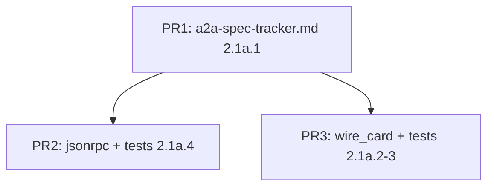

# WP2.1a：A2A 规范锚点 + Agent Card（Well-Known）+ JSON-RPC 2.0 通用层 — 实现计划

本文档将 [phase-2-plan.md](./phase-2-plan.md) 中 **WP2.1a**（从 **WP2.1 / D2** 拆出的**前置切片**）落实为可执行任务。
**WP2.1a** 交付：**可追溯的规范文档**、**发现面（Agent Card）与官方 JSON 的双向映射**、**与 A2A 业务方法无关的 JSON-RPC 2.0 信封编解码**。
**不交付**：任务类 JSON-RPC `method` 实现、`AgentTask` / `AgentMessage` / `AgentArtifact` 的 wire 映射、SSE 帧与任务事件载荷（属 **WP2.1** 主体，见 [phase-2-wp1.md](./phase-2-wp1.md)）。

**文档版本**：0.1
**日期**：2026-04-04
**上游依据**：[phase-2-plan.md](./phase-2-plan.md) v0.3；[plan-detailed.md](./plan-detailed.md) §3.1–3.2（发现、Card、双栈）；[phase-2-wp1.md](./phase-2-wp1.md)（WP2.1 全量 closure 与 PR 顺序）

---

## 1. 在总规划中的位置

| 关系 | 说明 |
|------|------|
| **与 WP2.1** | **WP2.1a DoD 完成后**才在代码中登记 **任意** A2A 任务相关 `method` 字符串或 SSE 任务事件名；WP2.1 的 `wire_mapping`（Task/Message）、`sse_framing` 业务侧、`dispatch_table` 任务 handler 均依赖本切片 |
| **与 WP2.1b–d** | **无直接依赖**；命名上 `1a` 表示 **A2A 链**内子编号，**不是**工具编排 WP2.1b |
| **与 WP2.2** | **不**注册 httplib 路由；仅提供 **可被** `GET /.well-known/...` handler 调用的 **纯函数** 生成 Card JSON 字节串 |
| **与 WP2.4** | `AgentClient::discover_agent` 当前 `GET` 解析 **自定义** JSON；WP2.1a 的 `card_from_a2a_wire` 为 WP2.4 切换发现解析的 **唯一入口**（WP2.4 再改调用点） |
| **与 WP2.6** | 官方 Card JSON **fixture** 可随 WP2.1a 入仓，作为契约测子集 |

---

## 2. 目标与非目标

### 2.1 目标（DoD）

| 编号 | 能力 | 可验证标准 |
|------|------|------------|
| A1 | **规范锚点文件** | 仓库存在 **[`docs/guides/a2a-spec-tracker.md`](./a2a-spec-tracker.md)**（路径固定），且 **§1 对齐版本**、**§2 传输与 HTTP 绑定**、**§4 Agent Card（Well-Known）** 三章 **非空**；§4 含 **官方顶层键名表** 与 **`AgentCard` 字段 ↔ 官方键** 逐字段映射表（未知键策略：**忽略** 或 **放入 `extensions` 类结构** — **在 tracker 二选一字面写明**） |
| A2 | **Card wire 编解码** | `include/agent/a2a/wire_card.hpp` + `src/a2a/wire_card.cpp`（或合并名 `wire_mapping` 中 **仅 Card 部分**，但 **翻译单元** 须可单独链入测试目标）：`json agent_card_to_a2a_wire(const AgentCard&)`、`AgentCard agent_card_from_a2a_wire(const json&)`；**不修改** `AgentCard` 成员语义；若官方键与现有 `AgentCard::to_json()` **不一致**，**wire 函数**为准，`to_json()` 可保留兼容直至 WP2.4 文档声明废弃 |
| A3 | **Well-Known 载荷** | tracker 写明 **精确路径**（如官方规定的 `/.well-known/...`）；提供 `std::string agent_card_discovery_json_string(const AgentCard&)`（内部 `to_a2a_wire` + `dump()`），**UTF-8**、**无 BOM**；`Content-Type` 由 WP2.2 设为 `application/json` |
| A4 | **JSON-RPC 2.0 通用层** | 与 [phase-2-wp1.md](./phase-2-wp1.md) **§5** 同构：`include/agent/a2a/jsonrpc.hpp` + `src/a2a/jsonrpc.cpp`，实现 **parse**、**make_success**、**make_error**、`id` 为 **number | string**、**notification 不支持**、**batch 不支持** 的 **固定策略**（与 WP2.1 tracker **同文引用**，避免重复矛盾） |
| A5 | **单测** | 见 §8；**默认无网络** |

### 2.2 非目标

- `AgentTask` / `AgentMessage` / `AgentPart` / `AgentArtifact` 的 A2A wire（**WP2.1**）。
- `sse_framing.hpp/cpp`（**WP2.1**）。
- `dispatch_table` 注册具体 A2A 业务方法（**WP2.1**）；WP2.1a 允许 **单元测内** 注册 **假方法** `echo` 仅用于验证 dispatch+jsonrpc 集成时，该测试文件 **不得** 进入生产路由。
- TLS、Bearer、API Key（**WP2.5**）。
- `httplib::Server::Get` 真实绑定（**WP2.2**）。

---

## 3. 任务分解（与 phase-2-plan 对齐）

下列 ID 供 [phase-2-plan.md](./phase-2-plan.md) **§4 WP2.1a** 引用。

| ID | 任务 | 产出 | 验收 |
|----|------|------|------|
| **2.1a.1** | **tracker 初稿（Card + 绑定）** | `a2a-spec-tracker.md` 含 §1、§2、§4、§6 骨架、§7 修订记录；§3 JSON-RPC **方法表** 可为空表头 + 一行备注「由 WP2.1 填充」 | Code review：路径与章节标题与 [phase-2-wp1.md](./phase-2-wp1.md) §4 清单 **兼容**（不删 §4 Card 要求） |
| **2.1a.2** | **AgentSkill 若出现在官方 Card 中** | 映射表含 `AgentSkill` ↔ 官方 skill 对象；`wire_card` 实现 **skills** 数组双向转换 | 单测：含 0 个 / 1 个 / 多个 skill 的 round-trip |
| **2.1a.3** | **wire_card 实现** | `agent_card_to_a2a_wire` / `agent_card_from_a2a_wire` | 单测 **C-1–C-3**（§8.2） |
| **2.1a.4** | **jsonrpc 通用实现** | `jsonrpc.hpp/cpp` | 单测 **JR-1–JR-7** 与 [phase-2-wp1.md](./phase-2-wp1.md) §8.1 **一致** |
| **2.1a.5** | **CMake 与库链接** | `AGENT_SOURCES` 增加 `src/a2a/jsonrpc.cpp`、`src/a2a/wire_card.cpp`（或等价路径）；测试目标 `test_a2a_wp21a` 或拆分多个 `test_a2a_*` | `ctest` 通过 |

---

## 4. `a2a-spec-tracker.md` 在 WP2.1a 必须写死的条目

实施顺序：**先合并 tracker PR（2.1a.1），再合并实现 PR（2.1a.2–5）**。下列条目 **不允许** 仅存在于代码注释而不在 tracker 出现。

1. **对齐版本**：规范名称、版本/commit、日期、官方 URL（至少一条主文档链接）。
2. **HTTP 绑定**：JSON-RPC 单一路径 vs 多路径 — **选定**；Well-Known Card 的 **path**（完整字符串）。
3. **Agent Card JSON**：每个官方必填/可选字段；与 `agent_framework::AgentCard` 的列映射（含 `api_endpoint`、`capabilities`、`authentication_scheme`）。
4. **扩展字段**：若官方允许扩展，是否使用 `x-` 前缀或嵌套对象 — **写死**。
5. **JSON-RPC 策略**：notification、batch、缺 `id` — **与 phase-2-wp1 §5 一致的一段可复制条文**（避免 wp1 / wp1a 文档漂移）。
6. **与当前 `AgentClient::discover_agent` 的差异**：当前 `GET` 期望 body 形状 vs 官方 Card — **一行表格** 即可，详细迁移在 **WP2.4**。

---

## 5. API 形状（建议签名，实现可微调但语义不变）

### 5.1 命名空间

统一 `namespace agent_framework::a2a`（或顶层 `agent_framework` + `a2a_` 前缀；**全仓与 WP2.1 后续文件一致**）。

### 5.2 Card

```cpp
// wire_card.hpp（摘录，非最终代码）
nlohmann::json agent_card_to_a2a_wire(const AgentCard& card);
AgentCard agent_card_from_a2a_wire(const nlohmann::json& j);
std::string agent_card_discovery_json_string(const AgentCard& card);
```

- `discovery_json_string`：**紧凑**或 **缩进**由单测 fixture 决定；**至少**保证 `json::parse` 后与 `agent_card_to_a2a_wire` 语义一致。
- **错误**：`from_a2a_wire` 遇缺 **tracker 标明必填** 的键 → 抛 `std::invalid_argument` 或返回 `std::optional<AgentCard>` — **在头文件 Doxygen `@throws` 写死一种**。

### 5.3 JSON-RPC

与 [phase-2-wp1.md](./phase-2-wp1.md) §3.1、§5 一致；建议类型名：`JsonRpcRequest`, `JsonRpcResponse`, `JsonRpcErrorCode`（整数常量）。

---

## 6. 与现有代码的衔接点（只读清单）

| 文件 | 现状 | WP2.1a 动作 |
|------|------|-------------|
| [`types.hpp`](../../include/agent/core/types.hpp) | `AgentCard`, `AgentSkill`, `to_json`/`from_json` | **不删**；`wire_card` **调用** `from_json` **仅当** 官方键与现有实现 **已对齐** 时可选；否则 **独立键名映射** |
| [`agent_client.cpp`](../../src/agent_client/agent_client.cpp) | `discover_agent`：`GET` + `AgentCard::from_json(body)` | **不改**（WP2.4）；WP2.1a 单测 **模拟** 官方 body 调 `agent_card_from_a2a_wire` |
| [`agent_server.cpp`](../../src/agent_server/agent_server.cpp) | `handle_well_known_agent_card` 使用 `agent_card_.to_json()` | **不改**（WP2.2）；备注：上线 A2A 时改为 `agent_card_discovery_json_string` 或 `agent_card_to_a2a_wire` |

---

## 7. PR 提交顺序



- **允许** PR2 与 PR3 **并行**（不同作者），**禁止**在无 tracker §4 定稿前合并 PR3 的生产映射逻辑（避免返工）。
- **推荐** PR1 进入主分支后再开 PR2/PR3。

---

## 8. 测试计划

### 8.1 JSON-RPC（与 WP2.1 共享矩阵）

复制 [phase-2-wp1.md](./phase-2-wp1.md) §8.1 用例 **JR-1–JR-7**；实现可放在 `tests/test_a2a_jsonrpc.cpp`，由 **WP2.1** 后续 **扩展** 同一文件或并列测试二进制 — **不得** 删除 WP2.1a 已覆盖用例。

### 8.2 Card wire `test_a2a_wire_card.cpp`

| 用例 | 步骤 | 期望 |
|------|------|------|
| **C-1** | 最小合法 `AgentCard`（name + description + provider + api_endpoint 等 **tracker 规定的最小集**） | `to_wire` → `from_wire` 后 **业务字段** 相等（字符串逐字相等） |
| **C-2** | 官方/社区 **fixture** `fixtures/a2a/card_min.json`（入仓） | `from_a2a_wire` 不抛；再 `to_wire` 后 **与规范允许的规范化形式** 一致（可用 `json` 深度比较忽略键序） |
| **C-3** | 缺必填字段的 JSON | 与头文件声明一致：**抛** 或 **空 optional** |

### 8.3 Tracker 存在性（可选门禁）

- 轻量测试：读取 `docs/guides/a2a-spec-tracker.md`，断言包含固定二级标题字符串（如 `## 4.` 或 `## Agent Card` — **与 tracker 最终标题一致后写死**），防止误删。

---

## 9. 验收清单（DoD）

- [ ] `a2a-spec-tracker.md` 满足 §4 与本文件 §4 条目。
- [ ] `jsonrpc.cpp` 合并，`JR-1–JR-7` 全绿。
- [ ] `wire_card` 合并，`C-1–C-3` 全绿。
- [ ] CMake 已注册源文件与测试。
- [ ] [phase-2-wp1.md](./phase-2-wp1.md) 顶部 **依赖** 一句：「**须先完成 WP2.1a**」— 若 WP2.1 文档尚未写此句，在 WP2.1a 合并时 **追加 PR** 更新 `phase-2-wp1.md` §1 或 §10。

---

## 10. 相关链接

- [phase-2-plan.md](./phase-2-plan.md)
- [phase-2-wp1.md](./phase-2-wp1.md)
- [plan-detailed.md](./plan-detailed.md) §3
- [architecture/overview.md](../architecture/overview.md)

---

## 11. 修订记录

| 日期 | 版本 | 说明 |
|------|------|------|
| 2026-04-04 | 0.1 | 初稿：WP2.1a 边界、任务 ID、tracker 必写项、API、测试、PR 顺序 |
