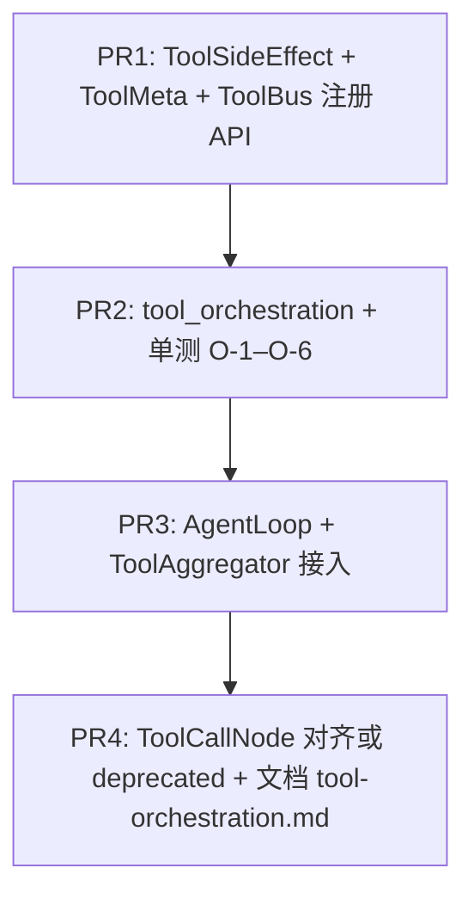

# WP2.1b：工具编排（只读并行 + 写串行 + 并发上限）— 实现计划

> **历史计划**：本文保留设计过程；文内 checkbox 是当时的验收草案，不代表当前实现状态。当前事实、源码与 CTest 证据统一以 [phase-3-status.md](./phase-3-status.md) 为准。

本文档将 [phase-2-plan.md](./phase-2-plan.md) **§4 WP2.1b** 与交付项 **D7** 中属于「**编排与并发**」的部分（不含结果截断、不含调用前 hook）落实为可执行任务。

**WP2.1b 交付**：可配置的 **读工具并行**（带 **全局并发上限**）、**写工具与未知类工具串行**、与现有 **`ToolBus::call_tool` + `AGENT_TOOL_ALLOWLIST`** 路径兼容；**`AgentLoop` / `ToolAggregator` 与可选 `ToolCallNode`** 共用同一编排实现；**文档化** 内建/MCP 工具的读/写分类表。

**不交付**：工具返回体大小截断与外置引用（**WP2.1c**）；allow / deny / 改参 hook（**WP2.1d**）；与 hook 组合的完整策略矩阵（**WP2.1d** 文档）。

**文档版本**：0.1
**日期**：2026-04-04
**上游依据**：[phase-2-plan.md](./phase-2-plan.md) v0.3；[plan-detailed.v2.md](./plan-detailed.v2.md) §6.1（WP2.1b DoD）；[deep_dive_execution.md](../agents/deep_dive_execution.md) §1.2（当前串行现状）

---

## 1. 在总规划中的位置

| 关系 | 说明 |
|------|------|
| **与 WP2.0** | **D7 全量**建议在 `GraphExecutor::execute` 统一入口联调；WP2.1b **可独立合并**，默认关闭并行时行为与现网 **逐字一致** |
| **与 WP2.1a / WP2.1** | **无依赖**；工具编排属 **ToolBus + AgentLoop**，与 A2A 线协议正交 |
| **与 WP2.1c** | 并行只改变 **调度**；**不**改变单工具返回 JSON 大小；1c 在 `call_tool` 之后或渲染前截断 |
| **与 WP2.1d** | 本 WP **不**新增 hook；所有工具调用 **仍**经 `ToolBus::call_tool`，以便 1d 在单点挂 hook |
| **与 `AGENT_TOOL_ALLOWLIST`** | **不**绕过：每次 `call_tool(name, …)` 仍走 allowlist；并行仅 **同时** 发起多个已允许的 `call_tool` |

---

## 2. 现状（只读，作为基线）

| 位置 | 行为 |
|------|------|
| [`agent_loop_node.cpp`](../../src/node/agent_loop_node.cpp) `body_func` | 注释 `// tools (sequential)`：`for (c : calls) toolbus->call_tool(...).get()` |
| 同文件 `ToolAggregator` | 同样 **顺序** `call_tool` |
| [`tool_call_node.cpp`](../../src/node/tool_call_node.cpp) `create_parallel` | 对 **整表** `call_list` **无差别** `std::async`+`get` 并行，**无**读/写分类、**无**并发上限 |
| [`types.hpp`](../../include/agent/core/types.hpp) `ToolMeta` | 仅 `name` / `schema` / `description`，**无**副作用类别字段 |
| [`types.hpp`](../../include/agent/core/types.hpp) `ToolInfo` | 含 `is_heavy`、`is_io_bound` 等，**与读/写语义正交**，本 WP **不**复用为写工具判定 |

---

## 3. 语义定义（固定，避免实现歧义）

### 3.1 工具类别 `ToolSideEffect`

在 **`agent_framework` 公共头** 引入枚举（名称可微调，语义锁定）：

```cpp
enum class ToolSideEffect {
    Unknown = 0,   // 编排上视为 Write（串行），见 3.2
    ReadOnly = 1,  // 无持久化副作用，可进入并行读组
    Write = 2      // 任意写状态、副作用或不可逆操作，必须串行
};
```

### 3.2 默认策略

- **`Unknown`**：**一律按 `Write` 处理**（串行）。保证未改注册代码时行为与今日一致（除显式打开并行且工具标为 `ReadOnly` 外）。
- **MCP / 动态工具**：若注册时未提供类别，**`Unknown` → 串行**。

### 3.3 「写」的判定边界（文档 + 代码注释）

下列 **必须** 归类为 **`Write`**（在 `docs/guides/tool-orchestration.md` 用表格列出工具名）：

- 修改文件系统、进程、网络监听、远程资源创建/删除/更新（含 `fs_write`、`run_skill_script`、MCP 工具名含 `write`/`delete` 等 **除非** 人工审阅标为只读查询）。
- **`web_fetch` / `web_search` 等**：默认 **`ReadOnly`**（仅出站 GET/查询）；若某封装会写缓存盘且与并发冲突，该封装在注册时标 **`Write`** 或 **`Unknown`**。

**读组并行时的安全假设**：多个 `ReadOnly` 工具 **可交换顺序执行**；若某工具在实现上依赖进程内可变缓存且非线程安全，注册方 **必须** 标 `Unknown` 或 `Write` 或加工具内锁（**超出 WP2.1b**，仅在编排文档 §「工具作者责任」一段说明）。

### 3.4 编排顺序与 LLM 可见历史

- **`CallSpec` 顺序**为权威顺序：写入 `history` 的 **tool 消息顺序**必须与 **LLM 返回的 `tool_calls` 顺序**一致。
- **实现要求**：并行执行时按 **索引** 写入 `std::vector<json> results(n)`（或等价），全部完成后 **按 `i = 0..n-1`** 推入 `Message` / `tool_msgs`。

### 3.5 与 `max_tool_calls_per_iteration` 的关系

- **不变**：仍先 `resize`/`truncate` `calls` 再编排；并行 **不** 增加调用个数上限。

### 3.6 与 `guard_repeat_tool_in_iteration` 的关系

- **不变**：在发起 **任一** 工具调用（含并行读组）之前，对 **每个** `CallSpec` 按 **原顺序** 执行与现逻辑一致的 **repeat 检测**；一旦触发 guard，**中止后续所有** 调用并设置 `is_final`（与当前 `break` 语义一致）。

---

## 4. 配置模型（无疑点优先级）

下列 **从高到低** 覆盖（后者仅在前者「未显式设置」时生效）；实现时在 `tool_orchestration` 或 `AgentConfig` 加载处 **单一函数** `resolve_tool_orchestration_options(...)` 完成，并 **单测** 优先级。

| 来源 | 字段 / 变量 | 语义 |
|------|-------------|------|
| **`AgentConfig`** | `bool enable_parallel_read_tools` | 默认 **`false`**：整轮迭代 **完全串行**（与现状一致） |
| **`AgentConfig`** | `int max_parallel_read_tools` | 默认 **`4`**；**有效范围** `>= 1`；非法值回退到 **`1`**（等价串行） |
| **环境变量** | `AGENT_TOOL_PARALLEL_READS` | 未设置：**不覆盖** `AgentConfig`；`0`/`false`/`off`/`no`：**强制关闭**并行读；`1`/`true`/`on`/`yes`：**强制开启**（覆盖 `enable_parallel_read_tools`） |
| **环境变量** | `AGENT_TOOL_MAX_PARALLEL` | 若设为合法正整数，覆盖 `max_parallel_read_tools`（仍受「并行关闭」钳制） |

**CLI / 测试**：沿用各测试的 `ENVIRONMENT` 清空或显式设置，避免继承 shell 的 `AGENT_TOOL_*`（与现有 `AGENT_TOOL_ALLOWLIST=` 做法一致）。

---

## 5. 算法：单轮 `calls` 的调度（伪代码级）

输入：`std::vector<CallSpec> calls`（已截断到 `max_tool_calls_per_iteration`）、`ToolBus&`、`ToolSideEffect (*classify)(string name)` 或 `toolbus.get_side_effect(name)`、选项 `parallel_on`、`max_parallel`。

1. `i = 0`
2. While `i < calls.size()`:
   - 若 `!parallel_on`：对 `calls[i]` 单独 `call_tool`、存 `results[i]`、`i++`，continue。
   - 若 `parallel_on`：
     - 若 `classify(calls[i].name) != ReadOnly`：单独串行 `call_tool`，`i++`。
     - 否则：令 `j = i`，while `j < calls.size()` 且 `classify(calls[j].name)==ReadOnly`：`j++`。切片 `[i,j)` 为 **读组**。
       - 使用 **滑动窗口 / 信号量**：同时 **in-flight** 的 future 数 `<= max_parallel`；可用 **线程池大小 = max_parallel** 或 **std::counting_semaphore**（C++20）或 **手动队列 + condition_variable**（C++17）。
       - 组内每个索引 `k` 的 future 完成后将 JSON 写入 `results[k]`。
       - `i = j`。

**禁止**：为读组启动 **无上限** 的 `std::async`（与 `create_parallel` 现状相同的问题）。

---

## 6. 代码交付物（路径与职责）

| 路径 | 职责 |
|------|------|
| `include/agent/core/types.hpp` | `enum class ToolSideEffect`；`tool_side_effect_from_string(std::string_view)`（可选，供配置） |
| `include/agent/toolbus/toolbus.hpp` | `ToolOrchestrationOptions`、`resolve_tool_orchestration_options`、`ToolSideEffectResolver`、`execute_tool_calls_sequenced`（与 `ToolBus` 同头文件） |
| `src/toolbus/tool_orchestration.cpp`（或 `src/node/tool_orchestration.cpp`） | `std::vector<json> execute_tool_calls_sequenced(std::shared_ptr<ToolBus> bus, const std::vector<CallSpec>& calls, const ToolOrchestrationOptions&, SideEffectResolver)`；**副作用解析器**签名：`ToolSideEffect(std::string_view tool_name)`，由调用方传入 lambda：内部 `bus->get_tool_meta(name)` 读元数据 |
| `include/agent/core/types.hpp` | 在 **`ToolMeta`** 增加 `ToolSideEffect side_effect = ToolSideEffect::Unknown;`（或 `std::optional` + 默认 unknown）— **与 JSON 导出无关字段**，`export_as_llm_tools` **不**需把该字段发给 LLM（避免污染 OpenAI schema） |
| `include/agent/toolbus/toolbus.hpp` / `toolbus.cpp` | `register_local_tool` / MCP 注册路径：允许传入 `ToolSideEffect` 或从 `ToolMeta` 读取；`get_tool_meta` 已存在，返回结构 **含** `side_effect` |
| `src/node/agent_loop_node.cpp` | `body_func` 与 `ToolAggregator`：**替换** 裸 `for` 为 `execute_tool_calls_sequenced`（或内联薄封装），传入 **repeat guard 前置** 已通过的 `calls` |
| `src/node/tool_call_node.cpp` | `create_parallel`：**改为** 调用同一编排函数且 **默认选项为关闭并行**；或 **弃用** 并在头文件 `@deprecated` 指向编排 API（二选一在 PR 描述写明；**推荐** 复用编排 + `parallel_on` 由调用方传入） |
| `src/graph_executor/cli_agent_graph.cpp`（及任何构造 `AgentConfig` 处） | 从 env 合并 `ToolOrchestrationOptions`（若尚未集中在 `resolve`） |
| `docs/guides/tool-orchestration.md` | §读/写分类表（内建工具名清单）；§环境变量；§与 allowlist 关系；§工具作者如何登记 `ReadOnly` |

**CMake**：将 `tool_orchestration.cpp` 加入 `AGENT_SOURCES`；新增测试目标见 §8。

---

## 7. 内建工具分类表（须在 `tool-orchestration.md` 落地）

下列为 **初始建议**，合并 PR 时与 `register_local_tool` 实际名称 **逐字核对**；错误分类视为 **缺陷**。

| 工具名（示例） | 建议 `ToolSideEffect` | 备注 |
|----------------|----------------------|------|
| `web_search`, `web_fetch`, `web_rss_feed`, `web_fetch_archive`, `web_configured_source` | `ReadOnly` | 受 `AGENT_WEB_*` 约束；不写项目工作区 |
| `expr_eval`, `expr_validate`, `expr_batch_eval` | `ReadOnly` | 纯内存 |
| `fs_read` / `fs_list` 等只读 fs 工具（若存在） | `ReadOnly` | 以 [builtin-fs-tools.md](./builtin-fs-tools.md) 为准 |
| `fs_write` / 删除 / 移动类 | `Write` | |
| `run_skill_script` | `Write` | 子进程副作用 |
| `news_sources` 类只读目录 | `ReadOnly` | 若实现为读配置 |

MCP 工具：默认 **Unknown → 串行**；可选在 `mcp.json` 导入时增加映射（**阶段 3 或 WP2.1b 扩展**，本 WP **可选**：若不做 JSON 映射，仅文档写明「MCP 默认串行」）。

---

## 8. 测试计划

### 8.1 单元测试 `tests/test_tool_orchestration.cpp`

| ID | 场景 | 期望 |
|----|------|------|
| **O-1** | `parallel_off`，3 个 `ReadOnly` mock | `call_tool` **调用顺序** 与 `calls` 一致；各 1 次 |
| **O-2** | `parallel_on`，`max_parallel=2`，4 个慢 `ReadOnly` mock（如 `sleep 50ms`） | 墙钟时间 **明显短于** 串行 200ms（例如 `< 150ms` 量级，容差在测试中写死） |
| **O-3** | `ReadOnly, ReadOnly, Write, ReadOnly`，`parallel_on` | 前两并行或顺序完成后再 **单独** Write，再 **单独** 最后一个 Read；**history 顺序** 仍为 4 条且与 calls 索引对齐 |
| **O-4** | 两个 `Write` mock | **绝不**同时处于执行中（可用原子计数器 `active_writes <= 1`） |
| **O-5** | `AGENT_TOOL_PARALLEL_READS=0` 覆盖 `AgentConfig` 开启 | 行为同 O-1 |
| **O-6** | `Unknown` 工具夹在两个 `ReadOnly` 之间 | 三个串行段：`Read` 组为空或单独处理—具体：`**Unknown` 打断读组**，前一段读可并行、Unknown 串行、后一段读可并行 |

### 8.2 集成 / 回归

| ID | 场景 | 期望 |
|----|------|------|
| **I-1** | 现有 `test_agent_loop_wp5` 或等价（**不**设并行 env） | **行为不变**（输出或步数与基线一致） |
| **I-2** | 新测或扩展现有测：`AGENT_TOOL_PARALLEL_READS=1` + mock LLM 返回 2×只读工具 | 两轮 tool 消息顺序正确、无崩溃 |

### 8.3 CTest

- `add_test(NAME tool_orchestration ...)`；默认 `ENVIRONMENT` 含 `AGENT_TOOL_ALLOWLIST=`（若测试注册工具）与 **`AGENT_TOOL_PARALLEL_READS=` 清空** 除非用例专测覆盖。

---

## 9. PR 提交顺序



---

## 10. 验收清单（DoD）

- [ ] 默认配置下（并行关闭）现有 AgentLoop 相关测试 **无回归**。
- [ ] `tool-orchestration.md` 已合并，含读/写表与环境变量。
- [ ] 单测 **O-1–O-6** 全绿；集成 **I-1** 绿；**I-2** 绿或记为后续 PR（若拆 PR，**I-2** 不得无限期悬空，最迟与 P3 同合并）。
- [ ] `ToolBus::call_tool` 仍为 **唯一** 执行入口（便于 WP2.1d）。

---

## 11. 相关链接

- [phase-2-plan.md](./phase-2-plan.md)
- [plan-detailed.v2.md](./plan-detailed.v2.md) §6.1
- [phase-1-wp2.md](./phase-1-wp2.md)（ToolBus / allowlist）
- [deep_dive_execution.md](../agents/deep_dive_execution.md)
- [tool_call_node.hpp](../../include/node/tool_call_node.hpp)
- [agent_loop_node.cpp](../../src/node/agent_loop_node.cpp)

---

## 12. 修订记录

| 日期 | 版本 | 说明 |
|------|------|------|
| 2026-04-04 | 0.1 | 初稿：语义、配置优先级、算法、文件清单、测试与 PR 顺序 |
