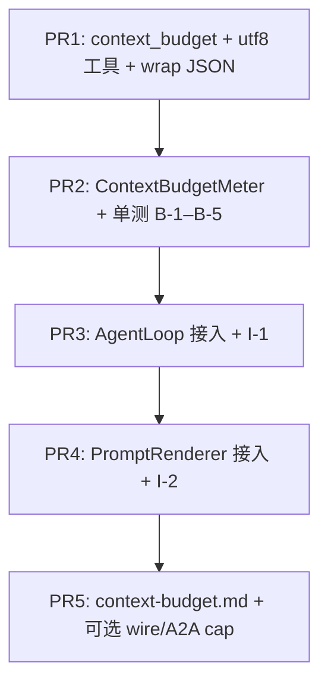

# WP2.1c：工具结果与用户注入上下文预算（截断 + 外置引用元数据）— 实现计划

本文档将 [phase-2-plan.md](./phase-2-plan.md) **§4 WP2.1c** 与交付项 **D7** 中「**工具结果预算 + `@file`/`@url` 物化块计入预算**」、以及 **2.1c.1 截断/外置** 落实为可执行任务。

**WP2.1c 交付**：对 **`nlohmann::json` 工具返回值**与 **进入 `LLMInput` 的文本类载荷**（`user_prompt`、`context`、`skill_block` 等）在 **UTF-8 字节粒度**上实施 **可配置上限**；超限时 **不抛致命异常**、**不使进程/RPC 序列化失败**；输出带 **稳定可解析的 `_af_*` 元数据**；可选 **外置引用**（磁盘 spill 或仅内存 ref，见 §5）；与 **WP2.7** 预处理层通过 **明确 API** 联动。

**不交付**：调用前 allow/deny/改参 hook（**WP2.1d**）；`@file`/`@url` **语法与 Tier A 校验**（**WP2.7**）；基于子 LLM 的智能摘要（可记为阶段 3 或 WP2.9 扩展）；**Verifier**（**WP2.8**）。

**文档版本**：0.1
**日期**：2026-04-04
**上游依据**：[phase-2-plan.md](./phase-2-plan.md) v0.4；[plan-detailed.v2.md](./plan-detailed.v2.md) §5.1、§6.1（WP2.1c）；[phase-2-wp1b.md](./phase-2-wp1b.md)（与编排层衔接顺序）

---

## 1. 在总规划中的位置

| 关系 | 说明 |
|------|------|
| **与 WP2.1b** | 工具 **先** 执行并返回完整 JSON（各工具自有上限如 `AGENT_WEB_MAX_RESPONSE_BYTES` 仍存在）；WP2.1c 在 **进入 `history` / 渲染 / 对外序列化** 前 **二次** 收紧，防止多工具叠加撑爆上下文或 HTTP 体 |
| **与 WP2.7** | **Tier A** 负责路径/URL/语法；物化出的正文 **在写入 `LLMInput` 前** 必须调用本 WP 的 **`BudgetMeter::consume_injection(bytes)`** 或 **`apply_text_budget(...)`**；[phase-2-plan.md](./phase-2-plan.md) **2.7.3** 写明「计入 WP2.1c 预算」— **接口契约在本文件 §6 固定** |
| **与 WP2.1 / WP2.2（A2A）** | JSON-RPC / SSE 在序列化 `AgentMessage` / `AgentTask` 前，对 **嵌套大字符串** 调用同一套 **budget 工具**，避免 **单帧过大** 导致对端或网关断开（实现可在 WP2.2 接线，**规则与库**在 WP2.1c 交付） |
| **与 WP2.9** | **压缩**与 **截断** 并存时：**压缩优先尝试**（WP2.9）；若跳过压缩或失败，**回退到本 WP 截断**（与 [phase-2-plan.md](./phase-2-plan.md) **2.9.3** 一致） |

---

## 2. 现状（只读）

| 位置 | 现状 |
|------|------|
| [`agent_loop_node.cpp`](../../src/node/agent_loop_node.cpp) | `tool_result` **原样** `push_back` 到 `history` |
| [`history_formatter.cpp`](../../src/prompt_renderer/history_formatter.cpp) | `tool_result->dump()` **无** 大小上限 |
| [`prompt_renderer.cpp`](../../src/prompt_renderer/prompt_renderer.cpp) `truncate_prompt` | 读取 `max_tokens_map_` 后 **`(void)budget; return rendered;`**，**未实现截断** |
| [`web_fetch` / `fs_read` 等](../../src/toolbus/) | 各自 **工具内** 字节上限与 `truncated` 标志；**无** 跨工具、跨注入的统一账户 |
| `AgentServer` / SSE | 大块 JSON **未** 统一裁剪（与 2.1c.1「RPC/SSE 不因巨包失败」存在差距） |

---

## 3. 计量单位与截断语义（固定）

### 3.1 单位

- 一律 **`std::size_t` UTF-8 字节数**（`std::string::size()` / `dump().size()`）。
- **不在 v1 做 token 计数**（避免引入 tokenizer 依赖）；注释中说明与 `PromptRenderer::estimate_tokens` 的 **粗略** 关系即可。

### 3.2 UTF-8 安全截断

- 对 **纯文本** 截断到 `max_bytes` 时：若截断点落在多字节字符中间，**回退到上一合法 UTF-8 边界**（实现：自 `max_bytes` 起向前最多 3 字节）。
- 对 **整段 JSON**：优先策略 **A（v1 默认）**：将 `json` **序列化为紧凑 `dump()` 字符串**，对该字符串做 UTF-8 安全截断，再包一层 **合法 JSON 外壳**（见 §4），**不**保证截断后内部仍为原 JSON 结构。

### 3.3 「不失败」定义

- **禁止** 因超长而 `throw` 出 `AgentLoop` / `PromptRenderer` 主路径（除非 **显式配置** `AGENT_CONTEXT_BUDGET_STRICT=1` 时仅 **记录并拒绝本轮 LLM 调用** — **可选**，默认 **关闭**）。
- **默认**：超长 → **截断或 spill** → 继续执行；错误写入 **`_af_*` 字段** 或日志 `Warn`。

---

## 4. 截断后的 JSON 形状（稳定契约）

工具结果 `json` 经预算裁剪后，**替换为**下列对象之一（实现 **二选一全局固定**，写在 `context-budget.md`）：

**方案 S（推荐，默认）— 包装对象**：

```json
{
  "_af_truncation": {
    "kind": "tool_result",
    "original_utf8_bytes": 1234567,
    "kept_utf8_bytes": 65536,
    "spill": false,
    "ref": ""
  },
  "preview_text": "……UTF-8 文本，内容为原 dump 的前 kept 字节（可含换行）……"
}
```

- LLM 仍看到 **合法 JSON**；`preview_text` 为 **字符串**，内容为 **原 `dump()` 截断片段**（可非完整 JSON，避免误解析）。
- `kind` 枚举字符串固定：`tool_result` | `user_injection` | `llm_context` | `wire_payload`（供 A2A 复用）。

**方案 T（备选）— 仅顶层工具常用字段保留**：若原结果为 **对象**且 `original_utf8_bytes <= limit`，**不**包装；仅当超限时采用方案 S。

**与现有工具 `truncated` 字段**：保留工具内 `truncated`；**额外**叠加 `_af_truncation` 表示 **框架级** 二次裁剪。

---

## 5. 外置引用（spill）

### 5.1 v1 最小（DoD 可验收）

- `spill: false`，`ref: ""`：**仅** 元数据记录原始大小；**无** 第二数据源。
- 仍满足「RPC/SSE 不因巨包失败」— 因 **线上载体** 已被裁到上限内。

### 5.2 v1 可选（同一 PR 或快速 follow-up）

- 当 `AGENT_CONTEXT_BUDGET_SPILL_DIR` 指向 **已存在目录**（且在 `AGENT_FS_ROOT` 监禁下若适用）：
  - 将 **完整** `dump()` 写入 `ref` 命名文件，例如 `{spill_dir}/af_ctx_{timestamp}_{random8}.json`。
  - `_af_truncation.ref` 填 **相对路径或 `file://` URI**（与文档一致）；`spill: true`。
- **权限**：仅当目录可写；失败 → **回退方案 S**（`spill: false`），**不抛**。

---

## 6. 预算模型：「双帽 + 总帽」（无疑点）

为避免 [plan-detailed.v2.md](./plan-detailed.v2.md)「同一套或显式联动」歧义，v1 **固定为三层限制**（同时满足）：

| 变量（环境 / `AgentConfig.extra_config`） | 含义 | 默认建议 |
|---------------------------------------------|------|----------|
| **`AGENT_BUDGET_MAX_TOOL_RESULT_JSON_BYTES`** | **单个** 工具结果 `dump()` 上限（在进入 `history` 前裁剪） | `1048576` (1MiB) |
| **`AGENT_BUDGET_MAX_INJECTION_BYTES`** | **单次请求** 内，`@file`/`@url` 等物化出的、写入 `LLMInput.context`（或专用注入槽）的 **新增 UTF-8 字节** 上限 | `2097152` (2MiB) |
| **`AGENT_BUDGET_MAX_COMBINED_PROMPT_ATTACH_BYTES`** | **同一轮** 送 LLM 时，`history` 中 **所有 tool 消息** `tool_result` 序列化字节之和 **加上** 本轮 `user_prompt`+`context`+`skill_block` 的 **总** 上限 | `8388608` (8MiB) |

**消费顺序（固定）**：

1. 工具逐个返回 → 对每个 `tool_result` 先应用 **单工具帽**；再累计到 **总帽**；若总帽溢出，**从最早 tool 消息开始** 将 `tool_result` **逐条降级为** 短错误 JSON（`kind: tool_result`, `preview_text` 说明 `combined_budget_exhausted`），直至落入总帽内（**确定性**算法，单测覆盖）。

2. **用户注入**：物化完成后、合并进 `LLMInput` 前，应用 **注入帽**；若超，**从尾部截断** 注入块并加 `_af_truncation` 块插入 `context` 前缀或后缀（**固定前缀** `"\n<!-- af_injection_truncated -->\n"` + JSON 一行，便于 Tier A 识别 — 或仅用 JSON 字段，**二选一字面写进 `context-budget.md`**）。

**合并帽与持久 history**：v1 合并帽在 **`PromptRenderer::render` 内对 history 副本** 生效，**不**写回 `AgentThreadState`；会话 state 仍保留完整 `tool_result`（与 [context-budget.md](./context-budget.md) 一致）。

**`AgentConfig.extra_config` 键名**：与 env **同名去 `AGENT_` 前缀**（实现以此为准）。

---

## 7. 代码交付物

| 路径 | 职责 |
|------|------|
| `include/agent/context_budget/context_budget.hpp` | `ContextBudgetLimits`、`ContextBudgetMeter`、`apply_injection_cap`、`apply_per_tool_result_budget`、`utf8_safe_truncate`、`json_utf8_dump_bytes`、`apply_wire_payload_cap` 等（`AfTruncationKind` 在 `types.hpp`） |
| `src/context_budget/context_budget.cpp` | 方案 S 包装、spill、env/extra_config 解析 |
| `src/context_budget/context_budget_meter.cpp` | 合并帽、注入帽（`<<AF_INJ>>` 分隔合并串） |
| `src/node/agent_loop_node.cpp` | `apply_per_tool_result_budget`（`append_tool_message` 与 `tool_agg`） |
| `src/prompt_renderer/prompt_renderer.cpp` | `apply_injection_cap` + 合并帽副本 + `truncate_prompt` 总消息 dump 帽 |
| `docs/guides/context-budget.md` | §环境变量、§三层帽、§`_af_*` schema、§与 WP2.7 / A2A 的调用点、§与内建工具自有 `truncated` 的关系 |

**WP2.7 衔接**：物化步骤末尾可调用 **`apply_injection_cap`**（`context_budget_meter.hpp`，三字段 UTF-8 注入帽）。

**A2A 衔接**：`wire_mapping` 或 `AgentTask::to_json` 前增加 **可选** `apply_wire_cap(json&, max)`，默认值与 `AGENT_BUDGET_MAX_WIRE_MESSAGE_BYTES`（**新建 env**，默认 4MiB）— 写入 WP2.1c DoD 为 **可选条**，避免阻塞 CLI。

---

## 8. 环境变量一览（实现须完整支持）

| 变量 | 默认 | 说明 |
|------|------|------|
| `AGENT_BUDGET_MAX_TOOL_RESULT_JSON_BYTES` | `1048576` | 单工具结果 |
| `AGENT_BUDGET_MAX_INJECTION_BYTES` | `2097152` | 单次注入物化 |
| `AGENT_BUDGET_MAX_COMBINED_PROMPT_ATTACH_BYTES` | `8388608` | 本轮合计 |
| `AGENT_CONTEXT_BUDGET_SPILL_DIR` | 空 | 非空则尝试 spill |
| `AGENT_BUDGET_MAX_WIRE_MESSAGE_BYTES` | `4194304` | 可选：A2A 单消息 |
| `AGENT_CONTEXT_BUDGET_STRICT` | `0` | `1` 时超限可拒绝 LLM 调用（可选行为） |

解析规则：**无符号整数**；非法或越界 → **使用默认值** 并 **`Warn` 日志**（不抛）。

---

## 9. 测试计划

### 9.1 单元测试 `tests/test_context_budget.cpp`

| ID | 场景 | 期望 |
|----|------|------|
| **B-1** | `dump()` 长 ASCII | `original_utf8_bytes` / `kept_utf8_bytes` 正确；`preview_text` 长度 ≤ cap |
| **B-2** | 含多字节 UTF-8 | 截断边界不在非法位置；无 `U+FFFD` 替换 **除非** 显式策略（默认 **不** 替换） |
| **B-3** | 单工具帽内、但总帽不足 | 第二件工具结果被降级为短包；顺序符合 §6 |
| **B-4** | `AGENT_CONTEXT_BUDGET_SPILL_DIR` 有效 | `spill: true` 且文件存在、可读；失败回退 `spill: false` |
| **B-5** | env 非法 | 回退默认，进程不崩 |

### 9.2 集成

| ID | 场景 | 期望 |
|----|------|------|
| **I-1** | Mock 工具返回巨大 JSON | AgentLoop 一轮完成；`history` 中 tool 消息可序列化；LLM 请求体大小低于 **总帽 + 合理开销** |
| **I-2** | `PromptRenderer::truncate_prompt` | 在设置极小 `max_tokens_map_` 或专用 **bytes** 配置时，**实际缩短** `rendered.messages`（与当前 stub 对比） |

### 9.3 CTest

- `add_test(NAME context_budget ...)`；`ENVIRONMENT` 清空各 `AGENT_BUDGET_*` 除非用例专用。

---

## 10. PR 提交顺序



---

## 11. 验收清单（DoD）

- [x] **三层帽** 环境变量与默认值实现一致；[`context-budget.md`](./context-budget.md) 已合并。
- [x] 单测 **B-1–B-5** 全绿；集成 **I-1** 绿；**I-2** 绿或与 PR4 同时合入。
- [x] 默认配置下 **不** 改变「小结果」的 JSON 形状（**无** `_af_truncation` 或仅在 `original<=cap` 时原样）。
- [x] WP2.7 详案（后续）可引用 **`apply_injection_cap`** 与 **`ContextBudgetMeter::apply_combined_to_history_slice`**（`context_budget.hpp`）；若需改签名，同步本文件 §7 与 `context-budget.md`。

---

## 12. 相关链接

- [phase-2-plan.md](./phase-2-plan.md)
- [plan-detailed.v2.md](./plan-detailed.v2.md) §5.1、§6.1
- [phase-2-wp1b.md](./phase-2-wp1b.md)
- [history_formatter.cpp](../../src/prompt_renderer/history_formatter.cpp)
- [prompt_renderer.cpp](../../src/prompt_renderer/prompt_renderer.cpp)

---

## 13. 修订记录

| 日期 | 版本 | 说明 |
|------|------|------|
| 2026-04-04 | 0.1 | 初稿：三层预算、包装 JSON、UTF-8 截断、spill、测试与 PR 顺序 |
| 2026-04-05 | 0.2 | WP2.1c 实现落地：DoD 勾选；指向 `context-budget.md` |
