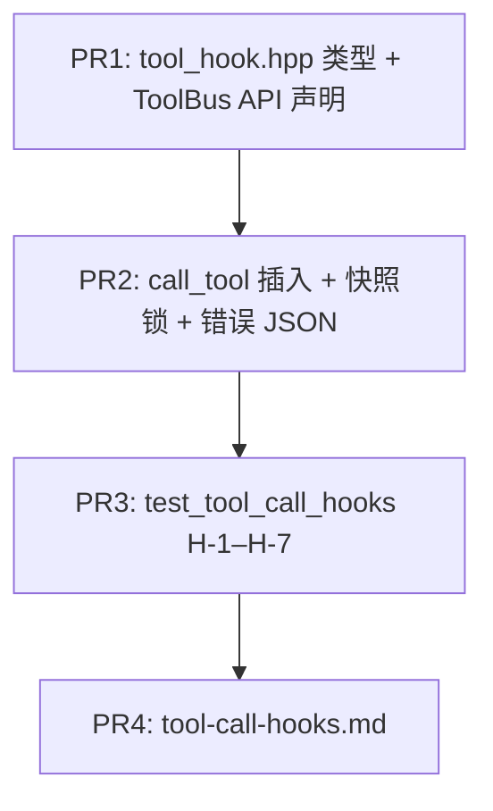

# WP2.1d：工具调用前 Hook（allow / deny / 改参）与 `AGENT_TOOL_ALLOWLIST` 组合策略 — 实现计划

本文档将 [phase-2-plan.md](./phase-2-plan.md) **§4 WP2.1d** 与交付项 **D7** 中「**调用前 hook** + **与 allowlist 文档化 + 单测**」落实为可执行任务。

**WP2.1d 交付**：在 **`ToolBus::call_tool` 单一路径**上插入 **可链式**、**同步** 的 **before-call hook**；支持 **放行**、**拒绝**（返回结构化错误 JSON future）、**改参**（替换 `arguments` 后 **重新** 走 schema 校验）；与现有 **`AGENT_TOOL_ALLOWLIST`** 的 **先后顺序与语义** 文档化并单测覆盖。

**不交付**：异步 hook、子进程 hook、远程策略服务；**WP2.7** `ExecutionContext` 全量注入（v1 仅 **可选** `ToolInvocationContext` 占位字段）；工具结果截断（**WP2.1c**）；读并行编排（**WP2.1b** 已完成则仅声明 **hook 须线程安全**）。

**文档版本**：0.1  
**日期**：2026-04-04  
**上游依据**：[phase-2-plan.md](./phase-2-plan.md) v0.6；[plan-detailed.v2.md](./plan-detailed.v2.md) §6.1；[`toolbus.cpp`](../../src/toolbus/toolbus.cpp)（`call_tool` 顺序）；[phase-2-wp1b.md](./phase-2-wp1b.md)（并行下 hook 并发）

---

## 1. 在总规划中的位置

| 关系 | 说明 |
|------|------|
| **与 WP2.1b** | `call_tool` 可被多线程 **同时** 调用；hook 与 `tools_mutex_` **配合**：hook 列表在 **`hooks_mutex_`** 下快照复制后 **在无锁外** 执行回调，避免死锁；**回调体内禁止** 调用 `register_*` / `add_tool_call_hook` **同线程重入**（文档写明） |
| **与 WP2.1c** | hook 在 **校验与执行之前**；预算裁剪在 **返回之后** 或渲染侧（1c）；**不**在 hook 内强制截断 |
| **与 WP2.7** | 未来可把 `ExecutionContext` 传入 hook；v1 仅 **扩展字段** 预留，避免阻塞 1d |

---

## 2. 现状：`call_tool` 顺序（基线）

[`ToolBus::call_tool`](../../src/toolbus/toolbus.cpp) 当前顺序：

1. `load_allowlist_once`
2. `find_tool(name)` → 不存在则 **`unknown_tool`** future
3. `is_tool_allowed(name)` → 否则 **`tool_not_allowed`** future
4. `validate_tool_arguments(schema, arguments, err)` → 失败则返回 `err` future
5. `tool->call(name, arguments)`

**WP2.1d 插入点（固定）**：在 **步骤 4 之前**、**步骤 3 之后** 执行 **全部 hooks**（见 §4.1）。  
**理由**：工具必须在 allowlist 内才进入 hook；hook 可 **deny** 已允许工具；改参后仍须 **schema 校验**。

---

## 3. Hook 语义（`ToolHookResult`）

### 3.1  verdict 枚举

```cpp
enum class ToolHookVerdict {
    Allow,   // 使用当前参数（可能已被前一 hook 改写）继续
    Deny,    // 不调用工具；返回错误 JSON future
    Replace  // 使用 `replaced_arguments` 完全替换当前参数，再继续链与后续校验
};
```

### 3.2 结果结构（建议）

```cpp
struct ToolHookResult {
    ToolHookVerdict verdict = ToolHookVerdict::Allow;
    /** 当 verdict == Replace 时必填：下一轮 hook 与 schema 校验使用该对象 */
    std::optional<json> replaced_arguments;
    /** Deny 时建议必填 */
    std::string deny_message;
    /** 可选，并入返回 JSON 的 details */
    json deny_details = json::object();
};
```

### 3.3 Hook 函数类型

```cpp
using ToolCallHook =
    std::function<ToolHookResult(const std::string& tool_name, const json& arguments)>;
```

- **同步**：**禁止** 在 hook 内 `wait` 图执行或网络 I/O **超过** 可配置阈值（默认 **不** 限；可选 env **`AGENT_TOOL_HOOK_WARN_MS`** 仅日志）— v1 **仅文档建议**「hook 应轻量」。

### 3.4 链式规则（固定）

- `ToolBus` 维护 **`std::vector<ToolCallHook> hooks_`**（**有序**）。
- 设当前参数 `json current = arguments`（拷贝）。
- 对 `hooks_` **按注册顺序** 逐个调用 `hook(name, current)`：
  - **`Deny`**：立即 **短路**，返回 `make_ready_json_future`：
    - `{"error", deny_message}`，`{"code","hook_denied"}`，`{"details", merged_details}`，`details.hook_index` = 可选
  - **`Replace`**：`current = *replaced_arguments`（**移动**）；若 `replaced_arguments` 缺失或非 object（若 schema 要求 object）— **视为 Deny**，`code: hook_invalid_replace`
  - **`Allow`**：继续下一 hook
- 链结束后：`current` 进入 **`validate_tool_arguments(schema, current, err)`**，再 `tool->call(name, current)`。

### 3.5 Hook 异常

- Hook **抛异常**：默认 **转为 Deny**，`code: hook_threw`，`details.exception: e.what()`（**截断** 至 512 字节 UTF-8）；可选 env **`AGENT_TOOL_HOOK_THROW_ABORT=1`** 时 **`std::terminate` 或 rethrow** — **默认必须为 Deny**，不终止进程。

---

## 4. `ToolBus` API 与线程安全

### 4.1 新增方法（公有）

| 方法 | 语义 |
|------|------|
| `void add_tool_call_hook(ToolCallHook hook)` | 追加到链尾；**非空** `hook`，否则 `invalid_argument` |
| `void clear_tool_call_hooks()` | 清空（测试与 demo） |
| `std::size_t tool_call_hook_count() const` | 只读计数 |

### 4.2 互斥

- **`hooks_mutex_`**（`mutable std::mutex`）保护 `hooks_` 的 **增删清** 与 **`call_tool` 内快照**：
  - `call_tool`：`std::lock_guard` 取 `hooks_` 的 **`vector` 拷贝**（`hooks_copy`），释放锁后遍历 `hooks_copy` 调用。
- **不在** `find_tool` / `tools_mutex_` 持有期间获取 `hooks_mutex_`（当前 `call_tool` 先 `find_tool` 已释放锁 — **保持** 先 `find_tool` 再快照 hooks，避免顺序反转死锁）。

### 4.3 与 `AGENT_TOOL_ALLOWLIST` 组合（文档 §5 必须逐字一致）

| 阶段 | 行为 |
|------|------|
| 未注册工具 | **不** 调用 hook（与现逻辑一致） |
| 不在 allowlist | **不** 调用 hook，直接 `tool_not_allowed` |
| 在 allowlist | **调用** hook；hook **不能** 把「未在 allowlist」的工具变为可调用（工具名不变） |
| 注册阶段 | `register_local_tool` / MCP 仍 **先** allowlist；hook **不参与** 注册 |

**说明**：hook **不得** 修改 `name`；若未来需要别名，**另开 WP**，不在 1d。

---

## 5. 文档交付物

**[`docs/guides/tool-call-hooks.md`](./tool-call-hooks.md)**（新建）须包含：

1. **顺序图**（文字或 Mermaid）：find → allowlist → **hooks** → validate → call  
2. **`ToolHookResult` 字段表**  
3. **与 allowlist** 的交互表（本节 §4.3）  
4. **并行**：WP2.1b 开启时 hook 的 **可重入 / 线程安全** 要求  
5. **示例**：注册一个 hook 把某工具的 `path` 参数前缀 **重写** 为 jail 内路径（**伪代码**）  
6. **错误码**：`hook_denied`、`hook_invalid_replace`、`hook_threw`

---

## 6. 代码交付物

| 路径 | 变更 |
|------|------|
| [`include/agent/types.hpp`](../../include/agent/types.hpp) 或 **`include/agent/tool_hook.hpp`** | `ToolHookVerdict`、`ToolHookResult`、`ToolCallHook` typedef（避免 types.hpp 过大时可独立头文件） |
| [`include/agent/toolbus.hpp`](../../include/agent/toolbus.hpp) | `add_tool_call_hook`、`clear_tool_call_hooks`、`hook_count`；`#include` hook 类型 |
| [`src/toolbus/toolbus.cpp`](../../src/toolbus/toolbus.cpp) | `call_tool` 插入 §3.4 逻辑；错误码常量 |
| [`docs/guides/tool-call-hooks.md`](./tool-call-hooks.md) | 新建 |

**可选**：`getting_started.md` 一句链到 `tool-call-hooks.md`（若维护者希望 discoverability；**非 DoD 硬性**）。

---

## 7. 测试计划

### 7.1 单元 / 集成 `tests/test_tool_call_hooks.cpp`（或扩展现有 `test_toolbus_wp2.cpp`）

| ID | 场景 | 期望 |
|----|------|------|
| **H-1** | 无 hook | 与现有 `call_tool` 行为一致 |
| **H-2** | hook `Deny` | `code == hook_denied`，**未**调用工具函数 |
| **H-3** | hook `Replace` 合法参数 | 工具收到 **替换后** 参数；schema 失败时 **不** call |
| **H-4** | 两 hook：先 Replace 再 Allow | 第二 hook 看到 **已替换** 的 `arguments` |
| **H-5** | 工具 **不在** allowlist | **不** 调 hook（可在 hook 内置 `std::atomic` 计数器验证） |
| **H-6** | hook 抛异常 | 返回 `hook_threw`，**不** 崩溃 |
| **H-7** | `Replace` 缺 `replaced_arguments` | `hook_invalid_replace` 或等价 Deny |

### 7.2 CTest

- `add_test(NAME tool_call_hooks_wp21d ...)`  
- `ENVIRONMENT`：`AGENT_TOOL_ALLOWLIST=` 或按需设为子集，与 H-5 一致。

---

## 8. PR 提交顺序



---

## 9. 验收清单（DoD）

- [ ] **`call_tool` 顺序** 与 §2、§4.3 **一致**（代码注释引用本文件或 `tool-call-hooks.md`）。  
- [ ] **H-1–H-7** 全绿。  
- [ ] **`tool-call-hooks.md`** 已合并且含 allowlist 组合表。  
- [ ] **默认无 hook** 时 **零** 可测行为变化（回归 `test_toolbus_wp2` 等）。  

---

## 10. 相关链接

- [phase-2-plan.md](./phase-2-plan.md)  
- [phase-1-wp2.md](./phase-1-wp2.md)（ToolBus / allowlist）  
- [phase-2-wp1b.md](./phase-2-wp1b.md)  
- [cursor_mcp_json.md](./cursor_mcp_json.md)（MCP 工具名与 allowlist）  
- [toolbus.cpp](../../src/toolbus/toolbus.cpp)  

---

## 11. 修订记录

| 日期 | 版本 | 说明 |
|------|------|------|
| 2026-04-04 | 0.1 | 初稿：Hook 类型、链式规则、顺序、线程安全、测试与 PR |
