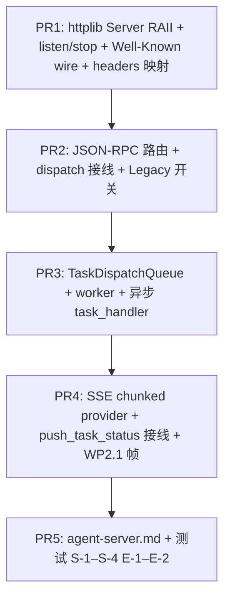

# WP2.2：AgentServer 真实服务（httplib 路由 + 线程模型 + executor 投递）— 实现计划

本文档将 [phase-2-plan.md](./phase-2-plan.md) **§4 WP2.2** 与交付项 **D3** 落实为可执行任务：**真实 `listen`**、**路由表** 与 **`a2a-spec-tracker.md` / WP2.1 Facade 对齐**、**长任务不阻塞 httplib 工作线程**、**状态/Artifact 经 SSE 推送**。

**WP2.2 交付**：`AgentServer::start/stop` 基于 **`httplib::Server`** 可运行；**Well-Known Agent Card**、**JSON-RPC（规范路径）** 与 **可选 Legacy REST** 的 **明确开关**；**任务执行**在 **独立线程 / Taskflow `Executor` / 内部队列+worker** 上运行；**SSE** 使用 **`Response::set_chunked_content_provider`**（或等价 API）长连接写出 **WP2.1 `sse_framing` 帧**；`validate_authentication` **完整传入 headers**（具体 Bearer/API Key 规则属 **WP2.5**）。

**不交付**：任务状态机完备语义、协作式取消、超时策略（**WP2.3**）；`AgentClient` 规范侧切换（**WP2.4**）；认证策略实现（**WP2.5**）；契约快照门禁（**WP2.6**）；**WP2.1c** 预算裁剪（仅 **建议** 在序列化前调用已有 API）。

**文档版本**：0.1
**日期**：2026-04-04
**上游依据**：[phase-2-plan.md](./phase-2-plan.md) v0.5；[plan-detailed.md](./plan-detailed.md) §3 双栈；[phase-2-wp1.md](./phase-2-wp1.md)、[phase-2-wp1a.md](./phase-2-wp1a.md)（线协议与 Card）；`3rd-party/httplib/httplib.hpp`（`set_chunked_content_provider`）

---

## 1. 依赖与并行关系

| 前置 | 说明 |
|------|------|
| **WP2.1a** | Well-Known **路径**与 **Card JSON** 形状；handler 应调用 `agent_card_discovery_json_string` 或 `agent_card_to_a2a_wire`（见 [phase-2-wp1a.md](./phase-2-wp1a.md)），**禁止**长期依赖未对齐的 `AgentCard::to_json()` 作为唯一对外体 |
| **WP2.1** | **JSON-RPC** 单入口 URI、`dispatch_table`、`sse_framing` **事件名与 data**；路由 handler **仅解析 + 分发 + 序列化**，业务逻辑进 `task_handler` |
| **WP2.0** | **理想路径**：`GraphExecutor::execute` 构建并运行与 CLI **同一模板**；若 WP2.2 合入时 `execute` 仍占位，允许 **临时** `std::async` + `build_cli_agent_graph` + 本地 `tf::Executor`（**单一适配函数** `run_agent_task_on_executor(...)`），并在代码中标记 `// WP2.0: replace with GraphExecutor::execute` |

**可与 WP2.1b–1d、WP2.7 并行开发**；**D3** 验收不依赖工具编排与预算，但 **M2**（happy path）建议与 WP2.1、WP2.3 联调。

---

## 2. 现状（只读）

| 资产 | 路径 | 现状 |
|------|------|------|
| `AgentServer` | [`agent_server.cpp`](../../src/agent_server/agent_server.cpp) | `http_server_` **未** `new`；`listen` **未**调用；`setup_routes` **注释**；`task_handler_` **未** `wait`；SSE **注释** |
| Card | `handle_well_known_agent_card` | `agent_card_.to_json()` — 与 WP2.1a **wire** 可能不一致 |
| 认证 | `validate_authentication` | `headers` **空 map**，validator **恒为假通过**（若设置了 validator） |
| SSE 客户端 | [`sse_connection.cpp`](../../src/agent_transport/sse_connection.cpp) | stub；**服务端** SSE **不在此文件** |

---

## 3. 路由与双栈策略（2.2.1）

### 3.1 权威来源

- **规范路径与方法名**：仅以 **[`docs/guides/a2a-spec-tracker.md`](./a2a-spec-tracker.md)**（WP2.1）为准。
- 本文件用 **占位符记号** `{JSON_RPC_PATH}`、`{SSE_SUBSCRIBE_PATH}` 表示「从 tracker 拷贝的字面量」。

### 3.2 环境开关（固定）

| 变量 | 默认 | 语义 |
|------|------|------|
| `AGENT_SERVER_LEGACY_REST` | `0` | `1` 时 **额外** 注册当前注释中的 **`/tasks/send`、`/tasks/get`…** 路径（**自定义 JSON 体**），用于过渡与回归 |
| `AGENT_A2A_STRICT` | `1` | `1` 时 **仅** 注册 tracker 规定的 **JSON-RPC HTTP 绑定**（通常为 **单 POST `{JSON_RPC_PATH}`**）；`0` 时允许同时开 Legacy（与上一行组合） |

**规则**：**生产推荐** `AGENT_A2A_STRICT=1` 且 `AGENT_SERVER_LEGACY_REST=0`。

### 3.3 JSON-RPC handler（骨架）

1. `POST {JSON_RPC_PATH}`：`body` → `parse_jsonrpc_request`（[phase-2-wp1.md](./phase-2-wp1.md)）→ `dispatch` → `serialize_response`；`Content-Type: application/json`。
2. **错误**：Parse error → HTTP **200** + JSON-RPC `error`（与 JSON-RPC over HTTP 常见实践一致）**或** HTTP 400 — **在 tracker §2 选一字面**，全仓统一。

### 3.4 Well-Known

- `GET {WELL_KNOWN_CARD_PATH}`：`200` + `application/json` + **WP2.1a wire** 正文。

### 3.5 与现有 `handle_tasks_*` 的关系

- **不删除** 现有方法体逻辑；**重构**为：
  - **内部** `handle_task_send_core(AgentTask initial, ...)` 返回 `json` 或 `AgentTask`；
  - **Legacy** 路由 = 薄包装（解析 REST JSON → core）；
  - **JSON-RPC** method handler = 薄包装（解析 `params` → core → `result`）。

---

## 4. 线程模型与 executor 投递（2.2.2）

### 4.1 硬约束

- **禁止**在 httplib 处理 `POST /tasks/send`（或 JSON-RPC 等价）的回调线程内：
  - `task_handler_(...).get()` **阻塞至图结束**；
  - 任何 **可能数十秒以上** 的 `future.wait()`。
- **允许**：回调线程内 **仅** 做：校验、建 `AgentTask`、写入 `active_tasks_`、**投递** `std::function<void()>` 到 worker、立即返回 HTTP 响应（**202 Accepted** 或规范规定的 **含 `task_id` 的 JSON**，以 tracker 为准）。

### 4.2 推荐实现：有界队列 + worker 池

| 组件 | 职责 |
|------|------|
| `TaskDispatchQueue` | `std::queue` + `std::mutex` + `std::condition_variable`；元素含 `task_id`、`shared_ptr<GraphBuilder>` 或 **lambda 封装好的 run** |
| `worker_count` | 默认 `std::max(2u, std::thread::hardware_concurrency()/2)`；**环境变量** `AGENT_SERVER_WORKER_THREADS` 覆盖 |
| Worker 线程 | `pop` → 更新任务 `WORKING`（或规范等价状态）→ 调用 **§4.3** `run_agent_task_on_executor` → 完成后更新 `active_tasks_`、调用 **`push_task_status_update`**、（若实现）webhook |

**背压**：队列长度上限 **`AGENT_SERVER_MAX_QUEUED_TASKS`**（默认如 `64`）；满时 **503** 或 JSON-RPC **业务错误码**（tracker 登记）— **二选一字面写进 `docs/guides/agent-server.md`**。

### 4.3 `run_agent_task_on_executor`（单一入口）

**签名（示例）**：

```cpp
void run_agent_task_on_executor(
    AgentServer* self,
    std::string task_id,
    std::function<std::future<AgentTask>(const AgentTask&, std::shared_ptr<workflow::GraphBuilder>)> handler,
    std::shared_ptr<workflow::GraphBuilder> builder
);
```

**步骤**：

1. `std::shared_ptr<tf::Executor> exec`：**成员**或 **静态单例**（进程级一个 Executor，可配置 `N`）。
2. `handler(task_snapshot, builder)` 得 `std::future<AgentTask>`。
3. **在 worker 线程** `future.wait()`；异常 → 任务状态 **FAILED**（WP2.3 可细化），`push_task_status_update` 带错误摘要。
4. 运行期间 **周期性**或 **节点级** 回调（若图内支持）刷新状态 — **v1 可仅在 start/end 推送**，中间推送 **可选** WP2.3。

### 4.4 `GraphBuilder` 生命周期

- **每个任务** 独立 `std::make_shared<workflow::GraphBuilder>(name)`，**不**跨请求共享未完成图。
- 任务结束后 **释放**（`shared_ptr` 离开作用域）。

---

## 5. SSE 服务端（与 WP2.1 对齐）

### 5.1 连接模型

- **弃用**（或重构）当前 `sse_subscribers_` 存 `SSEConnection` 的设计：**服务端**侧应为 **每个 GET 一条 httplib 响应流**。
- 建议新增内部类型 **`SseClientChannel`**：
  - `std::mutex mu`；
  - `std::deque<std::string> pending_frames`（已是 **`append_sse_event`** 输出）；
  - `std::condition_variable cv`；
  - `std::atomic<bool> closed{false}`。

### 5.2 httplib 写法

- `GET {SSE_SUBSCRIBE_PATH}`（query 含 `task_id` 等 — **以 tracker 为准**）：
  - 校验 auth；
  - `res.set_header("Content-Type", "text/event-stream")`；
  - `Cache-Control: no-cache`；`Connection: keep-alive`；
  - **`res.set_chunked_content_provider`**（`3rd-party/httplib/httplib.hpp`）：在 provider 内 **wait** `pending_frames` 非空或 timeout；写出 **整段 UTF-8**；若 `closed` 且队列空则结束 provider。
- **`push_task_status_update`**：根据 `task_id` 找到 **所有** channel，`push_back` **WP2.1 规定** 的 `event` + `data`（**不再**使用硬编码 `"type":"task_status_update"`，除非 tracker 明确等同）。

### 5.3 心跳（可选）

- 若 tracker 要求：每 **30s** 写 `:\n\n` 注释帧；常量 `AGENT_SERVER_SSE_PING_SEC` 可配置。

### 5.4 WP2.1c

- 在 `task.to_json()` / SSE `data` 序列化前 **可选** 调用 `apply_wire_cap`（[phase-2-wp1c.md](./phase-2-wp1c.md) §7），避免超大帧。

---

## 6. 认证与头传递（与 WP2.5 分界）

- **`validate_authentication`**：从 `httplib::Request` **完整**填充 `std::map<std::string, std::string>`（键 **小写** 或与 validator 文档一致）；至少包含 `authorization`、`x-api-key` 等 **原始**值。
- **WP2.2**：若 `auth_validator_` 为空，**默认通过**（保持现状）。
- **WP2.5**：实现 **具体** validator 与 Card 声明一致；**不**在 WP2.2 强制定义 Bearer 解析规则。

---

## 7. 资源与 RAII

- **`http_server_`**：`std::unique_ptr<httplib::Server>`（推荐）或 `new`/`delete` — **二选一字面**；析构 `stop()` 后释放。
- **`start()`**：**阻塞** `listen("0.0.0.0", port_)` — 文档注明调用方宜 **单独线程** `std::thread([&]{ server.start(); })` 或提供 **`start_async()`** 包装（**实现选一种**，`getting_started` 给示例）。
- **停止**：`stop()` 唤醒 **所有** SSE provider；worker **join** 或 **drain** 策略（**固定**：`stop` 先 `queue.close()`，workers 读到哨兵退出）。

---

## 8. 代码与文档交付物

| 路径 | 变更 |
|------|------|
| [`agent_server.hpp`](../../include/agent/agent_server/agent_server.hpp) | 前向声明足够；可增 `start_async`、worker 池成员（`unique_ptr` 实现类 Pimpl 可选） |
| [`agent_server.cpp`](../../src/agent_server/agent_server.cpp) | 完整实现 §3–§7 |
| `include/agent/internal/sse_server_channel.hpp`（可选） | `SseClientChannel` 定义 |
| `docs/guides/agent-server.md` | 监听地址、端口 env（如 `AGENT_SERVER_PORT`）、`AGENT_SERVER_*`、双栈开关、与 WP2.1 tracker 的链接 |

---

## 9. 测试计划

### 9.1 单元 / 组件测试 `tests/test_agent_server_wp22.cpp`（建议）

| ID | 场景 | 期望 |
|----|------|------|
| **S-1** | 起 `httplib::Server` 于 **随机端口**，Background thread `listen` | `GET /health` 或 Well-Known **200** |
| **S-2** | `POST` JSON-RPC **合法** body（fixture） | **200** + `jsonrpc` + `result` 或规范错误体 |
| **S-3** | **慢** `task_handler`（sleep 2s） | HTTP **在 <500ms** 返回（**异步**）；worker 结束后任务状态可查 |
| **S-4** | 两个并发 `POST` 创建任务 | **不**死锁；队列与锁无 data race（ThreadSanitizer 或逻辑单测） |

### 9.2 SSE 测试

| ID | 场景 | 期望 |
|----|------|------|
| **E-1** | 客户端 `GET` SSE（httplib client 或 raw socket） | 收到 **至少一帧** `data:`，解析 JSON 与 WP2.1 **事件名**一致 |
| **E-2** | `push_task_status_update` 后 | 客户端在超时内读到新帧 |

### 9.3 CTest

- `add_test(NAME agent_server_wp22 ...)`；**无监听冲突**（随机端口或 `127.0.0.1:0` 若支持）；`ENVIRONMENT` 清 `AGENT_SERVER_*` 干扰项。

---

## 10. PR 提交顺序



**说明**：若 WP2.1 **尚未**合入，P2/P4 可用 **临时** `dump` 与 **占位 event 名**，但 **合并主分支前**须与 tracker **字面对齐**（WP2.1 DoD）。

---

## 11. 验收清单（DoD）

- [ ] `AgentServer::start` **真实**监听，`stop` 可结束进程内测试。
- [ ] **Well-Known** 返回 **WP2.1a** Card wire（或 strict 模式下拒绝旧形状）。
- [ ] **JSON-RPC** 路径与 **SSE** 路径与 **a2a-spec-tracker** 一致（或 Legacy 关闭时无多余旧路径）。
- [ ] 长任务 **不阻塞** httplib 回调线程（**S-3**）。
- [ ] **SSE** 至少 **E-1**；**push** 与订阅 **E-2**。
- [ ] **`agent-server.md`** 已合并。

---

## 12. 相关链接

- [phase-2-plan.md](./phase-2-plan.md)
- [phase-2-wp1.md](./phase-2-wp1.md)
- [phase-2-wp1a.md](./phase-2-wp1a.md)
- [phase-2-wp1c.md](./phase-2-wp1c.md)（线上一级裁剪）
- [architecture/overview.md](../architecture/overview.md)
- [graph_executor.cpp](../../src/graph_executor/graph_executor.cpp)

---

## 13. 修订记录

| 日期 | 版本 | 说明 |
|------|------|------|
| 2026-04-04 | 0.1 | 初稿：路由、双栈、队列+worker、SSE chunked provider、测试与 PR 顺序 |
