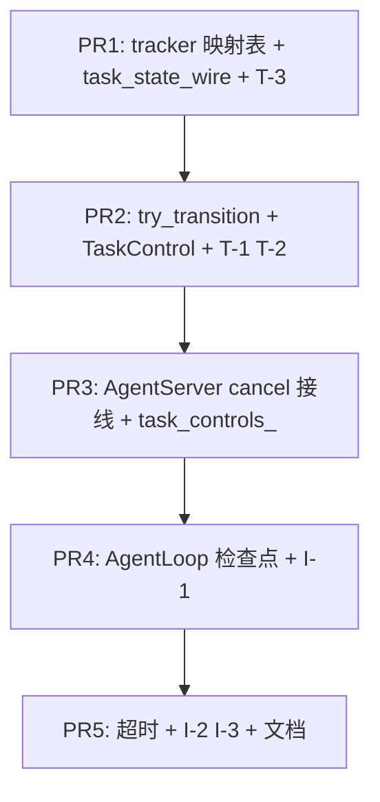

# WP2.3：任务状态机、取消与超时（内部 `AgentTask` ↔ A2A）— 实现计划

本文档将 [phase-2-plan.md](./phase-2-plan.md) **§4 WP2.3** 与交付项 **D2** 中「**任务状态 / 取消 / 超时** 与 A2A 映射」落实为可执行任务。

**WP2.3 交付**：**合法状态迁移**表与运行时校验；**协作式取消**（`cancel` API → 标志位 → 图内可观测点退出）；** wall-clock 超时**（可配置）→ **`FAILED`** 与可序列化原因；**`AgentTaskStatus` ↔ 规范 wire 字符串** 映射写入 **`a2a-spec-tracker.md`** 并由 **`wire_mapping` / `to_json`** 使用；**SSE** 在迁移时推送（与 [phase-2-wp2.md](./phase-2-wp2.md) `push_task_status_update` 衔接）。

**不交付**：强杀 OS 线程或 `pthread_cancel`；**WP2.4** Client；**WP2.5** 鉴权；与取消无关的 **持久化队列**（阶段 3）；**INPUT_REQUIRED** 的完整人机闭环 UI（仅 **状态与 JSON** 就绪即可）。

**文档版本**：0.1  
**日期**：2026-04-04  
**上游依据**：[phase-2-plan.md](./phase-2-plan.md) v0.7；[`types.hpp`](../../include/agent/types.hpp) `AgentTask` / `AgentTaskStatus`；[phase-2-wp1.md](./phase-2-wp1.md)（wire）；[phase-2-wp2.md](./phase-2-wp2.md)（Server worker）

---

## 1. 依赖与边界

| 前置 | 说明 |
|------|------|
| **WP2.2** | `active_tasks_`、worker 投递、`push_task_status_update` 已存在或可并行补全；WP2.3 **主要**在 **任务记录 + 执行路径** 上扩展 |
| **WP2.1** | wire 上 **状态字符串** 以 **tracker** 为准；若规范枚举与 `AgentTaskStatus` **不一一对应**，在 tracker 列 **N:1 / 1:N** 表 |
| **WP2.0** | 理想情况下 **`GraphExecutor::execute`** 接受 **`std::shared_ptr<TaskCancellation>`**（或等价）并传入图共享态；若尚未实现，在 **`run_agent_task_on_executor`** 内 **临时** 注入 `AgentLoop` 的 `shared` 结构（**单一注入点**，便于 WP2.0 收口） |

---

## 2. 内部状态机（固定）

### 2.1 状态集

沿用 [`AgentTaskStatus`](../../include/agent/types.hpp)：

`PENDING` → `WORKING` → **终态** `COMPLETED` | `FAILED` | `CANCELLED` | `INPUT_REQUIRED`

### 2.2 允许迁移（有向边）

| 自 → 至 | 触发方 |
|---------|--------|
| `PENDING` → `WORKING` | worker 开始执行 `task_handler` / 图运行前 |
| `WORKING` → `COMPLETED` | 图正常结束且业务成功 |
| `WORKING` → `FAILED` | 异常、schema 失败、**超时**、不可恢复错误 |
| `WORKING` → `CANCELLED` | **协作式取消**完成（见 §4） |
| `WORKING` → `INPUT_REQUIRED` | 图/模板显式报告「需用户输入」（可选 v1：若暂无调用点，**保留枚举** 仅 **单测 + 文档** 支持手动设置） |
| `PENDING` → `CANCELLED` | 在 **尚未进入 WORKING** 前收到 cancel（队列内 **未出队** 即撤单） |
| `INPUT_REQUIRED` → `WORKING` | 客户端 `tasks/update` 追加消息后 **继续**（WP2.2 路由已存在时接线） |

**禁止**（实现须 `assert` 或返回错误 JSON，**不** 静默改状态）：

- 任一 **终态** → `WORKING` / `PENDING`
- `CANCELLED` → 除「新任务」外的任何非终态

### 2.3 迁移 API（建议）

```cpp
// task_state_machine.hpp（示例路径）
bool try_transition(AgentTask& task, AgentTaskStatus to, std::string* err_out);
```

- **成功**：更新 `task.status`、`task.updated_at`，返回 `true`。  
- **失败**：`err_out` 填 **英文稳定码** `illegal_transition` + `from`/`to`；**不** 改 `task`。

---

## 3. A2A 映射表（2.3.1）

### 3.1 文档

在 **[`docs/guides/a2a-spec-tracker.md`](./a2a-spec-tracker.md)** 增加 **§Task state** 表：

| `AgentTaskStatus` | 规范 state 字符串（从官方文档抄写） | 备注 |
|-------------------|--------------------------------------|------|
| `PENDING` | … | |
| `WORKING` | … | |
| … | … | |

若规范使用 **不同命名**，以规范为准；C++ 枚举 **不** 强制改名（避免全仓重编译），**wire 层** 只做转换函数：

```cpp
std::string agent_task_status_to_a2a_wire(AgentTaskStatus s);
std::optional<AgentTaskStatus> agent_task_status_from_a2a_wire(std::string_view);
```

### 3.2 代码位置

- 与 [phase-2-wp1.md](./phase-2-wp1.md) 的 `wire_mapping` **同模块** 或 `task_state_wire.cpp`；**`AgentTask::to_json` / `from_json`** 在 strict 模式下 **必须** 经转换（或 **元数据** 存双份 — **二选一字面**，推荐 **单一 wire 键名** 与规范一致）。

---

## 4. 协作式取消（2.3.2）

### 4.1 语义

- **不** 保证子工具/MCP 调用立即中断；仅保证框架在 **可检查点** 停止向 LLM 继续迭代并进入 **`CANCELLED`** 或 **`FAILED`**（若规范要求 cancel 统一映射 — **以 tracker 为准**）。

### 4.2 运行时对象

| 类型 | 建议 |
|------|------|
| `TaskControl` | `std::shared_ptr<TaskControl>`，含 `std::atomic<bool> cancel_requested{false}`、`std::atomic<bool> deadline_exceeded{false}`（可选合并为 `enum class StopReason`） |
| 存储 | `AgentServer`：`std::map<std::string, std::shared_ptr<TaskControl>> task_controls_` + `tasks_mutex_`；与 `active_tasks_` **同生命周期** 插入/擦除 |

### 4.3 `handle_tasks_cancel` / JSON-RPC `cancel`

1. 查找 `task_id`；若不存在 → **404** / RPC 错误。  
2. `control->cancel_requested.store(true, release)`。  
3. 若状态为 `PENDING` 且 **仍在队列**：**从队列移除** 或标记 **丢弃**（**实现选一种**，文档写清）；状态 → `CANCELLED`。  
4. 若 `WORKING`：**不** 在此线程阻塞；worker 在检查点看到 flag → 清理 → `try_transition(..., CANCELLED)`。  
5. **`push_task_status_update`**。

### 4.4 图内检查点（最低集）

| 位置 | 行为 |
|------|------|
| **`AgentLoop` 每次迭代开头** | 若 `control->cancel_requested` → 设 `is_final`、写 `final_answer` 说明 cancel → `condition` 退出 |
| **`tool_orchestration` 每工具前**（若已合并 WP2.1b） | 可选检查，避免 cancel 后仍发起新工具 |
| **worker 尾部** | `future` 完成后的状态机不得覆盖 **已为 CANCELLED** 的任务（**终态优先**） |

### 4.5 资源清理

- `GraphBuilder` / `Executor`：**不** 强制 `tf::Executor::wait_for_all` 在 cancel 路径无限等；在检查点退出后 **自然结束** 或 **超时后加入 FAILED**（**与 §5 协调**：优先 cancel 语义）。

---

## 5. 超时（wall-clock）

### 5.1 配置

| 变量 | 默认 | 语义 |
|------|------|------|
| `AGENT_TASK_DEFAULT_TIMEOUT_SEC` | `0` | `0` 表示 **无默认超时** |
| `AGENT_TASK_MAX_TIMEOUT_SEC` | `86400` | 防止恶意超大值；超限则 **钳制** 并 **Warn** |

单任务覆盖：`AgentTask.metadata["timeout_sec"]` **number** — 若存在且合法，**优先**于默认（**须在 `agent-server.md` 说明**）。

### 5.2 计时起点

- **`WORKING` 进入时刻**（worker 开始执行图）。

### 5.3 检查方式（固定）

- **轮询**：在 **AgentLoop 迭代开头** 与 **worker 尾部** 比较 `std::chrono::steady_clock::now()` 与 `deadline`。  
- **禁止** 在 listen 线程每连接起一个 `sleep` 定时器池 v1（可记为 **后续优化**）。

### 5.4 触发结果

- `try_transition(WORKING → FAILED)`，`metadata` 或 **规范字段** 写 `reason: timeout`（键名以 tracker 为准）。

---

## 6. 与 `AgentServer` / SSE 的接线

- **每次成功迁移**（除 **no-op** 自环）：更新 `active_tasks_[id]` → **`push_task_status_update(id, task)`**（WP2.2）。  
- **终态**：可选择 **关闭** 对应 SSE channel（**可选**；默认 **保持连接直至客户端断开**，仅 **停心跳**）。

---

## 7. 代码与文档交付物

| 路径 | 职责 |
|------|------|
| `include/agent/task_state_machine.hpp` + `src/agent/task_state_machine.cpp` | `TaskControl`、`try_transition`、非法迁移 |
| `src/a2a/task_state_wire.cpp`（或与现有 wire 合并） | §3.2 转换函数 |
| [`agent_server.cpp`](../../src/agent_server/agent_server.cpp) | `task_controls_`、cancel/timeout 接线、队列与 worker 协作 |
| [`agent_loop_node.cpp`](../../src/node/agent_loop_node.cpp)（或共享态注入） | cancel/timeout **检查点** |
| `docs/guides/a2a-spec-tracker.md` | §Task state 映射表 |
| `docs/guides/agent-server.md`（或扩展现有） | cancel、timeout、metadata 覆盖 |

---

## 8. 测试计划

### 8.1 单元测试 `tests/test_task_state_machine.cpp`

| ID | 场景 | 期望 |
|----|------|------|
| **T-1** | `PENDING→WORKING→COMPLETED` | 全成功 |
| **T-2** | `COMPLETED→WORKING` | 失败，`illegal_transition` |
| **T-3** | wire 字符串 round-trip | 与 tracker 表一致 |

### 8.2 集成 `tests/test_agent_server_cancel_timeout.cpp`（或扩展现有 WP2.2 测）

| ID | 场景 | 期望 |
|----|------|------|
| **I-1** | 慢循环 + cancel | 终态 `CANCELLED`，**早于** 正常完成 |
| **I-2** | 极短 `timeout_sec` | 终态 `FAILED`，含 timeout 原因 |
| **I-3** | PENDING 队列内 cancel | **不** 执行 handler，**CANCELLED** |

### 8.3 CTest

- 新目标 **`task_state_machine`**、**`agent_server_wp23`**（名称可调整）；**无竞态**：端口与 env 隔离。

---

## 9. PR 提交顺序



**说明**：P1 可与 WP2.1 **同一 PR** 若 tracker 已存在；否则 WP2.3 **单独 PR** 只加 §Task state 表 + 转换函数 stub（字符串 **TODO** 填官方值）。

---

## 10. 验收清单（DoD）

- [ ] **非法迁移** 被拒绝（**T-2**）。  
- [ ] **协作式 cancel** 在 **WORKING** 与 **PENDING** 路径可测（**I-1**、**I-3**）。  
- [ ] **超时** 可测（**I-2**）。  
- [ ] **tracker** 含状态映射；wire 函数与表一致（**T-3**）。  
- [ ] **SSE** 至少在一次迁移上观察到推送（可与 WP2.2 测 **合并**）。  

---

## 11. 相关链接

- [phase-2-plan.md](./phase-2-plan.md)  
- [phase-2-wp2.md](./phase-2-wp2.md)  
- [phase-2-wp1.md](./phase-2-wp1.md)  
- [types.hpp](../../include/agent/types.hpp)  
- [agent_server.cpp](../../src/agent_server/agent_server.cpp)  
- [agent_loop_node.cpp](../../src/node/agent_loop_node.cpp)  

---

## 12. 修订记录

| 日期 | 版本 | 说明 |
|------|------|------|
| 2026-04-04 | 0.1 | 初稿：状态迁移、取消、超时、wire、测试与 PR |
