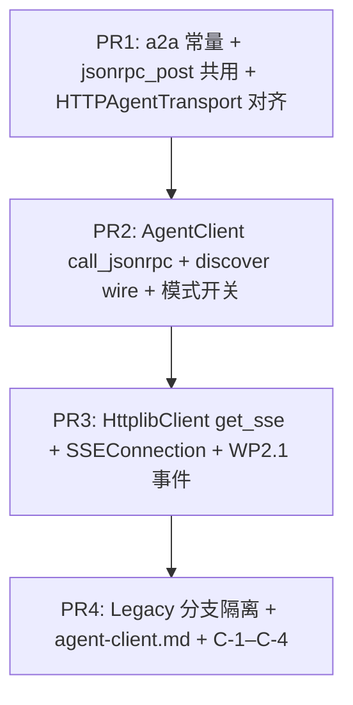

# WP2.4：AgentClient 规范侧（JSON-RPC + wire + SSE）与 Legacy REST 策略 — 实现计划

> **历史计划**：本文保留设计过程；文内 checkbox 是当时的验收草案，不代表当前实现状态。当前事实、源码与 CTest 证据统一以 [phase-3-status.md](./phase-3-status.md) 为准。

本文档将 [phase-2-plan.md](./phase-2-plan.md) **§4 WP2.4** 与交付项 **D4** 落实为可执行任务：**`AgentClient` 与 WP2.1 Facade 一致**（JSON-RPC 信封、`params`/`result` 经 **wire 映射**）；**发现**使用 **WP2.1a Card wire**；**SSE** 解析 **WP2.1 事件名与 `data` schema**；**Legacy REST**（当前 `…/tasks/send` 等）**可选保留**并 **文档标注 deprecated + 移除计划**。

**WP2.4 交付**：运行时 **协议选择**（默认 **A2A JSON-RPC**，可强制 Legacy）；**统一错误模型**（JSON-RPC `error` → C++ 异常或结构化错误类型）；**`HTTPAgentTransport`** 与 **Client** 共用 **同一组 method 名与路径常量**（从头文件或 `a2a_constants.hpp` 读取 tracker 同步值）；**`SSEConnection`（客户端）** 或 **`HttplibClient::get_sse`** 实现 **GET 长流** + **`SseParser` / 内部 `http_sse` 扩展**；**`docs/guides/agent-client.md`**。

**不交付**：OAuth 设备码刷新完整实现（可留 TODO，属 **WP2.5** 深化）；**WP2.6** 契约快照仓库（Client 侧 **单测 fixture** 可先行）。

**文档版本**：0.1
**日期**：2026-04-04
**上游依据**：[phase-2-plan.md](./phase-2-plan.md) v0.8；[plan-detailed.md](./plan-detailed.md) §3 双栈；[phase-2-wp1.md](./phase-2-wp1.md)、[phase-2-wp1a.md](./phase-2-wp1a.md)；[`agent_client.cpp`](../../src/agent_client/agent_client.cpp)、[`agent_transport.cpp`](../../src/agent_transport/agent_transport.cpp)

---

## 1. 依赖

| 前置 | 说明 |
|------|------|
| **WP2.1 / 2.1a** | `jsonrpc` 序列化、`task_from_wire` / `task_to_wire`、`agent_card_from_a2a_wire`、**SSE 帧格式**、**tracker** 中 **JSON-RPC 路径、method 名、SSE URL 模板** |
| **WP2.2**（联调） | 真实 Server 返回规范体；**单测**可用 **httplib::Server** 替身 |
| **WP2.1c**（可选） | 响应体过大时 **客户端**侧解析失败防护；**不**阻塞 WP2.4 DoD |

---

## 2. 现状（只读）

| API | 当前行为 |
|-----|----------|
| `discover_agent` | `GET` → `AgentCard::from_json(body)` |
| `send_task` / `get_task` / `cancel_task` / `update_task` | **REST** 路径 `agent_endpoint + "/tasks/…"`，body 为 **自定义 JSON** |
| `subscribe_task_updates` | `GET …/tasks/sendSubscribe?task_id=` + **`SSEConnection` stub** |
| `HTTPAgentTransport::send_request` | JSON-RPC **信封** POST 至 `base + endpoint`，**method 字符串未与 tracker 对齐**（由本 WP 收敛） |

---

## 3. 协议模式（无疑点）

### 3.1 环境变量（固定）

| 变量 | 默认 | 语义 |
|------|------|------|
| `AGENT_CLIENT_USE_LEGACY_REST` | `0` | `1`：**仅**走现有 REST 路径与 body（回归/过渡）；`0`：**A2A JSON-RPC** 路径（tracker 规定） |
| `AGENT_CLIENT_JSON_RPC_PATH` | **空** | 非空则 **覆盖** tracker 默认的 **相对路径**（便于单测）；**生产**应留空以使用编译期常量（来自 tracker 生成或手抄） |

**规则**：`AgentClient` 在 **构造时** 合并 `AgentClientOptions` 与环境变量（未覆盖的字段来自 `getenv`），之后实例行为固定。**生产**宜在启动时设好 env 或使用显式 `options`。**多实例**：同一进程内不同客户端可用不同 `AgentClientOptions`，无需改 env。**线程安全**：不要在其他线程仍可能执行 `AgentClient` 回调或异步任务时并发修改上述 env；需要切换模式时请用显式 `options` 构造新客户端，或串行化 env 修改与异步完成。

### 3.2 默认策略与废弃时间表（文档强制）

- **`agent-client.md`** 写明：**下一主版本** 起默认 `AGENT_CLIENT_USE_LEGACY_REST=0`（若当前发行版曾为 `1`，须 **CHANGELOG** Breaking 说明）。
- Legacy：**不删除代码路径** 直至 WP2.6 契约测全部迁移；**最少保留 1 个** CTest `--legacy-rest`  job。

---

## 4. JSON-RPC 调用路径（2.4.1）

### 4.1 URL 拼接

- **Base**：`server_url_`（无尾斜杠与有尾斜杠 **统一** 在构造函数或首次使用时规范化 — **与 `join_url` 一致**）。
- **RPC**：`join_url(server_url_, rpc_path)`，其中 `rpc_path` = `AGENT_CLIENT_JSON_RPC_PATH` 或 **`kA2aJsonRpcPath`**（常量，与 tracker **字面相等**）。
- **`agent_endpoint` 参数**（现有 API）：在 **JSON-RPC 模式**下语义改为 **「服务前缀」**（通常 `""` 或 `"/v1"` — **以 tracker 为准**）；**禁止**再拼接 `/tasks/send`；若调用方仍传旧前缀，**文档**要求传 **`""`** 或 **弃用该参数** — **实现选一种**：
  - **推荐**：保留参数，**JSON-RPC 模式下忽略**（仅 Legacy 使用），**Doxygen `@note`** 标明。

### 4.2 每 API 映射（逻辑表，具体 method 名 **抄写 tracker**）

| `AgentClient` 方法 | JSON-RPC `method`（占位） | `params` 构造要点 | `result` → 返回值 |
|--------------------|----------------------------|-------------------|-------------------|
| `send_task` | `{METHOD_TASK_SEND}` | `message` wire、`session_id`、`metadata` | `task_from_wire(result["…"])`（键名以 tracker 为准） |
| `get_task` | `{METHOD_TASK_GET}` | `task_id` 或规范对象 | 同上 |
| `cancel_task` | `{METHOD_TASK_CANCEL}` | `task_id` | `bool` 或 `status` 字段 |
| `update_task` | `{METHOD_TASK_UPDATE}` | `task_id`、`message` | `AgentTask` |
| `set_push_notification` / `get_push_notification_config` | tracker 方法名 | 与现 REST 字段 **同义** | 与现逻辑一致 |

**实现**：私有函数 `json call_jsonrpc(const std::string& method, const json& params)`：

1. 组装信封：`jsonrpc`、`method`、`params`、`id`（**线程安全递增** `std::atomic<std::uint64_t>`，与 [HTTPAgentTransport](../../src/agent_transport/agent_transport.cpp) **一致策略**）。
2. `http_client_->post(url, envelope, headers)`。
3. 解析：`result` → 业务；`error` → `throw std::runtime_error` 或自定义 **`A2aRpcException{code, message, data}`**（**二选一字面**，推荐 **struct** 便于 WP2.6 断言 `code`）。

### 4.3 与 `HTTPAgentTransport` 统一

- 抽取 **`a2a_jsonrpc_post(base_url, path, method, params, headers)`** 到 `src/a2a/jsonrpc_http.cpp` 或 `httplib_http_client.cpp` 的 **free 函数**，**`HTTPAgentTransport` 与 `AgentClient` 共用**，避免 **双份 id 逻辑**。

---

## 5. 发现（Card）

- **JSON-RPC 模式**：若 tracker 规定 Card 为 **独立 GET**（Well-Known），保持 **`discover_agent(endpoint)`** → `GET join_url(server_url_, endpoint)`；body → **`agent_card_from_a2a_wire`**（WP2.1a）；**禁止**仅 `AgentCard::from_json` **除非** wire 与 legacy **完全相同**（由 tracker 声明）。
- **Legacy 模式**：保持 `from_json`。

---

## 6. SSE 客户端（2.4.1）

### 6.1 传输

- A2A 常见为 **`GET`** + `Accept: text/event-stream` + `Last-Event-ID`（重连）。
- 若 **`HttplibClient`** 尚无 **GET 流式**，新增：
  `void get_sse(const std::string& url, const std::map<...>& headers, std::function<void(string_view chunk)> on_chunk, int timeout_sec)`
  使用 **cpp-httplib** `Client::Get` + **`content_receiver`**（或等价）**增量** 写 ring buffer，喂 **`agent_framework::a2a::SseParser`**（[phase-2-wp1.md](./phase-2-wp1.md)）。

### 6.2 事件处理

- **`event:`** 与 **`data:`** 解析后，按 **tracker** 的事件名分支：
  - 任务状态 → `AgentTask::from_json` / `task_from_wire`；回调 `on_status_update`。
  - Artifact → `AgentArtifact::from_json`；回调 `on_artifact_update`。
- **弃用** 硬编码 `"type":"task_status_update"`（[sse_connection.cpp](../../src/agent_transport/sse_connection.cpp)）；**兼容模式**：`AGENT_CLIENT_SSE_LEGACY_PAYLOAD=1` 时 **仍解析** 旧 JSON — **可选**，默认 `0`。

### 6.3 URL

- **JSON-RPC 模式**：SSE URL = tracker 模板（如 `{SSE_PATH}?task_id=`）；**不再**硬编码 `sendSubscribe`。

### 6.4 线程

- **`subscribe_task_updates`**：保持 **独立线程** 读流（与现设计一致）；**析构** `AgentClient` 时 **join 或中断** httplib 流 — **与 WP2.2 服务端断开** 行为对称，**文档**说明。

---

## 7. Legacy REST（2.4.2）

- 现有 `agent_client.cpp` 路径 **整体移入** `impl_legacy_rest_*` 或 `#if` 分支由 **`AGENT_CLIENT_USE_LEGACY_REST`** 控制。
- 头文件 **`[[deprecated]]`** 或 Doxygen `@deprecated`：**仅** 标注「REST 模式」；**公共 API 签名不变**（减少调用方破坏）。
- **`agent-client.md`**：**移除计划** = 「默认 Legacy 关闭后 **N 个小版本** 删除实现」— **N 写死为 2** 或 **由发布经理填**。

---

## 8. 认证头（与 WP2.5）

- **`build_auth_headers()`** 已支持 `bearer` / `api_key`；JSON-RPC 与 Legacy **共用**。
- WP2.4 **不**新增 OAuth 刷新逻辑；**确保** headers 注入 **POST JSON-RPC** 与 **GET SSE** 一致。

---

## 9. 代码交付物

| 路径 | 职责 |
|------|------|
| `include/agent/a2a/client_config.hpp`（或并入现有） | `kA2aJsonRpcPath`、method 名字符串常量（**与 tracker 同步**） |
| `src/agent_client/agent_client.cpp` | 模式分支、`call_jsonrpc`、SSE URL |
| `src/agent_client/httplib_http_client.cpp` / `.hpp` | **`get_sse`**（若缺） |
| `src/agent_transport/sse_connection.cpp` | 接 `get_sse` + `SseParser` + wire 事件分发 |
| `src/agent_transport/agent_transport.cpp` | 复用 `a2a_jsonrpc_post`；**method 常量** 与 Client **同源** |
| `docs/guides/agent-client.md` | 模式、env、迁移、与 Server tracker 对齐检查表 |

---

## 10. 测试计划

### 10.1 `tests/test_agent_client_a2a.cpp`（新建）

| ID | 场景 | 期望 |
|----|------|------|
| **C-1** | 本地 `httplib::Server` 返回 **固定** JSON-RPC `result` | `send_task` 返回 **正确** `task_id` |
| **C-2** | `error` 对象 | 抛出 **`A2aRpcException`** 或带 `code` 的 runtime_error |
| **C-3** | `AgentClientOptions::use_legacy_rest = true` | 请求路径 **仍为** `/tasks/send` |
| **C-4** | `get_sse` 推送两帧 WP2.1 事件 | 回调 **次数** 与解析 **正确** |

### 10.2 回归

- 现有依赖 `AgentClient` 的测试：默认 env **关闭 Legacy**，若失败则 **修 fixture** 或 **显式设 Legacy**。

### 10.3 CTest

- `add_test(NAME agent_client_a2a ...)`；`ENVIRONMENT` 显式设置模式，避免继承 shell。

---

## 11. PR 提交顺序

---

## 12. 验收清单（DoD）

- [ ] **默认**（`AGENT_CLIENT_USE_LEGACY_REST=0`）**端到端** 对 WP2.2 Server：**send/get/cancel/update** 至少 **happy path**（可与 WP2.6 合并验收）。
- [ ] **Legacy** 路径 **C-3** 绿。
- [ ] **JSON-RPC 错误** **C-2** 绿。
- [ ] **SSE** **C-4** 或 **与 WP2.2 集成** 绿。
- [ ] **`agent-client.md`** 含 **deprecated** 与 **默认策略**。
- [ ] **tracker** 中 method/path 与 **`a2a/client_config.hpp`** **无漂移**（CI 可加 **grep 校验** 或 **手工** release checklist）。

---

## 13. 相关链接

- [phase-2-plan.md](./phase-2-plan.md)
- [phase-2-wp1.md](./phase-2-wp1.md)
- [phase-2-wp1a.md](./phase-2-wp1a.md)
- [phase-2-wp2.md](./phase-2-wp2.md)
- [agent_client.hpp](../../include/agent/agent_client/agent_client.hpp)
- [httplib_http_client.hpp](../../include/agent/agent_client/httplib_http_client.hpp)

---

## 14. 修订记录

| 日期 | 版本 | 说明 |
|------|------|------|
| 2026-04-04 | 0.1 | 初稿：模式开关、RPC 映射、SSE get_sse、Legacy、测试与 PR |
