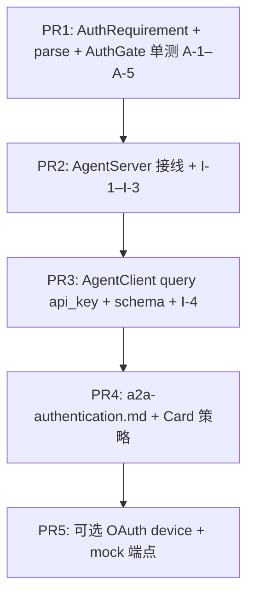

# WP2.5：A2A 认证（服务端校验 + 客户端凭证）— 实现计划

> **历史计划**：本文保留设计过程；文内 checkbox 是当时的验收草案，不代表当前实现状态。当前事实、源码与 CTest 证据统一以 [phase-3-status.md](./phase-3-status.md) 为准。

本文档将 [phase-2-plan.md](./phase-2-plan.md) **§4 WP2.5** 与交付项 **D5** 落实为可执行任务：**Bearer**、**API Key**（Header 与/或 Query）、与 **Agent Card `authentication_scheme`** 声明 **一致** 的校验；**`AgentClient`** 侧 **结构化注入** 与 **文档**；（**可选**）**OAuth 2.0 设备码授权** 最小闭环。

**WP2.5 核心交付（DoD 必达）**：`AgentServer` 在 **所有** 需保护的路由（JSON-RPC、Well-Known 若需保护、SSE）上执行 **统一 `AuthGate`**；**未授权** → **401** + **`WWW-Authenticate`**（Bearer 场景）或 **规范等价**；**`validate_authentication`** 使用 **从 `httplib::Request` 提取的完整头与 query**；**`AgentClient::build_auth_headers`** 与 **`set_authentication` JSON schema** 覆盖 **bearer / api_key** 并与服务端 **逐项对齐**。

**可选交付（同一 WP，独立 PR 切片）**：OAuth 2.0 **Device Authorization Grant**（RFC 8628）轮询 `token` 端点；**不**交付完整 Authorization Server，仅 **客户端** 与 **资源服务器校验 access token**（opaque 或 JWT 校验策略 **二选一字面**，默认 **opaque 字符串与配置比对**）。

**文档版本**：0.1
**日期**：2026-04-04
**上游依据**：[phase-2-plan.md](./phase-2-plan.md) v0.9；[plan-detailed.md](./plan-detailed.md) §3.2；[phase-2-wp2.md](./phase-2-wp2.md) §6；RFC 6750（Bearer）；RFC 8628（Device，可选）

---

## 1. 依赖与边界

| 关系 | 说明 |
|------|------|
| **WP2.2** | 路由与 **SSE** 已存在；本 WP **接线** `AuthGate` 到 **每个** `Get`/`Post` handler **入口**（或 **单一前置 lambda** 包装） |
| **WP2.1a** | Card **wire** 中 **`authentication_scheme`** 的 JSON 形状以 **tracker** 为准；服务端 **解析子集**（见 §4） |
| **WP2.4** | Client 已发请求；本 WP **保证** headers 到达 Server **且** 与 Card 声明一致 |
| **非目标** | 企业 IdP 全量集成、细粒度 RBAC、mTLS、**密钥轮换服务**（仅文档 **运维建议**） |

---

## 2. 现状（只读）

| 位置 | 现状 |
|------|------|
| [`agent_server.cpp`](../../src/agent_server/agent_server.cpp) `validate_authentication` | `headers` **空 map**，validator **几乎无效** |
| [`agent_client.cpp`](../../src/agent_client/agent_client.cpp) `build_auth_headers` | **`bearer`**、**`api_key`**（自定义 header 名）已实现 |
| `set_authentication` / `refresh_authentication` | OAuth **TODO** |

---

## 3. 威胁模型与默认策略（固定）

| 场景 | 行为 |
|------|------|
| **未配置** `AgentServer` 凭据且 Card 声明 **`none` / 空 / 缺失** | **允许** 所有请求（与 WP2.2「validator 空则通过」兼容） |
| **配置了** `AGENT_SERVER_AUTH_MODE` 或 **运行时 `AuthConfig`** | **强制** 按模式校验，**不因** Card 缺失而静默放行（**除非** 显式 `none`） |
| **Card 声明需 Bearer，请求无 `Authorization`** | **401** + `WWW-Authenticate: Bearer` |
| **日志** | **禁止** 打印完整 token；仅 **`Authorization: Bearer ****` + 后 4 字符** 或 **长度** |

---

## 4. Agent Card ↔ 校验策略（2.5.1）

### 4.1 解析

- 新增 **`AuthRequirement`**（`include/agent/a2a/auth_requirement.hpp`）：`enum class Kind { None, HttpBearer, ApiKeyHeader, ApiKeyQuery, Multiple }` + 字段 `api_key_param_name`、`header_name` 等。
- **`parse_auth_requirement(const json& authentication_scheme_wire)`**：对 **tracker 规定的官方 JSON** 做 **映射**；遇 **未知字段** → **保守策略**：`Kind::HttpBearer` **或** **拒绝启动**（`AGENT_SERVER_STRICT_CARD_AUTH=1`）— **二选一字面**，推荐 **默认** `None` + **Warn**，避免旧 Card 崩服。

### 4.2 与静态配置的关系（优先级 **固定**）

1. **环境 / 配置文件** `AGENT_SERVER_AUTH_MODE`：`off` | `bearer` | `api_key_header` | `api_key_query` | `match_card`
2. **`match_card`**（推荐生产）：以 **§4.1** 解析结果为准；解析失败 → **503** 或 **off**（**实现选一种**，文档写明）。
3. **`off`**：**不** 校验（**除** 显式禁止匿名 的 env — **不** 在 v1 引入）。

### 4.3 Bearer 校验

- 头 **`Authorization`**：`Bearer <token>`（**大小写不敏感** scheme，**trim** token）。
- 有效 token 集：`AGENT_SERVER_BEARER_TOKENS`（**逗号分隔**）或 **单值** `AGENT_SERVER_BEARER_TOKEN`；**常数时间**比较（逐字节比较长度一致后 `std::memcmp` 或手写循环 **无 early exit** — **实现选一种**，单测 **计时侧信道不要求**，**逻辑**必对）。

### 4.4 API Key 校验

- **Header 模式**：头名默认 **`X-API-Key`**，可 `AGENT_SERVER_API_KEY_HEADER` 覆盖；值与 `AGENT_SERVER_API_KEYS`（逗号分隔）之一匹配。
- **Query 模式**：参数名默认 **`api_key`**，可 `AGENT_SERVER_API_KEY_QUERY` 覆盖；值同上。
- **Card 指定** header/query 名时：**覆盖** 默认值。

### 4.5 Query 与 JSON-RPC

- **POST body** **不含** API Key（**禁止** 记录 query 到日志明文）；**仅** 在 **GET**（Well-Known、SSE、部分 get_task）上接受 query key — **文档**说明。

### 4.6 `set_authentication_validator` 兼容

- **保留** 用户自定义 `validator(headers)`；**调用顺序（固定）**：
  **内置 `AuthGate` 通过** → 若用户设置了 `auth_validator_`，再 **AND** 用户 validator；**任一方失败** → 401。
- **或**：`AuthGate` **可配置为** `builtin_only | custom_only | both` — **v1 固定 `both`**（内置先，再 custom）。

---

## 5. 服务端实现结构（2.5.1）

| 组件 | 职责 |
|------|------|
| `AuthContext` | 从 `httplib::Request` 提取 `headers`（**键统一小写** 存储）、`params` |
| `AuthGate::check(const AuthContext&, const AuthRequirement& runtime_effective)` | `bool` + `std::string www_authenticate` + `std::string log_safe_reason` |
| `AgentServer::validate_authentication` | 构造 `AuthContext`，调 `AuthGate`，失败时 **设置** `res.status=401`、`WWW-Authenticate`、JSON body `{"error":"Unauthorized",...}` **与现有一致** |

**接线**：**每个** handler 首行 `if (!validate_authentication(req, res)) return;` — **或** `Server::set_pre_routing_handler`（若 httplib 版本支持）— **实现选一种**，PR 内 **列表化** 所有受保护路径。

**Well-Known**：是否公开：由 **`AGENT_SERVER_CARD_PUBLIC=1`**（默认 `1`）决定；`0` 时 Card 也走 **AuthGate**。

---

## 6. 客户端（2.5.2）

### 6.1 `set_authentication` JSON Schema（文档 + 校验）

| `type` | 必填字段 | 行为 |
|--------|----------|------|
| `bearer` | `token` | `Authorization: Bearer …` |
| `api_key` | `key_value`；可选 `key_name`（默认 `X-API-Key`） | 与现实现一致 |
| `api_key_query` | `key_value`；`param_name`（默认 `api_key`） | **GET** 请求拼接 query；**POST JSON-RPC** **不** 自动拼 query（**安全**）— **仅** 对 **显式 GET**（discover、get_task GET legacy、SSE）在 `HTTPClient` 层 **附加** query；**实现**：`AgentClient` 维护 `auth_query_suffix_` 或由 **`HttplibClient`** 接受 **可选 query map** — **二选一字面**，推荐 **Client 层** 对 **GET URL** `join_url(..., "?api_key=" + url_encode)` |

### 6.2 与 Card 联动（可选辅助）

- `discover_agent` 后 **`apply_card_auth_hints(const AgentCard&)`**：**不** 自动信任 Card 中的密钥；**仅** 当 env **`AGENT_CLIENT_TRUST_CARD_AUTH=1`** 时，从 Card **读取**「需要 Bearer」等 **元信息** 并 **要求用户已配置** token — **否则** 抛 **明确错误**（**默认** `0`，**不** 自动应用）。

### 6.3 OAuth（可选 PR）

- `type`: `oauth2_device`：`client_id`、`scope`（可选）、`device_authorization_endpoint`、`token_endpoint`。
- **流程**：`refresh_authentication` 实现 **device code** 获取 + **poll**（间隔与 `expires_in` 遵守 RFC 8628）；成功后将 **`access_token`** 写入内部并 **等价** `bearer`。
- **单测**：**mock** token 端点（httplib Server），**无** 外网。

---

## 7. 代码交付物

| 路径 | 职责 |
|------|------|
| `include/agent/a2a/auth_requirement.hpp` | `AuthRequirement`、`parse_auth_requirement` |
| `include/agent/a2a/auth_gate.hpp` + `src/a2a/auth_gate.cpp` | `AuthContext`、`AuthGate::check` |
| [`agent_server.cpp`](../../src/agent_server/agent_server.cpp) | 提取头/query、`validate_authentication` 实现、路由前置 |
| [`agent_client.cpp`](../../src/agent_client/agent_client.cpp) / `.hpp` | query api_key、schema 校验、`refresh_authentication`（OAuth 可选） |
| [`httplib_http_client.cpp`](../../src/agent_client/httplib_http_client.cpp) | 若需 **GET** 附加 query **统一入口** |
| `docs/guides/a2a-authentication.md` | env 表、Card 子集、客户端 JSON 示例、Well-Known 公开策略 |

---

## 8. 测试计划

### 8.1 `tests/test_auth_gate.cpp`

| ID | 场景 | 期望 |
|----|------|------|
| **A-1** | Bearer 正确 | `check` true |
| **A-2** | Bearer 错误 / 缺失 | false；`WWW-Authenticate` 非空 |
| **A-3** | API Key header | 同上 |
| **A-4** | API Key query | 同上 |
| **A-5** | 常数时间路径 | 错误 token 与缺失 **不同** 错误码可相同（**不** 泄露存在性 — v1 **简化**允许相同消息） |

### 8.2 `tests/test_agent_server_auth_wp25.cpp`（集成）

| ID | 场景 | 期望 |
|----|------|------|
| **I-1** | 本地 Server + 无头 | **401** |
| **I-2** | 正确 Bearer | **200** / JSON-RPC 正常 |
| **I-3** | SSE **GET** 无凭证 | **401**（当 auth 非 off） |

### 8.3 客户端

| **I-4** | `set_authentication` bearer → 抓包或 mock `HTTPClient` | 头含 `Authorization` |

### 8.4 CTest

- 子进程 **独立 env**，**不** 泄漏生产 token。

---

## 9. PR 提交顺序

---

## 10. 验收清单（DoD）

- [ ] **Bearer + API Key**（header + query）**服务端** 与 **客户端** **对称** 文档化。
- [ ] **401** 与 **`WWW-Authenticate`**（Bearer）行为 **I-2** 可测。
- [ ] **SSE** 与 **JSON-RPC** **同** AuthGate（**I-3**）。
- [ ] **`a2a-authentication.md`** 已合并。
- [ ] **OAuth**：若 **未** 做 P5，须在文档 **显式**「阶段 2 可选未实现」；若 **已** 做，**单测** 无外网。

---

## 11. 相关链接

- [a2a-authentication.md](./a2a-authentication.md)（实现落地后的用户 / 运维指南）
- [phase-2-plan.md](./phase-2-plan.md)
- [phase-2-wp2.md](./phase-2-wp2.md) §6
- [phase-2-wp4.md](./phase-2-wp4.md)
- [agent_server.hpp](../../include/agent/agent_server/agent_server.hpp)
- [RFC 6750](https://www.rfc-editor.org/rfc/rfc6750)
- [RFC 8628](https://www.rfc-editor.org/rfc/rfc8628)（可选）

---

## 12. 修订记录

| 日期 | 版本 | 说明 |
|------|------|------|
| 2026-04-04 | 0.1 | 初稿：AuthGate、Card、env、客户端 schema、测试与 PR |
