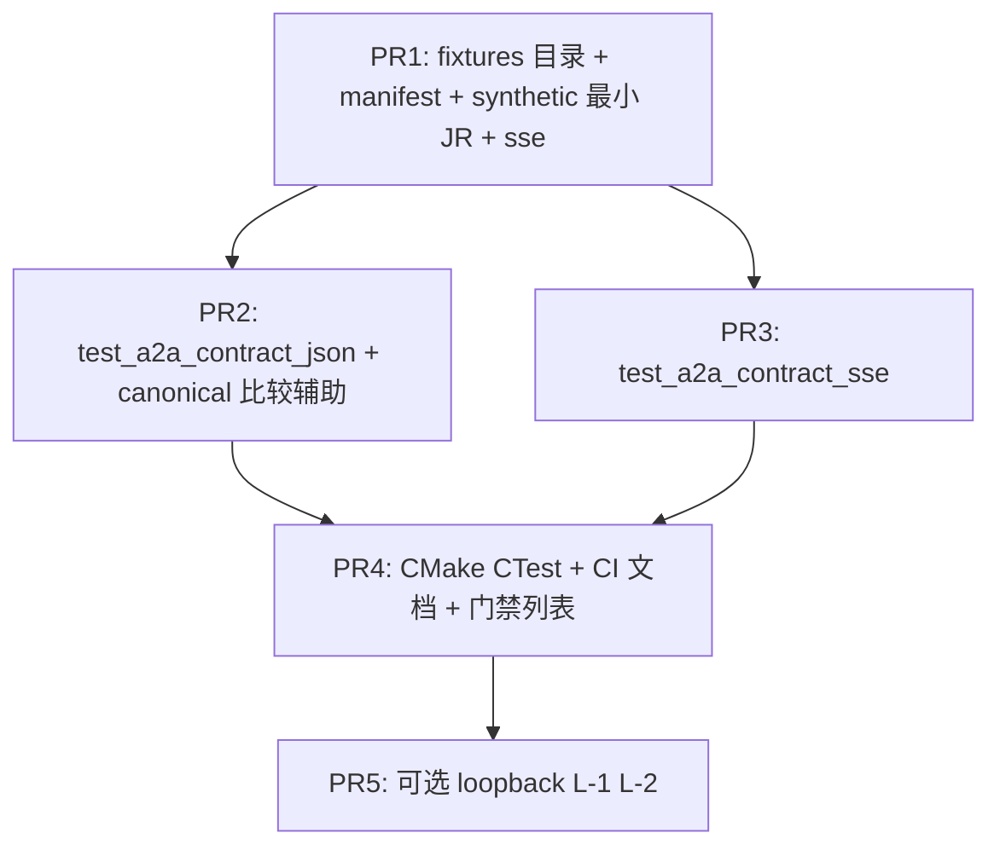

# WP2.6：A2A 一致性 / 契约测试与 Fixture 版本化 — 实现计划

> **历史计划**：本文保留设计过程；文内 checkbox 是当时的验收草案，不代表当前实现状态。当前事实、源码与 CTest 证据统一以 [phase-3-status.md](./phase-3-status.md) 为准。

本文档将 [phase-2-plan.md](./phase-2-plan.md) **§4 WP2.6** 与交付项 **D6** 落实为可执行任务：**官方或社区示例 JSON**、**录制/手写 fixture** **入仓**；**JSON-RPC** 与 **SSE** 的 **快照 / 结构化断言**；**与 `a2a-spec-tracker.md` 修订号绑定**；**CI 可重复、默认无网**；支撑 **M3**「契约门禁」。

**WP2.6 交付**：目录化 **`tests/fixtures/a2a/<bundle_id>/`**（或 `agent_framework/tests/fixtures/...` — **与 CMake 引用路径一致即可**）；**清单文件** `manifest.json`（或 `README.md` 表格）列出每个 fixture 的 **来源 URL / commit**、**适用规范片段**、**期望断言类型**；**CTest** 目标 **`a2a_contract_json`**、**`a2a_contract_sse`**（名称可调整）；可选 **`a2a_contract_loopback`**（`AgentClient` + 本地 `httplib::Server` **回放** fixture）。

**不交付**：对 **公网** 实时拉取官方站点的 **在线** 测试（默认 **禁止**）；**模糊**匹配（v1 **仅** 规范化 JSON 后 **精确** 相等或 **JSON Patch** 白名单字段 — **二选一字面**，推荐 **精确** + **可选字段忽略列表** 在 manifest 声明）。

**文档版本**：0.1  
**日期**：2026-04-04  
**上游依据**：[phase-2-plan.md](./phase-2-plan.md) v0.10；[phase-2-wp1.md](./phase-2-wp1.md)（jsonrpc、sse_framing）；[phase-2-wp4.md](./phase-2-wp4.md)、[phase-2-wp5.md](./phase-2-wp5.md)（联调）

---

## 1. 与总规划依赖的关系

| 边（见 phase-2-plan 图） | 含义（本详案采用） |
|--------------------------|------------------|
| **W26 → W21** | Fixture **约束** wire 形状；**tracker** 更新后 **同步**更新 fixture **bundle**；**非**「无 WP2.1 也可跑通全链」 |
| **M3** | **WP2.4 + 2.5 + 2.6** 同时绿：**Client**、**Auth**、**契约** 门禁 |

**开工条件**：**`a2a-spec-tracker.md`** 至少具备 **§3 方法表**、**§5 SSE** 的 **可序列化样例**（可为 **手写**）；无官方文件时 **bundle_id** 标记 **`synthetic-v1`**。

---

## 2. Fixture 目录与版本化（无疑点）

### 2.1 路径（推荐）

```
agent_framework/tests/fixtures/a2a/
  README.md                 # 总览：如何加 fixture、如何更新 golden
  <bundle_id>/              # 例：google-a2a-examples-2026-04-01 或 synthetic-v1
    manifest.json           # 见 §2.2
    jsonrpc/
      card_get_response.json
      task_send_request.json
      task_send_response.json
      error_parse_error.json
      ...
    sse/
      task_updates.sse.txt  # 原始 SSE 字节流片段（含 \n\n）
      ...
```

### 2.2 `manifest.json` 模式（字段固定）

| 字段 | 类型 | 必填 | 说明 |
|------|------|------|------|
| `bundle_id` | string | 是 | 与目录名一致 |
| `tracker_revision` | string | 是 | 对应 **`a2a-spec-tracker.md` 修订** 或 Git commit |
| `spec_version` | string | 是 | 规范版本号（人读） |
| `fixtures` | array | 是 | 见下 |

**数组元素**：

| 键 | 说明 |
|----|------|
| `id` | 稳定 id，如 `jr_task_send_ok` |
| `path` | 相对 `bundle_id` 的文件路径 |
| `kind` | `jsonrpc_request` \| `jsonrpc_response` \| `sse_stream` \| `agent_card_json` |
| `assert` | `parse_ok` \| `round_trip_types` \| `equals_canonical_json_after_parse` \| `sse_event_count` |
| `equals_after_parse` | 可选：另一 **golden** 路径（规范化后比较） |
| `ignore_json_keys` | 可选：数组，比较前从 object **递归删除**（**仅** 用于 `id`、`timestamp` 类字段） |

---

## 3. JSON-RPC 契约（2.6.1）

### 3.1 测什么（v1 最小集）

| ID | 内容 |
|----|------|
| **JR-PARSE** | 合法/非法 body → `parse_jsonrpc_request` 与 [phase-2-wp1.md](./phase-2-wp1.md) **错误码** 一致 |
| **JR-ROUND** | `task_from_wire` / `task_to_wire`（若 fixture 为任务）与 **内部** `AgentTask` **往返**（允许 **ignore** 时间戳） |
| **JR-ERROR** | `error` 对象 **含** `code` / `message`；与 fixture **完全**一致或 **manifest 声明子集** |

### 3.2 规范化比较

- 使用 **`nlohmann::json::parse` → `dump()`** 或 **排序键** 的 **`canonical_json` 辅助函数**（**同一实现** 用于 **实际** 与 **期望**）；**禁止** 原始字符串逐字比较（空格/键序差异）。  
- 实现位置：`tests/a2a_contract_helpers.hpp`（**仅测试**）或 `src/a2a/testonly` — **推荐仅测试**。

### 3.3 更新 Golden 流程（固定）

1. 修改实现或 tracker 后，运行 **`ctest -R a2a_contract`** 失败。  
2. 审阅 diff；若 **有意** 变更，设 env **`AGENT_A2A_UPDATE_GOLDENS=1`** 运行 **专用** 可执行文件 **`a2a_fixture_regen`**（**不** 默认进 CI）**重写** `equals_after_parse` 目标文件。  
3. **PR 必须** 含 **manifest** `tracker_revision` 更新说明。

---

## 4. SSE 契约（2.6.2）

### 4.1 输入

- 文件为 **UTF-8** 文本：完整 **SSE 片段**（可含多事件），与 WP2.1 **`SseParser`** / **`append_sse_event`** **对偶**。  
- **测解析**：`feed` 全文件 → **事件条数**、各 **`event`** 名、**`data`** 解析为 `json::parse` **成功**。  
- **测生成**：给定 `json` 事件载荷 → `append_sse_event` 输出 → **再解析** 与 **期望** 一致（**round-trip**）。

### 4.2 与 Server 推送对齐

- **可选** fixture 字段 `expected_event_names`: `["task.updated", ...]` — **与 tracker 字面一致**。

---

## 5. 回环测试（可选 DoD+）

| ID | 场景 | 期望 |
|----|------|------|
| **L-1** | 进程内 **httplib::Server** 读 **`jsonrpc/task_send_response.json`** 返回 | **`AgentClient`**（JSON-RPC 模式）`send_task` **得到** 一致 `task_id` |
| **L-2** | Server 要求 **Bearer**，fixture **headers** | **401 / 200** 与 WP2.5 一致 |

**环境**：**随机端口**；**`AGENT_CLIENT_USE_LEGACY_REST=0`**；auth 用 **测试 token** 写 manifest **sidecar** `auth.env.example`（**不** 提交真实密钥）。

---

## 6. CMake / CTest

```cmake
# 摘录意图（非最终 CMake）
add_executable(test_a2a_contract_json tests/test_a2a_contract_json.cpp)
target_link_libraries(test_a2a_contract_json PRIVATE agent_framework ...)
add_test(NAME a2a_contract_json COMMAND test_a2a_contract_json
         WORKING_DIRECTORY ${CMAKE_CURRENT_SOURCE_DIR})
set_tests_properties(a2a_contract_json PROPERTIES
  ENVIRONMENT "AGENT_TOOL_ALLOWLIST=;AGENT_A2A_UPDATE_GOLDENS=")
```

- **`RESOURCE_LOCK`** 或 **串行**标签：若某用例绑端口，加 **`LABELS "a2a"`** 与 **`RUN_SERIAL`**（CTest 3.29+）或 **单测内随机端口**（推荐）。

---

## 7. CI 门禁策略（固定）

| 规则 | 说明 |
|------|------|
| **PR 合并** | `ctest -R 'a2a_contract|tool_call_hooks|agent_server'`（与团队约定的 **A2A 子集**）**必须通过** |
| **无网** | fixture **不** `curl` 外网；**禁止** 在默认 job 启用 `AGENT_A2A_UPDATE_GOLDENS` |
| **规范升级** | **必须** 同时改 **tracker** + **manifest** + **相关 golden**；**单独 commit** 便于 review |

---

## 8. 文档交付物

| 文件 | 内容 |
|------|------|
| `tests/fixtures/a2a/README.md` | 目录结构、manifest 字段、`AGENT_A2A_UPDATE_GOLDENS`、与 tracker 对齐流程 |
| `docs/guides/a2a-contract-testing.md`（可选） | CI、回环测、与 WP2.6 关系；**若省略**则 **README 必须** 覆盖同等信息 |

---

## 9. PR 提交顺序



---

## 10. 验收清单（DoD）

- [ ] **至少一个** `bundle_id` 入仓，**manifest** 含 **`tracker_revision`**。  
- [ ] **JSON** 契约测 **≥3** 个 fixture（含 **至少 1 个 error**）。  
- [ ] **SSE** 契约测 **≥1** 个 **多事件** 文件。  
- [ ] **`ctest`** 目标可 **本地零配置** 通过（除标准构建依赖外）。  
- [ ] **M3** 文档或 CI 配置中 **显式** 引用 **`a2a_contract_*`** 任务。  

---

## 11. 相关链接

- [phase-2-plan.md](./phase-2-plan.md)  
- [a2a-spec-tracker.md](./a2a-spec-tracker.md)（若尚未创建，以 WP2.1a 为准先建占位）  
- [phase-2-wp1.md](./phase-2-wp1.md)  
- [phase-2-wp1a.md](./phase-2-wp1a.md)  
- [phase-2-wp4.md](./phase-2-wp4.md)  
- [phase-2-wp5.md](./phase-2-wp5.md)  

---

## 12. 修订记录

| 日期 | 版本 | 说明 |
|------|------|------|
| 2026-04-04 | 0.1 | 初稿：目录、manifest、JSON/SSE/回环、CMake、CI、PR |
