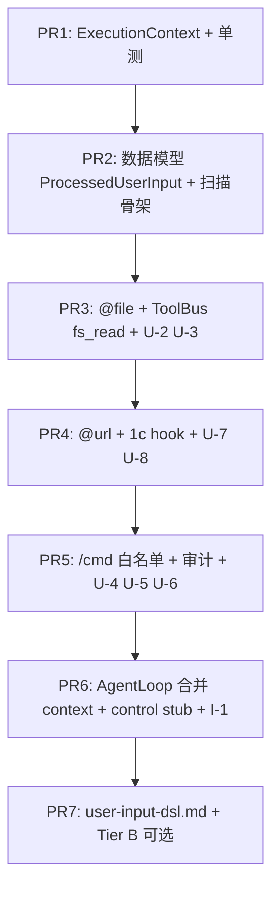

# WP2.7：输入质控（Tier A/B）、ExecutionContext 与 §5.1 用户 DSL — 实现计划

> **历史计划**：本文保留设计过程；文内 checkbox 是当时的验收草案，不代表当前实现状态。当前事实、源码与 CTest 证据统一以 [phase-3-status.md](./phase-3-status.md) 为准。

本文档将 [phase-2-plan.md](./phase-2-plan.md) **§4 WP2.7** 与交付项 **D8** 落实为可执行任务：**`ExecutionContext`** 在拼装 **`LLMInput` 前**固化；**`UserInputPreprocessor`** 产出 **`llm_user_text`、`injected_context[]`、`control_actions[]`**；**Tier A** 覆盖 **`@file` / `@url` / `/cmd`** 的语法、**fs 监禁**、**web 同类策略**、**长度与白名单**；**Tier B**（可选）子 LLM 消歧；与 **WP2.1c** 注入预算 **硬接线**。

**WP2.7 交付**：公共 API + **单测** + **`docs/guides/user-input-dsl.md`**；**CLI** 入口与 **A2A 用户消息→LLM** 路径 **共用** `UserInputPreprocessor::process(...)`（**同一实现**，不同调用点）。

**不交付**：**WP2.9** 压缩实现本体（`/memory compact` **可发 `control_action`** 由 WP2.9 消费）；**WP3.7** `/mcp` 热加载（**仅 stub/拒绝**）；**Verifier**（**WP2.8**）；**Identity** 全链路进 SSE（**字段预留**即可，与 [plan-detailed.v2.md](./plan-detailed.v2.md) §9 对齐后续 PR）。

**文档版本**：0.2
**日期**：2026-04-04
**上游依据**：[phase-2-plan.md](./phase-2-plan.md)；[plan-detailed.v2.md](./plan-detailed.v2.md) §5.1、§5、§9；[phase-2-wp1c.md](./phase-2-wp1c.md) §6–§7；[`cli_agent_graph.cpp`](../../src/graph_executor/cli_agent_graph.cpp)（`UserInput` / `initial_user_prompt`）

---

## 1. 依赖

| 前置 | 说明 |
|------|------|
| **WP2.1c** | `ContextBudgetMeter::consume_injection` 或 `apply_injection_cap` **在物化块写入前/后** 可调；若尚未合入，WP2.7 **内联 TODO + 同样字节计数接口** 占位，**禁止** 无限拼接 |
| **内建 `fs_*` / `web_fetch`** | `@file` / `@url` **禁止** 裸 `std::ifstream` / 裸 HTTP；**必须** **`ToolBus::call_tool("fs_read", …)`** 与 **`call_tool("web_fetch", …)`** 在预处理阶段 **同步** 调用，以便 **`AGENT_TOOL_ALLOWLIST`**、SSRF 与字节上限与现网工具 **完全一致** |
| **WP2.0** | 多轮 `history` 写回 **不** 在本 WP 实现；预处理 **只** 处理 **本轮原始用户字符串**（或 A2A 单条 user message 拼接串） |

---

## 2. 数据模型（无疑点）

### 2.1 `ExecutionContext`

新建 **`include/agent/agent/execution_context.hpp`**（命名空间 `agent_framework`）：

| 字段 | 类型 | 说明 |
|------|------|------|
| `cwd` | `std::string` | 逻辑工作目录（**解析相对 `@file` 的基准**；默认 `std::filesystem::current_path()`） |
| `allowed_mcp_services` | `std::unordered_set<std::string>` | 空 = **不限制**（与现网一致）；非空则 **Tier A** 可对依赖 MCP 的扩展 **预留** |
| `input_policy_version` | `std::string` | 固定默认 **`"wp27-v1"`**；**必须** 写入 **首次** `LLMInput.extra_variables["input_policy_version"]` 与审计日志 |
| `session_id` | `std::optional<std::string>` | 审计与 A2A 对齐 |
| `task_id` | `std::optional<std::string>` | 同上 |

**构造**：`ExecutionContext::from_environment()` 读 **`AGENT_FS_ROOT`**、**`PWD`** 等 **已有** env；**不** 在 WP2.7 发明新监禁根目录名。

### 2.2 `InjectedContextBlock`

| 字段 | 说明 |
|------|------|
| `source_kind` | `"file"` \| `"url"` \| `"inline"` |
| `source_ref` | 路径或 URL **字符串**（**脱敏**日志用截断） |
| `mime_hint` | 可选 |
| `text_utf8` | 物化正文 |
| `byte_length` | `text_utf8.size()`（**计入 1c** 前/后一致） |

### 2.3 `ControlAction`

| 字段 | 说明 |
|------|------|
| `command` | 规范化名，如 **`memory.compact`**、**`memory.clear`**、**`model.set`** |
| `args` | `json` 数组或对象 |
| `raw_line` | 原始 `/cmd` 行（**审计**） |

### 2.4 `ProcessedUserInput`

| 字段 | 说明 |
|------|------|
| `llm_user_text` | 去掉 **已消费** 的 `@…` 与 **`/cmd` 行** 后的 **剩余** 文本（**trim** 规则见 §3.5） |
| `injected_context` | `std::vector<InjectedContextBlock>` |
| `control_actions` | `std::vector<ControlAction>` |
| `tier_a_violations` | `std::vector<std::string>` **稳定错误码**（非空 → **默认** 拒绝进入 LLM，见 §7） |

---

## 3. Tier A：语法与安全（2.7.2–2.7.4）

### 3.0 扫描顺序（全仓固定）

对 **原始** `raw_user_text` **只做一次** 下列流水线（**禁止** 重排）：

1. **按行扫描 `/cmd`**：对 **每一行**，若 **去掉行首空白后** 以 **`/`** 开头，则将该行 **整行** 从正文移除，并尝试 **解析为命令**（§3.3）。**不** 做 Markdown 围栏感知：围栏内的 `/` 行 **仍** 视为命令（**v1 已知限制**，写入 `user-input-dsl.md`）。
2. **在剩余字符串上** 从左到右找 **`@file(`**、**`@url(`** 的 **非重叠** 匹配（§3.1–3.2）；**每条** 必须 **单行内** 完整出现（**禁止** 跨行括号）。
3. 应用 §3.5 空白规则得到 `llm_user_text`。

### 3.1 `@file`（固定文法 v1）

- **形式一（整文件）**：**`@file(`** *path* **`)`**，*path* 为 **非空** 且 **不含** 未转义 **`)`** 的 UTF-8 片段（v1 **禁止** 路径中含 `)`；含 `)` 的路径须阶段 3 另议）。
- **形式二（行范围）**：**`@file(`** *path* **`,`** *range* **`)`**，*range* 为正则 **`^\d+-\d+$`**（**闭区间**、**从 1 起** 行号），例如 **`12-34`**。
- **物化**：先 **`call_tool("fs_read", …)`** 读 **完整** 文件（参数名以 **当前** `fs_read` JSON Schema 为准）；若带 *range*，在 **预处理内存中** 按 **行** 切分后 **只保留** 该行段 **再 UTF-8 拼接** 为 `text_utf8`（**不在** 工具层新增参数，除非未来 `fs_read` 已支持行段）。
- **path**：相对路径以 `ExecutionContext::cwd` 解析；**canonical** 后须 **落在** `AGENT_FS_ROOT` 监禁下（规则同 [builtin-fs-tools.md](./builtin-fs-tools.md)）；否则 **`tier_a_violations`** 追加 **`file_path_outside_jail`**。
- **长度**：单块 **`text_utf8`** 字节数 **≤** **`AGENT_INPUT_FILE_INJECT_MAX_BYTES`**（默认 **`262144`**）；超限 **`tier_a_violations`** 追加 **`file_inject_too_large`**。
- **工具错误**：`fs_read` 返回 **业务失败**（非 allowlist 拒绝同理）时 **`tier_a_violations`** 追加 **`file_fetch_failed`**（**可** 附 **截断** 错误摘要 **≤200 字节**，**禁止** 泄露绝对路径根以外隐私）。

### 3.2 `@url`（2.7.3）

- **形式**：**`@url(`** *url* **`)`**，**单行**；*url* 规则与 [builtin-web-tools.md](./builtin-web-tools.md) 中 **`web_fetch`** 一致（**https** 默认可用；**http** 仅当 **`AGENT_WEB_ALLOW_HTTP=1`**）。
- **物化**：**`call_tool("web_fetch", …)`**，参数与 **响应体截断** 与内建 web 工具 **同实现**；失败时 **`tier_a_violations`** 追加 **`url_fetch_failed`**（错误摘要规则同 `file_fetch_failed`）。
- **预算**：每块得到 `text_utf8` 后 **立即** 调 **WP2.1c** `consume_injection`（或与其实现 **等价字节计数**）；失败则 **`tier_a_violations`** 追加 **`injection_budget_exceeded`**，**不** 将该块写入 `injected_context`（**整块丢弃**）。**严格模式**下与其它 violation **相同**：**整轮** 不调用 LLM（§6）。

### 3.3 `/cmd`（2.7.4）

- **识别**：已被 §3.0 抽出的 **整行**；规范化：**trim** 后 **按空格切分**，**第一 token** 小写比较。
- **白名单**（**精确** 匹配 **前两 token** 或 **首 token + 余下**）：

| 用户行（trim 后示例） | `ControlAction.command` | `args` |
|------------------------|-------------------------|--------|
| `/memory compact` | `memory.compact` | `{}` |
| `/memory clear` | `memory.clear` | `{}` |
| `/model gpt-4o` | `model.set` | `{"id":"gpt-4o"}`（*id* 为 **第二 token 起** 到行尾 **trim**，**不得** 为空） |

- **`/mcp …`、`/skills …`、以及任何未命中上表** 的行：**不** 生成 `ControlAction`；**`tier_a_violations`** 追加 **`command_not_whitelisted:<trim 后行截断至 200 字符>`**；**审计**：**`std::clog << "[user_command] REJECTED policy=wp27-v1 stub=wp3.7_only line=…\n"`**（**必须** 含 `input_policy_version`；若有 `session_id` 一并输出）。
- **白名单命中** 的 **审计**：**`std::clog << "[user_command] OK policy=wp27-v1 cmd=… session=…\n"`**（字段与 **v2 §9** 对齐，后续可换统一日志门面 **不改变键语义**）。

### 3.4 与 LLM 的拼接顺序（固定）

1. `PromptRenderer` / `LLMNode` 消费时：`LLMInput.user_prompt` = `llm_user_text`。
2. `injected_context` **按出现顺序** 追加到 **`LLMInput.context`**，每块前加 **固定分隔头**：
   `"\n--- injection:" + source_kind + ":" + source_ref_trunc + "\n"`
3. **`extra_variables["input_policy_version"]`** = **`ctx.input_policy_version`**（**禁止** 省略）。

### 3.5 `llm_user_text` 空白规则

- **移除** 已匹配的 `@file`/`@url` **原字面**；**折叠** 连续空行 **最多 2**；**首尾 trim**。

---

## 4. Tier B（2.7.5，可选）

- **开关**：**`AGENT_INPUT_TIER_B=0`**（默认）关闭。
- **开启时**：对 **无法 Tier A 解析** 的 token（或 **歧义 `@`**）调用 **已有 `LLMClient`** **最小** prompt，**强制** JSON 输出 schema：
  `{"action":"ignore"|"inject_file"|"inject_url","path_or_url":"…","reason":"…"}`
- **限流**：**每用户输入最多 1 次** Tier B 调用；超时 **5s**；失败 → **按 Tier A 拒绝**。

---

## 5. API 与调用点

### 5.1 核心类型（与 2.7.1 同名）

```cpp
// user_input_preprocessor.hpp
struct PreprocessOptions {
    bool enable_tier_b = false;
    std::shared_ptr<LLMClient> tier_b_llm; // enable_tier_b 时必填
    std::shared_ptr<ToolBus> toolbus;      // 若 raw 中可能出现 @file/@url 则必填
};

class UserInputPreprocessor {
public:
    explicit UserInputPreprocessor(PreprocessOptions opt);
    ProcessedUserInput process(
        std::string_view raw_user_text,
        const ExecutionContext& ctx);
};
```

**说明**：无 `@file`/`@url` 时 **`toolbus` 可为 `nullptr`**，`process` **不得** 解引用；单测 **纯 `/cmd`** 路径 **必须** 可跑。

### 5.2 CLI

- 在 **读取 stdin / 得到 raw 用户串之后**、**调用 `build_cli_agent_graph` 之前**（demo 或图工厂包装）：
  1. `UserInputPreprocessor prep(opt);`
  2. `auto out = prep.process(raw, ctx);`
  3. **`agent_state->initial_user_prompt = out.llm_user_text`**；
  4. **`agent_state->pending_injected_context = std::move(out.injected_context)`**；**`pending_control_actions = std::move(out.control_actions)`**；**`pending_input_violations = std::move(out.tier_a_violations)`**（字段名以头文件为准，**语义** 须一致）。
- **`AgentLoopNode`** 在 **组装首轮 `LLMInput`** 时：将 **`pending_injected_context`** 按 §3.4 拼入 **`LLMInput.context`**；**消费后清空** `pending_injected_context`（**同一轮** 仅消费一次）。
- **`control_actions`**：**首轮** 在 **进入 LLM 前** 调用 **注册表 stub**（`/memory compact` → 空操作或回调 WP2.9；**不得** 静默丢弃）；**消费后清空**。

### 5.3 A2A

- 将 **user 角色** 的 `AgentMessage` **文本部分** 按规范 **顺序拼接为单一 UTF-8 字符串** 后，调用 **同一** `UserInputPreprocessor::process`。
- **`ExecutionContext::session_id` / `task_id`** 从 **A2A task / message metadata** 填入（与 [plan-detailed.v2.md](./plan-detailed.v2.md) §9 字段名 **对齐已有** C++ 结构体，无则 `nullopt`）。

---

## 6. 错误与拒绝策略（固定）

| 条件 | 行为 |
|------|------|
| `tier_a_violations` 非空 且 **`AGENT_INPUT_STRICT` 未置 `0`**（**默认严格**） | **不调用 LLM**。**CLI**：向 **stderr** 打印 **人类可读** 多行说明（每行一条 violation），进程 **退出码 `3`**（**专用**：输入质控失败）。**A2A**：对 **`tasks/send`（或等价 user 消息入口）** 返回 **JSON-RPC 2.0 error**，**`code` = `-32602`（Invalid params）**，**`message`** 固定前缀 **`input_policy_violation`**，**`data`** 为 JSON 对象且 **必含** **`"violations": [ string, … ]`**（与 `tier_a_violations` **一致**）。与 **WP2.3** 任务状态关系：**不** 创建 **RUNNING** 主任务；若已预创建 task id，置 **FAILED** 并在 **SSE / 状态查询** 中携带 **同一** `violations`（**具体键名** 在 `user-input-dsl.md` 与 **WP2.3 详案** **交叉引用**）。 |
| **`AGENT_INPUT_STRICT=0`**（**仅** 测试或排障） | **不** 因 `tier_a_violations` 中止：从正文 **删除** 无法物化的 `@` 字面、**忽略** 非白名单 `/cmd` 行（**仍** 打 **WARN** 日志）；**若** 仍无法得到安全正文，**降级** 为 **空 `llm_user_text`** 并 **一条** `input_relaxed_degraded` violation 日志。**禁止** 在生产配置默认使用。 |

---

## 7. 代码交付物

| 路径 | 职责 |
|------|------|
| `include/agent/agent/execution_context.hpp` + `src/agent/execution_context.cpp` | 构造、env |
| `include/agent/agent/user_input_preprocessor.hpp` + `src/agent/user_input_preprocessor.cpp` | Tier A 扫描、ToolBus 调用、1c 钩子 |
| `include/agent/internal/agent_thread_state.hpp`（若需） | `pending_injected_context` 等 |
| [`agent_loop_node.cpp`](../../src/node/agent_loop_node.cpp) | 读 pending 注入 **进** `LLMInput`；**执行** `control_actions` **分发 stub**（**memory** 调 **空函数** 或 **回调** 注册表，**WP2.9** 实现体） |
| [`cli_agent_graph.cpp`](../../src/graph_executor/cli_agent_graph.cpp) 或 **demo** | 调用 `preprocess` 或 **文档**要求调用方先预处理 |
| `docs/guides/user-input-dsl.md` | 文法、白名单、env、示例、与 1c/2.9/3.7 边界 |

---

## 8. 测试计划

### 8.1 `tests/test_user_input_preprocessor.cpp`

| ID | 场景 | 期望 |
|----|------|------|
| **U-1** | 纯文本无 `@` | `llm_user_text` 等价（规范化后） |
| **U-2** | `@file` jail 外 | `file_path_outside_jail` |
| **U-3** | `@file` 合法 + mock ToolBus | 一块 `injected_context`，`source_kind=file` |
| **U-4** | `/memory compact` 行 | `control_actions` 含 **compact** |
| **U-5** | `/unknown` | `tier_a_violations` 含 **`command_not_whitelisted:`** 前缀；**无** `ControlAction` |
| **U-6** | 多行 + `/cmd` 与正文 | **仅** cmd 行移除，`llm_user_text` 保留其余行 |
| **U-7** | `@url(https://…)` + mock `web_fetch` | 一块 `injected_context`，`source_kind == "url"`，`source_ref` 为请求 URL |
| **U-8** | 注入超 **WP2.1c** 预算 | `tier_a_violations` 含 **`injection_budget_exceeded`**；`injected_context` **无** 该块；严格模式下 **整轮拒绝** |

### 8.2 集成

| **I-1** | `build_cli_agent_graph` + 预处理 | **一轮** LLM 的 `context` **含** 注入块（mock LLM 可断言） |

### 8.3 CTest

- `ENVIRONMENT`：**`AGENT_TOOL_ALLOWLIST=`** 含 **`fs_read`/`web_fetch`** 若测物化；**`AGENT_FS_ROOT`** 指向 tmp。

---

## 9. PR 提交顺序



---

## 10. 验收清单（DoD）

- [ ] **D8**：Tier A **至少** `@file`、`@url`、`/cmd` **各 1** 条 **正向** + **各 1** 条 **负向** 单测。
- [ ] **`ExecutionContext`** 进入 **日志** 或 **`LLMInput.extra_variables`**（**可观测**）。
- [ ] **WP2.1c** 钩子 **调用**（或 **同字节语义** 占位 **在 PR 描述** 写明债务）。
- [ ] **`user-input-dsl.md`** 与 **§3.1 `@file` 文法** **一字不差** 同步代码。
- [ ] **`/mcp`** **未** 实现热加载（**stub** 行为与文档一致）。

---

## 11. 相关链接

- [phase-2-plan.md](./phase-2-plan.md)
- [plan-detailed.v2.md](./plan-detailed.v2.md) §5.1
- [phase-2-wp1c.md](./phase-2-wp1c.md)
- [phase-2-wp0.md](./phase-2-wp0.md)
- [builtin-fs-tools.md](./builtin-fs-tools.md)
- [builtin-web-tools.md](./builtin-web-tools.md)

---

## 12. 修订记录

| 日期 | 版本 | 说明 |
|------|------|------|
| 2026-04-04 | 0.1 | 初稿：模型、Tier A/B、调用点、测试与 PR |
| 2026-04-04 | 0.2 | 固定扫描顺序、`@file`/`@url`/`/cmd` 文法与白名单拒绝语义；CLI 退出码 3；A2A `-32602`；`UserInputPreprocessor` 类 API |
