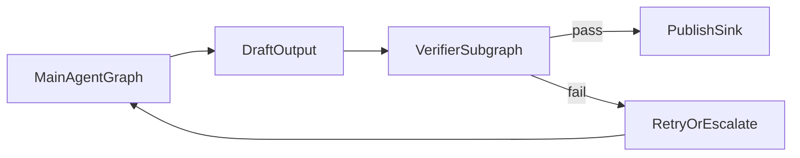
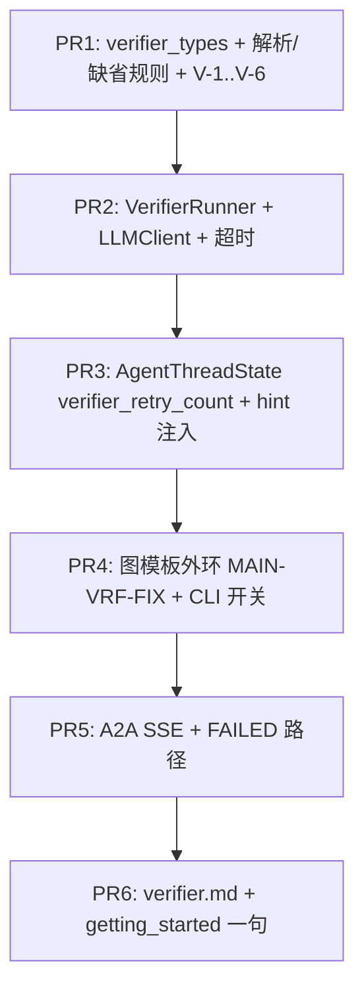

# WP2.8：Verifier（第二套 LLM 子图）— 实现计划

本文档将 [phase-2-plan.md](./phase-2-plan.md) **§4 WP2.8** 与交付项 **D9** 落实为可执行任务：主 Agent 图产出 **草案输出** 后进入 **Verifier 子图**（**框架内第二套 `LLMClient`**，不绑定外部商业二审 API，与 [plan-detailed.v2.md](./plan-detailed.v2.md) §6.2 一致）；**结构化**结论 **`ok` / `issues` / `suggested_action`**；Verifier **默认无写工具**；**事件进 SSE + 日志**；**fail** 路径与主循环 **Retry/Escalate** 衔接（v2 mermaid：`OUT → VRF →|fail| FIX → MAIN`）。

**WP2.8 交付**：**`VerifierResult`**（或等价名）类型 + **JSON 解析/校验** + **图接线**（CLI **与** A2A **同一模板**）；**单测**（mock LLM、闸逻辑、重试次数）；**`docs/guides/verifier.md`**（env、schema、SSE 字段）。

**不交付**：**WP2.9** 记忆压缩实现；**人工工单系统**（**`abort`** 仅 **任务失败/退出码**，不接外部 escalation 平台）；**Verifier 专用向量/RAG**；对主模型输出的 **自动改写**（**仅** `retry_main` **注入 hint**，由 **主模型** 自改）。

**文档版本**：0.2
**日期**：2026-04-04
**上游依据**：[phase-2-plan.md](./phase-2-plan.md)；[plan-detailed.v2.md](./plan-detailed.v2.md) §6.2、§6.1、§9；[`agent_loop_node.cpp`](../../src/node/agent_loop_node.cpp)（`kFinalAnswer` / `exit_func`）；[phase-2-wp3.md](./phase-2-wp3.md)（SSE、任务状态）

---

## 1. 依赖

| 前置 | 说明 |
|------|------|
| **WP2.0** | **推荐** 已具备 **`GraphExecutor::execute`** 或 **稳定** 的 `build_*_agent_graph` + 单次运行收口；Verifier 作为 **模板内** 外环或 **后置节点**，**不得** 长期 `throw` 占位 |
| **WP2.7** | **无硬依赖**；若已合入，`ExecutionContext::session_id` / `task_id` **须传入** Verifier 审计与 SSE（与 v2 §9 一致） |
| **WP2.2 / WP2.3** | A2A 路径 **须** 能发送 **任务生命周期内** 的 **额外** SSE 事件（或 **扩展现有** `push_task_status_update` **载荷**），见 §6 |
| **主图** | 已能产出 **稳定字符串** **`draft_final_answer`**（与 `AgentLoop` **`kFinalAnswer`** 语义一致）及 **`AgentThreadState`**（含 `history`） |

---

## 2. 架构位置（固定）

与 [plan-detailed.v2.md](./plan-detailed.v2.md) **§6.2** 一致：



**术语**：

- **MAIN**：现有 **ReAct / AgentLoop** 子图（**可含 ToolBus**）。
- **OUT**：**物化** `draft_final_answer` + **快照** `VerifierInput`（§3）。
- **VRF**：**单次**（v1 **禁止** Verifier 内再调工具）**聊天补全** 调用 **`LLMClient`**（**profile B**）。
- **FIX**：根据 **`VerifierResult`** 更新 **`AgentThreadState`**（注入 hint、递增 **Verifier 重试计数**），**条件** 回到 MAIN。
- **PUB**：CLI **打印**/Sink、A2A **COMPLETED** + 最终 artifact。

**v1 约束**：Verifier **不** 注册 **任何** `ToolBus` 工具；**`LLMInput.tools` 为空**；温度 **0.0**（或 **`AGENT_VERIFIER_TEMPERATURE`** 默认 **0**）。

---

## 3. 输入与载荷边界（`VerifierInput`）

Verifier **单次调用** 使用的 **确定性** 拼装字段（**全部 UTF-8**，总长 **硬上限** **`AGENT_VERIFIER_PROMPT_MAX_BYTES`**，默认 **`65536`**；超限 **截断** `draft_final_answer` **尾部** 并 **追加** 一条 **固定** 说明行，**不** 失败）：

| 字段 | 来源 | 说明 |
|------|------|------|
| `user_query` | `AgentThreadState::initial_user_prompt` **或** `history` 中 **首条** `role=user` 的 `content`（**先** initial **非空** 则用之） | 供 Verifier 对照 **任务意图** |
| `draft_final_answer` | 主图 **`kFinalAnswer`** | **被检对象** |
| `history_digest` | **可选**：最近 **N** 轮 assistant/tool **摘要**（**N**=`AGENT_VERIFIER_HISTORY_TURNS`，默认 **3**），每段 **≤512 字符** 截断 | **不** 传全量 `history` **除非** 低于预算 |
| `session_id` / `task_id` | `ExecutionContext` 或 A2A 任务 | **仅** 进 **日志/SSE**，**不进** model 若 env **`AGENT_VERIFIER_REDACT_IDS=1`** |

**禁止**：把 **完整** 工具 JSON（可能含密钥）**未经 redact** 送入 Verifier；**仅** 送 **`tool_name` + 截断结果** 若 **`AGENT_VERIFIER_INCLUDE_TOOL_TRACE=1`**（默认 **0**）。

---

## 4. Verifier LLM 输出（JSON Schema v1，无疑点）

Verifier **必须** 输出 **唯一** 顶层 JSON 对象（**无** markdown 围栏）；若 API 支持 **`response_format`** / JSON mode，**应** 开启。

### 4.1 顶层键

| 键 | 类型 | 必填 | 说明 |
|----|------|------|------|
| `ok` | `boolean` | **是** | **`true`** = 建议 **直接发布** |
| `issues` | `array` | **是** | 若无问题 **必须** 为 **`[]`** |
| `suggested_action` | `string` | **是** | 枚举见 §4.3 |

### 4.2 `issues[]` 元素

| 键 | 类型 | 必填 | 约束 |
|----|------|------|------|
| `code` | `string` | 是 | **snake_case**，**≤64 字符** |
| `severity` | `string` | 是 | **`info`** \| **`warn`** \| **`block`** |
| `detail` | `string` | 是 | **≤500 字符**（解析时 **硬截断**） |

### 4.3 `suggested_action` 枚举（闭集）

| 值 | 含义 |
|----|------|
| **`pass`** | 发布（**通常** 与 `ok:true` 同现） |
| **`retry_main`** | 希望 **主图** 在 **同一次用户请求** 内 **再跑** 一轮（见 §5） |
| **`pass_through`** | **仍发布** 草案，但 **标记** `verifier_ok=false`（**不** 再 retry） |
| **`abort`** | **不发布** 正文为 **成功结论**：A2A → **`FAILED`**；CLI → **stderr** 摘要 + **退出码 `4`** |

**缺省规则**（解析合法 JSON 后 **缺键** 时 **合成**）：

- 缺 `issues` → **`[]`**。
- 缺 `ok` → **`false`**。
- 缺 `suggested_action`：若 **`ok==true`** → **`pass`**；若 **`ok==false`** → **`retry_main`** 当 **`retry_count < max`**（§5），否则 **`pass_through`**。

---

## 5. 闸逻辑与 Retry（2.8.2，固定）

定义：

- **`retry_count`**：挂在 **`AgentThreadState`**（或 **图外环共享态**）的 **`verifier_retry_count`**，**每次** 从 FIX **回到** MAIN 前 **`++`**。
- **`max_retries`**：**`AGENT_VERIFIER_MAX_RETRIES`**，默认 **`1`**（即 **最多 1 次** 额外主循环；**加上** 首次 MAIN 共 **2** 次主图机会 — **字面**：**重试次数** 指 **Verifier 触发的额外 MAIN 次数**）。

### 5.1 判定顺序（实现 **必须** 按序执行）

1. **`suggested_action == "abort"`** → **ABORT**（§5.2），**无论** `ok`。
2. **`ok == true`** → **PASS** → **PUB**（**不再** 解释 `suggested_action`，**除** 步骤 1 已处理 **`abort`**）。
3. **`ok == false`**：
   - **`suggested_action == "retry_main"`** 且 **`retry_count < max_retries`** → **FIX**（§5.3）→ **`retry_count++`** → **MAIN**。
   - **`suggested_action == "retry_main"`** 且 **`retry_count >= max_retries`** → **等同** **`pass_through`**：**PUB** + **`verifier_ok:false`**。
   - **`suggested_action`** 为 **`pass_through`** 或 **`pass`** → **PUB** + **`verifier_ok:false`**。
   - **`suggested_action`** **非** 上述枚举值 → **等同** **`pass_through`**（**PUB** + **`verifier_ok:false`** + 日志 **`action=unknown_normalized`**）。

**`issues[].severity`**：**不** 参与分支；**仅** 用于 **日志 / SSE / 人工阅读**（模型 **应** 在严重问题时使用 **`block`**）。

### 5.2 ABORT 行为

- **CLI**：**stderr** 打印 **`[verifier] abort …`** + **issues 首条** `code`/`detail` **截断**；进程 **退出码 `4`**（**与** WP2.7 输入质控 **`3`** **区分**）。
- **A2A**：任务 **`FAILED`**，`error` / `message` **含** **`verifier_abort`**；SSE **推送** §6 事件 **`failed`**。

### 5.3 `retry_main` 的 FIX 注入（固定）

向 **`AgentThreadState::history`** **追加** **一条** **`role=system`** 的 `Message`（与现有 **ReAct** `history` 约定一致；**禁止** 在 WP2.8 **另开** parallel 队列）：

**内容模板**（**英文**，**≤2048 字节**）：

```
The previous draft answer did not pass verification. Address the following issues and produce a corrected final answer without repeating the verification instructions.
Issues (JSON): <issues_json_compact>
```

其中 **`<issues_json_compact>`** 为 **`issues` 数组** 的 **`dump()`** 截断至 **1536 字节**。

**禁止**：在 hint 中附 **完整** `draft_final_answer`（已在 **history** 的 assistant 中）。

---

## 6. 可观测性（2.8.3，固定）

### 6.1 日志（CLI 与 Server 共用）

每条 Verifier **调用** **一行**（**`std::clog`** 或项目统一门面），**键值对** 稳定：

- **`[verifier]`**
- **`task_id=`** / **`session_id=`**（若有）
- **`ok=`** `0|1`
- **`action=`** `pass|retry_main|pass_through|abort`（**解析后** **有效** action）
- **`issues_count=`**
- **`latency_ms=`**
- **`outcome=`** `published|retrying|aborted|skipped`

### 6.2 SSE（A2A）

在 **任务 `WORKING`** 阶段 **至少** 推送 **一次**（**开始**）与 **一次**（**结束**），`component` **固定** **`verifier`**（与 [plan-detailed.v2.md](./plan-detailed.v2.md) §9 **`component`** 一致）：

| 时机 | 建议 `event` 或载荷字段 | 必填字段 |
|------|-------------------------|----------|
| Verifier **调用前** | `verifier_started` | `task_id`, `ts` |
| Verifier **调用后** | `verifier_completed` | `ok`, `suggested_action`, `issues_count`, `latency_ms` |
| **ABORT** | 可与 **`failed`** 合并，**须** 含 **`verifier_abort: true`** | `issues[0].code` 推荐 |

**与 WP2.3**：**不** 改变 **合法状态机边**；**Verifier ABORT** **走** 既有 **`WORKING` → `FAILED`**。

### 6.3 开关与成本（风险缓解）

| 环境变量 | 默认 | 说明 |
|----------|------|------|
| **`AGENT_VERIFIER`** | **`off`** | **`off`**：**跳过** VRF，**OUT** 直连 **PUB**（**零** 延迟） |
| | **`on`** | 总是运行 Verifier |
| | **`sample`** | **每任务** 以 **`AGENT_VERIFIER_SAMPLE_RATE`**（**0.0–1.0**，默认 **`0.1`**) **伯努利** 抽样；**未命中** 等同 **`off`** |
| **`AGENT_VERIFIER_TIMEOUT_MS`** | **`30000`** | LLM 调用 **wall-clock** 超时；**超时** → **合成** `VerifierResult`：`ok:false`, `issues:[{code:verifier_timeout,severity:block,detail:…}]`, `suggested_action:pass_through`（**不** **`retry_main`**，**防** 死循环） |
| **`AGENT_VERIFIER_MODEL`** 等 | **空** | **空** = **继承** 主 **`AgentConfig` / 环境** 中与 **`AGENT_LLM_*`** 同源键；**非空** = **Verifier 专用** endpoint/model |

---

## 7. 第二套 LLMClient（2.8.1）

- **实现**：**独立** `std::shared_ptr<LLMClient> verifier_llm`，由 **工厂** `make_verifier_llm_client_from_env()` 创建；配置 **读取** **`AGENT_VERIFIER_*`**，**未设置** 的键 **回退** 到 **`AGENT_LLM_*`**（或项目现有主配置键名）。
- **系统提示（Verifier system prompt）**：**入仓** **常量模板** **`kVerifierSystemPrompt`**（**英文**），要求 **仅** 输出 §4 JSON；**禁止** 建议调用工具。
- **User message**：**序列化** `VerifierInput` 为 **可读** 多段文本 **或** **单段 JSON** — **固定**：**单段 JSON** `dump()`，键名与 §3 表一致，**便于** 单测 **快照**。

---

## 8. JSON 解析失败与安全降级（固定）

若 **响应非 JSON** / **parse throw** / **缺必填键**（在应用 §4 缺省规则 **之后** `issues` 仍不可用）：

- **合成** `VerifierResult`：
  - `ok: false`
  - `issues: [{ "code": "verifier_parse_error", "severity": "block", "detail": "<截断原始响应前缀256字符>" }]`
  - `suggested_action: "pass_through"`

**禁止**：解析失败时 **`retry_main`**（**避免** 无限「坏模型→重试」）。

---

## 9. 代码交付物

| 路径（建议） | 职责 |
|--------------|------|
| `include/agent/agent/verifier_types.hpp` | `VerifierInput`, `VerifierResult`, `VerifierIssue`, **parse/validate** 函数 |
| `include/agent/agent/verifier_runner.hpp` + `src/agent/verifier_runner.cpp` | 组装 prompt、调 `LLMClient`、超时、解析 → `VerifierResult` |
| `src/graph_executor/…` **或** `build_cli_agent_graph` 扩展 | **外环**：MAIN→VRF→FIX→PUB；**条件** 边 **仅** 通过 **数据**（`needs_retry`）**在** **同模板** 内 **展开**（**可** 用 **子图** + **显式** 节点，**禁止** 手连 `precede` **违反** `.cursorrules` 时 **以** `input_specs` **表达依赖**） |
| [`cli_agent_graph.cpp`](../../src/graph_executor/cli_agent_graph.cpp) | **`AGENT_VERIFIER`** 开关；挂载 Verifier **后置** |
| A2A worker（[phase-2-wp2.md](./phase-2-wp2.md)） | §6 SSE **调用点** |
| `docs/guides/verifier.md` | 用户可见：开关、schema、退出码、与 WP2.7/WP2.9 边界 |

---

## 10. 测试计划

### 10.1 `tests/test_verifier_types.cpp`

| ID | 场景 | 期望 |
|----|------|------|
| **V-1** | 合法 JSON，`ok:true`，`suggested_action:pass` | 应用 §5.1 → **PUB**（**非** ABORT、**非** retry） |
| **V-2** | `ok:false` + `retry_main` + `retry_count=0` + `max=1` | **需要 retry**，**未** 降级 |
| **V-3** | 同 V-2 + `retry_count=1` | **降级** `pass_through` |
| **V-4** | `suggested_action:abort` | **ABORT** |
| **V-5** | 非法 JSON | **`pass_through`** + `verifier_parse_error` |
| **V-6** | `ok:true` + `suggested_action:abort` | **ABORT**（**步骤 1** 优先于 `ok`） |

### 10.2 `tests/test_verifier_runner.cpp`（可选与 V-1 合并）

- **Mock `LLMClient`** 返回固定字符串 → 解析与闸 **端到端**（**无** 网）。

### 10.3 集成 **I-1**

- **`AGENT_VERIFIER=on`** + mock 主图 + mock Verifier：**SSE** 或日志 **断言** `verifier_started` / `verifier_completed` **各 ≥1**。

---

## 11. PR 提交顺序



---

## 12. 验收清单（DoD）

- [ ] **D9**：**第二套** `LLMClient` **可配置**；**结构化** `ok` / `issues` / `suggested_action` **单测覆盖**。
- [ ] **默认无写工具**：Verifier 调用路径 **`tools` 为空**（**断言** 或 **代码审查清单**）。
- [ ] **Retry**：**`retry_main`** **最多** `AGENT_VERIFIER_MAX_RETRIES` 次 **额外** MAIN；**耗尽** **降级** `pass_through`。
- [ ] **SSE + 日志**：§6 **字段** **实现** 与 **文档** 一致。
- [ ] **`AGENT_VERIFIER=off`**：**回归** 行为与 **无 Verifier** 前 **一致**（**无** 额外延迟）。

---

## 13. 相关链接

- [phase-2-plan.md](./phase-2-plan.md)
- [plan-detailed.v2.md](./plan-detailed.v2.md) §6.2
- [phase-2-wp7.md](./phase-2-wp7.md)（输入质控边界）
- [phase-2-wp1c.md](./phase-2-wp1c.md)（上下文预算，Verifier prompt 截断）
- [phase-2-wp3.md](./phase-2-wp3.md)（任务失败与 SSE）

---

## 14. 修订记录

| 日期 | 版本 | 说明 |
|------|------|------|
| 2026-04-04 | 0.1 | 初稿：schema、闸表、retry、SSE/日志、测试与 PR |
| 2026-04-04 | 0.2 | §5.1 改为有序判定；§5.3 固定 `role=system`；V-6 与 abort 优先一致 |
