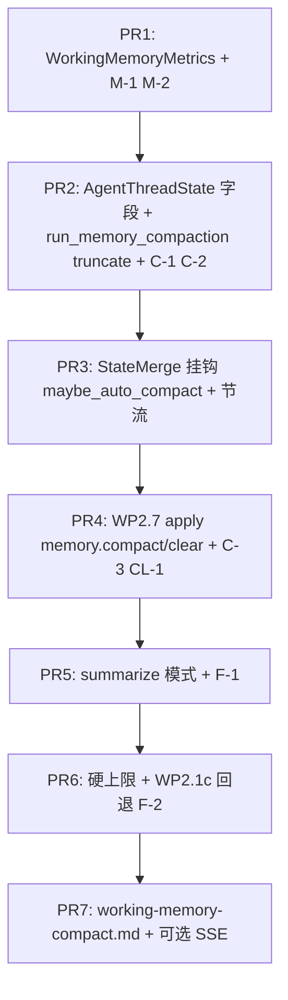

# WP2.9：工作记忆与压缩钩子 — 实现计划

本文档将 [phase-2-plan.md](./phase-2-plan.md) **§4 WP2.9** 与交付项 **D10** 落实为可执行任务：**偏早压缩**（阈值可配，默认与 [agents/memory.md](../agents/memory.md) §5.1 **约 50%** 建议一致）；**槽位预算可导出**；**压缩失败回退** 到 **WP2.1c** 式安全截断；**手动**（§5.1 **`/memory compact`**、**`/memory clear`**，经 [phase-2-wp7.md](./phase-2-wp7.md) **`ControlAction`**) 与 **自动触发** **共用同一策略入口** `run_memory_compaction(...)`。

**WP2.9 交付**：**`WorkingMemoryMetrics`**（或等价）**可序列化导出**；**`MemoryCompaction`** 模块（计量 + 策略 + 回退）；**`AgentThreadState` 扩展字段**；**AgentLoop / `StateMerge` 后** 与 **`control_actions`** 分发点 **接线**；**单测**；**`docs/guides/working-memory-compact.md`**。

**不交付**：**WP3.6** 磁盘记忆；**WP3.2** Assembly 多槽位拼装；**WP3.3** 多模板注册表（**仅** 预留 **策略接口** + **单实现**，见 §8）；**WP3.5** 独立子 LLM 质检管线；**跨会话** 向量挤出。

**文档版本**：0.2  
**日期**：2026-04-04  
**上游依据**：[phase-2-plan.md](./phase-2-plan.md)；[plan-detailed.v2.md](./plan-detailed.v2.md) §6.1（WP2.9）、§5.1；[agents/memory.md](../agents/memory.md) §4–§5；[phase-2-wp1c.md](./phase-2-wp1c.md) §3、§6；[phase-2-wp7.md](./phase-2-wp7.md) §2.3–2.4、§5.2；[`agent_thread_state.hpp`](../../include/agent/internal/agent_thread_state.hpp)；[`agent_loop_node.cpp`](../../src/node/agent_loop_node.cpp) `state_merge`

---

## 1. 依赖

| 前置 | 说明 |
|------|------|
| **WP2.0** | **`AgentThreadState`** 随 **`kNextAgentState`** **在请求间可写回**；否则压缩 **仅** 单次运行内有效，**仍** 可验收 WP2.9 **代码路径**，但 **D11** 未闭合 |
| **WP2.1c** | **回退路径** **必须** 复用 **`apply_text_budget` / `_af_truncation` 包装**（或 **同语义** 的 **单处** 实现），**禁止** 第二套不兼容 JSON 形状 |
| **WP2.7** | **`memory.compact` / `memory.clear`** 以 **`ControlAction`** 形式 **已解析**；WP2.9 **实现** `apply_control_action_memory(...)` **内** 调用 §5 **同一入口** |
| **主循环** | 挂钩点以 **现有** `StateMerge` **输出 `history` 之后** 为准（**不** 新增 **手连** `precede`；**用** **同一 functor 内顺序调用** 或 **独立节点** + **`input_specs`**） |

---

## 2. 计量对象与范围（2.9.1，无疑点）

### 2.1 纳入计量的数据

**仅** **`AgentThreadState::history`** 内 **`Message` 条目**（**不含** `initial_user_prompt` **除非** 已 **复制进** 某条 `history` **user** 消息；**不含** `skill_prompt_cache` **字节**，该部分 **仍由** `LLMInput` 拼装逻辑负责）。

| 槽位 | 计量方式 |
|------|----------|
| **每条 `Message`** | `bytes_i = utf8_byte_length(content)`；`content` **空** 则 **0** |
| **`role == tool`** | 若 **`tool_result`** 已进 **`content`**（JSON 字符串），**对该字符串** 计字节；若 **未来** 结构体字段分离，**以 `Message` 文档为准** 统一为 **与 `history_formatter` 喂给模型的字符串一致** |

**不纳入 WP2.9 v1**：**尚未** merge 进 `history` 的 **`pending_injected_context`**（WP2.7）；**下一轮** merge 后自然进入 **`history`** 再计量。

### 2.2 `WorkingMemoryMetrics`（导出 JSON 固定键）

由 **`working_memory_metrics(const AgentThreadState&)`** 返回 **`nlohmann::json`**，**必填键**：

| 键 | 类型 | 说明 |
|----|------|------|
| `history_message_count` | number | `history.size()` |
| `history_utf8_bytes` | number | **所有** 消息 **§2.1** 字节 **之和** |
| `tool_messages_count` | number | `role==tool` 条数 |
| `tool_results_utf8_bytes` | number | **仅** tool 消息字节和 |
| `soft_limit_bytes` | number | 来自 env §3 |
| `hard_limit_bytes` | number | 来自 env §3 |
| `trigger_ratio` | number | `AGENT_MEMORY_COMPACT_TRIGGER_RATIO` |
| `effective_usage_ratio` | number | **`history_utf8_bytes / soft_limit_bytes`**，**soft==0** 时 **固定为 `0`**（**不** 除零） |
| `would_auto_trigger` | bool | **`history_utf8_bytes >= soft_limit_bytes * trigger_ratio`** 且 **soft>0** |

**实现**：**UTF-8 字节** = `std::string::size()`（**与** WP2.1c **一致**）。

---

## 3. 阈值与环境变量（固定默认值）

| 变量 | 默认 | 说明 |
|------|------|------|
| **`AGENT_MEMORY_SOFT_LIMIT_BYTES`** | **`1048576`** | **软上限**（**1 MiB**）；用于 **比例触发**；**`0`** = **禁用** 基于比例的自动触发（**仍** 受 **硬上限** 约束） |
| **`AGENT_MEMORY_HARD_LIMIT_BYTES`** | **`2097152`** | **硬上限**（**2 MiB**）；`history_utf8_bytes > hard` **必须** 在进入 **下一次** `LLMNode` **之前** 执行 **一次** **压缩尝试**（§5）；**`0`** = **禁用** 硬上限强制（**不推荐** 生产） |
| **`AGENT_MEMORY_COMPACT_TRIGGER_RATIO`** | **`0.5`** | 对齐 [memory.md](../agents/memory.md) §5.1 **偏早** 建议；**自动触发** 条件见 §4.1 |
| **`AGENT_MEMORY_COMPACT_MODE`** | **`truncate`** | **`truncate`** \| **`summarize`**（见 §5） |
| **`AGENT_MEMORY_COMPACT_HEAD_KEEP`** | **`1`** | **截断策略**：**保留** `history` **前缀** 消息条数（**至少** 保留 **首条** 若存在） |
| **`AGENT_MEMORY_COMPACT_TAIL_KEEP`** | **`8`** | **截断策略**：**保留** **后缀** 消息条数 |
| **`AGENT_MEMORY_SUMMARY_MAX_OUT_BYTES`** | **`4096`** | **`summarize`** 模式：**模型输出** 硬上限 |
| **`AGENT_MEMORY_SUMMARY_TIMEOUT_MS`** | **`20000`** | **`summarize`**：**LLM** 超时 → **回退** |
| **`AGENT_MEMORY_AUTO_MIN_STEPS`** | **`1`** | **两次自动压缩** 之间 **`next->iteration` 的最小增量**（与现有 `AgentThreadState::iteration` **语义** 一致；**压缩成功** 后把 **`last_memory_auto_compact_iteration` 置为** 当时的 `iteration`） |
| **`AGENT_MEMORY_AUTO_COMPACT`** | **`1`** | **`0`**：**禁用** §4.1 自动触发（**手动** `memory.compact` **仍** 可用）；非 `0`：**开启** |
| **`AGENT_MEMORY_SUMMARY_INPUT_MAX_BYTES`** | **`80000`** | **`summarize`** 模式：**喂给** 摘要模型的 **中间段** 文本 **硬上限**（UTF-8 安全截断尾部） |

---

## 4. 触发（自动 vs 手动，无疑点）

### 4.1 自动触发条件

在 **`StateMerge` 已产出 `next` 状态**（`history` 已追加本轮 assistant/tool）之后调用 **`maybe_auto_compact(next, opts)`**：

**满足以下任一** 且 **`AGENT_MEMORY_AUTO_COMPACT` ≠ `0`**：

1. **硬上限**：`hard_limit_bytes > 0` **且** `history_utf8_bytes > hard_limit_bytes`。  
2. **软比例**：`soft_limit_bytes > 0` **且** `history_utf8_bytes >= soft_limit_bytes * trigger_ratio`。

**且** **节流**（字段见 §7）：**初值** `last_memory_auto_compact_iteration = -1`。**允许** 执行自动压缩 **当且仅当**  
`next->iteration - next->last_memory_auto_compact_iteration >= AGENT_MEMORY_AUTO_MIN_STEPS`  
（**故** 首次 **`iteration==0`** 时 **`0 - (-1) >= 1`** **成立**，**允许**；**成功后** **设** `last_memory_auto_compact_iteration = next->iteration`，**与** `StateMerge` **完成时** 的 **计次** **一致**）。

**同一 `StateMerge` 调用栈内**：**最多** **`1` 次** `run_memory_compaction`（**防重入**：**函数静态** `thread_local bool` 或 **`AgentThreadState` 临时 flag** **当帧清除**）。

### 4.2 手动触发

- **`ControlAction{ memory.compact }`**（WP2.7 **`/memory compact`**）：**忽略** §4.1 节流与比例；**调用** §5 **同一** `H`/`T` **算法**；**若** `H + T >= n` → **no-op**，**日志** `[memory] compact noop reason=min_size`。  
- **`ControlAction{ memory.clear }`**：**`history.clear()`**；**`last_error.clear()`**；**`last_memory_auto_compact_iteration = -1`**；**不** 修改 **`initial_user_prompt`**；**`iteration`** **置 `0`**（**固定**，与「新轮对话上下文」语义一致）；**`skill_prompt_cache` / `active_skill_id`** **清空**（`reset()`）。

---

## 5. 策略入口 `run_memory_compaction`（2.9.2 / 2.9.3）

**签名（概念）**：

```cpp
enum class MemoryCompactTrigger { auto_threshold, manual_compact, hard_cap };

struct MemoryCompactResult {
    bool did_mutate = false;
    std::string strategy_used;       // "truncate" | "summarize" | "fallback_truncate"
    std::size_t bytes_before = 0;
    std::size_t bytes_after = 0;
    std::string log_reason;            // 稳定短码
};

MemoryCompactResult run_memory_compaction(
    AgentThreadState& st,
    MemoryCompactTrigger why,
    const MemoryCompactOptions& opt); // toolbus/llm 由 opt 注入
```

**所有** 自动 / 手动 **压缩** **必须** 经此函数（**唯一策略入口**）。

### 5.1 模式 **`truncate`**（默认）

**前置**：`n = st.history.size()`。从 env 读 **`H_env` / `T_env`**，**计算**：

- **`H = min(max(H_env, 1), n)`**（**禁止** `H_env<1`）  
- **`T = min(max(T_env, 0), n)`**  

若 **`H + T >= n`** → **no-op**（**无前** 可丢 **中间段**）。

**否则**：

1. **`head = history[0 .. H-1]`**  
2. **`tail = history[n - T .. n-1]`**（**与** `head` **不重叠**）  
3. **删除中间**；**插入一条** **`Message`**：**`role = system`**，`content` **固定模板**（**英文**，**≤512 字节** 截断中间说明）：

```
[memory_compacted mode=truncate trigger=<auto|manual|hard> dropped_messages=<M> bytes_before=<B0> bytes_after=<B1> policy=wp29-v1]
```

4. **新 `history = head + [system] + tail`**（**顺序固定**）。

### 5.2 模式 **`summarize`**

1. **待摘要段**：**中间** 与 §5.1 **同一套** `H`、`T` **计算**；若 **`H + T >= n`** → **no-op**。  
2. **构造** `LLMInput`：**system** 强制 **仅输出 JSON**：`{"summary":"..."}`；**user** 为 **中间消息** 的 **线性文本化**（**与** `history_formatter` **一致** 的 **简化** 拼接，**上限** **`AGENT_MEMORY_SUMMARY_INPUT_MAX_BYTES`** 默认 **`80000`**，**超出** **截断尾部** UTF-8 安全）。  
3. **调用** **`LLMClient`**（**复用** 主客户端 **或** **`AGENT_MEMORY_SUMMARY_MODEL`** 非空时 **专用** endpoint，**未实现** 前 **等同** 主客户端）。  
4. **解析成功**：**插入** **一条** `role=system`，`content = "[memory_compacted mode=summarize]\n" + summary`（**summary** **截断** 至 **`AGENT_MEMORY_SUMMARY_MAX_OUT_BYTES`**）。  
5. **失败**（超时、非 JSON、`summary` 缺失）：**回退** → **执行一遍** §5.1 **`truncate`** **`同一`** `head/tail`** 参数**，**`strategy_used=fallback_truncate`**，`log_reason=summary_failed`。

### 5.3 压缩后仍超硬上限（2.9.3）

在 **`run_memory_compaction` 返回后** **立即** **重算** `history_utf8_bytes`：

- 若 **`hard_limit_bytes > 0`** 且 **仍** `> hard_limit_bytes`：对 **`history` 中每条** **`role==tool`** 的 **`content`**（或 **等价 JSON 载荷**）**就地** 调用 **WP2.1c** **`apply_tool_result_budget(...)`**（**由尾到头** 处理 **直到** ≤ hard **或** 无可截断）；**仍** 超出则 对 **`assistant`/`user` 长文** **从尾开始** **UTF-8 截断** **单条** **直到** 满足（**最后手段**）。  
- **全程** **不** `throw`；**日志** **`[memory] fallback_1c bytes=…`**。

---

## 6. 挂钩顺序（与 AgentLoop 一致）

**固定顺序**（在 **`state_merge` functor** **末尾** 或 **紧随** 其后的 **节点**，**同一拓扑依赖**）：

1. **`apply_pending_control_actions`**（WP2.7）：**先** 处理 **`memory.clear`**（**清空**），**再** **`memory.compact`**（**手动压**）。  
2. **`maybe_auto_compact`**（§4.1）：**仅当** 步骤 1 **未** `clear` **全表** **或** **无论** 是否 compact **均可** 再判自动 — **固定**：**先** manual，**后** auto；**若** `clear` 已执行，**仍** 允许 auto **若** 阈值满足（**通常** 否）。  
3. **组装下一轮 `LLMInput`**（**现有** 逻辑）：**读取** **已裁剪** 的 `history`。

**禁止**：在 **工具未写入 `history`** 前 **仅** 依据 **软阈值** **删掉** 仍需要的 **tool 上下文** **除非** §5.1 **tail_keep** **已保证** 最近工具链 — **文档** 建议 **`tail_keep >= 4`** 以覆盖 **一轮** tool 往返。

---

## 7. `AgentThreadState` 扩展（固定字段名）

在 [`agent_thread_state.hpp`](../../include/agent/internal/agent_thread_state.hpp) **追加**：

| 字段 | 类型 | 默认 | 说明 |
|------|------|------|------|
| `last_memory_auto_compact_iteration` | `int` | **`-1`** | §4.1 节流 |
| `last_memory_compaction_ts` | `std::optional<std::time_t>` | null | **可观测**；**每次** 成功 `did_mutate` **写入** `std::time(nullptr)` |

**可选**（**v1 可不实现**）：`memory_compaction_count` **uint32** 单调增。

---

## 8. 与 WP3.3 的扩展点（仅接口，不实现注册表）

定义 **`MemoryCompactionStrategy`** 抽象基类：

- `virtual MemoryCompactResult run(AgentThreadState&, MemoryCompactTrigger, const MemoryCompactOptions&) = 0;`

**WP2.9** **仅** 交付：

- **`TruncateStrategy`**（§5.1）  
- **`SummarizeStrategy`**（§5.2，**内部** 组合 **回退**）  
- **`MemoryCompactionRegistry::from_env()`** 返回 **当前** 策略指针（**单例** **或** **enum switch**，**禁止** 阶段 2 **多模板** UI）

阶段 3 **WP3.3** **替换** `from_env()` **为**「模板 id → 策略」**无需** 改 **`run_memory_compaction`** **签名** **若** **早** 用 **registry**。

---

## 9. 可观测性与 A2A

### 9.1 日志

每次 **`did_mutate==true`**：

`std::clog << "[memory] compact strategy=" << ... << " bytes " << before << "->" << after << " trigger=" << ... << "\n";`

### 9.2 SSE（若 WP2.2 已具备任务事件）

推送 **可选** 事件 **`memory_compacted`**（**不** 阻塞 DoD）：载荷 **含** `bytes_before`、`bytes_after`、`strategy_used`、`task_id`（若有）。

---

## 10. 测试计划

### 10.1 `tests/test_working_memory_metrics.cpp`

| ID | 场景 | 期望 |
|----|------|------|
| **M-1** | 空 `history` | `history_utf8_bytes==0`，`would_auto_trigger==false` |
| **M-2** | 已知字节和 | `history_utf8_bytes` **等于** 手算 |

### 10.2 `tests/test_memory_compaction_truncate.cpp`

| **C-1** | `n=20`, head=1, tail=8 | 中间 **替换为 1 条 system**；**总条数** **1+1+8=10** |
| **C-2** | `n <= 9` | **no-op** |
| **C-3** | 手动 **`memory.compact`** | **忽略** 自动节流，**仍** **执行** truncate |

### 10.3 `tests/test_memory_compaction_fallback.cpp`

| **F-1** | mock LLM **抛错** / 超时 | **`fallback_truncate`**，**history** **合法** |
| **F-2** | 压缩后 **仍** `> hard` | **调用** mock **WP2.1c** **或** **断言** **工具消息** **被包装** `_af_truncation` |

### 10.4 `tests/test_memory_clear.cpp`

| **CL-1** | **`memory.clear`** | **`history.empty()`**，**`iteration==0`**，**`initial_user_prompt`** **不变** |

---

## 11. PR 提交顺序



---

## 12. 验收清单（DoD）

- [ ] **D10**：**可导出** §2.2 **JSON**（**单元测试** 断言键集）。  
- [ ] **偏早触发**：**默认** `ratio=0.5` **与** **memory.md** 建议 **一致**（**文档** 引用）。  
- [ ] **`/memory compact` 与自动** **共用** `run_memory_compaction`。  
- [ ] **压缩失败**：**summarize** **必定** 回退 **truncate**；**仍** 超 **hard** **必定** 走 **WP2.1c 式** 截断（**F-2**）。  
- [ ] **`/memory clear`** **行为** 与 §4.2 **一字一致**。  

---

## 13. 相关链接

- [phase-2-plan.md](./phase-2-plan.md)  
- [plan-detailed.v2.md](./plan-detailed.v2.md) §6.1  
- [agents/memory.md](../agents/memory.md)  
- [phase-2-wp1c.md](./phase-2-wp1c.md)  
- [phase-2-wp7.md](./phase-2-wp7.md)  
- [phase-2-wp8.md](./phase-2-wp8.md)（Verifier **不** 替代压缩）  

---

## 14. 修订记录

| 日期 | 版本 | 说明 |
|------|------|------|
| 2026-04-04 | 0.1 | 初稿：计量、阈值、触发、truncate/summarize/回退、挂钩、测试与 PR |
| 2026-04-04 | 0.2 | §4.1 节流公式固定；§3 补 `AGENT_MEMORY_AUTO_COMPACT`、`AGENT_MEMORY_SUMMARY_INPUT_MAX_BYTES`；§5.1 head/tail clamp |
