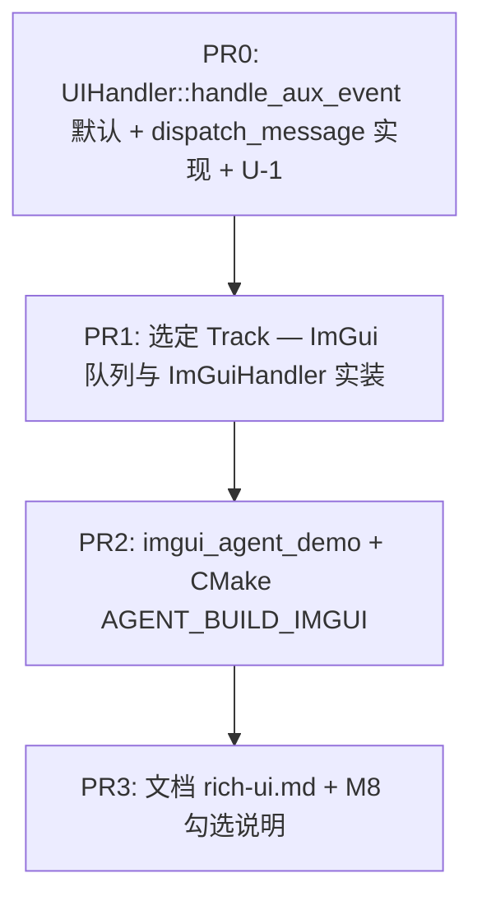

# WP2.U：富界面（ImGui / TUI / Web）— 实现计划

本文档将 [phase-2-plan.md](./phase-2-plan.md) **§4（可选）WP2.U**、**§1.3** 与 [plan-detailed.md](./plan-detailed.md) **§5.4、§7** 落实为可执行任务：在 **不阻塞 D1–D11** 前提下，**任选一条** **垂直切片**（**M8**）落地；**所有** 富界面 **仅** 通过 **`UIHandler` / `UIManager`** 与 **图工厂**（如 **`build_cli_agent_graph`**）对齐，**复用** [phase-1-wp6.md](./phase-1-wp6.md) **§4.3** 流式/终稿 **去重** 约定。

**WP2.U 交付（M8）**：**Track I、T、W 中完成其一** 即 **通过** M8；**推荐** 以 **Track I（ImGui）** 为 **默认** 展示路径。**共享基线**（**若** 任何 Track 合入）：**`UIManager::dispatch_message` 非空实现** + **`UIHandler` 可选 `handle_aux_event` 默认空**（§5）；**文档** **`docs/guides/rich-ui.md`**。

**不交付**：**生产级** 鉴权 UI、**多用户** 会话隔离 **完备** 方案（**留** WP2.5）；**与** A2A **完全等价** 的 **浏览器** 客户端（**仅** **最小** SSE 样例）；**移动端** 适配；**ImPlot** 深度绑定（**可选** 后续 PR）。

**文档版本**：0.2
**日期**：2026-04-04
**上游依据**：[phase-2-plan.md](./phase-2-plan.md)；[plan-detailed.md](./plan-detailed.md) §5.4、§7；[phase-1-wp6.md](./phase-1-wp6.md) §4；[`ui_manager.hpp`](../../include/agent/ui/ui_manager.hpp)；[`ui_sink_node.hpp`](../../include/node/ui_sink_node.hpp)；[`types.hpp`](../../include/agent/core/types.hpp) `StreamMessage` / `WebConnectionInfo`

---

## 1. 依赖与边界

| 前置 | 说明 |
|------|------|
| **阶段 1** | **`UIHandler`**、**`CLIHandler`**、**`UIManager::stream_token`** 行为稳定（[phase-1-wp6.md](./phase-1-wp6.md)） |
| **WP1.5 / WP2.0** | **`stream_callback` → `handle_stream_token`** 与 **Terminal Sink → `handle_final_result`** 路径 **可复用**；富界面 demo **须** 使用 **同一** `GraphExecutor` / `build_cli_agent_graph` **或** **显式** 文档化的 **薄包装** |
| **WP2.2**（**Track W** **强相关**） | **若** Web 样例 **消费** **A2A / AgentServer** 的 SSE，**须** 对齐 **当前** `AgentServer` **URL** 与 **事件** 形状；**独立** `web_ui_demo` **内置** httplib **可** **不** 依赖 WP2.2 **完成** M8 |
| **CI** | **默认** **不** 启用 **需显示服务器 / GL** 的用例；**仅** **`AGENT_BUILD_*` ON** 时 **编译** 对应 target；**可选** **`AGENT_RICH_UI_CI=compile_only`** **只** 测 **编译** |

---

## 2. 三条 Track（三选一验收 M8）

### 2.1 Track I — ImGui（**默认推荐**）

| 项 | 固定约定 |
|----|-----------|
| **目标可执行文件** | **`imgui_agent_demo`**（名称 **可** 调整 **须** 写入 CMake **`add_executable`** 与本文 **同步**） |
| **渲染线程模型** | **单** 主线程 **poll** GLFW（**或** SDL2 — **全仓** **固定一种**：**`GLFW3` + `OpenGL3` + Dear ImGui**） |
| **LLM / executor 线程** | **禁止** 直接 `ImGui::Text`；**必须** **`ImGuiHandler::handle_stream_token`** → **`ThreadSafeQueue<StreamMessage>`**；**渲染帧** **drain** 队列 **上限** **每帧 `AGENT_IMGUI_QUEUE_DRAIN_MAX`**（默认 **`256`**）**防** 卡死 |
| **`StreamMessage::message_type`** | **`token`** \| **`final`** \| **`error`**（与 [types.hpp](../../include/agent/core/types.hpp) 注释一致）；**扩展** **aux** 用 **`aux:`** 前缀，如 **`aux:tool_start`**（§5） |
| **去重** | **严格** [phase-1-wp6.md](./phase-1-wp6.md) **§4.3**：**流式** 仅 **增量**；**终稿** **仅** **`handle_final_result`** **或** **`message_type==final`** **一处** 落屏 **主答案区**（**禁止** 再 **全文 dump** 已 stream 过的 **同一段**） |
| **CMake** | **`AGENT_BUILD_IMGUI`**（**`OFF`** 默认）；**ON** 时 **find/ FetchContent** ImGui + GLFW；**OFF** 时 **目标** **`imgui_agent_demo`** **不** 加入 **all** |
| **图接线** | **优先** [`UISinkNode::create_imgui`](../../include/node/ui_sink_node.hpp) **若** 实现 **已** 与 **demo** 一致；**否则** demo **直接** **`UIManager::register_gui_handler` + `stream_token("default", tok)`**（与阶段 1 **一致**） |

### 2.2 Track T — TUI（终端全屏）

| 项 | 固定约定 |
|----|-----------|
| **目标可执行文件** | **`tui_agent_demo`** |
| **后端** | **FTXUI 7.0.1**，vendored 子模块 `3rd-party/FTXUI`；本表原 ncurses 合同自 FTXUI 迁移后已被取代 |
| **CMake** | **`AGENT_BUILD_TUI`**（**`OFF`** 默认）；**ON** 时只加入 FTXUI 核心目标；子模块未初始化则给出确定性 FATAL_ERROR 与初始化命令 |
| **与 CI** | **HEAD** **不** 将 **`tui_agent_demo`** 加入 **必跑** `ctest`；**允许** **编译** job **分轨** |
| **事件模型** | **`TuiHandler : public UIHandler`** 与 `UiPresentationModel` 保持后端无关；FTXUI view 读取 snapshot，并用线程安全 Custom event 刷新流式输出 |
| **输入** | FTXUI UTF-8 输入组件；Enter 提交，Escape 取消，Ctrl+C 退出，PageUp/PageDown/滚轮滚动，紧凑布局支持 `1`/`2`/`3` 页面导航 |

### 2.3 Track W — Web（浏览器 + SSE）

| 项 | 固定约定 |
|----|-----------|
| **目标可执行文件** | **`web_ui_demo`**（**内置** **httplib** **静态服务**） |
| **静态资源** | 目录 **`agent_framework/examples/web_ui_static/`**（**`index.html` + 少量 JS/CSS**） |
| **浏览器协议** | **`GET /`** → `index.html`；**`GET /ui/sse?session=default`** → **`text/event-stream`**；**每事件** **`data: ` + 单行 JSON**；**`kind`** ∈ **`token` \| `final` \| `error` \| `aux`**（**`aux`** 时 **含** `type` / `payload`） |
| **`WebHandler`** | **实现** [`web_handler.cpp`](../../src/ui/web_handler.cpp) **当前 stub**：**`handle_stream_token`** **须** 调 **`send_sse_event("token", payload)`**；**`handle_final_result`** → **`event final`** |
| **与 A2A** | **v1** **允许** **仅** 本 demo **进程内** 推流；**扩展** PR **可** 把 **`WebConnectionInfo`** **接到** **真实** `httplib::DataSink` **长连接**（[WP2.2](./phase-2-wp2.md)） |
| **CMake** | **`AGENT_BUILD_WEB_UI`**（**`OFF`** 默认） |

---

## 3. 共享：流式 / 终稿 / 错误（无疑点）

| 事件 | **推荐入口** | 行为 |
|------|----------------|------|
| **流式 token** | `UIManager::stream_token(session_id, token)` | **所有** 已注册 **`UIHandler`** **串行** `handle_stream_token`（**已有** `handlers_mutex_`） |
| **终稿 JSON** | **`dispatch_to_all({ h.handle_final_result(j); })`** **或** **Sink** **直接** 调 **具体** handler | **JSON** **键** **至少** `final_answer`（**字符串**）；**与** CLI **一致** |
| **错误** | `handle_error(string)` | **红色** / **前缀** **`[error]`**（**TUI/Web** **等价** 语义） |

**会话 id**：**单用户 demo** **固定** **`"default"`**；**Web** **query** **`session`** **缺省** **`default`**。

---

## 4. 共享：`dispatch_message` 与辅助事件

**现状**：[`ui_manager.cpp`](../../src/ui/ui_manager.cpp) **`dispatch_message`** 为 **空 stub**。

**WP2.U 固定实现**：

1. **`void UIHandler::handle_aux_event(std::string_view type, const json& payload)`**
   - **在** `UIHandler` **基类** **内联默认** **`{}`**（**非纯虚**）；**`CLIHandler`** **不重写**（**无操作**）。
2. **`ImGuiHandler` / `WebHandler` / `TuiHandler`（若存在）`** **重写**：**统一** 使用 **`StreamMessage`**，**`message_type = "aux:" + std::string(type)`**，**`content = payload.dump()`**（**禁止** 另设 **并行** `aux_queue`，**避免** 双消费顺序）。
3. **`UIManager::dispatch_message(type, data)`** → **`lock`** → **对** 全部 handler **`handle_aux_event(type, data)`**。

**`type` 闭集（v1）**：

| `type` | `payload` 必填键 | 含义 |
|--------|------------------|------|
| **`tool_start`** | `name` (string) | 工具 **开始** |
| **`tool_end`** | `name`, `ok` (bool) | 工具 **结束** |

**调用点**（**后续** PR **与** ToolBus **接线**）：**`ToolCallNode`** **成功/失败** **边界** **`dispatch_message`**；**若** 阶段 2 **尚未** 接线，**M8** **仍** **可** **过**：**demo** **手动** **`dispatch_message`** **单测** **即可**。

---

## 5. `UISinkNode` 与图工厂

| 组件 | 要求 |
|------|------|
| **`UISinkNode::create_imgui`** | **M8** **不** 阻塞于此工厂：**Track I** **主路径** **为** **`UIManager::register_gui_handler` + `stream_token`**；**`create_imgui`** **可** 后续 PR **对齐** **同一** 语义 |
| **`UISinkNode::create_web`** | **须** 传入 **有效** `WebConnectionInfo` **或** **demo** **用** **占位** **内存** **连接** **对象** |

**依赖边**：**仅** **`input_specs`** 声明 **数据流**（**.cursorrules**）。

---

## 6. 测试与 CI

| ID | 类型 | 内容 |
|----|------|------|
| **U-0** | **编译** | **`AGENT_BUILD_IMGUI=ON`** **或** **`AGENT_BUILD_TUI=ON`** **或** **`AGENT_BUILD_WEB_UI=ON`** **至少** 一轨 **在** CI **matrix** **编译通过** |
| **U-1** | **单元** | **`dispatch_message("tool_start", …)`** → **mock handler** **`handle_aux_event`** **被调用** **一次** |
| **U-2** | **单元** | **`AGENT_BUILD_IMGUI=ON`** 时：**`ImGuiHandler`** **push + drain**（**单线程** 顺序）；**否则** **ctest** **`SKIP`** 或 **改测** **所选** Track **对应** handler |
| **U-3** | **手动** | **Track** **对应** demo：输入 **短** prompt → **见** **流式** → **见** **终稿** **无** **重复** **全文** |

**禁止**：**在无显示** CI **跑** GLFW **窗口** **阻塞**；**自动化** **仅** **编译** + **U-1/U-2**。

---

## 7. PR 提交顺序（建议）

**Track T / W** **可** **替换** P1/P2 **为** **TUI** **或** **Web** **平行** PR **序列**（**不** **要求** **同一** PR **三端**）。

---

## 8. 验收清单（M8 / DoD）

- [ ] **三选一**：**`imgui_agent_demo`** **或** **`tui_agent_demo`** **或** **`web_ui_demo`** **可** **从** `getting_started` **或** `rich-ui.md` **启动**。
- [ ] **`UIHandler`** **三路** API **行为** 与 **§3** **一致**；**§4.3 去重** **人工** **U-3** **通过**。
- [ ] **默认 CMake**：**富界面** targets **不** **拖垮** **无** 依赖 **机器**。
- [ ] **`UIHandler::handle_aux_event`** **默认实现** + **`UIManager::dispatch_message`** **非 stub** **且** **U-1** **绿**。

---

## 9. 与阶段 3

**同一** `UIHandler` / **`handle_aux_event`** **扩展** **RAG** **命中** **列表** **等** **不** **破坏** WP2.U **v1** **闭集**；**新** `type` **须** **登记** **`rich-ui.md`**。

---

## 10. 相关链接

- [phase-2-plan.md](./phase-2-plan.md)
- [plan-detailed.md](./plan-detailed.md) §5.4、§7
- [phase-1-wp6.md](./phase-1-wp6.md)
- [phase-2-wp2.md](./phase-2-wp2.md)

---

## 11. 修订记录

| 日期 | 版本 | 说明 |
|------|------|------|
| 2026-04-04 | 0.1 | 初稿：Track I/T/W、线程模型、SSE JSON 行、dispatch_message、测试与 PR |
| 2026-04-04 | 0.2 | 固定 aux 队列语义、Web SSE JSON、`create_imgui` 与 M8 关系、DoD 笔误 |
