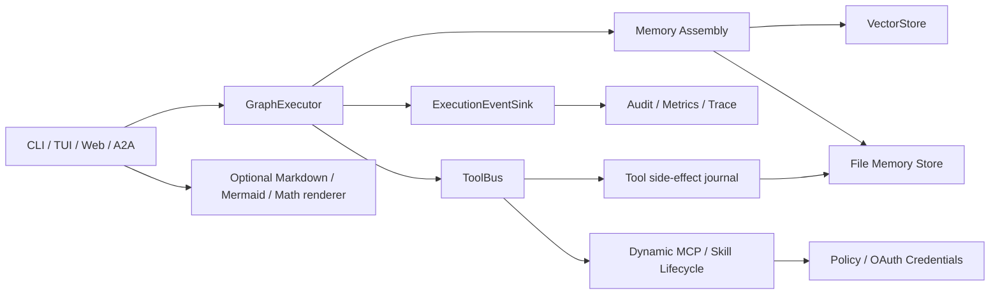
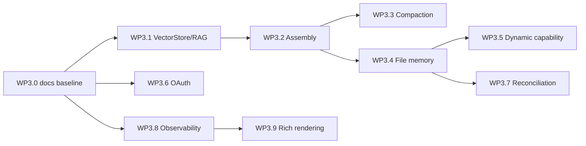

# Phase 3 更新实施计划：RAG、持久记忆、动态能力与生产收敛

**状态**：历史初版计划；当前修复基线为 [phase-3-update-05.md](./phase-3-update-05.md)，进度证据见 [phase-3-status.md](./phase-3-status.md)。
**日期**：2026-08-09  
**前置基线**：[phase-2-update.md](./phase-2-update.md)、[plan-detailed.v2.md](./plan-detailed.v2.md)、[agent-server.md](./agent-server.md)

## 1. 范围裁定

本计划只覆盖当前源码仍缺失或缺少生产闭环的能力。以下能力已在 Phase 2 落地，**不重复实现**：

- `GraphExecutor`、`ExecutionRequest/Result/EventSink`、Server SessionStore/CAS、Tier B、Verifier、memory compact、TaskControl、ChildTask 统一模型；
- A2A JSON-RPC、SSE、`SendStreamingMessage`/`SubscribeToTask`；
- 静态 Cursor `mcp.json` 导入、Skills 静态发现和受控脚本执行；
- CLI/TUI/Web/ImGui/Live AgentServer 的统一 `LiveRuntime` bootstrap。

Phase 3 完成不等于所有历史文档 checkbox 都勾选。每个工作包必须有代码、测试、运行证据和文档四态状态：`[ ]` 未开始、`[~]` 组件完成、`[x]` 集成完成、`[!]` 已知阻塞。

## 2. 目标架构

硬约束：所有外部副作用均要具有 `task_id`、`session_id`、`attempt`、权限上下文与 deadline；所有可恢复状态必须版本化；动态加载和渲染均不得绕过现有 jail、allowlist、SSRF 与认证策略。

## 3. 工作包

### WP3.0 — 事实基线与 Phase 2 文档校准

**目的**：消除“代码已存在、指南仍写未实现”的双源事实。

- 将 `phase-2-wp*.md`、`envs_status.md`、`agent_server_demo-update.md` 改为四态 DoD；删除已失效的 mock-only AgentServer、`cli_a2a_orchestrator_demo` 和 `cli_agent_skills_demo` 表述。
- 在每个 `[x]`/`[~]` 条目旁给出源文件、CTest 名称、最后验证日期；历史设计记录保留，但明确标为历史。
- 生成 `ctest -L phase2-*` 聚合命令和 CI job；记录 A2A spec/fixture revision 与测试数量。

**验收**：文档不再宣称 Verifier、Tier B、SessionStore、ExecutionEvent 或 Phase 2 labels 未实现；所有当前 demo 名称可由 CMake 验证。

### WP3.1 — VectorStore 与 RAG 最小闭环

**目的**：将现有 VectorStore/Faiss 接口从空壳变成可测检索能力。

**API 与数据模型**：

- 实现 `InMemoryVectorStoreBackend`：add/upsert/delete/search、metadata filter、稳定 score 排序；新增 `VectorRecord{id, vector, text, metadata, revision}`。
- 实现 `FaissBackend`：FlatIP 作为正确性基线，IVF/IVF_PQ 作为 opt-in；定义训练阈值、dimension 校验、持久化 index + metadata sidecar 格式。
- `KnowledgeBaseSourceNode` 接到真实 retrieval，返回带来源、score、chunk id 的 context/citation；禁止隐式把全文写回 prompt。
- CMake：`AGENT_BUILD_FAISS=ON` 仅构建 Faiss 适配；无 Faiss 时同一契约测试运行内存后端。

**测试**：向量维度失败、upsert 幂等、top-k 稳定性、filter、Faiss 与 memory backend 同集合结果、RAG citation、损坏 index 重建。

**验收**：一个离线 fixture 可完成 ingest → search → GraphExecutor context 注入；Faiss 可选测试不影响默认 CI。

### WP3.2 — Memory Assembly 与统一上下文预算

**目的**：将工作记忆、RAG、工具结果和技能资源装配为可解释、可裁剪的上下文。

- 定义 `MemorySlot{kind, source_id, priority, bytes, token_estimate, text, provenance}`；slot 类型至少含 system、task、working、retrieval、tool、skill。
- 新增 `MemoryAssemblyPolicy`：每 slot quota、总 hard/soft budget、裁剪顺序、引用摘要策略；输出 `MemoryAssemblyReport`。
- `GraphExecutor` 在 PromptRenderer 前调用 Assembly；`ExecutionEvent` 发送 `memory_assembled`、`memory_evicted`，不得记录原始敏感文本。
- 从当前 `run_memory_compaction` 复用策略入口，手动 `/memory` 与自动压缩调用同一 policy。

**验收**：输入、RAG、工具与 Skills 同时存在时预算确定；超限时按优先级裁剪而非随机截断；报告可导出为 JSON。

### WP3.3 — 压缩策略注册表与子 LLM 管线

**目的**：把单一压缩路径升级为按任务选择的、可回退的策略系统。

- `MemoryCompactorRegistry` 注册 `truncate`、extractive summary、structured summary 三种策略；配置 `AGENT_MEMORY_COMPACTOR` 与 trigger threshold。
- 子 LLM 使用独立 profile、超时、预算和无工具权限；输出固定 JSON schema，并保留原文 digest。
- 子 LLM 失败、schema 无效或超时必须回退 truncate；不得阻塞 main 请求无限重试。
- 将压缩质量统计作为 event/audit 数据，而非直接输出用户内容。

**验收**：至少两种策略的 fixture；失败回退、重复压缩幂等、取消传播和敏感字段脱敏均有测试。

### WP3.4 — 文件持久化记忆、索引与恢复

**目的**：提供无数据库依赖的长期记忆首版，并与 SessionStore 边界清楚分离。

- 配置 `AGENT_MEMORY_DATA_DIR`；目录布局为 `tenant/agent/session/`，包含版本化 JSONL event log、snapshot、blob、index manifest。
- 原子写入：临时文件 + fsync + rename；manifest 含 schema version、content digest、vector index revision 与 GC 标记。
- 恢复只加载 committed snapshot；损坏 JSONL 截断到最后有效记录并发出 audit warning；不得恢复未提交 attempt。
- RAG index 可增量更新或通过 manifest 重建；加密/密钥管理留为后续扩展，但文件权限和敏感字段 redaction 为必需。

**验收**：跨进程恢复 summary/retrieval metadata；崩溃模拟不污染已提交状态；可重建缺失/损坏的 Faiss sidecar。

### WP3.5 — 动态 MCP 与 Skills 生命周期

**目的**：受控地加载、卸载和切换能力，不以裸 `/cmd` 改动全局进程状态。

- 定义 `CapabilityManifest{id, version, kind, origin, permissions, digest, lifecycle_state}` 与 `CapabilityTransaction`；生命周期 `discovered → validated → staged → active → draining → removed/failed`。
- MCP：支持受信 manifest/source 的 stage、healthcheck、activate、drain、remove；活动请求持有 lease，draining 后拒绝新调用。
- Skills：包签名/依赖锁定/版本解析、安装和卸载必须先落到受控 registry；热切换以 session snapshot 绑定 capability revision。
- `/mcp`、`/skills` 仅创建 policy-checked transaction；审计记录操作者、审批、来源、digest、权限差异。未授权 capability 绝不进入 LLM tool schema。

**安全测试**：路径穿越、恶意 stdio command、签名不符、依赖冲突、撤销期间调用、跨 tenant visibility。

**验收**：一个 session 可固定使用旧 revision，另一个 session 可升级；卸载不打断已获 lease 的任务；重启后 registry 与审计一致。

### WP3.6 — OAuth Device Flow 与认证刷新

**目的**：在现有 Bearer/API key 之外提供可测试的外部身份集成。

- 定义 `TokenProvider` 与 `CredentialStore` 接口；内存 fake、受保护本地文件实现，禁止把 refresh token 放在日志或 URL。
- `AgentClient::refresh_authentication()` 实现 RFC 8628 device authorization + polling，支持 expiry、slow_down、取消；请求 transport 统一从 `TokenProvider` 取 access token。
- Server AuthGate 支持 issuer/audience/scope 验证抽象；JSON-RPC、SSE、well-known 的认证策略显式配置。
- 无外网测试使用 fake OAuth server / recorded HTTP fixture。

**验收**：过期 token 自动刷新一次；刷新失败不泄露 token；SSE 重连携带新 token；Bearer/API key 兼容不回归。

### WP3.7 — 工具副作用日志与 in-flight reconciliation

**目的**：补齐“工具已经执行、进程在 session commit 前崩溃”的 exactly-once 边界。

- 定义 `ToolEffectRecord{task_id, attempt, tool_call_id, idempotency_key, status, request_digest, result_digest, started_at, committed_at}`。
- 工具调用前 durable `started`，完成后 durable `completed`；session commit 将记录推进为 `committed`。恢复时由工具声明的 reconciliation policy 决定：replay、lookup、manual-review 或 fail-closed。
- 默认只允许幂等/可查询工具自动恢复；写工具必须显式提供 idempotency key 或返回 `manual_review_required`。
- 记录与 `TaskControl`、deadline、ChildTask 同步；cancel/failed attempt 不得产生伪 committed。

**验收**：故障注入覆盖 started/completed/commit 三个窗口；同一 idempotency key 不会重复写；不可恢复工具被安全隔离。

### WP3.8 — 统一可观测性、审计与性能告警

**目的**：把现有 ExecutionEvent 变成可检索的生产诊断面。

- 定义 `AuditEvent` schema：ts、trace_id、tenant/session/task/attempt、component、capability revision、latency、outcome、error code、payload digest。
- Sink adapters：stderr JSON、JSONL file、test collector；后续可接 OTEL/spdlog，但不将后端绑定到核心。
- 加入 `AGENT_TOOL_HOOK_WARN_MS`、MCP/LLM/renderer latency threshold；只记录摘要和统计，不记录密钥或完整 prompt。
- 关联 A2A SSE sequence 与 audit sequence，支持从 task_id 追溯 tool、memory、verifier、child task 和动态 capability。

**验收**：一次端到端任务的事件可按 trace 排序重放；慢 hook/mcp 出现结构化 warning；redaction 单测覆盖 secret/header/token。

### WP3.9 — 富 UI 可选渲染后端

**目的**：为 TUI/Web/ImGui 提供安全、缓存化的 Markdown 扩展视觉输出。

- 新增 renderer abstraction：plain fallback、Mermaid、LaTex/math；后端由 build flag + runtime allowlist 选择。
- 输入大小/图节点/渲染时间限制；渲染在隔离 worker 或受控子进程进行，产物写至 artifact store，不执行文档中的脚本。
- UI 使用同一 artifact/citation 模型显示图片、错误和 fallback 文本；Web 不信任 HTML，保持 escaping/CSP。
- 实际 GUI/Web 验收必须采集真实运行截图并比较关键状态（加载、成功、失败、fallback）。

**验收**：无渲染后端时纯文本不退化；恶意 Mermaid/LaTex 输入受限；三个 UI 至少一个真实运行链路通过截图验证。

## 4. 推荐 PR 顺序与依赖

建议：先完成 P0/P1 的离线可测基础，再进入涉及持久化、动态加载和外部认证的高风险工作。每个 PR 都必须包含 migration/rollback 说明；任何持久化 schema 改动都要 version + upgrader + fixture。

## 5. 总验收矩阵

| 类别 | 必需证据 |
|---|---|
| 默认 CI | 无密钥、无网络：VectorStore memory backend、memory assembly、压缩回退、事件/audit、OAuth fake、reconciliation fault injection |
| 可选依赖 | `AGENT_BUILD_FAISS=ON` 的 Faiss 契约与持久化重建 |
| 动态能力 | 签名/权限/lease/rollback/重启恢复测试；不接真实未受控 MCP |
| Live | 仅门闩 job：真实 LLM + MCP + A2A streaming；不作为默认 PR gate |
| UI | 真实运行截图；至少覆盖 renderer fallback 与 artifact 成功路径 |

## 6. 风险与不可妥协项

- 不以“接口已声明”代替实现：VectorStore/Faiss 必须有真实后端和契约测试。
- 不以“可 reload”代替安全生命周期：动态 MCP/Skills 必须有签名、授权、lease、审计与回滚。
- 不承诺分布式 exactly-once：对不可幂等外部系统必须暴露 manual-review 边界。
- 不把 token、完整提示、敏感记忆原文写入 SSE、日志或错误消息。
- 不让可选 Faiss、Mermaid、OAuth 网络依赖破坏默认离线构建与测试。
