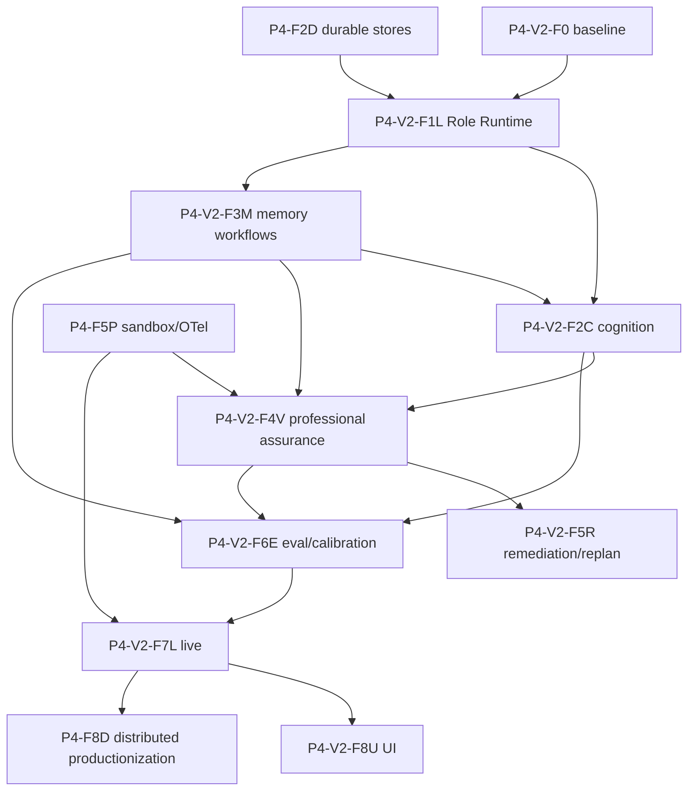

# Phase 4 v2：LLM 驱动规划、记忆与专业验收实施计划

**状态**：规划基线已批准；F1L–F8U 离线控制/呈现面已实施；Residual Closure R0–R7 已批准并开始执行，requirements 仍保持 partial
**计划版本**：`phase4-v2-plan-r1`  
**最后更新**：2026-08-11
**原始需求记录**：[phase-4-v2.md](./phase-4-v2.md)  
**阶段章程**：[phase-4.md](./phase-4.md)  
**事实状态**：[phase-4-status.md](./phase-4-status.md)  
**v1 历史计划**：[phase-4-plan.md](./phase-4-plan.md)  
**执行治理**：[phase-4/README.md](./phase-4/README.md)

## 1. 目标与完成口径

Phase 4 v2 在 v1 的 durable run、HITL、Memory View、Assurance Harness、Sandbox、Telemetry、Eval 和 Live 骨架之上，增加一个统一的角色化 LLM 工作流运行时，使任务认知、调查、规划、记忆加工、专业验证、修复和评测均成为可持久化、可审计、可校准的多阶段工作流。

v2 的核心架构原则是：

```text
LLM Cognitive Plane
  分析 / 调查策略 / 证据综合 / 规划 / 批评 / 记忆加工 / 专业解释
                            │
                            ▼
Deterministic Control Plane
  Schema / ACL / Authority / Policy / CAS / Approval / Oracle / Arbiter
                            │
                            ▼
Durable Evidence Plane
  Evidence / Artifact / MemorySnapshot / InvocationManifest / AcceptanceReport
```

“LLM 驱动”不表示把系统控制权交给模型。以下职责必须保持确定性：

- tenant、scope、ACL、authority、敏感度和数据驻留检查；
- schema validation、canonical digest、CAS、状态迁移和审批；
- artifact、测试、运行结果、指标和外部副作用的事实判定；
- mandatory criterion、oracle strength 和最终 Acceptance Arbiter；
- authoritative memory 晋升、跨作用域传播、纠错、撤销和遗忘。

系统不保存模型私有 chain-of-thought。可持久化的专业推理产物限定为结构化事实、证据引用、假设、未知项、备选方案、决策理由、风险、反例和置信度。

## 2. 重新评估基线

### 2.1 双基线

| 口径 | 当前满足度 | 含义 |
|---|---:|---|
| Phase 4 v1 原始目标 | 50–55% | 已形成共享契约、durable Assurance、remediation/replan 控制面和离线纵向骨架，生产适配器、真实 Live 与 HA 尚未关闭 |
| Phase 4 v2 扩展目标 | 68–72% | 保留 v1 已实现能力；F1L–F7L 离线控制面已实现，修复动作实际执行→新产物→复验闭环、生产数据集/Judge 校准/nightly、生产 hybrid retrieval 与真实 `executed=true` 认证仍是 mandatory DoD |

### 2.2 v2 能力成熟度

| 能力域 | 当前可复用能力 | v2 主要缺口 | 满足度 |
|---|---|---|---:|
| 角色化 LLM Runtime | Profile/Prompt/Route/Manifest/Reasoning/Calibration contracts、Router/schema gate、SQLite recovery、usage/latency、AgentLoop adapter | 独立 StructuredOutputPolicy、overlay/default revision、GraphExecutor 强制接入、timeout/live provider/calibration matrix | 70–75% |
| 认知与规划 | RoleRuntime adapter、strict stage/checkpoint、Intake/Strategy/只读调查/Synthesis/Boundary/Planner/独立 Critic/Revision/HITL、SQLite recovery、GraphExecutor template | 真实 investigator/provider calibration matrix、adaptive stop、跨 Store 原子提交、ApprovalStore 直连、默认强制门禁和 live/SLO | 75–80% |
| 专业验收 | Verification Planner、Manifest oracle、五专业 RoleRuntime verifier、Resolver、evidence closure/independence、SQLite checkpoint/report、强 oracle Arbiter、restart/GraphExecutor | 真实 Sandbox/ToolBus oracle adapters、双 verifier 策略、生产校准/benchmark、跨 Store atomic、修复后自动复验、默认强制、Live/UI | 75–80% |
| 多层记忆 | SQLite v2、六层 scope、Provider/View、ACL/authority/freshness/governance；九阶段 RoleRuntime workflow、candidate-only write、conflict/task state、query/rerank、dynamic View、promotion/forget recommendation、v1 dual-read/restart | 真实 profiles/provider calibration、可执行 hybrid index、跨 Store 原子提交、ApprovalStore 直连、cross-scope migration、默认强制接入、Live/HA/Inspector | 75–80% |
| 修复与选择性复验 | 三角色 RoleRuntime、typed ImpactInventory/Graph、确定性下游闭包、最小修复计划、PlanStore 父摘要 CAS、criterion anti-downgrade、token/cost/deadline budget、digest/freshness 复用门禁、SQLite restart、GraphExecutor | 实际修复执行器、产物新摘要回填、重新调用 F4V 的闭环、ApprovalStore 直连、跨 Store 原子协调、生产 calibration/live | 70–75% |
| Eval/Judge | 分层 suite/run/trajectory、Evaluation View、blind Primary/Secondary/Adjudicator RoleRuntime、agreement/kappa/bias/variance/CI、24 项领域指标、flaky/regression/critical gate、PDP/HITL upgrade/rollback、SQLite report/restart、GraphExecutor | 真实分层数据集与人工基线、生产 Judge calibration、nightly scheduler、signed report、trend/SLO、跨 Store atomic、默认强制接入 | 70–75% |
| LLM 可观测性 | Role Runtime InvocationManifest 记录 provider/model/profile/prompt/view/route/fallback/token/cost/latency/calibration，并桥接 Telemetry/Audit | OTLP/SLO、真实 provider usage 一致性、跨进程 correlation 和 live evidence | 50–55% |

当前可复用离线证据为 `phase4-offline` **45/45 PASS**、`phase3-offline` **14/14 PASS**，其中 `phase4-cognition-v2` **3/3 PASS**、`phase4-memory-v2` **4/4 PASS**、`phase4-assurance-v2` **4/4 PASS**、`phase4-remediation-v2` **4/4 PASS**、`phase4-judge-v2` **4/4 PASS**、`phase4-live-v2` **5/5 PASS**、`phase4-ui-v2` **1/1 PASS**、`phase4-harness` **3/3 PASS**。它证明确定性骨架、F1L–F8U 离线控制/呈现面及 R1I 顶层 durable saga/outbox/completion gate 没有回归，不证明真实 investigator/oracle/provider matrix、实际 Sandbox executor、生产 Judge 数据集/人工校准、长期记忆质量、nightly/live SLO 或外部生产认证已经执行。

## 3. v2 需求编号

| Requirement | 必须达到的结果 |
|---|---|
| `R4V2-00` | v1/v2 双基线、范围、术语、DoD、证据等级和兼容策略冻结 |
| `R4V2-01` | 所有 LLM 角色统一通过可版本化、可路由、可审计的 Role Runtime 调用 |
| `R4V2-02` | 任务理解和规划形成多阶段、证据驱动、可批评和可恢复的 LLM 工作流 |
| `R4V2-03` | 多层记忆具备 LLM 语义加工能力，同时不削弱 scope-first 和治理门禁 |
| `R4V2-04` | 五层验收包含相互独立的专业 LLM verifier 和确定性 oracle |
| `R4V2-05` | finding 可触发有界修复、影响分析、重规划和选择性复验 |
| `R4V2-06` | 规划、记忆、验证和 Judge 能在固定数据集上校准并阻止质量回归 |
| `R4V2-07` | 真实 provider/model/role 组合有不可静默跳过的 Live 认证证据 |
| `R4V2-08` | CLI/Web/TUI 可解释展示计划、证据、记忆、模型调用和验收状态 |

## 4. 公共契约与边界

### 4.1 新增公共契约

| 契约 | 关键字段 | 约束 |
|---|---|---|
| `LLMRoleProfile` | role、provider pool、model selector、reasoning effort、sampling、budgets、prompt/output schema revision、memory view、capabilities、independence group | 不允许把凭据写入 profile；profile revision 不可变 |
| `ModelRouteDecision` | requested/selected profile、provider/model、fallback reason、policy revision、capability/data-residency decision | 每次实际调用必须生成 |
| `PromptRevision` | prompt ID/revision/digest、input contract、output schema、redaction policy、compatibility | Prompt 内容与代码部署解耦但必须版本化 |
| `StructuredOutputPolicy` | schema、unknown-field policy、repair/retry limit、fail-closed action | parse failure 不得退化为无约束文本执行 |
| `LLMInvocationManifest` | task/run/plan/node/role、provider/model、prompt digest、Memory View digest、capabilities、input/output digest、token/cost/latency、retry/fallback、calibration revision | secret 和原始敏感正文必须脱敏；manifest 可持久恢复 |
| `ReasoningArtifact` | claims、evidence refs、assumptions、unknowns、alternatives、decision rationale、risks、counterexamples、confidence | 禁止要求或持久化隐藏 chain-of-thought |
| `RoleCalibrationRecord` | dataset/model/prompt/profile revision、metrics、thresholds、approved decision | 未通过校准的 revision 不得成为生产默认 |

### 4.2 角色默认配置

具体模型名称由部署配置和评测结果决定，不写死在领域工作流中。

| 角色 | 能力要求 | 建议设置 | 默认权限 / evidence authority |
|---|---|---|---|
| Intake Analyst | 强结构化抽取 | temperature 0–0.2 | 无工具写权限；candidate |
| Investigation Strategist | 强推理和工具规划 | high reasoning，0.1–0.3 | 只读 ToolBus/RAG/Web；candidate |
| Evidence Synthesizer | 长上下文和证据引用 | high reasoning，0–0.2 | 只读 Evidence/View；derived |
| Architecture Planner | 代码与系统设计能力 | high reasoning，约 0.1 | 只生成 plan candidate |
| Planning Critic | 强反例和遗漏发现 | high reasoning，0 | 与 Planner 不同 independence group |
| Executor | 稳定工具调用 | 0.1–0.3 | 仅按 Plan/PDP 授权 |
| Memory Extractor | 低成本结构化抽取 | 0 | 只生成 memory candidate |
| Memory Consolidator | 长上下文语义归并 | 0–0.1 | 不得自行晋升或遗忘 |
| Conflict Resolver | 冲突解释和澄清设计 | high reasoning，0 | recommendation only |
| Code/Architecture/Domain/Security Verifier | 专业分析、反例和只读调查 | high reasoning，0 | isolated Verification View；advisory evidence |
| Semantic Judge | 经固定数据集校准 | 0、固定 profile | 低等级 evidence，不能覆盖强 oracle |
| Eval Judge | 独立盲评 | 0、固定 seed/profile | 不得看到 label 或候选身份 |

关键任务至少配置两个独立 verifier。执行模型不得单独验收自己的产物；相同底层模型仅更换 system prompt 不自动构成独立性。

## 5. 实施批次与可落地任务

### P4-V2-F0 — v2 基线冻结

**进入条件**：用户批准 v2 文档规划。  
**退出门槛**：需求、状态、计划、追踪、决策和台账相互一致；不把计划状态写成实现状态。

| ID | 任务 | 交付物 |
|---|---|---|
| `P4-V2-F0.1` | 将原始讨论规范为正式需求 | `R4V2-00`–`R4V2-08` |
| `P4-V2-F0.2` | 冻结 v1/v2 双完成口径 | status 能力矩阵和证据边界 |
| `P4-V2-F0.3` | 建立 v2 追溯关系 | requirement→plan→source→test→evidence |
| `P4-V2-F0.4` | 冻结 LLM/确定性职责边界 | decision、negative criteria |
| `P4-V2-F0.5` | 定义发布、迁移和回滚原则 | feature flag、shadow、calibration gate |

### P4-V2-F1L — Role-based LLM Workflow Runtime

**优先级**：P0；必须先于原 `P4-F3I` 和 `P4-F4A` 的生产化适配。  
**候选落点**：`include/agent/llm_runtime/`、`src/llm_runtime/`，并扩展 core/telemetry/run contracts。  
**退出门槛**：任一规划、记忆或验证角色均不能绕过统一 Runtime；调用可恢复、可重放配置、可审计实际路由。

| ID | 任务 | 交付与验收重点 |
|---|---|---|
| `P4-V2-F1L.1` | 冻结 Role Runtime contracts | 上述七类 schema、digest、migration、invalid fixtures |
| `P4-V2-F1L.2` | Profile Registry | immutable revision、tenant/project overlay、rollback |
| `P4-V2-F1L.3` | Model Router 与 provider pool | capability、residency、budget、health、fallback reason |
| `P4-V2-F1L.4` | Prompt Registry | prompt digest、input/output compatibility、deprecation |
| `P4-V2-F1L.5` | Structured Output Gate | schema validate、bounded repair/retry、fail closed |
| `P4-V2-F1L.6` | Capability 与 Memory View binding | role 只能获得声明的只读/写入能力和 View profile |
| `P4-V2-F1L.7` | Independence Policy | planner/executor/verifier/judge 自验收负例必须被拒绝 |
| `P4-V2-F1L.8` | Invocation Manifest Store | request/result/retry/fallback/token/cost/digest 持久化 |
| `P4-V2-F1L.9` | Telemetry 与 Audit bridge | role/model/prompt/view/route correlation、敏感字段控制 |
| `P4-V2-F1L.10` | Durable checkpoint/recovery | 调用中断、超时、重启、重复提交和幂等恢复 |
| `P4-V2-F1L.11` | Fake/loopback fixtures | 确定性 fake、malformed output、fallback、timeout、redaction |
| `P4-V2-F1L.12` | AgentLoop/GraphExecutor adapter | 旧调用路径 feature flag 接入统一 Runtime |

### P4-V2-F2C — 多阶段任务认知与规划

**依赖**：F1L、Memory Investigation/Planning View、Run checkpoint、Approval。  
**候选落点**：扩展 `planning/cognition_workflow`，新增 stage、strategy、synthesis、critic、replan adapter。  
**退出门槛**：中等复杂仓库任务能从 intake 到 approved DAG 全流程恢复；每个计划结论可追溯到 evidence 或显式 assumption。

| ID | 任务 | 交付与验收重点 |
|---|---|---|
| `P4-V2-F2C.1` | LLMClient→CognitionModel 生产适配器 | profile/manifest/view/timeout/cancel 完整传递 |
| `P4-V2-F2C.2` | Intake Analyst stage | 目标、约束、验收、歧义、风险结构化；必要时触发 clarification |
| `P4-V2-F2C.3` | Investigation Strategist | 事实缺口、来源优先级、预算、停止条件和只读能力计划 |
| `P4-V2-F2C.4` | 多轮 investigator/tool loop | repo/docs/RAG/external evidence；预算、去重、失败分类 |
| `P4-V2-F2C.5` | Evidence/Claim Synthesis | claim-evidence graph、冲突、未知项、来源权威与新鲜度 |
| `P4-V2-F2C.6` | Change-mode/Boundary Analyzer | 修复/升级/重构模式、上下游合同、in/out scope |
| `P4-V2-F2C.7` | Architecture Planner | 可执行 DAG、产物、依赖、授权、每节点 AcceptanceContract |
| `P4-V2-F2C.8` | Independent Planning Critic | 完备性、可行性、证据、风险、回滚和验收反例 |
| `P4-V2-F2C.9` | Revision/HITL | critic finding、新证据或用户修改生成新 plan revision |
| `P4-V2-F2C.10` | GraphExecutor 集成与恢复 | stage checkpoint、kill/restart、bounded loops、UI event contract |

### P4-V2-F3M — LLM 驱动多层记忆

**依赖**：F1L、现有 `memory_v2` scope/store/view/governance。  
**候选落点**：`include/agent/memory_v2/workflows/`、`src/memory_v2/workflows/`。  
**退出门槛**：LLM 只能处理确定性 ACL/scope 过滤后的输入，只能输出 candidate/recommendation；未批准权威晋升和跨租户泄漏均为零。

| ID | 任务 | 交付与验收重点 |
|---|---|---|
| `P4-V2-F3M.1` | Memory Extraction Workflow | 从对话、工具、计划和结果提取带 provenance 的 candidate |
| `P4-V2-F3M.2` | Normalization/Entity Linking | entity/claim/time/source 规范化，避免同义重复和主体混淆 |
| `P4-V2-F3M.3` | Consolidation Workflow | 聚类、合并、supersede 建议；保留原始记录和 evidence refs |
| `P4-V2-F3M.4` | Conflict Resolver | 冲突解释、权威比较、澄清问题；不得自行改写 authoritative record |
| `P4-V2-F3M.5` | Task State Updater | 当前目标、状态、尝试、结果、证据和阻塞的结构化更新 |
| `P4-V2-F3M.6` | Query Planner/Reranker | scope-first 后进行 query expansion、hybrid retrieval 和 rerank |
| `P4-V2-F3M.7` | Dynamic View policy | 按 workflow phase、风险、预算动态选择 profile，记录选择/排除原因 |
| `P4-V2-F3M.8` | Promotion/forget recommendation | LLM 只建议；确定性 policy、验证和 HITL 执行 |
| `P4-V2-F3M.9` | Migration/negative/live validation | v1 dual-read、poisoning、ACL leakage、stale/conflict、restart、真实模型 |

### P4-V2-F4V — 多角色专业验证与五层验收

**依赖**：F1L、F2C、Verification View、Sandbox/Telemetry。  
**候选落点**：扩展 `assurance/` 的 verifier adapters、verification planner、evidence resolution 和 report store。  
**退出门槛**：LLM 判断不能覆盖失败的强 oracle；故意注入“测试通过但产物不完整”和“规划器自验收”均被拒绝。

| ID | 任务 | 交付与验收重点 |
|---|---|---|
| `P4-V2-F4V.1` | Verification Planner | 从任务/计划/AcceptanceContract 生成五层验证方案和证据需求 |
| `P4-V2-F4V.2` | Artifact/Runtime deterministic oracles | 文件、构建、测试、运行、副作用和环境事实 |
| `P4-V2-F4V.3` | Code Verifier | 实现正确性、边界、错误处理、测试充分性，只读 repo/build 工具 |
| `P4-V2-F4V.4` | Architecture Verifier | 上下游合同、依赖、兼容、演进和回滚 |
| `P4-V2-F4V.5` | Domain Verifier | 领域逻辑、标准、算法、数据和指标证据 |
| `P4-V2-F4V.6` | Security/Policy Verifier | 威胁、权限、隔离、凭据、供应链和审计 |
| `P4-V2-F4V.7` | Semantic/Completeness Verifier | 需求覆盖、生成物完备性、逻辑一致性和残余风险 |
| `P4-V2-F4V.8` | Isolation/Independence enforcement | 独立 role/profile/view；执行模型自证结果降权或拒绝 |
| `P4-V2-F4V.9` | Cross-verifier evidence resolution | finding 去重、冲突展示、证据强度与不确定性，不用多数投票覆盖事实 |
| `P4-V2-F4V.10` | Deterministic Arbiter/report persistence | mandatory gate、oracle precedence、partial/manual review、durable report |

### P4-V2-F5R — 修复、重规划与选择性复验

**依赖**：F2C、F4V、durable report/plan/run stores。  
**退出门槛**：finding 能精确映射受影响节点，循环次数和成本有界；新 revision 不得静默降低 mandatory criteria。

| ID | 任务 | 交付与验收重点 |
|---|---|---|
| `P4-V2-F5R.1` | Finding→plan/artifact mapping | 关联 requirement、criterion、node、artifact、evidence |
| `P4-V2-F5R.2` | Remediation Planner | 生成最小修复候选、风险、授权、回滚和新验收 |
| `P4-V2-F5R.3` | Impact Graph | 计算下游失效 evidence、artifact、memory 和 verifier 范围 |
| `P4-V2-F5R.4` | Bounded Replan policy | 次数、token、成本、deadline、人工升级条件 |
| `P4-V2-F5R.5` | Selective Re-verification | 强制重跑受污染 oracle，复用证据必须验证 digest/freshness |
| `P4-V2-F5R.6` | Criterion anti-downgrade gate | 降级需 decision/HITL；模型无权自行修改阈值 |
| `P4-V2-F5R.7` | Fault/restart E2E | 中断、重复 finding、循环、部分完成和 manual review |

### P4-V2-F6E — Judge、评测与校准

**依赖**：F1L、F2C、F3M、F4V 的 trajectory 和 manifests。  
**退出门槛**：任何生产 profile/prompt/model revision 有固定基线、置信区间和回归决策；Judge 不作为唯一强证据。

| ID | 任务 | 交付与验收重点 |
|---|---|---|
| `P4-V2-F6E.1` | 数据集分层 | unit fixture、仓库任务、领域任务、对抗任务、recovery/live |
| `P4-V2-F6E.2` | Blind Judge orchestration | 隐藏标签、候选顺序和模型身份；固定 profile/seed |
| `P4-V2-F6E.3` | Multi-judge calibration | agreement、bias、variance、置信区间和争议样本人工复核 |
| `P4-V2-F6E.4` | Planning metrics | evidence citation、plan executability、dependency/acceptance completeness |
| `P4-V2-F6E.5` | Memory metrics | retrieval utility、conflict handling、freshness、promotion precision、leakage=0 |
| `P4-V2-F6E.6` | Assurance metrics | finding precision/recall、false accept/reject、oracle disagreement |
| `P4-V2-F6E.7` | Runtime metrics | latency、token、cost、retry/fallback、recovery 和 budget compliance |
| `P4-V2-F6E.8` | Upgrade gate | paired comparison、regression threshold、approval、rollback |
| `P4-V2-F6E.9` | Nightly/reporting | flaky detection、resume、signed report、trend/SLO integration |

### P4-V2-F7L — 真实 LLM 角色矩阵认证

**依赖**：F5P Sandbox/OTel 生产能力、F6E gate。  
**退出门槛**：至少一个批准的生产组合完整执行 cognition→memory→execution→assurance→judge；缺少凭据或依赖只能是 `inconclusive/blocked`，不能计为通过。

| ID | 任务 | 交付与验收重点 |
|---|---|---|
| `P4-V2-F7L.1` | Environment/Profile manifest | provider/model/version/prompt/config/region/dependency digest |
| `P4-V2-F7L.2` | Planning role live matrix | primary/fallback、tool investigation、critic independence |
| `P4-V2-F7L.3` | Memory role live matrix | extraction/consolidation/conflict/rerank，无越权晋升 |
| `P4-V2-F7L.4` | Verifier/Judge live matrix | 独立角色、只读工具、blind eval、oracle precedence |
| `P4-V2-F7L.5` | Failure/recovery matrix | timeout、rate limit、malformed output、fallback、restart、cost cap |
| `P4-V2-F7L.6` | Scheduled no-skip gate | `executed=true`、expiry、revision invalidation、告警 |
| `P4-V2-F7L.7` | Signed certification report | manifests、metrics、findings、residual risk、approval |

**2026-08-10 实施边界**：已实现 typed environment/profile/matrix/cell/checkpoint/report、RoleRuntime manifest 适配、provider/model/group 独立性、六类 failure/recovery 语义、SQLite CAS/restart、审批、可插拔 signer/verifier、expiry/revision invalidation、alert 和 GraphExecutor；`phase4-live-v2` 5/5 只属于离线控制面证据。`AGENT_ENABLE_PHASE4_LIVE_CERTIFICATION=ON` 才注册生产门禁，缺 report/expected digest/key/时间返回 `BLOCKED` 且 exit 2。当前环境未提供生产凭据、生产 role matrix、外部 runner 和签名报告，因此退出门槛“至少一个批准生产组合 `executed=true`”仍未关闭。

**2026-08-11 R6L 更新口径**：后续按 [`phase4-r6l-production-live-r1`](./phase-4-production-live-plan.md)实施。执行器返回的是候选声明，独立事实源验证后才可计 `executed=true`；HMAC gate 降为兼容测试口径，正式签发要求非对称/KMS signer、ApprovalStore digest binding 和完整 mandatory role/dependency matrix。

### P4-V2-F8U — 解释性 UI 与运维呈现

**依赖**：核心 schema/event 稳定；真实运行环境可用。  
**退出门槛**：CLI/Web/TUI 使用同一后端事实源；视觉变更通过真实运行截图验证。

| ID | 任务 | 交付与验收重点 |
|---|---|---|
| `P4-V2-F8U.1` | Plan/Evidence Explorer | stage、revision、claim→evidence、unknown/risk、critic finding |
| `P4-V2-F8U.2` | Memory Inspector | scope/source/authority/freshness/conflict/view selected/excluded |
| `P4-V2-F8U.3` | LLM Invocation Inspector | role/model/prompt/view/fallback/token/cost/latency，不泄露秘密 |
| `P4-V2-F8U.4` | Assurance Console | 五层状态、oracle/verifier、finding、remediation、arbiter decision |
| `P4-V2-F8U.5` | HITL interaction | clarification、plan approval、memory promotion、criterion change、manual review |
| `P4-V2-F8U.6` | Accessibility/real screenshot acceptance | 美观、实用、操作路径、错误状态、响应式和真实截图证据 |

**2026-08-10 实施边界**：已实现 `phase4.operations.v1` canonical display-safe projection、UIManager boundary validation、CLI/Web/TUI/ImGui 同源呈现、Plan/Evidence、Memory、Invocation、五层 Assurance、Live/HITL 视图、Web snapshot/action route、a11y/responsive contract，并完成 Web/TUI/ImGui 真实运行截图；`phase4_operations_ui` 和全量离线回归通过。当前 deterministic acceptance snapshot 不等于 production executed data；production Store revision assembler、ApprovalStore/PDP/identity/resume executor、真实移动截图和 production Live snapshot/replay 尚未接入，因此 `R4V2-08` 保持 partial。

## 6. 依赖与连续实施顺序



旧批次不被删除，按以下关系吸收或扩展：

| v1 批次 | v2 处理 |
|---|---|
| `P4-F2D` | 继续完成 AcceptanceReport Store 和跨 Store 原子绑定，是 F1L/F5R 的基础 |
| `P4-F3I` | 真实 investigator 和 GraphExecutor 接入并入 F2C |
| `P4-F4A` | verifier adapter 并入 F4V，remediation 并入 F5R |
| `P4-F5P` | 保留并为 F4V/F7L 提供 Sandbox、OTLP、SLO |
| `P4-F6E` | 被 v2 F6E 扩展，加入 Judge、校准和 LLM role metrics |
| `P4-F7L` | 被 v2 F7L 扩展为角色矩阵认证 |
| `P4-F8D` | 保留，在单机 v2 Live 达标后实施 |
| `P4-FUI` | 被 v2 F8U 扩展并要求真实截图 |

连续执行顺序为：

```text
F0 → F1L → F2C → F3M → F4V → F5R → F6E → F7L → F8U
```

实现时允许 F2C/F3M 的无依赖组件并行开发，但不得跳过前一批的 mandatory gate。每批离线测试通过后自动进入下一批；真实外部依赖不可用时必须停留在 `partial/inconclusive`。

## 7. 分层测试与强制负例

每个批次必须同时覆盖适用的五个层次：

| 层次 | 必须证明 |
|---|---|
| 功能 | 单个 contract、router、stage、verifier、memory operator 的输入输出和非法状态 |
| 模块 | workflow 内角色编排、预算、重试、manifest、checkpoint 和 policy |
| 集成 | LLM Runtime 与 Run/Memory/Approval/ToolBus/Sandbox/Telemetry 的边界 |
| 综合 | 中等复杂任务从 intake 到 acceptance 的恢复性闭环 |
| 指标 | 质量、泄漏、安全、误判、延迟、token、成本、恢复和稳定性阈值 |

强制负例至少包括：

1. Planner 或 Executor 试图验证自己的产物；
2. LLM 请求未授权工具、Memory scope 或敏感记录；
3. LLM 给出 PASS，但构建、测试、artifact 或 metric 强 oracle 失败；
4. Prompt/output schema 不兼容或结构化输出修复超过上限；
5. fallback 后实际 provider/model 与请求不一致但 manifest 未记录；
6. stale evidence、stale Memory View、stale prompt/model calibration 被复用；
7. Judge 看到 ground truth label、候选身份或共享执行上下文；
8. memory candidate 未经验证/审批尝试晋升为 Project/Organization/System authoritative；
9. remediation 静默降低 mandatory criterion 或进入无限反思循环；
10. Live 因缺少凭据、网络或 provider 而 skip，却试图报告 PASS。

## 8. 量化门禁

具体阈值在 F6E 基于基线数据冻结；在此之前至少执行以下不变量：

- 跨 tenant/project 未授权 Memory 泄漏：`0`；
- 未批准 authoritative promotion：`0`；
- 强 oracle 已失败但最终状态为 accepted：`0`；
- mandatory criterion 被 LLM 静默删除或降级：`0`；
- 未记录实际 model/prompt/view/fallback 的生产 LLM 调用：`0`；
- Live skip-as-pass：`0`；
- 所有计划节点具有上游依赖、预期产物和适用 AcceptanceContract；
- 关键 verifier 满足 independence policy；例外必须 HITL 并记录 residual risk。

质量门禁至少报告：plan executable rate、evidence citation/coverage、unknown resolution、memory retrieval utility、promotion precision、verifier finding precision/recall、false accept/reject、judge agreement、token/cost/latency、retry/fallback 和 restart recovery rate。

## 9. 发布、兼容与回滚

1. 新 Role Runtime、Cognition、Memory Workflow 和 Assurance adapter 均先以 feature flag 上线。
2. 旧 `CognitionModel::draft()`、legacy verifier 和 memory compaction 路径先保留 adapter，不直接删除。
3. 新旧路径使用固定数据集 shadow comparison；通过 F6E gate 后才能切默认。
4. Profile、Prompt、schema、calibration revision 都是不可变部署输入；回滚通过恢复上一批准 revision 完成。
5. Store schema 变化必须有 migration/rollback fixture；运行中 checkpoint 必须 pin 可恢复的 profile/prompt/view revision。
6. Provider fallback 不得改变权限、数据驻留或 independence 要求；无法满足时 fail closed。

## 10. 每批标准交付包

每个计划节点必须提交：

1. requirement、plan revision、授权和依赖；
2. contract/source/config 变更或明确调查结论；
3. fake/loopback 单元及模块测试；
4. integration、综合和指标测试中适用的证据；
5. LLM role/profile/prompt/output schema 和 Memory View 绑定；
6. InvocationManifest、trace/audit、artifact/evidence IDs；
7. migration、feature flag、rollback 和 residual risks；
8. traceability、ledger、decision 和 AcceptanceReport 更新；
9. 真实外部依赖适用时的 EnvironmentManifest 与 `executed=true`；
10. UI 适用时的真实运行截图及可用性验收。

## 11. 当前下一步

`P4-V2-F1L`–`P4-V2-F7L` 离线控制面已经形成统一 RoleRuntime、任务认知规划、scope-first 多层记忆语义加工、专业验收、typed impact/replan/selective-reverification、blind multi-Judge、确定性校准/指标/升级门禁、真实角色认证契约/恢复/签名/no-skip gate、strict checkpoint、SQLite recovery/terminal report、AcceptanceReport、强 oracle 优先 evidence resolution、Plan CAS 和 GraphExecutor templates。`R4V2-01`–`R4V2-07` 仍为 partial：真实 profiles/prompts/provider/calibration matrix、生产 hybrid retrieval、真实 Sandbox/ToolBus oracle acquisition、实际修复执行→新产物→F4V 复验、真实领域/对抗/live eval 数据集与人工标注、nightly、跨 Store 原子提交、默认不可绕过门禁、外部生产认证 `executed=true`、HA/Inspector 尚未关闭。

F8U 的统一离线 UI/运维呈现面已经实现。完成性审计确认现有 `phase4_vertical` 没有执行 Cognition、Approval、实际 Executor、Remediation、二次 Assurance、Judge 或 Store-backed UI assembler，不能证明 Phase 4 全局闭环。

后续实施由已批准的 [Phase 4 v2 Residual Closure 计划](./phase-4-residual-closure-plan.md)接续，顺序为 `R0 → R1I → R2X → R3A → R4O → R5E → R6L → R7D`。R6L 的外部生产执行门槛保持 fail-closed：只有批准的 production role/profile/provider matrix、真实依赖、凭据/KMS key 和 scheduled runner 生成可验证且未过期的 `executed=true` 报告，才能关闭 Live requirement。
