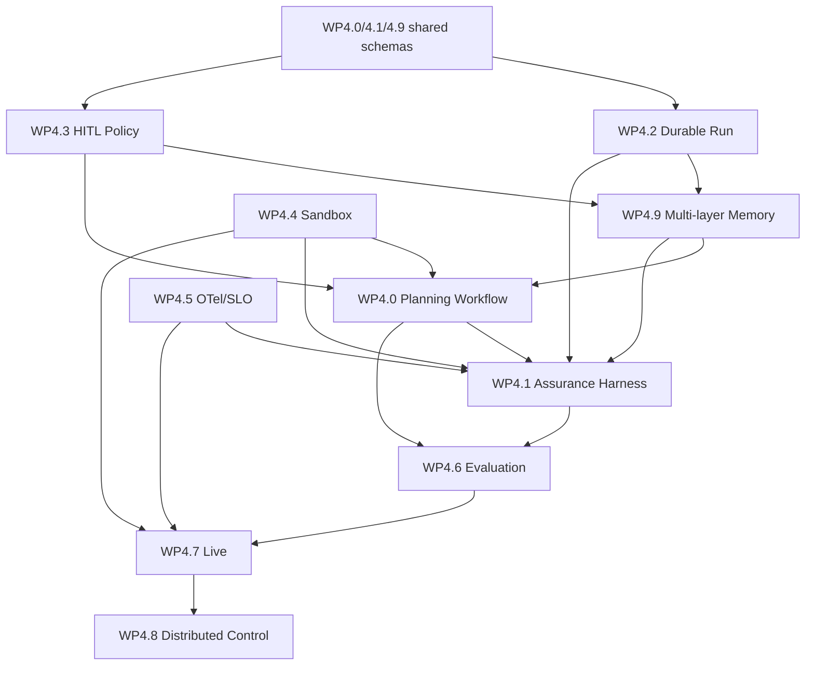

# Phase 4 总体实施计划（v1 历史基线）

**状态**：历史计划；后续实施已由 [Phase 4 v2 计划](./phase-4-plan-v2.md)扩展和接续  
**日期**：2026-08-09  
**章程**：[phase-4.md](./phase-4.md)  
**事实状态**：[phase-4-status.md](./phase-4-status.md)  
**分项详案**：[phase-4/README.md](./phase-4/README.md)  
**继任计划**：[phase-4-plan-v2.md](./phase-4-plan-v2.md)

> 本文件保留 Phase 4 原始目标、稳定任务 ID 和 2026-08-09 执行检查点。v2 新增“角色化 LLM Runtime，以及 LLM 驱动的规划、记忆、专业验证和 Judge 校准”，不改写本文件的历史计划语义。

## 1. 总目标

建立以下闭环，并使每个箭头都具有版本化数据契约、持久化边界、审计事件和验收证据：

```text
Task Intake
→ Evidence-backed Understanding
→ Executable Plan DAG
→ Plan/HITL Gate
→ Dynamic Memory View
→ Durable Sandboxed Execution
→ Incremental Verification
→ Controlled Replan
→ Five-layer Final Acceptance
→ Complete / Partial / Rejected / Manual Review
```

## 2. 规划边界

Phase 4 必须实现认知规划、多层记忆与动态 Context View、证据验收、durable run、HITL、统一 sandbox、标准观测、evaluation、live certification；分布式控制面在单机语义稳定后实施。Phase 4 不以增加模型 provider、普通工具数量或 UI 装饰为主要交付。

## 3. 契约优先顺序

先冻结以下共享 schema，再扩展 GraphExecutor：

1. `TaskIntake`、`EvidenceRecord`、`EvidenceBundle`；
2. `TaskUnderstanding`、`PlanNode`、`ExecutionPlan`；
3. `AcceptanceContract`、`Criterion`、`Finding`、`AcceptanceReport`；
4. `RunState`、`RunCheckpoint`、`Interruption`、`ApprovalDecision`；
5. `MemoryScope`、`MemoryRecord`、`MemorySnapshot`、`MemoryViewSpec/Manifest`、`MemoryConflict`；
6. `SandboxSpec/Manifest`、telemetry correlation fields；
7. eval dataset、trajectory 和 metric result。

所有 schema 必须有 `schema_version`、canonical digest、tenant/org/principal/project/task/run/plan/memory identity、redaction rules、unknown-field policy、migration 和 rollback fixture。

## 4. 实施批次

| 批次 | 工作 | 硬交付 | 进入条件 |
|---|---|---|---|
| P4-F0 | 文档治理与事实矩阵 | status/plan/WP/ledger/traceability | Phase 3 基线稳定 |
| P4-F1 | 共享契约 | cognition/evidence/plan/acceptance/run/memory schemas | F0 完成 |
| P4-F2 | Durable/HITL 内核 | RunStore、checkpoint、interrupt/resume、approval | F1 schema 冻结 |
| P4-F2M | 多层记忆与动态 View | Provider/namespace/store/index、View engine、snapshot、consolidation/governance | F2 最小 checkpoint/approval 可用；Memory schema 冻结 |
| P4-F3 | 认知规划垂直链路 | internal/external reconnaissance、synthesis、DAG、critic | F2M Investigation/Planning View 可用 |
| P4-F4 | 五层验收垂直链路 | verifier registry、evidence store、arbiter、replan feedback | F3 产生 AcceptanceContract；F2M Verification View 可用 |
| P4-F5 | Sandbox/OTel | provider、workspace manifest、OTLP、metrics/SLO | F2 run identity 与 F2M memory/view identity 稳定 |
| P4-F6 | Evaluation | dataset、trajectory、memory/planning/assurance metrics、comparison gates | F2M/F3/F4 可记录轨迹 |
| P4-F7 | Live certification | nightly matrix、environment manifest、no-skip gate | F5/F6 稳定 |
| P4-F8 | Distributed control | durable queue、lease、heartbeat、HA | 单机 live 达标 |

## 5. 工作包依赖



## 6. 里程碑和退出门槛

### M4.0 契约与文档冻结

- 所有 WP 有稳定任务 ID、文件级落点、五层测试和 DoD；
- traceability matrix 能从 Phase 4 requirement 映射到 plan task；
- schema 非法状态 fixture 先于实现落盘。

### M4.1 Durable/HITL 最小内核

- 单进程 SQLite RunStore；
- node boundary checkpoint、interrupt/resume、timer/retry；
- approval approve/reject/edit；
- kill/restart 不重复已提交 effect。

### M4.2 多层记忆与认知规划垂直闭环

- system/org/principal/project/task/turn provider、动态 View、snapshot、冲突解析和受控晋升形成垂直闭环；
- 一个真实中等复杂任务通过 Planning View 完成内部调查、必要外部检索、理解、模式判断、DAG、critic、gate；
- 所有节点有上下游合同与 AcceptanceContract；
- 新证据生成新 plan revision 和 view revision；CLI/Web 展示 scope/source/budget/conflict 并保留真实截图。

### M4.3 五层验收垂直闭环

- 同一任务执行功能/模块/集成/综合/指标验证；
- 故意注入“测试通过但产物不完整”并被拒绝；
- remediation 能触发有界重规划和影响范围重验。

### M4.4 Sandbox 与标准观测

- 不受信执行统一走 provider；
- task/plan/node/evidence/artifact/approval/memory snapshot/view 使用同一 trace；
- 形成资源、安全、可靠性和成本 SLO。

### M4.5 Evaluation 与 Live

- 固定任务集比较 planner/memory policy/view/executor/verifier 版本；
- nightly 真实 IdP/MCP/LLM/A2A/sandbox/renderer；
- job 必须证明 executed，不允许 skip-as-pass。

### M4.6 分布式化

- durable queue 和 worker lease；
- 任一 worker/AgentServer 退出不丢 run；
- tenant quota、远程 evidence/artifact/memory、rolling upgrade。

## 7. 每项任务的标准交付包

每个 `4.x.y` 任务必须同时产出：

1. 计划节点和当前 plan revision；
2. 源码/API/schema 或明确的调查结论；
3. unit/module test；
4. integration/system/metric 中适用的验证；
5. migration/rollback；
6. audit/trace evidence；
7. 文档和示例；
8. ledger 记录与 traceability 更新；
9. AcceptanceReport 或明确的 partial/blocked 原因。

涉及上下文的任务还必须交付 Memory scope、source/authority、ViewSpec/Manifest、snapshot/pinning、权限/脱敏和晋升策略，禁止只提交最终 Prompt 文本。

## 8. 测试标签规划

| 标签 | 内容 | 默认性 |
|---|---|---|
| `phase4-contract` | schema/canonical digest/migration | 默认离线 |
| `phase4-durable` | checkpoint/replay/kill recovery | 默认离线，故障注入串行 |
| `phase4-planning` | cognition/plan/critic/replan | fake model 默认；live 可选 |
| `phase4-assurance` | evidence/verifier/arbiter/five-layer | 默认确定性适配器 |
| `phase4-policy` | approval/RBAC/expiry/delegation | 默认离线 |
| `phase4-memory` | namespace/ACL/provider/view/snapshot/conflict/consolidation/forget | 默认离线；跨租户和恢复故障注入串行 |
| `phase4-sandbox` | process provider/escape/resource | Linux 门禁 |
| `phase4-observability` | span/metric/OTLP contract | 默认 loopback collector |
| `phase4-eval` | dataset/metric/comparison | 小集默认，大集 nightly |
| `phase4-live` | 真实外部依赖 | scheduled/手动，不得 skip |
| `phase4-distributed` | multi-worker/lease/HA | 后期 integration |

## 9. 风险控制

- 规划器不得把模型常识伪装为仓库事实；
- Assurance 不得复用执行者自述作为唯一证据；
- LLM judge 不得单独证明数值、安全或外部副作用正确；
- Run replay 不承诺外部 exactly-once，继续依赖 idempotency/lookup/manual review；
- Prompt 不是真实记忆库；compaction/index/view 均为可追溯派生物，不得破坏原始证据和 authoritative record；
- scope/ACL/authority/freshness 必须先于语义相似度；外部/RAG 内容默认没有指令权；
- 工具观察、模型摘要和任务成功不得自动晋升为项目、组织或系统权威记忆；
- 任何降低 mandatory criterion 的变更必须 HITL 并进入 decision log；
- 外部检索、sandbox、telemetry 和 eval 内容必须执行 redaction/tenant isolation；
- 不在 Run/Plan/Acceptance schema 稳定前引入分布式一致性复杂度。

## 10. 发布策略

每个批次独立 PR/commit，保持 schema、store、workflow、UI 和 live gate 可回滚。新路径先 feature flag/dual-write，完成 migration fixture 和 shadow validation 后再设为默认；旧 schema 至少保留显式读取迁移或明确拒绝。

## 11. 规划—执行—检验规则

- 开始实现前：traceability 状态为 `planned`，ledger 记录 plan revision；
- 发现新事实：追加 EvidenceRecord，必要时生成新 plan revision；
- Memory View 转换：记录 snapshot/spec/view digest、selected/excluded 原因和 policy revision；
- 记忆写入或晋升：先生成 candidate；跨层或权威写入必须关联验证证据与 approval/decision；
- 偏离计划：先写 decision/ledger，再执行扩大后的工作；
- 完成实现：状态只能变为 `implemented`，不能直接 `accepted`；
- 五层验收完成：arbiter 才能将任务标为 `accepted`；
- 状态文档只接受 AcceptanceReport 支持的 `[x]`。

## 12. 2026-08-09 执行检查点与后续批次

P4-F0R–P4-F8 已完成首轮“契约/参考实现”纵向批次；在后续 P4-F2D 增量后，当前累计通过 `phase4-offline` **13/13** 项测试。该检查点证明共享 schema、SQLite Run/Memory、动态 Memory View、计划绑定、五层裁决、sandbox/telemetry/eval/live-certification/queue 核心语义可以在同一构建中协同工作；它不等于各工作包 DoD 已完成，也不提供真实 Live 或 HA 证据。

以下是 v1 检查点形成时的生产化顺序。自 `phase4-v2-plan-r1` 起，它们按[继任计划](./phase-4-plan-v2.md#6-依赖与连续实施顺序)被保留、吸收或扩展；后续执行以 v2 顺序和门禁为准：

1. **P4-F2D**（进行中）：SQLite Evidence/Plan/Approval 已实现并验证；继续补 AcceptanceReport store、Run/Plan/Memory/Effect 原子绑定与恢复；
2. **P4-F3I**：ToolBus、仓库调查、外部知识 investigator 适配器，GraphExecutor cognition/replan 接入；
3. **P4-F4A**：artifact/code/runtime/security/domain/metric verifier，impact graph 与 remediation→replan；
4. **P4-F5P**：统一 Process provider、credential broker、网络策略，OTLP exporter、trace propagation、Audit bridge 与 SLO；
5. **P4-F6E**：固定领域数据集、完整规划/记忆/验收指标、统计门禁、flaky/resume/nightly report；
6. **P4-F7L**：真实 LLM/IdP/MCP/A2A/sandbox/renderer scheduled matrix，签名 EnvironmentManifest 与 no-skip certification；
7. **P4-F8D**：远程 durable queue、worker registry/scheduler、PostgreSQL/object store、HA/chaos；
8. **P4-FUI**：CLI/Web/TUI 计划、记忆、审批、验收视图与真实运行截图。UI 批次必须在实际运行环境完成截图验收。

当前实现、证据和残余风险以[状态矩阵](./phase-4-status.md)、[追溯矩阵](./phase-4/traceability-matrix.md)及[本批验收报告](./phase-4/acceptance-P4-F0R-F8-vertical-20260809.md)为准。
