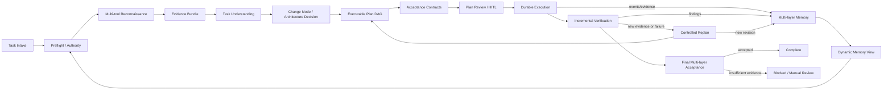
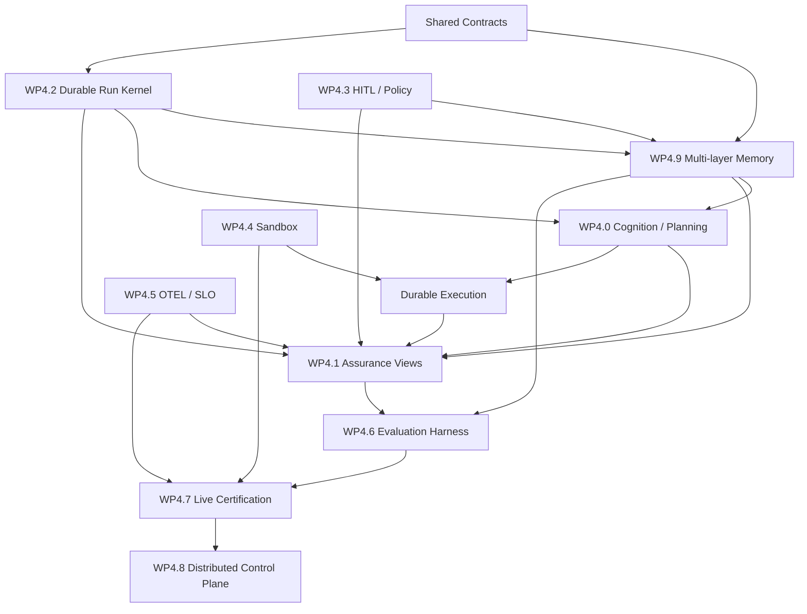

# Phase 4：专业 Agent Harness 的认知规划、证据验收与生产运行内核

**状态**：规划中  
**日期**：2026-08-09  
**实施基线**：[Phase 3 完成状态](./phase-3-status.md)  
**目标**：将 Phase 3 的单机可靠 Agent Runtime 升级为能够理解复杂任务、形成专业可执行计划、持久运行并以多层证据严格验收的生产级 Agent Harness。

本文前半部分保留 Phase 3 成熟度评价，作为 Phase 4 立项依据；后半部分给出正式工作包、依赖关系、数据契约、测试矩阵和完成定义。Phase 4 不以继续横向增加工具数量为主，而以任务认知、计划质量、执行可靠性和结果可信度为核心。

## 规划档案导航

本文件是 Phase 4 的立项章程与目标架构说明。实施期间以下文档共同构成可审计的“规划—执行—检验”档案，其中当前满足度以状态基线为单一事实源，工作项状态以执行台账为单一事实源：

- [当前状态与满足度基线](./phase-4-status.md)：逐项记录 WP4.0–WP4.9 的已有证据、缺口和满足度。
- [总体实施计划](./phase-4-plan.md)：定义实施批次、依赖关系、里程碑、门禁和发布策略。
- [详细规划索引](./phase-4/README.md)：进入 WP4.0–WP4.9 的 136 个稳定编号任务。
- [需求追踪矩阵](./phase-4/traceability-matrix.md)：建立需求、任务、代码、测试、证据和验收结论的闭环映射。
- [执行台账](./phase-4/execution-ledger.md)：记录每个实施批次的基线、变更、验证证据和遗留风险。
- [架构决策日志](./phase-4/decision-log.md)：记录重要方案选择、约束条件及替代方案。

详细工作包文档是实施与验收的规范性输入；本章程中的概览若与详细任务发生差异，应先在决策日志中说明原因，再同步修订状态基线、总体计划和追踪矩阵，禁止仅修改完成百分比。

## 总体结论

  Phase 3 对既定计划而言已经完成，且不是“只有接口和文档”的完成，而是具备代码、离线测试、故障恢复测试、CI 门禁和部分真实 UI 运行
  证据的集成完成。

  但如果把参照系提升到专业级 Agent Harness——即类似 LangGraph/Temporal 的持久执行、OpenAI Agents SDK 的 HITL/Tracing、Claude
  Code/OpenHands 的权限与沙箱，再加企业级多租户控制面——当前系统大约处于：

   评价口径                            成熟度判断
  ━━━━━━━━━━━━━━━━━━━━━━━━━━━━━━━━━━  ━━━━━━━━━━━━
   Phase 3 原始 DoD 完成度                 约 95%
  ──────────────────────────────────  ────────────
   单机生产可用度                          约 75%
  ──────────────────────────────────  ────────────
   专业桌面/科研 Agent Harness 对标     约 65–70%
  ──────────────────────────────────  ────────────
   企业级分布式 Harness 对标            约 50–55%

  这里剩余的 5% 不是明确功能缺失，而是 Live、真实 IdP、真实外部 MCP、外部 raster worker 和高负载环境没有形成持续认证门禁。状态文
  档也明确没有把未运行的 Live 测试误报为通过：agent_framework/docs/guides/phase-3-status.md:46。

  ———

  ## Phase 3 各工作包评价

   WP                          评价                      成熟度    关键判断
  ━━━━━━━━━━━━━━━━━━━━━━━━━━  ━━━━━━━━━━━━━━━━━━━━━━━━  ━━━━━━━━  ━━━━━━━━━━━━━━━━━━━━━━━━━━━━━━━━━━━━━━━━━━━━━━━━━━━━━━━━━━━━━━
   WP3.0 事实基线              完成度很高                   95%    文档、CTest 标签、CI、五个 demo 已形成单一事实源
  ──────────────────────────  ────────────────────────  ────────  ──────────────────────────────────────────────────────────────
   WP3.1 VectorStore/RAG       已形成可靠最小闭环           85%    Memory/Faiss 契约、generation 持久化、citation 和 E2E 已有；
                                                                   尚非大规模检索平台
  ──────────────────────────  ────────────────────────  ────────  ──────────────────────────────────────────────────────────────
   WP3.2 Memory Assembly       架构质量高                   90%    六类 slot、双预算、唯一装配边界和确定性裁剪设计正确
  ──────────────────────────  ────────────────────────  ────────  ──────────────────────────────────────────────────────────────
   WP3.3 Compaction            达到框架级能力               85%    策略注册表、隔离子 LLM、schema/fallback/cancel 完整；缺真实
                                                                   模型质量基准
  ──────────────────────────  ────────────────────────  ────────  ──────────────────────────────────────────────────────────────
   WP3.4 Memory persistence    单机可靠性较强               85%    generation、fsync、digest、隔离、恢复、GC 已补齐；仍是本地文
                                                                   件/SQLite 范畴
  ──────────────────────────  ────────────────────────  ────────  ──────────────────────────────────────────────────────────────
   WP3.5 MCP lifecycle         Phase 3 最强部分之一         90%    Ed25519、fail-closed、revision pin、lease、rehydrate、
                                                                   transport 校验明显高于普通 SDK
  ──────────────────────────  ────────────────────────  ────────  ──────────────────────────────────────────────────────────────
   WP3.6 OAuth                 功能闭环，集成证据不足       75%    RFC 8628、refresh、SSE、AuthGate 已实现；真实 IdP/JWKS/KMS
                                                                   场景尚未持续验证
  ──────────────────────────  ────────────────────────  ────────  ──────────────────────────────────────────────────────────────
   WP3.7 Effect journal        设计方向专业                 82%    已解决“工具成功但 session 未提交”的关键崩溃窗口；最终保证仍
                                                                   依赖外部系统幂等协议
  ──────────────────────────  ────────────────────────  ────────  ──────────────────────────────────────────────────────────────
   WP3.8 Observability         审计可用，平台化不足         65%    schema、redaction、trace replay 已有；尚未进入标准 span/
                                                                   metric/OTLP/SLO 体系
  ──────────────────────────  ────────────────────────  ────────  ──────────────────────────────────────────────────────────────
   WP3.9 Rich renderer         安全基础较好                 72%    worker 隔离、资源限制、artifact、fallback 已有；真实验证主要
                                                                   集中在 Web 成功路径

  现有事实矩阵和 14 个 Phase 3 离线测试见：agent_framework/docs/guides/phase-3-status.md:22。

  ### 特别值得肯定的地方

  1. MCP 生命周期不是简单的 reload

     Manifest 将 transport、权限、tenant visibility、dependency lock、签名和 revision 纳入同一模型，并默认要求签名：
     agent_framework/include/agent/mcp_client/mcp_lifecycle.hpp:15。这一点实际上比许多只提供“连接 MCP Server”的 Agent SDK 更严
     格。

  2. 工具副作用边界处理得很专业

     Started → Completed → Committed、幂等键、lookup/manual-review/fail-closed 已经接近工作流系统对 Activity 副作用的处理思路：
     agent_framework/include/agent/toolbus/tool_effect_journal.hpp:16。

  3. Memory 不是简单聊天历史

     Assembly、compaction、持久化、RAG、citation 和 tenant/session generation 已经形成相对完整的数据路径。这比大量只把消息数组存
     进 SQLite 的 Agent Framework 更扎实。

  4. C++/Taskflow 路线有独特价值

     当前系统适合低延迟、本地部署、科研计算程序嵌入、原生工具链和资源受控环境。这不是 Python Agent SDK 能完全替代的优势。

  ———

  ## 与专业 Harness 的核心差距

  ### 1. 当前是“会话可恢复”，还不是“整个执行可恢复”

  现有 SessionSnapshot 保存会话状态、tool commits 和 child tasks，并支持 checkpoint 查询：agent_framework/include/agent/session/
  session_store.hpp:24。但 GraphExecutor 没有完整持久化：

  - 当前执行节点和调度游标；
  - 节点输入/输出版本；
  - pending node；
  - retry timer；
  - interrupt/approval；
  - graph definition revision；
  - 确定性 replay 记录。

  当前 ExecutionEventType 有 CheckpointCommitted，但缺少 Interrupted、ApprovalRequired、Suspended、Resumed 等运行状态：
  agent_framework/include/agent/graph_executor/graph_executor.hpp:179。

  LangGraph 会在图的 super-step 边界保存 checkpoint，并支持 state history、replay、fork/time travel；其 interrupt
  可以长期暂停并从持久状态恢复。LangGraph Persistence (https://docs.langchain.com/oss/python/langgraph/persistence)、LangGraph
  Interrupts (https://docs.langchain.com/oss/python/langgraph/interrupts)

  Temporal 更进一步，把状态、重试、task queue、signal 和 timer 都放入 durable execution 语义中。Temporal 官方文档
  (https://docs.temporal.io/)

  因此，当前系统更准确的表述是：

  > durable session + durable memory + durable tool effects，而不是 durable graph execution。

  这是与专业 Harness 最大的架构差距。

  ### 2. 缺少一等公民的 HITL 暂停/审批协议

  当前 TaskControl 只有 cooperative cancellation 和 deadline：agent_framework/include/agent/agent/task_state_machine.hpp:23。

  WP3.7 的 ManualReview 是安全隔离结果，但还不是完整 HITL：

  - 不能持久暂停当前 run；
  - 没有 approval request schema；
  - 没有 reviewer identity、decision、reason；
  - 没有 approve/reject/edit arguments；
  - UI 没有 pending approval queue；
  - 审批后不能从原执行点恢复；
  - 缺少审批过期、撤回、双人复核等策略。

  OpenAI Agents SDK 已将 tool/MCP/shell/apply-patch approval 作为统一 interruption，并允许序列化 RunState 后长期恢复。OpenAI
  Agents SDK HITL (https://openai.github.io/openai-agents-python/human_in_the_loop/)

  这是下一阶段应优先补齐的能力。

  ### 3. 缺少通用执行沙箱

  当前已有：

  - filesystem jail；
  - MCP stdio transport 校验；
  - Skill process 限制；
  - renderer 子进程 CPU/内存/文件/输出/超时限制。

  但它们是组件级防护，不是统一的 Agent Runtime Sandbox。专业 coding/research harness 通常还包括：

  - 每 session/container/microVM 隔离；
  - mount namespace；
  - network namespace与域名出口策略；
  - seccomp/AppArmor；
  - cgroup CPU、内存、PID、I/O 配额；
  - workspace snapshot/overlay；
  - credential broker；
  - sandbox 生命周期、回收和取证。

  OpenHands 的推荐运行方式是每个 Agent 使用 Docker 或远程 sandbox，并将 action executor 放在隔离环境内。OpenHands Runtime
  Architecture (https://docs.openhands.dev/openhands/usage/architecture/runtime)

  当前 Taskflow Agent Framework 对“受信本地工具”较安全，但还不能安全承诺运行任意 Agent 生成代码。

  ### 4. 审计系统尚未升级为标准可观测性

  当前 AuditEvent 已有 trace/session/task、sequence、latency、digest、redaction，基础很好：agent_framework/include/agent/
  observability/audit.hpp:17。

  但 sink 仍主要是：

  - JSONL；
  - stderr；
  - composite；
  - test collector。

  缺少：

  - trace/span 父子结构；
  - OTLP exporter；
  - metrics 与 histogram；
  - token、成本、cache hit、queue delay；
  - end-to-end critical path；
  - sampling；
  - baggage/context propagation；
  - Prometheus/Grafana dashboards；
  - SLO、error budget 和告警规则。

  OpenAI Agents SDK 默认追踪 agent、turn、generation、tool、guardrail 和 handoff span。OpenAI Agents SDK Tracing
  (https://openai.github.io/openai-agents-python/tracing/) OpenTelemetry 也已经定义 GenAI conversation、tool、retrieval、usage
  等语义属性。OpenTelemetry GenAI conventions (https://opentelemetry.io/docs/specs/semconv/registry/attributes/gen-ai/)

  WP3.8 因而是“审计闭环完成”，而不是“生产可观测平台完成”。

  ### 5. 缺少真正的评测 Harness

  目前测试主要验证确定性功能、安全边界和恢复契约，这是必要的，但专业 Agent Harness 还需要：

  - trajectory fixture；
  - tool-selection precision/recall；
  - task success rate；
  - citation correctness/faithfulness；
  - RAG recall@k、MRR、nDCG；
  - compaction information retention；
  - model/provider regression matrix；
  - latency/token/cost budget；
  - prompt/agent version对比；
  - flaky run detection；
  - benchmark dataset 管理；
  - judge calibration 和人工抽检。

  现有 Verifier 不能代替 eval harness：Verifier 是运行时质量节点，eval harness 是离线/持续回归系统。

  这会是项目从“功能框架”迈向“专业 Harness”的第二大缺口。

  ### 6. 尚无分布式控制面

  当前 persistence 和 registry 更适合单进程或共享本地文件部署。企业级平台通常需要：

  - durable worker queue；
  - worker heartbeat；
  - task ownership lease；
  - retry/backoff/timer service；
  - leader election；
  - horizontally scalable AgentServer；
  - PostgreSQL/object store；
  - distributed capability registry；
  - tenant quota和公平调度；
  - admission control；
  - drain/rolling upgrade；
  - run migration；
  - API version compatibility。

  Temporal 官方基线包含 task queue、signals、timers 和故障后自动恢复，而当前 GraphExecutor 仍由调用方持有 tf::Executor
  并直接同步或异步执行。Temporal Durable Execution (https://temporal.io/)

  ### 7. 身份和密钥仍是本地产品级，而非企业级

  WP3.6 已经比 API key 模式前进很多，但还缺：

  - OIDC discovery/JWKS 自动轮换；
  - PKCE/authorization code 服务端场景；
  - mTLS/service identity；
  - KMS/HSM/OS keychain；
  - workload identity；
  - RBAC/ABAC policy engine；
  - tenant administrator/operator/reviewer 分权；
  - credential usage audit；
  - secret lease 和短期凭据；
  - real IdP CI certification。

  因此可以称为“安全认证框架已形成”，还不能称为“企业 IAM 集成完成”。

  ### 8. UI 验收范围仍偏窄

  真实 Web 截图证明 Markdown、KaTeX、Mermaid、tool state 和 artifact 成功链路可用，这是有效证据：agent_framework/docs/assets/ui/
  phase3-wp39-web-artifact-success.png。

  但专业 UI 验收还应覆盖：

  - Web/TUI/ImGui 三端一致性；
  - renderer timeout/fallback 的真实画面；
  - pending approval；
  - task resume/recovery；
  - 大量 streaming event；
  - artifact 下载失败；
  - accessibility、键盘操作、窄屏；
  - 浏览器自动化视觉回归。

  ———

  ## 当前最准确的项目定位

  我认为现在最适合对外描述为：

  > 一个面向本地部署、科研计算和原生 C++ 应用嵌入的安全 Agent Runtime Framework，已经具备 RAG、统一记忆装配、持久记忆、动态 MCP
  > 供应链、OAuth、工具副作用恢复、审计和多端 UI。

  还不宜描述为：

  > 一个可替代 Temporal/LangGraph/OpenHands 企业部署形态的完整分布式 Agent Harness。

  尤其不能把 tool effect WAL 等同于全图 exactly-once，也不能把 session checkpoint 等同于 durable execution。

  ———

## Phase 4 核心判断

Phase 3 是一次成功的“单机可靠性和安全边界收敛”。Phase 4 的主要矛盾不再是能否调用模型和工具，而是系统能否：

1. 在执行前正确理解任务、专业语境、现状和真实约束；
2. 将复杂目标分解为上下游边界清楚、可调度、可验收的工作单元；
3. 在执行过程中持久保存状态，并根据新证据进行受控重规划；
4. 使用独立、分层、可追溯的证据判断任务是否真正完成；
5. 将系统、组织/个人、项目、任务和本轮信息组织为受治理的多层记忆，并按场景生成可重现的动态上下文视图；
6. 对无法证明、存在冲突或需要专业裁决的结果拒绝虚假完成。

因此，**任务认知与规划内核**、**证据驱动的验收内核**、**多层记忆与动态 Context View** 与 Durable Run、HITL 一起列为 Phase 4 的 P0，而不是归入普通 Prompt 优化、RAG 扩展或测试增强。

## 目标闭环架构



整个闭环必须共享同一组版本化对象：MemorySnapshot/ViewManifest、任务理解、证据、计划、验收契约、执行轨迹、发现项和最终验收报告。任何节点不得仅凭自然语言声称“已完成”，也不得把当前 Prompt 当作完整事实源。

## 全局设计原则

- **工具和证据优先**：先调查事实，再形成结论；模型记忆和常识不能替代当前项目证据。
- **显式不确定性**：假设、未知项、冲突证据和残余风险必须进入结构化产物。
- **规划即契约**：每个任务节点必须声明输入、输出、依赖、权限、副作用、回滚和验收契约。
- **执行与验收分离**：执行者不能作为唯一验收者；关键结论需要独立 verifier 或确定性 oracle。
- **专业领域可扩展**：软件、数据、科研计算、文档、UI、部署等使用不同的专业验证适配器。
- **有限认知预算**：调查、检索、规划、批评和重规划都有 token、时间、工具调用与成本预算。
- **Memory 与 Prompt 分离**：权威事实、历史和状态保存在版本化 Store 中；Prompt 是按 scope、workflow phase、权限和预算生成的可重现 View。
- **作用域优先**：tenant/org/principal/project/task/run/turn ACL 在语义检索前生效；相似度不能覆盖权限、权威、时效和冲突规则。
- **受控记忆晋升**：工具观察、RAG 命中、模型摘要和单次成功只能成为 candidate；写入系统、组织或项目权威层必须经过验证和 Policy/HITL。
- **不暴露原始思维链**：系统持久化证据、决策依据、备选方案和专业推理摘要，不要求或记录模型私有 chain-of-thought。
- **Fail closed**：关键验收证据缺失、互相矛盾或过期时，状态只能是 partial、blocked 或 manual review，不能自动 complete。

## WP4.0 — Task Cognition & Professional Planning Workflow（P0）

### 目标

在 Agent 获得任务输入后，先运行专门的认知规划 Workflow，通过内部项目调查、外部知识检索、领域分析、架构判断和计划批评，把模糊需求转化为专业、可执行、可验收的任务 DAG。该 Workflow 既服务代码开发，也应支持科研计算、数据处理、技术文档、UI、部署和跨系统集成任务。

### 4.0-A 核心数据模型

```cpp
struct TaskIntake {
  std::string task_id;
  std::string user_goal;
  std::vector<std::string> requested_deliverables;
  std::vector<std::string> explicit_constraints;
  std::vector<std::string> granted_authorities;
  std::vector<std::string> success_signals;
};

struct EvidenceRecord {
  std::string evidence_id;
  std::string origin_kind;       // repository/runtime/external/expert/user
  std::string locator;
  std::string content_digest;
  std::string collected_at;
  std::string trust_class;
  std::vector<std::string> supported_claims;
  std::optional<std::string> freshness_deadline;
};

struct TaskUnderstanding {
  std::string task_id;
  std::string domain;
  std::string current_state;
  std::string target_state;
  std::vector<std::string> gaps;
  std::vector<std::string> assumptions;
  std::vector<std::string> unknowns;
  std::vector<std::string> risks;
  std::vector<std::string> evidence_ids;
};

struct PlanNode {
  std::string node_id;
  std::string objective;
  std::vector<std::string> in_scope;
  std::vector<std::string> out_of_scope;
  std::vector<std::string> input_contracts;
  std::vector<std::string> output_contracts;
  std::vector<std::string> dependencies;
  std::vector<std::string> required_capabilities;
  std::vector<std::string> side_effects;
  std::string acceptance_contract_id;
  std::string rollback_strategy;
};
```

`ExecutionPlan` 还必须包含 `plan_revision`、`task_understanding_digest`、父子任务关系、关键路径、资源预算、风险等级、审批要求以及生成该计划所依赖的证据集合。

### 4.0-B 任务认知 Workflow

建议节点如下：

1. **Intake normalizer**：提取目标、产物、限制、授权和禁止操作，识别事实缺口。
2. **Preflight classifier**：判断任务领域、风险、复杂度、是否需要外部知识和是否需要用户澄清。
3. **Internal reconnaissance**：使用代码搜索、AST、构建系统、测试、Git、配置、日志、运行时探测等工具建立当前事实。
4. **External reconnaissance**：仅在必要时检索官方文档、标准、论文、数据字典和权威领域资料，记录来源与时间。
5. **Evidence synthesis**：合并内外部证据，标注支持关系、冲突、置信度和新鲜度。
6. **Change-mode decision**：根据目标差距、影响范围和兼容约束选择修复、增量增强、局部重构、架构升级或系统性变革模式。
7. **Architecture and boundary analysis**：识别模块边界、上下游消费者、数据/控制流、权限边界和迁移影响。
8. **Task decomposition**：形成有向无环任务图，定义每个节点的输入、输出、依赖、副作用和完成条件。
9. **Plan critic**：独立检查遗漏依赖、循环依赖、不可验证任务、越权操作、隐含假设和不可回滚步骤。
10. **Plan gate**：低风险任务可自动进入执行；高风险、事实不清或范围发生实质变化时进入 HITL。

这些角色可以由同一模型的不同受控 profile 承担，也可以映射为多个专门 Agent；框架必须依赖角色契约而非强制依赖固定的多 Agent 拓扑。

### 4.0-C 专业规划要求

每个可执行子任务必须回答：

- 为什么需要执行，依据哪些证据；
- 上游输入由谁提供，格式、版本和有效性要求是什么；
- 具体修改或调查范围是什么，明确排除什么；
- 下游由谁消费，兼容性和迁移边界是什么；
- 需要哪些工具、权限、凭据、预算和运行环境；
- 会产生哪些可见或不可逆副作用；
- 如何验证、由谁验证、失败时如何回退；
- 哪些新证据会导致本节点或整个计划重新规划。

计划不得包含“完善相关功能”“全面检查”等不可操作描述。每个节点都必须能映射为一次有界执行、一次明确调查或一次审批。

### 4.0-D 受控重规划

触发条件至少包括：

- 现状证据与计划假设不一致；
- 编译、测试、运行或专业验证暴露新的根因；
- 外部依赖、权限或数据不可用；
- 任务边界需要实质扩大；
- 验收器发现计划没有覆盖必要产物；
- 成本、deadline 或资源预算将被突破。

重规划必须产生新 `plan_revision`，保留旧计划、变更原因、证据差异和已执行副作用；不能静默覆盖原计划。

### 4.0-E 测试与验收

- 模糊任务能识别事实缺口并在必要时请求澄清；
- 同一事实快照和相同 profile 生成结构等价的任务图；
- 内部调查不会把猜测标记为仓库事实；
- 外部资料包含来源、获取时间、支持 claim 和 freshness；
- 任务图无循环，所有节点均有 acceptance contract；
- 修改公共 API 时能识别至少一个实际下游消费者或明确证明没有消费者；
- 高风险或越权步骤不会自动执行；
- 新证据触发 revision，而不是在原计划中静默漂移；
- 规划失败、超时和模型输出 schema 错误有确定性 fallback；
- 敏感内容不会进入规划摘要、证据索引或日志。

**WP4.0 DoD**：至少一个真实复杂任务完成“仓库调查 → 外部知识增强 → 变更模式判断 → 任务 DAG → plan critic → 人工/自动 gate”，计划中的每个节点均可调度且具有机器可读验收契约。

## WP4.1 — Evidence-driven Assurance & Acceptance Harness（P0）

### 目标

建立独立于普通覆盖率和功能冒烟测试的专业验收机制。系统必须综合代码、运行产物、外部权威知识、上下游契约、专业推理摘要和量化指标，判断任务是否达到目标领域要求，并对不能证明的部分明确拒绝验收。

该工作包解决的是**单次任务是否真正完成**；WP4.6 Evaluation Harness 解决的是**模型、Prompt、Agent 或版本在任务集上的总体表现是否退化**。二者共享证据和指标模型，但不能互相替代。

### 4.1-A 验收数据契约

```cpp
enum class VerificationLayer {
  Functional,
  Module,
  Integration,
  System,
  Metric
};

struct AcceptanceCriterion {
  std::string criterion_id;
  VerificationLayer layer;
  std::string claim;
  std::string oracle_kind;
  std::vector<std::string> required_evidence;
  std::string threshold;
  bool mandatory{true};
};

struct VerificationFinding {
  std::string finding_id;
  std::string criterion_id;
  std::string severity;
  std::string outcome;            // pass/fail/partial/inconclusive
  double confidence{0.0};
  std::vector<std::string> evidence_ids;
  std::string remediation;
};

struct AcceptanceReport {
  std::string task_id;
  std::string plan_revision;
  std::string artifact_manifest_digest;
  std::vector<VerificationFinding> findings;
  std::vector<std::string> residual_risks;
  std::string decision;           // accepted/rejected/partial/manual_review
};
```

`AcceptanceContract` 在规划阶段生成并冻结到具体 plan revision；执行阶段可以补充验证方法，但降低阈值、删除 mandatory criterion 或改变 oracle 必须重新审批。

### 4.1-B 五层验证模型

#### 1. 功能层（Functional）

验证用户可观察目标和行为契约，而非只证明代码路径被运行：

- 正常、边界、负面和权限不足场景；
- 用户要求的产物是否存在、可打开、可消费；
- 错误信息、fallback、取消和恢复行为；
- UI 任务必须在实际环境验证交互和真实截图；
- 文档/科研任务验证内容目标，而非只验证文件生成。

#### 2. 模块层（Module）

验证单个模块内部的技术完备性：

- API/schema/state machine 不变量；
- 算法正确性、数值稳定性和边界条件；
- 安全策略、输入校验、资源上限和错误传播；
- 并发、重复调用、迁移、回滚和故障注入；
- 单元测试之外的静态分析、sanitizer、fuzz/property testing 证据。

#### 3. 集成层（Integration）

验证模块间和外部系统间的真实契约：

- 上下游数据格式、版本、身份、权限和 deadline 传播；
- LLM、MCP、A2A、存储、OAuth、renderer 与 UI 的组合路径；
- session、memory、effect journal、audit 的一致提交边界；
- 网络断开、限流、凭据过期、服务重启和部分失败；
- mock/fixture 结果与至少一个真实受控系统的一致性。

#### 4. 综合层（System/Comprehensive）

验证完整任务轨迹和产物集合是否形成闭环：

- 需求 → 设计 → 实现 → 迁移 → 测试 → 文档 → 运行证据是否一致；
- 所有计划节点、下游消费者和验收 criterion 是否有对应证据；
- 生成物之间是否存在逻辑矛盾、遗漏和陈旧引用；
- 任务是否解决根因，而非只掩盖症状；
- 领域专家视角下技术路线是否达到当前可接受状态；
- 残余风险、已知限制和未验证声明是否被准确披露。

#### 5. 指标层（Metric）

按任务领域定义可量化门槛，例如：

- 软件：成功率、错误率、p50/p95/p99、吞吐、恢复时间、资源峰值；
- RAG：recall@k、MRR、nDCG、citation precision/faithfulness；
- Agent：任务成功率、工具选择准确率、重规划率、无效调用率、token/成本；
- 科研计算：偏差、RMSE、相关系数、守恒/物理约束、可重复性和不确定度；
- 数据产品：完整率、一致率、时效性、空间/时间覆盖和异常率；
- UI：任务完成时间、交互错误、可访问性、视觉回归和跨端一致性。

指标必须包含数据集、样本范围、基线、阈值、统计方法和误差范围；单个漂亮样例不能替代指标验收。

### 4.1-C 证据与 Oracle 等级

默认优先级如下：

1. 可重复的确定性执行、形式化约束和机器验证结果；
2. 真实系统运行、故障注入和可核验产物；
3. 官方标准、官方文档、权威数据和领域基准；
4. 静态分析、结构检查和契约推导；
5. 经校准的独立模型 verifier；
6. 未校准的 LLM 判断或执行 Agent 自述。

低等级证据不能覆盖高等级反例。LLM-as-judge 只能验证适合语义判断的 criterion，必须记录模型、Prompt、版本和校准集，且不能作为安全性、数值正确性或外部副作用成功的唯一证据。

### 4.1-D 多角色验证机制

- **Artifact inspector**：核对文件、二进制、数据、图像、报告和 manifest。
- **Code/architecture verifier**：检查实现、API、依赖、状态机和上下游逻辑。
- **Runtime verifier**：在真实或隔离环境执行功能、集成和故障场景。
- **Domain verifier**：加载领域标准、公式、数据字典、论文或专业规则。
- **Security verifier**：检查权限、secret、供应链、sandbox 和恶意输入。
- **Metric evaluator**：计算指标、基线差异和统计置信度。
- **Acceptance arbiter**：只消费 findings 和 evidence，不直接修改被验收产物。

验证角色应支持独立 profile、独立工具权限和隔离上下文，避免复用执行 Agent 的未验证结论。必要时采用两个不同 verifier 的交叉检查；出现冲突时进入 evidence resolution 或人工复核。

### 4.1-E 验收流程

1. 从当前 `AcceptanceContract` 展开 verification plan；
2. 检查 artifact manifest，识别缺失和额外副作用；
3. 并行执行五层中互不依赖的验证器；
4. 将结果规范化为 finding，绑定原始证据和产物 digest；
5. 检测证据冲突、过期、污染和 verifier 非独立性；
6. 对失败项生成可执行 remediation，并反馈给重规划节点；
7. 重新验证只运行受影响层及其下游，不丢弃历史失败证据；
8. Acceptance arbiter 根据 mandatory criteria、阈值和残余风险做最终裁决。

最终决策只能是：

- `accepted`：所有 mandatory criteria 有充分证据且阈值满足；
- `partial`：非关键产物完成，但存在已明确披露的非强制缺口；
- `rejected`：存在确定失败或目标未达成；
- `manual_review`：证据冲突、专业知识不足、风险超阈值或需要外部裁决。

### 4.1-F 测试与验收

- 测试全部通过但缺少用户要求产物时必须拒绝验收；
- 代码覆盖功能路径但不满足性能/专业指标时必须拒绝验收；
- 执行 Agent 声称完成但 artifact digest 不匹配时必须拒绝验收；
- mock 通过但真实 integration 失败时不得降级为 accepted；
- 外部知识证据过期或来源不可信时进入 inconclusive/manual review；
- 同一证据不能被重复计数制造虚假置信度；
- verifier 失败或超时不得被解释为被测对象通过；
- 修复后能基于影响图选择性重验，并保留完整 finding 历史；
- UI、科研数值、RAG、OAuth/MCP 和普通 C++ 模块各至少有一个专用适配器 fixture；
- AcceptanceReport 可由 task、plan revision、artifact digest 完整重放。

**WP4.1 DoD**：至少一个跨代码、文档、运行服务和 UI/数据产物的真实任务经过五层验收；系统能够发现“所有既有测试通过但总体任务仍不完整”的故意缺陷，并拒绝生成完成状态。

## WP4.2 — Durable Run Kernel（P0）

持久化 graph cursor、node state、pending work、retry、timer、interrupt、plan revision、acceptance state 和 graph definition revision。支持进程退出后恢复、确定性 replay、checkpoint history、fork/time-travel，并为 WP4.0 的长时间调查和 WP4.1 的人工/专业复核提供运行底座。

关键 DoD：在认知、执行、验证和等待审批任一阶段杀死进程，重启后均从最近 committed boundary 恢复，不重复不可幂等副作用，也不丢失证据或验收状态。

## WP4.3 — HITL + Policy Engine（P0）

把 `ManualReview` 升级为统一 durable interruption，覆盖事实澄清、计划审批、参数编辑、工具/MCP、文件写入、外部消息、阈值变更和风险接受。记录 reviewer identity、decision、reason、scope、expiry 与 policy revision，支持 approve/reject/edit/delegate 和双人复核。

关键 DoD：审批可跨进程、跨时间恢复；未批准的副作用不能执行；任何降低验收标准的操作必须留下独立审计证据。

## WP4.4 — Unified Sandbox Runtime（P0/P1）

定义 `ProcessSandbox`、`ContainerSandbox`、`RemoteSandbox` provider，统一 workspace snapshot、文件挂载、网络出口、credential broker、CPU/内存/PID/I/O、seccomp/AppArmor、超时和取证。规划器根据任务风险声明 sandbox profile，Policy Engine 决定是否允许。

关键 DoD：不受信代码和工具不能直接运行在 AgentServer 宿主环境；sandbox 退出后可复现其镜像、输入、变更集和资源统计。

## WP4.5 — OpenTelemetry、SLO 与证据化运行观测（P1）

把现有 `AuditEvent` 映射到 trace/span/metric/log，补 OTLP exporter、context propagation、sampling、token/cost/cache、queue delay、critical path、SLO 和 error budget。每项验收证据能够回链到对应运行 span 和 artifact digest。

关键 DoD：一次任务从认知、规划、执行、重规划到验收形成单一分布式 trace；能够按 task/plan/artifact/capability revision 查询成本、时延、失败与证据。

## WP4.6 — Evaluation Harness（P1）

建立任务集、trajectory fixture、模型/provider 矩阵、RAG/compaction/citation 指标、规划质量指标、验收器准确性、性能/成本预算、版本对比、flaky detection、judge calibration 和人工抽检。

规划质量至少度量：事实引用率、遗漏依赖率、不可执行节点率、计划变更率、越权步骤率和 acceptance-contract 完整率。验收质量至少度量：缺陷召回率、误拒率、证据充分率、跨 verifier 一致性和虚假完成拦截率。

关键 DoD：Prompt、模型、规划器、执行器或 verifier 任一版本升级都必须经过固定数据集和统计门禁，不能只凭单次 demo 决定发布。

## WP4.7 — Live Certification Matrix（P1）

将真实 IdP、LLM provider、MCP、A2A streaming、renderer、sandbox、断网、限流、凭据轮换、服务重启和长任务恢复组成受控 live/nightly 门禁。所有证据带环境 manifest，明确区分 fixture、loopback、staging 和 production-like。

## WP4.8 — Distributed Control Plane（P2）

在单机闭环稳定后，引入 durable worker queue、heartbeat、task ownership lease、timer service、PostgreSQL/object store、distributed capability registry、tenant quota、公平调度、admission control、HA、rolling upgrade 和 run migration。

关键 DoD：任一 worker 或 AgentServer 实例退出不丢任务；同一 plan node 不发生无保护的并行重复执行；租户、证据、凭据和 artifact 全链路隔离。

## WP4.9 — Multi-layer Memory & Dynamic Context Views（P0）

将现有 session history、MemoryStore、MemoryAssembly、compaction、RAG、Skill 和 Run/Evidence/Plan 引用收敛为五层作用域：Platform/System、Organization/Principal、Project/Workspace、Task/Run、Turn/Working；同时用 semantic、episodic、procedural、evidentiary、operational、conversational 六类语义和 Raw/Candidate/Verified/Authoritative 生命周期管理内容。

系统按 Intake、Investigation、Planning、Execution、Verification、Replan、Resume、Handoff 场景生成版本化 `MemoryView`。View 必须先执行 identity/scope/ACL、authority、freshness、conflict 和 sensitivity 过滤，再进行混合检索、预算分配和 Prompt 投影；每次选择、排除、裁剪和转换都形成可审计 ViewManifest。

关键 DoD：跨 tenant/org/project/task 未授权泄漏率为 0；强制指令保留率 100% 或 fail-closed；固定 snapshot/spec 的 View digest 可重现；重启恢复不得静默换 Memory revision；未经批准的权威层晋升为 0。完整任务见 [WP4.9 详案](./phase-4/wp4.9-multilayer-memory.md)。

## 工作包依赖关系



逻辑优先级和实施顺序需要区分：WP4.0/WP4.1/WP4.9 的契约必须先设计，避免 Durable Kernel 只持久化旧的 ReAct 状态；代码实施则先完成 WP4.2 的最小 checkpoint/interrupt 和 WP4.3 写入审批基础，再实现 Memory Provider/View 垂直链路，最后打通 memory-aware 规划与 memory-isolated 验收。`4.9` 是稳定编号，不代表在 WP4.8 后实施。

## 推荐实施里程碑

### M4.0 — 契约冻结

- 冻结 MemoryScope/Record/Snapshot/ViewManifest、TaskIntake、EvidenceRecord、TaskUnderstanding、ExecutionPlan、AcceptanceContract、Finding 和 Report schema；
- 明确 schema version、digest、迁移、redaction 和 tenant boundary；
- 先写 fixture 和非法状态测试，再实现 Workflow。

### M4.1 — Durable/HITL 最小内核

- checkpoint、interrupt、resume、timer、retry 和 plan revision；
- SQLite 本地实现和 deterministic replay fixture；
- 批准/拒绝/编辑计划或工具调用的端到端测试。

### M4.2 — 多层记忆与认知规划垂直闭环

- 选择一个真实中等复杂代码任务；
- 打通 system/org/principal/project/task/turn provider、动态 View、snapshot 和受控晋升；
- 打通内部调查、外部知识、理解、任务 DAG、plan critic 和 gate；
- 在 CLI/Web 中展示 Memory scope/source/conflict/budget、证据、未知项、依赖、风险和 plan/view revision，并保留真实截图。

### M4.3 — 五层验收垂直闭环

- 对 M4.2 任务生成 AcceptanceContract；
- 注入测试通过但产物不完整、指标退化、文档陈旧和 integration 失败等缺陷；
- 证明验收器能够拒绝虚假完成并触发有界重规划。

### M4.4 — Sandbox 与 OTEL

- 将不受信执行迁入统一 sandbox；
- 打通认知、执行、验证全过程 trace 和资源/成本指标；
- 建立安全、恢复和性能 SLO。

### M4.5 — Evaluation 与 Live certification

- 建立规划器、执行器和验收器的数据集与回归门禁；
- 增加真实 provider/IdP/MCP/sandbox 的 nightly 认证。

### M4.6 — 分布式化

- 只有 M4.0–M4.5 达到稳定 schema 和恢复语义后才进入多 worker/HA；
- 不在不稳定运行契约上提前建设复杂控制面。

## Phase 4 总验收矩阵

| 维度 | 必须提供的证据 |
|---|---|
| 任务认知 | 内外部调查记录、证据 provenance、事实/假设/未知项分离、变更模式依据 |
| 多层记忆 | 五层 namespace、authority/lifecycle、动态 ViewManifest、scope-first 检索、snapshot 恢复、晋升/纠错/遗忘审计 |
| 专业规划 | 无环任务 DAG、上下游契约、关键路径、权限/副作用、回滚、每节点验收契约 |
| 持久执行 | kill/restart、interrupt/resume、timer/retry、replay、revision migration 故障注入 |
| HITL/策略 | reviewer identity、决策审计、越权拒绝、标准降低审批、跨进程恢复 |
| 多层验收 | 功能、模块、集成、综合、指标五层 finding 与原始证据 |
| 专业正确性 | 官方/论文/数据标准、领域适配器、指标与不确定度、专家复核边界 |
| 安全隔离 | sandbox profile、网络/文件/凭据策略、资源上限、恶意输入和逃逸测试 |
| 可观测性 | OTLP trace、metric/log、成本、critical path、SLO、artifact/evidence 关联 |
| 质量评测 | 固定任务集、基线、统计门槛、judge calibration、版本回归报告 |
| Live/分布式 | 真实依赖认证、断网/限流/轮换/重启、worker 故障和租户隔离 |

## Phase 4 全局完成定义

Phase 4 不能因“新增类已实现”“测试数量增加”或“Agent 输出了计划/总结”而宣告完成。全局关闭必须同时满足：

1. 一个事实不完整的复杂任务能够先调查再规划，而不是直接执行；
2. 计划包含专业上下游边界、可落地子任务和机器可读验收契约；
3. 系统、组织/个人、项目、任务和本轮信息能够按权限有机融合，并随工作流阶段生成可重现、可解释、受预算约束的 Memory View；
4. 认知、计划、执行、审批、记忆快照和验收均能跨进程持久恢复；
5. 新证据能触发可审计重规划，不产生静默计划或记忆漂移；
6. 五层验收能识别覆盖率和功能测试之外的总体不完备；
7. 无充分证据时系统拒绝虚假完成，并准确暴露 residual risk；
8. 不受信执行进入统一 sandbox，关键副作用和权威记忆写入受 Policy/HITL 约束；
9. 任务全过程具备标准 trace、量化指标、成本和 SLO；
10. 规划器、记忆系统、执行器和验收器均有独立评测集与发布门禁；
11. 至少一个 production-like Live 场景完成从任务输入、多 session/重启记忆恢复到最终专业验收的全链路认证。
