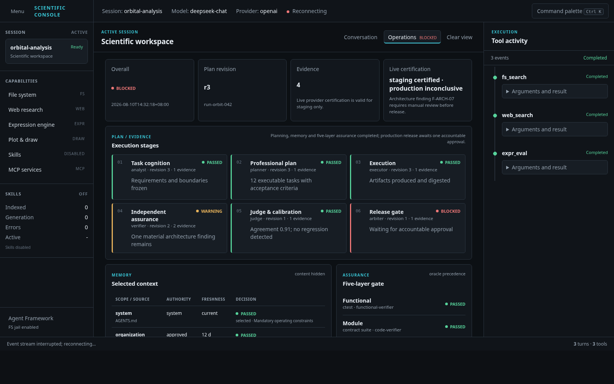
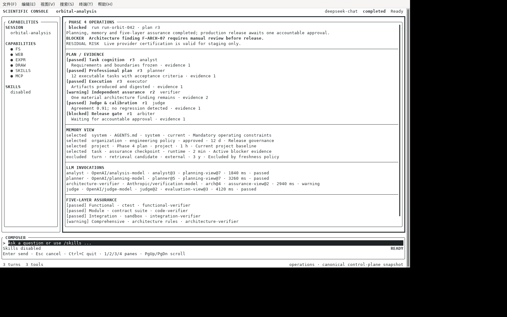
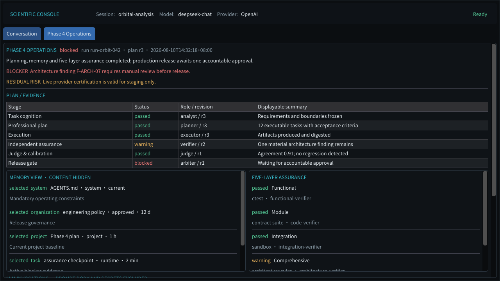

# P4-V2-F8U 解释性 UI 与运维呈现验收报告

**日期**：2026-08-10  
**结论**：统一离线 UI/运维呈现面 accepted；生产 Store 聚合器与真实 Approval executor 尚未接入，`R4V2-08` 保持 partial。

## 1. 已交付

- 新增 display-safe `phase4.operations.v1` 强类型契约：overall、stage/revision、claim/evidence、unknown/risk、Memory View、Role Invocation、五层 Assurance、Live certification 和 HITL；
- `UIManager::publish_phase4_operations()` 在适配器分发前执行 canonical round-trip validation，CLI/Web/TUI/ImGui 接收同一个 JSON 事实投影与 `snapshot_id`；
- 原始 Prompt、credential、tool payload、memory content 和 private chain-of-thought 不在 schema 中；未知私有字段经重新投影被丢弃；
- CLI 可复核文本投影；Web Operations workspace；FTXUI 第 4 运维 pane；ImGui Phase 4 Operations tab；
- Web HITL request/action allowlist 与实际 POST/refresh 流程；没有 accountable executor 的正常 Live run 返回 409，deterministic `--demo-state` 仅用于 UI 验收，不伪装为 ApprovalStore 决策；
- Web keyboard/tab semantics、visible focus、状态文字+颜色双编码、`aria-*`、reduced-motion 和 760/1120 px 响应式规则。

## 2. 任务级结论

| Plan task | 结果 | 证据边界 |
|---|---:|---|
| `F8U.1` Plan/Evidence Explorer | implemented | stage/revision/role/summary/evidence count、unknown/blocker/risk；真实 store adapter pending |
| `F8U.2` Memory Inspector | implemented | scope/source/authority/freshness/selected/excluded/reason；memory content deliberately hidden |
| `F8U.3` Invocation Inspector | implemented | role/provider/model/prompt version/view/fallback/token/cost/latency；prompt body/secret excluded |
| `F8U.4` Assurance Console | implemented | 五层状态、oracle/verifier、finding count、Live status；真实 report aggregator pending |
| `F8U.5` HITL interaction | partial | request/action/POST/refresh 真实执行；production ApprovalStore/action executor 未接入 |
| `F8U.6` Accessibility/screenshots | implemented for desktop/TUI/ImGui | 三个真实运行截图、error/blocker state、static responsive/a11y contract；真实移动浏览器截图 pending |

## 3. 自动验证

| Gate | 结果 |
|---|---:|
| `phase4_operations_ui` | PASS：strict/negative、private-field exclusion、CLI/Web/TUI/ImGui canonical snapshot consistency |
| rich UI targeted suite | 6/6 PASS |
| Web static security/a11y contract | PASS：无 unsafe HTML insertion、operations/HITL/snapshot routes、responsive/reduced-motion |
| Web HITL live request | PASS：`pending → passed`，snapshot `ops-demo-001 → .next`，blocker cleared |
| Web production fail-closed | PASS：无 accountable executor 的 HITL POST 返回 409；无 attached snapshot 的 GET 返回 404 |
| CLI LiveRuntime demo execution | PASS：6 stages / 4 evidence / 5 memory / 4 invocations / 1 HITL |
| `phase4-offline` | 42/42 PASS |
| `phase3-offline` | 14/14 PASS |

## 4. 真实截图与设计审阅

截图均由本次构建的真实 `web_ui_demo`、`tui_agent_demo`、`imgui_agent_demo` 在本机运行生成，数据为明确标识的 deterministic acceptance snapshot；它证明呈现和交互路径，不替代 production Live evidence。

### Web Operations workspace

- **健康度**：主要流程 healthy；blocked/warning/passed 不仅依赖颜色，stage、revision、role、summary 和证据数量在首屏可读。
- **发现与修复**：截图暴露 acceptance snapshot 页面仍建立 SSE，顶栏短暂出现 `Reconnecting`，且 Operations 下仍显示只作用于 conversation 的 `Clear view`；已改为 `?view=operations` 走 no-store snapshot endpoint、不启动 SSE，并在 Operations 隐藏无关按钮。布局、对比度、滚动边界、表格和 card spacing 未发现裁切或重叠。
- **剩余项**：当前归档没有真实移动浏览器截图；CSS 760/1120 px contract 已通过，但移动端只计 implemented，不计 production verified。

### FTXUI Operations pane

- **健康度**：healthy；快捷键 `4` 可进入运维 pane，纯文本状态在无颜色终端仍可判读，内容可滚动。
- **限制**：宿主 Mate Terminal/虚拟显示没有 window manager，截图包含未占满的桌面区域；不影响 pane 的逻辑与可读性。

### ImGui Operations tab

- **健康度**：healthy；1280×720 下 stage table、Memory/Assurance split view 和全局滚动无横向溢出；Prompt/private content exclusion 有显式标签。
- **限制**：LLM invocation 与 HITL 位于下方滚动区，首屏刻意优先 blocker、plan 和 assurance，不把低优先级表格压入狭窄空间。

### 4.1 核心操作流健康度

| Flow step | Health | 本次证据 |
|---|---:|---|
| 打开 Operations workspace | healthy | Web tab、TUI key `4`、ImGui tab 均进入同一 snapshot |
| 定位 blocker 与 plan revision | healthy | 三端首屏均显示 `blocked`、`r3`、F-ARCH-07 与 residual risk |
| 追踪 Plan→Evidence/Memory/Invocation/Assurance | healthy | canonical counts/IDs 与各 inspector 一致；私有内容未进入投影 |
| 提交 accountable decision | healthy in demo / partial in production | demo POST 后 snapshot refresh；普通运行 fail-closed 409 |
| 窄屏与辅助技术 | partial | semantic tab/focus/reduced-motion/static responsive contract PASS；真实移动截图 pending |

## 5. 未关闭项与解除条件

1. 增加 production `OperationsSnapshotAssembler`，从 Plan/Evidence/Memory/Invocation/Acceptance/Judge/Live/Approval Store 按同一 run revision 原子或可验证地聚合；
2. 将 Web/TUI/ImGui HITL action 接到 `ApprovalStore`、PDP、reviewer identity/SoD/expiry 和 resume token，不允许 demo controller 进入生产路径；
3. 增加真实 mobile/窄屏浏览器截图和键盘/读屏 smoke；
4. 由 production Live run 发布 snapshot，并证明 correlation、freshness、tenant isolation 与 event replay。

以上解除前，F8U 的“统一呈现面”可 accepted，但 `R4V2-08` 不升级为 verified/complete。
