# Agent Framework 分阶段实施规划（深度版）

本文档基于产品优先级、技术约束与公开协议现状，对 `agent_framework` 的后续实现做**可执行级**规划。规划对象包含：可演示 CLI Agent、A2A 服务化、RAG 与向量检索、LLM 双供应商、工具（本地 + MCP）、与 **Google Agent2Agent（A2A）** 等公开规范的对齐策略，以及 UI 与向量库选型。

**文档版本**：0.3（2026-04-01）— UI：ImGui / TUI / Web 归入阶段 2，见 §7、§5.4。

**关联文档**：[架构总览](../architecture/overview.md)、[快速开始](./getting_started.md)、[Skills 与 Harness](./skills.md)、设计长文 `readme/guide_agent.v3.md`（仓库根目录 `readme/`）。

---

## 1. 规划总则与假设

### 1.1 已确认的优先级（冻结顺序）

| 顺序 | 阶段 | 目标陈述 |
|------|------|----------|
| 1 | **CLI Agent** | 在单进程内用 `workflow` + Taskflow 跑通「读入 → LLM（流式 + 工具调用）→ 输出到终端」的闭环，可重复演示、可测。 |
| 2 | **A2A 服务化**（及 **富 UI 子路线**，与 A2A 并行规划） | 同一套 Agent 逻辑可被**远程**通过标准 Agent 协议发现、投递任务、订阅流式更新；服务端可水平扩展话题留待后续。**桌面/终端富界面**（**ImGui**、可选 **TUI/ncurses**、**Web**）在阶段 2 落地具体 `UIHandler` 实现，阶段 1 仅预留接口（见 §7）。 |
| 3 | **RAG + 向量库** | 在稳定 Agent 与可选 A2A 暴露之后，接入编码器、向量存储与检索节点，进入知识增强推理。 |

### 1.2 已确认的技术约束

- **LLM**：第一版即支持 **OpenAI 兼容 API** 与 **Anthropic Messages API**（或官方 SDK 语义）；**流式输出**与 **工具/函数调用**均为必选，非「二期特性」。
- **工具**：**本地 C++ 注册调用**与 **MCP**（**stdio** 与 **HTTP/SSE** 传输）均需纳入同一 **ToolBus** 抽象，统一成 LLM 可见的 `ToolMeta` + 统一执行路径。
- **协议对齐**：以 **Google A2A** 及生态内公开的 **MCP** 规范为对齐目标；**随官方版本演进更新**（见第 3 节版本跟踪）。
- **向量库**：**不强制使用 Faiss**；以 `VectorStore` 接口隔离实现，Faiss 作为可选后端之一（见第 7 节）。
- **UI**：第一版交付 **CLI**（stdio、流式打印）；**HTTP**（含 SSE）以阶段 2 **A2A/服务化**为主通道（见 §5）。**ImGui**、**Web 前端**、**TUI（如 ncurses）** 均在**阶段 2** 通过统一 `UIHandler` / Sink 适配层接入，**不在阶段 1** 引入大依赖；阶段 1 仅 **stub 或保留头文件接口**（与 [phase-1-wp6.md](./phase-1-wp6.md) §1.3 一致）。

### 1.3 工程假设

- 构建链已具备 C++17/20、CMake、`workflow`、cpp-httplib、可选 OpenSSL、nlohmann/json。
- 密钥与端点通过环境变量或配置文件注入，不写入仓库。
- 单元测试与集成测试随阶段递增；对外协议一致性测试在 A2A 阶段成为门禁项之一。

---

## 2. 深度分析：三阶段之间的依赖关系

```mermaid
flowchart TB
  subgraph phase1 [阶段1_CLI_Agent]
    LLM[LLMClient_流式与工具]
    TB[ToolBus_本地与MCP]
    PR[PromptRenderer_最小可用]
    LOOP[AgentLoop_工作流模板]
    CLI[CLI_Sink与输入]
    SK[Skills_L1扫描与L2注入_可选最早MVP]
  end
  subgraph phase2 [阶段2_A2A服务化]
    SPEC[A2A规范对齐_JSON-RPC与SSE]
    SRV[AgentServer_listen与路由]
    CARD[AgentCard_与官方模型一致]
    CLT[AgentClient_与官方一致]
  end
  subgraph phase3 [阶段3_RAG]
    ENC[Encoder抽象]
    VS[VectorStore_多后端]
    KB[KnowledgeBase节点]
  end
  LLM --> LOOP
  TB --> LOOP
  PR --> LLM
  SK --> PR
  CLI --> LOOP
  LOOP --> SRV
  SPEC --> SRV
  SPEC --> CLT
  ENC --> VS
  VS --> KB
  KB --> LOOP
```

**要点**：

- 阶段 1 若不把 **流式 + 工具** 做扎实，阶段 2 的 A2A「任务流式更新」会与 LLM token 流、工具结果交织，排错成本陡增。
- 阶段 2 需要把当前仓库中 **REST 自定义绑定** 与 **Google A2A（JSON-RPC + SSE）** 的关系说清楚并实现**迁移或双栈兼容**（见第 3 节），否则「对齐最新公开 spec」无法落地。
- 阶段 3 依赖阶段 1 的稳定 **LLMInput/上下文拼装**；RAG 仅增加检索分支，不应重写 Agent 主循环。

---

## 3. 与 Google A2A 及公开规范的对齐

### 3.1 公开资料中的 A2A 技术画像（实施前须以官方为准复核）

根据 Google 开发者博客与社区技术摘要（2025 年公开发布），**Agent2Agent（A2A）** 的典型技术取向包括：

- **传输**：HTTP 之上使用 **JSON-RPC 2.0** 进行请求/响应类操作；**Server-Sent Events（SSE）** 用于流式/长任务更新。
- **发现**：**Agent Card** 描述 Agent 身份、能力、认证与端点；通常通过 **Well-Known URI** 暴露（具体路径以官方规范为准）。
- **任务模型**：长时任务、异步状态与可取消语义；消息常建模为含 **Parts** 的结构（文本、文件、结构化数据等）。
- **与 MCP 关系**：**MCP** 侧重「模型—工具/数据」，**A2A** 侧重「Agent—Agent」对等协作；本框架同时实现二者时，应在文档中明确边界，避免把工具调用误称为 A2A。

**版本与更新策略**：

- 在仓库中维护 **`docs/guides/a2a-spec-tracker.md`（建议后续新增）** 或在本文档「修订记录」中记录：当前对齐的 **A2A 规范版本号**、**MCP 规范版本/修订**、**对齐日期**、**已知差异**。
- 每次升级：阅读官方 **Specification / Release notes**（官方文档站点或 `github.com/google/A2A` 等源仓库），更新接口表与兼容性测试用例。

> **说明**：实施时请以 **当前可访问的 Google A2A 官方规范页面与开源仓库** 为唯一权威；若 URL 或版本号变更，在 `spec-tracker` 中更新即可，无需改动本文论证结构。

### 3.2 与本仓库现状的差异（来自 `overview.md`）

当前文档记载：`AgentClient`/`AgentServer` 之间曾对齐为 **REST + 自定义 JSON**（非 JSON-RPC），且 `HTTPAgentTransport` 仍为 JSON-RPC POST。这与 **A2A 公开的 JSON-RPC + SSE** 画像**不一致**。

| 维度 | 当前实现倾向 | A2A 公开画像 | 建议 |
|------|----------------|--------------|------|
| 任务投递/查询 | REST 路径 + JSON 体 | JSON-RPC `method` + `params` | 阶段 2 引入 **A2A 适配层**：对外 JSON-RPC；对内可复用现有领域模型（Task/Message）。 |
| 流式 | SSE 路径已规划，客户端/服务端未完整 | SSE 事件序列 | 统一 **事件名与 payload schema** 到官方示例或规范章节。 |
| Agent Card | 自定义 `AgentCard` 结构 | 官方 Card 字段与 URL | **字段映射表** + 可选扩展字段 `x-*`；Well-Known 路径按官方。 |
| 认证 | `auth_config` + Header 构建 | 以官方 Security 章节为准 | 阶段 2 实现 OAuth2/Bearer/API Key 等与规范交集。 |

**推荐架构**：**双栈过渡期**

1. **Internal Core**：继续用 C++ 结构体（`AgentTask`、`AgentMessage` 等）表达领域模型。
2. **A2A Facade**：单独模块 `a2a_jsonrpc`（名称示例）实现 JSON-RPC 编解码、错误码、SSE 封装；**AgentServer** 对外只暴露规范路径；**AgentClient** 对外只发规范请求。
3. **Legacy REST（可选）**：若需兼容旧客户端，可通过 `Accept`/`X-A2A-Version` 或单独 `/legacy/*` 保留有限时间，并在文档中标记 **deprecated** 与移除日期。

---

## 4. 阶段 1：可演示的 CLI Agent（详细里程碑）

### 4.1 交付定义（Definition of Done）

- 单命令启动（例如 `cli_agent_demo`），从 **stdin 或参数**读用户输入，**流式打印** LLM 回复至 stdout。
- 若模型返回 **tool_calls**，框架 **顺序或并行**（先实现一种策略并文档化）调用 ToolBus，将结果回注 LLM，直至 `is_final` 或达到最大轮次。
- 使用 **PromptRenderer 最小子集**：系统提示、用户消息、工具列表 JSON、历史截断策略（可先固定窗口）。
- **不依赖**向量库；**不强制**启动 HTTP Server。

### 4.2 工作包分解

| 工作包 | 内容 | 产出 |
|--------|------|------|
| **WP1.1 LLMClient 核心** | 异步 `invoke`、取消、超时、重试策略（可配置）；**流式回调** `on_token`；**工具调用**请求/响应与 OpenAI/Anthropic 双适配。 | `llm_client.cpp` + `openai_adapter.cpp` + `anthropic_adapter.cpp` 可测实现 |
| **WP1.2 ToolBus** | 本地工具：`name`、JSON Schema 参数校验（可先用 nlohmann + 简易校验）、异常转 LLM 可读错误。 | `toolbus.cpp`、`local_tool.cpp` |
| **WP1.3 MCP** | stdio：子进程 + JSONL 或规范规定的帧格式；HTTP：与现有 httplib 客户端复用；超时与生命周期管理。 | `mcp_client.cpp` 与 ToolBus 注册 API |
| **WP1.4 PromptRenderer** | `LLMInput` → `RenderedPrompt`；工具列表格式化；历史格式化。 | `prompt_renderer.cpp` 及子模块 |
| **WP1.5 Agent 循环** | `create_loop_decl` 或封装节点：LLM → 条件（是否有工具）→ Tool 并行/串行 → 回到 LLM。 | `agent_loop_node.cpp` + `agent_templates.cpp` 最小模板 |
| **WP1.6 CLI** | 读写终端、信号处理、日志级别；可选 **单行多轮 REPL**。 | `cli_handler.cpp`、`ui_manager.cpp` 薄封装 |
| **WP1.7 示例与测试** | `examples/cli_agent_demo.cpp`；mock LLM / mock tool 单测。 | CTest 用例 |
| **WP1.8 Skills 最小闭环（可选，与 WP1.4/1.5 串行）** | **L1**：启动时扫描配置目录下 **`<skill-folder>/SKILL.md`**（各根的一级子目录），只解析 **YAML Frontmatter**（`id`, `name`, `description`, `trigger_keywords`, `tags`），注入系统或独立消息块作为「技能目录」；**L2**：路由命中后读取**该 `SKILL.md`** 正文，经 `PromptRenderer` 拼入 `LLMInput`（可设 token 预算）；**L3**：正文中引用的脚本/参考路径由 **ToolBus** 注册为 `run_skill_script` 类工具或专用 MCP，**禁止**无边界 `system()`。 | `skill_registry.*`、`skill_loader.*` 或并入 `graph_executor`；单测：Frontmatter 解析、注入前后上下文长度 |

### 4.3 流式 + 工具调用的接口要点（避免返工）

- **流式**：适配器层应能同时处理「仅增量文本」与「最终 message 含 tool_calls」两种模式（OpenAI 流式 tool 块与 Anthropic 流式事件差异需在适配器内吸收）。
- **统一输出**：`LLMOutput` 保持与 `LLMNode` 一致，避免节点层感知供应商差异。
- **安全**：工具执行前可做 **allowlist**（第一版建议默认关闭危险工具或仅演示用工具）。

### 4.4 预估风险

- **Anthropic 与 OpenAI 工具格式差异**：在 `ToolMeta` → 各适配器 `build_request` 层消化，勿泄漏到 GraphBuilder。
- **MCP 版本漂移**：锁定声明的 MCP 修订号；stdio 与 HTTP 分两阶段提交也可行（先 stdio 后 HTTP）。

---

## 5. 阶段 2：A2A 服务化（远程可调用）

### 5.1 交付定义

- `AgentServer` **真实 listen**，对外暴露 **符合 A2A 规范** 的 Agent Card、任务创建/查询/取消、**SSE 任务更新**（与内部 `AgentTask` 状态机映射）。
- `AgentClient` 可与 **第三方符合 A2A 的 Agent** 互通（至少在「happy path」集成测试下）。
- **HTTP**：第一版包含 **TLS 可选**（已有 OpenSSL 路径）；文档说明部署时反向代理终止 TLS 的场景。

### 5.2 工作包分解

| 工作包 | 内容 |
|--------|------|
| **WP2.1 规范对照实现** | 按官方文档实现 JSON-RPC 方法集、错误对象、id 关联；SSE 事件类型与数据模型。 |
| **WP2.2 AgentServer 路由** | httplib 注册、线程模型、与 Taskflow executor 的交互（避免阻塞 listen 线程）。 |
| **WP2.3 任务与状态机** | 将内部状态映射到 A2A 任务状态（submitted/working/… 以官方为准）；取消与超时。 |
| **WP2.4 AgentClient** | 与 Facade 一致；删除或降级 REST 专用路径至 legacy（若保留）。 |
| **WP2.5 认证** | Bearer、API Key、（可选）OAuth 设备码等按规范优先级实现。 |
| **WP2.6 一致性测试** | 使用官方示例或社区 mock server（若有）做契约测试；录制的 JSON fixture 入仓。 |

### 5.3 与阶段 1 的衔接

- 阶段 1 的 **Agent 循环**应能通过「任务处理器」回调被 A2A 层调用：即 **同一 GraphBuilder 模板**既可在 CLI 本地跑，也可在 Server 收到 `tasks/send` 后异步跑。

### 5.4 富界面（可选工作包，与 A2A 同阶段规划）

以下工作项**不**纳入阶段 1 DoD，可在阶段 2 与 WP2.x **并行或分批**排期：

| 方向 | 内容 |
|------|------|
| **ImGui** | 实现 `ImGuiHandler`；主线程渲染与 LLM 回调线程的队列/加锁策略；与流式/终稿去重约定（同 WP1.6 §4.3）。 |
| **TUI** | 可选 **ncurses**（或同类）终端 UI；独立可执行程序为佳，避免拖垮无头 CI。 |
| **Web** | `WebHandler`、浏览器侧 SSE/WS 消费与 WP2 HTTP 通道衔接。 |

依赖：阶段 1 已稳定的 **`UIHandler` 契约**与图工厂（`build_cli_agent_graph` 等）。

---

## 6. 阶段 3：RAG + 向量库

### 6.1 交付定义

- **Encoder**：文本编码优先（对接 OpenAI embeddings 或本地模型接口可配置）；图像/音频可作为后续扩展点。
- **VectorStore**：**Faiss 非必选**；至少实现 **内存向量索引** 用于开发与 CI；**Faiss** 作为 `AGENT_BUILD_FAISS=ON` 可选后端；预留 **HTTP 向量服务**（如远程 embedding + 远程检索）接口。
- **KnowledgeBase 节点**：对查询做 embed → top-k → 注入 `LLMInput.context`；与 PromptRenderer 衔接。
- **评测**：固定小型语料上的召回与端到端问答用例。

### 6.2 Faiss 是否「必须」

**结论：不必须。**

- **理由**：Faiss 强在大规模相似检索与 GPU/CPU 优化，但引入编译依赖与运维复杂度；早期 RAG 可用内存暴力检索或小规模索引完成闭环。
- **建议**：`VectorStore` 接口固定；实现顺序：**InMemoryVectorStore** → **FaissVectorStore（可选）** → （可选）**Milvus/HTTP 远程**。

### 6.3 与 Skills 路由的衔接（语义召回）

阶段 3 的 **KnowledgeBase / 向量检索** 除文档语料外，可 **并排索引** 各 `SKILL.md` 的 L1 元数据及（可选）正文片段摘要：`top-k` 命中技能 ID 后，再由 **Skill Loader** 做 L2 全文加载。这样大规模技能库不依赖一次性关键词表，也与 [`skills.md`](./skills.md) 中的「索引地图 + 渐进式披露」一致。**验收**：给定查询能稳定召回预期技能 ID，且未命中技能时回退到纯 RAG 文档检索，不阻塞主循环。

**开放问题（实施前需拍板）**：技能目录仓库布局（单仓 vs 子模块）、脚本执行 **sandbox**（容器 vs 受限子进程 vs 仅允许预注册解释器路径）、是否将 L3 脚本统一为 MCP 工具。

---

## 7. UI 路线：阶段 1 仅 CLI；ImGui / TUI / Web 为阶段 2

| 阶段 | CLI（stdio） | HTTP | ImGui | TUI（如 ncurses） | Web |
|------|--------------|------|-------|-------------------|-----|
| **1** | **主入口**：stdin/stdout、流式打印、简单 REPL；`CLIHandler` 完整实现 | 可不启用；不以 Web 为 DoD | **不交付**：`ImGuiHandler` **stub / 仅接口** | **不交付**（readline/ncurses/全屏终端 UI 均属阶段 2） | **不交付**：`WebHandler` stub |
| **2** | 保留（调试/运维） | **对外服务主通道**：REST/A2A、SSE 消费示例 | **实现** `ImGuiHandler`（或等价），可选第三方栈（ImPlot 等） | **可选**：独立目标（如 `tui_agent_demo`），复用图与 `UIHandler` 事件模型 | 最小静态页 + SSE 演示等 |
| **3** | 同上 | 可增加 RAG 管理 API（可选） | 与 **同一 Sink / `UIHandler` 接口** 对齐扩展 | 同上 | 同左 |

**兼容策略**：抽象 `UISink` / **`UIHandler`**（`handle_stream_token`、`handle_final_result`、`handle_error`），输出事件模型统一为「文本块 / 工具开始结束 / 错误 / 最终答案」；**CLI**、**HTTP SSE**、**ImGui**、**TUI** 仅为不同 **adapter**。阶段 1 验收不依赖 ImGui、ncurses、Web 运行时。

**与 WP1.6 对齐**：详见 [phase-1-wp6.md](./phase-1-wp6.md) §1.2–§1.3。

---

## 8. 测试、运维与文档

### 8.1 测试金字塔

- **单元**：适配器请求构建、JSON 解析、ToolBus 路由、URL 拼接、A2A JSON-RPC 帧。
- **集成**：CLI 端到端（mock 服务器）；A2A 与参考实现互通。
- **契约**：A2A schema/fixture；MCP 握手与工具列表快照（脱敏）。

### 8.2 文档义务

- 更新 `overview.md`：在 A2A 迁移完成后，**替换或标注**「REST 绑定」小节为「A2A 对齐版本 x.y.z」；Skills 映射表随 Registry/Loader 落地同步更新「计划/已实现」列。
- `getting_started.md`：按阶段补充真实命令与环境变量表；保留指向 `skills.md` 的预期说明。
- **本规划**：每完成一大阶段在文末「修订记录」追加日期与变更摘要。

---

## 9. 需要你（或产品侧）补充的信息清单

以下信息不影响本文档结构，但会显著影响 **工期与接口细节**：

1. **OpenAI**：使用官方 `api.openai.com` 还是 **Azure OpenAI**（路径与认证不同）？是否必须 **代理**？
2. **Anthropic**：是否仅用 `api.anthropic.com`，还是 VPC/企业网关？**Beta 特性**是否纳入第一版？
3. **MCP**：目标服务器列表（stdio 命令行、HTTP base URL）；是否需 **OAuth** 连接 MCP（若规范支持）？
4. **A2A**：是否需要与 **指定云平台** 的托管 Agent 互通（可能有额外头字段）？
5. **合规**：日志中是否允许存 **完整 prompt**；工具调用审计保留时长。
6. **RAG 语料**：首轮演示数据集格式（纯文本 / PDF / Markdown）与规模上限。
7. **Skills**：首轮是否强制 WP1.8，或可推迟至阶段 1 收尾后；默认技能扫描路径与环境变量名。
8. **可观测性**：L1/L2 加载事件、技能命中 ID、上下文 token 增量是否写入结构化日志字段（便于对照 Anthropic/OpenAI 类产品中的「skill load」排障）。
9. **A2A Agent Card**：是否在 Card 中暴露 **技能 ID 列表（L1 级）** 作为能力发现扩展，或仅保留 HTTP/MCP 级工具列表（需与安全评审一致）。

---

## 10. 修订记录

| 日期 | 版本 | 说明 |
|------|------|------|
| 2026-03-31 | 0.1 | 初稿：按 CLI → A2A → RAG 顺序，整合 LLM/工具/MCP/A2A/Faiss/UI 约束与对齐策略。 |
| 2026-03-31 | 0.2 | 增加 Skills/Harness：关联 `skills.md`、阶段 1 WP1.8、阶段 3 与向量路由衔接、信息清单与观测性条目。 |
| 2026-04-01 | 0.3 | §1.1/§1.2/§7：ImGui、TUI（ncurses）、Web 明确为阶段 2；§5.4 富界面可选工作包；阶段 1 仅 CLI + UI 接口预留。 |

---

## 11. 参考与跟踪入口（实施时核实 URL）

- Google **Agent2Agent（A2A）**：以官方发布的 **Specification** 与 **GitHub 组织下 A2A 相关仓库** 为准（搜索关键词：`Google A2A Agent2Agent protocol`）。
- **MCP**：以 **Model Context Protocol** 官方规范与 SDK 行为为准（修订频繁，需锁定版本号）。
- 本仓库现有说明：[architecture/overview.md](../architecture/overview.md) 中的「A2A HTTP 绑定（当前实现）」小节 — **阶段 2 完成后应更新该节以反映与 Google A2A 规范的对齐状态**。
- 分阶段可执行拆解：[phase-1-plan.md](./phase-1-plan.md)（阶段 1）、[phase-2-plan.md](./phase-2-plan.md)（阶段 2，含与 [plan-detailed.v2.md](./plan-detailed.v2.md) 合并的 WP2.0/2.1b–d/2.7–2.9）。
