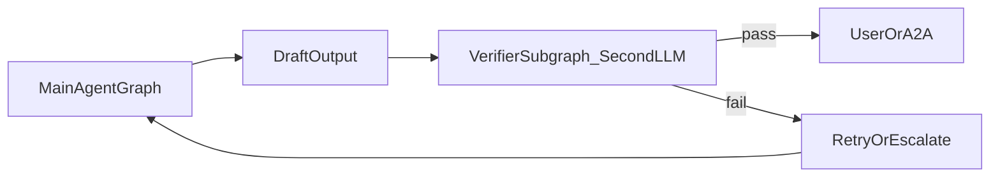

# Agent Framework 分阶段实施规划（深度版 v2）

**文档版本**：0.6-v2（2026-04-04）  
**存放位置**：本文件为 v2 **主规划**；[`../guides/plan-detailed.md`](../guides/plan-detailed.md) v0.3 仍为总纲（A2A 对齐叙述完整），**不被废止**。  
**关联文档**：[memory.md](../agents/memory.md)（记忆 / MCP / 压缩 / 子 LLM）、[comparison_three_agents.md](../agents/comparison_three_agents.md)、[`plan-detailed.md`](../guides/plan-detailed.md)。

---

## 1. 产品侧已拍板（2026-04-04）

以下结论写入阶段划分与 DoD，**取代** v2 初稿中的「默认假设」开放式条目。

| 议题 | 决议 |
|------|------|
| **Verifier（输出二审）** | **框架内第二套 LLM / 子图** 即可，不绑定外部商业 OpenClaw 类 API。 |
| **动态 MCP（原 WP2.10）** | **延后至阶段 3** 与记忆/RAG/持久化统筹实现；阶段 2 **不纳入必达**。 |
| **记忆落盘（WP3.6）** | **首版支持写磁盘**；**暂不引入数据库**（无 SQLite/PG 等硬性依赖）。后续阶段 3 深化：全量向量检索与索引 **以 [`../../../3rd-party/faiss`](../../../3rd-party/faiss)（Faiss）为后端** 落地数控与 RAG，与 `AGENT_BUILD_FAISS`、[`plan-detailed.md`](../guides/plan-detailed.md) §6 对齐。 |
| **多轮会话 + 输入 DSL** | **用户侧** `@file` / `@url` 物化与 **`/cmd` 控制面** 通过 **统一预处理层** 进入图（见 §5.1）；**不**伪装为 LLM `function_call`。动态 MCP / Skills **热加载类** `/cmd` **仅阶段 3（WP3.7）** 验收。 |

---

## 2. 与 v0.3 的关系

| 维度 | `guides/plan-detailed.md` v0.3 | 本文 v2 |
|------|-------------------------------|---------|
| 阶段顺序 | CLI → A2A → RAG | **相同** |
| 阶段 2 | WP2.1–2.6、富 UI | **扩展** WP2.0、2.1b–2.1d、2.7–2.9；**不含**动态 MCP 必达；**§5.1** 多轮写回 + `@`/`/cmd` 预处理（MCP 热切换 `/cmd` 不在此阶段必达） |
| 阶段 3 | RAG、KB、Skills×向量 | **扩展** 记忆 Assembly、压缩模板、子 LLM 管线；**含**动态 MCP；**含**磁盘记忆首版 + **后续 Faiss 向量数控** |

---

## 3. 阶段 1 已完成基线（衔接阶段 2/3）

| 领域 | 状态 |
|------|------|
| LLM 多适配、流式与工具、`ToolBus`、Schema、allowlist、MCP stdio/HTTP、`mcp.json` 导入 | 已具备 |
| `AgentLoopNode`、`PromptRenderer`、Skills（Registry/Loader/`run_skill_script`）、CLI/ Skills demo | 已具备 |
| **待阶段 2 入口补齐** | `GraphExecutor::execute` / `build_custom_workflow`；同轮工具 **顺序执行**（编排策略在阶段 2 升格）；统一结构化日志（见 [`plan-detailed.md`](../guides/plan-detailed.md) 与 observability 节） |
| **待阶段 2 会话语义补齐** | REPL / A2A **共用执行入口**时，将单次运行结束时的 **`NextAgentState`（含 `history`）写回** 会话对象，使多轮 `>` 或连续请求具备工作记忆；当前 CLI demo 以单次拷贝为主，属已知缺口（§5.1）。 |

---

## 4. 三库对比在本 v2 中的落点（摘要）

- **Claude Code**：工具分批并发、结果预算、权限 → 阶段 2：**WP2.1b–2.1c、2.1d**。  
- **Claude Code / memory.md**：压缩偏早触发 → 阶段 2 **WP2.9**、阶段 3 **WP3.3**。  
- **humanus-cpp**：Planning、分块、挤出 → 阶段 3 任务记忆与外置结果；阶段 2 可选外环计划（与 v0.3 §5.3 一致）。  
- **AF**：声明式图 → Verifier、子 LLM、压缩均以 **子图/节点** 接入。

---

## 5. 横向基础：身份、工作上下文、观测

- **Identity**：`tenant_id` / `agent_id` / `session_id` / `task_id` 进入 A2A SSE 与结构化日志（字段建议见 §9）。  
- **ExecutionContext**：在拼装 `LLMInput` 前固化 cwd、允许的 MCP 集合、策略版本号，供质控与审计（**WP2.7** 消费）。  
- **日志**：向 spdlog 或统一门面收敛（以 `3rd-party/spdlog` **官方 include 布局** 为准；扁平 vendored 树需先整理，见 v0.3 工程假设）。

### 5.1 多轮会话与输入 DSL（规划）

面向 **多轮会话** 与 **用户输入中的结构化片段**，在 **`PromptRenderer` / `LLMNode` 之前**（或等价：图上独立 **UserInputPreprocessor** 节点）统一解析，输出可供后续节点消费的结构化结果，例如：`llm_user_text`、`injected_context[]`（带来源、字节/ token 计量）、`control_actions[]`（`/cmd` 解析结果）。CLI REPL 与 A2A **共用同一套规则**，差异仅在 Identity / 权限策略。

**多轮状态写回（衔接 WP2.0）**

- 每次 `GraphExecutor::execute`（或模板入口）结束，应将环路的 **`NextAgentState`** 合并回 **会话级 `AgentThreadState`**（含 `history`、`iteration`、技能缓存字段等），避免下一用户轮次以空 `history` 调用 LLM。  
- 压缩 / 清理（**WP2.9** → **WP3.2–3.3**）在 **写回前或写回后** 按策略裁剪同一份会话状态，并保证 **失败回退**（与 **WP2.9** DoD 一致）。

**`@` 引用（文件 / URL）**

| 能力 | 阶段与安全边界 |
|------|----------------|
| **`@file` / 行范围**（如 `a-b`） | **阶段 2** 纳入 **WP2.7 Tier A**（语法、长度上限、路径规范）；物化内容进入 `LLMInput.context` 或等价注入槽；**必须**走现有 **fs 监禁**（与内建 `fs_*`、`AGENT_FS_ROOT` 等策略一致），禁止预处理层裸读任意路径。 |
| **`@url`** | **阶段 2**：物化走 **`web_fetch` 同类策略**（SSRF、字节上限、主机策略），注入内容计入 **WP2.1c** 上下文/工具结果总预算；**不**在预处理中绕过 ToolBus 安全栈。 |
| **歧义或复杂引用** | 可选 **WP2.7 Tier B**（子 LLM / 工具、固定 JSON 输出）做消歧，默认关闭或限流。 |

**`/cmd` 控制面（与聊天正文分离）**

- **语法**：约定 **显式前缀**（如行首 `/`）+ **白名单子命令**；未知命令 → 按产品选择 **原样进模型** 或 **结构化拒绝**，须在文档与单测中固定。  
- **阶段 2 允许示例**：`/memory compact`、`/memory clear`（触发 **WP2.9** 钩子或等价裁剪）、在已允许配置集合内 **`/model …`**（仅改客户端已支持的模型标识，不引入新密钥流）。  
- **阶段 2 禁止或仅 stub**：动态 **加载/卸载 MCP**、**Skills 根目录热切换** 等 — 与 §1「动态 MCP 阶段 3」一致；对应 `/cmd` **仅在 WP3.7 与威胁模型（§8）一起验收**。  
- **审计**：每条生效的 `/cmd` 产生结构化日志（`component` 建议 `user_command` 或 `control_action`，见 §9）。

**与工作包映射（摘要）**

| 需求 | 工作包 |
|------|--------|
| 统一执行入口 + 跨轮 `history` | **WP2.0**、§5.1 状态写回 |
| `@` / `/cmd` 规则与注入预算 | **WP2.7**、**WP2.1c** |
| 偏早压缩、手动压缩/清理 | **WP2.9**；深化模板与子 LLM → **WP3.3**、**WP3.5** |
| 槽位化记忆拼装 | **WP3.2** |
| 落盘与跨进程恢复 | **WP3.6** |
| `/mcp`、`/skills` 等热加载 | **WP3.7**（仅此阶段必达） |

**风险（实现前写入威胁模型备忘）**

- 多行粘贴、代码块与 `/cmd` 的 **边界**须语法定义，避免误解析。  
- `@url` 拉取内容可能含 **提示注入**，须长度截断并与 Verifier / 输入 QC 策略协调。

---

## 6. 阶段 2（深化）：A2A + 质控 + 检核 + 记忆最小集

在 v0.3 **§5** 的 WP2.1–2.6、§5.4 富 UI 基础上，以下 **追加**。

### 6.1 工作包

| 工作包 | 内容 | 硬性 DoD |
|--------|------|----------|
| **WP2.0** | `GraphExecutor::execute` + 模板注册最小集 | CLI 与 Server **同一执行入口**；禁止长期 `throw` 占位；多轮场景下 **会话状态（含 `history`）在请求间可延续**（与 §5.1 写回约定一致，单测或集成测覆盖） |
| **WP2.1b** | 工具编排：只读可并行、写串行、并发上限 | 文档 + 单测；默认可关闭以保持现行为 |
| **WP2.1c** | 工具结果预算：超限截断/外置引用 | RPC/SSE 不因巨包失败；**用户注入上下文**（`@file` / `@url` 物化块）计入 **同一套或显式联动的预算**，避免与工具结果叠加撑爆上下文 |
| **WP2.1d** | 调用前 hook：allow / deny / 改参 | 与 `AGENT_TOOL_ALLOWLIST` 组合策略文档化 |
| **WP2.7** | **输入质控**：Tier A（规则/schema）+ Tier B（子 LLM 或工具、**固定字段输出**） | 每类入口至少一种 QC；**Tier A** 覆盖 **§5.1** 的 `@` / `/cmd` 语法与安全边界（长度、路径、URL 策略） |
| **WP2.8** | **Verifier**：**框架内第二套 LLM / 子图** | 结构化结论 `ok` / `issues` / `suggested_action`；默认无写工具；事件进 SSE + 日志 |
| **WP2.9** | **工作记忆** + **偏早压缩钩子**（阈值可配，`memory.md` 建议约 50% 起） | 可导出槽位预算；压缩失败 **回退**；**手动触发**（§5.1 `/memory compact` 等）与自动触发 **共用策略入口** |
| ~~**WP2.10 动态 MCP**~~ | **移至阶段 3**（见 §7.2） | 阶段 2 **不验收** |

### 6.2 Verifier 子图（已定：内部双 LLM）

### 6.3 阶段 2 DoD 汇总

v0.3 §5.1 **外加**：GraphExecutor、2.1b–2.1d、ExecutionContext、输入质控 A+B、Verifier、最小压缩；**不含**动态 MCP。  
**外加（本文 §5.1）**：多轮 **状态写回** 与 **`@` / `/cmd` 预处理** 的规范与单测/集成测占位（`/cmd` 中 MCP/Skills 热切换仍以阶段 3 为必达）。

---

## 7. 阶段 3（深化）：RAG + Faiss + 磁盘记忆 + 动态 MCP

在 v0.3 **§6** 与 [`memory.md`](../agents/memory.md) §4–§6 基础上展开。

### 7.1 工作包

| 工作包 | 内容 | 硬性 DoD |
|--------|------|----------|
| **WP3.1** | Encoder、`VectorStore`、KnowledgeBase（v0.3） | **Faiss**：以 [`3rd-party/faiss`](../../../3rd-party/faiss) 为 **`AGENT_BUILD_FAISS=ON`** 时的向量后端，与内存实现 **同接口双测** |
| **WP3.2** | 记忆 **Assembly**：宏观/任务/工作/RAG/工具 槽位 + 预算 | 单测稳定拼装；可导出来源与占用 |
| **WP3.3** | 压缩策略注册表（多任务模板 ≥2） | |
| **WP3.4** | Skills×RAG **优先级**（技能优先/文档优先/合并） | 评测：仅 skill / 仅 doc / 双命中 |
| **WP3.5** | 子 LLM 管线（事实、小结、压缩质检） | 独立开关；失败不阻塞 |
| **WP3.6** | **记忆落盘（首版）** | **仅文件系统**（如分层目录 + JSON/JSONL 或等价）；**无数据库**；路径由配置/环境变量指定（如 `AGENT_MEMORY_DATA_DIR`）；权限与敏感字段脱敏见安全评审 |
| **WP3.7** | **动态 MCP**（原 WP2.10） | 受控加载/卸载、审计、与 Skills 生命周期一致；**未授权不暴露工具**；**§5.1** 中 **MCP/Skills 热切换类 `/cmd`** 与此包一并验收（阶段 2 不得宣称完成） |
| **WP3.8** | **向量「数控」深化** | 在 WP3.6 磁盘元数据与 **Faiss 索引** 之间定义一致迁移/重建策略；长文本挤出与索引更新可测 |

### 7.2 动态 MCP 延后说明

动态 MCP 与会话级记忆、磁盘 tier、向量索引 **强耦合**（`memory.md` §2）。**阶段 2** 聚焦 A2A 稳定与 Verifier；**阶段 3** 一次性满足「连接生命周期 + 持久化 + 召回」的闭环，降低两次 breaking change。

### 7.3 磁盘记忆 vs Faiss（首版策略）

- **首版（WP3.6）**：对话摘要、任务结论、user/project 级 blob **落盘**；检索以 **文件枚举 + 可选轻量索引文件** 为主，**不**强制 DB。  
- **深化（WP3.1 + WP3.8）**：文档块与技能向量进入 **`VectorStore`**；生产路径 **Faiss**（`3rd-party/faiss`）；与磁盘 tier 的 **cursor/版本** 在文档中写明，避免双源漂移。

### 7.4 阶段 3 DoD 汇总

v0.3 §6.1 **外加**：Assembly、压缩模板、Skills/RAG 评测、子 LLM、**磁盘记忆**、**动态 MCP**、**Faiss 后端与数控策略**。

---

## 8. MCP / Skills 与记忆的边界

- 阶段 2：**静态** `mcp.json` 导入 + ToolBus 与 v0.3 一致；用户 **`/cmd` 请求动态改 MCP/Skills** 若实现，仅允许 **拒绝并提示** 或 **无操作 stub**，不替代 WP3.7。  
- 阶段 3：**动态 MCP** 与 **落盘记忆**、`memory.md` 元 MCP 思路对齐；实现前补 **威胁模型**（加载新 MCP = 新子进程/新凭证）；与 **§5.1** `/cmd` 白名单对齐评审。

---

## 9. 可观测性与审计（建议字段）

`ts`, `level`, `tenant_id`, `session_id`, `task_id`, `iteration`, `component`（含 `user_command` / `control_action` 表示 **§5.1 `/cmd`** 生效路径）, `tool_full_name`, `latency_ms`, `outcome`, `error_code`, `context_hash`（指纹，非全文 prompt）。

---

## 10. 修订记录

| 日期 | 版本 | 说明 |
|------|------|------|
| 2026-04-04 | 0.5-v2 | 落盘 architecture；Verifier/动态MCP/记忆落盘+Faiss 拍板；WP2.10→3.7；WP3.6 磁盘无DB；WP3.8 Faiss 数控 |
| 2026-04-04 | 0.6-v2 | §5.1 多轮会话与输入 DSL（`@` / `/cmd`）；§1/§3/§6.1/§7.1/§8/§9 联动；WP2.0 状态写回、WP2.1c 注入预算、WP2.7/2.9/3.7 描述扩展 |

---

## 11. 参考入口

- [guides/plan-detailed.md](../guides/plan-detailed.md) — A2A 双栈、UI 阶段表、WP1.x 原始分解  
- [guides/phase-2-plan.md](./phase-2-plan.md) — 阶段 2 可排期总表（合并本文与 plan-detailed §5–7）  
- [agents/memory.md](../agents/memory.md) — 压缩阈值、子 LLM、动态 MCP 概念  
- [agents/comparison_three_agents.md](../agents/comparison_three_agents.md) — 三库差异  
- 仓库 Faiss：`taskflow/3rd-party/faiss`（与根 CMake `AGENT_BUILD_FAISS` 联用）
