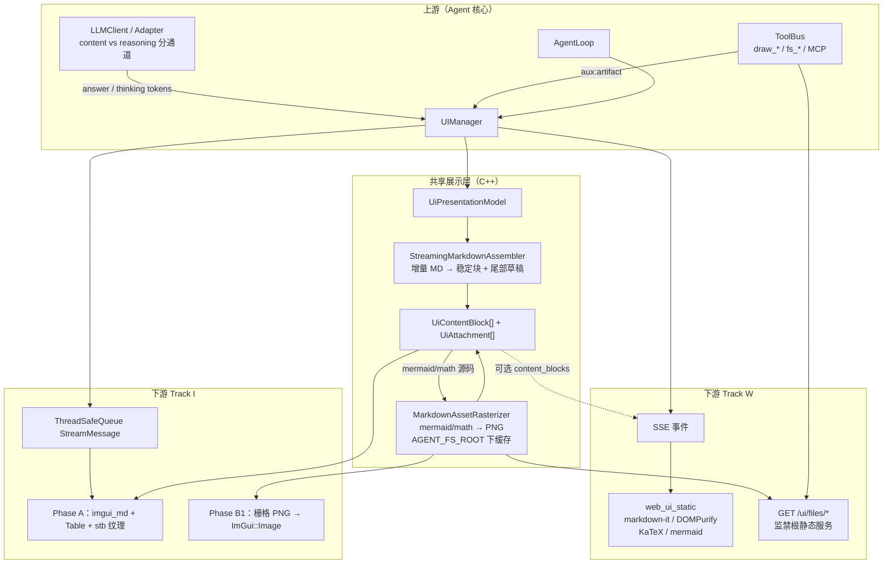
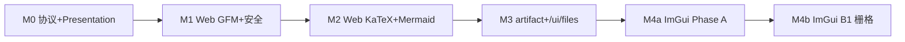
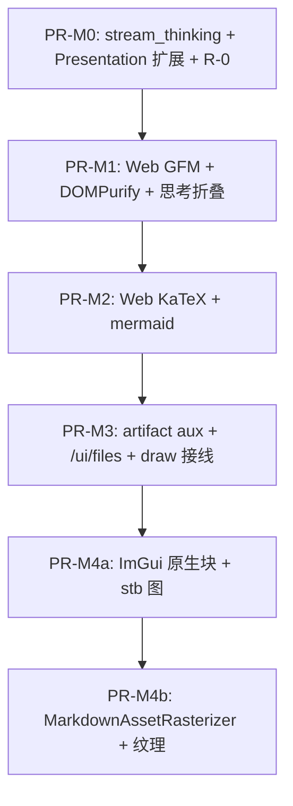

# WP2.U：富界面与富 Markdown 渲染计划

本文档覆盖两层内容：

1. **M8 基线**：在 `UIManager` / `UIHandler` 之上提供 Track I（ImGui）、Track T（FTXUI TUI）、Track W（浏览器 + SSE），共享同一 Agent / ToolBus / Skills / MCP 启动路径（见 [phase-2-wpu.md](./phase-2-wpu.md)）。
2. **M9+ 富 Markdown**：在已落地的 Web / ImGui 展示链路上，支持 LLM **回答**与 **思考** 的富渲染（GFM、表格、公式、Mermaid、图片），并给出可逐步交付的上下游任务计划。

**技术决策（已确认）**

| 端 | 路线 | 说明 |
|----|------|------|
| **Web（Track W）** | 浏览器原生栈优先 | `markdown-it` + DOMPurify + KaTeX + mermaid；流式 debounce；思考区折叠 |
| **ImGui（Track I）** | **Phase A + B1** | A：原生块（标题/列表/表格/代码/PNG）；B1：Mermaid/公式经栅格化服务 → PNG → GL 纹理 |
| **TUI（Track T）** | 不强制富渲染 | 继续纯文本 / 可选 ANSI；与富 Markdown 里程碑解耦 |

**文档版本**：1.0  
**日期**：2026-07-20  
**上游依据**：[phase-2-wpu.md](./phase-2-wpu.md)、[phase-1-wp6.md](./phase-1-wp6.md) §4.3、[builtin-draw-tools.md](./builtin-draw-tools.md)、[`presentation_model.hpp`](../../include/agent/ui/presentation_model.hpp)

**实现状态（2026-07-20）**：M0–M4a 已落地并通过真实三端截图验收；M4b 的 Mermaid/公式离屏栅格化服务仍作为独立可选阶段保留。Web 已使用本地 vendored 依赖，不要求 CDN；ImGui 已支持沙箱内 PNG/JPEG/WebP/GIF 纹理预览；TUI 保持纯文本兼容。

---

## 1. 改造前基线（M8 已交付能力）

| 层 | 现状 | 缺口 |
|----|------|------|
| 流式 | `UIManager::stream_token` → handlers；Web SSE `kind ∈ {token,final,error,aux}` | 无 `thinking` / `channel`；无 artifact 媒体事件 |
| 展示模型 | `UiTurn.content` 单字符串 | 无 blocks / attachments / thinking |
| ImGui 视图 | `ImGui::TextWrapped` 纯文本 | 无 Markdown AST、无图片纹理 |
| Web 视图 | `<pre class="turn-body">` + `textContent` | 无 GFM / KaTeX / mermaid / XSS 净化 |
| 思考 | `LLMOutput.reasoning` 存在 | UI 未分通道展示 |
| 图像 | `draw_*` → PNG / `png_base64` + `AGENT_FS_ROOT` | 未接入对话气泡 |

**共享行为（保持不变）**

- **流式**：`UIManager::stream_token(session_id, token)` → `handle_stream_token`。
- **终稿**：`dispatch_final_result(json)` → `handle_final_result`（`final_answer` 等键与 CLI 一致；去重见 [phase-1-wp6.md](./phase-1-wp6.md) §4.3）。
- **错误**：`dispatch_error(message)`。
- **辅助事件**：`dispatch_message(type, payload)` → `handle_aux_event`；ImGui/Web/TUI 统一为 `StreamMessage` 的 `aux:*` 或 SSE `kind: aux`。

---

## 2. 目标架构与上下游交付链路

### 2.1 端到端数据流



### 2.2 上下游职责边界

| 方向 | 组件 | 交付物 | 消费者 |
|------|------|--------|--------|
| **上游** | LLM 适配器 | 分通道流式：`answer` / `thinking` | `UIManager` |
| **上游** | AgentLoop / ToolBus | `aux:artifact`（PNG path / base64、caption、tool_call_id） | handlers |
| **共享** | `UiPresentationModel` | `raw_markdown`、`thinking_raw`、`blocks`、`attachments` | ImGui / Web / 测试 |
| **共享** | `StreamingMarkdownAssembler` | 闭合 fence 固化块；未闭合仅草稿 | Presentation |
| **共享** | `MarkdownAssetRasterizer`（B1） | 缓存 PNG 路径（相对 `AGENT_FS_ROOT`） | ImGui 纹理；可选 Web 回退 |
| **下游 Web** | `web_ui_static` + `/ui/files` | 富 HTML；受控图片 URL | 浏览器 |
| **下游 ImGui** | `imgui_console_view` | Phase A 原生块 + B1 纹理 | GLFW 窗口 |
| **下游 TUI** | FTXUI view | 仍读 `raw` / 纯文本 snapshot | 终端 |

**禁止**

- LLM / executor 线程直接调用 `ImGui::*` 或操作 GL 纹理。
- Web 端对 LLM 输出使用 `innerHTML` 而不经 DOMPurify。
- 图片 / 文件 URL 指向 `AGENT_FS_ROOT` 之外的任意路径。
- 终稿再次全文 dump 已 stream 的同一段正文（§4.3 去重）。

---

## 3. 协议与数据模型扩展

### 3.1 SSE / StreamMessage（向后兼容）

旧客户端忽略未知字段即可。

| `kind` / `message_type` | 字段 | 语义 |
|-------------------------|------|------|
| `token` | `content`；可选 `channel`（缺省 `"answer"`） | 回答增量 |
| `token` + `channel:"thinking"` 或独立 `kind:"thinking"` | `content` | 思考增量（二选一；实现时 **固定一种** 并写进本表） |
| `final` | `final_answer`；可选 `reasoning` | 终稿；已 stream 则 UI **不**重复写入主答案区 |
| `error` | `message` | 错误 |
| `aux` | `type` / `payload` | 见下表 |

**`aux.type` 闭集扩展（在 v1 `tool_start` / `tool_end` 之外登记）**

| `type` | `payload` 必填键 | 含义 |
|--------|------------------|------|
| `tool_start` / `tool_end` | 见 [phase-2-wpu.md](./phase-2-wpu.md) §5 | 工具生命周期（既有） |
| `tool_started` / `tool_completed` | 与现有 Web demo 对齐 | 活动面板 |
| `artifact` | `mime`（如 `image/png`）、`path` **或** `bytes_base64`；可选 `caption`、`tool_call_id` | 对话内附件 |
| `runtime` / `skills_status` / … | 既有 demo 约定 | 元数据 |

**推荐固定**：流式思考使用 **`kind: "thinking"`**（与 `token` 并列），避免旧客户端把思考拼进回答；`channel` 仅作 ImGui 队列内部字段可选镜像。

### 3.2 `UiPresentationModel` 演进

```cpp
enum class UiContentBlockKind {
    Paragraph, Heading, List, Code, Table,
    MathInline, MathBlock, Mermaid, Image, ThematicBreak, DraftTail
};

struct UiAttachment {
    std::string id;
    std::string mime;
    std::string path;          // 相对 AGENT_FS_ROOT，优先
    std::string bytes_base64;  // 仅小图临时；落地后应写盘并清空
    std::string caption;
    std::string tool_call_id;
};

struct UiContentBlock {
    UiContentBlockKind kind;
    std::string text;          // 段落 / 代码 / mermaid 源 / latex 源
    int heading_level = 0;
    std::vector<std::vector<std::string>> table_cells; // 简单 GFM
    std::string attachment_id; // Image 块关联
    bool stable = true;        // false = 流式尾部草稿，勿栅格化 / 勿 mermaid.run
};

struct UiTurn {
    UiTurnRole role = UiTurnRole::Assistant;
    std::string raw_markdown;      // 回答源真相（复制 / 导出）
    std::string thinking_raw;      // 思考源（折叠）
    std::vector<UiContentBlock> blocks;
    std::vector<UiAttachment> attachments;
    std::int64_t timestamp_ms = 0;
    bool streaming = false;
    bool error = false;
};
```

**增量组装约定**

1. `append_stream_token(answer)` → 追加 `raw_markdown` → Assembler 更新 `blocks`（仅重算尾部不稳定块）。
2. `append_thinking_token` → 追加 `thinking_raw`；**默认不**跑 Mermaid/KaTeX（可纯文本或轻量 MD）。
3. `observe_artifact` → push `attachments` + 可选插入 `Image` 块（不必等模型写 ``）。
4. `complete(final)`：若 `raw_markdown` 非空则忽略重复的 `final_answer` 全文；可补写 `reasoning` 到 `thinking_raw`（仅当思考通道未流式时）。

---

## 4. 分阶段落地计划（M0–M4）

整体顺序：**协议与 Presentation → Web 全量富渲染 → 文件服务与 artifact → ImGui Phase A → ImGui B1 栅格化**。每一阶段可独立合入，且有明确 DoD。



### 4.1 M0 — 协议与共享展示模型

**目标**：上下游共用同一 turn 状态；旧 UI 仍可读 `content` 兼容字段。

| ID | 任务 | 主要改动面 | 验收 |
|----|------|------------|------|
| M0.1 | 扩展 `StreamMessage` / SSE JSON：`kind:thinking`；`aux:artifact` 登记 | `types.hpp` 注释、`web_handler`、`gui_handler`、`tui_handler` | 单测：thinking 不进入 answer `raw` |
| M0.2 | `UIManager`：`stream_thinking` 或 `stream_token(session, tok, channel)` | `ui_manager.hpp/.cpp` | 与现有 `stream_token` 二进制兼容（默认 answer） |
| M0.3 | `UiTurn` / `UiPresentationModel` 扩展；保留 `content` 别名 = `raw_markdown`（过渡） | `presentation_model.*`、既有 ctest | `test_ui_presentation_model` 全绿 |
| M0.4 | LLM 适配器：能解析的 reasoning/thinking 增量走思考通道；否则终稿补 `reasoning` | `openai_adapter` / `anthropic_adapter` | live 或 fixture：思考与回答分离 |
| M0.5 | 文档：本文件 §3 定稿；`phase-2-wpu.md` 链到 M9 | 文档 | 评审勾选 |

**DoD**：CLI 行为不变；Web/ImGui 即使仍纯文本，也能在模型层区分 thinking / answer 事件。

### 4.2 M1 — Web：GFM + XSS 安全（优先用户可见）

**目标**：`turn-body` 从 `<pre>` 改为安全 Markdown HTML；流式 debounce。

| ID | 任务 | 主要改动面 | 验收 |
|----|------|------------|------|
| M1.1 | 引入 `markdown-it`（GFM 表格/删线）+ `DOMPurify`；CSP 基线 | `web_ui_static/`（可 vendor 或 CDN+完整性哈希，**文档标明策略**） | 恶意 HTML 被剥离 |
| M1.2 | 流式：50–100ms debounce / `rAF` 重渲；`final` 立即渲染 | `app.js` | 人工 U-3 无卡顿、无终稿重复 |
| M1.3 | 思考区：`<details>` + 纯文本或轻量 MD（无脚本） | `app.js` / `styles.css` | thinking 事件可见可折叠 |
| M1.4 | 代码块样式与暗色主题对齐 | CSS | 截图/人工 |
| M1.5 | 静态资源回归 | `tests/scripts/test_web_ui_static.sh` 扩展 | CI 脚本绿 |

**DoD**：短对话含标题、列表、表格、代码块正确显示；XSS fixture 不过 Purify。

### 4.3 M2 — Web：KaTeX + Mermaid

| ID | 任务 | 主要改动面 | 验收 |
|----|------|------------|------|
| M2.1 | KaTeX：`$...$` / `$$...$$`；仅对稳定 HTML 跑 | `app.js` + KaTeX CSS/fonts | 公式夹具通过 |
| M2.2 | mermaid：仅**已闭合** ` ```mermaid ` fence 调用 `mermaid.run`；失败回退源码 | `app.js` | 半截 fence 不抛错、不空刷 |
| M2.3 | 渲染缓存：按 fence 源码哈希缓存 SVG | `app.js` | 重复流式不重复 layout 爆炸 |
| M2.4 | 夹具包 | `examples/web_ui_static/fixtures/` 或 `tests/fixtures/rich_md/` | 清单见 §6 |

**DoD**：公式与流程图在流式结束后正确；流式中途不崩溃。

### 4.4 M3 — Artifact 与受控文件服务

**目标**：`draw_*` / `fs_*` 产物进入对话；Web/ImGui 同源路径语义。

| ID | 任务 | 主要改动面 | 验收 |
|----|------|------------|------|
| M3.1 | ToolBus / demo：工具返回 PNG 时 `dispatch_message("artifact", …)` | `draw_tools` 观察点或 demo 包装；`UIManager` | aux 到达 Web/ImGui |
| M3.2 | `GET /ui/files/<relpath>`：根 = `AGENT_FS_ROOT`；拒绝 `..`；MIME 白名单 | `web_ui_demo.cpp` | 越狱路径 404/403 |
| M3.3 | Web：`Image` / artifact → ``；小 base64 可 data URL 后写盘 | `app.js` | draw_export 图出现在气泡 |
| M3.4 | Presentation：`attachments` + Assembler 解析 `` 仅允许监禁内 | Assembler | 单测路径规范化 |
| M3.5 | 更新 [builtin-draw-tools.md](./builtin-draw-tools.md)「UI 展示」一节 | 文档 | 交叉链接 |

**DoD**：一次 `draw_export` 后 Web 对话内可见图；非法路径不可访问。

### 4.5 M4a — ImGui Phase A（原生块）

**目标**：不依赖外部 JS 引擎，覆盖标题/列表/表格/代码/PNG。

| ID | 任务 | 主要改动面 | 验收 |
|----|------|------------|------|
| M4a.1 | 引入 Markdown 解析：优先 **imgui_md** 或 **md4c** + 自绘（CMake `AGENT_BUILD_IMGUI` 门闩） | `3rd-party/` 或 FetchContent；`imgui_console_view` | 编译 optional |
| M4a.2 | 从 `UiContentBlock` 渲染；流式仅更新尾部 | view + Assembler 接线 | 帧率可接受；drain 上限仍生效 |
| M4a.3 | GFM 表格 → `ImGui::BeginTable` | view | 夹具表格 |
| M4a.4 | PNG：`stb_image` → GL 纹理 LRU；`ImGui::Image` | view；复用已有 stb | artifact / 本地 path |
| M4a.5 | Thinking：`TreeNode` + 纯文本 | view | 与 Web 同会话可读 |
| M4a.6 | Mermaid/Math 块 **暂时**显示源码 + 灰色提示「待 B1」 | view | 不崩溃 |

**DoD**：与 Web 同一 fixture 的非公式/非 mermaid 部分在 ImGui 可读；图片可见。

### 4.6 M4b — ImGui Phase B1（栅格化）

**目标**：Mermaid / 块级公式 → PNG → 纹理；与 `draw_*` 管线一致落在 `AGENT_FS_ROOT`。

| ID | 任务 | 主要改动面 | 验收 |
|----|------|------------|------|
| M4b.1 | 定义 `MarkdownAssetRasterizer` 接口：`render(kind, source) -> relative_png_path` | `include/agent/ui/` + `src/ui/` | 单元接口稳定 |
| M4b.2 | 后端选型（实现选一并写死默认）：**本地** `mmdc`/`kroki` CLI **或** 可选 HTTP Kroki；KaTeX/MathJax CLI → PNG/SVG 再转 PNG | 工具脚本 + env | `AGENT_MD_RASTER_*` 文档化 |
| M4b.3 | 仅 `stable==true` 的 Mermaid/MathBlock 触发；结果写入 attachments/缓存目录 | Assembler 钩子 | 半截 fence 不调用 |
| M4b.4 | ImGui 加载栅格 PNG；失败保留源码块 | view | 坏 Mermaid 回退 |
| M4b.5 | 缓存：源码哈希 → path；LRU 纹理与磁盘上限 | rasterizer | 环境变量限制体积 |
| M4b.6 | CI：无栅格二进制时 **SKIP** B1 用例；有则跑黄金 PNG 哈希（可选） | ctest | 默认 CI 不阻塞 |

**环境变量（建议）**

| 变量 | 默认 | 说明 |
|------|------|------|
| `AGENT_MD_RASTER_ENABLE` | `0` | 总开关；ImGui B1 与可选 Web 服务端回退 |
| `AGENT_MD_RASTER_BACKEND` | `none` | `none` \| `kroki_http` \| `mmdc` \| `custom` |
| `AGENT_MD_RASTER_URL` | 空 | Kroki 基址（若 http） |
| `AGENT_MD_RASTER_CACHE_DIR` | `$AGENT_FS_ROOT/.agent_md_cache` | PNG 缓存 |
| `AGENT_MD_RASTER_TIMEOUT_MS` | `10000` | 单次渲染超时 |
| `AGENT_MD_RASTER_MAX_CACHE_BYTES` | `64MB` | 磁盘缓存上限 |

**DoD**：含 Mermaid + `$$...$$` 的夹具在 ImGui 显示为图；关闭开关时回退源码；默认 CI 不强制安装 Node/Kroki。

---

## 5. 与既有 Track 的衔接（构建 / 运行）

### 5.1 CMake 选项（默认均为 OFF）

| 选项 | 说明 |
|------|------|
| `AGENT_BUILD_IMGUI` | `imgui_agent_demo`；GLFW + Dear ImGui（优先 `3rd-party/imgui`）。可选 ImPlot / ImPlot3D |
| `AGENT_BUILD_TUI` | `tui_agent_demo`；vendored FTXUI 7.0.1 |
| `AGENT_BUILD_WEB_UI` | `web_ui_demo`；`3rd-party/httplib` |

```bash
cmake -S . -B build -DCMAKE_CXX_STANDARD=20 \
  -DTF_BUILD_AGENT_FRAMEWORK=ON \
  -DAGENT_BUILD_IMGUI=ON
cmake --build build --parallel -t imgui_agent_demo

cmake -S . -B build -DCMAKE_CXX_STANDARD=20 -DAGENT_BUILD_WEB_UI=ON
cmake --build build --parallel -t web_ui_demo
```

**CI**：无头环境不跑 GLFW 窗口；`AGENT_RICH_UI_CI=compile_only` 语义标记；B1 栅格测试默认 SKIP。

### 5.2 Track I — `imgui_agent_demo`

- **系统包（Linux）**：`libgl1-mesa-dev`，及 GLFW 常见依赖（`libxrandr-dev` 等或 `xorg-dev`）。
- **运行时**：每帧 `drain_messages` 上限 `AGENT_IMGUI_QUEUE_DRAIN_MAX`（默认 **256**）。
- **富渲染**：M4a 起消费 `blocks`；M4b 起消费栅格缓存。禁止在 worker 线程上传 GL 纹理（主线程 drain 后创建/更新纹理）。

### 5.3 Track T — `tui_agent_demo`

- 后端：`3rd-party/FTXUI`；状态边界仍为 `TuiHandler` + `UiPresentationModel`。
- 富 Markdown **不在**本计划强制范围；可读 `raw_markdown` / `thinking_raw` 纯文本。

### 5.4 Track W — `web_ui_demo`

- 静态资源：`agent_framework/examples/web_ui_static/`。
- 路由（基线 + M3）：`GET /`；`GET /ui/sse?session=default`；`POST /ui/run`；`POST /ui/cancel`；**`GET /ui/files/...`（M3）**。
- SSE：`data: ` + 单行 JSON；`kind` 扩展见 §3.1。
- v1 限制：单 SSE 连接槽；多会话见 WP2.2 / WP2.5。

### 5.5 统一启动器

```bash
cp agent_framework/examples/configs/ui.env.example .env.ui
./agent_framework/tools/run_ui.sh --ui tui
./agent_framework/tools/run_ui.sh --ui imgui
./agent_framework/tools/run_ui.sh --ui web --port 8080
```

| 能力 | 启动器行为 |
|------|------------|
| FS | `AGENT_FS_ROOT` 默认仓库根；`--fs-root` 可缩小 |
| WEB / ExprTk / Draw | 见启动器帮助；Draw 与 M3 artifact 联动 |
| Skills / MCP | 与 `cli_agent_skills_demo` 对齐 |
| 富渲染栅格 | `AGENT_MD_RASTER_*`（M4b）；默认关闭 |

---

## 6. 测试矩阵

| ID | 阶段 | 类型 | 内容 |
|----|------|------|------|
| U-1 | M8 | 单元 | `dispatch_message` → `handle_aux_event` |
| U-2 | M8 | 单元 | ImGuiHandler 队列 drain |
| U-3 | M8+ | 手动 | 流式 → 终稿无全文重复 |
| T-FTXUI | M8 | 单元 | presentation / tui / ftxui view |
| R-0 | M0 | 单元 | thinking 与 answer 分通道；artifact aux 形状 |
| R-1 | M1 | 脚本 | 静态资源存在；可选 jsdom/纯正则 XSS 夹具 |
| R-2 | M2 | 手动/夹具 | KaTeX + mermaid 黄金用例 |
| R-3 | M3 | 集成 | `/ui/files` 越狱拒绝；draw 图可见 |
| R-4 | M4a | 单元/手动 | blocks 渲染；纹理 LRU |
| R-5 | M4b | 可选 | 栅格后端可用时 PNG 输出；否则 SKIP |

**富 Markdown 夹具清单（建议路径 `tests/fixtures/rich_md/`）**

1. GFM 表格 + 标题 + 列表  
2. 围栏代码块  
3. 行内/块级公式  
4. 完整 mermaid flowchart  
5. **未闭合** mermaid fence（流式中途快照）  
6. 本地 PNG 引用 + artifact 事件  
7. 含 `<script>` 的恶意 Markdown（须被净化）  
8. thinking 与 answer 交错流式  

---

## 7. PR 提交顺序（建议）



Web（P1–P3）可先于 ImGui 合入并单独验收；ImGui 不得阻塞 Web 用户体验改进。

---

## 8. 验收清单（DoD）

### 8.1 M8（既有）

- [x] 三选一：`imgui_agent_demo` / `tui_agent_demo` / `web_ui_demo` 可启动并完成一轮对话。
- [x] 默认 CMake 不强制拉取 ImGui/GLFW（`AGENT_BUILD_*` 默认 OFF）。
- [x] U-1 通过；CI U-0 至少一轨 compile-only。

### 8.2 富 Markdown（M0–M4）

- [x] **M0**：thinking / answer 分通道；旧 CLI 无回归。
- [x] **M1**：Web GFM + DOMPurify；流式 debounce；终稿无重复。
- [x] **M2**：KaTeX + 闭合 mermaid；半截 fence 安全。
- [x] **M3**：`aux:artifact` + `/ui/files` 监禁；draw 图入对话。
- [x] **M4a**：ImGui 原生块 + PNG；思考折叠。
- [ ] **M4b**：稳定 Mermaid/公式栅格化可选启用；默认 CI 不强制后端。

---

## 9. 风险与缓解

| 风险 | 缓解 |
|------|------|
| 流式全量重渲卡顿 | debounce；仅尾部草稿不稳定；mermaid/KaTeX/栅格只跑 `stable` 块 |
| ImGui 与 Web 观感差 | 共享 `raw_markdown` + 同一 `rich_md` 夹具 |
| 栅格依赖过重 | `AGENT_MD_RASTER_ENABLE=0` 默认；CI SKIP |
| 路径穿越 | `/ui/files` 与 Assembler 统一 `weakly_canonical` + 根前缀检查 |
| 显存/磁盘膨胀 | 纹理 LRU + `AGENT_MD_RASTER_MAX_CACHE_BYTES` |
| 去重破坏 | 严格 phase-1-wp6 §4.3；R-0/U-3 覆盖 |

---

## 10. 许可证摘要（第三方）

- **Dear ImGui**：MIT — https://github.com/ocornut/imgui  
- **GLFW**：zlib/libpng — https://github.com/glfw/glfw  
- **cpp-httplib**：MIT — 仓库 `3rd-party/httplib`  
- **FTXUI**：MIT — `3rd-party/FTXUI`  
- **markdown-it 14.1.0**：MIT；本地 vendor  
- **DOMPurify 3.2.6**：Apache-2.0 OR MPL-2.0；本地 vendor  
- **KaTeX 0.16.22**：MIT；JS/CSS/WOFF2 字体均本地 vendor  
- **Mermaid 10.9.3**：MIT；本地 vendor  
- **imgui_md / md4c**：未引入；M4a 使用仓内 `StreamingMarkdownAssembler` 与 ImGui 原生控件  
- **stb / canvas_ity**：见 [builtin-draw-tools.md](./builtin-draw-tools.md)

具体文件、版本与 SHA-256 见 [`web_ui_static/vendor/README.md`](../../examples/web_ui_static/vendor/README.md)。

---

## 11. 相关链接

- [phase-2-wpu.md](./phase-2-wpu.md) — M8 Track 实现合同  
- [phase-1-wp6.md](./phase-1-wp6.md) — 流式/终稿去重  
- [builtin-draw-tools.md](./builtin-draw-tools.md) — draw_* 与 PNG 产物  
- [phase-2-plan.md](./phase-2-plan.md)  
- [`presentation_model.hpp`](../../include/agent/ui/presentation_model.hpp)  
- [`web_ui_static/app.js`](../../examples/web_ui_static/app.js)

---

## 12. 修订记录

| 日期 | 版本 | 说明 |
|------|------|------|
| 2026-04-04 | 0.1 | M8：Track I/T/W、构建与启动 |
| 2026-07-18 | 0.2 | TUI FTXUI、统一 `run_ui.sh`、Skills/MCP 对齐 |
| 2026-07-20 | 1.0 | 富 Markdown 任务计划：Web 优先；ImGui Phase A + B1；M0–M4 上下游交付链与 DoD |
| 2026-07-20 | 1.1 | M0–M4a 实现收口：双通道、Web GFM/KaTeX/Mermaid、安全 artifact、ImGui 原生块与图片纹理、真实三端截图验收 |
