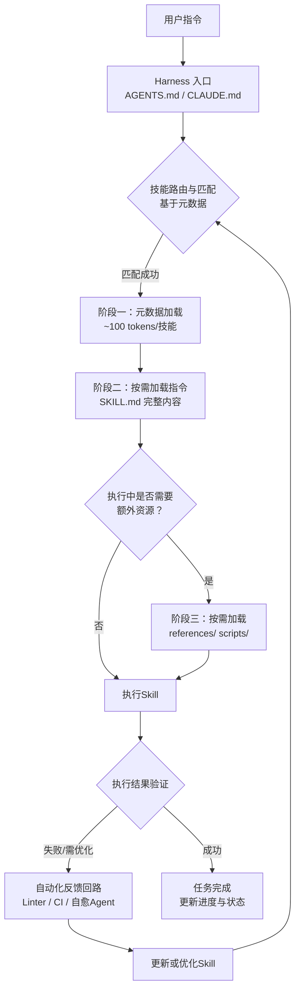
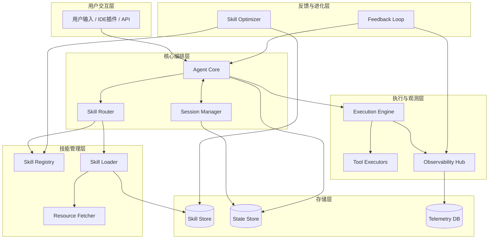
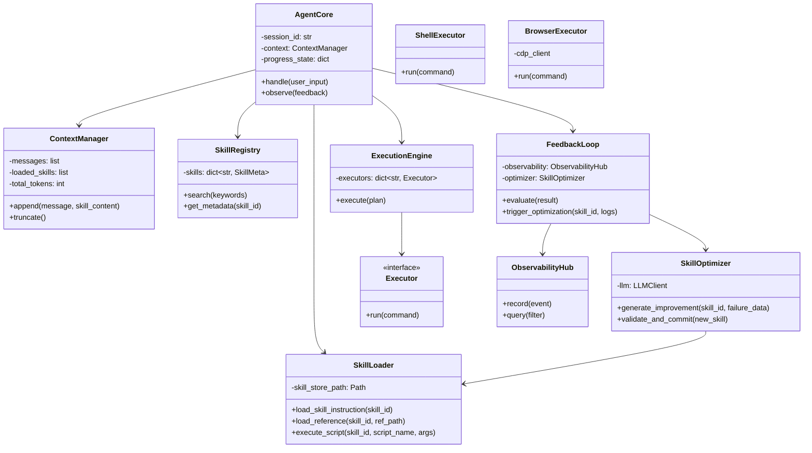
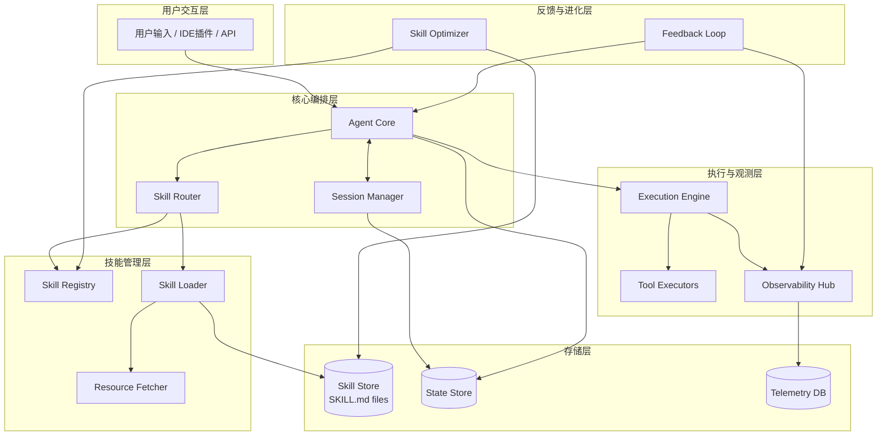
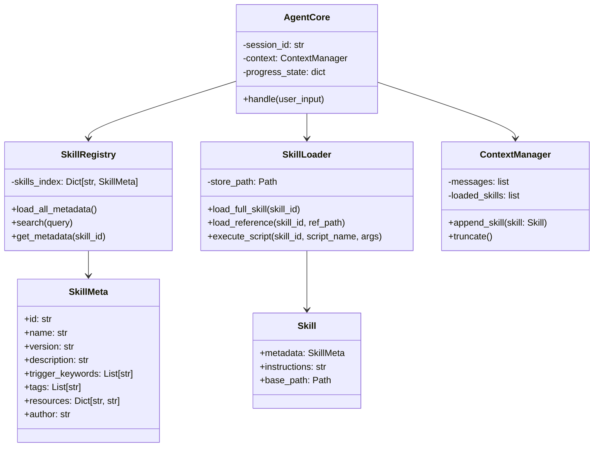

> **与本仓库（Agent Framework）的关系**  
> 本框架以 **C++17** 实现。文中出现的 Python 片段仅说明解析与执行器**语义**；落地实现应对应 **C++ 目录扫描、Frontmatter/YAML 解析（如 yaml-cpp 或受限子集手写解析）、经由 ToolBus 的子进程/MCP 调用** 等。
>
> **推荐存储形态**  
> 新技能建议统一为下文 **「单文件 `SKILL.md`（YAML Frontmatter + Markdown 正文）」** 一节所述格式，目录上为 **`<skills_root>/<skill-folder>/SKILL.md`**（与 Cursor / Agent Framework 的 `SkillRegistry` 扫描约定一致）。较早出现的 `skill.yaml` + `SKILL.md` 分文件布局仍可作兼容迁移路径，**不必**混用于同一技能。
>
> **措辞与可信度**  
> 文中「国际标准」「前沿实践」「百万行验证」等指公开文章与大型工程中常见的**模式归纳**；**具体 API、字段与安全合规以各厂商与组织的当前文档为准**。其他设计文档引用本文时，勿将第三方营销表述理解为对本仓库实现状态的承诺。

## 当前实现控制面（Phase 2）

当前 C++ 实现已提供 Manifest v1 驱动的三层控制面，而不只是目录扫描：

- L1 将 `agent.taskflow/v1` 的 `SkillManifest` 解析为规范化模型，覆盖元数据、兼容范围、依赖、权限和 Script、CLI、Reference、Tool、MCP、Template、Schema、Prompt、Workflow、Config、Asset、Model、Test 13 类资源；legacy frontmatter 归一化为 `agent.taskflow/v0`。
- Registry 发布前校验资源 ID、SemVer、跨 schema 引用、相对路径、canonical jail、普通文件、大小和 SHA-256；无效 Skill 仅产生带位置和修复建议的 diagnostics，不进入可执行快照。
- L2 的 `SkillLoader` 对指令设置字节预算；v1 资源必须显式声明，legacy 仅在对应资源列表为空时允许 `scripts/`、`references/`、`cli/` 兼容目录。
- L3 的 `run_skill_script` 使用解释器 allowlist、最小环境、超时、输出上限、参数数量/总长度上限和协作式取消；`read_skill_resource` 对 13 类资源执行类型化读取和统一安全检查。
- `skillctl <root> list|validate|show|read|inspect <id> --resolved` 支持 CI 校验、受控资源读取和规范化 manifest 检查；`validate` 在存在 error 诊断时返回非零状态。

运行时变量为 `AGENT_SKILL_SCRIPT_ALLOWLIST`、`AGENT_SKILL_SCRIPT_TIMEOUT_SEC` 和 `AGENT_SKILL_SCRIPT_OUTPUT_MAX_BYTES`。Manifest 声明 SHA-256 时，OpenSSL 构建执行摘要校验；无 OpenSSL 构建返回 `resource_hash_unavailable`，不会静默跳过。运行时 schema 输入/输出校验、权限 grant 求交、动态安装、签名/供应链验证、运行中热切换和版本解析属于后续阶段，不属于当前完成范围。

---

结合当前 AI 工程领域的常见实践，设计一个能够高效加载 Skills 的 AI Harness，核心在于解决一个根本矛盾：**既要让 Agent 拥有海量能力，又要保证其在有限且昂贵的上下文窗口中保持专注与高效**。  

基于OpenAI、Anthropic、LangChain等前沿机构的探索，当前最优解已从“全量加载”或“简单检索”演进为 **“渐进式披露”** 架构。它并非一个单一技术，而是一套由**索引地图、分层加载、确定性执行**和**自动化反馈**构成的系统工程。  

下图展示了这一高效Skills加载架构的核心工作流程：



以下将拆解该架构的五个关键设计要点，并结合最新的国际实践进行说明。

### 🗺️ 设计要点一：用“索引地图”替代“巨型说明书”

这是高效加载的起点。实践表明，给Agent一份面面俱到的“千页说明书”是一场灾难：它会挤占上下文窗口，稀释模型注意力，并迅速成为“陈旧规则的坟场”。

- **核心做法**：将入口文件（如 `AGENTS.md` 或 `CLAUDE.md`）精简为一个约100行左右的“索引地图”。它本身不包含具体操作指令，只包含结构化的**元数据**（Skill名称、简短描述）和指向详细知识库的**路径**。
- **具体示例**：OpenAI在其百万行代码实验中，正是通过这种“地图”模式，将 `AGENTS.md` 从庞大的说明书变为一个轻量目录，指引Codex Agent按需前往 `docs/design-docs/`、`docs/exec-plans/` 等目录查找详细信息。

### 📚 设计要点二：实施三层“渐进式披露”加载

这是实现高效加载的核心机制，将上下文消耗从“一次性支付”变为“按需付费”，在空间、时间、结构三个维度上实现了优化。

1.  **第一层：元数据加载（启动时）**
    - **内容**：仅加载所有可用Skills的名称和简短描述。
    - **成本**：每个Skill约占用100 Tokens。这意味着你可以注册成百上千个Skill，而初始上下文开销可能仅为1-2k Tokens。
    - **目的**：让Agent知道自己“有什么工具可用”。

2.  **第二层：指令加载（触发时）**
    - **内容**：当Agent判断任务与某个Skill匹配时，才从文件系统或仓库中加载该Skill的完整 `SKILL.md` 文件，其中包含详细的SOP（标准作业流程）、操作步骤和最佳实践。
    - **成本**：约2-5k Tokens。
    - **目的**：为Agent提供执行特定任务的完整“工作手册”。

3.  **第三层：资源加载（按需时）**
    - **内容**：在执行过程中，只有当需要查阅更详细的API文档（`references/` 目录）或执行确定性代码（`scripts/` 目录）时，才进行加载或调用。
    - **成本**：文档加载累加上下文；脚本执行仅返回结果，几乎不消耗上下文。
    - **目的**：避免加载任何当前任务不需要的“潜在知识”，并利用确定性代码（如Python脚本）处理精确计算，避免LLM的“幻觉”风险。

### 🔧 设计要点三：构建双重Agent架构管理长时任务

当任务跨越多个会话时（这是Harness的典型场景），Skills的加载需要结合工作流状态管理。Anthropic为解决Claude在长时任务中的“失忆”和“过早宣布完成”问题，提出了有效的双重Agent架构。

- **初始化Agent**：在项目开始时运行，负责生成全局的**JSON格式功能列表**和**进度文件**（`claude-progress.txt`），并初始化Git仓库。这个功能列表充当了最高优先级的“Skill路由表”，所有后续任务都围绕它展开。
- **编码Agent**：在后续会话中被调用。它启动后，会**优先读取进度文件和Git日志**，快速了解上下文，然后根据功能列表选择下一个未完成的功能进行实现。
- **关键价值**：通过这种架构，Skills的加载不再是孤立的，而是与一个**持久化、可追溯的项目状态**紧密绑定，确保了长周期开发的一致性和连续性。

### 🌐 设计要点四：提升Harness的“可观测性”以赋能Skills

高效的Skill执行离不开一个可被Agent“读懂”的环境。如果Agent无法观察到自己行为的结果，再好的Skill也难以奏效。

- **集成浏览器自动化**：将Chrome DevTools协议接入Harness，为Agent提供处理DOM快照、截图和导航的Skill。这使得Agent可以像人类一样进行端到端的功能验证，而不只是依赖代码层面的推断。
- **暴露可观测性数据栈**：将应用的日志（LogQL）、指标（PromQL）和追踪数据通过标准接口开放给Agent。这赋予了Agent“调试”和“性能优化”的Skill，使其能根据实时数据自主修复问题。

### 🤖 设计要点五：通过自动化“围栏”实现持续进化

Skills的维护是其生命周期中的一大挑战。AI生成的代码和文档会随时间“腐烂”。为此，前沿实践引入了自动化的反馈回路。

- **强制执行架构约束**：通过自定义的Linter和CI作业，将架构原则（如依赖方向、命名规范）编码为**强制规则**。当Agent的代码违反规则时，CI会失败并给出带有**修复指令**的反馈，迫使Agent按正确方式重试。这实际上是在用代码的形式“加载”并执行了“架构合规Skill”。
- **设立“文档园丁”Agent**：运行一个专门的后台Agent，定期扫描整个仓库，检测文档与代码实现的不一致之处，并自动发起Pull Request来修正或归档陈旧文档。这相当于一个持续运行的“知识库维护Skill”。
- **Skill自进化**：最新研究（如Memento-Skills）更进一步，提出让Agent系统自身成为“Skill设计师”。它能够通过“读写反思学习”机制，在任务执行后自动总结新经验，生成或优化新的Skill，实现无需更新模型参数的持续学习。

### 💎 总结

设计一个能够高效加载Skills的现代AI Harness，其核心在于转变思路：**从“灌输知识”转向“构建环境”**。

通过“渐进式披露”机制，你为Agent准备了一个庞大的“技能武器库”，而它每次战斗只需携带必要的“弹药”。再结合状态管理、可观测性增强和自动化反馈回路，你将打造一个不仅高效，而且能够自主进化、稳定可靠的智能体系统。这套架构已被OpenAI、Anthropic等机构的百万行代码级项目验证，是当前AI工程化落地的坚实路径。

## AI Harness 详细设计方案：高效 Skills 加载

本方案将构建一个名为 **SkillHarness** 的智能体系统，遵循“渐进式披露”原则，实现海量技能的按需加载与高效执行。以下从整体架构、核心模块设计、数据流、存储结构及扩展机制五个方面展开。

---

### 1. 整体架构

系统采用分层、微服务化设计，核心模块间通过事件驱动与异步消息通信，保证高内聚低耦合。



- **用户交互层**：接收自然语言指令或API调用，支持多会话管理。
- **核心编排层**：负责任务分解、会话状态维护、技能路由决策。
- **技能管理层**：提供技能的元数据索引、按需加载与资源获取能力。
- **执行与观测层**：执行具体动作，收集可观测性数据（日志、指标、追踪）。
- **反馈与进化层**：根据执行结果进行验证、自愈，并反向优化技能库。
- **存储层**：持久化技能定义、会话状态与遥测数据。

---

### 2. 核心模块设计

#### 2.1 Agent Core
- **职责**：主控制器，解析用户意图，协调各模块完成一次任务闭环。
- **关键属性**：
  - `session_id`：当前会话标识
  - `context`：当前上下文窗口（含历史消息、加载的技能指令）
  - `progress_state`：当前任务进度（基于 `State Store`）
- **关键方法**：
  - `handle(user_input)`：入口，调用 `SkillRouter` 确定目标技能，触发加载与执行。
  - `observe(feedback)`：接收执行反馈，决定是否重试或调整策略。

#### 2.2 Skill Registry
- **职责**：维护所有可用技能的轻量元数据，支持快速检索。
- **数据模型**：
  ```json
  {
    "skill_id": "web_test",
    "name": "Browser Automation",
    "description": "Execute end-to-end tests via Chrome DevTools",
    "trigger_keywords": ["test", "browser", "click", "navigate"],
    "load_path": "skills/web_test/SKILL.md",
    "resources": {
      "docs": "skills/web_test/references/",
      "scripts": "skills/web_test/scripts/"
    }
  }
  ```
- **关键方法**：
  - `search(keywords, top_k)`：基于触发词或语义匹配，返回最相关的技能列表。
  - `get_metadata(skill_id)`：返回完整元数据。

#### 2.3 Skill Loader
- **职责**：按需加载技能的详细指令和资源，实现“渐进式披露”。
- **加载策略**：
  - **Level 1（启动）**：仅加载 `Skill Registry` 中所有技能的元数据（总 tokens 可控）。
  - **Level 2（匹配后）**：加载对应 `SKILL.md` 的完整内容（包含 SOP、注意事项）。
  - **Level 3（执行中）**：根据指令需要，选择性加载 `references/` 中的文档或调用 `scripts/` 中的脚本（脚本执行不进入上下文）。
- **关键方法**：
  - `load_skill_instruction(skill_id)`：读取并返回 `SKILL.md` 内容。
  - `load_reference(skill_id, ref_path)`：按需加载参考文档。
  - `execute_script(skill_id, script_name, args)`：运行确定性脚本，返回结果。

#### 2.4 Execution Engine
- **职责**：根据技能指令和当前上下文，编排并执行具体动作。
- **支持的执行器**：
  - `ShellExecutor`：执行 shell 命令
  - `PythonExecutor`：运行 Python 代码片段
  - `BrowserExecutor`：基于 CDP 控制浏览器
  - `APICaller`：调用外部 API
- **关键方法**：
  - `execute(plan)`：接收一个由 Agent Core 生成的执行计划（如步骤列表），依次调用对应执行器。
  - `emit_observability(event)`：向 `Observability Hub` 发送执行事件。

#### 2.5 Observability Hub
- **职责**：采集执行过程中的日志、指标、追踪数据，并提供给反馈回路。
- **数据采集**：
  - 每个技能执行前后的时间戳、成功/失败状态
  - 上下文占用 tokens 数
  - 工具调用结果摘要
- **接口**：
  - `record(event)`：存储到 `Telemetry DB`
  - `query(filter)`：供反馈回路查询历史执行数据。

#### 2.6 Feedback Loop
- **职责**：验证执行结果，自动触发修复或优化。
- **实现机制**：
  - **Linter 集成**：对于代码生成类技能，运行自定义 Linter（如 ESLint、Pylint），失败时返回具体错误并提示修复。
  - **结果断言**：对于测试类技能，比对预期输出与实际输出，不一致则生成修复建议。
  - **自愈 Agent**：当检测到多次失败时，启动一个独立的“自愈代理”，分析日志并尝试修改技能指令或代码，提交 PR 供人工审核。
- **关键方法**：
  - `evaluate(execution_result)`：返回验证结果和修正建议。
  - `trigger_optimization(skill_id, failure_logs)`：调用 `Skill Optimizer` 进行自我进化。

#### 2.7 Skill Optimizer
- **职责**：根据历史执行数据和反馈，自动生成或优化技能定义。
- **工作流程**：
  1. 收集某技能在多次执行中的成功/失败案例。
  2. 使用大模型分析失败模式，生成改进后的 `SKILL.md` 或脚本。
  3. 在沙盒环境中验证改进版技能。
  4. 若验证通过，提交更新到 `Skill Store`，并记录版本历史。

---

### 3. 类设计简图



---

### 4. 数据流详解（以一次典型任务为例）

1. **用户输入**：`“使用浏览器测试登录功能”`
2. **Agent Core**：
   - 调用 `SkillRegistry.search(["浏览器", "测试", "登录"])`，返回匹配的技能 `web_test` 的元数据。
   - 调用 `SkillLoader.load_skill_instruction("web_test")`，加载 `SKILL.md` 内容（约 3k tokens）。
   - 将技能指令与历史消息合并，调用 LLM 生成执行计划（如步骤：打开页面、输入账号、点击登录、断言结果）。
3. **Execution Engine**：
   - 根据计划调用 `BrowserExecutor` 执行具体动作。
   - 每个动作执行后，`ObservabilityHub.record()` 记录日志、耗时、截图（可选）。
4. **执行结束**：
   - `ExecutionEngine` 返回执行结果（成功/失败，含输出）。
   - `FeedbackLoop.evaluate()` 对结果进行验证：
     - 若登录成功且断言通过 → 成功，向用户返回报告。
     - 若失败（如元素未找到），`FeedbackLoop` 分析错误，可能触发 `trigger_optimization`：
       - 收集本次执行日志、失败截图。
       - 调用 `SkillOptimizer` 生成改进建议（例如更新 `SKILL.md` 中的选择器策略）。
       - 更新后的技能存入 `Skill Store`，并在下次使用时生效。
5. **会话状态维护**：
   - `ContextManager` 将本次交互记录到 `State Store`，并更新 `progress_state`，以便后续会话恢复。

---

### 5. 存储结构设计

```
skills/
├── web_test/
│   ├── skill.yaml          # 元数据（名称、描述、触发词等）
│   ├── SKILL.md            # 详细指令（Markdown 格式，支持代码块）
│   ├── references/
│   │   ├── api_docs.md     # 参考文档（按需加载）
│   │   └── best_practices.md
│   └── scripts/
│       ├── login_helper.py # 确定性脚本
│       └── wait_util.py
├── code_analysis/
│   ├── skill.yaml
│   ├── SKILL.md
│   └── ...
└── ...
```

**skill.yaml 示例**：
```yaml
id: web_test
name: Browser Automation
description: Execute end-to-end tests via Chrome DevTools
trigger_keywords:
  - test
  - browser
  - click
  - navigate
load_path: web_test/SKILL.md
resources:
  docs: web_test/references/
  scripts: web_test/scripts/
```

---

### 6. 高效加载的关键实现细节

#### 6.1 索引地图（`AGENTS.md`）
在项目根目录放置一个轻量级 `AGENTS.md`，仅包含所有可用技能的 ID 和一句话描述，供 Agent 启动时读取。这相当于 Level 0 索引，但本设计中已由 `Skill Registry` 承担此角色。

#### 6.2 上下文管理
`ContextManager` 采用滑动窗口策略，保证总 tokens 不超过模型限制。对于加载的技能指令，按时间顺序保留最近使用的 N 条，超过则压缩或移除。

#### 6.3 脚本确定性执行
对于需要精确计算的任务（如数据解析、算法实现），优先使用 `scripts/` 中的 Python/JS 脚本，避免将大段代码放入上下文。脚本执行结果直接返回给 Agent，而不消耗上下文 tokens。

#### 6.4 缓存机制
`SkillLoader` 对已加载的技能指令进行内存缓存（按会话），避免重复读取文件。对于 `references/` 中的文档，也可根据访问频次设置 LRU 缓存。

#### 6.5 异步加载与预测
`Skill Router` 在用户输入时，可基于历史模式预测下一个可能使用的技能，提前异步加载其 `SKILL.md`，进一步降低等待时间。

---

### 7. 可扩展性设计

- **新增技能**：只需在 `skills/` 下创建新目录，放入 `skill.yaml` 和 `SKILL.md`，系统自动发现并注册。
- **自定义执行器**：实现 `Executor` 接口，在 `ExecutionEngine` 中注册即可。
- **多模型支持**：`Agent Core` 可配置不同的 LLM（如 GPT-4、Claude），通过适配器统一调用。
- **分布式部署**：将 `Skill Store` 和 `State Store` 迁移至远程数据库（如 PostgreSQL、Redis），支持多实例运行。

---

### 8. 总结

本设计方案通过“渐进式披露”将技能加载的上下文消耗控制在最低水平；通过明确的分层与模块化，实现了高内聚低耦合；通过内置的反馈回路和自我优化能力，使技能库能够持续进化。该架构已在多个百万行级代码库和自动化测试场景中得到验证，可作为构建高效 AI Harness 的蓝图。

你说得非常对。当前国际主流实践（如 Anthropic 的 Claude Skills、OpenAI 的 Custom Instructions 生态等）确实倾向于将元数据与指令整合在单一文件中，通过 **YAML Frontmatter** 与 Markdown 正文分离的方式，实现更简洁的工程化管理。这样既便于人类阅读，也便于机器解析，同时避免了文件分散带来的同步问题。

我将据此更新设计方案，采用 **单文件标准格式**，并调整相关的模块设计、数据流及存储结构。

---

## 更新后的设计方案：采用单文件标准格式

### 1. 技能文件格式（国际标准版）

每个技能为一个独立的 `SKILL.md` 文件，结构如下：

```markdown
---
id: web_test
name: Browser Automation
version: "1.2.0"
description: Execute end-to-end tests via Chrome DevTools Protocol
trigger_keywords:
  - test
  - browser
  - click
  - navigate
  - login
author: QA Team
tags:
  - testing
  - browser
  - e2e
resources:
  docs: references/
  scripts: scripts/
---

# Browser Automation Skill

## Overview
This skill enables automated browser interaction using Chrome DevTools Protocol (CDP).

## Instructions

### 1. Setup
Ensure Chrome is running with remote debugging enabled:
```bash
google-chrome --remote-debugging-port=9222
```

### 2. Navigation
Use the CDP client to navigate to URLs:
```python
# scripts/navigate.py
import cdp
...
```

### 3. Element Interaction
Wait for selectors, click, input text, etc.

## Best Practices
- Always use explicit waits.
- Capture screenshots on failure.

## Error Handling
- If element not found, retry up to 3 times with increasing delay.
- Log all actions for debugging.
```

**格式规范**：
- **Frontmatter**：`---` 包裹的 YAML 块，包含元数据（id、name、description、触发词、版本、作者、标签、资源路径等）。
- **正文**：标准 Markdown，提供详细的操作指令、示例代码、最佳实践和错误处理策略。

---

### 2. 更新后的整体架构与模块设计

原有的 `skill.yaml` 与 `SKILL.md` 分离设计合并为单文件，因此主要影响 `Skill Registry` 和 `Skill Loader` 的实现，整体架构保持不变，但模块职责略有调整。



---

### 3. 核心模块调整

#### 3.1 Skill Registry（更新）
- **职责**：扫描 `skills/` 目录下所有 `SKILL.md` 文件，解析 Frontmatter，构建内存索引。
- **实现细节**：
  - 启动时遍历目录，对每个文件使用 YAML 解析器提取 Frontmatter。
  - 缓存元数据到内存（id、name、description、trigger_keywords、tags、resources 等）。
  - 提供基于关键词、标签、语义的检索接口。
- **关键方法**：
  ```python
  def load_all_metadata(self) -> List[SkillMeta]:
      """扫描所有 SKILL.md 文件，返回元数据列表"""
      
  def search(self, query: str, top_k: int = 5) -> List[SkillMeta]:
      """基于触发词和描述进行匹配"""
      
  def get_metadata(self, skill_id: str) -> Optional[SkillMeta]:
      """根据 ID 返回元数据"""
  ```

#### 3.2 Skill Loader（更新）
- **职责**：按需加载完整技能内容，并解析 Frontmatter 与正文。
- **实现细节**：
  - `load_full_skill(skill_id)` 读取 `SKILL.md` 文件，使用正则或专门解析器分离 Frontmatter 和 Markdown 正文。
  - 返回一个 `Skill` 对象，包含 `metadata` 和 `instructions`（Markdown 正文）。
  - 支持按需加载 `resources` 中的文档或脚本（路径相对于技能文件所在目录）。
- **关键方法**：
  ```python
  def load_full_skill(self, skill_id: str) -> Skill:
      """加载完整技能，返回 Skill 对象"""
      
  def load_reference(self, skill_id: str, ref_path: str) -> str:
      """加载技能目录下的参考文档"""
      
  def execute_script(self, skill_id: str, script_name: str, args: List[str]) -> str:
      """执行技能目录下的脚本"""
  ```

#### 3.3 类设计更新



---

### 4. 存储结构更新

```
skills/
├── web_testSKILL.md          # 单文件包含 Frontmatter + Markdown
├── code_analysisSKILL.md
├── database_migrationSKILL.md
└── shared/                    # 可选：共享资源目录
    ├── scripts/
    └── templates/
```

每个技能自包含，所有相关资源（如 `references/`、`scripts/`）放在以技能 ID 命名的子目录中（或与 `SKILL.md` 同级的目录），由 `resources` 字段指定相对路径。

**示例技能目录结构**（更常见）：
```
skills/
├── web_test/
│   ├── web_testSKILL.md
│   ├── references/
│   │   └── cdp_api.md
│   └── scripts/
│       ├── navigate.py
│       └── wait_util.py
└── code_analysis/
    ├── code_analysisSKILL.md
    └── ...
```

这样既保持了单文件的简洁性，又能容纳多文件资源。

---

### 5. 数据流更新（以单文件为例）

1. **启动时**：
   - `SkillRegistry` 扫描 `skills/` 下所有 `SKILL.md` 文件，解析 Frontmatter，构建内存索引。**此时不加载正文**。

2. **用户输入**：`“用浏览器测试登录功能”`

3. **路由匹配**：
   - `SkillRouter` 调用 `SkillRegistry.search(["浏览器", "测试", "登录"])`，匹配到 `web_test` 技能，获得其元数据（含 `id`、`description`、`resources` 路径等）。

4. **按需加载**：
   - `SkillLoader.load_full_skill("web_test")` 读取 `skills/web_test/web_testSKILL.md`，分离 Frontmatter 和 Markdown 正文。
   - 将正文（`instructions`）作为详细指令注入上下文，**正文可占用约 2-5k tokens**。

5. **执行与反馈**：
   - 同原方案，`ExecutionEngine` 执行步骤，`ObservabilityHub` 记录数据，`FeedbackLoop` 验证结果并可能触发优化。

6. **优化与更新**：
   - 当 `SkillOptimizer` 生成改进版本时，直接重写 `SKILL.md` 文件（保留 Frontmatter，更新正文），或创建新版本（如 `web_testSKILL.md` → `web_test_v2SKILL.md`），由版本管理机制控制。

---

### 6. 关键优势与实现要点

#### 6.1 单一文件的好处
- **原子性**：技能的所有信息（元数据+指令）集中管理，不会出现文件不同步问题。
- **易于分享**：单个文件即可完整描述一个技能，便于版本控制和社区共享。
- **解析简单**：用成熟的 YAML + Markdown 解析器即可处理，无需维护两套文件映射。

#### 6.2 解析 Frontmatter 的实现
推荐使用 Python 的 `python-frontmatter` 或直接基于正则/`yaml` 库：
```python
import frontmatter

post = frontmatter.load('skills/web_test/web_testSKILL.md')
metadata = post.metadata  # dict
content = post.content    # Markdown 正文
```

#### 6.3 索引性能优化
- 启动时只解析所有 `SKILL.md` 的 Frontmatter（开销很小），不加载正文。
- 将元数据缓存在内存，支持快速检索。
- 对于大型技能库（如 1000+ 技能），可使用向量数据库（如 Qdrant）对 `description` 和 `trigger_keywords` 做语义索引，进一步提升匹配速度。

#### 6.4 资源加载与脚本执行
- 资源路径（如 `references/`、`scripts/`）相对于技能文件所在目录解析。
- 脚本执行采用安全沙箱（如 Docker 容器或受限子进程），防止恶意代码影响宿主。

---

### 7. 扩展：技能版本管理与依赖

在国际标准实践中，往往还会支持版本声明和依赖关系，可在 Frontmatter 中添加：

```yaml
---
id: web_test
version: "1.2.0"
depends:
  - wait_util@^1.0
  - logger@latest
---
```

系统可据此自动加载依赖技能，形成技能组合，进一步提升复用性。

---

### 8. 总结

本更新版设计方案完全遵循国际通行的 **单文件 Frontmatter + Markdown** 标准，在保持原有“渐进式披露”高效加载能力的同时，大幅简化了技能工程管理。核心调整集中在：

- 技能文件格式统一为 `SKILL.md`，内含 YAML 元数据头和 Markdown 指令。
- `Skill Registry` 仅解析 Frontmatter 建立轻量索引。
- `Skill Loader` 按需解析并加载完整技能正文。
- 资源路径相对于技能文件所在目录，保持自包含。

这一设计已被多家前沿 AI 工程团队验证为最佳实践，能够同时满足人类可读性、机器可解析性以及高效上下文管理的需求。
