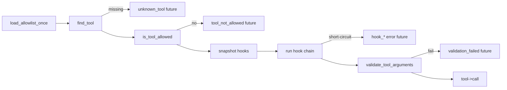

# 工具调用前 Hook（WP2.1d）

本文档说明 `ToolBus::call_tool` 上的**同步、可链式** before-call hook：`Allow` / `Deny` / `Replace`，以及与 **`AGENT_TOOL_ALLOWLIST`**、**WP2.1b 并行** 的组合语义。

**实现参考**：[`types.hpp`](../../include/agent/core/types.hpp)（`ToolHookVerdict`）、[`toolbus.hpp`](../../include/agent/toolbus/toolbus.hpp)（`ToolHookResult`、`ToolCallHook`、API）/ [`toolbus.cpp`](../../src/toolbus/toolbus.cpp)。**详案**：[phase-2-wp1d.md](./phase-2-wp1d.md)。

---

## 调用顺序（Mermaid）



---

## 与 `AGENT_TOOL_ALLOWLIST`（须与 phase-2-wp1d §4.3 一致）

| 阶段 | 行为 |
|------|------|
| 未注册工具 | **不** 调用 hook |
| 不在 allowlist | **不** 调用 hook，直接 `tool_not_allowed` |
| 在 allowlist | **调用** hook；工具名不变，hook **不能** 把未列名工具变为可调用 |
| 注册阶段 | `register_local_tool` / MCP 仍 **先** allowlist；hook **不参与** 注册 |

说明：hook **不得** 修改工具名；别名能力另开工作包。

---

## `ToolHookResult` 字段

| 字段 | 说明 |
|------|------|
| `verdict` | `Allow`：继续链；`Deny`：返回 `hook_denied`；`Replace`：整对象替换 `arguments` 后继续链 |
| `replaced_arguments` | 仅 `Replace` 且须为 **JSON object**；缺失或非 object → `hook_invalid_replace` |
| `deny_message` | `Deny` 时建议使用；空则返回文案为 `"hook denied"` |
| `deny_details` | 并入 `details`（须为 object）；`hook_index` 由 Bus **覆盖写入**（0-based） |

**链规则**：对快照后的 hook 列表按注册顺序调用；`current` 初值为 `arguments` 的拷贝；`Replace` 为**整对象替换**（非 merge）。链结束后对 `current` 做 schema 校验，再 `tool->call(name, current)`。

---

## 错误码（`code` 字段）

| `code` | 含义 |
|--------|------|
| `hook_denied` | Hook 返回 `Deny` |
| `hook_invalid_replace` | `Replace` 但 `replaced_arguments` 缺失或非 object |
| `hook_threw` | Hook 抛异常；默认转为 JSON 错误，**不**终止进程 |

`hook_threw` 的 `details.exception` 为 `e.what()` 的 **UTF-8 安全前缀**，最长 **512 字节**（若截断点落在多字节字符中间，会回退到上一 UTF-8 起始字节）。

可选环境变量 **`AGENT_TOOL_HOOK_THROW_ABORT`**：设为 `1` / `true` / `yes` / `on`（大小写不敏感）时，异常 **不再** 转为 JSON，而是 **重新抛出**，由调用方处理。

---

## 并行与线程安全（WP2.1b）

- `call_tool` 在 **`hooks_mutex_`** 下仅做 **`hooks_` 的 vector 拷贝**，随后在**无锁**下执行各 hook，避免与 `tools_mutex_` 嵌套死锁。
- WP2.1b 下多个 `call_tool` 可并发；每次调用使用**各自快照**，互不共享链执行状态。
- **Hook 实现须线程安全**（不依赖跨调用可变静态状态，或自行同步）。
- **不建议**在 hook 回调内调用 `add_tool_call_hook`、`clear_tool_call_hooks`、`register_local_tool` 等；对当前调用链行为未定义，并发下易竞态。

---

## 示例：路径前缀重写（伪代码）

将某工具的 `path` 限制在 jail 根目录下（逻辑示意，非生产完整实现）：

```cpp
bus.add_tool_call_hook([root](const std::string& name, const json& args) -> ToolHookResult {
    if (name != "fs_read" && name != "fs_write") {
        ToolHookResult ok;
        return ok; // Allow
    }
    if (!args.contains("path") || !args["path"].is_string()) {
        return {}; // Allow，交给 schema
    }
    std::string p = args["path"].get<std::string>();
    if (!p.starts_with(root)) {
        ToolHookResult r;
        r.verdict = ToolHookVerdict::Replace;
        json next = args;
        next["path"] = (std::filesystem::path(root) / p).lexically_normal().string();
        r.replaced_arguments = std::move(next);
        return r;
    }
    return {};
});
```

---

## 单测

- 主套件：`tests/test_tool_call_hooks.cpp`，CTest：`tool_call_hooks_wp21d`（`AGENT_TOOL_ALLOWLIST=`）。
- allowlist 短路：`tool_call_hooks_wp21d_h5`（`test_tool_call_hooks --h5`）；进程内最先设置 `AGENT_TOOL_ALLOWLIST=ok_only`，并用测试同伴注入表项以命中 `tool_not_allowed`（生产路径下注册规则通常不会出现「已注册但不在名单」，`tool_not_allowed` 仍为 **防御性** 分支）。

---

**文档版本**：0.1
**日期**：2026-04-05
