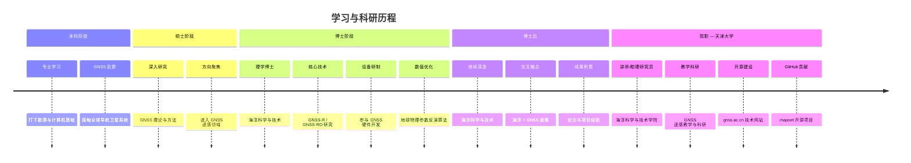

# 付乃锋 — 学习历程

---

## 关键节点

| 阶段 | 时间 | 核心内容 |
|------|------|----------|
| **本科** | ~ | 数理基础、GNSS 入门 |
| **硕士** | ~ | GNSS 理论与方法、遥感方向 |
| **博士** | ~ | 海洋科学与技术、GNSS-R/RO、数值优化 |
| **博士后** | ~ | 海洋科学与技术交叉研究 |
| **现职** | 至今 | 天津大学海洋学院讲师、GNSS 教学科研 |

> ⚠️ 说明：具体年份信息暂缺，你可根据实际情况补充各阶段时间节点。
