# 基于 Taskflow workflow 的高性能多模态智能代理框架设计与实现

---

## 目录

- [一、背景与动机](#一背景与动机)
  - [1.1 项目背景：Taskflow 与 workflow 库](#11-项目背景taskflow-与-workflow-库)
  - [1.2 智能代理系统的技术趋势](#12-智能代理系统的技术趋势)
  - [1.3 基于 Taskflow workflow 的解决方案优势](#13-基于-taskflow-workflow-的解决方案优势)
  - [1.4 本报告的目标与结构](#14-本报告的目标与结构)
  - [1.5 框架核心设计理念](#15-框架核心设计理念)

- [二、LLM 代理与多模态框架综述](#二llm-代理与多模态框架综述)
  - [2.1 LLM 代理系统组成](#21-llm-代理系统组成)
  - [2.2 代理工作流与设计模式](#22-代理工作流与设计模式)
  - [2.3 多模态大模型与融合策略](#23-多模态大模型与融合策略)
  - [2.4 实时流式输出](#24-实时流式输出)
  - [2.5 检索增强生成与多模态 RAG](#25-检索增强生成与多模态-rag)

- [三、Taskflow 与 workflow 库综述](#三taskflow-与-workflow-库综述)
  - [3.1 Taskflow 基本特性](#31-taskflow-基本特性)
  - [3.2 workflow 库特性](#32-workflow-库特性)

- [四、整体设计与技术框架](#四整体设计与技术框架)
  - [4.1 核心设计原则](#41-核心设计原则)
  - [4.2 核心模块架构](#42-核心模块架构)
  - [4.3 核心节点类型与职责](#43-核心节点类型与职责)
    - [4.3.1 Source 节点（数据源）](#431-source-节点数据源)
    - [4.3.2 Process 节点（处理节点）](#432-process-节点处理节点)
    - [4.3.3 Control 节点（控制流节点）](#433-control-节点控制流节点)
    - [4.3.4 Sink 节点（输出节点）](#434-sink-节点输出节点)
  - [4.4 Agent 与工作流的嵌套设计](#44-agent-与工作流的嵌套设计)
    - [4.4.1 Agent 作为节点](#441-agent-作为节点)
    - [4.4.2 工作流作为节点](#442-工作流作为节点)
    - [4.4.3 Agent 与工作流的嵌套组合](#443-agent-与工作流的嵌套组合)
  - [4.5 技术框架分层架构](#45-技术框架分层架构)
  - [4.6 节点生命周期与状态管理](#46-节点生命周期与状态管理)
  - [4.7 关键技术路线图](#47-关键技术路线图)

- [五、LLM 节点设计与实现](#五llm-节点设计与实现)
  - [5.1 LLM 节点功能需求](#51-llm-节点功能需求)
  - [5.2 LLM 节点数据结构](#52-llm-节点数据结构)
  - [5.3 LLM 节点实现（基于 workflow API）](#53-llm-节点实现基于-workflow-api)
  - [5.4 知识库 Source 节点设计](#54-知识库-source-节点设计)
  - [5.5 LLM 客户端实现示例](#55-llm-客户端实现示例)

- [六、多模态支持与融合实现](#六多模态支持与融合实现)
  - [6.1 模态编码与向量化实现](#61-模态编码与向量化实现)
    - [6.1.1 文本编码器节点实现](#611-文本编码器节点实现)
    - [6.1.2 图像编码器节点实现](#612-图像编码器节点实现)
    - [6.1.3 音频编码器节点实现](#613-音频编码器节点实现)
    - [6.1.4 向量数据库存储节点](#614-向量数据库存储节点)
  - [6.2 多模态检索与融合流程实现](#62-多模态检索与融合流程实现)
    - [6.2.1 查询编码节点实现](#621-查询编码节点实现)
    - [6.2.2 向量检索节点实现（基于 KnowledgeBase Source）](#622-向量检索节点实现基于-knowledgebase-source)
    - [6.2.3 跨模态注意力融合节点实现](#623-跨模态注意力融合节点实现)
    - [6.2.4 融合策略实现](#624-融合策略实现)
  - [6.3 融合策略与算法实现](#63-融合策略与算法实现)

- [七、实时输出与流式传输实现](#七实时输出与流式传输实现)
  - [7.1 SSE 和 WebSocket 技术选型](#71-sse-和-websocket-技术选型)
  - [7.2 流式输出架构设计](#72-流式输出架构设计)
    - [7.2.1 流式输出回调机制实现](#721-流式输出回调机制实现)
    - [7.2.2 SSE 服务器实现](#722-sse-服务器实现)
    - [7.2.3 WebSocket 服务器实现](#723-websocket-服务器实现)
    - [7.2.4 中断与控制机制](#724-中断与控制机制)

- [八、基于 workflow 构建代理工作流](#八基于-workflow-构建代理工作流)
  - [8.1 总体架构](#81-总体架构)
  - [8.2 循环子图实现（基于 workflow API）](#82-循环子图实现基于-workflow-api)
    - [8.2.1 完整的循环子图实现](#821-完整的循环子图实现)
    - [8.2.2 循环体执行流程图](#822-循环体执行流程图)
  - [8.3 完整的端到端工作流构建示例](#83-完整的端到端工作流构建示例)
    - [8.3.1 创建源节点（Source Nodes）](#831-创建源节点source-nodes)
    - [8.3.2 创建 LLM 节点](#832-创建-llm-节点)
    - [8.3.3 创建 PlanParser 节点](#833-创建-planparser-节点)
    - [8.3.4 构建代理循环（Agent Loop）](#834-构建代理循环agent-loop)
  - [8.4 回溯和记忆管理](#84-回溯和记忆管理)
  - [8.5 MCP 工具集成与 ToolBus 设计](#85-mcp-工具集成与-toolbus-设计)
    - [8.5.1 ToolBus 架构设计](#851-toolbus-架构设计)
    - [8.5.2 ToolBus 实现示例](#852-toolbus-实现示例)
    - [8.5.3 在 workflow 中使用 ToolBus](#853-在-workflow-中使用-toolbus)
    - [8.5.4 MCP 工具集成流程图](#854-mcp-工具集成流程图)
  - [8.6 终端输出与 UI 集成](#86-终端输出与-ui-集成)
    - [8.6.1 CLI 输出实现](#861-cli-输出实现)
    - [8.6.2 ImGui 输出实现](#862-imgui-输出实现)
    - [8.6.3 Web 输出实现（SSE/WebSocket）](#863-web-输出实现ssewebsocket)

- [九、关键算法与技术实现](#九关键算法与技术实现)
  - [9.1 多线程执行与工作窃取调度](#91-多线程执行与工作窃取调度)
    - [9.1.1 Taskflow 执行器配置](#911-taskflow-执行器配置)
    - [9.1.2 并行执行流程](#912-并行执行流程)
    - [9.1.3 线程安全的共享状态管理](#913-线程安全的共享状态管理)
    - [9.1.4 异步任务与动态任务图](#914-异步任务与动态任务图)
  - [9.2 跨模态检索与融合算法实现](#92-跨模态检索与融合算法实现)
    - [9.2.1 向量化及索引构建实现](#921-向量化及索引构建实现)
    - [9.2.2 查询向量构造与扩充实现](#922-查询向量构造与扩充实现)
    - [9.2.3 交叉模态注意力实现](#923-交叉模态注意力实现)
    - [9.2.4 融合层算法实现](#924-融合层算法实现)
  - [9.3 计划解析与工具调用调度实现](#93-计划解析与工具调用调度实现)
    - [9.3.1 PlanParser 节点详细实现](#931-planparser-节点详细实现)
    - [9.3.2 工具调用调度实现](#932-工具调用调度实现)
  - [9.4 事件溯源与监控实现](#94-事件溯源与监控实现)
    - [9.4.1 事件溯源节点实现](#941-事件溯源节点实现)
    - [9.4.2 性能监控与 TFProf 集成](#942-性能监控与-tfprof-集成)

- [十、系统架构与技术路线](#十系统架构与技术路线)
  - [10.1 系统总体架构](#101-系统总体架构)
    - [10.1.1 分层架构设计](#1011-分层架构设计)
    - [10.1.2 模块依赖关系](#1012-模块依赖关系)
  - [10.2 核心模块详细设计](#102-核心模块详细设计)
    - [10.2.1 LLM 客户端模块](#1021-llm-客户端模块)
    - [10.2.2 ToolBus 模块](#1022-toolbus-模块)
    - [10.2.3 MCP 客户端模块](#1023-mcp-客户端模块)
    - [10.2.4 Memory 模块](#1024-memory-模块)
    - [10.2.5 VectorStore 模块](#1025-vectorstore-模块)
    - [10.2.6 GraphExecutor 模块](#1026-graphexecutor-模块)
    - [10.2.7 UI 适配模块](#1027-ui-适配模块)
  - [10.3 项目目录结构与文件组织](#103-项目目录结构与文件组织)
  - [10.4 技术路线与开发计划](#104-技术路线与开发计划)
    - [10.4.1 开发阶段规划](#1041-开发阶段规划)
    - [10.4.2 技术栈选择](#1042-技术栈选择)
    - [10.4.3 构建系统配置](#1043-构建系统配置)
    - [10.4.4 测试策略](#1044-测试策略)
    - [10.4.5 部署架构](#1045-部署架构)
    - [10.4.6 性能优化策略](#1046-性能优化策略)
  - [10.5 开发工具与环境](#105-开发工具与环境)
  - [10.6 集成与扩展](#106-集成与扩展)

- [十一、未来展望与挑战](#十一未来展望与挑战)
  - [11.1 嵌套 Agent 与工作流组合能力](#111-嵌套-agent-与工作流组合能力)
  - [11.2 多代理协作系统](#112-多代理协作系统)
  - [11.3 分布式任务调度](#113-分布式任务调度)
  - [11.4 强化学习与自主决策](#114-强化学习与自主决策)
  - [11.5 隐私与安全](#115-隐私与安全)
  - [11.6 跨语言和跨领域适应](#116-跨语言和跨领域适应)

- [十二、结论](#十二结论)

---

## 一、背景与动机

### 1.1 项目背景：Taskflow 与 workflow 库

**Taskflow** 是一个高性能、现代化的 C++ 任务并行编程框架，由 Tsung-Wei Huang 等人在 IEEE TPDS 期刊发表【TPDS22】。其核心特点包括：

- **工作窃取调度器（Work-Stealing Scheduler）**：采用高效的线程池和任务队列机制，在多核 CPU 上实现自动负载均衡
- **声明式任务图构建**：支持静态任务图、动态子图（Subflow）、条件分支和循环控制流
- **异构计算支持**：通过 CUDA Flow 支持 CPU-GPU 协同计算
- **Header-Only 设计**：零依赖、易于集成，支持 C++17 及以上标准
- **丰富的并行算法**：提供 `for_each`、`reduce`、`transform`、`sort` 等并行算法，可直接嵌入任务图

**Workflow** 是 Taskflow 项目在 `dev` 分支提供的高级数据流库（`workflow/` 目录），是对 Taskflow 的进一步抽象，专为声明式数据流编程设计：

- **键值驱动 I/O**：所有输入输出通过字符串键访问，替代传统的元组索引，提升代码可读性
- **自动依赖推断**：通过 `input_specs` 声明节点输入，`GraphBuilder` 自动推断并建立依赖关系，无需手动调用 `precede/succeed`
- **类型安全与灵活性并存**：
  - `TypedNode`/`TypedSource`/`TypedSink`：编译期类型检查，零运行时开销
  - `AnyNode`/`AnySource`/`AnySink`：运行时类型擦除，支持异构数据流
- **统一节点接口**：所有节点继承自 `INode`，提供多态访问和查询接口
- **高级控制流节点**：
  - `create_loop_decl`：支持通过 `body_builder_fn` 在每次迭代时动态构建子图
  - `create_condition_decl`、`create_multi_condition_decl`：条件分支节点
  - `create_pipeline_node`：流水线节点
  - `create_for_each`、`create_reduce` 等：并行算法节点封装

**项目优势**：
- **纯 C++ 实现**：无外部运行时依赖，适合高性能场景
- **多线程并行执行**：充分利用多核 CPU，自动负载均衡
- **声明式 API**：代码简洁，易于维护和扩展
- **可视化支持**：内置 DOT 图导出和 TFProf 性能分析工具

### 1.2 智能代理系统的技术趋势

随着大型语言模型（Large Language Model，LLM）的快速发展，人工智能应用从静态对话助手逐步过渡到具备自主规划、决策和执行能力的代理系统。新一代代理不仅能理解自然语言，还能够调用外部工具、检索知识库、处理多模态输入，并实时输出推理过程【437883083434672†L65-L79】。

**关键技术创新**：

1. **实时流式输出**：OpenAI 在 2025 年推出的实时 API 可以以 200 至 300 毫秒的延迟持续输出语音和文本，并支持函数调用、WebRTC / WebSocket 传输等特性【621311804125779†L140-L166】。用户体验不再局限于等待完整结果，而是需要看到模型逐字生成的内容，甚至在音频输入时实时打断并修改指令【621311804125779†L174-L214】【621311804125779†L245-L258】。

2. **多模态大模型突破**：多模态大模型在 2024-2025 年取得显著突破，能够同时理解文本、图像、音频、视频等信息。多模态模型通过共享架构将不同模态编码为统一的语义嵌入，使系统能够跨模态推理和生成【927160657251235†L169-L226】。例如 GPT-4V 可同时处理视觉和文本输入，并通过自回归方式生成文字解释，而 Sora 则采用扩散模型以文本生成视频【918647955484138†L115-L127】。

3. **多模态 RAG（检索增强生成）**：传统 RAG 系统只能处理文本，难以应对图片、音频等多模态知识的检索与整合。多模态 RAG 通过向量数据库保存文本、图像、音频的嵌入，并在检索后利用融合层将不同模态的信息整合到统一上下文，以支持面向复杂场景的解答【253686691880274†L242-L306】。针对客服场景，当用户提供照片、语音描述和错误截图时，多模态 RAG 能够同时检索这些信息并生成精准回复【253686691880274†L242-L261】。

4. **MCP（Model Context Protocol）工具集成**：MCP 是开放标准，允许 LLM 应用与外部工具和服务集成，实现统一的工具调用接口。支持本地函数、MCP 服务和外部 API 的统一管理。

### 1.3 基于 Taskflow workflow 的解决方案优势

构建具有上述能力的高性能代理框架需要解决多方面挑战：

1. **高并发调度与实时反馈**：代理往往需要并行调用多个工具和检索服务，合理安排依赖和控制流以减少等待时间，并通过流式协议实时向用户展示思考和结果【825014821319660†L64-L109】【723136666980538†L480-L599】。

2. **多模态融合**：为文本、图片、音频等不同数据设计统一的处理与融合机制，从编码、检索、注意力融合到生成全过程都要考虑模态差异【219518602455228†L164-L170】【803420306546639†L86-L90】。

3. **灵活的控制流和循环**：代理执行过程中可能需要多轮规划和工具调用，需要支持条件分支、循环迭代以及动态子图创建等功能【631946224216190†L1225-L1336】。

4. **可观察性与可维护性**：代理的行为和历史应被完整记录，支持回溯和重放；系统要具有清晰的模块边界、易于调试和扩展【269917138825994†L76-L123】。

**Taskflow workflow 的适配性**：

- **声明式构图降低复杂度**：`workflow` 的键值驱动 I/O 和自动依赖推断，使得复杂代理工作流的构建变得直观简洁。开发者只需声明节点输入输出关系，无需手动管理连接。

- **高性能并行执行**：Taskflow 的工作窃取调度器自动在多核 CPU 上并行执行工具调用、知识检索等任务，充分利用硬件资源。

- **动态子图支持 Agent 循环**：`create_loop_decl` 的 `body_builder_fn` 允许在每次迭代时动态构建子图，完美适配 Agent 的"规划-执行-观察-反思"循环模式。

- **模块化与可组合性**：Agent 和工作流都可以作为独立节点嵌入到更大的工作流中，支持多层嵌套和组合，实现复杂的多代理协作场景。

- **类型安全与灵活性**：`TypedNode` 提供编译期类型检查，`AnyNode` 支持运行时异构数据流，在性能和灵活性之间取得平衡。

- **统一接口便于扩展**：所有节点继承自 `INode`，提供统一的查询和访问接口，便于实现监控、调试和可视化工具。

### 1.4 本报告的目标与结构

本报告基于 Taskflow 项目的 `workflow` 库，设计了一套**纯 C++ 实现的多模态智能代理框架**。该框架充分利用 `workflow` 的声明式 API、控制流节点和并行执行能力，实现了：

- **LLM 节点多源输入融合**：系统提示词、用户提示词、知识库上下文、记忆、工具列表、多模态输入的统一整合
- **Agent 循环子图封装**：使用 `create_loop_decl` 将 Agent 的决策-执行循环封装为可复用的节点
- **知识库作为 Source 节点**：提供统一的查询 API，支持延迟加载和按需检索
- **并行工具调用**：通过 `create_for_each` 实现工具调用的并行执行
- **多端输出适配**：统一的 Sink 节点接口，支持 CLI、ImGui 和 Web 客户端
- **事件溯源与监控**：完整的事件日志和性能分析支持

**报告结构**：

- **第二章**：LLM 代理与多模态框架综述，介绍代理系统的组成和工作流设计模式
- **第三章**：Taskflow 与 workflow 库综述，详细说明 workflow 的特性和 API
- **第四章**：整体设计与技术框架，明确核心模块与节点，强调 Agent 和工作流的嵌套能力
- **第五章**：LLM 节点设计与实现，包括数据结构、API 使用和客户端实现
- **第六章**：多模态支持与融合实现，涵盖编码器节点、检索流程和融合策略
- **第七章**：实时输出与流式传输实现，包括 SSE、WebSocket 和中断控制
- **第八章**：基于 workflow 构建代理工作流，完整的端到端实现示例
- **第九章**：关键算法与技术实现，包括多线程调度、跨模态检索、计划解析和事件溯源
- **第十章**：系统架构与技术路线，模块划分和开发路线图
- **第十一、十二章**：未来展望与结论

### 1.5 框架核心设计理念

本框架基于以下核心设计理念：

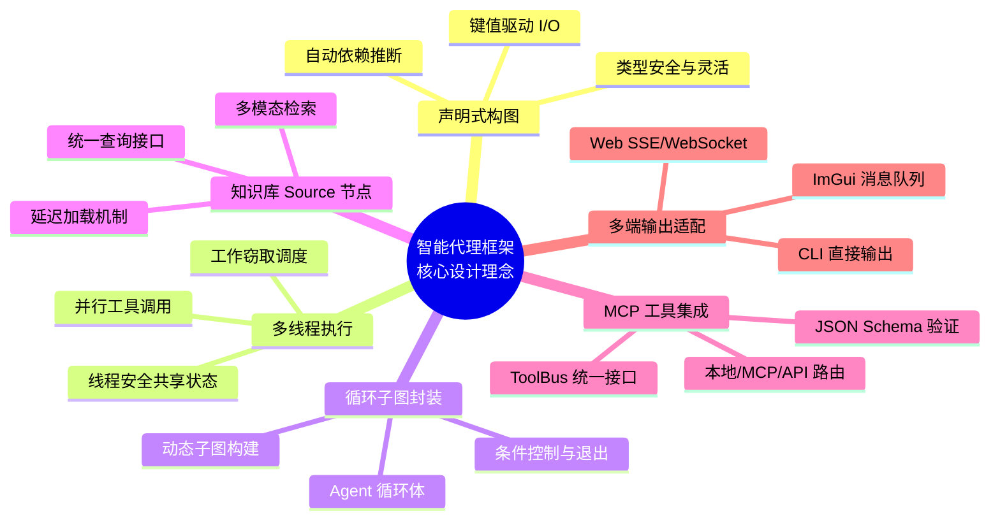

**关键特性**：

1. **Agent 以循环子图封装**：使用 `create_loop_decl` 将 Agent 的决策-执行循环封装为可复用的子图，循环体通过 `body_builder_fn` 在每次迭代时动态构建，支持灵活的工具调用和知识检索。

2. **LLM 节点多源输入设计**：LLM 节点通过 `input_specs` 接收系统提示词、用户提示词、知识库上下文、记忆、工具列表和多模态输入，实现了统一的提示词组装和上下文管理。

3. **知识库作为 Source 节点**：知识库通过 `create_any_source` 创建为 Source 节点，提供统一的查询 API。任何后续节点都可以通过 `input_specs` 引用知识库的输出，实现延迟加载和按需检索。

4. **Sink 节点统一输出处理**：所有输出都通过 `create_any_sink` 创建 Sink 节点处理，支持 CLI、ImGui 和 Web 客户端的不同需求，实现了多端适配的灵活架构。

5. **多线程并行执行**：基于 Taskflow 的工作窃取调度器，自动在多核 CPU 上并行执行工具调用和知识检索任务，充分利用硬件资源。

## 二、LLM 代理与多模态框架综述

### 2.1 LLM 代理系统组成

最新研究将 LLM 代理划分为四个核心子系统：**感知系统**、**推理系统**、**记忆系统**和**执行系统**【437511248842331†L78-L90】。感知系统接收来自用户和环境的输入（文本、语音、图像等），推理系统利用链式思考、树式推理等策略制定计划；记忆系统存储长短期知识；执行系统将计划转化为具体行动，例如调用外部工具或检索数据库。这种整合可以使代理完成过去难以实现的复杂任务，但也要求设计合理的控制流、记忆管理和工具接口【437511248842331†L115-L120】。

### 2.2 代理工作流与设计模式

在构建复杂代理时，架构模式对性能和可维护性具有决定作用。Hugging Face 提出的六种设计模式中，与本报告相关的有：

1. **Evaluator-Optimizer**：用于迭代改进模型或回答；通过评估器和优化器组成的循环实现多轮推理。
2. **Context-Augmentation**：利用检索增强模型上下文，通过调用工具和知识库扩充提示词【437883083434672†L167-L174】。
3. **Prompt-Chaining**：串联多个提示模板形成复杂推理链。
4. **Parallelization**：并行调用多个模块或工具；需解决依赖管理和负载均衡【437883083434672†L81-L84】。
5. **Routing**：根据意图或条件选择不同的工具或分支。
6. **Orchestrator-Workers**：由主控制器分配任务给多个工作节点，常用于多代理协作。

Craig Li 等人提出的代理工作流原则进一步强调：工作流应**可观察（Observable）**、**灵活（Flexible）**和**可恢复（Restorable）**【269917138825994†L76-L123】。为此，作者建议采用**事件驱动架构**（Event-Driven）、**事件溯源模式**（Event Sourcing）和**命令模式**（Command Pattern）来构建代理系统。事件驱动架构通过发布/订阅方式连接节点与主题，使系统可扩展、弹性强；事件溯源提供不可变的事件日志，用于回溯历史、持久化记忆；命令模式则将调度与执行解耦，使各节点易于重用和测试【269917138825994†L90-L123】。这些理念将在后文框架设计中发挥重要作用。

### 2.3 多模态大模型与融合策略

多模态大模型（MLLM）通过将预训练的语言模型与视觉、音频等特定编码器组合，可以获得比单纯文本模型更丰富的语义理解能力【803420306546639†L86-L90】。研究人员将多模态融合分为三个维度：

1. **模态融合机制**：包括抽象层（将非语言特征映射到隐语义空间）、投影层、语义嵌入层和交叉注意层【803420306546639†L121-L126】。交叉注意机制可以让模型在不同模态之间对齐信息，如让文本描述与图像区域对应【253686691880274†L296-L300】。
2. **融合层级**：分为早期融合、中期融合和混合融合【219518602455228†L164-L170】。早期融合在输入阶段将不同模态合并，适用于模态间交互性强的任务；中期融合先分别编码各模态，再在中间层进行合并；晚期融合则分别得到各模态的输出后再组合。混合融合则在不同层级综合多种方式，兼顾效率和表达力。
3. **表示学习策略**：包括联合表示（joint representation）和协调表示（coordinated representation）。联合表示直接将多模态信息映射到同一语义空间；协调表示则在各自空间中保持一定独立性，使用对齐策略关联【803420306546639†L121-L127】。

在工程实践中，常见的多模态融合策略有：

* **早期融合**：将图像向量与文本向量拼接后输入模型，适用于两个模态密切相关、数据量较小的场景【219518602455228†L164-L170】。
* **中期融合**：分别用专用编码器处理图像、文本后，通过线性层或注意力机制融合，兼顾效率和效果。
* **晚期融合**：如在检索系统中，分别检索文本和图像结果，再由上层逻辑进行排序和组合。

近年来一些知名的多模态大模型包括 GPT‑4V （视觉语言模型）、Gemini （整合文本、图像、音频）以及 Sora （视频生成模型），它们分别展现出强大的视觉理解与跨模态推理能力【927160657251235†L266-L283】【918647955484138†L115-L127】。

### 2.4 实时流式输出

在用户交互中，流式输出可以显著提高体验：用户在提交问题后，不再等待完整结果，而是看到模型逐字生成的回应。根据 Procedure Tech 的文章，服务器发送事件（Server‑Sent Events, SSE）是 2025 年流式 LLM 应用的中流砥柱，它具有连接简单、无双向握手、自动重连和兼容 HTTP 等优点，适合大多数需要实时反馈的应用【825014821319660†L64-L109】。与之相比，WebSocket 虽然支持全双工，但需要额外的基础设施如连接池和负载均衡，部署复杂度高；gRPC 则更适合服务间通信而非浏览器环境【825014821319660†L64-L109】。FreeCodeCamp 的教程进一步说明，SSE 依托 EventSource 接口和 text/event-stream 协议，在 HTTP 连接上维持单向传输，支持自动重连和浏览器兼容，适用于新闻推送、监控面板和 Generative AI 的逐 token 输出【723136666980538†L480-L599】。但 SSE 限制同时连接数且只支持 UTF‑8 文本，复杂交互场景仍需要 WebSocket【723136666980538†L546-L557】。

OpenAI 的 Realtime API 则展示了实时多模态对话的最佳实践：客户端首先通过 HTTP 创建会话，然后升级到 WebSocket，持续传输音频和文本流，服务器在检测到语义片段或函数调用时会及时以 JSON 格式推送事件或音频片段【621311804125779†L174-L214】。同时，服务器还会不断返回部分转录文本和中间结果，允许用户实时打断或复述。这些经验提醒我们，代理框架需要在内部预留流式事件接口，并支持在特定节点（如 LLM 或外部工具）输出部分结果或状态。

### 2.5 检索增强生成与多模态 RAG

传统 RAG 通过语言模型作为生成器，向量数据库作为检索器，在生成前先检索与用户问题相关的文本片段，再将其加入提示词进行回答。然而在多模态场景下，用户可能提供图片或语音，知识库也包含图像、音频、视频等多模态数据。多模态 RAG 利用专用编码器（如 CLIP 处理图像、Whisper 处理音频）将不同模态映射到向量空间，存储在向量数据库中，然后通过跨模态注意力和融合层将检索结果整合到统一上下文中【253686691880274†L272-L306】。检索过程中，系统会根据用户输入的类型选择相应编码器，利用相似度搜索获得相关文档，再将多模态信息经过融合层和交叉注意力层整合，最终交由 LLM 生成答案【253686691880274†L242-L306】。多模态 RAG 架构的关键组件包括：

1. **用户查询处理与多模态编码器**：根据输入类型调用相应的模型（如 BERT 用于文本，CLIP 用于图像，Whisper 用于音频），将数据转换为嵌入【253686691880274†L272-L279】。
2. **向量数据库/知识仓库**：存储各种模态的向量嵌入，支持高效相似度搜索【253686691880274†L282-L285】。
3. **检索系统**：根据查询嵌入在向量数据库中检索最相关的多模态文档，并结合语义搜索与关键字搜索【253686691880274†L289-L292】。
4. **跨模态注意力与融合层**：将检索到的不同模态信息对齐，匹配文本段与图像区域，并融合为统一上下文，以供后续生成【253686691880274†L296-L306】。
5. **生成与后处理**：LLM 根据融合的多模态上下文生成回答，必要时对输出进行重排序、过滤或格式化【253686691880274†L267-L270】。

多模态 RAG 提供了超越传统文本检索的能力，使代理可以解答涉及图片说明、语音描述和视频内容的问题，为各行业的场景提供更丰富、更准确的答案【253686691880274†L242-L261】。

## 三、Taskflow 与 workflow 库综述

### 3.1 Taskflow 基本特性

Taskflow 是一个以工作窃取（work‑stealing）执行器为基础的通用任务并行编程框架，旨在帮助开发者用较少的代码表达复杂的任务依赖关系并在多核 CPU 甚至 GPU 上高效调度执行。其核心特点包括：

* **轻量级和易用性**：Taskflow 是单头文件库，支持 C++17 标准，无需安装即可使用。通过任务流（`tf::Taskflow`）和执行器（`tf::Executor`）即可定义任务并启动运行【201813784348343†L41-L76】。
* **显式依赖建模**：开发者可以通过 `emplace` 创建任务并使用 `precede` 和 `succeed` 定义依赖关系。例如，在四个任务 A、B、C、D 中指定 A 先于 B 和 C，D 在 B 和 C 之后执行【201813784348343†L35-L58】。
* **子流（Subflow）支持**：Taskflow 允许在任务执行过程中生成新的子图，从而实现递归并行。例如在 B 任务中通过 `tf::Subflow` 创建 B1、B2、B3 等子任务，并指定它们之间的依赖【201813784348343†L93-L118】。
* **条件任务**：可以创建返回整数的条件任务，根据返回值决定下一步执行的任务，实现循环或分支逻辑【201813784348343†L121-L139】。
* **任务流组合**：可将一个任务流作为模块嵌入到另一个任务流，通过 `composed_of` 实现模块化复用【201813784348343†L141-L165】。
* **异步任务和动态任务图**：执行器提供 `async` 和 `silent_async` 方法启动异步任务。Taskflow 3.6 版引入了 `dependent_async` 等接口，支持在运行时创建依赖于其他任务的异步任务，实现动态任务图【548440874866018†L29-L66】。这为表达动态循环和实时构建子任务提供了底层支持。
* **标准并行算法**：Taskflow 内置 for_each、reduce、sort 等并行算法，可以与任务流混合使用，减少样板代码【201813784348343†L193-L210】。
* **GPU 任务**：通过 cudaFlow 接口，Taskflow 支持将任务 offload 到 CUDA GPU 上执行，实现 CPU‑GPU 协同【201813784348343†L255-L283】。
* **可视化与分析**：Taskflow 可导出 DOT 图并提供 TFProf 工具查看执行时间线，便于调试和性能优化【201813784348343†L292-L310】。

Taskflow 的新版本持续增强调度性能和算法库。3.10 版在工作窃取调度、内存布局、并行 for / reduce 等方面进行了优化【125087198736220†L29-L87】；3.6 版引入动态任务图和并行扫描算法【548440874866018†L29-L97】。这些特性为构建高性能智能代理提供了强大的基础。

### 3.2 workflow 库特性

Taskflow `workflow` 库是在 dev 分支上开发的高级数据流建模工具，提供声明式、键值驱动的工作流构建能力，兼顾类型安全和动态灵活性【631946224216190†L338-L352】。其主要优势如下：

1. **基于键的 I/O**：每个节点的输入和输出都通过字符串键指定，形式为 `{源节点名, 输出键名}`，无需在代码中硬编码函数签名，依赖通过输入规格自动推断【631946224216190†L338-L352】。
2. **多种节点类型**：包括编译期类型安全的 `TypedNode`、`TypedSource`、`TypedSink`，以及运行时类型的 `AnyNode`、`AnySource`、`AnySink`，可根据场景在性能和灵活性之间权衡【631946224216190†L338-L352】。
3. **高级控制流节点**：提供 `create_condition_decl`、`create_multi_condition_decl`、`create_pipeline_node`、`create_loop_decl` 等用于条件分支、并行分支、流水线和循环结构【631946224216190†L1225-L1334】。特别是 `create_loop_decl` 支持通过 `create_subtask` 在每次迭代动态构建子图，实现复杂循环逻辑【631946224216190†L1280-L1334】。
4. **并行算法节点**：通过 `create_for_each`、`create_for_each_index`、`create_reduce`、`create_transform` 等接口，直接将 Taskflow 的并行算法嵌入数据流图，实现容器遍历、索引遍历、归约和变换等操作【631946224216190†L1340-L1362】。
5. **统一节点接口**：所有节点派生自 `INode`，可通过名称获取输出、查询节点类型、设置回调等，便于组合和调试【631946224216190†L338-L352】。

因为 `workflow` 会根据输入规格自动连接依赖，开发者无需显式调用 `precede/succeed`，极大简化了图结构构建。这种声明式风格不仅提升了代码可读性，也降低了连接错误的概率，并使得流程容易可视化和维护【631946224216190†L609-L643】。

## 四、整体设计与技术框架

### 4.1 核心设计原则

本框架遵循以下核心设计原则，确保系统的高性能、可扩展性和灵活性：

1. **声明式数据流**：基于 `workflow` 的键值驱动 I/O 系统，通过 `input_specs` 自动推断依赖关系，无需手动连接节点。
2. **Agent 与工作流统一抽象**：Agent 和工作流都可以作为独立节点嵌入到更大的工作流中，支持嵌套和组合。
3. **模块化与可组合性**：每个模块（LLM 节点、工具调用、知识检索等）都可以独立开发、测试和复用。
4. **多线程并行执行**：利用 Taskflow 的工作窃取调度器，自动在多核 CPU 上并行执行任务。
5. **多端适配**：通过统一的 Sink 节点接口，支持 CLI、ImGui 和 Web 客户端。

### 4.2 核心模块架构

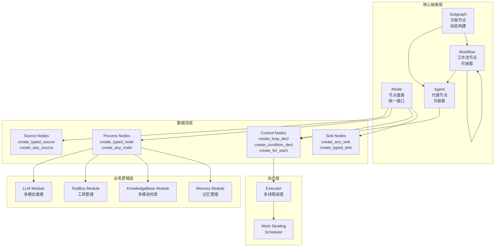

### 4.3 核心节点类型与职责

#### 4.3.1 Source 节点（数据源）

Source 节点是数据流的起点，负责提供初始数据：

| 节点类型 | API | 用途 | 示例 |
|---------|-----|------|------|
| `TypedSource` | `create_typed_source` | 类型安全的源节点，编译期检查 | 系统提示词、用户输入 |
| `AnySource` | `create_any_source` | 动态类型的源节点，运行时灵活 | 知识库查询、工具列表、多模态输入 |
| `KnowledgeBase Source` | `create_any_source` | **知识库作为 Source 节点，提供统一查询 API** | 向量检索、多模态检索 |

**关键设计**：知识库作为 Source 节点，可以被多个节点引用，实现延迟加载和按需检索。

#### 4.3.2 Process 节点（处理节点）

Process 节点执行计算逻辑，接收输入并产生输出：

| 节点类型 | API | 用途 | 示例 |
|---------|-----|------|------|
| `TypedNode` | `create_typed_node` | 类型安全的处理节点 | 数值计算、类型转换 |
| `AnyNode` | `create_any_node` | 动态类型的处理节点 | LLM 节点、PlanParser、Aggregator |
| `LLM Node` | `create_any_node` | **核心决策节点，多源输入融合** | 接收 system_prompt、user_prompt、context、tools、image、audio |

**LLM 节点输入设计**：
- `system_prompt`：系统提示词（角色定义）
- `user_prompt`：用户提示词（问题或指令）
- `context`：知识库检索结果（多模态 RAG）
- `tools`：可用工具列表（ToolBus 导出）
- `image_data`/`audio_data`：多模态输入（可选）

#### 4.3.3 Control 节点（控制流节点）

Control 节点实现条件分支、循环和并行执行：

| 节点类型 | API | 用途 | 示例 |
|---------|-----|------|------|
| `Loop Node` | `create_loop_decl` | **Agent 循环，动态构建子图** | 代理决策-执行循环 |
| `Condition Node` | `create_condition_decl` | 条件分支 | 判断是否继续循环 |
| `ForEach Node` | `create_for_each` | 并行遍历 | 并行工具调用 |
| `Subgraph Node` | `create_subgraph` | 子图模块 | 可复用的 Agent 或 Workflow |

**关键设计**：
- **Agent 以循环子图封装**：使用 `create_loop_decl` 的 `body_builder_fn` 在每次迭代时动态构建子图
- **Agent 和工作流可嵌套**：Agent 或 Workflow 可以作为独立节点嵌入到更大的工作流中

#### 4.3.4 Sink 节点（输出节点）

Sink 节点处理最终输出，支持多端适配：

| 节点类型 | API | 用途 | 示例 |
|---------|-----|------|------|
| `AnySink` | `create_any_sink` | 统一输出接口 | CLI、ImGui、Web 输出 |
| `TypedSink` | `create_typed_sink` | 类型安全的输出 | 数值结果输出 |

**关键设计**：所有输出都通过 Sink 节点统一处理，实现 CLI、ImGui 和 Web 的多端适配。

### 4.4 Agent 与工作流的嵌套设计

本框架的核心创新在于 **Agent 和工作流都可以作为独立节点**，支持多层嵌套和组合：

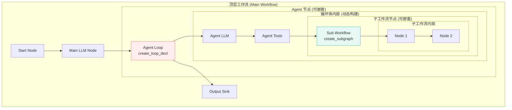

#### 4.4.1 Agent 作为节点

Agent 可以通过 `create_loop_decl` 封装为一个独立的循环节点：

```cpp
// Agent 节点封装：将 Agent 封装为可复用的节点
auto create_agent_node(
    wf::GraphBuilder& builder,
    const std::string& name,
    const std::vector<std::pair<std::string, std::string>>& input_specs,
    const AgentConfig& config
) {
    // Agent 内部是一个循环子图
    auto [agent_node, agent_task] = builder.create_loop_decl(
        name,
        input_specs,
        // body_builder_fn: Agent 的决策-执行循环
        [config](wf::GraphBuilder& gb, const auto& inputs) {
            // 构建 Agent 循环体（LLM + 工具调用 + 知识检索）
            // ... 见 7.2 节的完整实现 ...
        },
        // condition_func: Agent 的终止条件
        [](const auto& inputs) -> int {
            bool is_final = std::any_cast<bool>(inputs.at("is_final"));
            return is_final ? 1 : 0;
        },
        // exit_builder_fn: Agent 的输出处理
        [](wf::GraphBuilder& gb, const auto& inputs) {
            gb.create_any_sink(
                "AgentOutput",
                {{"LLM", "final_answer"}},
                [](const auto& outputs) {
                    // 输出 Agent 的最终结果
                }
            );
        },
        {"agent_output"}  // Agent 的输出键
    );
    
    return std::make_pair(agent_node, agent_task);
}

// 使用 Agent 节点（嵌入到更大的工作流中）
auto [agent1, _] = create_agent_node(builder, "PlanningAgent", 
    {{"Input", "task"}}, planning_config);
auto [agent2, _] = create_agent_node(builder, "ExecutionAgent",
    {{"PlanningAgent", "agent_output"}}, execution_config);

// Agent1 的输出作为 Agent2 的输入，实现了 Agent 的链式组合
```

#### 4.4.2 工作流作为节点

工作流可以通过 `create_subgraph` 封装为一个独立的节点：

```cpp
// 工作流节点封装：将工作流封装为可复用的节点
auto create_workflow_node(
    wf::GraphBuilder& builder,
    const std::string& name,
    const std::vector<std::pair<std::string, std::string>>& input_specs,
    const WorkflowConfig& config
) {
    // 工作流是一个子图模块
    auto workflow_task = builder.create_subgraph(name, 
        [config, input_specs](wf::GraphBuilder& gb) {
            // 构建工作流内部结构
            // 1. 创建内部 Source 节点
            auto [src, _] = gb.create_any_source("InternalSource", 
                [input_specs](const auto& inputs) {
                    // 从外部输入构造内部数据
                    return std::unordered_map<std::string, std::any>{/* ... */};
                });
            
            // 2. 创建工作流内部节点（可以包含 Agent）
            // ...
            
            // 3. 创建工作流输出 Sink
            gb.create_any_sink("InternalSink", 
                {{"LastNode", "output"}},
                [](const auto& outputs) {
                    // 工作流的最终输出
                });
        }
    );
    
    return workflow_task;
}

// 使用工作流节点（可以包含 Agent）
auto workflow1 = create_workflow_node(builder, "DataProcessingWorkflow",
    {{"Input", "data"}}, data_config);
    
// 工作流内部可以包含 Agent
auto workflow2 = create_workflow_node(builder, "AgentOrchestrationWorkflow",
    {{"DataProcessingWorkflow", "output"}}, orchestration_config);
```

#### 4.4.3 Agent 与工作流的嵌套组合

Agent 和工作流可以互相嵌套，形成复杂的分层架构：

```cpp
// 示例：Agent 内部包含工作流，工作流内部包含 Agent
auto [top_level_agent, _] = builder.create_loop_decl(
    "TopLevelAgent",
    {{"Input", "task"}},
    // Agent 循环体
    [](wf::GraphBuilder& gb, const auto& inputs) {
        // 1. Agent 内部的 LLM 节点
        auto [llm, _] = gb.create_any_node("LLM", /* ... */);
        
        // 2. Agent 内部的工作流节点（嵌套）
        auto sub_workflow = gb.create_subgraph("SubWorkflow", [](wf::GraphBuilder& sub_gb) {
            // 工作流内部的 Agent 节点（嵌套）
            auto [sub_agent, _] = sub_gb.create_loop_decl(
                "SubAgent",
                {{"ParentLLM", "output"}},
                // 子 Agent 的循环体
                [](wf::GraphBuilder& agent_gb, const auto& agent_inputs) {
                    // 子 Agent 的逻辑
                },
                // ...
            );
        });
        
        // 3. Agent 内部的其他节点
        // ...
    },
    // ...
);

// 这种嵌套设计支持：
// 1. Agent 内部可以调用工作流处理复杂子任务
// 2. 工作流内部可以包含 Agent 实现智能决策
// 3. 多层嵌套形成复杂的分层架构
```

### 4.5 技术框架分层架构

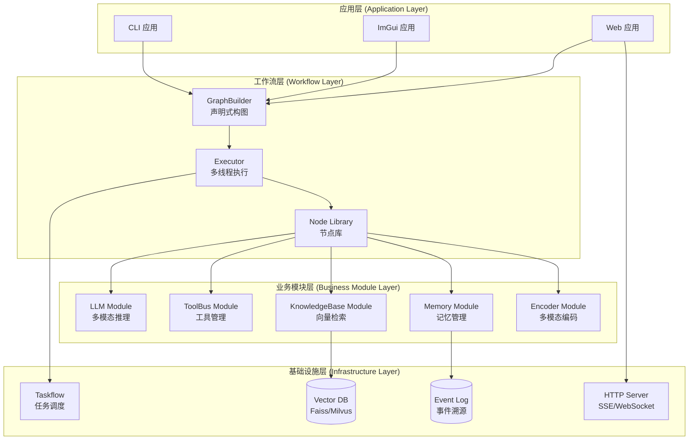

### 4.6 节点生命周期与状态管理

每个节点在执行过程中都有明确的生命周期：

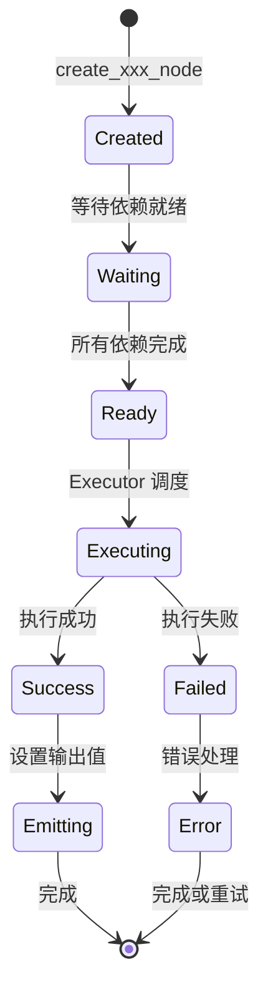

**节点状态管理要点**：

1. **依赖检查**：节点在 `Waiting` 状态等待所有输入就绪（通过 `shared_future` 检查）
2. **并行执行**：多个独立节点可以同时处于 `Executing` 状态，由 Taskflow 调度器并行执行
3. **错误处理**：失败的节点进入 `Error` 状态，可以选择重试或向上传播错误
4. **输出传播**：成功的节点通过 `promise/future` 机制将输出传播给依赖节点

### 4.7 关键技术路线图

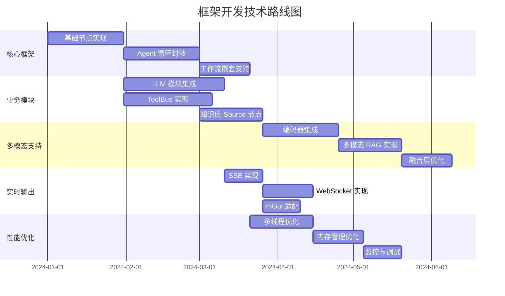

## 五、LLM 节点设计与实现

### 5.1 LLM 节点功能需求

LLM 节点是代理框架的核心决策节点，负责整合多源输入并生成推理结果。其设计需满足以下需求：

1. **多模态输入支持**：在用户起始节点提供的文本、图像或音频输入基础上，将其编码并传递给 LLM。如果模型支持视觉或语音输入，则直接将编码结果插入 prompt；否则需在 prompt 中描述附件内容。

2. **工具调用生成**：LLM 需要根据可用工具的函数签名输出工具调用列表。这要求在 prompt 中嵌入工具的名称和参数描述【437883083434672†L167-L174】。

3. **系统提示词与用户提示词分离**：为降低幻觉并提高控制力，系统提示词（例如"你是一名专业的卫星设计专家"）应与用户输入分开，并在节点配置中保留修改接口。Dify 文档说明 LLM 节点可以同时配置系统提示词、用户提示词和助手提示词，并根据业务场景选择不同的模型和参数【449621660025648†L169-L226】。

4. **上下文变量插入**：在检索增强的应用中，知识检索节点会输出包含引用信息的结果列表，LLM 节点应通过 context 变量将其插入提示词，以供模型参考。这种设计不仅可以丰富答案，还可以支持引用和溯源功能【449621660025648†L250-L260】。

5. **多轮对话记忆**：LLM 节点需要读取记忆节点输出的历史对话并拼接到新的 prompt 中，以实现对话上下文的理解。Dify 文档提供了 Memory Window 的配置，可控制插入多少历史内容【449621660025648†L315-L320】。

6. **流式输出**：为了实时呈现模型的推理过程，LLM 节点的底层客户端应支持流式 token 输出，并在每个 token 生成后通过 Sink 节点发送给前端【621311804125779†L174-L214】。

### 5.2 LLM 节点数据结构

为在 `workflow` 中以类型安全方式传递 LLM 的输入和输出，本框架定义了以下结构：

```cpp
#include <nlohmann/json.hpp>
#include <string>
#include <vector>
#include <optional>

using json = nlohmann::json;

// 工具元数据
struct ToolMeta {
    std::string name;              // 工具名称
    json schema;                  // JSON Schema 描述（OpenAI Function Calling 格式）
    std::string description;       // 工具说明
};

// LLM 输入结构
    struct LLMInput {
    std::string system_prompt;     // 系统提示词（角色定义、行为规范）
    std::string user_prompt;       // 用户提示词（当前问题或指令）
    std::string context;           // 从知识库检索的内容摘要（多模态 RAG 结果）
    std::vector<ToolMeta> tools;   // 可用工具列表（ToolBus 导出）
    std::optional<std::string> image_data;  // 图像 base64 编码（可选）
    std::optional<std::string> audio_data;  // 音频 base64 编码（可选）
};

// 工具调用规范
struct CallSpec {
    std::string name;              // 工具名称
    json arguments;                // 调用参数（JSON 对象）
};

// LLM 输出结构
    struct LLMOutput {
    std::vector<CallSpec> tool_calls;  // 工具调用列表
    std::string reasoning;             // 中间思考和计划描述
    bool is_final;                     // 是否已完成任务（true 表示生成最终答案）
    std::string final_answer;          // 最终回答（仅当 is_final 为真时有效）
    std::optional<std::string> audio_out;  // 语音输出（可选，如 GPT-4o Realtime API）
    };
```

### 5.3 提示词渲染与组装（Prompt Rendering）

**核心问题**：LLM 节点接收多个输入源（系统提示词、用户提示词、知识库上下文、工具列表、对话记忆、多模态输入），需要将这些输入**渲染并组装**成最终的提示词，传递给 LLM 模型。

#### 5.3.1 提示词渲染的需求分析

提示词渲染是 LLM 节点的核心功能，需要解决以下问题：

1. **多源输入融合**：将 `system_prompt`、`user_prompt`、`context`、`history`、`tools` 等多个输入源组合成统一的提示词
2. **模板系统**：支持可配置的提示词模板，允许自定义不同输入源的组合方式
3. **变量替换**：支持在模板中使用变量占位符（如 `{{context}}`、`{{tools}}`），动态替换实际内容
4. **工具列表格式化**：将 `ToolMeta` 列表转换为符合不同 LLM 提供商标准的格式（OpenAI Function Calling、Anthropic Tool Use 等）
5. **多模态输入集成**：将图像、音频的 base64 编码以正确格式嵌入到提示词中
6. **上下文窗口管理**：当输入内容超过模型上下文窗口时，智能截断或摘要
7. **对话历史格式化**：将对话记忆按照模型要求格式化为消息列表（如 OpenAI 的 messages 格式）

#### 5.3.2 提示词渲染架构设计

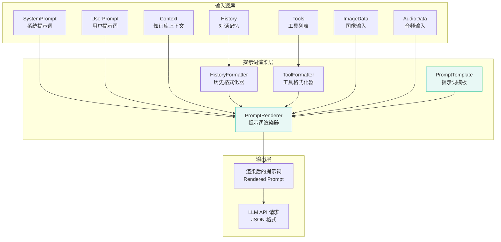

#### 5.3.3 提示词渲染流程

提示词渲染的主要步骤：

1. **模板加载**：根据配置加载提示词模板（支持文件、字符串或代码配置）
2. **变量提取**：从 `LLMInput` 结构体中提取所有输入变量
3. **工具格式化**：将 `ToolMeta` 列表格式化为模型特定的工具描述格式
4. **历史格式化**：将对话记忆格式化为消息列表（system/user/assistant 角色）
5. **变量替换**：在模板中替换所有变量占位符
6. **上下文截断**：检查总长度，必要时截断或摘要过长内容
7. **多模态整合**：将图像、音频数据以 base64 格式嵌入到请求中

#### 5.3.4 提示词模板示例

**默认模板**（适用于 OpenAI Chat Completions）：

```
System Message:
{{system_prompt}}

Available Tools:
{{tools}}

Context from Knowledge Base:
{{context}}

Conversation History:
{{history}}

User Message:
{{user_prompt}}
```

**带引用的模板**（支持知识库引用）：

```
You are {{system_prompt}}.

Use the following context to answer the user's question. Cite sources when relevant.

Context:
{{context}}

Citations: {{citations}}

Conversation History:
{{history}}

Available Tools:
{{tools}}

User Question:
{{user_prompt}}
```

#### 5.3.5 工具列表格式化实现

不同 LLM 提供商对工具列表的格式要求不同，需要实现适配器：

**OpenAI Function Calling 格式**：
```json
{
  "tools": [
    {
      "type": "function",
      "function": {
        "name": "calculate",
        "description": "Perform basic arithmetic operations",
        "parameters": {
          "type": "object",
          "properties": {
            "a": {"type": "number"},
            "b": {"type": "number"},
            "op": {"type": "string", "enum": ["+", "-", "*", "/"]}
          },
          "required": ["a", "b", "op"]
        }
      }
    }
  ]
}
```

**Anthropic Tool Use 格式**：
```json
{
  "tools": [
    {
      "name": "calculate",
      "description": "Perform basic arithmetic operations",
      "input_schema": {
        "type": "object",
        "properties": {
          "a": {"type": "number"},
          "b": {"type": "number"},
          "op": {"type": "string", "enum": ["+", "-", "*", "/"]}
        },
        "required": ["a", "b", "op"]
      }
    }
  ]
}
```

#### 5.3.6 多模态输入整合

对于支持多模态的模型（如 GPT-4o、Claude 3），需要将图像和音频以特定格式嵌入：

**OpenAI 多模态格式**：
```json
{
  "messages": [
    {
      "role": "user",
      "content": [
        {"type": "text", "text": "What's in this image?"},
        {
          "type": "image_url",
          "image_url": {
            "url": "data:image/png;base64,{{image_data}}"
          }
        }
      ]
    }
  ]
}
```

**音频输入**（GPT-4o Realtime API）：
```json
{
  "messages": [
    {
      "role": "user",
      "content": [
        {"type": "input_audio", "audio": "{{audio_data}}"}
      ]
    }
  ]
}
```

#### 5.3.7 上下文窗口管理

当组合后的提示词超过模型上下文窗口时，需要智能管理：

1. **优先级排序**：系统提示词 > 用户提示词 > 工具列表 > 上下文 > 历史对话
2. **截断策略**：
   - 保留所有必需内容（system_prompt、user_prompt、tools）
   - 优先截断历史对话（保留最近的 N 轮）
   - 对上下文进行摘要（使用 LLM 或抽取式摘要）
3. **长度统计**：使用 Tokenizer 估算 token 数，确保不超过模型限制

### 5.4 LLM 节点实现（基于 workflow API）

在 `workflow` 中，LLM 节点使用 `create_any_node` 创建，通过 `input_specs` 自动建立依赖关系。**关键改进**：在 LLM 节点内部使用 `PromptRenderer` 进行提示词渲染：

```cpp
#include <workflow/nodeflow.hpp>
#include <taskflow/taskflow.hpp>

namespace wf = workflow;

// 创建 LLM 节点
auto [llm_node, llm_task] = builder.create_any_node(
    "LLM",  // 节点名称
    // input_specs: 自动建立依赖关系
    {
        {"SystemPrompt", "prompt"},      // 系统提示词源节点
        {"UserInput", "query"},          // 用户输入源节点
        {"KnowledgeBase", "context"},     // 知识库查询结果（Source 节点提供）
        {"Memory", "history"},           // 对话记忆
        {"ToolList", "tools"},           // 工具列表（ToolBus 导出）
        {"ImageInput", "image_data"},     // 可选：图像输入
        {"AudioInput", "audio_data"}     // 可选：音频输入
    },
    // Functor: 接收输入并调用 LLM
    [&llm_client, &prompt_renderer, &stream_callback](const std::unordered_map<std::string, std::any>& inputs) {
        // 1. 提取输入数据并构建 LLMInput
        LLMInput llm_input;
        llm_input.system_prompt = std::any_cast<std::string>(inputs.at("prompt"));
        llm_input.user_prompt = std::any_cast<std::string>(inputs.at("query"));
        llm_input.context = std::any_cast<std::string>(inputs.at("context"));
        llm_input.tools = std::any_cast<std::vector<ToolMeta>>(inputs.at("tools"));
        
        // 2. 处理对话历史（可选）
        if (inputs.find("history") != inputs.end()) {
            llm_input.history = std::any_cast<std::vector<Message>>(inputs.at("history"));
        }
        
        // 3. 处理可选的多模态输入
        if (inputs.find("image_data") != inputs.end()) {
            llm_input.image_data = std::any_cast<std::string>(inputs.at("image_data"));
        }
        if (inputs.find("audio_data") != inputs.end()) {
            llm_input.audio_data = std::any_cast<std::string>(inputs.at("audio_data"));
        }
        
        // 4. **关键步骤**：使用 PromptRenderer 渲染提示词
        // PromptRenderer 负责：
        // - 将多个输入源组合成统一的提示词
        // - 格式化工具列表（OpenAI/Anthropic/Gemini 格式）
        // - 格式化对话历史（messages 格式）
        // - 处理多模态输入（图像、音频的 base64 嵌入）
        // - 上下文窗口管理和截断
        RenderedPrompt rendered = prompt_renderer.render(llm_input, llm_client.get_model_name());
        
        // 5. 调用 LLM（传入渲染后的提示词，支持流式输出）
        LLMOutput output = llm_client.invoke_with_rendered_prompt(rendered, stream_callback);
        
        // 4. 返回输出（自动转换为 shared_future<any>）
        return std::unordered_map<std::string, std::any>{
            {"tool_calls", std::any{output.tool_calls}},
            {"reasoning", std::any{output.reasoning}},
            {"is_final", std::any{output.is_final}},
            {"final_answer", std::any{output.final_answer}},
            {"audio_out", std::any{output.audio_out.value_or("")}}
        };
    },
    // output_keys: 后续节点通过这些键访问输出
    {"tool_calls", "reasoning", "is_final", "final_answer", "audio_out"}
    );
```

**关键设计要点**：

1. **自动依赖推断**：`input_specs` 中的 `{"SystemPrompt", "prompt"}` 会自动建立 `SystemPrompt` 节点到 `LLM` 节点的依赖关系，无需手动调用 `precede`。
2. **多源输入融合**：LLM 节点从多个源节点接收数据，包括系统提示词、用户输入、知识库上下文、记忆和工具列表。
3. **提示词渲染**：**核心创新**：使用 `PromptRenderer` 将多个输入源渲染成最终的提示词，支持模板化、变量替换、工具格式化、多模态整合等功能。
4. **流式输出回调**：`stream_callback` 在 LLM 生成每个 token 时触发，可以立即推送到 SSE/WebSocket 或 GUI 界面。
5. **类型安全**：输入数据结构化，使用 `std::any_cast` 进行类型转换，在运行时检查类型匹配。

### 5.5 提示词渲染器实现示例

以下展示 `PromptRenderer` 的核心实现：

```cpp
/**
 * @brief 渲染后的提示词结构
 * 包含渲染后的文本内容和多模态数据
 */
struct RenderedPrompt {
    std::string rendered_text;              // 渲染后的文本提示词
    std::vector<json> messages;             // 格式化后的消息列表（OpenAI messages 格式）
    json tools_json;                        // 格式化后的工具列表（JSON）
    std::optional<std::string> image_data;  // 图像 base64（已嵌入 messages）
    std::optional<std::string> audio_data;  // 音频 base64（已嵌入 messages）
    int total_tokens;                       // 估算的总 token 数
};

/**
 * @brief 提示词渲染器
 * 负责将 LLMInput 渲染成最终的提示词
 */
class PromptRenderer {
private:
    std::shared_ptr<PromptTemplate> template_;  // 提示词模板
    std::map<std::string, std::shared_ptr<ToolFormatter>> tool_formatters_;  // 工具格式化器
    
public:
    /**
     * @brief 渲染提示词
     * @param input LLM 输入（包含所有输入源）
     * @param model_name 模型名称（用于选择格式化策略）
     * @return 渲染后的提示词
     */
    RenderedPrompt render(const LLMInput& input, const std::string& model_name) {
        RenderedPrompt rendered;
        
        // 1. 格式化工具列表（根据模型选择不同的格式化器）
        std::shared_ptr<ToolFormatter> formatter = get_tool_formatter(model_name);
        rendered.tools_json = formatter->format_tools(input.tools);
        std::string tools_text = formatter->format_tools_as_text(input.tools);
        
        // 2. 格式化对话历史
        std::string history_text = format_history(input.history, model_name);
        rendered.messages = format_history_as_messages(input.history);
        
        // 3. 应用模板并替换变量
        std::map<std::string, std::string> variables = {
            {"system_prompt", input.system_prompt},
            {"user_prompt", input.user_prompt},
            {"context", input.context},
            {"history", history_text},
            {"tools", tools_text}
        };
        rendered.rendered_text = template_->render(variables);
        
        // 4. 整合多模态输入
        if (input.image_data.has_value()) {
            rendered.image_data = input.image_data;
            add_image_to_messages(rendered.messages, *input.image_data);
        }
        if (input.audio_data.has_value()) {
            rendered.audio_data = input.audio_data;
            add_audio_to_messages(rendered.messages, *input.audio_data);
        }
        
        // 5. 估算 token 数并检查上下文窗口
        rendered.total_tokens = estimate_tokens(rendered);
        if (rendered.total_tokens > get_max_tokens(model_name)) {
            rendered = truncate_prompt(rendered, model_name);
        }
        
        return rendered;
    }
    
private:
    // 获取工具格式化器（根据模型选择）
    std::shared_ptr<ToolFormatter> get_tool_formatter(const std::string& model_name) {
        if (model_name.find("gpt") != std::string::npos || 
            model_name.find("openai") != std::string::npos) {
            return tool_formatters_["openai"];
        } else if (model_name.find("claude") != std::string::npos ||
                 model_name.find("anthropic") != std::string::npos) {
            return tool_formatters_["anthropic"];
        } else if (model_name.find("gemini") != std::string::npos) {
            return tool_formatters_["gemini"];
        }
        return tool_formatters_["default"];  // 默认格式
    }
    
    // 格式化对话历史为文本
    std::string format_history(const std::vector<Message>& history, const std::string& model_name) {
        std::ostringstream oss;
        for (const auto& msg : history) {
            oss << msg.role << ": " << msg.content << "\n";
        }
        return oss.str();
    }
    
    // 格式化对话历史为消息列表（OpenAI messages 格式）
    std::vector<json> format_history_as_messages(const std::vector<Message>& history) {
        std::vector<json> messages;
        for (const auto& msg : history) {
            messages.push_back({
                {"role", msg.role},
                {"content", msg.content}
            });
        }
        return messages;
    }
    
    // 将图像添加到消息列表
    void add_image_to_messages(std::vector<json>& messages, const std::string& image_data) {
        if (!messages.empty()) {
            // 在最后一个用户消息中添加图像
            if (messages.back()["role"] == "user") {
                if (messages.back()["content"].is_string()) {
                    // 转换为数组格式
                    std::string text = messages.back()["content"];
                    messages.back()["content"] = json::array({
                        {"type", "text"}, {"text", text},
                        {"type", "image_url"},
                        {"image_url", {{"url", "data:image/png;base64," + image_data}}}
                    });
                } else if (messages.back()["content"].is_array()) {
                    messages.back()["content"].push_back({
                        {"type", "image_url"},
                        {"image_url", {{"url", "data:image/png;base64," + image_data}}}
                    });
                }
            }
        }
    }
    
    // 估算 token 数（简化实现，实际应使用 Tokenizer）
    int estimate_tokens(const RenderedPrompt& rendered) {
        // 简单估算：平均每个字符 0.25 个 token（中文约 2 字符/token，英文约 4 字符/token）
        return rendered.rendered_text.size() / 4;
    }
    
    // 截断提示词（保留优先级高的内容）
    RenderedPrompt truncate_prompt(const RenderedPrompt& rendered, const std::string& model_name) {
        RenderedPrompt truncated = rendered;
        int max_tokens = get_max_tokens(model_name);
        
        // 保留 system_prompt 和 user_prompt，截断 context 和 history
        // 实际实现应根据优先级智能截断
        // ...
        
        return truncated;
    }
};

/**
 * @brief 提示词模板（支持变量替换）
 */
class PromptTemplate {
private:
    std::string template_str_;
    std::regex var_pattern_{R"(\{\{(\w+)\}\})"};  // 匹配 {{variable}}
    
public:
    explicit PromptTemplate(const std::string& template_str) : template_str_(template_str) {}
    
    /**
     * @brief 渲染模板，替换所有变量
     */
    std::string render(const std::map<std::string, std::string>& variables) {
        std::string result = template_str_;
        
        std::sregex_iterator iter(result.begin(), result.end(), var_pattern_);
        std::sregex_iterator end;
        
        std::vector<std::pair<size_t, size_t>> replacements;
        for (; iter != end; ++iter) {
            std::smatch match = *iter;
            std::string var_name = match[1].str();
            
            if (variables.find(var_name) != variables.end()) {
                replacements.push_back({match.position(), match.length()});
            }
        }
        
        // 从后往前替换（避免位置偏移）
        for (auto it = replacements.rbegin(); it != replacements.rend(); ++it) {
            std::string var_name = result.substr(it->first + 2, it->second - 4);
            std::string value = variables.at(var_name);
            result.replace(it->first, it->second, value);
        }
        
        return result;
    }
};

/**
 * @brief 工具格式化器虚基类
 */
class ToolFormatter {
public:
    virtual ~ToolFormatter() = default;
    
    // 格式化为 JSON（供 API 使用）
    virtual json format_tools(const std::vector<ToolMeta>& tools) = 0;
    
    // 格式化为文本（供模板使用）
    virtual std::string format_tools_as_text(const std::vector<ToolMeta>& tools) = 0;
};

/**
 * @brief OpenAI 工具格式化器
 */
class OpenAIToolFormatter : public ToolFormatter {
public:
    json format_tools(const std::vector<ToolMeta>& tools) override {
        json tools_json = json::array();
        for (const auto& tool : tools) {
            tools_json.push_back({
                {"type", "function"},
                {"function", {
                    {"name", tool.name},
                    {"description", tool.description},
                    {"parameters", tool.schema}
                }}
            });
        }
        return tools_json;
    }
    
    std::string format_tools_as_text(const std::vector<ToolMeta>& tools) override {
        std::ostringstream oss;
        oss << "Available tools:\n";
        for (const auto& tool : tools) {
            oss << "- " << tool.name << ": " << tool.description << "\n";
            oss << "  Parameters: " << tool.schema.dump(2) << "\n";
        }
        return oss.str();
    }
};
```

### 5.6 知识库 Source 节点设计

知识库节点作为 **Source 节点**，为后续节点提供查询 API。这种设计使得知识库成为一个可复用的数据源，可以被多个节点（如 LLM 节点、工具调用节点）查询：

```cpp
// 知识库 Source 节点：提供查询 API
auto [kb_source, kb_task] = builder.create_any_source(
    "KnowledgeBase",
    [&vector_store, &user_query](wf::GraphBuilder& gb) {
        // 知识库节点根据用户查询或工具输出执行检索
        // 返回多模态检索结果（文本摘要、图片链接、音频片段等）
        std::string query = extract_query_from_context(user_query);
        
        // 执行向量检索
        auto results = vector_store.search(query, /*top_k=*/5);
        
        // 生成融合的上下文摘要
        std::string context_summary = vector_store.summarize(results);
        
        return std::unordered_map<std::string, std::any>{
            {"context", std::any{context_summary}},
            {"raw_results", std::any{results}},
            {"citations", std::any{extract_citations(results)}}
        };
    }
    );
```

**知识库 Source 节点的优势**：

1. **统一接口**：知识库作为 Source 节点，提供统一的查询接口，任何节点都可以通过 `input_specs` 引用其输出。
2. **延迟加载**：Source 节点的 functor 在需要时才执行，可以按需检索，避免不必要的查询。
3. **多模态支持**：知识库节点可以同时检索文本、图像、音频等多种模态，并返回融合后的上下文。
4. **引用追踪**：知识库节点可以返回引文信息（citations），供 LLM 节点在生成答案时引用。

### 5.7 LLM 客户端实现示例

LLM 客户端负责与模型服务通信，支持流式输出和多模态输入。**关键改进**：使用 `RenderedPrompt` 构建 API 请求，而非直接使用 `LLMInput`。

#### 5.7.1 LLMClient 实现

```cpp
class LLMClient {
private:
    std::shared_ptr<PromptRenderer> prompt_renderer_;  // 提示词渲染器
    std::map<std::string, std::shared_ptr<ModelAdapter>> adapters_;
    std::string default_provider_;
    
public:
    // 设置提示词渲染器
    void set_prompt_renderer(std::shared_ptr<PromptRenderer> renderer) {
        prompt_renderer_ = renderer;
    }
    
    // 调用 LLM（内部自动渲染提示词）
    LLMOutput invoke(const LLMInput& input, 
                    std::function<void(std::string_view)> on_stream) {
        // 1. 使用 PromptRenderer 渲染提示词
        if (!prompt_renderer_) {
            throw std::runtime_error("PromptRenderer not set");
        }
        
        std::string model_name = get_model_name();
        RenderedPrompt rendered = prompt_renderer_->render(input, model_name);
        
        // 2. 使用渲染后的提示词调用适配器
        return invoke_with_rendered(rendered, on_stream);
    }
    
    // 使用已渲染的提示词调用 LLM（高级接口）
    LLMOutput invoke_with_rendered(const RenderedPrompt& rendered,
                                   std::function<void(std::string_view)> on_stream) {
        auto adapter = adapters_[default_provider_];
        
        // 调用适配器的 invoke_with_rendered 方法
        auto future = adapter->invoke_with_rendered(rendered, on_stream);
        return future.get();  // 同步等待（实际应使用异步）
    }
    
private:
    std::string get_model_name() const {
        return adapters_.at(default_provider_)->get_model_name();
    }
};
```

#### 5.7.2 ModelAdapter 实现（以 OpenAI 为例）

```cpp
class OpenAIAdapter : public ModelAdapter {
private:
    std::string api_key_;
    std::string base_url_;
    HTTPClient http_client_;
    
public:
    // 使用已渲染的提示词调用 LLM
    std::future<LLMOutput> invoke_with_rendered(
        const RenderedPrompt& rendered,
        std::function<void(std::string_view)> stream_callback = nullptr
    ) override {
        // 1. 构建 OpenAI API 请求（使用 RenderedPrompt）
        json request = build_openai_request(rendered);
        
        // 2. 发送流式请求
        auto response = http_client_.post_stream("/v1/chat/completions", request);
        
        // 3. 处理流式响应（同之前实现）
        LLMOutput output;
        std::string accumulated_text;
        std::vector<json> tool_calls_buffer;
        
        for (auto& chunk : response.stream()) {
            if (chunk.contains("choices") && chunk["choices"].is_array()) {
                auto& delta = chunk["choices"][0]["delta"];
                
                if (delta.contains("content")) {
                    std::string token = delta["content"].get<std::string>();
                    accumulated_text += token;
                    if (stream_callback) {
                        stream_callback(token);  // 实时推送 token
                    }
                }
                
                if (delta.contains("tool_calls")) {
                    auto& tool_call = delta["tool_calls"][0];
                    tool_calls_buffer.push_back(tool_call);
                }
            }
        }
        
        // 4. 解析工具调用
        for (const auto& tc_json : tool_calls_buffer) {
            CallSpec spec;
            spec.name = tc_json["function"]["name"].get<std::string>();
            if (tc_json["function"]["arguments"].is_string()) {
                spec.arguments = json::parse(tc_json["function"]["arguments"].get<std::string>());
            } else {
                spec.arguments = tc_json["function"]["arguments"];
            }
            output.tool_calls.push_back(spec);
        }
        
        output.final_answer = accumulated_text;
        output.is_final = output.tool_calls.empty();
        output.reasoning = extract_reasoning(accumulated_text);
        
        return std::async(std::launch::deferred, [output]() { return output; });
    }
    
private:
    // **关键改进**：使用 RenderedPrompt 构建请求
    json build_openai_request(const RenderedPrompt& rendered) {
        json request = {
            {"model", "gpt-4o"},
            {"messages", rendered.messages},  // 直接使用渲染后的 messages
            {"tools", rendered.tools_json},     // 直接使用渲染后的 tools_json
            {"stream", true},
            {"temperature", 0.7}
        };
        
        // 注意：image_data 和 audio_data 已经嵌入到 rendered.messages 中
        // 无需额外处理
        
        return request;
    }
};
```

#### 5.7.3 数据流总结

**完整数据流**：

1. **Workflow 节点层** → **LLMInput**：
   - SystemPrompt 节点 → `system_prompt: string`
   - UserInput 节点 → `user_prompt: string`
   - KnowledgeBase 节点 → `context: string`
   - Memory 节点 → `history: vector<Message>`
   - ToolList 节点 → `tools: vector<ToolMeta>`
   - ImageInput/AudioInput 节点 → `image_data/audio_data: optional<string>`

2. **LLMInput** → **RenderedPrompt**（在 LLM 节点或 LLMClient 中）：
   - `PromptRenderer::render()` 执行：
     - `ToolFormatter::format_tools()` → `tools_json` + `tools_text`
     - `HistoryFormatter::format_as_messages()` → `messages` + `history_text`
     - `PromptTemplate::render()` → `rendered_text`
     - 多模态整合 → `messages` 中包含图像/音频
     - 上下文窗口管理 → 截断过长内容

3. **RenderedPrompt** → **LLM API Request**（在 ModelAdapter 中）：
   - **主要使用**：`RenderedPrompt.messages`（包含系统提示词、用户提示词、历史对话、多模态内容）
   - **主要使用**：`RenderedPrompt.tools_json`（工具定义，用于 Function Calling）
   - **可选使用**：`RenderedPrompt.rendered_text`（部分模型可能直接使用文本）

4. **LLM API Request** → **LLM 模型**：
   - 最终发送给 LLM 服务的是 JSON 格式的 API 请求
   - 包含格式化后的 `messages` 和 `tools` 字段

**关键要点**：
- **传入 LLM 的是**：`RenderedPrompt.messages`（主要）和 `RenderedPrompt.tools_json`（工具定义）
- **`rendered_text`**：主要用于日志和调试，部分模型可能直接使用文本格式
- **多模态数据**：已嵌入到 `messages` 中，适配器无需额外处理

## 六、多模态支持与融合实现

### 6.1 模态编码与向量化实现

在多模态代理中，各种输入（文本、图像、音频、视频、结构化数据）需要通过专门的编码器转换为向量或文本描述。本框架通过 `workflow` 节点封装各个编码器，实现统一的编码接口：

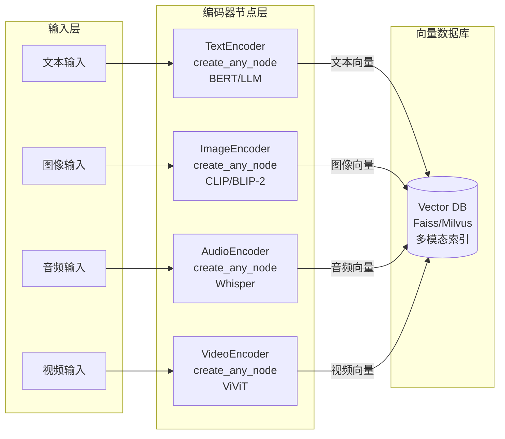

#### 6.1.1 文本编码器节点实现

```cpp
// 文本编码器节点：使用 Sentence Transformers 或 BERT
auto [text_encoder, _] = builder.create_any_node(
    "TextEncoder",
    {{"Input", "text"}},
    [&sentence_model](const std::unordered_map<std::string, std::any>& inputs) {
        std::string text = std::any_cast<std::string>(inputs.at("text"));
        
        // 调用 Sentence Transformers 模型
        std::vector<float> embedding = sentence_model.encode(text);
        
        // 归一化向量（用于余弦相似度）
        float norm = 0.0f;
        for (float val : embedding) {
            norm += val * val;
        }
        norm = std::sqrt(norm);
        for (float& val : embedding) {
            val /= norm;
        }
        
        return std::unordered_map<std::string, std::any>{
            {"embedding", std::any{embedding}},
            {"text", std::any{text}},  // 保留原始文本用于检索后展示
            {"modality", std::any{std::string("text")}}
        };
    },
    {"embedding", "text", "modality"}
);
```

#### 6.1.2 图像编码器节点实现

```cpp
// 图像编码器节点：使用 CLIP 或 BLIP-2
auto [image_encoder, _] = builder.create_any_node(
    "ImageEncoder",
    {{"Input", "image_data"}},
    [&clip_model](const std::unordered_map<std::string, std::any>& inputs) {
        std::string image_base64 = std::any_cast<std::string>(inputs.at("image_data"));
        
        // 解码 base64 图像
        cv::Mat image = decode_base64_image(image_base64);
        
        // 调用 CLIP 图像编码器
        std::vector<float> embedding = clip_model.encode_image(image);
        
        // 可选：生成图像描述（用于文本检索）
        std::string description = clip_model.generate_caption(image);
        
        // 归一化向量
        normalize_vector(embedding);
        
        return std::unordered_map<std::string, std::any>{
            {"embedding", std::any{embedding}},
            {"description", std::any{description}},
            {"image_data", std::any{image_base64}},
            {"modality", std::any{std::string("image")}}
        };
    },
    {"embedding", "description", "image_data", "modality"}
);
```

#### 6.1.3 音频编码器节点实现

```cpp
// 音频编码器节点：使用 Whisper
auto [audio_encoder, _] = builder.create_any_node(
    "AudioEncoder",
    {{"Input", "audio_data"}},
    [&whisper_model](const std::unordered_map<std::string, std::any>& inputs) {
        std::string audio_base64 = std::any_cast<std::string>(inputs.at("audio_data"));
        
        // 解码 base64 音频
        std::vector<float> audio_samples = decode_base64_audio(audio_base64);
        
        // Whisper 转写和编码
        std::string transcription = whisper_model.transcribe(audio_samples);
        std::vector<float> audio_embedding = whisper_model.encode_audio(audio_samples);
        
        // 可选：从转录文本生成文本嵌入（用于文本检索）
        std::vector<float> text_embedding = sentence_model.encode(transcription);
        
        normalize_vector(audio_embedding);
        normalize_vector(text_embedding);
        
        return std::unordered_map<std::string, std::any>{
            {"audio_embedding", std::any{audio_embedding}},
            {"text_embedding", std::any{text_embedding}},  // 用于跨模态检索
            {"transcription", std::any{transcription}},
            {"audio_data", std::any{audio_base64}},
            {"modality", std::any{std::string("audio")}}
        };
    },
    {"audio_embedding", "text_embedding", "transcription", "audio_data", "modality"}
);
```

#### 6.1.4 向量数据库存储节点

编码后的向量需要存储到向量数据库中，供后续检索使用：

```cpp
// 向量数据库存储节点（Sink）
auto [vector_store_sink, _] = builder.create_any_sink(
    "VectorStoreSink",
    {
        {"TextEncoder", "embedding"},
        {"ImageEncoder", "embedding"},
        {"AudioEncoder", "audio_embedding"}
    },
    [&vector_db](const std::unordered_map<std::string, std::any>& inputs) {
        // 收集所有模态的嵌入
        std::vector<std::pair<std::vector<float>, DocumentMetadata>> documents;
        
        if (inputs.find("embedding") != inputs.end()) {
            auto embedding = std::any_cast<std::vector<float>>(inputs.at("embedding"));
            std::string text = std::any_cast<std::string>(inputs.at("text"));
            std::string modality = std::any_cast<std::string>(inputs.at("modality"));
            
            DocumentMetadata meta;
            meta.modality = modality;
            meta.content = text;
            meta.timestamp = std::time(nullptr);
            
            documents.push_back({embedding, meta});
        }
        
        // 批量插入向量数据库
        vector_db.insert_batch(documents);
    }
);
```

编码后，所有向量存入统一的向量数据库（如 Faiss 或 Milvus），并将原始文档的引用信息存储在元数据中，便于检索后输出引用。系统还需要维护模态标签，以便在检索时根据用户的查询类型选择合适的编码器和相似度函数。

### 6.2 多模态检索与融合流程实现

在执行多模态查询时，工作流通过 KnowledgeBase Source 节点和检索节点实现。以下是详细的技术实现路线：

#### 6.2.1 查询编码节点实现

```cpp
// 查询编码节点：根据输入模态选择合适的编码器
auto [query_encoder, _] = builder.create_any_node(
    "QueryEncoder",
    {{"UserInput", "query"}, {"ImageInput", "image_data"}, {"AudioInput", "audio_data"}},
    [&text_encoder, &image_encoder, &audio_encoder](
        const std::unordered_map<std::string, std::any>& inputs
    ) {
        std::vector<std::pair<std::vector<float>, std::string>> query_vectors;
        
        // 文本查询编码
        if (inputs.find("query") != inputs.end()) {
            std::string text = std::any_cast<std::string>(inputs.at("query"));
            auto embedding = text_encoder.encode(text);
            query_vectors.push_back({embedding, "text"});
        }
        
        // 图像查询编码
        if (inputs.find("image_data") != inputs.end()) {
            std::string image = std::any_cast<std::string>(inputs.at("image_data"));
            auto embedding = image_encoder.encode_image(image);
            query_vectors.push_back({embedding, "image"});
        }
        
        // 音频查询编码
        if (inputs.find("audio_data") != inputs.end()) {
            std::string audio = std::any_cast<std::string>(inputs.at("audio_data"));
            auto embedding = audio_encoder.encode_audio(audio);
            query_vectors.push_back({embedding, "audio"});
        }
        
        return std::unordered_map<std::string, std::any>{
            {"query_vectors", std::any{query_vectors}},
            {"query_type", std::any{determine_query_type(inputs)}}
        };
    },
    {"query_vectors", "query_type"}
    );
```

#### 6.2.2 向量检索节点实现（基于 KnowledgeBase Source）

```cpp
// 知识库检索节点：查询向量数据库
auto [retriever, _] = builder.create_any_node(
    "VectorRetriever",
    {
        {"QueryEncoder", "query_vectors"},
        {"KnowledgeBase", "context"}  // 从 KnowledgeBase Source 节点获取上下文
    },
    [&vector_db](const std::unordered_map<std::string, std::any>& inputs) {
        auto query_vectors = std::any_cast<std::vector<std::pair<std::vector<float>, std::string>>>(
            inputs.at("query_vectors"));
        
        std::vector<RetrievalResult> all_results;
        const int top_k = 5;
        
        // 对每个查询向量执行检索
        for (const auto& [query_vec, modality] : query_vectors) {
            // 在向量数据库中检索（支持跨模态检索）
            auto results = vector_db.search(query_vec, top_k, modality);
            
            // 合并结果（去重并排序）
            for (const auto& result : results) {
                all_results.push_back(result);
            }
        }
        
        // 按相似度分数排序并去重
        std::sort(all_results.begin(), all_results.end(), 
            [](const RetrievalResult& a, const RetrievalResult& b) {
                return a.score > b.score;
            });
        
        // 去重（相同文档 ID 只保留最高分）
        std::unordered_map<std::string, RetrievalResult> unique_results;
        for (const auto& result : all_results) {
            if (unique_results.find(result.doc_id) == unique_results.end() ||
                unique_results[result.doc_id].score < result.score) {
                unique_results[result.doc_id] = result;
            }
        }
        
        // 转换为向量并返回前 top_k
        std::vector<RetrievalResult> final_results;
        for (const auto& [_, result] : unique_results) {
            final_results.push_back(result);
            if (final_results.size() >= top_k) break;
        }
        
        return std::unordered_map<std::string, std::any>{
            {"retrieved_docs", std::any{final_results}},
            {"count", std::any{static_cast<int>(final_results.size())}}
        };
    },
    {"retrieved_docs", "count"}
    );
```

#### 6.2.3 跨模态注意力融合节点实现

```cpp
// 跨模态注意力融合节点：对齐文本和图像/音频
auto [fusion_node, _] = builder.create_any_node(
    "CrossModalFusion",
    {{"VectorRetriever", "retrieved_docs"}},
    [&attention_model](const std::unordered_map<std::string, std::any>& inputs) {
        auto docs = std::any_cast<std::vector<RetrievalResult>>(
            inputs.at("retrieved_docs"));
        
        // 分离不同模态的文档
        std::vector<RetrievalResult> text_docs, image_docs, audio_docs;
        for (const auto& doc : docs) {
            if (doc.modality == "text") text_docs.push_back(doc);
            else if (doc.modality == "image") image_docs.push_back(doc);
            else if (doc.modality == "audio") audio_docs.push_back(doc);
        }
        
        // 跨模态注意力对齐
        std::vector<AlignedDocument> aligned_docs;
        
        // 文本-图像对齐
        for (const auto& text_doc : text_docs) {
            for (const auto& image_doc : image_docs) {
                float alignment_score = attention_model.compute_alignment(
                    text_doc.embedding, image_doc.embedding);
                
                if (alignment_score > 0.7f) {  // 阈值可配置
                    AlignedDocument aligned;
                    aligned.text = text_doc.content;
                    aligned.image = image_doc.content;
                    aligned.score = (text_doc.score + image_doc.score) / 2.0f;
                    aligned.score *= alignment_score;  // 加权
                    aligned_docs.push_back(aligned);
                }
            }
        }
        
        // 生成融合后的上下文摘要
        std::string fused_context = generate_fused_summary(aligned_docs);
        
        return std::unordered_map<std::string, std::any>{
            {"fused_context", std::any{fused_context}},
            {"aligned_docs", std::any{aligned_docs}},
            {"citations", std::any{extract_citations(aligned_docs)}}
        };
    },
    {"fused_context", "aligned_docs", "citations"}
    );
```

#### 6.2.4 融合策略实现

根据任务需求，可以选择不同的融合策略：

```cpp
// 融合策略选择节点
auto [fusion_strategy, _] = builder.create_condition_decl(
    "FusionStrategy",
    {{"QueryEncoder", "query_type"}},
    [](const std::unordered_map<std::string, std::any>& inputs) {
        std::string query_type = std::any_cast<std::string>(inputs.at("query_type"));
        
        // 根据查询类型选择融合策略
        if (query_type == "text_only") return 0;  // 早期融合
        else if (query_type == "multimodal_simple") return 1;  // 中期融合
        else return 2;  // 晚期融合
    },
    {
        // 分支 0: 早期融合（文本直接拼接）
        builder.create_subgraph("EarlyFusion", [](wf::GraphBuilder& gb) {
            // 直接拼接所有模态的文本描述
        }),
        // 分支 1: 中期融合（交叉注意力）
        builder.create_subgraph("IntermediateFusion", [](wf::GraphBuilder& gb) {
            // 使用 CrossModalFusion 节点
        }),
        // 分支 2: 晚期融合（分别检索后合并）
        builder.create_subgraph("LateFusion", [](wf::GraphBuilder& gb) {
            // 分别检索各模态，最后加权合并
        })
    },
    {"fused_context"}
);
```

**检索与融合流程总结**：

1. **查询编码**：根据用户输入的模态，调用相应编码器得到查询向量。对于组合查询，可以将不同模态的向量拼接或融合后进行检索。
2. **向量检索**：在向量数据库中执行相似度搜索，返回一组 (k 个) 最相关的文档。为了兼顾语义匹配和关键词精确度，可采用混合检索策略，通过语义搜索和符号搜索结合【253686691880274†L289-L292】。
3. **跨模态注意力**：如果检索到的文档包含多模态内容，需要通过跨模态注意力机制将文本与图片、音频之间建立对齐关系【253686691880274†L296-L299】。
4. **融合层**：将检索结果融合到统一的上下文向量或文本中，为 LLM 生成提供完整的语义信息。融合过程应考虑各模态的重要性，通过注意力或加权平均等策略平衡不同来源【253686691880274†L301-L304】。
5. **结果集成**：最终将融合后的多模态内容嵌入 LLM 提示词，或在模型生成后由后处理模块输出多模态解释（例如图文并茂的答案）。

### 6.3 融合策略与算法实现

如第二节所述，融合策略主要包括早期、中期、晚期和混合融合【219518602455228†L164-L170】。本框架通过条件节点和工作流组合实现灵活的融合策略选择：

```cpp
// 混合融合策略：在不同阶段采用不同的融合方式
auto [hybrid_fusion, _] = builder.create_any_node(
    "HybridFusion",
    {
        {"TextEncoder", "embedding"},
        {"ImageEncoder", "embedding"},
        {"AudioEncoder", "audio_embedding"},
        {"QueryEncoder", "query_vectors"}
    },
    [](const std::unordered_map<std::string, std::any>& inputs) {
        // 阶段1：早期融合（输入层）- 用于检索
        auto text_emb = std::any_cast<std::vector<float>>(inputs.at("embedding"));
        auto image_emb = std::any_cast<std::vector<float>>(inputs.at("embedding"));
        
        // 拼接向量用于检索（简单的早期融合）
        std::vector<float> early_fused;
        early_fused.insert(early_fused.end(), text_emb.begin(), text_emb.end());
        early_fused.insert(early_fused.end(), image_emb.begin(), image_emb.end());
        
        // 阶段2：中期融合（检索后）- 交叉注意力对齐
        // 通过 CrossModalFusion 节点实现
        
        // 阶段3：晚期融合（LLM 输入前）- 加权合并
        // 通过 Aggregator 节点实现
        
        return std::unordered_map<std::string, std::any>{
            {"early_fused", std::any{early_fused}},
            {"fusion_strategy", std::any{std::string("hybrid")}}
        };
    },
    {"early_fused", "fusion_strategy"}
);
```

**融合策略选择指南**：

* **早期融合**：适用于模态密切相关、数据量小的场景。实现简单，但计算复杂度高。
* **中期融合**：适用于图片描述和问答任务。通过 Q‑Former 或跨注意力层将视觉特征映射到语言空间，再由 LLM 生成答案。
* **晚期融合**：适用于检索任务。分别检索各模态结果，再由融合层根据查询意图合并或重排序。
* **混合融合**：在复杂场景下，早期用于检索，中期用于理解，晚期用于输出。

此外，工程实现应考虑数据稀缺、推理开销和训练策略。现有研究表明，单阶段训练和两阶段训练均可用于多模态模型；采用联合或协调嵌入可以更好地学习跨模态联系【803420306546639†L121-L127】。

## 七、实时输出与流式传输实现

### 7.1 SSE 和 WebSocket 技术选型

在 Web 环境下实现实时输出有多种技术方案。本框架支持 SSE 和 WebSocket 两种方式，根据应用场景选择：

| 特性 | SSE | WebSocket |
|------|-----|-----------|
| 协议 | HTTP/1.1 | WS/WSS |
| 方向 | 单向（服务器→客户端） | 全双工 |
| 实现复杂度 | 低 | 中 |
| 自动重连 | 支持 | 需手动实现 |
| 二进制数据 | 不支持 | 支持 |
| 适用场景 | 文本流式输出 | 实时双向交互、音频/视频 |

**SSE 的优势**【723136666980538†L480-L599】：
* **实现简单**：仅依赖标准 HTTP 协议，后端实现和部署成本低
* **自动重连**：浏览器自动处理连接断开和重连
* **防火墙友好**：使用标准 HTTP 端口 80/443
* **易于负载均衡**：可通过传统 HTTP 负载均衡器处理

**WebSocket 的优势**【825014821319660†L64-L109】：
* **全双工通信**：支持客户端主动发送数据
* **二进制支持**：可以传输音频、视频等二进制数据
* **低延迟**：协议开销小，延迟更低

**技术选型建议**：
- **纯文本流式输出**：优先使用 SSE，实现简单且足够
- **需要双向交互**：使用 WebSocket，支持用户中断、实时反馈
- **音频/视频传输**：必须使用 WebSocket 或 WebRTC

### 7.2 流式输出架构设计

在我们的代理框架中，LLM 节点和工具节点通过回调机制支持流式输出：

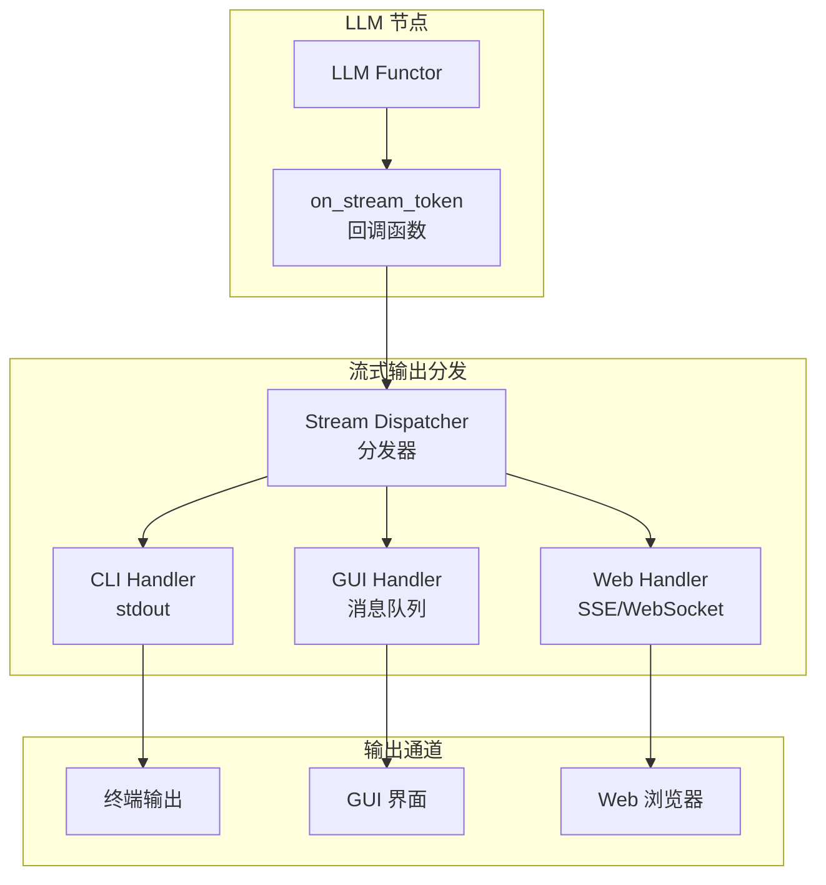

#### 7.2.1 流式输出回调机制实现

```cpp
// 流式输出分发器
class StreamDispatcher {
private:
    std::vector<std::function<void(std::string_view)>> handlers_;
    std::mutex handlers_mutex_;
    
public:
    void register_handler(std::function<void(std::string_view)> handler) {
        std::lock_guard<std::mutex> lock(handlers_mutex_);
        handlers_.push_back(handler);
    }
    
    void dispatch(std::string_view token) {
        std::lock_guard<std::mutex> lock(handlers_mutex_);
        for (auto& handler : handlers_) {
            handler(token);  // 同步调用所有处理器
        }
    }
};

// 在 LLM 节点中使用
StreamDispatcher dispatcher;

// 注册多个输出处理器
dispatcher.register_handler([](std::string_view token) {
    std::cout << token << std::flush;  // CLI 输出
});

dispatcher.register_handler([&gui_queue](std::string_view token) {
    gui_queue.push("STREAM:" + std::string(token));  // GUI 输出
});

dispatcher.register_handler([&sse_connections](std::string_view token) {
    for (auto& conn : sse_connections) {
        send_sse_message(conn, "data: " + std::string(token) + "\n\n");
    }
});

// LLM 节点的流式回调
std::function<void(std::string_view)> on_stream = 
    [&dispatcher](std::string_view token) {
        dispatcher.dispatch(token);  // 分发到所有处理器
    };
```

#### 7.2.2 SSE 服务器实现

```cpp
#include <httplib.h>

httplib::Server srv;
std::unordered_map<std::string, httplib::Response*> active_connections;

// SSE 端点
srv.Get("/api/stream/:session_id", [&](const httplib::Request& req, httplib::Response& res) {
    std::string session_id = req.matches[1];
    
    // 设置 SSE 响应头
    res.set_header("Content-Type", "text/event-stream");
    res.set_header("Cache-Control", "no-cache");
    res.set_header("Connection", "keep-alive");
    res.set_header("Access-Control-Allow-Origin", "*");
    
    // 保存连接（用于后续推送）
    active_connections[session_id] = &res;
    
    // 发送初始连接确认
    res.set_content("data: {\"type\":\"connected\"}\n\n", "text/event-stream");
    res.flush();
    
    // 保持连接（在实际实现中，这应该在后台线程中处理）
    // 这里简化处理，实际需要使用异步 I/O
});

// SSE 消息发送函数
void send_sse_message(const std::string& session_id, const std::string& data) {
    if (active_connections.find(session_id) != active_connections.end()) {
        auto* res = active_connections[session_id];
        res->set_content("data: " + data + "\n\n", "text/event-stream");
        res->flush();
    }
}

// 在 Sink 节点中推送流式数据
auto [sse_sink, _] = builder.create_any_sink(
    "SSESink",
    {{"LLM", "final_answer"}},
    [&](const std::unordered_map<std::string, std::any>& outputs) {
        // 最终结果推送（流式输出通过回调处理）
    }
);
```

#### 7.2.3 WebSocket 服务器实现

```cpp
#include <websocketpp/config/asio_no_tls.hpp>
#include <websocketpp/server.hpp>

typedef websocketpp::server<websocketpp::config::asio> server_t;
server_t ws_server;

std::unordered_map<std::string, websocketpp::connection_hdl> ws_connections;

// WebSocket 连接处理
ws_server.set_message_handler([&](websocketpp::connection_hdl hdl, server_t::message_ptr msg) {
    // 处理客户端消息（如中断信号）
    std::string payload = msg->get_payload();
    json message = json::parse(payload);
    
    if (message["type"] == "interrupt") {
        // 中断当前 LLM 生成
        interrupt_llm_generation(message["session_id"]);
    }
});

// WebSocket 消息发送函数
void send_ws_message(const std::string& session_id, const json& data) {
    if (ws_connections.find(session_id) != ws_connections.end()) {
        auto hdl = ws_connections[session_id];
        ws_server.send(hdl, data.dump(), websocketpp::frame::opcode::text);
    }
}

// 音频数据推送（二进制）
void send_ws_audio(const std::string& session_id, const std::vector<uint8_t>& audio_data) {
    if (ws_connections.find(session_id) != ws_connections.end()) {
        auto hdl = ws_connections[session_id];
        ws_server.send(hdl, audio_data.data(), audio_data.size(), 
                       websocketpp::frame::opcode::binary);
    }
}
```

#### 7.2.4 中断与控制机制

在音频输入场景下，代理需要在 LLM 节点接收用户的中断信号，立即停止当前生成并重新规划【621311804125779†L245-L258】：

```cpp
// 中断控制管理器
class InterruptManager {
private:
    std::atomic<bool> interrupt_flag_{false};
    std::string interrupt_session_id_;
    std::mutex mutex_;
    
public:
    void request_interrupt(const std::string& session_id) {
        std::lock_guard<std::mutex> lock(mutex_);
        interrupt_flag_ = true;
        interrupt_session_id_ = session_id;
    }
    
    bool should_interrupt(const std::string& session_id) {
        std::lock_guard<std::mutex> lock(mutex_);
        return interrupt_flag_ && interrupt_session_id_ == session_id;
    }
    
    void clear_interrupt() {
        std::lock_guard<std::mutex> lock(mutex_);
        interrupt_flag_ = false;
        interrupt_session_id_.clear();
    }
};

// 在 LLM 节点的流式回调中检查中断
std::function<void(std::string_view)> on_stream_with_interrupt = 
    [&dispatcher, &interrupt_manager, session_id](std::string_view token) {
        if (interrupt_manager.should_interrupt(session_id)) {
            // 停止生成并返回
            return;
        }
        dispatcher.dispatch(token);
    };
```

**流式输出设计总结**：

1. **分块输出**：在 LLM 调用过程中，每生成一个 token 就立即通过回调推送到前端。
2. **Sink 节点**：通过 `create_any_sink` 定义终端节点，内部实现 SSE 或 WebSocket 推送逻辑。
3. **客户端处理**：前端通过事件流监听器逐步显示收到的 token，实现流畅的用户体验。
4. **中断与控制**：支持用户中断当前生成，立即停止并重新规划。

SSE 的实现还需要处理浏览器同时连接数限制（通常为 6），因此在前端需要复用连接或对会话进行排队【723136666980538†L549-L551】。对于需要双向实时交互的场景，可在后端提供同时支持 SSE 和 WebSocket 的接口，由前端根据需求选择连接方式。

## 八、基于 workflow 构建代理工作流

### 8.1 总体架构

结合第二节的代理工作流原则和第三节的 workflow 特性，我们设计了如下多模态智能代理框架。该框架基于 Taskflow `workflow` 的声明式 API，通过键值驱动的数据流实现所有模块的连接：

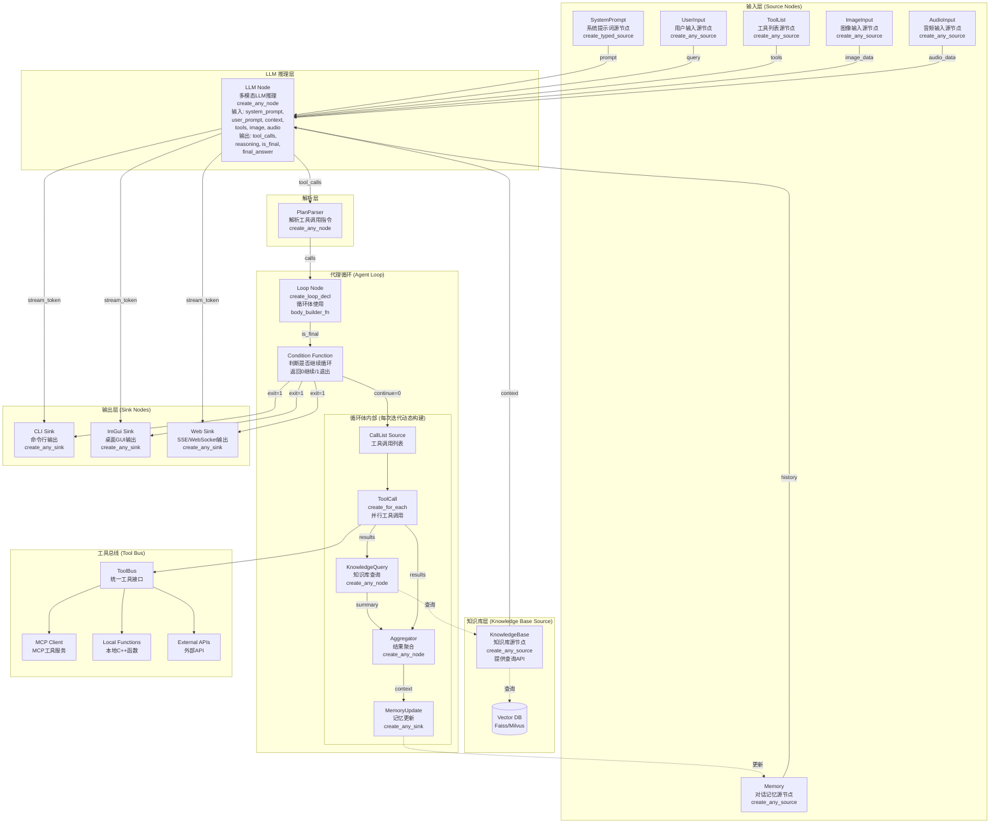

框架分为以下部分：

1. **Source 节点层**：通过 `create_typed_source` 或 `create_any_source` 提供初始数据。包括：
   - **SystemPrompt**：系统提示词（角色定义）
   - **UserInput**：用户输入（问题或指令）
   - **Memory**：对话记忆（短期和长期）
   - **ToolList**：工具列表（从 ToolBus 导出）
   - **ImageInput/AudioInput**：多模态输入（可选）
   - **KnowledgeBase**：**知识库作为 Source 节点，提供查询 API**，任何节点都可以通过 `input_specs` 引用其输出

2. **LLM 节点**：使用 `create_any_node` 创建，接收多个输入并输出推理结果。输入包括：
   - `system_prompt`：系统提示词
   - `user_prompt`：用户提示词
   - `context`：知识库检索结果
   - `tools`：可用工具列表
   - `image_data`/`audio_data`：多模态输入（可选）
   
   输出包括：
   - `tool_calls`：工具调用列表
   - `reasoning`：中间推理
   - `is_final`：是否完成标志
   - `final_answer`：最终答案

3. **PlanParser 节点**：使用 `create_any_node` 解析 LLM 输出的工具调用指令，生成 `CallSpec` 列表。

4. **循环子图 (Agent Loop)**：使用 `create_loop_decl` 构建，**循环体通过 `body_builder_fn` 在每次迭代时动态构建子图**。循环体包含：
   - 工具调用列表源节点
   - 并行工具调用节点（`create_for_each`）
   - 知识库查询节点
   - 聚合节点
   - 记忆更新节点

5. **工具调用节点**：使用 `create_for_each` 并行调用工具，通过 ToolBus 统一接口路由到本地函数、MCP 服务或外部 API。

6. **知识库查询节点**：可以查询 KnowledgeBase Source 节点，获取额外的上下文信息。

7. **Sink 节点**：使用 `create_any_sink` 创建，支持回调函数实时处理输出，适配 CLI、ImGui 和 Web 客户端。

### 8.2 循环子图实现（基于 workflow API）

循环体是代理逻辑的核心，需要在每次迭代中动态构建子图并并行调用多个工具。我们利用 `create_loop_decl` 提供的 `body_builder_fn` 在每次迭代时动态构建子图。**重要**：循环体使用 `body_builder_fn` 参数，该函数接收 `GraphBuilder&` 和输入数据，在每次迭代时重建子图，避免状态污染。

#### 8.2.1 完整的循环子图实现

```cpp
#include <workflow/nodeflow.hpp>
#include <taskflow/taskflow.hpp>
#include <nlohmann/json.hpp>

namespace wf = workflow;
using json = nlohmann::json;

// 全局组件（通过引用捕获）
ToolBus toolbus;
KnowledgeBase knowledge_base;  // 向量数据库封装
MemoryStore memory_store;

// 循环迭代计数器（用于防止死循环）
static int loop_iteration = 0;
const int MAX_ITERATIONS = 10;

// 创建代理循环
    auto [loop_node, loop_task] = builder.create_loop_decl(
        "AgentLoop",
    // input_specs: 从 LLM 和 PlanParser 获取输入（自动建立依赖）
    {
        {"LLM", "is_final"},           // LLM 输出的完成标志
        {"PlanParser", "calls"},      // 工具调用列表
        {"LLM", "reasoning"},          // LLM 推理过程
        {"LLM", "final_answer"},       // 最终答案
        {"Memory", "history"}         // 对话历史
    },
    // body_builder_fn: 循环体构建函数（每次迭代执行）
    [&toolbus, &knowledge_base, &memory_store](
        wf::GraphBuilder& gb, 
        const std::unordered_map<std::string, std::any>& inputs
    ) {
        // 1. 提取本轮工具调用列表
        auto call_specs = std::any_cast<std::vector<CallSpec>>(inputs.at("calls"));
        
        // 2. 创建工具调用列表源节点（在循环体内）
        auto [call_list_src, _] = gb.create_any_source(
            "CallList",
            std::unordered_map<std::string, std::any>{
                {"list", std::any{call_specs}}
            }
        );
        
        // 3. 并行调用工具（使用 create_for_each）
        // 共享状态：用于收集工具返回结果（线程安全）
        std::shared_ptr<std::vector<json>> shared_results = 
            std::make_shared<std::vector<json>>();
        std::mutex results_mutex;
        
        auto [tool_call_node, _] = gb.create_for_each<std::vector<CallSpec>>(
            "ToolCall",
            {{"CallList", "list"}},  // 输入：工具调用列表
            [&toolbus, shared_results, &results_mutex](
                const CallSpec& spec,
                std::unordered_map<std::string, std::any>& shared_params
            ) {
                // 调用工具（通过 ToolBus 统一接口）
                json result;
                try {
                    result = toolbus.call_tool(spec.name, spec.arguments);
                    result["success"] = true;
                    result["tool_name"] = spec.name;
                } catch (const std::exception& e) {
                    result = json{
                        {"success", false},
                        {"tool_name", spec.name},
                        {"error", e.what()}
                    };
                }
                
                // 写入共享结果（线程安全）
                {
                    std::lock_guard<std::mutex> lock(results_mutex);
                    shared_results->push_back(result);
                }
            },
            {}  // 无输出键（使用共享状态）
        );
        
        // 4. 创建共享结果源节点（供后续节点使用）
        auto [results_src, _] = gb.create_any_source(
            "ToolResults",
            [shared_results]() {
                return std::unordered_map<std::string, std::any>{
                    {"results", std::any{*shared_results}}
                };
            }
        );
        
        // 5. 知识库查询节点（查询 KnowledgeBase Source 节点）
        auto [kb_query_node, _] = gb.create_any_node(
            "KnowledgeQuery",
            {
                {"ToolResults", "results"},
                {"KnowledgeBase", "context"}  // 从知识库 Source 节点查询
            },
            [&knowledge_base](const std::unordered_map<std::string, std::any>& inputs) {
                auto results = std::any_cast<std::vector<json>>(inputs.at("results"));
                
                // 从工具结果中提取查询关键词
                std::string query = extract_query_from_tool_results(results);
                
                // 执行多模态检索（文本、图像、音频）
                auto kb_results = knowledge_base.search(query, /*top_k=*/5);
                
                // 生成摘要
                std::string summary = knowledge_base.summarize(kb_results);
                
                return std::unordered_map<std::string, std::any>{
                    {"summary", std::any{summary}},
                    {"raw_results", std::any{kb_results}},
                    {"citations", std::any{extract_citations(kb_results)}}
                };
            },
            {"summary", "raw_results", "citations"}
        );
        
        // 6. 聚合节点：合并工具结果、知识检索结果和 LLM 推理
        auto [agg_node, _] = gb.create_any_node(
                "Aggregator",
            {
                {"LLM", "reasoning"},          // LLM 推理过程
                {"ToolResults", "results"},     // 工具调用结果
                {"KnowledgeQuery", "summary"},  // 知识库检索摘要
                {"Memory", "history"}           // 对话历史
            },
            [](const std::unordered_map<std::string, std::any>& inputs) {
                std::string reasoning = std::any_cast<std::string>(inputs.at("reasoning"));
                auto tool_results = std::any_cast<std::vector<json>>(inputs.at("results"));
                std::string kb_summary = std::any_cast<std::string>(inputs.at("summary"));
                std::string history = std::any_cast<std::string>(inputs.at("history"));
                
                // 构建新的上下文
                std::ostringstream new_context;
                new_context << "Previous reasoning: " << reasoning << "\n\n";
                new_context << "Tool results:\n";
                for (const auto& res : tool_results) {
                    new_context << "- " << res["tool_name"] << ": " 
                                << res.dump() << "\n";
                }
                new_context << "\nKnowledge base summary:\n" << kb_summary;
                new_context << "\n\nConversation history:\n" << history;
                
                return std::unordered_map<std::string, std::any>{
                    {"context", std::any{new_context.str()}}
                };
                },
                {"context"}
            );
        
        // 7. 更新记忆节点（Sink）
        auto [mem_update, _] = gb.create_any_sink(
            "MemoryUpdate",
            {{"Aggregator", "context"}},
            [&memory_store](const std::unordered_map<std::string, std::any>& inputs) {
                std::string new_context = std::any_cast<std::string>(inputs.at("context"));
                memory_store.append_to_history(new_context);
                }
            );
        },
    // condition_func: 返回 0 继续循环，非 0 退出
    [](const std::unordered_map<std::string, std::any>& inputs) -> int {
            bool is_final = std::any_cast<bool>(inputs.at("is_final"));
        loop_iteration++;
        
        if (is_final || loop_iteration >= MAX_ITERATIONS) {
            return 1;  // 退出循环
        }
        return 0;  // 继续循环
    },
    // exit_builder_fn: 退出时执行
    [](wf::GraphBuilder& gb, const std::unordered_map<std::string, std::any>& inputs) {
        // 创建最终输出 Sink
            gb.create_any_sink(
                "FinalOutput",
            {{"LLM", "final_answer"}, {"LLM", "audio_out"}},
            [](const std::unordered_map<std::string, std::any>& outputs) {
                std::string answer = std::any_cast<std::string>(outputs.at("final_answer"));
                
                // 输出到不同渠道
                std::cout << "Final Answer: " << answer << std::endl;
                
                if (outputs.find("audio_out") != outputs.end()) {
                    std::string audio = std::any_cast<std::string>(outputs.at("audio_out"));
                    // 处理音频输出
                    save_audio_to_file(audio, "output.wav");
                }
                }
            );
        },
    {"context"}  // 循环的输出键（可选）
    );
```

#### 8.2.2 循环体执行流程图

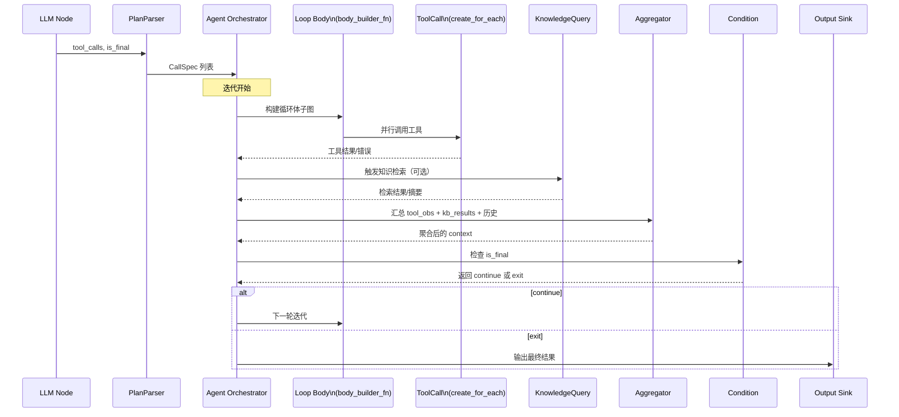

**关键设计要点**：

1. **动态子图构建**：循环体使用 `body_builder_fn` 在每次迭代时重建子图，支持动态工具列表变化。这与 `create_subtask` 类似，但 `create_loop_decl` 提供了更完善的循环控制（条件判断、退出处理）。

2. **并行工具调用**：使用 `create_for_each` 并行调用所有工具，通过共享状态（shared state）收集结果，使用互斥锁保证线程安全。

3. **知识库 Source 节点查询**：KnowledgeQuery 节点通过 `input_specs` 引用 KnowledgeBase Source 节点，实现统一的查询接口。

4. **条件判断**：`condition_func` 根据 `is_final` 标志和迭代次数决定是否退出循环。

5. **退出处理**：`exit_builder_fn` 在循环退出时执行，输出最终结果。

6. **自动依赖**：循环体内的节点依赖关系通过 `input_specs` 自动建立，无需手动配置。

在此实现中，循环体从 `Parser` 节点接收工具调用列表，将其传入 for_each 节点并行执行。工具结果通过共享状态暂存，然后调用 KnowledgeQuery 节点检索新知识，再由 Aggregator 节点合并生成新的上下文。条件函数检查 LLM 是否已输出最终答案，若未完成则继续循环。本框架的并行工具调用利用 Taskflow 的并行算法，自动使用工作窃取调度多个线程执行任务【201813784348343†L193-L210】。

### 8.3 完整的端到端工作流构建示例

以下展示如何使用 Taskflow `workflow` 的声明式 API 构建完整的代理工作流。所有代码示例基于实际的 `workflow` API 实现：

#### 8.3.1 创建源节点（Source Nodes）

源节点负责注入初始数据，包括系统提示词、用户输入、对话记忆、工具列表和多模态输入：

```cpp
#include <workflow/nodeflow.hpp>
#include <taskflow/taskflow.hpp>
#include <nlohmann/json.hpp>
#include <iostream>
#include <memory>
#include <vector>

namespace wf = workflow;
using json = nlohmann::json;

// 全局组件（通过引用捕获）
ToolBus toolbus;
KnowledgeBase knowledge_base;  // 向量数据库封装
MemoryStore memory_store;
LLMClient llm_client;

int main() {
    // 1. 创建执行器和图构建器
    tf::Executor executor(std::thread::hardware_concurrency());  // 多线程执行器
    wf::GraphBuilder builder("agent_workflow");

    // 2. 初始化 ToolBus（注册工具）
    toolbus.register_local_tool("calculate", /* ... */);
    toolbus.register_mcp_service("filesystem", "stdio", /* ... */);

    // 3. 系统提示词源节点（Typed Source，类型安全）
    auto [sys_node, tSys] = builder.create_typed_source(
        "SystemPrompt",
        std::make_tuple(std::string("你是一名资深航天专家，擅长卫星设计和无线电传播分析。")),
        {"prompt"}
    );

    // 4. 用户输入源节点（Any Source，更灵活）
    auto [user_node, tUser] = builder.create_any_source(
        "UserInput",
        std::unordered_map<std::string, std::any>{
            {"query", std::any{std::string("查询北斗三号卫星的轨道参数")}}
        }
    );

    // 5. 对话记忆源节点（从持久化存储加载）
    auto [mem_node, tMem] = builder.create_any_source(
        "Memory",
        [&memory_store]() {
            std::string context = memory_store.retrieve_short_term();  // 获取最近N轮对话
            return std::unordered_map<std::string, std::any>{
                {"history", std::any{context}}
            };
        }
    );

    // 6. 工具列表源节点（从 ToolBus 导出工具 Schema）
    auto [tools_node, tTools] = builder.create_any_source(
        "ToolList",
        [&toolbus]() {
            auto tool_list = toolbus.export_as_llm_tools();
            return std::unordered_map<std::string, std::any>{
                {"tools", std::any{tool_list}}
            };
        }
    );

    // 7. 知识库源节点（提供查询 API）
    auto [kb_node, tKB] = builder.create_any_source(
        "KnowledgeBase",
        [&knowledge_base, &user_query]() {
            // 知识库作为 Source 节点，根据用户查询执行检索
            std::string query = extract_query_from_context(user_query);
            auto results = knowledge_base.search(query, /*top_k=*/5);
            std::string context_summary = knowledge_base.summarize(results);
            
            return std::unordered_map<std::string, std::any>{
                {"context", std::any{context_summary}},
                {"raw_results", std::any{results}},
                {"citations", std::any{extract_citations(results)}}
            };
        }
    );

    // 8. 可选：多模态输入源节点
    auto [img_node, tImg] = builder.create_any_source(
        "ImageInput",
        [](const std::string& image_path) {
            std::string base64_data = encode_image_to_base64(image_path);
            return std::unordered_map<std::string, std::any>{
                {"image_data", std::any{base64_data}}
            };
        }
    );
```

#### 8.3.2 创建 LLM 节点

LLM 节点是代理的核心决策节点，接收多个输入并输出推理结果：

```cpp
    // 9. 创建 LLM 节点（接收多源输入）
    std::function<void(std::string_view)> on_stream_token = 
        [&output_queue](std::string_view token) {
            // 实时推送到输出队列（线程安全）
            output_queue.push(std::string(token));
            // 如果使用 SSE，立即发送：sse_send(token);
        };

    auto [llm_node, tLLM] = builder.create_any_node(
        "LLM", 
        // input_specs: 自动建立依赖关系
        {
            {"SystemPrompt", "prompt"},      // 系统提示词
            {"UserInput", "query"},          // 用户输入
            {"Memory", "history"},           // 对话历史
            {"ToolList", "tools"},           // 工具列表
            {"KnowledgeBase", "context"}      // 知识库检索结果
            // ImageInput 和 AudioInput 是可选的，使用条件判断
        },
        // Functor: 接收输入并调用 LLM
        [&llm_client, on_stream](const std::unordered_map<std::string, std::any>& inputs) {
            // 1. 提取输入数据
            LLMInput llm_input;
            llm_input.system_prompt = std::any_cast<std::string>(inputs.at("prompt"));
            llm_input.user_prompt = std::any_cast<std::string>(inputs.at("query"));
            llm_input.context = std::any_cast<std::string>(inputs.at("context"));
            llm_input.tools = std::any_cast<std::vector<ToolMeta>>(inputs.at("tools"));
            
            // 2. 处理可选的多模态输入
            if (inputs.find("image_data") != inputs.end()) {
                llm_input.image_data = std::any_cast<std::string>(inputs.at("image_data"));
            }
            
            // 3. 调用 LLM（支持流式输出）
            LLMOutput output = llm_client.invoke(llm_input, on_stream);
            
            // 4. 返回输出（自动转换为 shared_future<any>）
            return std::unordered_map<std::string, std::any>{
                {"tool_calls", std::any{output.tool_calls}},
                {"reasoning", std::any{output.reasoning}},
                {"is_final", std::any{output.is_final}},
                {"final_answer", std::any{output.final_answer}},
                {"audio_out", std::any{output.audio_out.value_or("")}}
            };
        },
        // output_keys: 后续节点通过这些键访问输出
        {"tool_calls", "reasoning", "is_final", "final_answer", "audio_out"}
    );
```

#### 8.3.3 创建 PlanParser 节点

PlanParser 节点解析 LLM 输出的工具调用指令，生成 `CallSpec` 列表：

```cpp
    // 10. 创建 PlanParser 节点
    auto [parser_node, tParser] = builder.create_any_node(
        "PlanParser",
        {{"LLM", "tool_calls"}},  // 从 LLM 节点获取工具调用列表
        [](const std::unordered_map<std::string, std::any>& inputs) {
            auto calls_json = std::any_cast<std::vector<json>>(inputs.at("tool_calls"));
            std::vector<CallSpec> specs;
            
            for (const auto& c : calls_json) {
                CallSpec spec;
                spec.name = c["function"]["name"].get<std::string>();
                if (c["function"]["arguments"].is_string()) {
                    spec.arguments = json::parse(c["function"]["arguments"].get<std::string>());
                } else {
                    spec.arguments = c["function"]["arguments"];
                }
                specs.push_back(spec);
            }
            
            return std::unordered_map<std::string, std::any>{
                {"calls", std::any{specs}}
            };
        },
        {"calls"}
    );
```

#### 8.3.4 构建代理循环（Agent Loop）

代理循环是框架的核心，使用 `create_loop_decl` 构建，循环体在每次迭代时动态构建子图：

```cpp
    // 11. 创建代理循环（见 7.2 节的完整实现）
    static int loop_iteration = 0;
    const int MAX_ITERATIONS = 10;
    
    auto [loop_node, loop_task] = builder.create_loop_decl(
        "AgentLoop",
        {
            {"LLM", "is_final"},
            {"PlanParser", "calls"},
            {"LLM", "reasoning"},
            {"LLM", "final_answer"},
            {"Memory", "history"}
        },
        // body_builder_fn: 循环体构建函数（每次迭代执行）
        [&toolbus, &knowledge_base, &memory_store](
            wf::GraphBuilder& gb, 
            const std::unordered_map<std::string, std::any>& inputs
        ) {
            // 循环体实现（见 7.2.1 节）
            // ... 工具调用、知识检索、聚合、记忆更新 ...
        },
        // condition_func: 返回 0 继续循环，非 0 退出
        [](const std::unordered_map<std::string, std::any>& inputs) -> int {
            bool is_final = std::any_cast<bool>(inputs.at("is_final"));
            loop_iteration++;
            
            if (is_final || loop_iteration >= MAX_ITERATIONS) {
                return 1;  // 退出循环
            }
            return 0;  // 继续循环
        },
        // exit_builder_fn: 退出时执行
        [](wf::GraphBuilder& gb, const std::unordered_map<std::string, std::any>& inputs) {
            // 创建最终输出 Sink
            gb.create_any_sink(
                "FinalOutput",
                {{"LLM", "final_answer"}, {"LLM", "audio_out"}},
                [](const std::unordered_map<std::string, std::any>& outputs) {
                    std::string answer = std::any_cast<std::string>(outputs.at("final_answer"));
                    std::cout << "Final Answer: " << answer << std::endl;
                    
                    if (outputs.find("audio_out") != outputs.end()) {
                        std::string audio = std::any_cast<std::string>(outputs.at("audio_out"));
                        save_audio_to_file(audio, "output.wav");
                    }
                }
            );
        },
        {"context"}
    );

    // 12. 创建输出 Sink 节点（CLI、ImGui、Web）
    auto [cli_sink, _] = builder.create_any_sink(
        "CLISink",
        {{"LLM", "final_answer"}},
        [](const std::unordered_map<std::string, std::any>& outputs) {
            std::string answer = std::any_cast<std::string>(outputs.at("final_answer"));
            std::cout << answer << std::flush;
        }
    );

    // 13. 执行工作流
    std::cout << "Starting agent workflow..." << std::endl;
    builder.run(executor);
    
    // 14. 可选：输出图结构（用于调试）
    builder.dump(std::cout);
    
    return 0;
}
```

### 8.4 回溯和记忆管理

代理的记忆系统由 Memory 节点和事件日志组成。根据事件溯源模式，每次节点执行的输入、输出以及中间状态都作为事件写入不可变的日志【269917138825994†L140-L165】。Memory 节点负责从日志中读取相关历史并在下一轮提供给 LLM 节点。记忆分为：

1. **即时记忆（per request）**：在当前请求范围内保存从用户输入到每一次工具调用产生的事件，为每个节点执行提供完整的上游数据【269917138825994†L151-L156】。
2. **短期记忆（per conversation）**：在对话过程中保存上下文，使代理能够跨轮次理解历史。例如，记录用户提问、LLM 回答和工具调用结果，以便推理模型理解语境【269917138825994†L159-L163】。
3. **长期记忆（knowledge base）**：将重要的事件摘要或结果存入知识库，用于后续会话或其他代理使用。这可以通过 VectorStoreRetriever 实现，将摘要向量化并存储。

为了保证性能，Memory 节点应对长对话进行窗口截断或摘要压缩，避免提示过长导致生成成本上升。可以借鉴 Dify 的 Memory Window 机制，根据模型上下文窗口大小动态裁剪历史【449621660025648†L315-L320】。

### 8.5 MCP 工具集成与 ToolBus 设计

MCP (Model Context Protocol) 是一个开放标准，允许 LLM 应用与外部工具和服务集成。本框架通过 **ToolBus** 模块统一管理本地函数、MCP 服务和外部 API，为代理提供统一的工具调用接口。

#### 8.5.1 ToolBus 架构设计

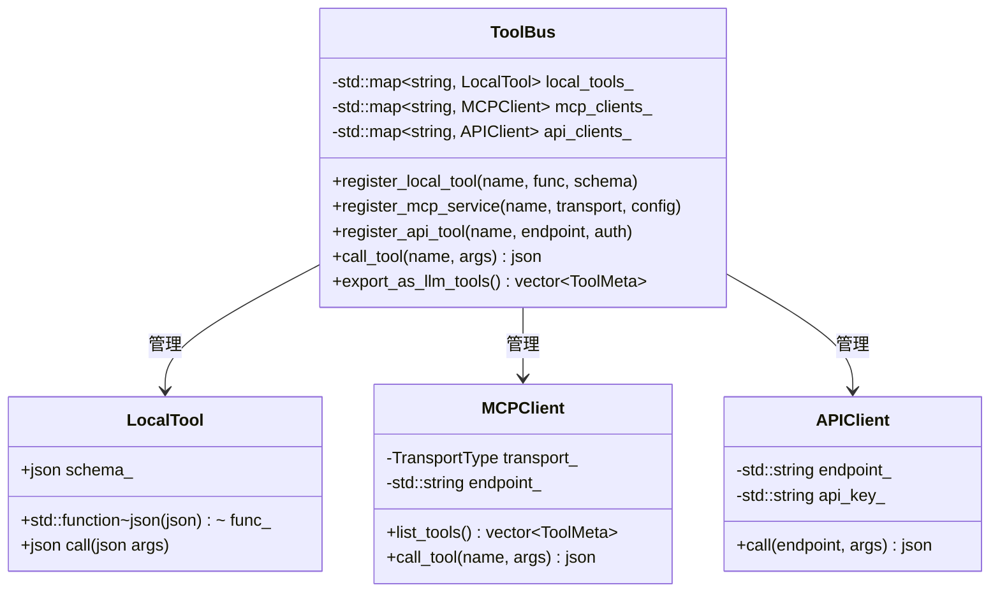

#### 8.5.2 ToolBus 实现示例

```cpp
#include <nlohmann/json.hpp>
#include <functional>
#include <map>
#include <memory>
#include <string>

using json = nlohmann::json;

// 本地工具接口
struct LocalTool {
    std::function<json(const json&)> func;
    json schema;  // JSON Schema 描述
    std::string description;
};

// MCP 客户端（简化版）
class MCPClient {
private:
    enum class TransportType { STDIO, HTTP, WEBSOCKET };
    TransportType transport_;
    std::string endpoint_;
    
public:
    std::vector<ToolMeta> list_tools() {
        // 发送 MCP tools/list 请求
        json request = {
            {"jsonrpc", "2.0"},
            {"id", 1},
            {"method", "tools/list"}
        };
        json response = send_mcp_request(request);
        
        // 解析工具列表
        std::vector<ToolMeta> tools;
        for (const auto& tool : response["result"]["tools"]) {
            ToolMeta meta;
            meta.name = tool["name"];
            meta.schema = tool["inputSchema"];
            meta.description = tool["description"];
            tools.push_back(meta);
        }
        return tools;
    }
    
    json call_tool(const std::string& name, const json& arguments) {
        json request = {
            {"jsonrpc", "2.0"},
            {"id", 1},
            {"method", "tools/call"},
            {"params", {
                {"name", name},
                {"arguments", arguments}
            }}
        };
        json response = send_mcp_request(request);
        return response["result"]["content"][0]["text"];  // 提取结果文本
    }
    
private:
    json send_mcp_request(const json& request) {
        // 根据 transport_ 类型发送请求（stdio/HTTP/WebSocket）
        // 简化实现，实际需要处理连接管理和错误重试
        return json{};  // 占位符
    }
};

// ToolBus 主类
class ToolBus {
private:
    std::map<std::string, LocalTool> local_tools_;
    std::map<std::string, std::unique_ptr<MCPClient>> mcp_clients_;
    
public:
    // 注册本地 C++ 函数
    void register_local_tool(
        const std::string& name,
        std::function<json(const json&)> func,
        const json& schema,
        const std::string& description
    ) {
        local_tools_[name] = {func, schema, description};
    }
    
    // 注册 MCP 服务
    void register_mcp_service(
        const std::string& service_name,
        const std::string& transport,
        const json& config
    ) {
        auto client = std::make_unique<MCPClient>();
        // 配置客户端（transport, endpoint 等）
        mcp_clients_[service_name] = std::move(client);
    }
    
    // 调用工具（统一接口）
    json call_tool(const std::string& name, const json& arguments) {
        // 1. 检查是否为本地工具
        if (local_tools_.find(name) != local_tools_.end()) {
            return local_tools_[name].func(arguments);
        }
        
        // 2. 检查是否为 MCP 工具
        for (auto& [service_name, client] : mcp_clients_) {
            auto tools = client->list_tools();
            for (const auto& tool : tools) {
                if (tool.name == name) {
                    return client->call_tool(name, arguments);
                }
            }
        }
        
        throw std::runtime_error("Tool not found: " + name);
    }
    
    // 导出所有工具供 LLM 使用
    std::vector<ToolMeta> export_as_llm_tools() {
        std::vector<ToolMeta> all_tools;
        
        // 导出本地工具
        for (const auto& [name, tool] : local_tools_) {
            ToolMeta meta;
            meta.name = name;
            meta.schema = tool.schema;
            meta.description = tool.description;
            all_tools.push_back(meta);
        }
        
        // 导出 MCP 工具
        for (auto& [service_name, client] : mcp_clients_) {
            auto mcp_tools = client->list_tools();
            all_tools.insert(all_tools.end(), mcp_tools.begin(), mcp_tools.end());
        }
        
        return all_tools;
    }
};
```

#### 8.5.3 在 workflow 中使用 ToolBus

ToolBus 通过 Source 节点提供工具列表，并在循环体内的工具调用节点中使用：

```cpp
// 1. 创建 ToolBus 并注册工具
ToolBus toolbus;

// 注册本地函数（例如：计算器）
toolbus.register_local_tool(
    "calculate",
    [](const json& args) -> json {
        double a = args["a"].get<double>();
        double b = args["b"].get<double>();
        std::string op = args["op"].get<std::string>();
        
        double result = 0;
        if (op == "+") result = a + b;
        else if (op == "-") result = a - b;
        else if (op == "*") result = a * b;
        else if (op == "/") result = a / b;
        
        return json{{"result", result}};
    },
    json{
        {"type", "object"},
        {"properties", {
            {"a", {{"type", "number"}}},
            {"b", {{"type", "number"}}},
            {"op", {{"type", "string"}, {"enum", {"+", "-", "*", "/"}}}}
        }},
        {"required", {"a", "b", "op"}}
    },
    "Perform basic arithmetic operations"
);

// 注册 MCP 服务（例如：文件系统操作）
toolbus.register_mcp_service(
    "filesystem",
    "stdio",
    json{{"command", "npx"}, {"args", {"-y", "@modelcontextprotocol/server-filesystem"}}}
);

// 2. 创建工具列表 Source 节点（供 LLM 节点使用）
auto [tool_list_src, _] = builder.create_any_source(
    "ToolList",
    std::unordered_map<std::string, std::any>{
        {"tools", std::any{toolbus.export_as_llm_tools()}}
    }
);

// 3. 在循环体内的工具调用节点使用 ToolBus
auto [tool_call_node, _] = gb.create_for_each<std::vector<CallSpec>>(
    "ToolCall",
    {{"CallList", "list"}},
    [&toolbus](const CallSpec& spec, auto& shared_params) {
        // 通过 ToolBus 统一接口调用工具
        json result = toolbus.call_tool(spec.name, spec.arguments);
        
        // 结果可以通过 shared_params 传递给后续节点
        if (shared_params.find("results") == shared_params.end()) {
            shared_params["results"] = std::any{std::vector<json>{}};
        }
        auto& results = std::any_cast<std::vector<json>&>(shared_params["results"]);
        results.push_back(result);
    },
    {}
    );
```

#### 8.5.4 MCP 工具集成流程图

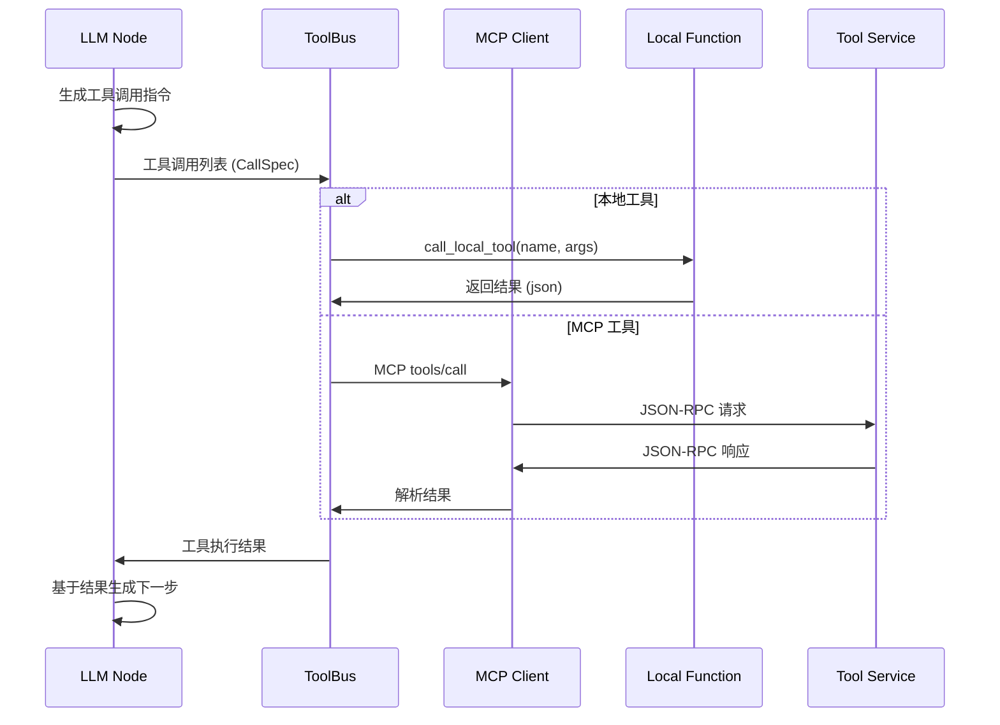

**ToolBus 的优势**：

1. **统一接口**：本地函数、MCP 服务和外部 API 都通过同一接口调用，简化了代理逻辑。
2. **自动路由**：ToolBus 根据工具名称自动选择本地函数或 MCP 客户端。
3. **类型安全**：工具参数和返回值都使用 JSON Schema 验证，减少运行时错误。
4. **易于扩展**：添加新工具只需注册到 ToolBus，无需修改工作流图。
5. **LLM 集成**：`export_as_llm_tools()` 方法生成符合 OpenAI Function Calling 格式的工具描述，可直接传递给 LLM。

### 8.6 终端输出与 UI 集成

Sink 节点可以根据不同客户端输出结果，支持命令行、ImGui 和 Web 前端。所有输出都通过 Sink 节点统一处理，实现了多端适配的灵活架构：

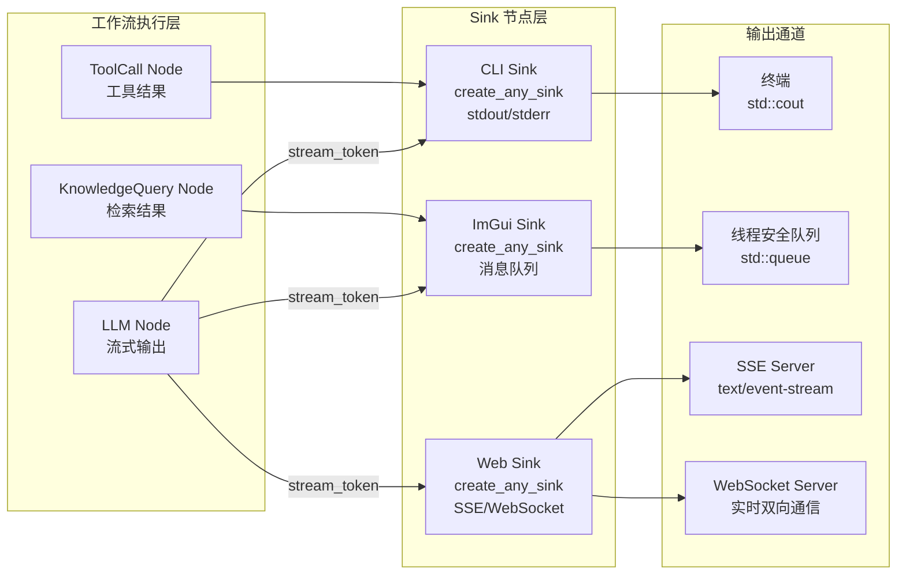

#### 8.6.1 CLI 输出实现

命令行输出是最简单的场景，直接使用 `std::cout` 打印结果：

```cpp
// CLI Sink 节点实现
auto [cli_sink, tCliSink] = builder.create_any_sink(
    "CLISink",
    {{"LLM", "final_answer"}, {"LLM", "reasoning"}, {"ToolCall", "results"}},
    [](const std::unordered_map<std::string, std::any>& outputs) {
        if (outputs.find("final_answer") != outputs.end()) {
            std::string answer = std::any_cast<std::string>(outputs.at("final_answer"));
            std::cout << "\n=== Final Answer ===\n" << answer << "\n";
        }
        
        if (outputs.find("reasoning") != outputs.end()) {
            std::string reasoning = std::any_cast<std::string>(outputs.at("reasoning"));
            std::cout << "\n=== Reasoning ===\n" << reasoning << "\n";
        }
        
        if (outputs.find("results") != outputs.end()) {
            auto results = std::any_cast<std::vector<json>>(outputs.at("results"));
            std::cout << "\n=== Tool Results ===\n";
            for (const auto& res : results) {
                std::cout << res.dump(2) << "\n";
            }
        }
    }
);

// 流式输出处理（在 LLM 节点的 on_stream_token 回调中）
std::function<void(std::string_view)> cli_stream_callback = 
    [](std::string_view token) {
        std::cout << token << std::flush;  // 实时输出 token
    };
```

#### 8.6.2 ImGui 输出实现

ImGui 是即时模式 GUI 库，需要在主线程中更新界面。使用线程安全的消息队列在后台工作流线程和 GUI 线程间传递数据：

```cpp
#include <queue>
#include <mutex>

// 线程安全的输出队列
struct GUIOutputQueue {
    std::queue<std::string> messages;
    std::mutex mtx;
    
    void push(const std::string& msg) {
        std::lock_guard<std::mutex> lock(mtx);
        messages.push(msg);
    }
    
    bool try_pop(std::string& msg) {
        std::lock_guard<std::mutex> lock(mtx);
        if (messages.empty()) return false;
        msg = messages.front();
        messages.pop();
        return true;
    }
};

GUIOutputQueue gui_queue;

// ImGui Sink 节点实现
auto [gui_sink, tGuiSink] = builder.create_any_sink(
    "ImGuiSink",
    {{"LLM", "final_answer"}, {"LLM", "reasoning"}},
    [&gui_queue](const std::unordered_map<std::string, std::any>& outputs) {
        if (outputs.find("final_answer") != outputs.end()) {
            std::string answer = std::any_cast<std::string>(outputs.at("final_answer"));
            gui_queue.push("FINAL_ANSWER:" + answer);
        }
        
        if (outputs.find("reasoning") != outputs.end()) {
            std::string reasoning = std::any_cast<std::string>(outputs.at("reasoning"));
            gui_queue.push("REASONING:" + reasoning);
        }
    }
);

// ImGui 主循环中处理消息
void render_gui() {
    ImGui::Begin("Agent Output");
    
    std::string msg;
    while (gui_queue.try_pop(msg)) {
        // 解析消息类型并更新 UI
        if (msg.starts_with("FINAL_ANSWER:")) {
            final_answer_text_ += msg.substr(13);
        } else if (msg.starts_with("REASONING:")) {
            reasoning_text_ += msg.substr(10);
        }
    }
    
    ImGui::TextWrapped("%s", final_answer_text_.c_str());
    ImGui::End();
}

// 流式输出处理（在 LLM 节点的 on_stream_token 回调中）
std::function<void(std::string_view)> gui_stream_callback = 
    [&gui_queue](std::string_view token) {
        gui_queue.push("STREAM_TOKEN:" + std::string(token));
    };
```

#### 8.6.3 Web 输出实现（SSE/WebSocket）

Web 前端需要实时接收流式输出，可以使用 SSE（Server-Sent Events）或 WebSocket：

```cpp
#include <httplib.h>  // 或使用其他 HTTP 服务器库

httplib::Server srv;

// SSE 流式输出处理
auto [sse_sink, tSseSink] = builder.create_any_sink(
    "SSESink",
    {{"LLM", "final_answer"}, {"LLM", "audio_out"}},
    [&srv, &session_id](const std::unordered_map<std::string, std::any>& outputs) {
        // 通过 SSE 推送最终结果
        if (outputs.find("final_answer") != outputs.end()) {
            std::string answer = std::any_cast<std::string>(outputs.at("final_answer"));
            srv.send_event(session_id, "message", answer);
        }
    }
);

// SSE 端点
srv.Get("/api/stream", [&](const httplib::Request& req, httplib::Response& res) {
    res.set_header("Content-Type", "text/event-stream");
    res.set_header("Cache-Control", "no-cache");
    res.set_header("Connection", "keep-alive");
    
    std::string session_id = req.get_param_value("session_id");
    
    // 注册流式回调
    stream_callbacks_[session_id] = [&res](std::string_view token) {
        res.set_content("data: " + std::string(token) + "\n\n", "text/event-stream");
        res.flush();
    };
});

// 流式输出处理（在 LLM 节点的 on_stream_token 回调中）
std::function<void(std::string_view)> web_stream_callback = 
    [&stream_callbacks_, session_id](std::string_view token) {
        if (stream_callbacks_.find(session_id) != stream_callbacks_.end()) {
            stream_callbacks_[session_id](token);
        }
    };
```

**WebSocket 实现**（用于双向通信和音频传输）：

```cpp
#include <websocketpp/config/asio_no_tls.hpp>
#include <websocketpp/server.hpp>

using websocketpp::server;
using websocketpp::lib::bind;

typedef server<websocketpp::config::asio> server_t;

server_t ws_server;

// WebSocket Sink 节点实现
auto [ws_sink, tWsSink] = builder.create_any_sink(
    "WebSocketSink",
    {{"LLM", "final_answer"}, {"LLM", "audio_out"}},
    [&ws_server, &connections](const std::unordered_map<std::string, std::any>& outputs) {
        // 向所有连接的客户端推送结果
        json message = {
            {"type", "final_answer"},
            {"content", std::any_cast<std::string>(outputs.at("final_answer"))}
        };
        
        for (auto& conn : connections) {
            ws_server.send(conn, message.dump(), websocketpp::frame::opcode::text);
        }
        
        // 处理音频输出
        if (outputs.find("audio_out") != outputs.end()) {
            std::string audio = std::any_cast<std::string>(outputs.at("audio_out"));
            // 发送二进制音频数据
            for (auto& conn : connections) {
                ws_server.send(conn, audio, websocketpp::frame::opcode::binary);
            }
        }
    }
);
```

**关键设计要点**：

1. **统一 Sink 接口**：所有输出都通过 `create_any_sink` 创建，使用统一的回调函数处理。
2. **线程安全**：ImGui 和 Web 输出需要使用线程安全的数据结构（如消息队列）在工作流线程和 UI/网络线程间传递数据。
3. **流式输出**：LLM 节点的 `on_stream_token` 回调实时推送 token，CLI 直接打印，ImGui 和 Web 通过队列或网络连接推送。
4. **多端适配**：同一个工作流可以同时连接多个 Sink，实现 CLI、ImGui 和 Web 的并行输出。

## 九、关键算法与技术实现

### 9.1 多线程执行与工作窃取调度

#### 9.1.1 Taskflow 执行器配置

Taskflow 在执行任务图时采用工作窃取调度器，每个线程维护一个任务队列并在空闲时从其他线程窃取任务，以提高负载均衡。在代理框架中，合理配置执行器线程数对性能至关重要：

```cpp
// 1. 获取系统可用核心数
unsigned int num_threads = std::thread::hardware_concurrency();

// 2. 创建执行器（使用所有可用核心，或减去 UI 线程数）
tf::Executor executor(num_threads);  // 多线程执行器

// 3. 对于 I/O 密集型任务（如工具调用、网络请求），可以使用更多线程
tf::Executor io_executor(num_threads * 2);  // 2倍线程数，适合 I/O 等待

// 4. 执行工作流（同步或异步）
builder.run(executor);  // 同步执行，阻塞直到完成

// 或
auto future = builder.run_async(executor);  // 异步执行，返回 future
future.wait();  // 等待完成
```

#### 9.1.2 并行执行流程

代理框架中的并行执行主要体现在以下几个方面：

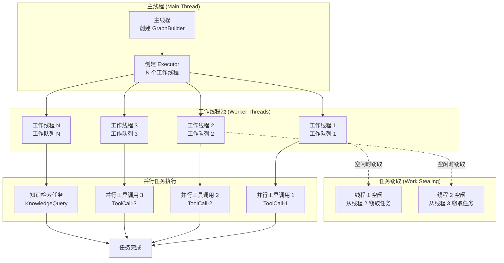

**并行执行的关键点**：

1. **工具调用并行化**：使用 `create_for_each` 并行执行所有工具调用，每个工具调用在独立的线程中执行。
2. **知识检索并行化**：知识库查询可以与工具调用并行执行，减少等待时间。
3. **工作窃取机制**：当某个线程完成自己的任务后，会自动从其他线程的队列中窃取任务，提高 CPU 利用率。
4. **线程安全共享状态**：使用 `std::mutex` 或原子操作保护共享数据，避免数据竞争。

#### 9.1.3 线程安全的共享状态管理

在并行工具调用中，需要安全地收集结果。以下是几种线程安全的模式：

```cpp
// 模式 1：使用互斥锁保护共享容器
std::shared_ptr<std::vector<json>> shared_results = 
    std::make_shared<std::vector<json>>();
std::mutex results_mutex;

auto [tool_node, _] = builder.create_for_each<std::vector<CallSpec>>(
    "ToolCall",
    {{"CallList", "list"}},
    [&toolbus, shared_results, &results_mutex](
        const CallSpec& spec,
        std::unordered_map<std::string, std::any>& shared_params
    ) {
        json result = toolbus.call_tool(spec.name, spec.arguments);
        
        // 线程安全地写入共享结果
        {
            std::lock_guard<std::mutex> lock(results_mutex);
            shared_results->push_back(result);
        }
    },
    {}
);

// 模式 2：使用线程本地存储 + 最后汇总（性能更好）
thread_local std::vector<json> local_results;

auto [tool_node, _] = builder.create_for_each<std::vector<CallSpec>>(
    "ToolCall",
    {{"CallList", "list"}},
    [&toolbus](const CallSpec& spec, auto& shared_params) {
        json result = toolbus.call_tool(spec.name, spec.arguments);
        local_results.push_back(result);  // 线程本地存储，无需锁
    },
    {}
);

// 模式 3：使用原子操作和原子计数器
std::atomic<int> completed_count{0};
const int total_tools = tool_list.size();

auto [tool_node, _] = builder.create_for_each<std::vector<CallSpec>>(
    "ToolCall",
    {{"CallList", "list"}},
    [&toolbus, &completed_count](const CallSpec& spec, auto& shared_params) {
        json result = toolbus.call_tool(spec.name, spec.arguments);
        int count = ++completed_count;  // 原子递增
        
        if (count == total_tools) {
            // 所有工具调用完成，可以触发下一步
        }
    },
    {}
);
```

**性能优化建议**：

1. **减少锁竞争**：优先使用线程本地存储或消息传递，避免频繁的锁竞争。
2. **合理配置线程数**：对于 CPU 密集型任务，线程数等于核心数；对于 I/O 密集型任务，可以设置为核心数的 2-4 倍。
3. **任务粒度**：将大任务拆分为多个小任务，提高并行度；但避免任务过小导致调度开销过大。
4. **动态负载均衡**：Taskflow 的工作窃取机制自动平衡负载，无需手动分配任务。

#### 9.1.4 异步任务与动态任务图

Taskflow 支持异步任务和动态任务图，在 3.6 版本中引入了 `dependent_async` 接口，允许在运行时创建新的任务并依赖已有任务【548440874866018†L29-L66】。在代理框架中，可以利用这些特性实现更灵活的任务调度：

```cpp
// 异步执行工作流（不阻塞主线程）
auto future = builder.run_async(executor);

// 主线程可以继续执行其他任务
while (!future.is_ready()) {
    // 处理 UI 事件或其他任务
    process_ui_events();
    std::this_thread::sleep_for(std::chrono::milliseconds(10));
}

// 等待完成
future.wait();
```

在 `workflow` 中，`create_loop_decl` 会自动连接循环体和条件逻辑【631946224216190†L1280-L1334】。为了避免在循环内共享状态导致数据竞争，我们将可变数据放入线程安全的 SessionState 结构，或者在并行任务中尽量使用消息传递而非共享内存。共享变量需通过互斥锁或原子操作保护，但过度锁竞争可能降低性能，因此建议将结果写入线程本地容器，最后汇总。

### 9.2 跨模态检索与融合算法实现

多模态 RAG 中的关键算法需要具体实现，以下是详细的技术路线：

#### 9.2.1 向量化及索引构建实现

```cpp
// 向量索引构建节点
auto [index_builder, _] = builder.create_any_node(
    "IndexBuilder",
    {{"VectorStoreSink", "documents"}},
    [&vector_db](const std::unordered_map<std::string, std::any>& inputs) {
        auto documents = std::any_cast<std::vector<Document>>(inputs.at("documents"));
        
        // 1. 构建 Faiss IVF-PQ 索引（高效压缩）
        faiss::IndexIVFPQ* index = new faiss::IndexIVFPQ(
            quantizer,    // 量化器（K-means）
            dimension,    // 向量维度
            nlist,        // 聚类中心数
            m,            // PQ 码本数
            nbits         // PQ 编码位数
        );
        
        // 2. 训练索引
        std::vector<float> training_vectors;
        for (const auto& doc : documents) {
            training_vectors.insert(training_vectors.end(),
                                   doc.embedding.begin(), doc.embedding.end());
        }
        index->train(training_vectors.size() / dimension, training_vectors.data());
        
        // 3. 添加向量
        index->add(documents.size(), training_vectors.data());
        
        // 4. 保存索引
        vector_db.save_index("multimodal_index.faiss", index);
        
        return std::unordered_map<std::string, std::any>{
            {"index_path", std::any{std::string("multimodal_index.faiss")}},
            {"doc_count", std::any{static_cast<int>(documents.size())}}
        };
    },
    {"index_path", "doc_count"}
);
```

#### 9.2.2 查询向量构造与扩充实现

```cpp
// 查询扩展节点：引入同义词和相关描述
auto [query_expander, _] = builder.create_any_node(
    "QueryExpander",
    {{"QueryEncoder", "query_vectors"}},
    [&llm_client](const std::unordered_map<std::string, std::any>& inputs) {
        auto query_vectors = std::any_cast<std::vector<std::pair<std::vector<float>, std::string>>>(
            inputs.at("query_vectors"));
        
        std::vector<std::pair<std::vector<float>, std::string>> expanded_queries;
        
        for (const auto& [vec, modality] : query_vectors) {
            // 1. 原始查询向量
            expanded_queries.push_back({vec, modality});
            
            // 2. 查询扩展：使用 LLM 生成同义词和相关描述
            if (modality == "text") {
                std::string expanded_text = llm_client.expand_query(
                    extract_text_from_vector(vec));
                auto expanded_vec = text_encoder.encode(expanded_text);
                expanded_queries.push_back({expanded_vec, modality});
            }
            
            // 3. 图像查询：生成文本描述用于文本检索
            if (modality == "image") {
                std::string image_description = image_encoder.generate_caption(vec);
                auto text_vec = text_encoder.encode(image_description);
                expanded_queries.push_back({text_vec, "text"});  // 跨模态扩展
            }
        }
        
        return std::unordered_map<std::string, std::any>{
            {"expanded_queries", std::any{expanded_queries}}
        };
    },
    {"expanded_queries"}
);
```

#### 9.2.3 交叉模态注意力实现

```cpp
// 交叉模态注意力节点：对齐文本和图像/音频
auto [cross_attention, _] = builder.create_any_node(
    "CrossModalAttention",
    {{"VectorRetriever", "retrieved_docs"}},
    [&attention_model](const std::unordered_map<std::string, std::any>& inputs) {
        auto docs = std::any_cast<std::vector<RetrievalResult>>(
            inputs.at("retrieved_docs"));
        
        // 实现 Transformer 交叉注意力机制
        // 1. 构建文本 token 序列和图像 patch 序列
        std::vector<float> text_tokens;  // [batch, seq_len, hidden_dim]
        std::vector<float> image_patches;  // [batch, num_patches, hidden_dim]
        
        for (const auto& doc : docs) {
            if (doc.modality == "text") {
                // 文本 token 化
                text_tokens.push_back(doc.embedding);
            } else if (doc.modality == "image") {
                // 图像 patch 化（CLIP 已处理）
                image_patches.push_back(doc.embedding);
            }
        }
        
        // 2. 计算交叉注意力权重
        // Q = text_tokens, K = image_patches, V = image_patches
        auto attention_weights = attention_model.compute_cross_attention(
            text_tokens, image_patches);
        
        // 3. 加权融合
        std::vector<float> aligned_features = attention_model.weighted_sum(
            attention_weights, image_patches);
        
        return std::unordered_map<std::string, std::any>{
            {"aligned_features", std::any{aligned_features}},
            {"attention_weights", std::any{attention_weights}}
        };
    },
    {"aligned_features", "attention_weights"}
);
```

#### 9.2.4 融合层算法实现

```cpp
// 多模态融合层节点
auto [fusion_layer, _] = builder.create_any_node(
    "FusionLayer",
    {
        {"CrossModalAttention", "aligned_features"},
        {"VectorRetriever", "retrieved_docs"}
    },
    [&fusion_model](const std::unordered_map<std::string, std::any>& inputs) {
        auto aligned_features = std::any_cast<std::vector<float>>(
            inputs.at("aligned_features"));
        auto docs = std::any_cast<std::vector<RetrievalResult>>(
            inputs.at("retrieved_docs"));
        
        // 策略 1: 简单加权平均
        std::vector<float> weighted_sum;
        float total_weight = 0.0f;
        
        for (const auto& doc : docs) {
            float weight = doc.score;  // 使用检索分数作为权重
            for (size_t i = 0; i < doc.embedding.size(); ++i) {
                if (weighted_sum.size() <= i) {
                    weighted_sum.push_back(0.0f);
                }
                weighted_sum[i] += doc.embedding[i] * weight;
            }
            total_weight += weight;
        }
        
        // 归一化
        for (float& val : weighted_sum) {
            val /= total_weight;
        }
        
        // 策略 2: 神经网络融合（可选）
        // std::vector<float> neural_fused = fusion_model.forward(aligned_features);
        
        // 生成文本摘要（供 LLM 使用）
        std::string fused_context = generate_context_summary(docs, weighted_sum);
        
        return std::unordered_map<std::string, std::any>{
            {"fused_context", std::any{fused_context}},
            {"fused_embedding", std::any{weighted_sum}}
        };
    },
    {"fused_context", "fused_embedding"}
);
```

### 9.3 计划解析与工具调用调度实现

#### 9.3.1 PlanParser 节点详细实现

LLM 输出的计划通常以 JSON 格式嵌入在响应中，需要精确解析：

```cpp
// PlanParser 节点：解析 LLM 工具调用指令
auto [parser, _] = builder.create_any_node(
    "PlanParser",
    {{"LLM", "tool_calls"}},
    [](const std::unordered_map<std::string, std::any>& inputs) {
        // 1. 提取工具调用 JSON
        auto tool_calls_json = std::any_cast<std::vector<json>>(inputs.at("tool_calls"));
        
        std::vector<CallSpec> specs;
        std::vector<int> execution_order;  // 工具执行顺序（如果 LLM 指定）
        
        // 2. 解析每个工具调用
        for (size_t i = 0; i < tool_calls_json.size(); ++i) {
            const auto& tc = tool_calls_json[i];
            
            CallSpec spec;
            spec.name = tc["function"]["name"].get<std::string>();
            
            // 解析参数（支持字符串和对象两种格式）
            if (tc["function"]["arguments"].is_string()) {
                spec.arguments = json::parse(
                    tc["function"]["arguments"].get<std::string>());
            } else {
                spec.arguments = tc["function"]["arguments"];
            }
            
            // 提取执行顺序（如果 LLM 指定了依赖关系）
            if (tc.contains("order")) {
                execution_order.push_back(tc["order"].get<int>());
            } else {
                execution_order.push_back(-1);  // -1 表示可以并行执行
            }
            
            specs.push_back(spec);
        }
        
        // 3. 根据执行顺序分组（顺序执行 vs 并行执行）
        std::vector<std::vector<CallSpec>> execution_groups;
        std::vector<CallSpec> current_group;
        int current_order = -1;
        
        for (size_t i = 0; i < specs.size(); ++i) {
            if (execution_order[i] == -1 || execution_order[i] != current_order) {
                if (!current_group.empty()) {
                    execution_groups.push_back(current_group);
                    current_group.clear();
                }
                current_order = execution_order[i];
            }
            current_group.push_back(specs[i]);
        }
        if (!current_group.empty()) {
            execution_groups.push_back(current_group);
        }
        
        return std::unordered_map<std::string, std::any>{
            {"calls", std::any{specs}},
            {"execution_groups", std::any{execution_groups}},
            {"parallel", std::any{current_order == -1}}
        };
    },
    {"calls", "execution_groups", "parallel"}
);
```

#### 9.3.2 工具调用调度实现

根据工具的执行顺序和资源需求进行智能调度：

```cpp
// 工具调度器节点：根据工具特性和资源需求调度执行
auto [scheduler, _] = builder.create_any_node(
    "ToolScheduler",
    {{"PlanParser", "execution_groups"}},
    [&toolbus](const std::unordered_map<std::string, std::any>& inputs) {
        auto groups = std::any_cast<std::vector<std::vector<CallSpec>>>(
            inputs.at("execution_groups"));
        
        std::vector<ScheduledTask> scheduled_tasks;
        
        // 资源限制
        const int max_concurrent_gpu = 2;  // 最多 2 个 GPU 工具并行
        const int max_concurrent_heavy = 4;  // 最多 4 个重型工具并行
        
        int current_gpu = 0;
        int current_heavy = 0;
        
        for (const auto& group : groups) {
            for (const auto& spec : group) {
                ScheduledTask task;
                task.spec = spec;
                
                // 查询工具特性（GPU/CPU/IO）
                auto tool_info = toolbus.get_tool_info(spec.name);
                
                if (tool_info.requires_gpu) {
                    if (current_gpu < max_concurrent_gpu) {
                        task.priority = 1;  // 高优先级
                        current_gpu++;
                    } else {
                        task.priority = 3;  // 低优先级，等待 GPU 资源
                    }
                } else if (tool_info.is_heavy) {
                    if (current_heavy < max_concurrent_heavy) {
                        task.priority = 2;  // 中优先级
                        current_heavy++;
                    } else {
                        task.priority = 3;  // 低优先级
                    }
                } else {
                    task.priority = 1;  // 轻量级工具，高优先级
                }
                
                scheduled_tasks.push_back(task);
            }
        }
        
        // 按优先级排序
        std::sort(scheduled_tasks.begin(), scheduled_tasks.end(),
            [](const ScheduledTask& a, const ScheduledTask& b) {
                return a.priority < b.priority;
            });
        
        return std::unordered_map<std::string, std::any>{
            {"scheduled_tasks", std::any{scheduled_tasks}}
        };
    },
    {"scheduled_tasks"}
);
```

### 9.4 事件溯源与监控实现

#### 9.4.1 事件溯源节点实现

框架需要记录每个节点的输入、输出、耗时以及错误信息。事件溯源模式通过存储不可变事件序列，实现审计和回放能力：

```cpp
// 事件记录节点（包装器，用于记录所有节点的事件）
class EventLogger {
private:
    std::ofstream event_log_;
    std::mutex log_mutex_;
    
public:
    void log_event(const std::string& node_name,
                  const std::string& event_type,
                  const json& data) {
        std::lock_guard<std::mutex> lock(log_mutex_);
        
        json event = {
            {"timestamp", std::time(nullptr)},
            {"node", node_name},
            {"type", event_type},
            {"data", data}
        };
        
        event_log_ << event.dump() << "\n";
        event_log_.flush();
    }
};

// 在节点创建时注入事件记录
auto wrap_with_logging = [&event_logger](
    const std::string& node_name,
    std::function<std::unordered_map<std::string, std::any>(const auto&)> original_func
) {
    return [node_name, original_func, &event_logger](
        const std::unordered_map<std::string, std::any>& inputs
    ) {
        auto start_time = std::chrono::steady_clock::now();
        
        try {
            // 记录输入事件
            json input_summary;
            for (const auto& [key, val] : inputs) {
                input_summary[key] = summarize_value(val);  // 摘要（避免日志过大）
            }
            event_logger.log_event(node_name, "input", input_summary);
            
            // 执行原始函数
            auto outputs = original_func(inputs);
            
            // 记录输出事件
            auto end_time = std::chrono::steady_clock::now();
            auto duration = std::chrono::duration_cast<std::chrono::milliseconds>(
                end_time - start_time).count();
            
            json output_summary;
            for (const auto& [key, val] : outputs) {
                output_summary[key] = summarize_value(val);
            }
            
            event_logger.log_event(node_name, "output", {
                {"results", output_summary},
                {"duration_ms", duration}
            });
            
            return outputs;
        } catch (const std::exception& e) {
            // 记录错误事件
            event_logger.log_event(node_name, "error", {
                {"error", e.what()},
                {"timestamp", std::time(nullptr)}
            });
            throw;
        }
    };
};

// 使用事件记录包装器
auto [llm_node, _] = builder.create_any_node(
    "LLM",
    input_specs,
    wrap_with_logging("LLM", original_llm_func),
    output_keys
);
```

#### 9.4.2 性能监控与 TFProf 集成

```cpp
// 性能监控节点（集成 TFProf）
class PerformanceMonitor {
private:
    std::map<std::string, NodeStats> node_stats_;
    std::mutex stats_mutex_;
    
public:
    void record_execution(const std::string& node_name, 
                         std::chrono::milliseconds duration) {
        std::lock_guard<std::mutex> lock(stats_mutex_);
        auto& stats = node_stats_[node_name];
        stats.execution_count++;
        stats.total_time += duration;
        stats.avg_time = stats.total_time / stats.execution_count;
        stats.max_time = std::max(stats.max_time, duration);
        stats.min_time = std::min(stats.min_time, duration);
    }
    
    void export_profiling_report(const std::string& path) {
        // 导出为 JSON 报告
        json report;
        for (const auto& [name, stats] : node_stats_) {
            report[name] = {
                {"execution_count", stats.execution_count},
                {"avg_time_ms", stats.avg_time.count()},
                {"max_time_ms", stats.max_time.count()},
                {"min_time_ms", stats.min_time.count()}
            };
        }
        
        std::ofstream out(path);
        out << report.dump(2);
    }
};

// 启用 Taskflow TFProf
void enable_tfprof() {
    setenv("TF_ENABLE_PROFILER", "1", 1);
    setenv("TF_PROFILER_OUTPUT", "tfprof.json", 1);
}

// 在工作流执行后分析性能
builder.run(executor);

// 生成性能报告
performance_monitor.export_profiling_report("performance_report.json");

// 可视化性能瓶颈
analyze_performance_bottlenecks("performance_report.json");
```

代理在崩溃或重启后可通过重新加载事件日志恢复状态。为方便监控，工作流可启用 Taskflow 的 TFProf 分析器，通过环境变量 `TF_ENABLE_PROFILER` 输出执行时间线【201813784348343†L77-L92】。结合可视化工具，可以分析瓶颈，调整并行度或重构图结构。

## 十、系统架构与技术路线

### 10.1 系统总体架构

#### 10.1.1 分层架构设计

本框架采用分层架构，从下到上分为基础设施层、核心引擎层、业务模块层和应用接口层：

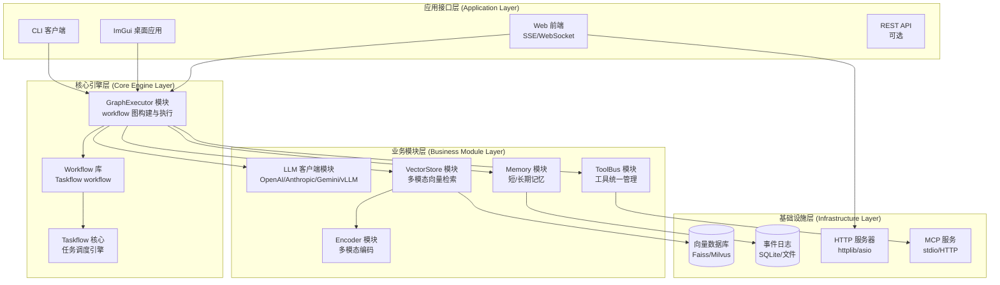

#### 10.1.2 模块依赖关系

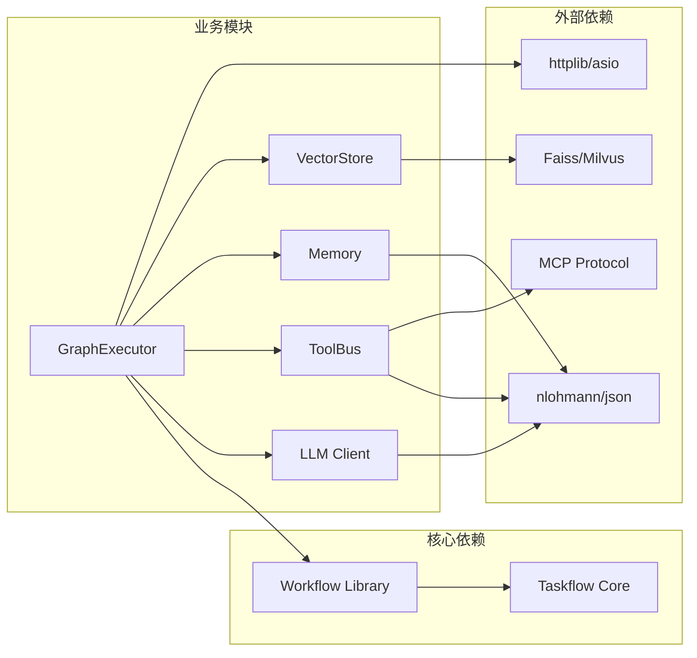

### 10.2 核心模块详细设计

#### 10.2.1 LLM 客户端模块

**职责**：与各种 LLM 服务通信，支持流式和非流式生成。

**核心接口**：

```cpp
class LLMClient {
public:
    // 异步调用 LLM，支持流式输出
    std::future<LLMOutput> invoke(
        const LLMInput& input,
        std::function<void(std::string_view)> on_stream_token = nullptr
    );
    
    // 注册模型适配器
    void register_adapter(const std::string& provider, 
                         std::shared_ptr<ModelAdapter> adapter);
    
    // 配置模型参数
    void configure(const std::string& model_name, const ModelConfig& config);
};

// 模型适配器接口（支持 OpenAI、Anthropic、Gemini、vLLM 等）
class ModelAdapter {
public:
    virtual std::future<LLMOutput> invoke(
        const LLMInput& input,
        std::function<void(std::string_view)> stream_callback
    ) = 0;
    
    virtual std::vector<ToolMeta> get_available_tools() const = 0;
};
```

**实现要点**：
- **多模型适配**：通过适配器模式支持 OpenAI、Anthropic、Gemini、本地 vLLM 等
- **流式输出**：使用回调函数实时推送 token，支持 SSE/WebSocket
- **函数调用协议**：实现 OpenAI Function Calling 格式的工具调用
- **故障重试**：指数退避重试机制，支持超时和错误处理
- **配置管理**：温度、Top P、最大 token 数等参数可配置

#### 10.2.2 ToolBus 模块

**职责**：统一管理所有工具（本地函数、MCP 服务、外部 API），提供统一的调用接口。

**核心接口**：

```cpp
class ToolBus {
public:
    // 注册本地工具
    void register_local_tool(const std::string& name,
                            std::function<json(const json&)> func,
                            const ToolMeta& meta);
    
    // 注册 MCP 服务
    void register_mcp_service(const std::string& name,
                              std::shared_ptr<MCPClient> client);
    
    // 调用工具
    std::future<json> call_tool(const std::string& name, const json& args);
    
    // 导出工具列表（供 LLM 使用）
    std::vector<ToolMeta> export_as_llm_tools() const;
    
    // 查询工具信息
    std::optional<ToolInfo> get_tool_info(const std::string& name) const;
};
```

**实现要点**：
- **统一接口**：所有工具通过 `ToolBus::call_tool` 调用，屏蔽底层实现差异
- **自动路由**：根据工具名称自动选择本地函数、MCP 客户端或外部 API
- **类型安全**：使用 JSON Schema 验证工具参数和返回值
- **并发调用**：支持并行调用多个工具，自动处理依赖关系

#### 10.2.3 MCP 客户端模块

**职责**：实现与 Model Context Protocol (MCP) 服务的通信。

**核心接口**：

```cpp
class MCPClient {
public:
    // 连接 MCP 服务（stdio 或 HTTP）
    bool connect(const std::string& endpoint, MCPTransport transport);
    
    // 列举可用工具
    std::future<std::vector<ToolMeta>> list_tools();
    
    // 调用工具
    std::future<json> call_tool(const std::string& name, const json& args);
    
    // 心跳检查
    bool ping();
    
private:
    // JSON-RPC 2.0 消息处理
    json send_request(const std::string& method, const json& params);
};
```

**实现要点**：
- **传输协议**：支持 stdio（标准输入输出）和 HTTP 两种传输方式
- **JSON-RPC 2.0**：实现标准的 JSON-RPC 协议，支持请求/响应/通知消息
- **并发调用**：支持多个工具调用的并发执行
- **错误处理**：完善的错误码和异常处理机制

#### 10.2.4 Memory 模块

**职责**：提供短期和长期记忆的存储和查询接口。

**核心接口**：

```cpp
class MemoryStore {
public:
    // 存储事件（事件溯源）
    void store_event(const Event& event);
    
    // 查询对话历史
    std::vector<Message> get_conversation_history(
        const std::string& session_id,
        int max_messages = 10
    );
    
    // 查询短期记忆（当前会话）
    std::vector<Event> get_short_term_memory(const std::string& session_id);
    
    // 存储长期记忆摘要
    void store_long_term_memory(const std::string& session_id,
                               const MemorySummary& summary);
    
    // 查询长期记忆
    std::vector<MemorySummary> query_long_term_memory(
        const std::string& query, int top_k = 5
    );
};
```

**实现要点**：
- **事件溯源**：所有节点执行事件都记录到不可变日志中
- **多级记忆**：区分即时记忆（per request）、短期记忆（per conversation）、长期记忆（knowledge base）
- **内存窗口**：支持动态截断长对话历史，避免上下文过长
- **持久化**：基于 SQLite 或文件系统实现持久化存储

#### 10.2.5 VectorStore 模块

**职责**：封装向量数据库，实现多模态数据的存储和检索。

**核心接口**：

```cpp
class VectorStore {
public:
    // 插入文档（多模态）
    void insert(const Document& doc, const std::vector<float>& embedding);
    
    // 向量检索
    std::vector<RetrievalResult> search(
        const std::vector<float>& query_vector,
        int top_k = 5,
        const std::string& modality = ""
    );
    
    // 混合检索（语义 + 关键词）
    std::vector<RetrievalResult> hybrid_search(
        const std::string& query_text,
        const std::vector<float>& query_vector,
        int top_k = 5
    );
    
    // 注册编码器
    void register_encoder(const std::string& modality,
                         std::shared_ptr<Encoder> encoder);
};
```

**实现要点**：
- **多模态支持**：支持文本、图像、音频、视频等多种模态的向量存储
- **索引优化**：使用 Faiss IVF-PQ 或 Milvus 实现高效的近似最近邻搜索
- **混合检索**：结合语义搜索（向量相似度）和关键词搜索（BM25）
- **编码器管理**：支持注册不同的编码器（BERT、CLIP、Whisper 等）

#### 10.2.6 GraphExecutor 模块

**职责**：基于 Taskflow `workflow` 构建和执行工作流图。

**核心接口**：

```cpp
class GraphExecutor {
public:
    // 构建标准 Agent 工作流
    void build_agent_workflow(
        const AgentConfig& config,
        wf::GraphBuilder& builder
    );
    
    // 构建自定义工作流
    void build_custom_workflow(
        const WorkflowConfig& config,
        wf::GraphBuilder& builder
    );
    
    // 执行工作流
    std::future<WorkflowResult> execute(const std::string& workflow_name);
    
    // 注册工作流模板
    void register_template(const std::string& name,
                          std::function<void(wf::GraphBuilder&)> builder_fn);
};
```

**实现要点**：
- **图模板**：提供 ReAct 循环、批量工具调用等常用工作流模板
- **动态图构建**：支持在运行时根据配置动态构建工作流图
- **执行管理**：管理执行器线程池、任务调度和资源分配
- **错误恢复**：支持工作流的暂停、恢复和回滚

#### 10.2.7 UI 适配模块

**职责**：为不同客户端提供统一的输出接口。

**核心接口**：

```cpp
class UIManager {
public:
    // 注册 CLI 输出处理器
    void register_cli_handler(std::function<void(std::string_view)> handler);
    
    // 注册 ImGui 消息队列
    void register_gui_queue(std::shared_ptr<ThreadSafeQueue> queue);
    
    // 注册 Web 连接（SSE/WebSocket）
    void register_web_connection(const std::string& session_id,
                                 std::shared_ptr<WebConnection> conn);
    
    // 分发消息到所有注册的处理器
    void dispatch_message(const std::string& type, const json& data);
    
    // 流式输出
    void stream_token(const std::string& session_id, std::string_view token);
};
```

**实现要点**：
- **统一接口**：所有 UI 适配器实现统一的接口，便于扩展
- **线程安全**：使用消息队列或锁机制确保线程安全
- **会话管理**：管理多个会话的连接，支持并发用户
- **协议适配**：支持 SSE、WebSocket 等不同协议

### 10.3 项目目录结构与文件组织

```
taskflow/                       # 项目根目录
├── .cursorrules                # Cursor IDE 开发规则（位于根目录）
├── .gitmodules                 # Git 子模块配置（位于根目录）
│
├── agent_framework/            # Agent Framework 项目目录
│   ├── CMakeLists.txt          # 主构建文件
│   ├── README.md               # 项目说明
│   ├── LICENSE                 # 许可证
│   │
│   ├── include/                # 公共头文件
│   │   └── agent/
│   │       ├── llm_client.hpp  # LLM 客户端接口
│   │       ├── toolbus.hpp      # ToolBus 接口
│   │       ├── memory.hpp       # Memory 接口
│   │       ├── vectorstore.hpp  # VectorStore 接口
│   │       ├── graph_executor.hpp  # GraphExecutor 接口
│   │       ├── ui_manager.hpp   # UI 管理器接口
│   │       └── types.hpp        # 公共数据结构
│   │
│   ├── src/                    # 实现文件
│   │   ├── llm_client/
│   │   │   ├── llm_client.cpp
│   │   │   ├── openai_adapter.cpp
│   │   │   ├── anthropic_adapter.cpp
│   │   │   └── vllm_adapter.cpp
│   │   ├── toolbus/
│   │   │   ├── toolbus.cpp
│   │   │   ├── local_tool.cpp
│   │   │   └── mcp_client.cpp
│   │   ├── memory/
│   │   │   ├── memory_store.cpp
│   │   │   └── event_logger.cpp
│   │   ├── vectorstore/
│   │   │   ├── vectorstore.cpp
│   │   │   ├── faiss_adapter.cpp
│   │   │   └── encoder_manager.cpp
│   │   ├── graph_executor/
│   │   │   ├── graph_executor.cpp
│   │   │   ├── agent_templates.cpp
│   │   │   └── workflow_builder.cpp
│   │   └── ui/
│   │       ├── ui_manager.cpp
│   │       ├── cli_handler.cpp
│   │       ├── gui_handler.cpp
│   │       └── web_handler.cpp
│   │
│   ├── examples/               # 示例程序
│   │   ├── simple_agent.cpp    # 简单 Agent 示例
│   │   ├── multimodal_agent.cpp  # 多模态 Agent 示例
│   │   ├── tool_integration.cpp  # 工具集成示例
│   │   └── workflow_custom.cpp   # 自定义工作流示例
│   │
│   ├── tests/                  # 单元测试
│   │   ├── test_llm_client.cpp
│   │   ├── test_toolbus.cpp
│   │   ├── test_memory.cpp
│   │   ├── test_vectorstore.cpp
│   │   └── test_graph_executor.cpp
│   │
│   ├── tools/                  # 工具脚本
│   │   ├── build.sh
│   │   ├── run_tests.sh
│   │   ├── profile.sh
│   │   └── init_submodules.sh
│   │
│   └── docs/                   # 文档
│       ├── api/                # API 文档
│       ├── guides/             # 使用指南
│       └── architecture/       # 架构文档
│
├── 3rd-party/                  # 第三方依赖（Git Submodules，与 Taskflow 共享）
│   ├── nlohmann_json/          # JSON 库（Header-Only）
│   ├── httplib/                # HTTP 服务器库（Header-Only）
│   ├── websocketpp/            # WebSocket 库（Header-Only）
│   └── faiss/                  # Faiss 向量数据库（可选，需要编译）
│
├── workflow/                   # Workflow 库
├── taskflow/                   # Taskflow 核心库
└── readme/                     # 文档
    └── guide_agent.md          # Agent Framework 设计文档
```

### 10.4 技术路线与开发计划

#### 10.4.1 开发阶段规划

**第一阶段：核心框架搭建（4-6 周）**

1. **Week 1-2：基础设施**
   - 设置 CMake 构建系统
   - 集成 Taskflow 和 workflow 库
   - 创建基础目录结构和接口定义
   - 实现基本的节点封装（Source、Node、Sink）

2. **Week 3-4：LLM 与 ToolBus**
   - 实现 LLM 客户端模块和适配器模式
   - 实现 ToolBus 模块和本地工具注册
   - 实现 MCP 客户端（stdio 和 HTTP 传输）
   - 单元测试和集成测试

3. **Week 5-6：GraphExecutor**
   - 实现 GraphExecutor 模块
   - 实现标准的 ReAct 循环模板
   - 实现 Agent 循环子图构建
   - 工作流可视化工具

**第二阶段：多模态支持（3-4 周）**

4. **Week 7-8：编码器集成**
   - 集成文本编码器（Sentence Transformers）
   - 集成图像编码器（CLIP）
   - 集成音频编码器（Whisper）
   - 编码器管理器实现

5. **Week 9-10：向量检索与融合**
   - 实现 VectorStore 模块
   - 集成 Faiss 或 Milvus
   - 实现多模态检索和融合节点
   - 跨模态注意力机制

**第三阶段：实时输出与 UI（2-3 周）**

6. **Week 11-12：流式输出**
   - 实现 SSE 服务器
   - 实现 WebSocket 服务器
   - 实现中断控制机制
   - CLI 输出优化

7. **Week 13：UI 适配**
   - ImGui 集成
   - Web 前端示例
   - 会话管理和连接池

**第四阶段：优化与完善（2-3 周）**

8. **Week 14-15：性能优化**
   - 多线程优化和负载均衡
   - 内存管理优化
   - 缓存机制实现
   - 性能分析和瓶颈识别

9. **Week 16：测试与文档**
   - 完整的单元测试和集成测试
   - 压力测试和性能基准测试
   - API 文档和使用指南
   - 示例程序和教程

#### 10.4.2 技术栈选择

**编程语言与标准**：
- **C++17**：最低要求，推荐 C++20 以获得更好的性能
- **编译选项**：`-O2 -march=native -pthread`（Release），`-g -O0`（Debug）

**核心依赖**：
- **Taskflow**：任务并行框架（Header-Only，Git Submodule）
- **workflow**：数据流库（Taskflow 项目的 dev 分支）
- **nlohmann/json**：JSON 解析和生成（Header-Only）
- **OpenCV**：图像处理（可选，用于图像编码器）
- **libcurl** 或 **httplib**：HTTP 客户端（用于 LLM API 和 Web 服务）

**向量数据库**：
- **Faiss**（Facebook AI Similarity Search）：高性能向量检索库
- **Milvus**：分布式向量数据库（可选，用于大规模部署）

**HTTP/WebSocket 服务器**：
- **httplib**：轻量级 HTTP 服务器库（Header-Only）
- **websocketpp**：WebSocket 库（Header-Only）
- **asio**：异步 I/O 库（可选，用于高性能场景）

**编码器模型**：
- **Sentence Transformers**：文本嵌入（C++ 绑定或 Python 服务）
- **CLIP**：视觉-语言模型（C++ 绑定或 Python 服务）
- **Whisper**：语音识别（C++ 绑定或 Python 服务）

#### 10.4.3 构建系统配置

**CMakeLists.txt 关键配置**：

```cmake
cmake_minimum_required(VERSION 3.20)
project(AgentFramework VERSION 1.0.0 LANGUAGES CXX)

set(CMAKE_CXX_STANDARD 17)
set(CMAKE_CXX_STANDARD_REQUIRED ON)
set(CMAKE_CXX_EXTENSIONS OFF)

# 添加 Taskflow 子模块
add_subdirectory(third_party/taskflow)

# 启用 workflow 库
set(TF_BUILD_WORKFLOW ON)
add_subdirectory(third_party/taskflow/workflow)

# 查找依赖
find_package(OpenCV REQUIRED)
find_package(CURL REQUIRED)

# 包含目录
include_directories(
    ${CMAKE_CURRENT_SOURCE_DIR}/include
    ${CMAKE_CURRENT_SOURCE_DIR}/third_party/nlohmann_json/include
    ${CMAKE_CURRENT_SOURCE_DIR}/third_party/httplib/include
)

# 编译选项
if(CMAKE_BUILD_TYPE STREQUAL "Release")
    add_compile_options(-O2 -march=native -DNDEBUG)
else()
    add_compile_options(-g -O0 -Wall -Wextra)
endif()

# 链接库
add_executable(agent_framework main.cpp)
target_link_libraries(agent_framework
    PRIVATE
    taskflow
    workflow
    ${OpenCV_LIBS}
    CURL::libcurl
)
```

#### 10.4.4 测试策略

**单元测试**：
- 使用 **Google Test** 或 **Catch2** 框架
- 测试覆盖率目标：核心模块 > 80%
- Mock 对象用于隔离外部依赖（LLM API、向量数据库等）

**集成测试**：
- 端到端工作流测试
- 多模态输入输出测试
- 并发工具调用测试
- 错误恢复测试

**性能测试**：
- 使用 **TFProf** 进行性能分析
- 基准测试：工具调用延迟、向量检索吞吐量、并发处理能力
- 压力测试：长时间运行、高并发场景

#### 10.4.5 部署架构

**单机部署**：
```
┌─────────────────────────────────────────┐
│           Agent Framework               │
│  ┌──────────┐  ┌──────────────────┐   │
│  │  CLI     │  │   Web Server     │   │
│  │  Client  │  │  (SSE/WebSocket) │   │
│  └────┬─────┘  └────────┬─────────┘   │
│       │                 │              │
│  ┌────▼─────────────────▼──────────┐  │
│  │      GraphExecutor              │  │
│  │  (Taskflow workflow)            │  │
│  └────┬─────────────────────────────┘  │
│       │                                 │
│  ┌────▼─────┐  ┌──────┐  ┌──────────┐ │
│  │  LLM     │  │Tool  │  │ Vector   │ │
│  │  Client  │  │Bus   │  │ Store    │ │
│  └──────────┘  └──────┘  └──────────┘ │
└─────────────────────────────────────────┘
```

**分布式部署（未来扩展）**：
- 使用消息队列（如 RabbitMQ、Kafka）连接多个节点
- 分布式向量数据库（Milvus 集群）
- 负载均衡器分发请求
- 容器化部署（Docker/Kubernetes）

#### 10.4.6 性能优化策略

**多线程优化**：
- **线程池配置**：CPU 核心数 = 线程数（CPU 密集型），2-4 倍核心数（I/O 密集型）
- **工作窃取**：利用 Taskflow 的自动负载均衡
- **避免锁竞争**：使用无锁数据结构、线程本地存储、消息传递

**内存优化**：
- **对象池**：复用 LLM 请求对象、工具调用对象
- **智能指针**：使用 `std::shared_ptr` 和 `std::unique_ptr` 管理资源
- **移动语义**：优先使用移动构造函数和移动赋值

**I/O 优化**：
- **异步 I/O**：LLM API 调用、向量数据库查询使用异步接口
- **连接池**：复用 HTTP 连接、数据库连接
- **批处理**：批量执行向量检索、工具调用

**缓存策略**：
- **LLM 响应缓存**：相同 prompt 的响应可以缓存
- **向量索引缓存**：常用的查询向量可以缓存
- **工具结果缓存**：幂等工具的结果可以缓存

### 10.5 开发工具与环境

**开发环境**：
- **编译器**：GCC 8.4+、Clang 10+、MSVC 2019+
- **构建工具**：CMake 3.20+
- **IDE**：CLion、Visual Studio、VSCode + C++ 扩展
- **调试器**：GDB、LLDB、Visual Studio Debugger

**代码质量工具**：
- **静态分析**：clang-tidy、cppcheck
- **代码格式化**：clang-format（遵循 LLVM 风格）
- **内存检查**：Valgrind、AddressSanitizer

**文档工具**：
- **API 文档**：Doxygen
- **架构图**：Mermaid（Markdown 内嵌）
- **使用指南**：Markdown

### 10.6 集成与扩展

**与现有系统集成**：
- **Docker 容器化**：提供 Dockerfile，便于部署
- **REST API**：可选的外部 API 接口，支持远程调用
- **配置文件**：YAML/JSON 格式的配置文件，支持动态配置

**扩展点**：
- **自定义节点**：实现 `INode` 接口创建自定义节点
- **自定义工具**：通过 ToolBus 注册自定义工具
- **自定义编码器**：实现 `Encoder` 接口支持新的模态
- **自定义工作流模板**：通过 GraphExecutor 注册自定义模板

**插件机制**（未来扩展）：
- 动态库加载（`dlopen`）
- 插件注册表
- 插件生命周期管理

## 十一、未来展望与挑战

虽然此框架已经提供了高性能的多模态代理解决方案，并且**已经实现了 Agent 和工作流的嵌套能力**（见第四章 4.4 节），但仍有许多潜在扩展方向和挑战需要进一步探索和优化：

### 11.1 嵌套 Agent 与工作流组合能力

**当前已实现的功能**：

本框架的核心创新在于 **Agent 和工作流都可以作为独立节点**，支持多层嵌套和组合（详见第四章 4.4 节）：

1. **Agent 作为节点**：通过 `create_loop_decl` 将 Agent 封装为可复用的循环节点，可以嵌入到更大的工作流中
2. **工作流作为节点**：通过 `create_subgraph` 将工作流封装为独立的子图节点，工作流内部可以包含 Agent
3. **多层嵌套**：支持 Agent 内部包含工作流，工作流内部包含 Agent，形成复杂的分层架构

**应用场景示例**：

```cpp
// 场景 1：分层决策架构
// 顶层 Agent（规划）→ 中层工作流（任务分解）→ 底层 Agent（执行）

// 场景 2：多专业协作
// 主 Agent（协调）→ 专业工作流（代码生成、文档编写、测试）
//                  → 每个工作流内部包含专门的 Agent

// 场景 3：递归任务处理
// Agent（任务分析）→ 工作流（子任务处理）→ Agent（子任务分析）→ ...
```

**未来扩展方向**：

1. **动态嵌套深度管理**：当前嵌套深度受限于系统资源，未来可以：
   - 实现嵌套深度限制和资源配额管理
   - 支持嵌套级别的性能监控和优化
   - 提供嵌套工作流的可视化工具

2. **跨 Agent 通信机制**：在嵌套架构中，不同层级的 Agent 需要更灵活的通信：
   - 事件总线（Event Bus）：Agent 间异步消息传递
   - 共享上下文（Shared Context）：跨层级的上下文共享
   - 信号机制（Signal Mechanism）：Agent 间的同步和协调

3. **嵌套工作流的资源隔离**：确保不同层级的 Agent 和工作流不会相互干扰：
   - 独立的内存空间和线程池
   - 资源配额和优先级管理
   - 故障隔离和恢复机制

### 11.2 多代理协作系统

虽然嵌套架构已经支持多 Agent 组合，但在**多 Agent 协作**方面仍有扩展空间：

1. **Agent 角色专业化**：
   - **规划 Agent**：负责任务分解和步骤规划
   - **执行 Agent**：负责具体任务的执行
   - **评审 Agent**：负责质量检查和结果验证
   - **协调 Agent**：负责多个 Agent 之间的协调和资源分配

2. **协作模式**：
   - **并行协作**：多个 Agent 同时处理不同的子任务
   - **顺序协作**：Agent 按顺序执行，前一个的输出作为后一个的输入
   - **竞争协作**：多个 Agent 竞争处理同一任务，选择最佳结果
   - **迭代协作**：Agent 之间多轮交互，逐步完善结果

3. **协作机制设计**：
   ```cpp
   // 示例：多 Agent 协作工作流
   auto [coordinator_agent, _] = create_agent_node(builder, "Coordinator", ...);
   auto [planner_agent, _] = create_agent_node(builder, "Planner", ...);
   auto [executor_agent, _] = create_agent_node(builder, "Executor", ...);
   auto [reviewer_agent, _] = create_agent_node(builder, "Reviewer", ...);
   
   // Coordinator 协调其他 Agent 的协作
   // Planner → Executor → Reviewer → (如果需要) Planner
   ```

### 11.3 分布式任务调度

当前框架主要在**单机多线程环境**下运行。未来可通过分布式执行器扩展至多节点集群：

1. **分布式架构**：
   - 使用消息队列（如 RabbitMQ、Kafka）连接多个节点
   - 分布式向量数据库（Milvus 集群）
   - 负载均衡器分发请求
   - 容器化部署（Docker/Kubernetes）

2. **分布式工作流执行**：
   - **节点发现**：自动发现和注册工作节点
   - **任务分发**：根据节点负载和地理位置分发任务
   - **结果聚合**：收集分布式节点的执行结果
   - **容错机制**：节点故障时的任务重新分配

3. **分布式嵌套 Agent**：
   - 不同层级的 Agent 可以在不同节点上执行
   - 跨节点的 Agent 通信（通过消息队列或 RPC）
   - 分布式工作流的状态同步

### 11.4 强化学习与自主决策

代理可以利用强化学习优化策略，在工具调用顺序、检索深度、提示结构等方面不断自我改进：

1. **策略优化**：
   - **工具选择策略**：学习在什么情况下调用什么工具
   - **检索深度策略**：学习检索多少文档、使用什么融合策略
   - **提示工程策略**：学习如何构造更有效的提示词

2. **在线学习**：
   - 从用户反馈中学习（用户评分、纠正等）
   - 从执行历史中学习（成功/失败模式）
   - A/B 测试不同的策略

3. **安全约束**：
   - 如何确保自学习机制不会产生有害行为
   - 如何设置学习边界和约束条件
   - 如何在生产环境中安全地部署自学习系统

### 11.5 隐私与安全

代理在处理多模态数据时需谨慎保护用户隐私，尤其是图像、音频和个人文档：

1. **数据隐私保护**：
   - **数据脱敏**：在存储和传输前对敏感信息进行脱敏处理
   - **访问控制**：基于角色的访问控制（RBAC），限制数据访问权限
   - **数据加密**：向量数据库和模型接口上的数据加密（传输加密和存储加密）

2. **模型安全**：
   - **提示注入防护**：防止恶意用户通过提示词注入攻击
   - **工具调用安全**：验证工具调用的合法性，防止未授权操作
   - **输出过滤**：过滤包含敏感信息的输出

3. **合规性**：
   - **GDPR 合规**：支持数据删除、数据导出等 GDPR 要求
   - **审计日志**：完整的操作审计日志，便于合规检查
   - **数据保留策略**：自动清理过期数据

### 11.6 跨语言和跨领域适应

随着全球化需求增长，代理需要支持多语言交流和不同领域的知识检索：

1. **多语言支持**：
   - **多语言模型集成**：支持不同语言的 LLM（中文、英文、日文等）
   - **跨语言检索**：使用多语言嵌入模型实现跨语言向量检索
   - **语言检测与路由**：自动检测用户语言，选择合适的模型和知识库

2. **跨领域适应**：
   - **领域知识库**：为不同领域（医疗、法律、金融等）构建专门的知识库
   - **领域特定编码器**：针对不同领域训练专门的编码器
   - **领域切换机制**：在工作流中动态切换领域上下文

3. **知识迁移**：
   - **跨领域知识迁移**：将通用知识迁移到特定领域
   - **少样本学习**：在新领域中使用少量样本快速适应
   - **持续学习**：在不遗忘已有知识的前提下学习新领域知识

## 十二、结论

本文基于 Taskflow `workflow` 库设计了一个高性能、多模态的智能代理框架。框架利用键值驱动的声明式图构造和丰富的控制流节点，结合 LLM 节点、工具调用节点和知识检索节点，构建出支持多轮计划与执行循环的代理工作流。通过引入多模态编码和检索机制，框架能够处理文本、图像、音频等各种输入，并融合为统一上下文供模型推理。采用 SSE 或 WebSocket 实现流式输出，为用户提供及时、连续的反馈。

在系统实现方面，我们阐述了 LLM 节点的数据结构与功能需求，给出了循环体的伪代码示例，并讨论了并行调度、跨模态检索、计划解析、事件溯源等关键技术。我们还规划了模块化的系统架构和技术路线，提出了未来可能的扩展方向和待解决挑战。

大型语言模型和多模态技术正迅速演进，未来代理系统将更加智能、灵活和自主。希望本报告的设计和分析为开发者提供有价值的参考，推动基于 C 的高性能智能代理在科研和工程实践中的应用。
