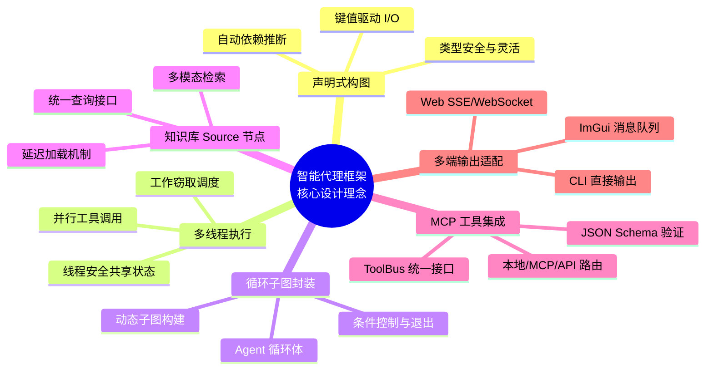
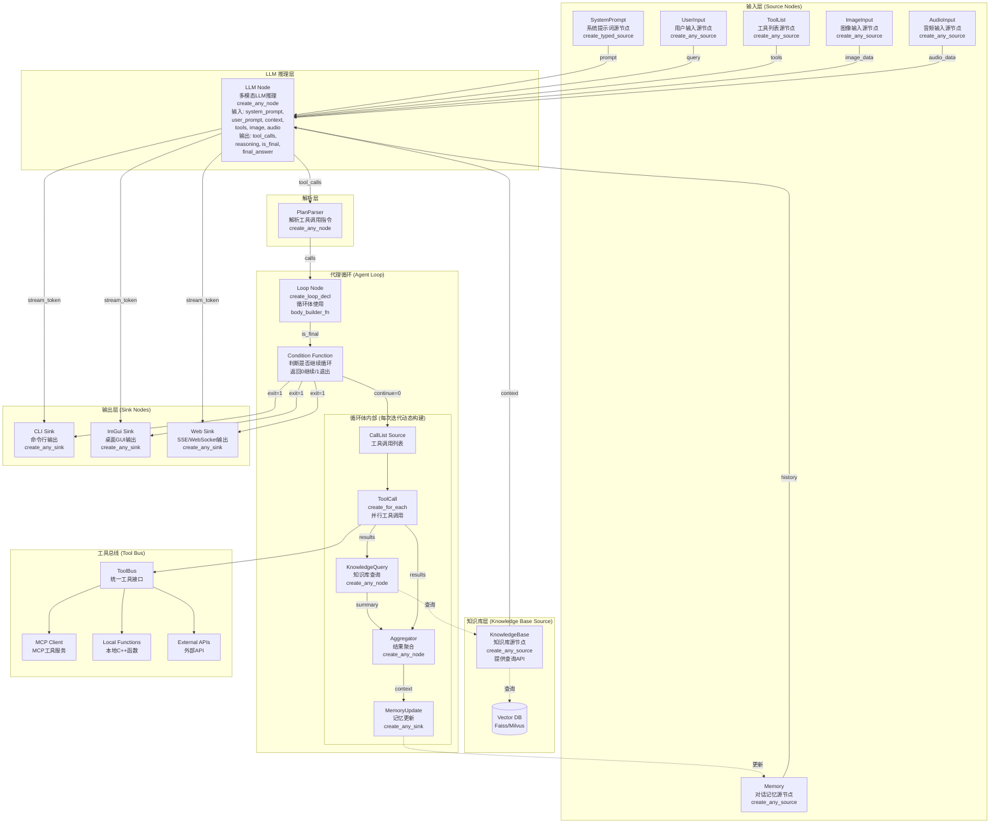
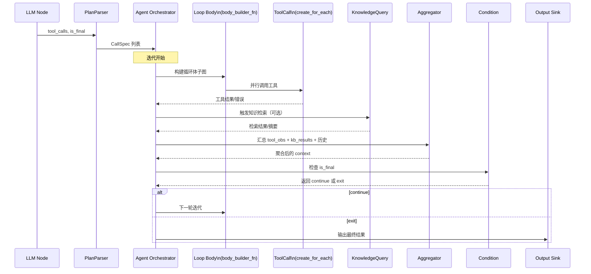
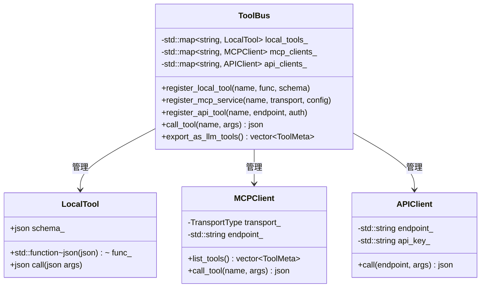
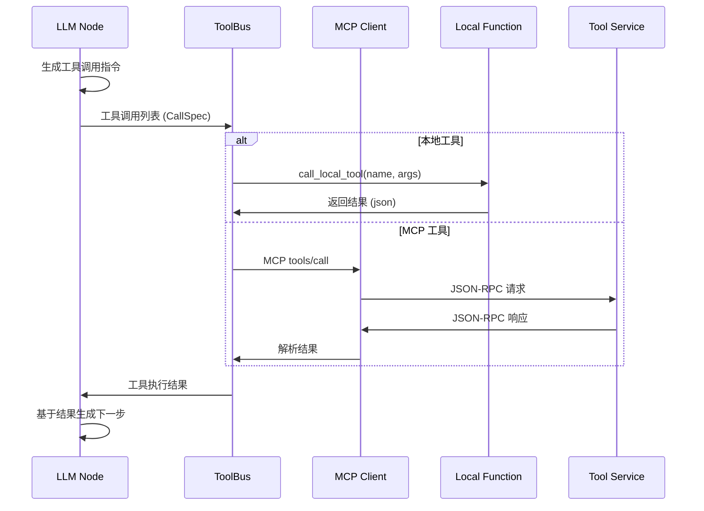
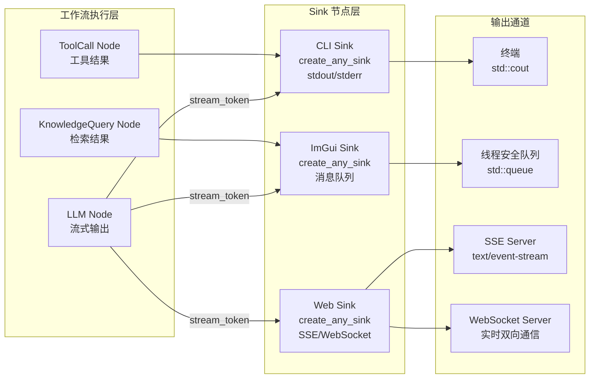
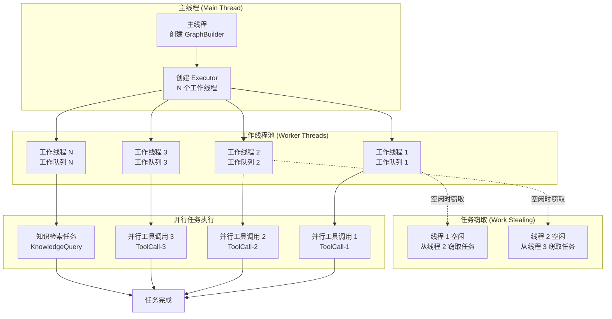

## 一、背景与动机

随着大型语言模型（Large Language Model，LLM）的快速发展，人工智能应用从静态对话助手逐步过渡到具备自主规划、决策和执行能力的代理系统。新一代代理不仅能理解自然语言，还能够调用外部工具、检索知识库、处理多模态输入，并实时输出推理过程【437883083434672†L65-L79】。例如，OpenAI 在 2025 年推出的实时 API 可以以 200 至 300 毫秒的延迟持续输出语音和文本，并支持函数调用、WebRTC / WebSocket 传输等特性【621311804125779†L140-L166】。用户体验不再局限于等待完整结果，而是需要看到模型逐字生成的内容，甚至在音频输入时实时打断并修改指令【621311804125779†L174-L214】【621311804125779†L245-L258】。

另一方面，多模态大模型在 2024-2025 年取得显著突破，能够同时理解文本、图像、音频、视频等信息。多模态模型通过共享架构将不同模态编码为统一的语义嵌入，使系统能够跨模态推理和生成【927160657251235†L169-L226】。例如 GPT-4V 可同时处理视觉和文本输入，并通过自回归方式生成文字解释，而 Sora 则采用扩散模型以文本生成视频【918647955484138†L115-L127】。多模态能力要求代理框架不仅在内部处理不同类型的数据，还要支持在知识检索和工具调用过程中混合文本、图片、音频等源数据，提高回答的丰富性和准确性【927160657251235†L136-L151】。

此外，传统检索增强生成（RAG）系统只能处理文本，难以应对图片、音频等多模态知识的检索与整合。多模态 RAG 通过向量数据库保存文本、图像、音频的嵌入，并在检索后利用融合层将不同模态的信息整合到统一上下文，以支持面向复杂场景的解答【253686691880274†L242-L306】。针对客服场景，当用户提供照片、语音描述和错误截图时，多模态 RAG 能够同时检索这些信息并生成精准回复【253686691880274†L242-L261】。

构建具有上述能力的高性能代理框架需要解决多方面挑战：

1. **高并发调度与实时反馈**：代理往往需要并行调用多个工具和检索服务，合理安排依赖和控制流以减少等待时间，并通过流式协议实时向用户展示思考和结果【825014821319660†L64-L109】【723136666980538†L480-L599】。
2. **多模态融合**：为文本、图片、音频等不同数据设计统一的处理与融合机制，从编码、检索、注意力融合到生成全过程都要考虑模态差异【219518602455228†L164-L170】【803420306546639†L86-L90】。
3. **灵活的控制流和循环**：代理执行过程中可能需要多轮规划和工具调用，需要支持条件分支、循环迭代以及动态子图创建等功能【631946224216190†L1225-L1336】。
4. **可观察性与可维护性**：代理的行为和历史应被完整记录，支持回溯和重放；系统要具有清晰的模块边界、易于调试和扩展【269917138825994†L76-L123】。

为应对这些挑战，本报告基于 Taskflow 项目在 dev 分支提供的 `workflow` 库，设计了一套纯 C++ 实现的多模态智能代理框架。`workflow` 提供声明式图构造、控制流节点、并行算法节点以及动态子图等特性，可在多核环境下高效调度复杂工作流【631946224216190†L338-L352】。本报告将深入介绍 LLM 节点设计、多模态支持、实时输出方案，以及如何利用 Taskflow 构建灵活高效的循环子图，从而实现具备自主规划与执行能力的智能代理。

### 1.1 框架核心设计理念

本框架基于以下核心设计理念：



**关键特性**：

1. **Agent 以循环子图封装**：使用 `create_loop_decl` 将 Agent 的决策-执行循环封装为可复用的子图，循环体通过 `body_builder_fn` 在每次迭代时动态构建，支持灵活的工具调用和知识检索。

2. **LLM 节点多源输入设计**：LLM 节点通过 `input_specs` 接收系统提示词、用户提示词、知识库上下文、记忆、工具列表和多模态输入，实现了统一的提示词组装和上下文管理。

3. **知识库作为 Source 节点**：知识库通过 `create_any_source` 创建为 Source 节点，提供统一的查询 API。任何后续节点都可以通过 `input_specs` 引用知识库的输出，实现延迟加载和按需检索。

4. **Sink 节点统一输出处理**：所有输出都通过 `create_any_sink` 创建 Sink 节点处理，支持 CLI、ImGui 和 Web 客户端的不同需求，实现了多端适配的灵活架构。

5. **多线程并行执行**：基于 Taskflow 的工作窃取调度器，自动在多核 CPU 上并行执行工具调用和知识检索任务，充分利用硬件资源。

## 二、LLM 代理与多模态框架综述

### 2.1 LLM 代理系统组成

最新研究将 LLM 代理划分为四个核心子系统：**感知系统**、**推理系统**、**记忆系统**和**执行系统**【437511248842331†L78-L90】。感知系统接收来自用户和环境的输入（文本、语音、图像等），推理系统利用链式思考、树式推理等策略制定计划；记忆系统存储长短期知识；执行系统将计划转化为具体行动，例如调用外部工具或检索数据库。这种整合可以使代理完成过去难以实现的复杂任务，但也要求设计合理的控制流、记忆管理和工具接口【437511248842331†L115-L120】。

### 2.2 代理工作流与设计模式

在构建复杂代理时，架构模式对性能和可维护性具有决定作用。Hugging Face 提出的六种设计模式中，与本报告相关的有：

1. **Evaluator-Optimizer**：用于迭代改进模型或回答；通过评估器和优化器组成的循环实现多轮推理。
2. **Context-Augmentation**：利用检索增强模型上下文，通过调用工具和知识库扩充提示词【437883083434672†L167-L174】。
3. **Prompt-Chaining**：串联多个提示模板形成复杂推理链。
4. **Parallelization**：并行调用多个模块或工具；需解决依赖管理和负载均衡【437883083434672†L81-L84】。
5. **Routing**：根据意图或条件选择不同的工具或分支。
6. **Orchestrator-Workers**：由主控制器分配任务给多个工作节点，常用于多代理协作。

Craig Li 等人提出的代理工作流原则进一步强调：工作流应**可观察（Observable）**、**灵活（Flexible）**和**可恢复（Restorable）**【269917138825994†L76-L123】。为此，作者建议采用**事件驱动架构**（Event-Driven）、**事件溯源模式**（Event Sourcing）和**命令模式**（Command Pattern）来构建代理系统。事件驱动架构通过发布/订阅方式连接节点与主题，使系统可扩展、弹性强；事件溯源提供不可变的事件日志，用于回溯历史、持久化记忆；命令模式则将调度与执行解耦，使各节点易于重用和测试【269917138825994†L90-L123】。这些理念将在后文框架设计中发挥重要作用。

### 2.3 多模态大模型与融合策略

多模态大模型（MLLM）通过将预训练的语言模型与视觉、音频等特定编码器组合，可以获得比单纯文本模型更丰富的语义理解能力【803420306546639†L86-L90】。研究人员将多模态融合分为三个维度：

1. **模态融合机制**：包括抽象层（将非语言特征映射到隐语义空间）、投影层、语义嵌入层和交叉注意层【803420306546639†L121-L126】。交叉注意机制可以让模型在不同模态之间对齐信息，如让文本描述与图像区域对应【253686691880274†L296-L300】。
2. **融合层级**：分为早期融合、中期融合和混合融合【219518602455228†L164-L170】。早期融合在输入阶段将不同模态合并，适用于模态间交互性强的任务；中期融合先分别编码各模态，再在中间层进行合并；晚期融合则分别得到各模态的输出后再组合。混合融合则在不同层级综合多种方式，兼顾效率和表达力。
3. **表示学习策略**：包括联合表示（joint representation）和协调表示（coordinated representation）。联合表示直接将多模态信息映射到同一语义空间；协调表示则在各自空间中保持一定独立性，使用对齐策略关联【803420306546639†L121-L127】。

在工程实践中，常见的多模态融合策略有：

* **早期融合**：将图像向量与文本向量拼接后输入模型，适用于两个模态密切相关、数据量较小的场景【219518602455228†L164-L170】。
* **中期融合**：分别用专用编码器处理图像、文本后，通过线性层或注意力机制融合，兼顾效率和效果。
* **晚期融合**：如在检索系统中，分别检索文本和图像结果，再由上层逻辑进行排序和组合。

近年来一些知名的多模态大模型包括 GPT‑4V （视觉语言模型）、Gemini （整合文本、图像、音频）以及 Sora （视频生成模型），它们分别展现出强大的视觉理解与跨模态推理能力【927160657251235†L266-L283】【918647955484138†L115-L127】。

### 2.4 实时流式输出

在用户交互中，流式输出可以显著提高体验：用户在提交问题后，不再等待完整结果，而是看到模型逐字生成的回应。根据 Procedure Tech 的文章，服务器发送事件（Server‑Sent Events, SSE）是 2025 年流式 LLM 应用的中流砥柱，它具有连接简单、无双向握手、自动重连和兼容 HTTP 等优点，适合大多数需要实时反馈的应用【825014821319660†L64-L109】。与之相比，WebSocket 虽然支持全双工，但需要额外的基础设施如连接池和负载均衡，部署复杂度高；gRPC 则更适合服务间通信而非浏览器环境【825014821319660†L64-L109】。FreeCodeCamp 的教程进一步说明，SSE 依托 EventSource 接口和 text/event-stream 协议，在 HTTP 连接上维持单向传输，支持自动重连和浏览器兼容，适用于新闻推送、监控面板和 Generative AI 的逐 token 输出【723136666980538†L480-L599】。但 SSE 限制同时连接数且只支持 UTF‑8 文本，复杂交互场景仍需要 WebSocket【723136666980538†L546-L557】。

OpenAI 的 Realtime API 则展示了实时多模态对话的最佳实践：客户端首先通过 HTTP 创建会话，然后升级到 WebSocket，持续传输音频和文本流，服务器在检测到语义片段或函数调用时会及时以 JSON 格式推送事件或音频片段【621311804125779†L174-L214】。同时，服务器还会不断返回部分转录文本和中间结果，允许用户实时打断或复述。这些经验提醒我们，代理框架需要在内部预留流式事件接口，并支持在特定节点（如 LLM 或外部工具）输出部分结果或状态。

### 2.5 检索增强生成与多模态 RAG

传统 RAG 通过语言模型作为生成器，向量数据库作为检索器，在生成前先检索与用户问题相关的文本片段，再将其加入提示词进行回答。然而在多模态场景下，用户可能提供图片或语音，知识库也包含图像、音频、视频等多模态数据。多模态 RAG 利用专用编码器（如 CLIP 处理图像、Whisper 处理音频）将不同模态映射到向量空间，存储在向量数据库中，然后通过跨模态注意力和融合层将检索结果整合到统一上下文中【253686691880274†L272-L306】。检索过程中，系统会根据用户输入的类型选择相应编码器，利用相似度搜索获得相关文档，再将多模态信息经过融合层和交叉注意力层整合，最终交由 LLM 生成答案【253686691880274†L242-L306】。多模态 RAG 架构的关键组件包括：

1. **用户查询处理与多模态编码器**：根据输入类型调用相应的模型（如 BERT 用于文本，CLIP 用于图像，Whisper 用于音频），将数据转换为嵌入【253686691880274†L272-L279】。
2. **向量数据库/知识仓库**：存储各种模态的向量嵌入，支持高效相似度搜索【253686691880274†L282-L285】。
3. **检索系统**：根据查询嵌入在向量数据库中检索最相关的多模态文档，并结合语义搜索与关键字搜索【253686691880274†L289-L292】。
4. **跨模态注意力与融合层**：将检索到的不同模态信息对齐，匹配文本段与图像区域，并融合为统一上下文，以供后续生成【253686691880274†L296-L306】。
5. **生成与后处理**：LLM 根据融合的多模态上下文生成回答，必要时对输出进行重排序、过滤或格式化【253686691880274†L267-L270】。

多模态 RAG 提供了超越传统文本检索的能力，使代理可以解答涉及图片说明、语音描述和视频内容的问题，为各行业的场景提供更丰富、更准确的答案【253686691880274†L242-L261】。

## 三、Taskflow 与 workflow 库综述

### 3.1 Taskflow 基本特性

Taskflow 是一个以工作窃取（work‑stealing）执行器为基础的通用任务并行编程框架，旨在帮助开发者用较少的代码表达复杂的任务依赖关系并在多核 CPU 甚至 GPU 上高效调度执行。其核心特点包括：

* **轻量级和易用性**：Taskflow 是单头文件库，支持 C++17 标准，无需安装即可使用。通过任务流（`tf::Taskflow`）和执行器（`tf::Executor`）即可定义任务并启动运行【201813784348343†L41-L76】。
* **显式依赖建模**：开发者可以通过 `emplace` 创建任务并使用 `precede` 和 `succeed` 定义依赖关系。例如，在四个任务 A、B、C、D 中指定 A 先于 B 和 C，D 在 B 和 C 之后执行【201813784348343†L35-L58】。
* **子流（Subflow）支持**：Taskflow 允许在任务执行过程中生成新的子图，从而实现递归并行。例如在 B 任务中通过 `tf::Subflow` 创建 B1、B2、B3 等子任务，并指定它们之间的依赖【201813784348343†L93-L118】。
* **条件任务**：可以创建返回整数的条件任务，根据返回值决定下一步执行的任务，实现循环或分支逻辑【201813784348343†L121-L139】。
* **任务流组合**：可将一个任务流作为模块嵌入到另一个任务流，通过 `composed_of` 实现模块化复用【201813784348343†L141-L165】。
* **异步任务和动态任务图**：执行器提供 `async` 和 `silent_async` 方法启动异步任务。Taskflow 3.6 版引入了 `dependent_async` 等接口，支持在运行时创建依赖于其他任务的异步任务，实现动态任务图【548440874866018†L29-L66】。这为表达动态循环和实时构建子任务提供了底层支持。
* **标准并行算法**：Taskflow 内置 for_each、reduce、sort 等并行算法，可以与任务流混合使用，减少样板代码【201813784348343†L193-L210】。
* **GPU 任务**：通过 cudaFlow 接口，Taskflow 支持将任务 offload 到 CUDA GPU 上执行，实现 CPU‑GPU 协同【201813784348343†L255-L283】。
* **可视化与分析**：Taskflow 可导出 DOT 图并提供 TFProf 工具查看执行时间线，便于调试和性能优化【201813784348343†L292-L310】。

Taskflow 的新版本持续增强调度性能和算法库。3.10 版在工作窃取调度、内存布局、并行 for / reduce 等方面进行了优化【125087198736220†L29-L87】；3.6 版引入动态任务图和并行扫描算法【548440874866018†L29-L97】。这些特性为构建高性能智能代理提供了强大的基础。

### 3.2 workflow 库特性

Taskflow `workflow` 库是在 dev 分支上开发的高级数据流建模工具，提供声明式、键值驱动的工作流构建能力，兼顾类型安全和动态灵活性【631946224216190†L338-L352】。其主要优势如下：

1. **基于键的 I/O**：每个节点的输入和输出都通过字符串键指定，形式为 `{源节点名, 输出键名}`，无需在代码中硬编码函数签名，依赖通过输入规格自动推断【631946224216190†L338-L352】。
2. **多种节点类型**：包括编译期类型安全的 `TypedNode`、`TypedSource`、`TypedSink`，以及运行时类型的 `AnyNode`、`AnySource`、`AnySink`，可根据场景在性能和灵活性之间权衡【631946224216190†L338-L352】。
3. **高级控制流节点**：提供 `create_condition_decl`、`create_multi_condition_decl`、`create_pipeline_node`、`create_loop_decl` 等用于条件分支、并行分支、流水线和循环结构【631946224216190†L1225-L1334】。特别是 `create_loop_decl` 支持通过 `create_subtask` 在每次迭代动态构建子图，实现复杂循环逻辑【631946224216190†L1280-L1334】。
4. **并行算法节点**：通过 `create_for_each`、`create_for_each_index`、`create_reduce`、`create_transform` 等接口，直接将 Taskflow 的并行算法嵌入数据流图，实现容器遍历、索引遍历、归约和变换等操作【631946224216190†L1340-L1362】。
5. **统一节点接口**：所有节点派生自 `INode`，可通过名称获取输出、查询节点类型、设置回调等，便于组合和调试【631946224216190†L338-L352】。

因为 `workflow` 会根据输入规格自动连接依赖，开发者无需显式调用 `precede/succeed`，极大简化了图结构构建。这种声明式风格不仅提升了代码可读性，也降低了连接错误的概率，并使得流程容易可视化和维护【631946224216190†L609-L643】。

## 四、LLM 节点设计与实现

### 4.1 LLM 节点功能需求

LLM 节点是代理框架的核心决策节点，负责整合多源输入并生成推理结果。其设计需满足以下需求：

1. **多模态输入支持**：在用户起始节点提供的文本、图像或音频输入基础上，将其编码并传递给 LLM。如果模型支持视觉或语音输入，则直接将编码结果插入 prompt；否则需在 prompt 中描述附件内容。

2. **工具调用生成**：LLM 需要根据可用工具的函数签名输出工具调用列表。这要求在 prompt 中嵌入工具的名称和参数描述【437883083434672†L167-L174】。

3. **系统提示词与用户提示词分离**：为降低幻觉并提高控制力，系统提示词（例如"你是一名专业的卫星设计专家"）应与用户输入分开，并在节点配置中保留修改接口。Dify 文档说明 LLM 节点可以同时配置系统提示词、用户提示词和助手提示词，并根据业务场景选择不同的模型和参数【449621660025648†L169-L226】。

4. **上下文变量插入**：在检索增强的应用中，知识检索节点会输出包含引用信息的结果列表，LLM 节点应通过 context 变量将其插入提示词，以供模型参考。这种设计不仅可以丰富答案，还可以支持引用和溯源功能【449621660025648†L250-L260】。

5. **多轮对话记忆**：LLM 节点需要读取记忆节点输出的历史对话并拼接到新的 prompt 中，以实现对话上下文的理解。Dify 文档提供了 Memory Window 的配置，可控制插入多少历史内容【449621660025648†L315-L320】。

6. **流式输出**：为了实时呈现模型的推理过程，LLM 节点的底层客户端应支持流式 token 输出，并在每个 token 生成后通过 Sink 节点发送给前端【621311804125779†L174-L214】。

### 4.2 LLM 节点数据结构

为在 `workflow` 中以类型安全方式传递 LLM 的输入和输出，本框架定义了以下结构：

```cpp
#include <nlohmann/json.hpp>
#include <string>
#include <vector>
#include <optional>

using json = nlohmann::json;

// 工具元数据
struct ToolMeta {
    std::string name;              // 工具名称
    json schema;                  // JSON Schema 描述（OpenAI Function Calling 格式）
    std::string description;       // 工具说明
};

// LLM 输入结构
    struct LLMInput {
    std::string system_prompt;     // 系统提示词（角色定义、行为规范）
    std::string user_prompt;       // 用户提示词（当前问题或指令）
    std::string context;           // 从知识库检索的内容摘要（多模态 RAG 结果）
    std::vector<ToolMeta> tools;   // 可用工具列表（ToolBus 导出）
    std::optional<std::string> image_data;  // 图像 base64 编码（可选）
    std::optional<std::string> audio_data;  // 音频 base64 编码（可选）
};

// 工具调用规范
struct CallSpec {
    std::string name;              // 工具名称
    json arguments;                // 调用参数（JSON 对象）
};

// LLM 输出结构
    struct LLMOutput {
    std::vector<CallSpec> tool_calls;  // 工具调用列表
    std::string reasoning;             // 中间思考和计划描述
    bool is_final;                     // 是否已完成任务（true 表示生成最终答案）
    std::string final_answer;          // 最终回答（仅当 is_final 为真时有效）
    std::optional<std::string> audio_out;  // 语音输出（可选，如 GPT-4o Realtime API）
    };
```

### 4.3 LLM 节点实现（基于 workflow API）

在 `workflow` 中，LLM 节点使用 `create_any_node` 创建，通过 `input_specs` 自动建立依赖关系：

```cpp
#include <workflow/nodeflow.hpp>
#include <taskflow/taskflow.hpp>

namespace wf = workflow;

// 创建 LLM 节点
auto [llm_node, llm_task] = builder.create_any_node(
    "LLM",  // 节点名称
    // input_specs: 自动建立依赖关系
    {
        {"SystemPrompt", "prompt"},      // 系统提示词源节点
        {"UserInput", "query"},          // 用户输入源节点
        {"KnowledgeBase", "context"},     // 知识库查询结果（Source 节点提供）
        {"Memory", "history"},           // 对话记忆
        {"ToolList", "tools"},           // 工具列表（ToolBus 导出）
        {"ImageInput", "image_data"},     // 可选：图像输入
        {"AudioInput", "audio_data"}     // 可选：音频输入
    },
    // Functor: 接收输入并调用 LLM
    [&llm_client, &stream_callback](const std::unordered_map<std::string, std::any>& inputs) {
        // 1. 提取输入数据
        LLMInput llm_input;
        llm_input.system_prompt = std::any_cast<std::string>(inputs.at("prompt"));
        llm_input.user_prompt = std::any_cast<std::string>(inputs.at("query"));
        llm_input.context = std::any_cast<std::string>(inputs.at("context"));
        llm_input.tools = std::any_cast<std::vector<ToolMeta>>(inputs.at("tools"));
        
        // 2. 处理可选的多模态输入
        if (inputs.find("image_data") != inputs.end()) {
            llm_input.image_data = std::any_cast<std::string>(inputs.at("image_data"));
        }
        if (inputs.find("audio_data") != inputs.end()) {
            llm_input.audio_data = std::any_cast<std::string>(inputs.at("audio_data"));
        }
        
        // 3. 调用 LLM（支持流式输出）
        LLMOutput output = llm_client.invoke(llm_input, stream_callback);
        
        // 4. 返回输出（自动转换为 shared_future<any>）
        return std::unordered_map<std::string, std::any>{
            {"tool_calls", std::any{output.tool_calls}},
            {"reasoning", std::any{output.reasoning}},
            {"is_final", std::any{output.is_final}},
            {"final_answer", std::any{output.final_answer}},
            {"audio_out", std::any{output.audio_out.value_or("")}}
        };
    },
    // output_keys: 后续节点通过这些键访问输出
    {"tool_calls", "reasoning", "is_final", "final_answer", "audio_out"}
    );
```

**关键设计要点**：

1. **自动依赖推断**：`input_specs` 中的 `{"SystemPrompt", "prompt"}` 会自动建立 `SystemPrompt` 节点到 `LLM` 节点的依赖关系，无需手动调用 `precede`。
2. **多源输入融合**：LLM 节点从多个源节点接收数据，包括系统提示词、用户输入、知识库上下文、记忆和工具列表。
3. **流式输出回调**：`stream_callback` 在 LLM 生成每个 token 时触发，可以立即推送到 SSE/WebSocket 或 GUI 界面。
4. **类型安全**：输入数据结构化，使用 `std::any_cast` 进行类型转换，在运行时检查类型匹配。

### 4.4 知识库 Source 节点设计

知识库节点作为 **Source 节点**，为后续节点提供查询 API。这种设计使得知识库成为一个可复用的数据源，可以被多个节点（如 LLM 节点、工具调用节点）查询：

```cpp
// 知识库 Source 节点：提供查询 API
auto [kb_source, kb_task] = builder.create_any_source(
    "KnowledgeBase",
    [&vector_store, &user_query](wf::GraphBuilder& gb) {
        // 知识库节点根据用户查询或工具输出执行检索
        // 返回多模态检索结果（文本摘要、图片链接、音频片段等）
        std::string query = extract_query_from_context(user_query);
        
        // 执行向量检索
        auto results = vector_store.search(query, /*top_k=*/5);
        
        // 生成融合的上下文摘要
        std::string context_summary = vector_store.summarize(results);
        
        return std::unordered_map<std::string, std::any>{
            {"context", std::any{context_summary}},
            {"raw_results", std::any{results}},
            {"citations", std::any{extract_citations(results)}}
        };
    }
    );
```

**知识库 Source 节点的优势**：

1. **统一接口**：知识库作为 Source 节点，提供统一的查询接口，任何节点都可以通过 `input_specs` 引用其输出。
2. **延迟加载**：Source 节点的 functor 在需要时才执行，可以按需检索，避免不必要的查询。
3. **多模态支持**：知识库节点可以同时检索文本、图像、音频等多种模态，并返回融合后的上下文。
4. **引用追踪**：知识库节点可以返回引文信息（citations），供 LLM 节点在生成答案时引用。

### 4.5 LLM 客户端实现示例

LLM 客户端负责与模型服务通信，支持流式输出和多模态输入：

```cpp
class LLMClient {
private:
    std::string api_endpoint_;
    std::string api_key_;
    HTTPClient http_client_;
    
public:
    LLMOutput invoke(const LLMInput& input, 
                    std::function<void(std::string_view)> on_stream) {
        // 1. 构建请求（OpenAI Chat Completions 格式）
        json request = build_openai_request(input);
        
        // 2. 发送流式请求
        auto response = http_client_.post_stream("/v1/chat/completions", request);
        
        // 3. 处理流式响应
        LLMOutput output;
        std::string accumulated_text;
        std::vector<json> tool_calls_buffer;
        
        for (auto& chunk : response.stream()) {
            // 提取 token
            if (chunk.contains("choices") && chunk["choices"].is_array()) {
                auto& delta = chunk["choices"][0]["delta"];
                
                if (delta.contains("content")) {
                    std::string token = delta["content"].get<std::string>();
                    accumulated_text += token;
                    on_stream(token);  // 实时推送 token
                }
                
                // 检查工具调用
                if (delta.contains("tool_calls")) {
                    auto& tool_call = delta["tool_calls"][0];
                    tool_calls_buffer.push_back(tool_call);
                }
            }
        }
        
        // 4. 解析工具调用
        for (const auto& tc_json : tool_calls_buffer) {
            CallSpec spec;
            spec.name = tc_json["function"]["name"].get<std::string>();
            if (tc_json["function"]["arguments"].is_string()) {
                spec.arguments = json::parse(tc_json["function"]["arguments"].get<std::string>());
            } else {
                spec.arguments = tc_json["function"]["arguments"];
            }
            output.tool_calls.push_back(spec);
        }
        
        output.final_answer = accumulated_text;
        output.is_final = output.tool_calls.empty();  // 无工具调用则视为最终答案
        output.reasoning = extract_reasoning(accumulated_text);
        
        return output;
    }
    
private:
    json build_openai_request(const LLMInput& input) {
        json request = {
            {"model", "gpt-4o"},
            {"messages", json::array({
                {{"role", "system"}, {"content", input.system_prompt}},
                {{"role", "user"}, {"content", input.user_prompt}}
            })},
            {"stream", true},
            {"temperature", 0.7}
        };
        
        // 添加工具列表
        json tools = json::array();
        for (const auto& tool : input.tools) {
            tools.push_back({
                {"type", "function"},
                {"function", {
                    {"name", tool.name},
                    {"description", tool.description},
                    {"parameters", tool.schema}
                }}
            });
        }
        request["tools"] = tools;
        
        // 添加多模态输入（如果是 GPT-4o 等支持多模态的模型）
        if (input.image_data.has_value()) {
            request["messages"][1]["content"].push_back({
                {"type", "image_url"},
                {"image_url", {{"url", "data:image/png;base64," + *input.image_data}}}
            });
        }
        
        return request;
    }
};
```

`call_llm_model` 函数内部使用 OpenAI 或其他模型的客户端，通过接口参数控制温度、Top P 等生成参数，并将检索内容和工具列表拼接到提示中。若模型支持视觉或音频输入，则在 `multimodal_inputs` 字段中传递预编码的向量，并在 prompt 中引用相关标记。

### 4.3 多模态 LLM 节点实现

在多模态场景中，LLM 节点需要结合视觉模型和语音模型，以支持图片理解和语音转写。例如，若用户上传一张卫星图像并提问“请分析这张照片中的卫星型号”，框架应在 LLM 节点之前调用图像编码器（如 CLIP）将图片转换为文本描述或嵌入向量，然后将该描述插入 LLM 的提示。在 Dify 文档中，LLM 节点支持配置“文件变量”，可直接将文件内容引入 prompt 【449621660025648†L268-L273】；这种思路也适用于我们框架，通过 `multimodal_inputs` 字段传递图片嵌入或转写文本，并在提示中使用占位符引用。

为支持多模态，我们定义以下辅助节点：

* **ImageEncoder 节点**：输入为图片文件或路径，输出为文本描述或向量嵌入。可调用 CLIP 或 BLIP‑2 模型，对图片进行编码，并返回文本说明供 LLM 引用。
* **AudioTranscriber 节点**：输入为音频文件，输出为转录文本和音频嵌入。可调用 Whisper 模型，将语音转成文字，同时保留音频向量用于匹配。
* **VectorStoreRetriever 节点**：根据查询向量在多模态向量数据库中检索相关记录，返回文本段、图片、音频等文档，并带有位置或引用信息，以便在 LLM 提示中引入。

这些节点可以通过 `create_typed_node` 或 `create_any_node` 加入工作流，并在 LLM 节点执行前完成多模态转换和检索。得到的多模态描述通过 `context` 变量拼接进 LLM 提示，赋予模型跨模态推理的能力。

## 五、多模态支持与融合实现

### 5.1 模态编码与向量化

在多模态代理中，各种输入（文本、图像、音频、视频、结构化数据）需要通过专门的编码器转换为向量或文本描述：

* **文本编码**：使用 BERT、LLM 或 Sentence Transformers 等模型将文本映射到向量空间，作为检索和融合的基础。
* **图像编码**：使用视觉语言模型（如 CLIP、BLIP‑2、Q‑Former）将图片转换为文本描述或视觉特征向量。CLIP 的图像编码器可以生成统一的视觉嵌入，适合与文本向量比较【253686691880274†L320-L326】。
* **音频编码**：采用 Whisper 等端到端语音识别模型将音频转写成文本，并可输出声学嵌入，用于匹配音频特征【253686691880274†L330-L334】。
* **视频编码**：利用时序模型（如 ViViT 或 VideoMAE）结合图像编码器和音频编码器提取关键帧和声音特征，生成跨模态向量用于检索【253686691880274†L336-L342】。
* **结构化数据编码**：对于表格、数据库记录等结构化数据，可通过行列嵌入或语义模型将其转换为向量【253686691880274†L344-L350】。

编码后，所有向量存入统一的向量数据库（如 Faiss 或 Milvus），并将原始文档的引用信息存储在元数据中，便于检索后输出引用。系统还需要维护模态标签，以便在检索时根据用户的查询类型选择合适的编码器和相似度函数。

### 5.2 检索与融合流程

在执行多模态查询时，工作流遵循以下步骤：

1. **查询编码**：根据用户输入的模态，调用相应编码器得到查询向量。例如，文字问题使用文本编码器，图片问题使用图像编码器。对于组合查询，可以将不同模态的向量拼接或融合后进行检索。
2. **向量检索**：在向量数据库中执行相似度搜索，返回一组 (k 个) 最相关的文档。为了兼顾语义匹配和关键词精确度，可采用混合检索策略，通过语义搜索和符号搜索结合【253686691880274†L289-L292】。
3. **跨模态注意力**：如果检索到的文档包含多模态内容，需要通过跨模态注意力机制将文本与图片、音频之间建立对齐关系。例如，将文本描述与图像区域匹配，或者将语音描述与文本段关联【253686691880274†L296-L299】。
4. **融合层**：将检索结果融合到统一的上下文向量或文本中，为 LLM 生成提供完整的语义信息。融合过程应考虑各模态的重要性，通过注意力或加权平均等策略平衡不同来源【253686691880274†L301-L304】。
5. **结果集成**：最终将融合后的多模态内容嵌入 LLM 提示词，或在模型生成后由后处理模块输出多模态解释（例如图文并茂的答案）。

### 5.3 融合策略与算法

如第二节所述，融合策略主要包括早期、中期、晚期和混合融合【219518602455228†L164-L170】。在本框架中，我们可以根据任务需求选择合适策略：

* 对于需要紧密结合文本和图片的任务（例如图片描述和问答），可采用中期融合。首先使用专用编码器分别提取特征，然后通过 Q‑Former 或跨注意力层将视觉特征映射到语言空间，再由 LLM 生成答案。
* 对于检索任务，可使用晚期融合。分别检索文本和图片结果，再由融合层根据查询意图将两个结果集合并或重排序。
* 在复杂场景下，可以采用混合融合：早期在输入层融合图片和音频信息用于检索，中期在 LLM 中融合文本和图像描述用于理解，晚期将不同模态结果排序或拼接输出。

此外，工程实现应考虑数据稀缺、推理开销和训练策略。现有研究表明，单阶段训练和两阶段训练均可用于多模态模型；采用联合或协调嵌入可以更好地学习跨模态联系【803420306546639†L121-L127】。

## 六、实时输出与流式传输实现

### 6.1 SSE 和 WebSocket 比较

在 Web 环境下实现实时输出有多种技术方案。Server‑Sent Events (SSE) 是一种基于 HTTP 的单向流式通信技术，可以让服务器不断向客户端推送事件，并由浏览器自动重连【723136666980538†L480-L599】。SSE 具有以下优点：

* **实现简单**：仅依赖标准 HTTP 协议，后端实现和部署成本低，前端可使用 `EventSource` 对象直接接收消息【723136666980538†L517-L521】。
* **自动重连**：浏览器在连接断开时会自动尝试重新建立连接【723136666980538†L536-L538】。
* **防火墙友好**：由于使用标准 HTTP 端口 80/443，较少受防火墙限制【723136666980538†L540-L542】。
* **易于负载均衡**：与长连接不同，SSE 可以通过传统的 HTTP 负载均衡器处理请求和转发。

缺点是 SSE 仅支持单向文本流，不适合需要双向通信或传输二进制数据的场景【723136666980538†L546-L557】。WebSocket 则建立全双工连接，适用于需要客户端主动发送数据的场景，如实时协作或在线游戏。对于 LLM 流式输出，如果无需客户端实时发送指令，SSE 是更简单的选择【825014821319660†L64-L109】。

### 6.2 流式输出设计

在我们的代理框架中，LLM 节点和工具节点需要支持流式输出。设计方案包括：

1. **分块输出**：在 LLM 调用过程中，每生成一个 token 或一段文本，就立即通过 Sink 节点推送到前端。工具节点在执行过程中也可逐步输出中间状态。
2. **Sink 节点**：通过 `create_any_sink` 定义终端节点，内部实现 SSE 或 WebSocket 推送逻辑。Sink 节点接收来自上游节点的文本块或事件对象，将其序列化为 `data:` 格式的 SSE 消息，然后发送给客户端。
3. **客户端处理**：前端（CLI、ImGui 或 Web）通过事件流监听器逐步显示收到的 token，实现流畅的用户体验。对于 Web 客户端，可以在消息到达时更新文本区域或状态条。
4. **中断与控制**：在音频输入场景下，代理可以在 LLM 节点接收用户的中断信号，立即停止当前生成并重新规划。实时 API 的案例表明，适当的抖动缓冲和小块音频上传能降低延迟【621311804125779†L245-L258】。

SSE 的实现还需要处理浏览器同时连接数限制（通常为 6），因此在前端需要复用连接或对会话进行排队【723136666980538†L549-L551】。对于需要双向实时交互的场景，可在后端提供同时支持 SSE 和 WebSocket 的接口，由前端根据需求选择连接方式。

## 七、基于 workflow 构建代理工作流

### 7.1 总体架构

结合第二节的代理工作流原则和第三节的 workflow 特性，我们设计了如下多模态智能代理框架。该框架基于 Taskflow `workflow` 的声明式 API，通过键值驱动的数据流实现所有模块的连接：



框架分为以下部分：

1. **Source 节点层**：通过 `create_typed_source` 或 `create_any_source` 提供初始数据。包括：
   - **SystemPrompt**：系统提示词（角色定义）
   - **UserInput**：用户输入（问题或指令）
   - **Memory**：对话记忆（短期和长期）
   - **ToolList**：工具列表（从 ToolBus 导出）
   - **ImageInput/AudioInput**：多模态输入（可选）
   - **KnowledgeBase**：**知识库作为 Source 节点，提供查询 API**，任何节点都可以通过 `input_specs` 引用其输出

2. **LLM 节点**：使用 `create_any_node` 创建，接收多个输入并输出推理结果。输入包括：
   - `system_prompt`：系统提示词
   - `user_prompt`：用户提示词
   - `context`：知识库检索结果
   - `tools`：可用工具列表
   - `image_data`/`audio_data`：多模态输入（可选）
   
   输出包括：
   - `tool_calls`：工具调用列表
   - `reasoning`：中间推理
   - `is_final`：是否完成标志
   - `final_answer`：最终答案

3. **PlanParser 节点**：使用 `create_any_node` 解析 LLM 输出的工具调用指令，生成 `CallSpec` 列表。

4. **循环子图 (Agent Loop)**：使用 `create_loop_decl` 构建，**循环体通过 `body_builder_fn` 在每次迭代时动态构建子图**。循环体包含：
   - 工具调用列表源节点
   - 并行工具调用节点（`create_for_each`）
   - 知识库查询节点
   - 聚合节点
   - 记忆更新节点

5. **工具调用节点**：使用 `create_for_each` 并行调用工具，通过 ToolBus 统一接口路由到本地函数、MCP 服务或外部 API。

6. **知识库查询节点**：可以查询 KnowledgeBase Source 节点，获取额外的上下文信息。

7. **Sink 节点**：使用 `create_any_sink` 创建，支持回调函数实时处理输出，适配 CLI、ImGui 和 Web 客户端。

### 7.2 循环子图实现（基于 workflow API）

循环体是代理逻辑的核心，需要在每次迭代中动态构建子图并并行调用多个工具。我们利用 `create_loop_decl` 提供的 `body_builder_fn` 在每次迭代时动态构建子图。**重要**：循环体使用 `body_builder_fn` 参数，该函数接收 `GraphBuilder&` 和输入数据，在每次迭代时重建子图，避免状态污染。

#### 7.2.1 完整的循环子图实现

```cpp
#include <workflow/nodeflow.hpp>
#include <taskflow/taskflow.hpp>
#include <nlohmann/json.hpp>

namespace wf = workflow;
using json = nlohmann::json;

// 全局组件（通过引用捕获）
ToolBus toolbus;
KnowledgeBase knowledge_base;  // 向量数据库封装
MemoryStore memory_store;

// 循环迭代计数器（用于防止死循环）
static int loop_iteration = 0;
const int MAX_ITERATIONS = 10;

// 创建代理循环
auto [loop_node, loop_task] = builder.create_loop_decl(
    "AgentLoop",
    // input_specs: 从 LLM 和 PlanParser 获取输入（自动建立依赖）
    {
        {"LLM", "is_final"},           // LLM 输出的完成标志
        {"PlanParser", "calls"},      // 工具调用列表
        {"LLM", "reasoning"},          // LLM 推理过程
        {"LLM", "final_answer"},       // 最终答案
        {"Memory", "history"}         // 对话历史
    },
    // body_builder_fn: 循环体构建函数（每次迭代执行）
    [&toolbus, &knowledge_base, &memory_store](
        wf::GraphBuilder& gb, 
        const std::unordered_map<std::string, std::any>& inputs
    ) {
        // 1. 提取本轮工具调用列表
        auto call_specs = std::any_cast<std::vector<CallSpec>>(inputs.at("calls"));
        
        // 2. 创建工具调用列表源节点（在循环体内）
        auto [call_list_src, _] = gb.create_any_source(
            "CallList",
            std::unordered_map<std::string, std::any>{
                {"list", std::any{call_specs}}
            }
        );
        
        // 3. 并行调用工具（使用 create_for_each）
        // 共享状态：用于收集工具返回结果（线程安全）
        std::shared_ptr<std::vector<json>> shared_results = 
            std::make_shared<std::vector<json>>();
        std::mutex results_mutex;
        
        auto [tool_call_node, _] = gb.create_for_each<std::vector<CallSpec>>(
            "ToolCall",
            {{"CallList", "list"}},  // 输入：工具调用列表
            [&toolbus, shared_results, &results_mutex](
                const CallSpec& spec,
                std::unordered_map<std::string, std::any>& shared_params
            ) {
                // 调用工具（通过 ToolBus 统一接口）
                json result;
                try {
                    result = toolbus.call_tool(spec.name, spec.arguments);
                    result["success"] = true;
                    result["tool_name"] = spec.name;
                } catch (const std::exception& e) {
                    result = json{
                        {"success", false},
                        {"tool_name", spec.name},
                        {"error", e.what()}
                    };
                }
                
                // 写入共享结果（线程安全）
                {
                    std::lock_guard<std::mutex> lock(results_mutex);
                    shared_results->push_back(result);
                }
            },
            {}  // 无输出键（使用共享状态）
        );
        
        // 4. 创建共享结果源节点（供后续节点使用）
        auto [results_src, _] = gb.create_any_source(
            "ToolResults",
            [shared_results]() {
                return std::unordered_map<std::string, std::any>{
                    {"results", std::any{*shared_results}}
                };
            }
        );
        
        // 5. 知识库查询节点（查询 KnowledgeBase Source 节点）
        auto [kb_query_node, _] = gb.create_any_node(
            "KnowledgeQuery",
            {
                {"ToolResults", "results"},
                {"KnowledgeBase", "context"}  // 从知识库 Source 节点查询
            },
            [&knowledge_base](const std::unordered_map<std::string, std::any>& inputs) {
                auto results = std::any_cast<std::vector<json>>(inputs.at("results"));
                
                // 从工具结果中提取查询关键词
                std::string query = extract_query_from_tool_results(results);
                
                // 执行多模态检索（文本、图像、音频）
                auto kb_results = knowledge_base.search(query, /*top_k=*/5);
                
                // 生成摘要
                std::string summary = knowledge_base.summarize(kb_results);
                
                return std::unordered_map<std::string, std::any>{
                    {"summary", std::any{summary}},
                    {"raw_results", std::any{kb_results}},
                    {"citations", std::any{extract_citations(kb_results)}}
                };
            },
            {"summary", "raw_results", "citations"}
        );
        
        // 6. 聚合节点：合并工具结果、知识检索结果和 LLM 推理
        auto [agg_node, _] = gb.create_any_node(
            "Aggregator",
            {
                {"LLM", "reasoning"},          // LLM 推理过程
                {"ToolResults", "results"},     // 工具调用结果
                {"KnowledgeQuery", "summary"},  // 知识库检索摘要
                {"Memory", "history"}           // 对话历史
            },
            [](const std::unordered_map<std::string, std::any>& inputs) {
                std::string reasoning = std::any_cast<std::string>(inputs.at("reasoning"));
                auto tool_results = std::any_cast<std::vector<json>>(inputs.at("results"));
                std::string kb_summary = std::any_cast<std::string>(inputs.at("summary"));
                std::string history = std::any_cast<std::string>(inputs.at("history"));
                
                // 构建新的上下文
                std::ostringstream new_context;
                new_context << "Previous reasoning: " << reasoning << "\n\n";
                new_context << "Tool results:\n";
                for (const auto& res : tool_results) {
                    new_context << "- " << res["tool_name"] << ": " 
                                << res.dump() << "\n";
                }
                new_context << "\nKnowledge base summary:\n" << kb_summary;
                new_context << "\n\nConversation history:\n" << history;
                
                return std::unordered_map<std::string, std::any>{
                    {"context", std::any{new_context.str()}}
                };
                },
                {"context"}
            );
        
        // 7. 更新记忆节点（Sink）
        auto [mem_update, _] = gb.create_any_sink(
            "MemoryUpdate",
            {{"Aggregator", "context"}},
            [&memory_store](const std::unordered_map<std::string, std::any>& inputs) {
                std::string new_context = std::any_cast<std::string>(inputs.at("context"));
                memory_store.append_to_history(new_context);
                }
            );
        },
    // condition_func: 返回 0 继续循环，非 0 退出
    [](const std::unordered_map<std::string, std::any>& inputs) -> int {
            bool is_final = std::any_cast<bool>(inputs.at("is_final"));
        loop_iteration++;
        
        if (is_final || loop_iteration >= MAX_ITERATIONS) {
            return 1;  // 退出循环
        }
        return 0;  // 继续循环
    },
    // exit_builder_fn: 退出时执行
    [](wf::GraphBuilder& gb, const std::unordered_map<std::string, std::any>& inputs) {
        // 创建最终输出 Sink
            gb.create_any_sink(
                "FinalOutput",
            {{"LLM", "final_answer"}, {"LLM", "audio_out"}},
            [](const std::unordered_map<std::string, std::any>& outputs) {
                std::string answer = std::any_cast<std::string>(outputs.at("final_answer"));
                
                // 输出到不同渠道
                std::cout << "Final Answer: " << answer << std::endl;
                
                if (outputs.find("audio_out") != outputs.end()) {
                    std::string audio = std::any_cast<std::string>(outputs.at("audio_out"));
                    // 处理音频输出
                    save_audio_to_file(audio, "output.wav");
                }
                }
            );
        },
    {"context"}  // 循环的输出键（可选）
    );
```

#### 7.2.2 循环体执行流程图



**关键设计要点**：

1. **动态子图构建**：循环体使用 `body_builder_fn` 在每次迭代时重建子图，支持动态工具列表变化。这与 `create_subtask` 类似，但 `create_loop_decl` 提供了更完善的循环控制（条件判断、退出处理）。

2. **并行工具调用**：使用 `create_for_each` 并行调用所有工具，通过共享状态（shared state）收集结果，使用互斥锁保证线程安全。

3. **知识库 Source 节点查询**：KnowledgeQuery 节点通过 `input_specs` 引用 KnowledgeBase Source 节点，实现统一的查询接口。

4. **条件判断**：`condition_func` 根据 `is_final` 标志和迭代次数决定是否退出循环。

5. **退出处理**：`exit_builder_fn` 在循环退出时执行，输出最终结果。

6. **自动依赖**：循环体内的节点依赖关系通过 `input_specs` 自动建立，无需手动配置。

在此实现中，循环体从 `Parser` 节点接收工具调用列表，将其传入 for_each 节点并行执行。工具结果通过共享状态暂存，然后调用 KnowledgeQuery 节点检索新知识，再由 Aggregator 节点合并生成新的上下文。条件函数检查 LLM 是否已输出最终答案，若未完成则继续循环。本框架的并行工具调用利用 Taskflow 的并行算法，自动使用工作窃取调度多个线程执行任务【201813784348343†L193-L210】。

### 7.3 完整的端到端工作流构建示例

以下展示如何使用 Taskflow `workflow` 的声明式 API 构建完整的代理工作流。所有代码示例基于实际的 `workflow` API 实现：

#### 7.3.1 创建源节点（Source Nodes）

源节点负责注入初始数据，包括系统提示词、用户输入、对话记忆、工具列表和多模态输入：

```cpp
#include <workflow/nodeflow.hpp>
#include <taskflow/taskflow.hpp>
#include <nlohmann/json.hpp>
#include <iostream>
#include <memory>
#include <vector>

namespace wf = workflow;
using json = nlohmann::json;

// 全局组件（通过引用捕获）
ToolBus toolbus;
KnowledgeBase knowledge_base;  // 向量数据库封装
MemoryStore memory_store;
LLMClient llm_client;

int main() {
    // 1. 创建执行器和图构建器
    tf::Executor executor(std::thread::hardware_concurrency());  // 多线程执行器
    wf::GraphBuilder builder("agent_workflow");

    // 2. 初始化 ToolBus（注册工具）
    toolbus.register_local_tool("calculate", /* ... */);
    toolbus.register_mcp_service("filesystem", "stdio", /* ... */);

    // 3. 系统提示词源节点（Typed Source，类型安全）
    auto [sys_node, tSys] = builder.create_typed_source(
        "SystemPrompt",
        std::make_tuple(std::string("你是一名资深航天专家，擅长卫星设计和无线电传播分析。")),
        {"prompt"}
    );

    // 4. 用户输入源节点（Any Source，更灵活）
    auto [user_node, tUser] = builder.create_any_source(
        "UserInput",
        std::unordered_map<std::string, std::any>{
            {"query", std::any{std::string("查询北斗三号卫星的轨道参数")}}
        }
    );

    // 5. 对话记忆源节点（从持久化存储加载）
    auto [mem_node, tMem] = builder.create_any_source(
        "Memory",
        [&memory_store]() {
            std::string context = memory_store.retrieve_short_term();  // 获取最近N轮对话
            return std::unordered_map<std::string, std::any>{
                {"history", std::any{context}}
            };
        }
    );

    // 6. 工具列表源节点（从 ToolBus 导出工具 Schema）
    auto [tools_node, tTools] = builder.create_any_source(
        "ToolList",
        [&toolbus]() {
            auto tool_list = toolbus.export_as_llm_tools();
            return std::unordered_map<std::string, std::any>{
                {"tools", std::any{tool_list}}
            };
        }
    );

    // 7. 知识库源节点（提供查询 API）
    auto [kb_node, tKB] = builder.create_any_source(
        "KnowledgeBase",
        [&knowledge_base, &user_query]() {
            // 知识库作为 Source 节点，根据用户查询执行检索
            std::string query = extract_query_from_context(user_query);
            auto results = knowledge_base.search(query, /*top_k=*/5);
            std::string context_summary = knowledge_base.summarize(results);
            
            return std::unordered_map<std::string, std::any>{
                {"context", std::any{context_summary}},
                {"raw_results", std::any{results}},
                {"citations", std::any{extract_citations(results)}}
            };
        }
    );

    // 8. 可选：多模态输入源节点
    auto [img_node, tImg] = builder.create_any_source(
        "ImageInput",
        [](const std::string& image_path) {
            std::string base64_data = encode_image_to_base64(image_path);
            return std::unordered_map<std::string, std::any>{
                {"image_data", std::any{base64_data}}
            };
        }
    );
```

#### 7.3.2 创建 LLM 节点

LLM 节点是代理的核心决策节点，接收多个输入并输出推理结果：

```cpp
    // 9. 创建 LLM 节点（接收多源输入）
    std::function<void(std::string_view)> on_stream_token = 
        [&output_queue](std::string_view token) {
            // 实时推送到输出队列（线程安全）
            output_queue.push(std::string(token));
            // 如果使用 SSE，立即发送：sse_send(token);
        };

    auto [llm_node, tLLM] = builder.create_any_node(
        "LLM", 
        // input_specs: 自动建立依赖关系
        {
            {"SystemPrompt", "prompt"},      // 系统提示词
            {"UserInput", "query"},          // 用户输入
            {"Memory", "history"},           // 对话历史
            {"ToolList", "tools"},           // 工具列表
            {"KnowledgeBase", "context"}      // 知识库检索结果
            // ImageInput 和 AudioInput 是可选的，使用条件判断
        },
        // Functor: 接收输入并调用 LLM
        [&llm_client, on_stream](const std::unordered_map<std::string, std::any>& inputs) {
            // 1. 提取输入数据
            LLMInput llm_input;
            llm_input.system_prompt = std::any_cast<std::string>(inputs.at("prompt"));
            llm_input.user_prompt = std::any_cast<std::string>(inputs.at("query"));
            llm_input.context = std::any_cast<std::string>(inputs.at("context"));
            llm_input.tools = std::any_cast<std::vector<ToolMeta>>(inputs.at("tools"));
            
            // 2. 处理可选的多模态输入
            if (inputs.find("image_data") != inputs.end()) {
                llm_input.image_data = std::any_cast<std::string>(inputs.at("image_data"));
            }
            
            // 3. 调用 LLM（支持流式输出）
            LLMOutput output = llm_client.invoke(llm_input, on_stream);
            
            // 4. 返回输出（自动转换为 shared_future<any>）
            return std::unordered_map<std::string, std::any>{
                {"tool_calls", std::any{output.tool_calls}},
                {"reasoning", std::any{output.reasoning}},
                {"is_final", std::any{output.is_final}},
                {"final_answer", std::any{output.final_answer}},
                {"audio_out", std::any{output.audio_out.value_or("")}}
            };
        },
        // output_keys: 后续节点通过这些键访问输出
        {"tool_calls", "reasoning", "is_final", "final_answer", "audio_out"}
    );
```

#### 7.3.3 创建 PlanParser 节点

PlanParser 节点解析 LLM 输出的工具调用指令，生成 `CallSpec` 列表：

```cpp
    // 10. 创建 PlanParser 节点
    auto [parser_node, tParser] = builder.create_any_node(
        "PlanParser",
        {{"LLM", "tool_calls"}},  // 从 LLM 节点获取工具调用列表
        [](const std::unordered_map<std::string, std::any>& inputs) {
            auto calls_json = std::any_cast<std::vector<json>>(inputs.at("tool_calls"));
            std::vector<CallSpec> specs;
            
            for (const auto& c : calls_json) {
                CallSpec spec;
                spec.name = c["function"]["name"].get<std::string>();
                if (c["function"]["arguments"].is_string()) {
                    spec.arguments = json::parse(c["function"]["arguments"].get<std::string>());
                } else {
                    spec.arguments = c["function"]["arguments"];
                }
                specs.push_back(spec);
            }
            
            return std::unordered_map<std::string, std::any>{
                {"calls", std::any{specs}}
            };
        },
        {"calls"}
    );
```

#### 7.3.4 构建代理循环（Agent Loop）

代理循环是框架的核心，使用 `create_loop_decl` 构建，循环体在每次迭代时动态构建子图：

```cpp
    // 11. 创建代理循环（见 7.2 节的完整实现）
    static int loop_iteration = 0;
    const int MAX_ITERATIONS = 10;
    
    auto [loop_node, loop_task] = builder.create_loop_decl(
        "AgentLoop",
        {
            {"LLM", "is_final"},
            {"PlanParser", "calls"},
            {"LLM", "reasoning"},
            {"LLM", "final_answer"},
            {"Memory", "history"}
        },
        // body_builder_fn: 循环体构建函数（每次迭代执行）
        [&toolbus, &knowledge_base, &memory_store](
            wf::GraphBuilder& gb, 
            const std::unordered_map<std::string, std::any>& inputs
        ) {
            // 循环体实现（见 7.2.1 节）
            // ... 工具调用、知识检索、聚合、记忆更新 ...
        },
        // condition_func: 返回 0 继续循环，非 0 退出
        [](const std::unordered_map<std::string, std::any>& inputs) -> int {
            bool is_final = std::any_cast<bool>(inputs.at("is_final"));
            loop_iteration++;
            
            if (is_final || loop_iteration >= MAX_ITERATIONS) {
                return 1;  // 退出循环
            }
            return 0;  // 继续循环
        },
        // exit_builder_fn: 退出时执行
        [](wf::GraphBuilder& gb, const std::unordered_map<std::string, std::any>& inputs) {
            // 创建最终输出 Sink
            gb.create_any_sink(
                "FinalOutput",
                {{"LLM", "final_answer"}, {"LLM", "audio_out"}},
                [](const std::unordered_map<std::string, std::any>& outputs) {
                    std::string answer = std::any_cast<std::string>(outputs.at("final_answer"));
                    std::cout << "Final Answer: " << answer << std::endl;
                    
                    if (outputs.find("audio_out") != outputs.end()) {
                        std::string audio = std::any_cast<std::string>(outputs.at("audio_out"));
                        save_audio_to_file(audio, "output.wav");
                    }
                }
            );
                },
                {"context"}
            );

    // 12. 创建输出 Sink 节点（CLI、ImGui、Web）
    auto [cli_sink, _] = builder.create_any_sink(
        "CLISink",
        {{"LLM", "final_answer"}},
        [](const std::unordered_map<std::string, std::any>& outputs) {
            std::string answer = std::any_cast<std::string>(outputs.at("final_answer"));
            std::cout << answer << std::flush;
        }
    );

    // 13. 执行工作流
    std::cout << "Starting agent workflow..." << std::endl;
    builder.run(executor);
    
    // 14. 可选：输出图结构（用于调试）
    builder.dump(std::cout);
    
    return 0;
}
```

### 7.4 回溯和记忆管理

代理的记忆系统由 Memory 节点和事件日志组成。根据事件溯源模式，每次节点执行的输入、输出以及中间状态都作为事件写入不可变的日志【269917138825994†L140-L165】。Memory 节点负责从日志中读取相关历史并在下一轮提供给 LLM 节点。记忆分为：

1. **即时记忆（per request）**：在当前请求范围内保存从用户输入到每一次工具调用产生的事件，为每个节点执行提供完整的上游数据【269917138825994†L151-L156】。
2. **短期记忆（per conversation）**：在对话过程中保存上下文，使代理能够跨轮次理解历史。例如，记录用户提问、LLM 回答和工具调用结果，以便推理模型理解语境【269917138825994†L159-L163】。
3. **长期记忆（knowledge base）**：将重要的事件摘要或结果存入知识库，用于后续会话或其他代理使用。这可以通过 VectorStoreRetriever 实现，将摘要向量化并存储。

为了保证性能，Memory 节点应对长对话进行窗口截断或摘要压缩，避免提示过长导致生成成本上升。可以借鉴 Dify 的 Memory Window 机制，根据模型上下文窗口大小动态裁剪历史【449621660025648†L315-L320】。

### 7.5 MCP 工具集成与 ToolBus 设计

MCP (Model Context Protocol) 是一个开放标准，允许 LLM 应用与外部工具和服务集成。本框架通过 **ToolBus** 模块统一管理本地函数、MCP 服务和外部 API，为代理提供统一的工具调用接口。

#### 7.5.1 ToolBus 架构设计



#### 7.5.2 ToolBus 实现示例

```cpp
#include <nlohmann/json.hpp>
#include <functional>
#include <map>
#include <memory>
#include <string>

using json = nlohmann::json;

// 本地工具接口
struct LocalTool {
    std::function<json(const json&)> func;
    json schema;  // JSON Schema 描述
    std::string description;
};

// MCP 客户端（简化版）
class MCPClient {
private:
    enum class TransportType { STDIO, HTTP, WEBSOCKET };
    TransportType transport_;
    std::string endpoint_;
    
public:
    std::vector<ToolMeta> list_tools() {
        // 发送 MCP tools/list 请求
        json request = {
            {"jsonrpc", "2.0"},
            {"id", 1},
            {"method", "tools/list"}
        };
        json response = send_mcp_request(request);
        
        // 解析工具列表
        std::vector<ToolMeta> tools;
        for (const auto& tool : response["result"]["tools"]) {
            ToolMeta meta;
            meta.name = tool["name"];
            meta.schema = tool["inputSchema"];
            meta.description = tool["description"];
            tools.push_back(meta);
        }
        return tools;
    }
    
    json call_tool(const std::string& name, const json& arguments) {
        json request = {
            {"jsonrpc", "2.0"},
            {"id", 1},
            {"method", "tools/call"},
            {"params", {
                {"name", name},
                {"arguments", arguments}
            }}
        };
        json response = send_mcp_request(request);
        return response["result"]["content"][0]["text"];  // 提取结果文本
    }
    
private:
    json send_mcp_request(const json& request) {
        // 根据 transport_ 类型发送请求（stdio/HTTP/WebSocket）
        // 简化实现，实际需要处理连接管理和错误重试
        return json{};  // 占位符
    }
};

// ToolBus 主类
class ToolBus {
private:
    std::map<std::string, LocalTool> local_tools_;
    std::map<std::string, std::unique_ptr<MCPClient>> mcp_clients_;
    
public:
    // 注册本地 C++ 函数
    void register_local_tool(
        const std::string& name,
        std::function<json(const json&)> func,
        const json& schema,
        const std::string& description
    ) {
        local_tools_[name] = {func, schema, description};
    }
    
    // 注册 MCP 服务
    void register_mcp_service(
        const std::string& service_name,
        const std::string& transport,
        const json& config
    ) {
        auto client = std::make_unique<MCPClient>();
        // 配置客户端（transport, endpoint 等）
        mcp_clients_[service_name] = std::move(client);
    }
    
    // 调用工具（统一接口）
    json call_tool(const std::string& name, const json& arguments) {
        // 1. 检查是否为本地工具
        if (local_tools_.find(name) != local_tools_.end()) {
            return local_tools_[name].func(arguments);
        }
        
        // 2. 检查是否为 MCP 工具
        for (auto& [service_name, client] : mcp_clients_) {
            auto tools = client->list_tools();
            for (const auto& tool : tools) {
                if (tool.name == name) {
                    return client->call_tool(name, arguments);
                }
            }
        }
        
        throw std::runtime_error("Tool not found: " + name);
    }
    
    // 导出所有工具供 LLM 使用
    std::vector<ToolMeta> export_as_llm_tools() {
        std::vector<ToolMeta> all_tools;
        
        // 导出本地工具
        for (const auto& [name, tool] : local_tools_) {
            ToolMeta meta;
            meta.name = name;
            meta.schema = tool.schema;
            meta.description = tool.description;
            all_tools.push_back(meta);
        }
        
        // 导出 MCP 工具
        for (auto& [service_name, client] : mcp_clients_) {
            auto mcp_tools = client->list_tools();
            all_tools.insert(all_tools.end(), mcp_tools.begin(), mcp_tools.end());
        }
        
        return all_tools;
    }
};
```

#### 7.5.3 在 workflow 中使用 ToolBus

ToolBus 通过 Source 节点提供工具列表，并在循环体内的工具调用节点中使用：

```cpp
// 1. 创建 ToolBus 并注册工具
ToolBus toolbus;

// 注册本地函数（例如：计算器）
toolbus.register_local_tool(
    "calculate",
    [](const json& args) -> json {
        double a = args["a"].get<double>();
        double b = args["b"].get<double>();
        std::string op = args["op"].get<std::string>();
        
        double result = 0;
        if (op == "+") result = a + b;
        else if (op == "-") result = a - b;
        else if (op == "*") result = a * b;
        else if (op == "/") result = a / b;
        
        return json{{"result", result}};
    },
    json{
        {"type", "object"},
        {"properties", {
            {"a", {{"type", "number"}}},
            {"b", {{"type", "number"}}},
            {"op", {{"type", "string"}, {"enum", {"+", "-", "*", "/"}}}}
        }},
        {"required", {"a", "b", "op"}}
    },
    "Perform basic arithmetic operations"
);

// 注册 MCP 服务（例如：文件系统操作）
toolbus.register_mcp_service(
    "filesystem",
    "stdio",
    json{{"command", "npx"}, {"args", {"-y", "@modelcontextprotocol/server-filesystem"}}}
);

// 2. 创建工具列表 Source 节点（供 LLM 节点使用）
auto [tool_list_src, _] = builder.create_any_source(
    "ToolList",
    std::unordered_map<std::string, std::any>{
        {"tools", std::any{toolbus.export_as_llm_tools()}}
    }
);

// 3. 在循环体内的工具调用节点使用 ToolBus
auto [tool_call_node, _] = gb.create_for_each<std::vector<CallSpec>>(
    "ToolCall",
    {{"CallList", "list"}},
    [&toolbus](const CallSpec& spec, auto& shared_params) {
        // 通过 ToolBus 统一接口调用工具
        json result = toolbus.call_tool(spec.name, spec.arguments);
        
        // 结果可以通过 shared_params 传递给后续节点
        if (shared_params.find("results") == shared_params.end()) {
            shared_params["results"] = std::any{std::vector<json>{}};
        }
        auto& results = std::any_cast<std::vector<json>&>(shared_params["results"]);
        results.push_back(result);
    },
    {}
    );
```

#### 7.5.4 MCP 工具集成流程图



**ToolBus 的优势**：

1. **统一接口**：本地函数、MCP 服务和外部 API 都通过同一接口调用，简化了代理逻辑。
2. **自动路由**：ToolBus 根据工具名称自动选择本地函数或 MCP 客户端。
3. **类型安全**：工具参数和返回值都使用 JSON Schema 验证，减少运行时错误。
4. **易于扩展**：添加新工具只需注册到 ToolBus，无需修改工作流图。
5. **LLM 集成**：`export_as_llm_tools()` 方法生成符合 OpenAI Function Calling 格式的工具描述，可直接传递给 LLM。

### 7.6 终端输出与 UI 集成

Sink 节点可以根据不同客户端输出结果，支持命令行、ImGui 和 Web 前端。所有输出都通过 Sink 节点统一处理，实现了多端适配的灵活架构：



#### 7.6.1 CLI 输出实现

命令行输出是最简单的场景，直接使用 `std::cout` 打印结果：

```cpp
// CLI Sink 节点实现
auto [cli_sink, tCliSink] = builder.create_any_sink(
    "CLISink",
    {{"LLM", "final_answer"}, {"LLM", "reasoning"}, {"ToolCall", "results"}},
    [](const std::unordered_map<std::string, std::any>& outputs) {
        if (outputs.find("final_answer") != outputs.end()) {
            std::string answer = std::any_cast<std::string>(outputs.at("final_answer"));
            std::cout << "\n=== Final Answer ===\n" << answer << "\n";
        }
        
        if (outputs.find("reasoning") != outputs.end()) {
            std::string reasoning = std::any_cast<std::string>(outputs.at("reasoning"));
            std::cout << "\n=== Reasoning ===\n" << reasoning << "\n";
        }
        
        if (outputs.find("results") != outputs.end()) {
            auto results = std::any_cast<std::vector<json>>(outputs.at("results"));
            std::cout << "\n=== Tool Results ===\n";
            for (const auto& res : results) {
                std::cout << res.dump(2) << "\n";
            }
        }
    }
);

// 流式输出处理（在 LLM 节点的 on_stream_token 回调中）
std::function<void(std::string_view)> cli_stream_callback = 
    [](std::string_view token) {
        std::cout << token << std::flush;  // 实时输出 token
    };
```

#### 7.6.2 ImGui 输出实现

ImGui 是即时模式 GUI 库，需要在主线程中更新界面。使用线程安全的消息队列在后台工作流线程和 GUI 线程间传递数据：

```cpp
#include <queue>
#include <mutex>

// 线程安全的输出队列
struct GUIOutputQueue {
    std::queue<std::string> messages;
    std::mutex mtx;
    
    void push(const std::string& msg) {
        std::lock_guard<std::mutex> lock(mtx);
        messages.push(msg);
    }
    
    bool try_pop(std::string& msg) {
        std::lock_guard<std::mutex> lock(mtx);
        if (messages.empty()) return false;
        msg = messages.front();
        messages.pop();
        return true;
    }
};

GUIOutputQueue gui_queue;

// ImGui Sink 节点实现
auto [gui_sink, tGuiSink] = builder.create_any_sink(
    "ImGuiSink",
    {{"LLM", "final_answer"}, {"LLM", "reasoning"}},
    [&gui_queue](const std::unordered_map<std::string, std::any>& outputs) {
        if (outputs.find("final_answer") != outputs.end()) {
            std::string answer = std::any_cast<std::string>(outputs.at("final_answer"));
            gui_queue.push("FINAL_ANSWER:" + answer);
        }
        
        if (outputs.find("reasoning") != outputs.end()) {
            std::string reasoning = std::any_cast<std::string>(outputs.at("reasoning"));
            gui_queue.push("REASONING:" + reasoning);
        }
    }
);

// ImGui 主循环中处理消息
void render_gui() {
    ImGui::Begin("Agent Output");
    
    std::string msg;
    while (gui_queue.try_pop(msg)) {
        // 解析消息类型并更新 UI
        if (msg.starts_with("FINAL_ANSWER:")) {
            final_answer_text_ += msg.substr(13);
        } else if (msg.starts_with("REASONING:")) {
            reasoning_text_ += msg.substr(10);
        }
    }
    
    ImGui::TextWrapped("%s", final_answer_text_.c_str());
    ImGui::End();
}

// 流式输出处理（在 LLM 节点的 on_stream_token 回调中）
std::function<void(std::string_view)> gui_stream_callback = 
    [&gui_queue](std::string_view token) {
        gui_queue.push("STREAM_TOKEN:" + std::string(token));
    };
```

#### 7.6.3 Web 输出实现（SSE/WebSocket）

Web 前端需要实时接收流式输出，可以使用 SSE（Server-Sent Events）或 WebSocket：

```cpp
#include <httplib.h>  // 或使用其他 HTTP 服务器库

httplib::Server srv;

// SSE 流式输出处理
auto [sse_sink, tSseSink] = builder.create_any_sink(
    "SSESink",
    {{"LLM", "final_answer"}, {"LLM", "audio_out"}},
    [&srv, &session_id](const std::unordered_map<std::string, std::any>& outputs) {
        // 通过 SSE 推送最终结果
        if (outputs.find("final_answer") != outputs.end()) {
            std::string answer = std::any_cast<std::string>(outputs.at("final_answer"));
            srv.send_event(session_id, "message", answer);
        }
    }
);

// SSE 端点
srv.Get("/api/stream", [&](const httplib::Request& req, httplib::Response& res) {
    res.set_header("Content-Type", "text/event-stream");
    res.set_header("Cache-Control", "no-cache");
    res.set_header("Connection", "keep-alive");
    
    std::string session_id = req.get_param_value("session_id");
    
    // 注册流式回调
    stream_callbacks_[session_id] = [&res](std::string_view token) {
        res.set_content("data: " + std::string(token) + "\n\n", "text/event-stream");
        res.flush();
    };
});

// 流式输出处理（在 LLM 节点的 on_stream_token 回调中）
std::function<void(std::string_view)> web_stream_callback = 
    [&stream_callbacks_, session_id](std::string_view token) {
        if (stream_callbacks_.find(session_id) != stream_callbacks_.end()) {
            stream_callbacks_[session_id](token);
        }
    };
```

**WebSocket 实现**（用于双向通信和音频传输）：

```cpp
#include <websocketpp/config/asio_no_tls.hpp>
#include <websocketpp/server.hpp>

using websocketpp::server;
using websocketpp::lib::bind;

typedef server<websocketpp::config::asio> server_t;

server_t ws_server;

// WebSocket Sink 节点实现
auto [ws_sink, tWsSink] = builder.create_any_sink(
    "WebSocketSink",
    {{"LLM", "final_answer"}, {"LLM", "audio_out"}},
    [&ws_server, &connections](const std::unordered_map<std::string, std::any>& outputs) {
        // 向所有连接的客户端推送结果
        json message = {
            {"type", "final_answer"},
            {"content", std::any_cast<std::string>(outputs.at("final_answer"))}
        };
        
        for (auto& conn : connections) {
            ws_server.send(conn, message.dump(), websocketpp::frame::opcode::text);
        }
        
        // 处理音频输出
        if (outputs.find("audio_out") != outputs.end()) {
            std::string audio = std::any_cast<std::string>(outputs.at("audio_out"));
            // 发送二进制音频数据
            for (auto& conn : connections) {
                ws_server.send(conn, audio, websocketpp::frame::opcode::binary);
            }
        }
    }
);
```

**关键设计要点**：

1. **统一 Sink 接口**：所有输出都通过 `create_any_sink` 创建，使用统一的回调函数处理。
2. **线程安全**：ImGui 和 Web 输出需要使用线程安全的数据结构（如消息队列）在工作流线程和 UI/网络线程间传递数据。
3. **流式输出**：LLM 节点的 `on_stream_token` 回调实时推送 token，CLI 直接打印，ImGui 和 Web 通过队列或网络连接推送。
4. **多端适配**：同一个工作流可以同时连接多个 Sink，实现 CLI、ImGui 和 Web 的并行输出。

## 八、关键算法与技术实现

### 8.1 多线程执行与工作窃取调度

#### 8.1.1 Taskflow 执行器配置

Taskflow 在执行任务图时采用工作窃取调度器，每个线程维护一个任务队列并在空闲时从其他线程窃取任务，以提高负载均衡。在代理框架中，合理配置执行器线程数对性能至关重要：

```cpp
// 1. 获取系统可用核心数
unsigned int num_threads = std::thread::hardware_concurrency();

// 2. 创建执行器（使用所有可用核心，或减去 UI 线程数）
tf::Executor executor(num_threads);  // 多线程执行器

// 3. 对于 I/O 密集型任务（如工具调用、网络请求），可以使用更多线程
tf::Executor io_executor(num_threads * 2);  // 2倍线程数，适合 I/O 等待

// 4. 执行工作流（同步或异步）
builder.run(executor);  // 同步执行，阻塞直到完成

// 或
auto future = builder.run_async(executor);  // 异步执行，返回 future
future.wait();  // 等待完成
```

#### 8.1.2 并行执行流程

代理框架中的并行执行主要体现在以下几个方面：



**并行执行的关键点**：

1. **工具调用并行化**：使用 `create_for_each` 并行执行所有工具调用，每个工具调用在独立的线程中执行。
2. **知识检索并行化**：知识库查询可以与工具调用并行执行，减少等待时间。
3. **工作窃取机制**：当某个线程完成自己的任务后，会自动从其他线程的队列中窃取任务，提高 CPU 利用率。
4. **线程安全共享状态**：使用 `std::mutex` 或原子操作保护共享数据，避免数据竞争。

#### 8.1.3 线程安全的共享状态管理

在并行工具调用中，需要安全地收集结果。以下是几种线程安全的模式：

```cpp
// 模式 1：使用互斥锁保护共享容器
std::shared_ptr<std::vector<json>> shared_results = 
    std::make_shared<std::vector<json>>();
std::mutex results_mutex;

auto [tool_node, _] = builder.create_for_each<std::vector<CallSpec>>(
    "ToolCall",
    {{"CallList", "list"}},
    [&toolbus, shared_results, &results_mutex](
        const CallSpec& spec,
        std::unordered_map<std::string, std::any>& shared_params
    ) {
        json result = toolbus.call_tool(spec.name, spec.arguments);
        
        // 线程安全地写入共享结果
        {
            std::lock_guard<std::mutex> lock(results_mutex);
            shared_results->push_back(result);
        }
    },
    {}
);

// 模式 2：使用线程本地存储 + 最后汇总（性能更好）
thread_local std::vector<json> local_results;

auto [tool_node, _] = builder.create_for_each<std::vector<CallSpec>>(
    "ToolCall",
    {{"CallList", "list"}},
    [&toolbus](const CallSpec& spec, auto& shared_params) {
        json result = toolbus.call_tool(spec.name, spec.arguments);
        local_results.push_back(result);  // 线程本地存储，无需锁
    },
    {}
);

// 模式 3：使用原子操作和原子计数器
std::atomic<int> completed_count{0};
const int total_tools = tool_list.size();

auto [tool_node, _] = builder.create_for_each<std::vector<CallSpec>>(
    "ToolCall",
    {{"CallList", "list"}},
    [&toolbus, &completed_count](const CallSpec& spec, auto& shared_params) {
        json result = toolbus.call_tool(spec.name, spec.arguments);
        int count = ++completed_count;  // 原子递增
        
        if (count == total_tools) {
            // 所有工具调用完成，可以触发下一步
        }
    },
    {}
);
```

**性能优化建议**：

1. **减少锁竞争**：优先使用线程本地存储或消息传递，避免频繁的锁竞争。
2. **合理配置线程数**：对于 CPU 密集型任务，线程数等于核心数；对于 I/O 密集型任务，可以设置为核心数的 2-4 倍。
3. **任务粒度**：将大任务拆分为多个小任务，提高并行度；但避免任务过小导致调度开销过大。
4. **动态负载均衡**：Taskflow 的工作窃取机制自动平衡负载，无需手动分配任务。

#### 8.1.4 异步任务与动态任务图

Taskflow 支持异步任务和动态任务图，在 3.6 版本中引入了 `dependent_async` 接口，允许在运行时创建新的任务并依赖已有任务【548440874866018†L29-L66】。在代理框架中，可以利用这些特性实现更灵活的任务调度：

```cpp
// 异步执行工作流（不阻塞主线程）
auto future = builder.run_async(executor);

// 主线程可以继续执行其他任务
while (!future.is_ready()) {
    // 处理 UI 事件或其他任务
    process_ui_events();
    std::this_thread::sleep_for(std::chrono::milliseconds(10));
}

// 等待完成
future.wait();
```

在 `workflow` 中，`create_loop_decl` 会自动连接循环体和条件逻辑【631946224216190†L1280-L1334】。为了避免在循环内共享状态导致数据竞争，我们将可变数据放入线程安全的 SessionState 结构，或者在并行任务中尽量使用消息传递而非共享内存。共享变量需通过互斥锁或原子操作保护，但过度锁竞争可能降低性能，因此建议将结果写入线程本地容器，最后汇总。

### 8.2 跨模态检索与融合算法

多模态 RAG 中的关键算法包括：

1. **向量化及索引构建**：针对每个模态训练或使用预训练的编码器，将数据转换为固定维度向量。向量数据库可使用 IVF‑PQ、HNSW 等索引结构，以支持高维近似最近邻搜索。
2. **查询向量构造与扩充**：除了直接编码用户输入，还可以通过查询扩展（QE）技术引入同义词、上下游描述等，提高召回率。对于图像查询，可以使用视觉补全模型生成类似图片描述。
3. **交叉模态注意力**：将检索到的文本和视觉特征送入交叉注意力层，通过计算注意力权重实现对齐。常见做法是采用 Transformer 的交叉注意力块，让文本 token attend 到图像 patch 或图像区域 attend 到文本 token【253686691880274†L296-L299】。
4. **融合层算法**：实现不同模态的加权融合。可以采用简单的加权平均，也可以使用神经网络在所有模态嵌入上进行进一步编码。BLIP‑2 等模型利用 Q‑Former 模块在融合过程中高效压缩视觉信息，以减轻 LLM 负担。
5. **生成与后处理**：在融合上下文输入 LLM 后，生成答案可能包含多模态内容，如引用图片、链接或文本摘要。生成后可应用重排序、摘要压缩、情感调整等操作，使输出更符合用户需求。

### 8.3 计划解析与工具调用调度

LLM 输出的计划通常以自然语言或 JSON 嵌入形式表示，需要解析出要调用的工具名称和参数。Plan Parser 节点通过正则或 JSON 解析将 LLM 输出转换为 `CallSpec` 列表。还需考虑工具调用顺序：若 LLM 计划要求先后顺序，可按顺序执行；否则可以并行调用。在 ReAct 模式下，常见做法是先解析并行调用列表，然后执行所有调用，聚合结果后再交给 LLM 总结。

调度时，可以根据工具的耗时和资源消耗设置并发度上限。例如，在多线程环境中限制同时运行的重载工具数，或在 GPU 资源有限时排队执行。Taskflow 支持指定线程数量和运行模式，可以在执行器初始化时通过 `tf::Executor` 的线程数参数控制。

### 8.4 事件溯源与监控

框架需要记录每个节点的输入、输出、耗时以及错误信息。事件溯源模式通过存储不可变事件序列，实现审计和回放能力。可以在每个节点的回调中将事件写入日志（如本地文件或数据库），包括时间戳、节点名称、输入摘要、输出摘要和持续时间。代理在崩溃或重启后可通过重新加载事件日志恢复状态。

为方便监控，工作流可启用 Taskflow 的 TFProf 分析器，通过环境变量 `TF_ENABLE_PROFILER` 输出执行时间线【201813784348343†L77-L92】。结合可视化工具，可以分析瓶颈，调整并行度或重构图结构。

## 九、系统架构与技术路线

### 9.1 模块划分

整个系统可以划分为以下模块（与前文概念对应）：

1. **LLM 客户端模块**：负责与模型服务通信，支持流式和非流式生成。可适配多家模型，如 OpenAI、Anthropic、Gemini，或本地 vLLM 部署。需要实现函数调用协议、模型参数配置和故障重试机制。
2. **ToolBus 模块**：提供统一工具注册和调用接口。内部维护本地工具表和 MCP 客户端列表，根据调用名称选择合适实现。支持以 JSON Schema 格式导出工具描述供 LLM 使用。
3. **MCP 客户端模块**：实现与 Model Context Protocol (MCP) 服务的通信，可通过 stdio 或 HTTP 传输 JSON-RPC 2.0 消息。客户端负责列举工具、发送调用并返回结果，支持心跳检查和并发调用。
4. **Memory 模块**：提供短期和长期记忆的存储和查询接口，通过事件日志驱动实现持久化。可以基于本地数据库或分布式存储。
5. **VectorStore 模块**：封装向量数据库，实现多模态数据的存储、检索和更新。支持注册不同编码器和相似度函数。
6. **GraphExecutor 模块**：基于 Taskflow `workflow` 构建工作流图，负责执行整个代理流程。包含多个图模板（例如 ReAct 循环、批量工具调用）和动态图生成器。
7. **UI 适配模块**：为 CLI、ImGui 和 Web 前端提供适配器。负责将 Sink 节点输出转换为适当格式，如终端打印、桌面界面更新和 SSE 消息推送。

### 9.2 技术路线

1. **编码与部署**：项目使用标准 C17 编写，依赖 Taskflow 和 workflow 库，外加 nlohmann/json 用于 JSON 操作。采用现代 C 特性（智能指针、异步任务、模板元编程）减少内存泄漏和开销。
2. **多线程与性能优化**：利用 Taskflow 工作窃取调度并发执行工具调用和检索任务，合理配置线程数。对于 IO 密集型任务，可使用异步 IO 或线程池；对于计算密集型任务，可根据 CPU 核心数调整并行度。
3. **流式输出**：使用 SSE 接口实现流式输出；后端维护会话 ID 和连接管理。为支持双向通信，如实时语音对话，可同时开放 WebSocket 接口。
4. **多模态支持**：集成图像编码器、语音转写模型和向量数据库，通过 GraphExecutor 模块在工作流中自动调用。提供统一 API 管理不同模型的依赖、版本和 GPU 资源。
5. **测试与验证**：设计单元测试覆盖 LLM 节点解析、工具调用调度、循环逻辑等关键路径；使用模拟工具或打桩以验证边界条件。
6. **监控与报警**：集成 TFProf、Prometheus 或自定义监控，收集执行时间、内存使用、失败率等指标。为 SSE 连接、WebSocket 通信设置超时和错误处理机制，及时反馈故障。

## 十、未来展望与挑战

虽然此框架提供了高性能的多模态代理解决方案，但仍有许多潜在扩展方向和挑战需要探索：

1. **多代理协作**：随着任务复杂度增加，需要多个代理协同完成工作。如将规划代理、执行代理、评审代理分别建模，通过消息队列协同，形成更复杂的生态。如何在工作流层面表达代理间的协作和竞争仍待研究。
2. **分布式任务调度**：当前框架主要在单机多线程环境下运行。未来可通过分布式执行器扩展至多节点集群，实现更大规模的并行度。
3. **强化学习与自主决策**：代理可以利用强化学习优化策略，在工具调用顺序、检索深度、提示结构等方面不断自我改进。如何在生产环境中安全地融入自学习机制是未来方向。
4. **隐私与安全**：代理在处理多模态数据时需谨慎保护用户隐私，尤其是图像、音频和个人文档。需要在向量数据库和模型接口上实施访问控制和数据加密策略。
5. **跨语言和跨领域适应**：随着全球化需求增长，代理需要支持多语言交流和不同领域的知识检索。这涉及多语言模型的集成和跨领域知识库的建设。

## 十一、结论

本文基于 Taskflow `workflow` 库设计了一个高性能、多模态的智能代理框架。框架利用键值驱动的声明式图构造和丰富的控制流节点，结合 LLM 节点、工具调用节点和知识检索节点，构建出支持多轮计划与执行循环的代理工作流。通过引入多模态编码和检索机制，框架能够处理文本、图像、音频等各种输入，并融合为统一上下文供模型推理。采用 SSE 或 WebSocket 实现流式输出，为用户提供及时、连续的反馈。

在系统实现方面，我们阐述了 LLM 节点的数据结构与功能需求，给出了循环体的伪代码示例，并讨论了并行调度、跨模态检索、计划解析、事件溯源等关键技术。我们还规划了模块化的系统架构和技术路线，提出了未来可能的扩展方向和待解决挑战。

大型语言模型和多模态技术正迅速演进，未来代理系统将更加智能、灵活和自主。希望本报告的设计和分析为开发者提供有价值的参考，推动基于 C 的高性能智能代理在科研和工程实践中的应用。
