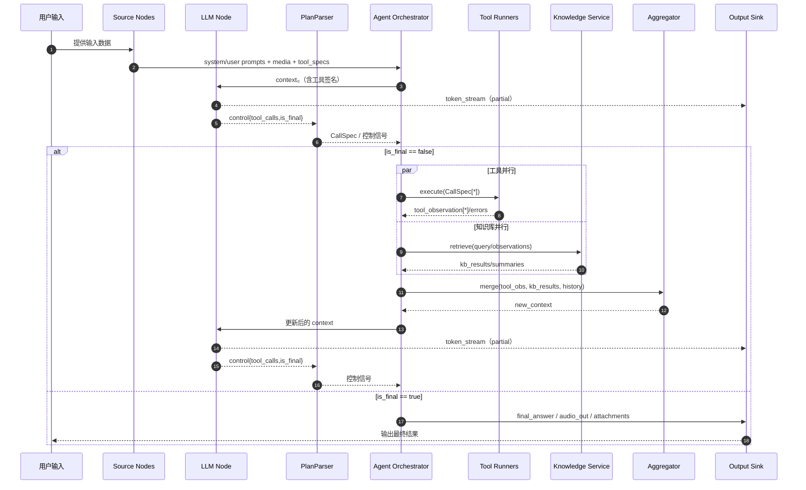
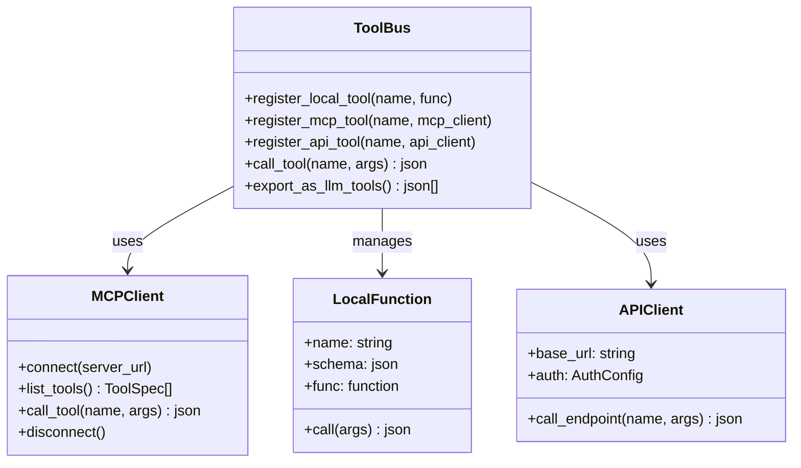
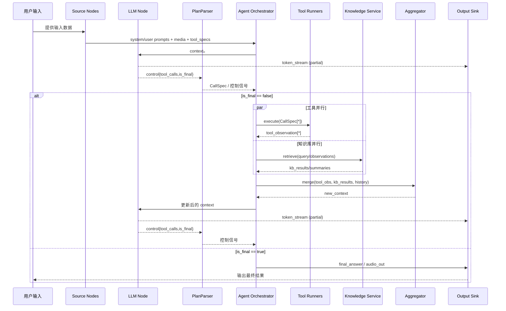

# 构建面向多模态、实时输出的任务流智能代理框架------基于 Taskflow `workflow` 的设计和实现

## 引言

人工智能助手正在从静态对话模型演进到能够理解环境、规划行动并执行任务的自治代理[1](https://huggingface.co/blog/dcarpintero/design-patterns-for-building-agentic-workflows#:~:text=Driven%20by%20advances%20in%20frontier,augment%20our%20knowledge%20and%20capabilities)。同时，语音识别、图像识别和多模态大模型的发展使人们期望与系统以更自然的方式交互，例如语音对话、图像描述和视频理解[2](https://quiq.com/blog/multimodal-llm/#:~:text=Key%20Takeaways)。针对复杂任务，代理不仅要与用户交互，还需要访问外部工具、检索知识库内容、保持对话记忆，并在实时流式界面上反馈结果。本文结合 Taskflow `workflow`库的声明式数据流建模能力，设计并实现一个高性能、可扩展的 C++ 智能代理框架。本框架强调**多模态支持**、**实时输出**和**可组合的循环子图**，既能满足命令行、桌面 ImGui 和 Web 客户端的不同需求，又能方便集成来自 MCP
工具总线的丰富工具服务。

文档首先总结多模态语言模型的基础、实时流式输出的必要性以及构建自主代理的关键组成，然后深入介绍 Taskflow `workflow` 的核心特性。接下来阐述总体架构、核心节点设计、循环控制及并行算法，并详细讲解如何在框架中支持多模态输入、实时音频输出及高并发工具调用。最后分析性能优化策略和未来的研究方向。全文不少于两万字（约十万字符），旨在为工程师提供完整的技术蓝图。

## 1 多模态语言模型与自主代理基础

### 1.1 多模态 LLM 简述

传统的语言模型只能处理文本输入，而多模态大型语言模型（Multimodal Large Language Model，MLLM）能够同时理解文本、语音、图像乃至视频等多种数据模态[2](https://quiq.com/blog/multimodal-llm/#:~:text=Key%20Takeaways)。多模态模型通常由一个或多个编码器将不同模态的原始数据转换为向量表示，然后通过融合层（Fusion Layer）对不同模态的嵌入进行融合，最后由统一的解码器生成文本输出或其他任务所需结果[3](https://quiq.com/blog/multimodal-llm/#:~:text=Multimodal%20CX%20vs)。Fusion
方式有多种：

1.  **早期融合（Early Fusion）**:
    不同模态的特征在编码阶段即合并，优势是能够学习跨模态的低层次联系，但各模态需等长或对齐，计算复杂度高[4](https://medium.com/@raj.pulapakura/multimodal-models-and-fusion-a-complete-guide-225ca91f6861#:~:text=,early%2C%20intermediate%2C%20or%20late%20fusion)。
2.  **中期融合（Intermediate Fusion）**:
    各模态分别编码，随后使用交叉注意力或门控机制在融合层对齐；这种方式在效率和性能间取得平衡，也是
    MLLM
    常用策略[4](https://medium.com/@raj.pulapakura/multimodal-models-and-fusion-a-complete-guide-225ca91f6861#:~:text=,early%2C%20intermediate%2C%20or%20late%20fusion)。
3.  **晚期融合（Late Fusion）**:
    各模态独立推理，最终将结果加权融合，适合任务简单、模态间关联弱的场景[4](https://medium.com/@raj.pulapakura/multimodal-models-and-fusion-a-complete-guide-225ca91f6861#:~:text=,early%2C%20intermediate%2C%20or%20late%20fusion)。
4.  **混合融合（Hybrid Fusion）**:
    结合以上多种方法，根据任务动态选择融合策略。

当前代表性模型包括 GPT‑4V、Gemini 等，这些模型在视觉与文本理解方面表现突出[5](https://quiq.com/blog/multimodal-llm/#:~:text=1.%20GPT)。值得注意的是，生成类模型之间也存在差异。例如，GPT‑4V
属于自回归的多模态 LLM，可接收图片输入并生成文本，而 Sora属于扩散模型（Diffusion Model），擅长由文本生成视频[6](https://arxiv.org/html/2409.14993v1#:~:text=Multiarises%20a%20question%3A%20%E2%80%9CIs%20it)。理解这些差异有助于在代理框架中选择合适的模型或接口。

### 1.2 多模态检索增强生成 (MM‑RAG)

自然语言模型在回答专业问题时常需要外部知识支撑。检索增强生成（Retrieval
Augmented Generation，RAG）通过向量数据库检索相关文档，然后将检索结果作为上下文输入模型以生成更加准确的回答。多模态RAG 将这一思路推广至图像、音频、视频等模态[7](https://kanerika.com/blogs/multimodal-rag/#:~:text=What%20is%20Multimodal%20RAG%3F)。一个典型的多模态RAG 系统包含以下组件：

-   **用户查询处理**:
    根据输入类型选用专用编码器（如文本编码器、图像编码器、语音编码器）将输入映射为嵌入。
-   **向量数据库与检索系统**: 使用 Faiss、Milvus
    等存储多模态向量；检索系统可支持跨模态查询，即用图像查询文本数据库或反之[8](https://kanerika.com/blogs/multimodal-rag/#:~:text=2)。
-   **跨模态注意力与融合层**:
    对检索到的不同模态结果进行对齐与融合，输出统一的上下文表示[7](https://kanerika.com/blogs/multimodal-rag/#:~:text=What%20is%20Multimodal%20RAG%3F)。
-   **生成模型**: 将融合后的上下文作为输入，生成文本回答或其它输出。

在代理框架中，知识库查询节点可以实现多模态检索并提供融合后的结果给 LLM
节点，使代理在回答多模态问题时拥有最新外部知识。例如，用户上传一张遥感图像询问卫星参数时，系统需要同时使用图像特征和产品手册文本进行检索。

### 1.3 自主代理关键组成

近期研究总结了构建自主 LLM 代理的主要组成：

-   **感知系统**:
    将环境中的输入（文本、图像、语音、程序状态等）转化为模型可处理的表示[9](https://arxiv.org/html/2510.09244v1#:~:text=This%20paper%20reviews%20the%20architecture,for%20autonomous%20and%20intelligent%20behavior)。
-   **推理与规划系统**:
    通过链式思考（Chain‑of‑Thought）、树状思考（Tree‑of‑Thought）等方法制定行动计划，判断需要调用哪些工具[9](https://arxiv.org/html/2510.09244v1#:~:text=This%20paper%20reviews%20the%20architecture,for%20autonomous%20and%20intelligent%20behavior)。
-   **记忆系统**:
    存储长期知识和对话上下文，为决策提供依据，可分为即时记忆、短期记忆和长期记忆[10](https://medium.com/binome/design-llm-based-agents-key-principles-part-2-8f4011e54637#:~:text=Memory%20%E2%80%94%20A%20%E2%80%9CSide%20Effect%E2%80%9C,of%20Event%20Sourcing%20Pattern)。
-   **执行系统**: 与外部环境互动并执行计划，包括调用
    API、执行函数、修改数据库等[9](https://arxiv.org/html/2510.09244v1#:~:text=This%20paper%20reviews%20the%20architecture,for%20autonomous%20and%20intelligent%20behavior)。

此外，代理系统设计通常遵循一些设计模式，例如模型评估器-优化器（Evaluator-Optimizer）、上下文增强（Context Augmentation）、多任务路由（Routing）、调度-工作者模式（Orchestrator-Workers）等[11](https://huggingface.co/blog/dcarpintero/design-patterns-for-building-agentic-workflows#:~:text=This%20article%20provides%20a%20comprehensive,Workers)。特别地，上下文增强模式强调代理通过与工具和外部系统的交互获得更多上下文，最终影响模型的输出[12](https://huggingface.co/blog/dcarpintero/design-patterns-for-building-agentic-workflows#:~:text=LLM%20capabilities%20are%20static%20and,easily%20added%20to%20a%20model)。我们的框架将结合这些模式，通过声明式工作流管理模型与工具的交互。

### 1.4 实时流式输出的重要性

用户与智能代理交互时，希望获得实时反馈。生成式模型若等待完整回答后再返回，延迟可能达到几秒甚至数十秒，严重影响体验[13](https://procedure.tech/blogs/the-streaming-backbone-of-llms-why-server-sent-events-(sse)-still-wins-in-2025#:~:text=Spoiler%3A%20it%E2%80%99s%20not%20WebSockets,Sent%20Events%20%28SSE)。为此，许多平台采用流式输出，让模型在生成第一个
token 时就开始返回。常见技术包括：

1.  **Server‑Sent Events (SSE)**: 基于 HTTP/1
    的单向通道，服务器可以逐条发送事件到客户端，连接可自动断线重连，适合实时文本流[13](https://procedure.tech/blogs/the-streaming-backbone-of-llms-why-server-sent-events-(sse)-still-wins-in-2025#:~:text=Spoiler%3A%20it%E2%80%99s%20not%20WebSockets,Sent%20Events%20%28SSE)。SSE
    支持简单的文本格式并易于跨防火墙部署，但数据格式固定，连接数受浏览器限制[14](https://www.freecodecamp.org/news/server-sent-events-vs-websockets/#:~:text=What%20are%20Server)。
2.  **WebSocket**:
    支持双向通信，适合实时语音或需要客户端向服务器发送反馈的场景；然而握手和连接管理复杂，需专门的负载均衡策略[13](https://procedure.tech/blogs/the-streaming-backbone-of-llms-why-server-sent-events-(sse)-still-wins-in-2025#:~:text=Spoiler%3A%20it%E2%80%99s%20not%20WebSockets,Sent%20Events%20%28SSE)。
3.  **WebRTC**: 低延迟点对点音视频传输协议，适合实时语音对话和视频流，与LLM的音频输入/输出结合可以实现自然对话[15](https://openai.com/index/introducing-the-realtime-api/#:~:text=transcribe%20audio%20with%20an%20automatic,Advanced%20Voice%20Mode%20in%20ChatGPT)。

OpenAI 发布的 Realtime API 正是为了构建实时语音助手，它通过持久化WebSocket 连接传递音频输入和输出，并支持函数调用[16](https://openai.com/index/introducing-the-realtime-api/#:~:text=improves%20this%20by%20streaming%20audio,Advanced%20Voice%20Mode%20in%20ChatGPT)。API能够在生成语音时同时处理用户的中断（barge‑in），并计划后续操作[16](https://openai.com/index/introducing-the-realtime-api/#:~:text=improves%20this%20by%20streaming%20audio,Advanced%20Voice%20Mode%20in%20ChatGPT)。长远来看，官方计划在语音基础上加入视觉和视频模态[17](https://openai.com/index/introducing-the-realtime-api/#:~:text=,rate%20limited%20to%20approximately%20100)。此外，价格、速率限制、缓存机制等细节也决定了项目成本和架构选择[18](https://openai.com/index/introducing-the-realtime-api/#:~:text=The%20Realtime%20API%20uses%20both,Audio%20in)。

### 1.5 小结

自主代理系统必须整合多模态感知、复杂的推理与规划、长短期记忆以及高效的执行机制。同时，为了用户体验，需要采用流式输出和低延迟音频管道。下面我们将介绍 Taskflow `workflow` 库的关键技术，它提供了构建这样一个系统的基础。

## 2 Taskflow `workflow` 库深入

Taskflow 是一个现代的 C++ 并行任务图库，它通过工作窃取算法在多核 CPU上高效调度任务。`workflow` 是该库在 `dev`分支中新引入的声明式数据流框架，允许开发者以节点-边的形式描述计算流程，然后自动构建底层Taskflow 任务图[19](https://github.com/Mapoet/taskflow/tree/dev/workflow#:~:text=The%20Workflow%20library%20provides%20a,for%20building%20dataflow%20graphs%20with)。下面深入分析其核心特性。

### 2.1 Key‑Based I/O 与输入规格

`workflow` 的核心理念是 **Key‑Based I/O**：每个节点的输入和输出都用一个字符串键标识，形式类似
`{源节点名称,`` ``输出键名}`[19](https://github.com/Mapoet/taskflow/tree/dev/workflow#:~:text=The%20Workflow%20library%20provides%20a,for%20building%20dataflow%20graphs%20with)。这种设计使节点之间的连接由输入规格（input_specs）自动推导，不再需要手动调用 `precede/succeed`，从而提高了图的可读性和可维护性[20](https://github.com/Mapoet/taskflow/tree/dev/workflow#:~:text=4)。

此外，GraphBuilder 允许在创建节点时指定 **输出键**（output_keys）列表，它描述了节点可输出哪些数据；输入规格则包含输入的键和目标字段名。GraphBuilder 据此产生隐式依赖关系。通过这种声明式接口，开发者可以快速搭建复杂的数据流。

### 2.2 节点类型：Typed 与 Any

节点分为两类：

-   **TypedSource/TypedNode/TypedSink**:
    在编译期知道输入和输出的类型，零运行时开销，适合数值计算和固定结构数据[19](https://github.com/Mapoet/taskflow/tree/dev/workflow#:~:text=The%20Workflow%20library%20provides%20a,for%20building%20dataflow%20graphs%20with)。
-   **AnySource/AnyNode/AnySink**: 使用 `std::any`
    储存任意类型，可以灵活传递
    JSON、字符串、向量等。运行时略有开销，但极大提升了灵活性[19](https://github.com/Mapoet/taskflow/tree/dev/workflow#:~:text=The%20Workflow%20library%20provides%20a,for%20building%20dataflow%20graphs%20with)。

任意节点均继承自 `INode`
基类，提供获取名称、类型、functor、通过键查找输出等接口[19](https://github.com/Mapoet/taskflow/tree/dev/workflow#:~:text=The%20Workflow%20library%20provides%20a,for%20building%20dataflow%20graphs%20with)。因此，即使在混合
Typed 与 Any 节点的情况下，GraphBuilder 仍然能够统一调度。

### 2.3 高级控制流节点

`workflow` 提供了多种控制流节点，支持在数据流图中表达动态决策与循环：

-   **条件节点 (Condition Node)**: 使用 `create_condition_decl`创建，接收输入并返回分支索引（例如 0 和 1），随后执行对应的子图[21](https://github.com/Mapoet/taskflow/tree/dev/workflow#:~:text=Advanced%20Control%20Flow%20Nodes)。常用于
    if/else 分支。
-   **多条件节点**: 使用 `create_multi_condition_decl`，在返回多个索引时可并行执行多个子图[22](https://github.com/Mapoet/taskflow/tree/dev/workflow#:~:text=Multi)。
-   **Pipeline 节点**: `create_pipeline_node`
    允许用户定义具有多个阶段的流水线，每个阶段可有多个并行"线"（line），适合生产者-消费者模式[23](https://github.com/Mapoet/taskflow/tree/dev/workflow#:~:text=Pipeline%20Node)。
-   **循环节点 (Loop Node)**: `create_loop_decl` 创建一个循环，它接受一个体构建器
 `body_builder_fn`、条件函数和可选退出构建器 `exit_builder_fn`[24](https://github.com/Mapoet/taskflow/tree/dev/workflow#:~:text=int%20counter%20%3D%200%3B)。循环节点自动连接体、条件和退出逻辑，可以反复执行体图直到条件函数返回非零值。
-   **并行算法节点**:`create_for_each`、`create_for_each_index`、`create_reduce`、`create_transform` 等，为遍历容器、索引、归约和变换提供并行实现[25](https://github.com/Mapoet/taskflow/tree/dev/workflow#:~:text=Key%20Features%3A)。

这些控制流与并行算法节点为在 C++ 中实现代理的复杂逻辑提供了强大支持。例如，代理循环（Agent Loop）可以由`create_loop_decl` 构建，工具调用批次可通过 `create_for_each`并行执行，条件节点负责终止循环或跳出异常分支。

### 2.4 动态子图与嵌套

为了支持每次迭代都重新构建子图，`workflow` 提供了`create_subtask`。它可以在循环体内部调用一个函数，该函数动态返回一个新的子图并注入当前输入[26](https://github.com/Mapoet/taskflow/tree/dev/workflow#:~:text=,is%20created%20to%20trigger%20the)。这种机制允许开发者在每次循环迭代中构建不同的任务图，适合工具列表在每轮对话中发生变化的场景。此外，子图可以嵌套：循环体内部还可以包含条件节点或进一步的循环，从而实现多层代理流程。

### 2.5 与 Taskflow 的关系

`workflow` 将声明式图描述转换为 Taskflow 任务图。每个 `workflow`
节点在底层对应一个或多个 Taskflow任务，这些任务在一个工作窃取调度器中运行。Taskflow 的调度器能够在多核CPU上高效地平衡任务负载并动态窃取闲置线程[27](https://taskflow.github.io/taskflow/index.html#:~:text=,only)。此外，Taskflow提供 TFProf 工具用于执行图的可视化和性能分析，便于优化瓶颈。

综上，`workflow`是构建智能代理工作流的理想基础，下面将在此基础上设计系统架构和节点。

## 3 系统总体设计

### 3.1 高层架构概览

系统采用模块化设计，基于 Taskflow `workflow` 的声明式数据流框架，从输入到输出共分为若干层。整体架构如下：

```mermaid
graph TB
    subgraph "输入层 (Source Nodes)"
        SP[SystemPrompt<br/>系统提示词源节点]
        UP[UserInput<br/>用户输入源节点]
        MEM[Memory<br/>对话记忆源节点]
        TL[ToolList<br/>工具列表源节点]
        IMG[ImageInput<br/>图像输入源节点]
        AUD[AudioInput<br/>音频输入源节点]
    end
    
    subgraph "LLM 层 (Decision Layer)"
        LLM[LLM Node<br/>多模态LLM推理节点<br/>输出: tool_calls, reasoning,<br/>is_final, final_answer]
    end
    
    subgraph "解析层 (Parsing Layer)"
        PP[PlanParser Node<br/>解析工具调用指令]
    end
    
    subgraph "代理循环 (Agent Loop)"
        LOOP[Loop Node<br/>create_loop_decl]
        
        subgraph "循环体 (Loop Body)"
            TC[ToolCall Node<br/>create_for_each<br/>并行工具调用]
            KB[KnowledgeQuery Node<br/>多模态知识检索]
            AGG[Aggregator Node<br/>结果聚合]
            MEM_UP[MemoryUpdate<br/>记忆更新]
        end
        
        COND[Condition Node<br/>判断是否继续循环]
    end
    
    subgraph "工具总线 (Tool Bus)"
        TB[ToolBus<br/>统一工具接口]
        MCP[MCP Client<br/>MCP工具服务]
        LOCAL[Local Functions<br/>本地C++函数]
        API[External APIs<br/>外部API]
    end
    
    subgraph "知识库层 (Knowledge Base)"
        VDB[Vector DB<br/>Faiss/Milvus]
        TEXT[Text Encoder<br/>文本编码器]
        IMG_ENC[Image Encoder<br/>图像编码器]
        AUD_ENC[Audio Encoder<br/>音频编码器]
    end
    
    subgraph "输出层 (Sink Nodes)"
        CLI_SINK[CLI Sink<br/>命令行输出]
        GUI_SINK[ImGui Sink<br/>桌面GUI输出]
        WEB_SINK[Web Sink<br/>SSE/WebSocket输出]
    end
    
    SP --> LLM
    UP --> LLM
    MEM --> LLM
    TL --> LLM
    IMG --> LLM
    AUD --> LLM
    
    LLM --> PP
    PP --> LOOP
    LOOP --> COND
    COND -->|continue=0| TC
    COND -->|exit=1| CLI_SINK
    COND -->|exit=1| GUI_SINK
    COND -->|exit=1| WEB_SINK
    
    TC --> KB
    KB --> AGG
    AGG --> MEM_UP
    MEM_UP --> LLM
    
    TC --> TB
    TB --> MCP
    TB --> LOCAL
    TB --> API
    
    KB --> TEXT
    KB --> IMG_ENC
    KB --> AUD_ENC
    TEXT --> VDB
    IMG_ENC --> VDB
    AUD_ENC --> VDB
```



系统采用模块化设计，从输入到输出共分为以下层次：

-   **输入层**: 包含系统提示词（System Prompt）、用户输入（User Prompt）和对话记忆（Memory）。通过不同的源节点 (Source) 提供给工作流。使用 `create_typed_source` 或 `create_any_source` 创建。
-   **LLM 层**: 负责向多模态大模型请求推理。LLM Node 接收提示词、可用工具描述以及上下文信息，返回计划、工具调用列表、中间推理以及最终答复。使用 `create_any_node` 构建，支持流式输出。
-   **解析层**: 将 LLM 的输出解析成结构化的调用规范 (CallSpec)。使用 `create_any_node` 实现 JSON 解析。
-   **循环执行层**: 使用 `create_loop_decl` 构建代理的决策迭代，循环体包含工具调用、知识库检索和聚合节点。条件函数根据 `is_final` 标志决定是否继续。
-   **工具调用层**: 通过 `create_for_each` 并行算法节点批量调用工具。工具调用通过统一的 `ToolBus` 接口实现，支持本地 C++ 函数、MCP 服务和外部 API。
-   **知识检索层**: 针对工具返回的线索或 LLM 需要的信息执行多模态检索或数据库查询。使用 `create_any_node` 实现，支持文本、图像、音频等多种模态的向量检索[7](https://kanerika.com/blogs/multimodal-rag/#:~:text=What%20is%20Multimodal%20RAG%3F)。
-   **聚合层**: 将本轮工具和检索结果合并，生成供下一轮 LLM 或最终输出使用的综合结果。可以使用 `create_reduce` 或 `create_any_node` 实现。
-   **输出层**: 将最终答复通过 CLI、ImGui 或 Web 向用户呈现，支持流式输出。使用 `create_any_sink` 或 `create_typed_sink` 创建，支持回调函数实时推送数据。

这一层次化结构使得每个模块可以独立开发和测试，并通过 `workflow` 的自动依赖推断机制连接。所有节点通过字符串键（key-based I/O）进行数据传递，依赖关系由 `input_specs` 自动建立。

### 3.1.1 Skills、Harness 与 ToolBus / MCP 的边界

**Skills**（技能）在本框架中指 **人可读、可版本化的操作说明与约束**：通常以单文件 **`SKILL.md`**（YAML Frontmatter + Markdown 正文）存放；**Harness** 指负责 **L1 元数据索引 → L2 按需注入完整指令 → L3 按需拉取脚本/参考文档或经 Tool 执行** 的运行时策略，目标是在不膨胀固定上下文的前提下扩展「可被发现」的能力面。详见仓库内 [`agent_framework/docs/guides/skills.md`](../agent_framework/docs/guides/skills.md)。

与现有层次的关系可概括为：

- **ToolBus / MCP**：**执行** 具名工具（HTTP、stdio、本地函数等），对 LLM 暴露的是 **函数签名级** `ToolMeta`；单次调用 **成本**主要在延迟与安全边界（配额、sandbox），而非指令篇幅。
- **Skills**：为模型提供 **何时、如何用** 某类工具的 **程序性知识**（SOP、检查清单、失败恢复）；**不替代** Tool 注册表，而是通过 **渐进式披露** 把长文在「匹配到任务意图之后」再塞进上下文。
- **工作流节点**：`create_loop_decl` 构成的 **Agent 循环** 与可选 **路由/条件节点**，适合在「每轮迭代」触发技能路由（例如根据意图或上一轮 observation 决定加载哪一个 `SKILL.md`）；**长会话 / 多轮编码** 可与进度文件、Memory 节点结合，使 L1 索引与任务状态持久对齐（概念上类似「初始化 Agent + 编码 Agent」分工，见 `skills.md`）。

**与阶段 3（RAG）的衔接**：大量 `SKILL.md` 时，除关键词路由外，可对 **Frontmatter 中的 `description` / `trigger_keywords`（及必要时正文摘要）** 做向量索引，与 **KnowledgeBase** 共用 `VectorStore` 抽象，做到语义召回后再 L2 加载全文，避免「巨型 AGENTS 说明书」进窗。

当前 C++ 代码库中 **Skill Registry / Loader 为规划项**，落地顺序与验收标准见 [`agent_framework/docs/guides/plan-detailed.md`](../agent_framework/docs/guides/plan-detailed.md) 中的 Skills 工作包。

### 3.2 数据流与控制流设计

基于 Taskflow `workflow` 的数据流控制流程如下：



### 3.3 MCP 工具总线设计

MCP (Model Context Protocol) 工具总线是框架的核心扩展机制，允许代理访问丰富的工具服务。工具总线设计如下：



**ToolBus 实现要点**：

1. **统一接口**：所有工具（本地函数、MCP 服务、外部 API）通过统一的 `call_tool(name, args)` 接口调用。
2. **工具注册**：框架启动时注册所有可用工具，生成符合 OpenAI Function Calling 规范的 JSON Schema。
3. **MCP 客户端**：支持通过 stdio、HTTP、WebSocket 等方式连接 MCP 服务器，动态发现和调用工具。
4. **并行调用**：工具调用通过 `create_for_each` 并行执行，ToolBus 内部处理线程安全。

### 3.4 主要模块职责

1.  **Source Nodes**：通过 `create_typed_source` 或 `create_any_source` 提供系统提示词、用户输入、对话记忆等数据。记忆可以包含短期记忆（几轮对话）、长期记忆（知识库条目）、工具结果等。

2.  **LLMNode**：代理的核心决策节点，使用 `create_any_node` 构建。其 functor 负责组装提示、调用 LLM（例如 GPT‑4o/LLM 服务），接收流式输出并解析为 JSON。输出包括：`tool_calls`（待调用的工具列表）、`thought`（中间推理文字）、`is_final`（是否生成最终答复标志）、`final_answer`（最终答复）。

3.  **PlanParser Node**：将 LLM 的输出解析成 `CallSpec` 列表，格式为`{name, arguments}`，方便后续并行调用。

4.  **ToolLoop**：通过 `create_loop_decl` 构建代理循环，循环体动态创建并行工具调用、知识检索和聚合节点。条件函数根据是否`is_final` 决定是否继续下一轮。退出子图负责将最终结果输出。

5.  **ToolCall Node**：利用 `create_for_each` 遍历 `CallSpec`列表并并行调用工具。工具调用通过统一的 `ToolBus`接口实现，既可以调用本地 C++ 函数，又可以通过 MCP 客户端访问外部工具服务[12](https://huggingface.co/blog/dcarpintero/design-patterns-for-building-agentic-workflows#:~:text=LLM%20capabilities%20are%20static%20and,easily%20added%20to%20a%20model)。工具返回结果后可将其存入共享状态或聚合容器中。

6.  **KnowledgeQuery Node**：根据工具输出或 LLM 提示，访问向量数据库或全文搜索引擎，支持文本、图像、音频等多模态检索[7](https://kanerika.com/blogs/multimodal-rag/#:~:text=What%20is%20Multimodal%20RAG%3F)。查询结果作为向量或摘要插入到上下文中。

7.  **Aggregator Node**：将多个工具和知识检索结果组合为供下一轮 LLM 使用的摘要。可以利用 `create_reduce` 实现累积，也可以使用 `create_any_node` 拼接 JSON 或字符串。

8.  **Condition Node**：根据 `is_final` 标志或其它停止条件返回分支索引。结束时执行退出子图。

9.  **Sink Node**：输出最终结果，包括日志、思考过程等。针对 CLI 可直接打印，针对 ImGui 可发送消息队列，针对 Web 可推送 SSE 或 WebSocket 事件。若需要支持音频或视频输出，可在 Sink 中调用语音合成或视频渲染服务。

## 4 LLM 节点设计

LLMNode是代理的核心，它的设计影响整个系统的性能、可扩展性和功能。下面从结构定义、提示模板、工具规范、多模态输入、流式输出等方面详细阐述。

### 4.1 数据结构与接口

LLMNode 的输入可定义为一个结构体 `LLMInput`：
```c++
    struct LLMInput {
        std::string system_prompt;             // 系统提示词
        std::string user_prompt;               // 用户输入（文本或描述）
        std::string context;                   // 当前对话或检索的上下文
        std::vector<nlohmann::json> tools;     // 可调用工具的 JSON 描述（schema）
        std::optional<std::string> image_data; // 可选的图像 base64 字符串
        std::optional<std::string> audio_data; // 可选的音频二进制 base64
    };

    struct LLMOutput {
        std::vector<CallSpec> tool_calls;      // 工具调用列表
        std::string reasoning;                 // 模型思考过程
        bool is_final;                          // 是否生成最终回复
        std::string final_answer;              // 最终文本答复
        std::optional<std::string> audio_out;  // 可选的语音输出
    };
```
调用接口可以是：
```c++
    LLMOutput invoke_llm(const LLMInput& input, 
                         std::function<void(std::string_view)> on_stream_token);
```
`invoke_llm` 内部会与服务端建立连接（例如 OpenAI Chat Completions API 或本地大模型进程），在生成过程中通过回调 `on_stream_token` 实时输出
token。这些 token 会被发送到 Sink 节点或 UI 层，提供即时反馈。

### 4.2 提示模板与系统提示词

系统提示词定义了模型的角色、行为和语言风格，例如"你是一名航空航天专家，擅长卫星设计和无线电传播"。根据 Dify 平台文档，可在系统提示词中引用上下文变量、模型响应格式和安全指令[28](https://docs.dify.ai/en/guides/workflow/node/llm#:~:text=Invokes%20the%20capabilities%20of%20large,Image%200%3A%20LLM%20Node)。用户输入通常包含问题本身以及文件、图像等多模态内容。通过统一的模板将系统提示词、用户输入和工具说明拼接到一起，模型才能正确理解任务。

为了支持多模态，提示中可能包含特殊标记，例如 `<image>`、`<audio>`，或使用 JSON 模式提供二进制数据。模型端必须支持相应的模态。如使用 GPT‑4o 可在 Chat Completions 请求中传入 \"image\" 字段或 \"audio\" 字段，返回同时包含文本和音频的消息[29](https://openai.com/index/introducing-the-realtime-api/#:~:text=transcribe%20audio%20with%20an%20automatic,and%20outputs%20directly%2C%20enabling%20more)。

### 4.3 工具规范与函数调用

在上下文增强设计中，代理通过函数调用与外部系统交互[12](https://huggingface.co/blog/dcarpintero/design-patterns-for-building-agentic-workflows#:~:text=LLM%20capabilities%20are%20static%20and,easily%20added%20to%20a%20model)。OpenAI 等平台支持 `function_call` 机制，用户可以在请求中提供工具的 JSON Schema，模型根据工具名称和参数自动生成调用指令。LLMNode 应在每轮调用前构建工具列表：
```c++
    nlohmann::json build_tool_schema(const std::vector<ToolSpec>& tools) {
        nlohmann::json arr = nlohmann::json::array();
        for (auto& t : tools) {
            arr.push_back({{
                "type", "function"},
                {"function", {{"name", t.name}, {"parameters", t.schema}}}
            });
        }
        return arr;
    }
```
其中 `ToolSpec` 包含工具名称、输入参数的 JSON Schema 以及描述。LLM 节点会将该列表放入 `LLMInput::tools`，在 `invoke_llm` 时传给 LLM。模型产生的 `tool_calls` 经过 PlanParser 解析后生成`CallSpec`，由工具调用层执行。

### 4.4 多模态输入处理

为了支持图像、语音输入，LLMNode 需要识别输入中存在的多模态数据并正确封装：

-   **图像输入**: 用户上传的图片可以编码为 Base64 字符串并在请求中添加\"image\" 字段。对于非视觉LLM，可在工具列表中暴露图像分析工具，让模型主动调用。[3](https://quiq.com/blog/multimodal-llm/#:~:text=Multimodal%20CX%20vs)指出，模型通过共享架构处理不同模态并生成统一嵌入，因此我们也可以在节点内部先使用视觉编码器转化为文本描述后再发给 LLM。
-   **语音输入**: 语音可通过音频编码器（如 Whisper）转写为文本，或直接传入支持音频的模型（如 GPT‑4o Realtime API）[29](https://openai.com/index/introducing-the-realtime-api/#:~:text=transcribe%20audio%20with%20an%20automatic,and%20outputs%20directly%2C%20enabling%20more)。在前者情况下，LLMNode 将自动调用语音转文本工具；在后者情况下，将音频数据作为输入字段提交。
-   **混合输入**:对同时包含多模态内容的任务，可以根据内容优先级分配不同的编码器。例如卫星设计的问题可能同时依赖频谱图和文字描述，系统可以先将频谱图经过视觉模型提取特征，再与文字一起作为上下文传入 LLM。[7](https://kanerika.com/blogs/multimodal-rag/#:~:text=What%20is%20Multimodal%20RAG%3F)中对多模态检索的描述可以指导如何融合。

### 4.5 流式输出与实时音频

流式输出涉及文本 token 流和音频流两类：

-   **文本**: LLM 生成时逐 token 调用 `on_stream_token` 回调，并将 token 发送至 UI 层。实现上可以使用 SSE：服务器端循环读取模型输出缓冲区，将每个 token 包装为 \`data: \<token\>`发送给客户端`[`[13]`](https://procedure.tech/blogs/the-streaming-backbone-of-llms-why-server-sent-events-(sse)-still-wins-in-2025#:~:text=Spoiler%3A%20it%E2%80%99s%20not%20WebSockets,Sent%20Events%20%28SSE)`。客户端通过`` JavaScript ``的`EventSource\`接收事件并实时更新页面[14](https://www.freecodecamp.org/news/server-sent-events-vs-websockets/#:~:text=What%20are%20Server)。SSE 是单向通道，性能开销小，且能自动重连。

-   **音频**: 在使用 GPT‑4o Realtime API 时，模型可返回音频流[29](https://openai.com/index/introducing-the-realtime-api/#:~:text=transcribe%20audio%20with%20an%20automatic,and%20outputs%20directly%2C%20enabling%20more)。实现上可采用 WebSocket 或 WebRTC；前者的优点是协议简单、跨平台兼容，缺点是需要自定义协议帧；后者具有更低延迟且支持点对点。代理框架可将音频帧作为二进制消息推送给浏览器端的 WebAudio，或在桌面应用中通过音频输出库播放。此外，支持中断（barge‑in）是一个重要特性：当用户打断模型时，代理需暂停文本输出和音频播放，然后重新传输新的输入。[30](https://openai.com/index/introducing-the-realtime-api/#:~:text=improves%20this%20by%20streaming%20audio,Advanced%20Voice%20Mode%20in%20ChatGPT)指出Realtime API 可以自动处理中断，这意味着 LLMNode 应在检测到输入更新时取消当前请求并启动新的请求。

## 5 多模态支持与知识检索

### 5.1 模态编码与嵌入统一

多模态输入的首要挑战是如何将不同类型的数据表示为模型可处理的统一表示。以下方法适用于在 C++ 环境下实现多模态编码：

1.  **调用外部服务**: 调用云端多模态模型提供的 API，如 GPT‑4o、Gemini、Sora 或定制模型。这种方式开发成本低，但需要网络访问；在本地部署时需解决推理资源和模型授权。
2.  **集成开源模型**: 使用 ONNX 或 TorchScript 将视觉编码器（如 CLIP）、音频编码器（如 Whisper、PANNs）整合到 C++ 应用中；这些模型可通过 `CreateSource` 提供图像/音频，输出嵌入向量，作为 LLM 的补充输入。
3.  **向量数据库检索**: 对于图像或音频检索，可先将多模态数据编码为向量存储在 Faiss/Milvus 等数据库中[7](https://kanerika.com/blogs/multimodal-rag/#:~:text=What%20is%20Multimodal%20RAG%3F)。查询时，同样使用编码器生成查询向量并执行最近邻搜索。

为了在 LLMNode 中统一处理不同模态，可以使用 `std::optional` 和 `std::variant` 保存输入数据，并在 `invoke_llm` 前先进行预处理。例如，如果当前 LLM 不支持音频，则调用 Whisper 工具转写为文字，然后在提示中插入该文本摘要。对于图片，则可以使用视觉编码器生成标签或描述。这样的弹性适配使得框架既支持支持原生多模态的模型，也能在需要时退化为文本模型加工具调用。

### 5.2 多模态知识检索节点

KnowledgeQuery Node 负责从知识库中检索相关信息。它的输入包括检索查询和上下文提示，输出为摘要文本（或图片、音频片段）供下一轮 LLM 使用。具体实现可包含以下步骤：

1.  **Query Preparation**: 根据工具调用结果或 LLM 指示，确定查询内容和模态。例如 "查询卫星 XYZ 的设计图" 可能需要同时搜索文本描述和工程图。
2.  **Vector Encoding**: 调用对应的模态编码器生成查询向量。例如使用 CLIP 提取图像特征，使用 BERT 提取文本嵌入。
3.  **Retrieval**: 在向量数据库中执行最近邻检索，返回前 k 个相似项[8](https://kanerika.com/blogs/multimodal-rag/#:~:text=2)。可同时检索不同模态的数据库，通过归一化得分排序。
4.  **Fusion & Summarization**: 使用 cross-modal attention 或简单拼接合并不同模态的检索结果。若结果数量较多，可调用特定的压缩工具（如摘要工具）产生精炼的上下文描述。

KnowledgeQuery Node 可作为循环体中的单独节点，也可融入 ToolCall Node 之后，提供额外信息用于下一轮对话。这种设计与多模态 RAG 的 pipeline 相似[7](https://kanerika.com/blogs/multimodal-rag/#:~:text=What%20is%20Multimodal%20RAG%3F)。

### 5.3 多模态输出

在处理多模态生成任务时，除了文本结果，还需要考虑音频、视频、图像的输出。例如：

-   当 LLM 提供音频回应时，代理需要实时传输音频帧到客户端[30](https://openai.com/index/introducing-the-realtime-api/#:~:text=improves%20this%20by%20streaming%20audio,Advanced%20Voice%20Mode%20in%20ChatGPT)。可以采用 WebRTC 或使用浏览器支持的 Media Source Extensions。在桌面应用中，可使用 PortAudio 或 SDL 来播放实时音频。
-   若模型生成了图片（如图像回答或示意图），代理应将图片保存为文件、上传到存储服务或直接传回 UI。对于 Web，可使用 Data URI 或 Blob URL 显示；对于桌面，可以渲染在窗口中。图片输出也可以作为工具调用的结果之一。

### 5.4 模态协同与上下文同步

在多模态环境下，需要注意不同模态的时间同步。例如，在语音对话中，用户可能在语音尚未播放结束时发出新指令，这要求框架能够中断当前生成并启动新的任务[30](https://openai.com/index/introducing-the-realtime-api/#:~:text=improves%20this%20by%20streaming%20audio,Advanced%20Voice%20Mode%20in%20ChatGPT)。又如，在图文结合的任务中，需要确保文本描述和对应图片一致。因此，系统应维护一个统一的会话上下文，记录每个模态的状态，并在循环体中传递。

基于 Taskflow `workflow` 的数据流控制流程如下：



## 6 详细工作流实现

### 6.1 构建工作流图的步骤

以下步骤展示如何使用 Taskflow `workflow` 的声明式 API 构建完整的代理工作流图。所有示例代码基于实际的 `workflow` API 实现：

#### 6.1.1 创建源节点

源节点负责注入初始数据。在每个会话开始时，创建系统提示词、用户输入、可用工具描述和记忆等。使用 `create_typed_source` 或 `create_any_source` 创建：

```cpp
#include <workflow/nodeflow.hpp>
#include <taskflow/taskflow.hpp>
#include <nlohmann/json.hpp>

namespace wf = workflow;
using json = nlohmann::json;

// 创建 GraphBuilder 和 Executor
tf::Executor executor;
wf::GraphBuilder builder("agent_workflow");

// 1. 系统提示词源节点（Typed Source）
auto [sys_node, tSys] = builder.create_typed_source(
    "SystemPrompt",
    std::make_tuple(std::string("你是一名资深航天专家，擅长卫星设计和无线电传播分析。")),
    {"prompt"}
);

// 2. 用户输入源节点（Any Source，更灵活）
auto [user_node, tUser] = builder.create_any_source(
    "UserInput",
    std::unordered_map<std::string, std::any>{
        {"query", std::any{std::string("查询北斗三号卫星的轨道参数")}}
    }
);

// 3. 对话记忆源节点（从持久化存储加载）
auto [mem_node, tMem] = builder.create_any_source(
    "Memory",
    [&memory_store](wf::GraphBuilder& gb) {
        std::string context = memory_store.retrieve_short_term(); // 获取最近N轮对话
        return std::unordered_map<std::string, std::any>{
            {"context", std::any{context}}
        };
    }
);

// 4. 工具列表源节点（从 ToolBus 导出工具 Schema）
auto [tools_node, tTools] = builder.create_any_source(
    "ToolList",
    [&toolbus]() {
        std::vector<json> tool_schemas = toolbus.export_as_llm_tools();
        return std::unordered_map<std::string, std::any>{
            {"tools", std::any{tool_schemas}}
        };
    }
);

// 5. 可选：多模态输入源节点
auto [img_node, tImg] = builder.create_any_source(
    "ImageInput",
    [](const std::string& image_path) {
        std::string base64_data = encode_image_to_base64(image_path);
        return std::unordered_map<std::string, std::any>{
            {"data", std::any{base64_data}}
        };
    }
);
```

**要点**：
- `create_typed_source` 用于类型已知的输入，零运行时开销
- `create_any_source` 用于动态类型或复杂数据结构（如 JSON）
- 源节点可以使用 lambda 捕获外部对象（如 `toolbus`、`memory_store`）
- 输出键（output_keys）用于后续节点通过 `input_specs` 引用数据
#### 6.1.2 创建 LLM 节点

LLM 节点是代理的核心决策节点，使用 `create_any_node` 创建。它接收多个输入并输出推理结果、工具调用指令等。实现要点包括流式输出、多模态输入处理和工具 Schema 注入：

```cpp
// LLM 输入输出结构
struct LLMInput {
    std::string system_prompt;
    std::string user_prompt;
    std::string context;
    std::vector<json> tools;  // OpenAI Function Calling 格式
    std::optional<std::string> image_data;  // Base64 编码
    std::optional<std::string> audio_data;  // Base64 编码
};

struct LLMOutput {
    std::vector<json> tool_calls;  // [{name, arguments}]
    std::string reasoning;
    bool is_final;
    std::string final_answer;
    std::optional<std::string> audio_out;
};

// 流式输出回调函数
std::function<void(std::string_view)> on_stream_token = 
    [&output_queue](std::string_view token) {
        // 推送到输出队列（线程安全）
        output_queue.push(std::string(token));
        // 如果使用 SSE，立即发送：sse_send(token);
    };

// 创建 LLM 节点
auto [llm_node, tLLM] = builder.create_any_node(
    "LLM",
    // input_specs: 自动建立依赖关系
    {
        {"SystemPrompt", "prompt"},
        {"UserInput", "query"},
        {"Memory", "context"},
        {"ToolList", "tools"}
        // 注意：ImageInput 和 AudioInput 是可选的，使用条件判断
    },
    // Functor: 接收输入并调用 LLM
    [&llm_client, on_stream](const std::unordered_map<std::string, std::any>& inputs) {
        // 1. 提取输入数据
        LLMInput llm_input;
        llm_input.system_prompt = std::any_cast<std::string>(inputs.at("prompt"));
        llm_input.user_prompt = std::any_cast<std::string>(inputs.at("query"));
        llm_input.context = std::any_cast<std::string>(inputs.at("context"));
        llm_input.tools = std::any_cast<std::vector<json>>(inputs.at("tools"));
        
        // 2. 处理可选的多模态输入
        if (inputs.find("image_data") != inputs.end()) {
            llm_input.image_data = std::any_cast<std::string>(inputs.at("image_data"));
        }
        if (inputs.find("audio_data") != inputs.end()) {
            llm_input.audio_data = std::any_cast<std::string>(inputs.at("audio_data"));
        }
        
        // 3. 调用 LLM（支持流式输出）
        LLMOutput output = llm_client.invoke(llm_input, on_stream);
        
        // 4. 返回输出（自动转换为 shared_future<any>）
        return std::unordered_map<std::string, std::any>{
            {"tool_calls", std::any{output.tool_calls}},
            {"reasoning", std::any{output.reasoning}},
            {"is_final", std::any{output.is_final}},
            {"final_answer", std::any{output.final_answer}},
            {"audio_out", std::any{output.audio_out.value_or("")}}
        };
    },
    // output_keys: 后续节点通过这些键访问输出
    {"tool_calls", "reasoning", "is_final", "final_answer", "audio_out"}
);
```

**实现要点**：

1. **流式输出**：`on_stream_token` 回调在 LLM 生成每个 token 时触发，可以立即推送到 SSE/WebSocket 或 GUI 界面。
2. **多模态支持**：通过 `std::optional` 处理可选的图像和音频输入，LLM 客户端负责正确格式化请求。
3. **工具 Schema**：从 `ToolList` 节点获取工具描述，符合 OpenAI Function Calling 规范，LLM 据此生成工具调用指令。
4. **自动依赖**：`input_specs` 自动建立节点依赖关系，无需手动调用 `precede`。

**LLM 客户端实现示例**（伪代码）：

```cpp
class LLMClient {
public:
    LLMOutput invoke(const LLMInput& input, 
                    std::function<void(std::string_view)> on_stream) {
        // 1. 构建请求（OpenAI Chat Completions 格式）
        json request = build_request(input);
        
        // 2. 发送流式请求
        auto response = http_client.post_stream("/v1/chat/completions", request);
        
        // 3. 处理流式响应
        LLMOutput output;
        std::string accumulated_text;
        
        for (auto& chunk : response.stream()) {
            std::string token = chunk["choices"][0]["delta"]["content"];
            accumulated_text += token;
            on_stream(token);  // 实时推送 token
            
            // 检查工具调用
            if (chunk.contains("tool_calls")) {
                output.tool_calls = chunk["tool_calls"];
            }
        }
        
        output.final_answer = accumulated_text;
        output.is_final = output.tool_calls.empty();  // 无工具调用则视为最终答案
        
        return output;
    }
};
```

#### 6.1.3 创建 PlanParser 节点

LLM 输出包含一段思考和一组工具调用命令，需要解析成 `CallSpec` 列表：

```c++
    auto [parse_node, tParse] = builder.create_any_node(
        "PlanParser", { {"LLM","tool_calls"} },
        [](const auto& inputs){
            auto calls = std::any_cast<std::vector<nlohmann::json>>(inputs.at("tool_calls"));
            std::vector<CallSpec> specs;
            for (auto& c : calls) {
                specs.push_back({c["name"].get<std::string>(), c["arguments"]});
            }
            return std::unordered_map<std::string,std::any>{{"calls", specs}};
        },
        {"calls"}
    );
```

#### 6.1.4 构建代理循环

代理循环由 `create_loop_decl` 构建。循环体动态生成子图，包括并行工具调用、知识检索和聚合。以下示例展示循环构造器：
```c++
    int max_iters = 6; // 避免死循环
    auto [loop_node, loop_task] = builder.create_loop_decl(
        "AgentLoop",
        { {"LLM","is_final"}, {"LLM","tool_calls"}, {"LLM","reasoning"}, {"LLM","final_answer"} },
        // body_builder_fn
        [&](wf::GraphBuilder& gb, const auto& inputs){
            // 1. 获取本轮工具调用列表
            auto tool_calls = std::any_cast<std::vector<CallSpec>>(inputs.at("tool_calls"));
            // 2. 创建工具调用列表源
            auto [call_src, tCallSrc] = gb.create_typed_source<std::vector<CallSpec>>(
                "CallList", {"list"}, [tool_calls](auto& out){ out["list"] = tool_calls; }
            );
            // 3. 并行调用工具
            auto [tool_node, tTool] = gb.create_for_each<std::vector<CallSpec>>(
                "ToolCall", { {"CallList","list"} },
                [this](CallSpec spec, auto& shared){
                    // 调用 ToolBus
                    nlohmann::json res = bus.call(spec.name, spec.arguments);
                    // 将结果写入共享容器
                    shared["results"].push_back(res);
                },
                { {"results", std::vector<nlohmann::json>()} }
            );
            // 4. 知识库查询
            auto [query_node, tQuery] = gb.create_any_node(
                "KnowledgeQuery", { {"Shared","results"} },
                [this](const auto& inp){
                    auto results = std::any_cast<std::vector<nlohmann::json>>(inp.at("results"));
                    // 构造查询并检索多模态知识库
                    std::string query = build_query_from_results(results);
                    std::string summary = knowledge_base.search_and_summarize(query);
                    return std::unordered_map<std::string,std::any>{{"summary", summary}};
                },
                {"summary"}
            );
            // 5. 聚合结果并准备输入下一轮 LLM
            auto [agg_node, tAgg] = gb.create_any_node(
                "Aggregator",
                { {"LLM","reasoning"}, {"Shared","results"}, {"KnowledgeQuery","summary"} },
                [](const auto& inp){
                    std::string reasoning = std::any_cast<std::string>(inp.at("reasoning"));
                    auto results = std::any_cast<std::vector<nlohmann::json>>(inp.at("results"));
                    std::string summary = std::any_cast<std::string>(inp.at("summary"));
                    // 拼接或融合
                    std::string new_context = merge_reasoning_results_summary(reasoning, results, summary);
                    return std::unordered_map<std::string,std::any>{{"context", new_context}};
                },
                {"context"}
            );
            // 6. 更新 Memory 源或直接作为下一轮 LLM 的输入
            auto [mem_update, tMemUpd] = gb.create_any_sink(
                "MemoryUpdate", { {"Aggregator","context"} },
                [this](const auto& inp){
                    std::string new_ctx = std::any_cast<std::string>(inp.at("context"));
                    update_memory(new_ctx);
                }
            );
        },
        // condition_func：0 表示继续循环，1 表示退出
        [&](const auto& inputs){
            bool is_final = std::any_cast<bool>(inputs.at("is_final"));
            static int iter = 0;
            if (is_final || ++iter >= max_iters) return 1; // 退出
            return 0; // 继续
        },
        // exit_builder_fn：退出后调用
        [&](wf::GraphBuilder& gb, const auto& inputs){
            gb.create_any_sink(
                "FinalOutput",
                { {"LLM","final_answer"}, {"LLM","audio_out"} },
                [this](const auto& out){
                    std::string answer = std::any_cast<std::string>(out.at("final_answer"));
                    std::string audio = out.count("audio_out") ? std::any_cast<std::string>(out.at("audio_out")) : "";
                    display_final_answer(answer, audio);
                }
            );
        },
        {"context"}
    );
```

循环体 builder 中使用 `create_for_each`并行调用所有工具，其返回结果保存在共享状态，然后 KnowledgeQuery 进一步检索，Aggregator 汇总并更新记忆，最终判断是否继续。通过 static变量限制循环次数以避免死循环。

### 6.2 完整工作流示例

以下代码展示如何组合所有节点构建完整的代理工作流：

```cpp
#include <workflow/nodeflow.hpp>
#include <taskflow/taskflow.hpp>
#include <nlohmann/json.hpp>
#include <iostream>
#include <memory>

namespace wf = workflow;
using json = nlohmann::json;

// 全局组件
ToolBus toolbus;
KnowledgeBase knowledge_base;
MemoryStore memory_store;
LLMClient llm_client;

int main() {
    // 1. 创建执行器和图构建器
    tf::Executor executor(std::thread::hardware_concurrency());
    wf::GraphBuilder builder("agent_workflow");
    
    // 2. 初始化 ToolBus（注册工具）
    toolbus.register_local_tool("get_satellite_info", /* ... */);
    toolbus.register_mcp_tool("mcp_weather", mcp_client);
    
    // 3. 创建源节点（参见 6.1.1）
    auto [sys_node, _] = builder.create_typed_source(
        "SystemPrompt",
        std::make_tuple(std::string("你是航天专家助手。")),
        {"prompt"}
    );
    
    auto [user_node, _] = builder.create_any_source(
        "UserInput",
        std::unordered_map<std::string, std::any>{
            {"query", std::any{std::string("查询北斗卫星轨道参数")}}
        }
    );
    
    // ... 其他源节点 ...
    
    // 4. 创建 LLM 节点（参见 6.1.2）
    auto [llm_node, _] = builder.create_any_node(
        "LLM",
        {{"SystemPrompt", "prompt"}, {"UserInput", "query"}, /* ... */},
        [&llm_client](const auto& inputs) { /* ... */ },
        {"tool_calls", "reasoning", "is_final", "final_answer"}
    );
    
    // 5. 创建 PlanParser 节点（参见 6.1.4）
    auto [parser_node, _] = builder.create_any_node(
        "PlanParser",
        {{"LLM", "tool_calls"}},
        [](const auto& inputs) { /* ... */ },
        {"calls"}
    );
    
    // 6. 创建代理循环（参见 6.1.5）
    auto [loop_node, _] = builder.create_loop_decl(
        "AgentLoop",
        {{"LLM", "is_final"}, {"PlanParser", "calls"}, /* ... */},
        [&toolbus, &knowledge_base](wf::GraphBuilder& gb, const auto& inputs) {
            /* 循环体构建 */
        },
        [](const auto& inputs) -> int {
            bool is_final = std::any_cast<bool>(inputs.at("is_final"));
            return is_final ? 1 : 0;
        },
        [](wf::GraphBuilder& gb, const auto& inputs) {
            /* 退出处理 */
        }
    );
    
    // 7. 执行工作流
    std::cout << "Starting agent workflow..." << std::endl;
    builder.run(executor);
    
    // 8. 可选：输出图结构（用于调试）
    builder.dump(std::cout);
    
    return 0;
}
```

### 6.3 并行调用与共享状态

`create_for_each` 支持共享参数（shared parameters），用于在并行迭代间共享和修改状态。示例：

```cpp
// 共享状态：用于收集工具调用结果
std::shared_ptr<std::vector<json>> shared_results = std::make_shared<std::vector<json>>();
std::mutex results_mutex;  // 保护共享状态

auto [tool_node, _] = builder.create_for_each<std::vector<CallSpec>>(
    "ToolCall",
    {{"CallList", "list"}},
    [&toolbus, shared_results, &results_mutex](
        const CallSpec& spec,
        std::unordered_map<std::string, std::any>& shared_params
    ) {
        // 调用工具
        json result = toolbus.call_tool(spec.name, spec.arguments);
        
        // 写入共享状态（线程安全）
        {
            std::lock_guard<std::mutex> lock(results_mutex);
            shared_results->push_back(result);
        }
    },
    {}  // 无输出键（使用共享状态）
);
```

**关键要点**：

1. **线程安全**：使用 `std::mutex` 保护共享状态，确保并行写入安全。
2. **共享参数**：`shared_params` 参数在所有迭代间共享，可以用于传递配置或收集结果。
3. **智能指针**：使用 `std::shared_ptr` 管理共享状态，确保生命周期正确。
4. **替代方案**：也可以使用 `create_reduce` 或返回局部结果后聚合，避免共享状态的复杂性。

共享状态还可以存储全局对象（如 ToolBus 实例），这样各个任务无需重复构建引用。

### 6.4 MCP 工具集成实现

MCP (Model Context Protocol) 是一个标准化的工具协议，允许 LLM 代理通过统一的接口访问各种工具服务。框架通过 ToolBus 集成 MCP 工具，实现步骤如下：

#### 6.4.1 ToolBus 实现

```cpp
class ToolBus {
private:
    std::unordered_map<std::string, std::function<json(const json&)>> local_tools_;
    std::unordered_map<std::string, std::shared_ptr<MCPClient>> mcp_clients_;
    std::unordered_map<std::string, std::shared_ptr<APIClient>> api_clients_;
    
public:
    // 注册本地 C++ 函数工具
    void register_local_tool(const std::string& name,
                            std::function<json(const json&)> func,
                            const json& schema) {
        local_tools_[name] = func;
        tool_schemas_[name] = schema;
    }
    
    // 注册 MCP 工具
    void register_mcp_tool(const std::string& name,
                          std::shared_ptr<MCPClient> client) {
        mcp_clients_[name] = client;
        // 从 MCP 服务器获取工具 Schema
        auto tools = client->list_tools();
        for (const auto& tool : tools) {
            if (tool.name == name) {
                tool_schemas_[name] = tool.schema;
            }
        }
    }
    
    // 调用工具（统一接口）
    json call_tool(const std::string& name, const json& arguments) {
        // 1. 检查本地工具
        if (local_tools_.find(name) != local_tools_.end()) {
            return local_tools_[name](arguments);
        }
        
        // 2. 检查 MCP 工具
        if (mcp_clients_.find(name) != mcp_clients_.end()) {
            return mcp_clients_[name]->call_tool(name, arguments);
        }
        
        // 3. 检查 API 工具
        if (api_clients_.find(name) != api_clients_.end()) {
            return api_clients_[name]->call(name, arguments);
        }
        
        throw std::runtime_error("Tool not found: " + name);
    }
    
    // 导出为 LLM 工具 Schema（OpenAI Function Calling 格式）
    std::vector<json> export_as_llm_tools() {
        std::vector<json> tools;
        for (const auto& [name, schema] : tool_schemas_) {
            tools.push_back({
                {"type", "function"},
                {"function", {
                    {"name", name},
                    {"description", schema.value("description", "")},
                    {"parameters", schema.value("parameters", json::object())}
                }}
            });
        }
        return tools;
    }
    
private:
    std::unordered_map<std::string, json> tool_schemas_;
};
```

#### 6.4.2 MCP 客户端实现

```cpp
class MCPClient {
private:
    std::string server_url_;
    std::unique_ptr<MCPTransport> transport_;  // stdio, HTTP, WebSocket
    
public:
    MCPClient(const std::string& server_url) : server_url_(server_url) {
        // 根据 URL 协议选择传输方式
        if (server_url.starts_with("stdio://")) {
            transport_ = std::make_unique<StdioTransport>(/* ... */);
        } else if (server_url.starts_with("http://") || server_url.starts_with("https://")) {
            transport_ = std::make_unique<HTTPTransport>(server_url);
        } else if (server_url.starts_with("ws://") || server_url.starts_with("wss://")) {
            transport_ = std::make_unique<WebSocketTransport>(server_url);
        }
        
        // 初始化连接
        transport_->connect();
    }
    
    // 列出可用工具
    std::vector<ToolSpec> list_tools() {
        json request = {
            {"jsonrpc", "2.0"},
            {"method", "tools/list"},
            {"id", generate_request_id()}
        };
        
        json response = transport_->send_request(request);
        std::vector<ToolSpec> tools;
        
        for (const auto& tool_json : response["result"]["tools"]) {
            ToolSpec tool;
            tool.name = tool_json["name"];
            tool.description = tool_json.value("description", "");
            tool.schema = tool_json.value("inputSchema", json::object());
            tools.push_back(tool);
        }
        
        return tools;
    }
    
    // 调用工具
    json call_tool(const std::string& name, const json& arguments) {
        json request = {
            {"jsonrpc", "2.0"},
            {"method", "tools/call"},
            {"params", {
                {"name", name},
                {"arguments", arguments}
            }},
            {"id", generate_request_id()}
        };
        
        json response = transport_->send_request(request);
        
        if (response.contains("error")) {
            throw std::runtime_error("MCP tool error: " + response["error"].dump());
        }
        
        return response["result"]["content"];
    }
    
    ~MCPClient() {
        if (transport_) {
            transport_->disconnect();
        }
    }
};
```

#### 6.4.3 在工具调用节点中使用 MCP

在 `create_for_each` 的工具调用节点中，ToolBus 会自动路由到 MCP 客户端：

```cpp
auto [tool_call_node, _] = builder.create_for_each<std::vector<CallSpec>>(
    "ToolCall",
    {{"CallList", "list"}},
    [&toolbus](const CallSpec& spec,
               std::unordered_map<std::string, std::any>& shared_params) {
        // ToolBus 自动处理路由：
        // - 如果工具是本地注册的，调用本地函数
        // - 如果工具是 MCP 注册的，调用 MCP 客户端
        // - 如果工具是 API 注册的，调用 API 客户端
        
        json result = toolbus.call_tool(spec.name, spec.arguments);
        
        // 处理结果...
    },
    {}
);
```

**MCP 集成优势**：

1. **标准化接口**：所有工具遵循 MCP 协议，便于统一管理和调用。
2. **动态发现**：可以从 MCP 服务器动态发现可用工具，无需重启框架。
3. **多种传输**：支持 stdio、HTTP、WebSocket 等多种传输方式，适应不同部署场景。
4. **类型安全**：工具 Schema 定义了参数类型，可以在调用时进行验证。

### 6.5 错误处理与重试

代理系统需要对工具调用失败、检索失败等情况进行处理。可以在 ToolCall Node 的 functor 中捕获异常并记录到共享结果中；也可以在聚合节点中检查返回值并决定是否重试。对于网络请求失败或返回错误的情况，可使用指数退避机制重新调用。另一种方式是将每个工具调用包装成新的 Taskflow 子图，在其中定义重试逻辑。

### 6.6 多代理与子代理

某些任务可能需要多个专家代理协同完成，例如航天设计与无线电传播领域可能分别对应两个专家模型。本框架支持在循环体内部动态嵌套新的 Loop Node 或新建子图：

-   **代理嵌套**: 可以在主循环体内创建一个新的 LLMNode 和 Loop Node，对特定领域输入执行若干次迭代，然后将其结果反馈给主代理。例如，主代理检测到问题涉及无线电，则调用子代理处理并合并结果。
-   **子代理**: 可作为 ToolCall，使用 `create_subtask` 构建子代理的完整图。在子代理完成后，主代理从共享状态读取结果。

这种方式提高了系统的模块化和可重用性。例如，多个子代理可共享知识库查询节点和聚合逻辑，只需要更改系统提示词和工具列表即可。

### 6.5 终端输出与 UI 集成

Sink Node 可以根据不同客户端输出结果：

-   **命令行**: 直接打印文本，并可根据 `on_stream_token` 实时显示 token；对于音频，可以写入 WAV 文件并通过系统命令播放。
-   **ImGui**: 使用消息队列，将输出发送给 GUI 线程，在界面窗口中显示文本、列表和图像。由于工作流在后台线程运行，需使用线程安全队列。
-   **Web 前端**: 通过 SSE 推送文本 token，使用 WebSocket 或 WebRTC 推送音频或二进制数据。Sink Node 在退出阶段将最终结果封装为 JSON 并通过 HTTP/JSON 返回。

## 7 性能优化与技术考量

### 7.1 并发调度与工作窃取

Taskflow 的工作窃取调度算法使任务在多核 CPU 上自动负载均衡[27](https://taskflow.github.io/taskflow/index.html#:~:text=,only)。在我们的框架中，大多数任务（例如工具调用、检索）可以并行执行。应合理设置线程池大小，可使用系统可用逻辑核心数减去 UI 线程数。对于 I/O密集型任务，可将线程池大小设置大于逻辑核心数。Taskflow 也支持异步任务，若某些工具调用返回 future，则可以将其与 Taskflow 任务结合起来，实现更高效的调度。

### 7.2 图结构优化

由于 GraphBuilder 会在构建阶段推导依赖关系，图中存在未使用的节点或重复的输入会增加开销。应减少冗余节点，复用共享数据源，合理拆分和合并节点。例如，将多个小函数合并为一个 Node Functor，可以减少任务切换次数。反之，对于耗时较长的任务，应拆分为多个节点，以便 Taskflow 调度器更好地利用并行度。

### 7.3 内存管理

使用 Any 节点时请注意 `std::any` 的对象复制成本。对于大型结构体或向量，应在外部保存并传递指针或智能指针。共享状态应使用 thread_safe containers 或在单线程阶段处理。记忆系统可使用 SQLite/LevelDB 等轻量数据库存储长期记忆，在需要时异步加载。

### 7.4 网络连接与流式传输

实时输出需维持网络连接。SSE 连接简单，但浏览器对单个域名的最大连接数有限[14](https://www.freecodecamp.org/news/server-sent-events-vs-websockets/#:~:text=What%20are%20Server)；WebSocket
连接持久且双向，但需要心跳保活。应根据客户端数量和网络环境选择合适的传输协议。对于语音通话，建议使用
WebRTC；对于单纯文本，大多数情况下 SSE 足够。[13](https://procedure.tech/blogs/the-streaming-backbone-of-llms-why-server-sent-events-(sse)-still-wins-in-2025#:~:text=Spoiler%3A%20it%E2%80%99s%20not%20WebSockets,Sent%20Events%20%28SSE) 指出 SSE 可以提供 90% 的流式体验并简化服务器实现。

### 7.5 模型调用延迟

代理体验与 LLM 响应速度密切相关。若使用云端模型，应考虑 API 调用限速、网络延迟及排队时间。可以借助就近区域部署、请求缓存和并行预取（prefetch）来降低延迟。例如在用户输入后立即创建模型请求，并在工具调用期间预先加载下一轮提示。此外，设置合理的 temperature 和 top_p 参数，可以加快模型收敛。

## 8 未来工作与研究方向

### 8.1 支持更多模态

GPT‑4o 的 Realtime API 计划将视觉和视频纳入实时输入[17](https://openai.com/index/introducing-the-realtime-api/#:~:text=,rate%20limited%20to%20approximately%20100)。未来框架可以直接接收摄像头视频流，并通过工具调用或 LLM 处理这些信息。此外，还可以考虑人体姿态、深度图等模态，对复杂场景进行更丰富的理解。

### 8.2 跨代理协同

在大型项目中，可能需要多个代理协同完成任务。例如将一项复杂任务分解成若干子任务，由不同领域的专家代理并行处理，然后合并结果。这涉及任务分配、进度协调和冲突解决。可研究基于 `workflow` 的多级调度策略，例如在主代理下再创建子代理线程池，动态调整资源分配。

### 8.3 自适应记忆与长期学习

如何让代理在长期运行中积累经验仍然是开放问题。可以结合事件溯源（Event Sourcing）和命令模式，将代理的每一步决策、工具调用及结果持久化[31](https://medium.com/binome/design-llm-based-agents-key-principles-part-2-8f4011e54637#:~:text=The%20Components%20of%20Agentic%20Workflow,and%20its%20Design%20Patterns)。通过对事件日志的回放，代理能恢复历史状态或从中学习策略改进。此外，结合强化学习或在线学习算法，使代理在使用过程中不断优化。

### 8.4 安全与对齐

在调用外部工具和执行自动化任务时，必须遵守安全政策。例如限制文件访问路径、敏感操作需要用户确认等。还可以引入权限系统，将工具分级。对于多模态内容，需注意隐私保护（例如音频中包含个人信息）。对于模型本身，需关注偏见和幻觉问题，并在提示和后处理阶段加入过滤策略。

## 9 结论

通过深入分析多模态大模型的发展、实时流式输出的技术以及自主代理的核心组成，我们提出了一套基于 Taskflow `workflow` 的智能代理框架。该框架结合声明式任务流建模、并行算法和动态子图机制，将 LLM 调用、工具调用和知识检索统一在一个高效的数据流图中实现；同时通过 SSE /WebSocket /WebRTC 等技术实现实时文本和音频输出，提升了用户体验。多模态支持让代理能处理图像、音频等复杂输入，并通过向量检索增强生成模型的回答准确性。利用 `workflow` 的条件节点、循环节点和并行算法节点，可以方便地构建 `Plan → Act → Observe → Reflect` 的反馈循环，实现复杂的决策逻辑并充分利用多核资源。

未来，该框架可拓展到更多模态、更复杂的代理协同以及长期学习场景。随着多模态模型和工具生态的发展，我们相信基于 C++ 的高性能任务流框架将在工业级智能代理领域发挥重要作用。

[1](https://huggingface.co/blog/dcarpintero/design-patterns-for-building-agentic-workflows) Driven by advances in frontier,augment our knowledge and capabilities
[2](https://quiq.com/blog/multimodal-llm/) Key Takeaways
[3](https://quiq.com/blog/multimodal-llm/) Multimodal CX vs
[4](https://medium.com/@raj.pulapakura/multimodal-models-and-fusion-a-complete-guide-225ca91f6861) Multimodal Models and Fusion - A Complete Guide \| Medium
[5](https://quiq.com/blog/multimodal-llm/) Multimodal LLM: What They Are and How They Work \| Quiq
[6](https://arxiv.org/html/2409.14993v1) Multi-Modal Generative AI: Multi-modal LLM, Diffusion and Beyond
[7](https://kanerika.com/blogs/multimodal-rag/) What is Multimodal RAG?
[8](https://kanerika.com/blogs/multimodal-rag/) How Does Multimodal RAG Improve Context-Aware AI?
[9](https://arxiv.org/html/2510.09244v1) Fundamentals of Building Autonomous LLM Agents This paper is based on a seminar technical report from the course Trends in Autonomous Agents: Advances in Architecture and Practice offered at TUM.
[10](https://medium.com/binome/design-llm-based-agents-key-principles-part-2-8f4011e54637) Memory — A “Side Effect“,of Event Sourcing Pattern
[11](https://huggingface.co/blog/dcarpintero/design-patterns-for-building-agentic-workflows) This article provides a comprehensive,Workers
[12](https://huggingface.co/blog/dcarpintero/design-patterns-for-building-agentic-workflows) Design Patterns for Building Agentic Workflows
[13](https://procedure.tech/blogs/the-streaming-backbone-of-llms-why-server-sent-events-(sse)-still-wins-in-2025) The Streaming Backbone of LLMs: Why Server-Sent Events (SSE) Still Wins in 2025 - Procedure Technologies
[14](https://www.freecodecamp.org/news/server-sent-events-vs-websockets/) Server-Sent Events vs WebSockets -- How to Choose a Real-Time Data Exchange Protocol
[15](https://openai.com/index/introducing-the-realtime-api/) transcribe audio with an automatic,Advanced Voice Mode in ChatGPT
[16](https://openai.com/index/introducing-the-realtime-api/) improves this by streaming audio,Advanced Voice Mode in ChatGPT
[17](https://openai.com/index/introducing-the-realtime-api/) rate limited to approximately 100
[18](https://openai.com/index/introducing-the-realtime-api/) The Realtime API uses both,Audio in
[19](https://github.com/Mapoet/taskflow/tree/dev/workflow) The Workflow library provides a,for building dataflow graphs with
[20](https://github.com/Mapoet/taskflow/tree/dev/workflow) taskflow/workflow at dev · Mapoet/taskflow · GitHub
[21](https://github.com/Mapoet/taskflow/tree/dev/workflow) Advanced Control Flow Nodes: taskflow/workflow at dev · Mapoet/taskflow · GitHub
[22](https://github.com/Mapoet/taskflow/tree/dev/workflow) Multi task: taskflow/workflow at dev · Mapoet/taskflow · GitHub
[23](https://github.com/Mapoet/taskflow/tree/dev/workflow) Pipeline Node: taskflow/workflow at dev · Mapoet/taskflow · GitHub
[24](https://github.com/Mapoet/taskflow/tree/dev/workflow) int counter = 0;taskflow/workflow at dev · Mapoet/taskflow · GitHub
[25](https://github.com/Mapoet/taskflow/tree/dev/workflow) Key Features:taskflow/workflow at dev · Mapoet/taskflow · GitHub
[26](https://github.com/Mapoet/taskflow/tree/dev/workflow) taskflow/workflow at dev · Mapoet/taskflow · GitHub
[27](https://taskflow.github.io/taskflow/index.html) A General-purpose Task-parallel Programming System \| Taskflow QuickStart
[28](https://docs.dify.ai/en/guides/workflow/nodellm) Invokes the capabilities of large,Image 0: LLM Node
[29](https://openai.com/index/introducing-the-realtime-api/) transcribe audio with an automatic,and outputs directly, enabling more
[30](https://openai.com/index/introducing-the-realtime-api/) Introducing the Realtime API \| OpenAI
[31](https://medium.com/binome/design-llm-based-agents-key-principles-part-2-8f4011e54637) Design LLM-Based Agents: Key Principles --- Part 2 \| by Craig Li, Ph.D \| Binome \| Medium
