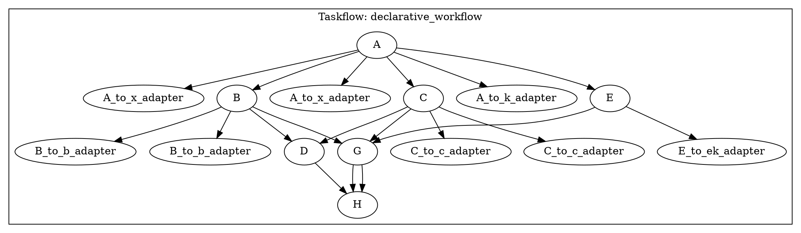

# Key-Based API 设计与实现

## 当前实现状态

### ✅ 已完成的功能

1. **Typed 节点支持 key-value 映射输出**
   - `TypedOutputs` 现在包含 `futures_map`，支持通过 key 访问输出
   - 所有输出都有明确的 key（通过构造函数指定或自动生成）
   - 同时保持类型安全和类型擦除两种访问方式

2. **统一的输出访问接口**
   - `INode::get_output_future(key)` - 获取 type-erased future
   - `INode::get_output_keys()` - 获取所有输出 key
   - `TypedOutputs::get_typed<I>(key)` - 通过 key 获取类型安全的 future

3. **简化的示例代码**
   - 使用 `A->out.get_typed<0>("x")` 替代 `std::get<0>(A->out.futures)`
   - 通过 key 访问输出，代码更清晰

### ⚠️ 仍需改进的部分

1. **节点输入仍需手动获取 futures**
   - 当前：`std::make_tuple(A->out.get_typed<0>("x"))`
   - 期望：通过节点名和 key 自动获取，如 `builder.input("A", "x")`

2. **Functor 仍需要类型信息**
   - 当前：`[](const std::tuple<double>& in) { ... }`
   - 期望：完全类型无关，只通过 key 访问输入值

## 下一步改进方向

### 方向 1: 输入映射 API

为 `TypedNode` 添加构造函数，接受输入映射：

```cpp
// 当前方式
auto B = std::make_shared<wf::TypedNode<B_Inputs, double>>(
  std::make_tuple(A->out.get_typed<0>("x")),
  [](const std::tuple<double>& in) { ... },
  {"b"}, "B"
);

// 改进方式 1: 输入映射
auto B = builder.create_typed_node<double>(
  {{"x", {"A", "x"}}},  // 输入映射：input_key -> {source_node, source_key}
  [](const auto& inputs) {
    double x = inputs.at("x").get<double>();  // type-free access
    return x + 1.0;
  },
  {"b"}, "B"
);
```

### 方向 2: 完全 key-based 构图

```cpp
builder.add_source("A", {{"x", 3.5}, {"k", 7}});
builder.add_node("B", 
  {{"x", "A::x"}},  // 输入：从 A 的 x 输出
  [](const auto& in) { return in.at("x") + 1.0; },
  {"b"}  // 输出 key
);
builder.connect("A", {"x"}, "B", {"x"});  // 自动连接
```

### 方向 3: 声明式构图 API

```cpp
builder
  .source("A", {{"x", 3.5}, {"k", 7}})
  .node("B", inputs("A::x"), [](auto x) { return x + 1.0; }, outputs("b"))
  .node("C", inputs("A::x"), [](auto x) { return 2*x; }, outputs("c"))
  .node("D", inputs("B::b", "C::c"), [](auto b, auto c) { return b*c; }, outputs("prod"))
  .sink("H", inputs("D::prod", "G::sum", "G::parity"));
```

## 技术挑战

1. **Typed 节点的类型安全**
   - Typed 节点需要编译时类型信息
   - 但 key-based 输入是运行时的
   - 需要类型推断或显式类型声明

2. **Functor 的类型擦除**
   - 要支持完全类型无关的 functor，需要运行时类型转换
   - 这可能影响性能（Typed 节点的优势）

3. **向后兼容性**
   - 保持现有 API 可用
   - 新增简化 API 作为可选方式

## 当前 API 示例

```cpp
// 创建源节点（指定输出 keys）
auto A = std::make_shared<wf::TypedSource<double, int>>(
  std::make_tuple(3.5, 7), 
  std::vector<std::string>{"x", "k"},
  "A"
);

// 通过 key 获取 typed future
auto x_fut = A->out.get_typed<0>("x");
auto k_fut = A->out.get_typed<1>("k");

// 创建节点（指定输出 keys）
auto B = std::make_shared<wf::TypedNode</*...*/, double>>(
  std::make_tuple(x_fut),
  [](const std::tuple<double>& in) { ... },
  std::vector<std::string>{"b"},  // 输出 key
  "B"
);

// 通过 key 访问输出（用于连接）
auto b_fut = B->out.get_typed<0>("b");
auto b_any_fut = B->get_output_future("b");  // type-erased

// 统一接口：获取所有输出 keys
auto keys = B->get_output_keys();  // ["b"]
```

## 建议的渐进式改进

### Phase 1: 当前实现 ✅
- Key-based 输出访问
- 统一接口 (`get_output_future`, `get_output_keys`)

### Phase 2: 输入辅助函数
```cpp
// 添加辅助函数简化输入获取
template <typename T>
auto get_input(const GraphBuilder& builder, const std::string& node, const std::string& key);

// 使用
auto B = std::make_shared<wf::TypedNode</*...*/>>(
  std::make_tuple(get_input<double>(builder, "A", "x")),
  ...
);
```

### Phase 3: 高级构图 API
```cpp
// 完全声明式
builder
  .add_typed_source("A", std::make_tuple(3.5, 7), {"x", "k"})
  .add_typed_node("B", {"A::x"}, [](auto x){return x+1;}, {"b"})
  .connect("A", "B", {"x"});
```

### Phase 4: Type-free Functor（可选）
```cpp
// 运行时类型擦除的 functor（性能较低）
builder.add_node("B", 
  {{"x", "A::x"}},
  [](const std::unordered_map<std::string, std::any>& in) {
    double x = std::any_cast<double>(in.at("x"));
    return std::unordered_map<std::string, std::any>{{"b", x + 1.0}};
  },
  {"b"}
);
```



## 总结

当前的实现已经提供了 key-based 输出访问和统一接口，大大简化了代码。下一步可以：

1. **短期**：添加输入辅助函数，简化 future 获取
2. **中期**：提供高级构图 API，支持声明式构建
3. **长期**：考虑完全 type-free 的选项（以性能为代价）

当前 API 在保持类型安全的同时，已经提供了更好的可读性和维护性。

